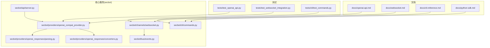
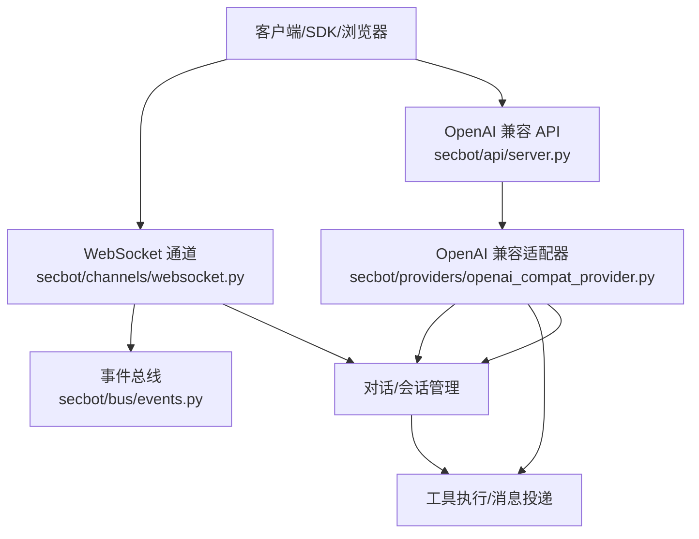
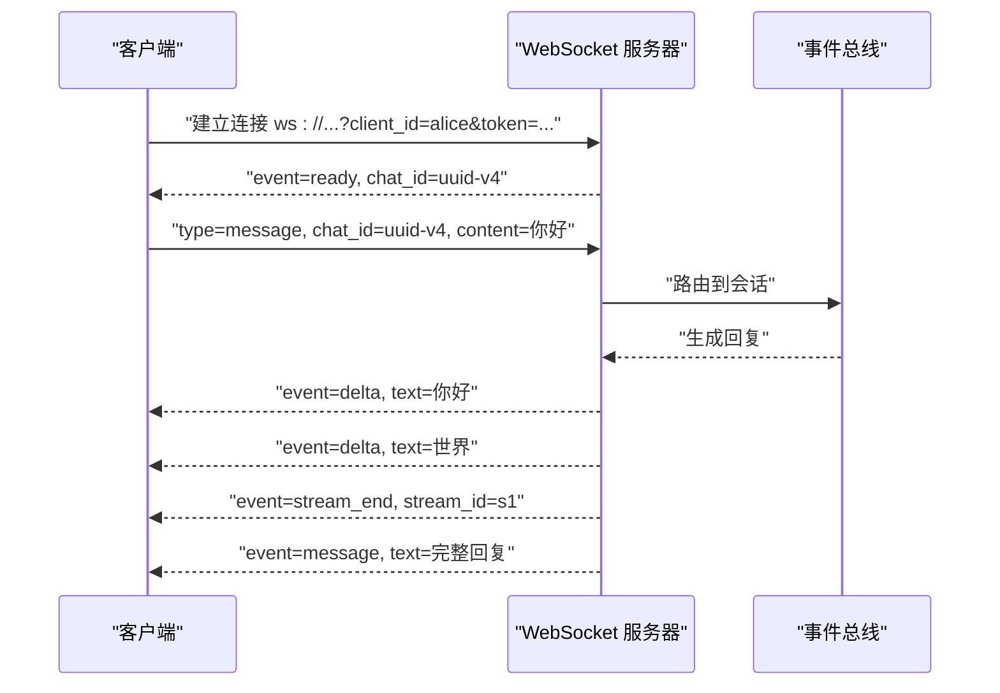
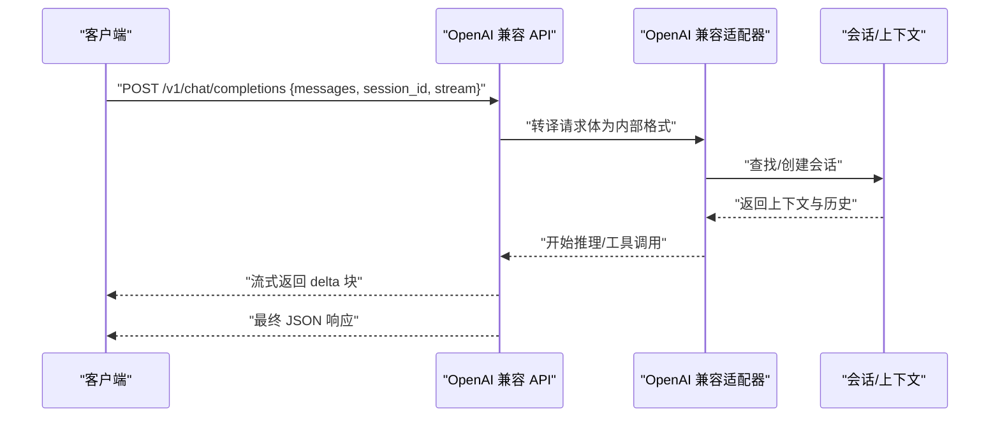
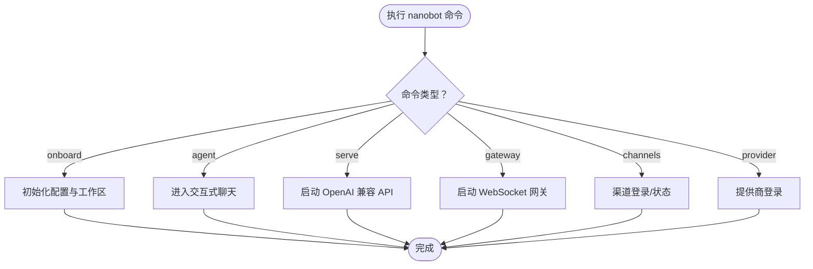
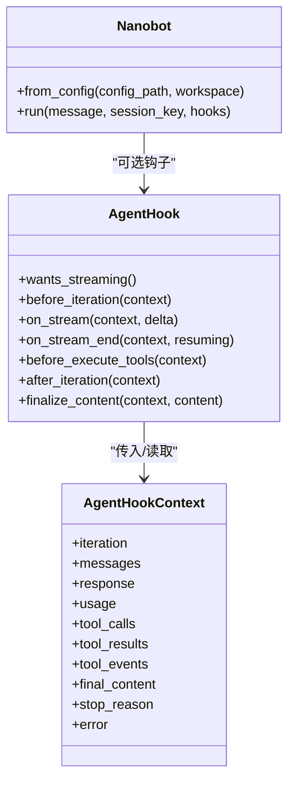
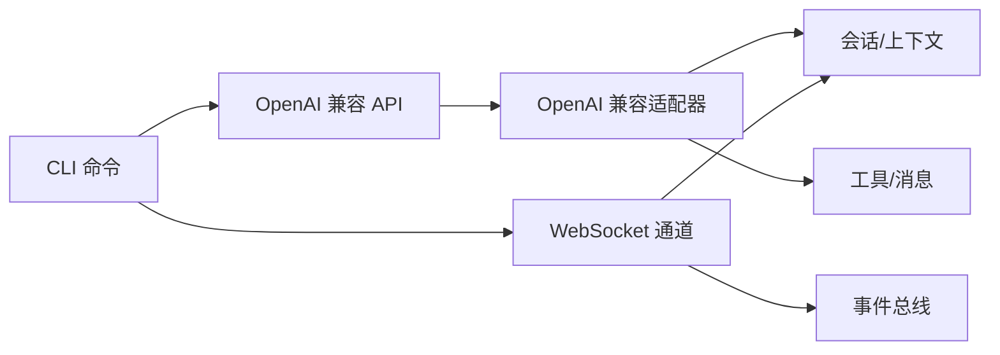

# API参考文档

<cite>
**本文引用的文件**
- [docs/openai-api.md](file://docs/openai-api.md)
- [docs/websocket.md](file://docs/websocket.md)
- [docs/cli-reference.md](file://docs/cli-reference.md)
- [docs/python-sdk.md](file://docs/python-sdk.md)
- [secbot/api/server.py](file://secbot/api/server.py)
- [secbot/channels/websocket.py](file://secbot/channels/websocket.py)
- [secbot/cli/commands.py](file://secbot/cli/commands.py)
- [secbot/providers/openai_compat_provider.py](file://secbot/providers/openai_compat_provider.py)
- [secbot/providers/openai_responses/converters.py](file://secbot/providers/openai_responses/converters.py)
- [secbot/providers/openai_responses/parsing.py](file://secbot/providers/openai_responses/parsing.py)
- [secbot/bus/events.py](file://secbot/bus/events.py)
- [tests/test_openai_api.py](file://tests/test_openai_api.py)
- [tests/test_websocket_integration.py](file://tests/test_websocket_integration.py)
- [tests/cli/test_commands.py](file://tests/cli/test_commands.py)
</cite>

## 目录
1. [简介](#简介)
2. [项目结构](#项目结构)
3. [核心组件](#核心组件)
4. [架构总览](#架构总览)
5. [详细组件分析](#详细组件分析)
6. [依赖关系分析](#依赖关系分析)
7. [性能考量](#性能考量)
8. [故障排除指南](#故障排除指南)
9. [结论](#结论)
10. [附录](#附录)

## 简介
本文件为 nanobot 的 API 参考文档，覆盖以下内容：
- WebSocket 实时通道的连接协议、消息格式与事件类型
- OpenAI 兼容 API 的端点、请求/响应格式与认证方式
- CLI 命令参考（安装、启动、配置与运维）
- Python SDK 使用指南（初始化、运行、钩子与错误处理）
- 版本管理、速率限制与安全注意事项
- 完整的集成示例与常见问题解答

## 项目结构
该仓库采用模块化分层设计：文档位于 docs 目录；核心服务在 secbot 包中实现，包括 API 服务器、WebSocket 通道、CLI 命令、提供商适配器等；测试位于 tests 目录。

**图表来源**
- [docs/openai-api.md](file://docs/openai-api.md)
- [docs/websocket.md](file://docs/websocket.md)
- [docs/cli-reference.md](file://docs/cli-reference.md)
- [docs/python-sdk.md](file://docs/python-sdk.md)
- [secbot/api/server.py](file://secbot/api/server.py)
- [secbot/channels/websocket.py](file://secbot/channels/websocket.py)
- [secbot/cli/commands.py](file://secbot/cli/commands.py)
- [secbot/providers/openai_compat_provider.py](file://secbot/providers/openai_compat_provider.py)
- [secbot/providers/openai_responses/converters.py](file://secbot/providers/openai_responses/converters.py)
- [secbot/providers/openai_responses/parsing.py](file://secbot/providers/openai_responses/parsing.py)
- [secbot/bus/events.py](file://secbot/bus/events.py)
- [tests/test_openai_api.py](file://tests/test_openai_api.py)
- [tests/test_websocket_integration.py](file://tests/test_websocket_integration.py)
- [tests/cli/test_commands.py](file://tests/cli/test_commands.py)

**章节来源**
- [docs/openai-api.md](file://docs/openai-api.md)
- [docs/websocket.md](file://docs/websocket.md)
- [docs/cli-reference.md](file://docs/cli-reference.md)
- [docs/python-sdk.md](file://docs/python-sdk.md)

## 核心组件
- OpenAI 兼容 API：提供 /health、/v1/models、/v1/chat/completions 端点，支持会话隔离、流式传输与多模态文件上传。
- WebSocket 通道：提供持久连接、多聊天并发、令牌认证、TLS 支持与流式增量输出。
- CLI：提供 onboarding、agent 交互、serve（OpenAI 兼容 API）、gateway（WebSocket）等命令。
- Python SDK：以库形式直接在 Python 中运行 agent，支持会话隔离、钩子与可观测性。
- 提供商适配：OpenAI 兼容适配器与响应转换器/解析器，确保 OpenAI 风格的输入/输出。

**章节来源**
- [docs/openai-api.md](file://docs/openai-api.md)
- [docs/websocket.md](file://docs/websocket.md)
- [docs/cli-reference.md](file://docs/cli-reference.md)
- [docs/python-sdk.md](file://docs/python-sdk.md)

## 架构总览
下图展示 OpenAI 兼容 API 与 WebSocket 通道的总体交互关系，以及与提供商适配层的关系。

**图表来源**
- [secbot/api/server.py](file://secbot/api/server.py)
- [secbot/channels/websocket.py](file://secbot/channels/websocket.py)
- [secbot/providers/openai_compat_provider.py](file://secbot/providers/openai_compat_provider.py)
- [secbot/bus/events.py](file://secbot/bus/events.py)

## 详细组件分析

### WebSocket 通道 API
- 连接 URL
  - ws://{host}:{port}{path}?client_id={id}&token={token}
  - 参数说明：client_id 用于访问控制；token 为可选认证令牌（静态或颁发的短期令牌）。
- 认证与安全
  - 支持静态共享密钥与短期令牌颁发；默认要求令牌；支持 TLSv1.2+。
  - allowFrom 控制 client_id 白名单；令牌颁发路径需与 WebSocket 路径不同。
- 多聊天复用
  - 单连接可承载多个 chat_id；支持 new_chat、attach、message 三类 typed envelope。
- 事件类型
  - 服务端到客户端：ready、message、delta、stream_end、attached、error
  - 客户端到服务端：默认文本或带 content/text/message 字段的对象；typed envelope（new_chat/attach/message）

**图表来源**
- [docs/websocket.md](file://docs/websocket.md)
- [secbot/channels/websocket.py](file://secbot/channels/websocket.py)
- [secbot/bus/events.py](file://secbot/bus/events.py)

**章节来源**
- [docs/websocket.md](file://docs/websocket.md)

### OpenAI 兼容 API
- 端点
  - GET /health：健康检查
  - GET /v1/models：列出模型（固定模型名）
  - POST /v1/chat/completions：聊天补全
- 请求/响应
  - 会话隔离：通过 session_id 指定；省略则使用默认会话
  - 单消息输入：messages 中仅含一个用户消息
  - 流式输出：设置 stream=true 返回 Server-Sent Events，以 text/event-stream 形式发送增量块，以 data: [DONE] 结束
  - 文件上传：支持图片、PDF、Word、Excel、PowerPoint；可通过 JSON base64 或 multipart/form-data（单文件最大约 10MB）
- 认证
  - 通过合成的 api 渠道运行，message 工具不会自动发送到 Telegram/Discord 等平台；如需跨渠道主动推送，需显式指定 channel 与 chat_id

**图表来源**
- [docs/openai-api.md](file://docs/openai-api.md)
- [secbot/providers/openai_compat_provider.py](file://secbot/providers/openai_compat_provider.py)
- [secbot/providers/openai_responses/converters.py](file://secbot/providers/openai_responses/converters.py)
- [secbot/providers/openai_responses/parsing.py](file://secbot/providers/openai_responses/parsing.py)

**章节来源**
- [docs/openai-api.md](file://docs/openai-api.md)

### CLI 命令参考
- 初始化与配置
  - nanobot onboard：初始化 ~/.nanobot/ 配置与工作区
  - nanobot onboard --wizard：启动交互式向导
  - nanobot onboard -c <config> -w <workspace>：初始化或刷新指定实例
- 交互式聊天
  - nanobot agent：交互式聊天模式
  - nanobot agent -w <workspace>：针对特定工作区聊天
  - nanobot agent --no-markdown：显示纯文本回复
  - nanobot agent --logs：聊天期间显示运行日志
- 服务启动
  - nanobot serve：启动 OpenAI 兼容 API（默认绑定 127.0.0.1:8900）
  - nanobot gateway：启动 WebSocket 网关
- 渠道与提供商
  - nanobot channels login <channel>：交互式认证渠道
  - nanobot channels status：查看渠道状态
  - nanobot provider login openai-codex：提供商 OAuth 登录

**图表来源**
- [docs/cli-reference.md](file://docs/cli-reference.md)
- [secbot/cli/commands.py](file://secbot/cli/commands.py)

**章节来源**
- [docs/cli-reference.md](file://docs/cli-reference.md)

### Python SDK 使用指南
- 快速开始
  - 从配置创建 Nanobot 实例，调用 run 执行一次对话
- 常见模式
  - 指定配置与工作区路径
  - 使用 session_key 隔离不同会话的历史
  - 添加钩子进行可观测性（工具调用审计、流式回调、后处理）
- API 概览
  - Nanobot.from_config(config_path=None, *, workspace=None)
  - await bot.run(message, *, session_key="sdk:default", hooks=None)
  - RunResult：content、tools_used、messages
- 钩子生命周期
  - wants_streaming、before_iteration、on_stream、on_stream_end、before_execute_tools、after_iteration、finalize_content

**图表来源**
- [docs/python-sdk.md](file://docs/python-sdk.md)

**章节来源**
- [docs/python-sdk.md](file://docs/python-sdk.md)

## 依赖关系分析
- OpenAI 兼容 API 依赖提供商适配器与响应转换器/解析器，确保输入/输出符合 OpenAI 规范。
- WebSocket 通道依赖事件总线进行消息路由与会话管理。
- CLI 命令驱动 API 与网关的启动与配置加载。

**图表来源**
- [secbot/api/server.py](file://secbot/api/server.py)
- [secbot/channels/websocket.py](file://secbot/channels/websocket.py)
- [secbot/providers/openai_compat_provider.py](file://secbot/providers/openai_compat_provider.py)
- [secbot/bus/events.py](file://secbot/bus/events.py)
- [secbot/cli/commands.py](file://secbot/cli/commands.py)

**章节来源**
- [secbot/providers/openai_compat_provider.py](file://secbot/providers/openai_compat_provider.py)
- [secbot/providers/openai_responses/converters.py](file://secbot/providers/openai_responses/converters.py)
- [secbot/providers/openai_responses/parsing.py](file://secbot/providers/openai_responses/parsing.py)
- [secbot/channels/websocket.py](file://secbot/channels/websocket.py)
- [secbot/bus/events.py](file://secbot/bus/events.py)
- [secbot/cli/commands.py](file://secbot/cli/commands.py)

## 性能考量
- 流式传输
  - OpenAI 兼容 API 与 WebSocket 均支持增量输出，降低首字延迟并提升实时体验。
- 文件上传
  - 单文件大小限制约为 10MB；建议根据场景调整最大消息大小与媒体目录访问策略。
- 并发与连接
  - WebSocket 支持多聊天复用与连接保活；合理设置 ping/超时参数避免资源泄露。
- 会话隔离
  - 使用 session_id/session_key 隔离历史，避免跨会话污染导致的重复计算。

[本节为通用指导，无需具体文件引用]

## 故障排除指南
- OpenAI 兼容 API
  - 健康检查失败：确认服务已启动且监听地址正确
  - 流式传输无响应：检查 stream=true 与 SSE 支持
  - 文件上传失败：确认文件类型与大小限制
- WebSocket
  - 连接被拒绝：检查 allowFrom 与 token 配置
  - 无法接收增量：确认 streaming 开启
  - 多聊天复用异常：检查 chat_id 格式与 typed envelope 类型
- CLI
  - 命令不存在：确认安装了正确的包与入口
  - 权限问题：检查配置文件与工作区权限

**章节来源**
- [tests/test_openai_api.py](file://tests/test_openai_api.py)
- [tests/test_websocket_integration.py](file://tests/test_websocket_integration.py)
- [tests/cli/test_commands.py](file://tests/cli/test_commands.py)

## 结论
本文档系统性地梳理了 nanobot 的 WebSocket 实时通道、OpenAI 兼容 API、CLI 与 Python SDK 的使用方法，并提供了架构视图、依赖关系与故障排除建议。建议在生产环境中启用令牌认证与 TLS，合理配置会话隔离与流式传输，以获得更安全、稳定的集成体验。

[本节为总结性内容，无需具体文件引用]

## 附录

### OpenAI 兼容 API 端点与行为摘要
- 端点
  - GET /health：健康检查
  - GET /v1/models：模型列表（固定模型名）
  - POST /v1/chat/completions：聊天补全
- 行为要点
  - 会话隔离：通过 session_id
  - 单消息输入：messages 中仅一个用户消息
  - 流式输出：stream=true 返回 text/event-stream
  - 文件上传：JSON base64 或 multipart/form-data（图片、PDF、Office、文本等）

**章节来源**
- [docs/openai-api.md](file://docs/openai-api.md)

### WebSocket 事件与消息格式摘要
- 连接参数：client_id、token
- 服务端事件：ready、message、delta、stream_end、attached、error
- 客户端消息：默认文本或带 content/text/message；typed envelope（new_chat/attach/message）
- 多聊天复用：chat_id 作为能力标识，首次使用自动附加

**章节来源**
- [docs/websocket.md](file://docs/websocket.md)

### CLI 命令清单
- 初始化：nanobot onboard、nanobot onboard --wizard、nanobot onboard -c/-w
- 交互式聊天：nanobot agent、--no-markdown、--logs
- 启动服务：nanobot serve、nanobot gateway
- 渠道与提供商：nanobot channels login/status、nanobot provider login ...

**章节来源**
- [docs/cli-reference.md](file://docs/cli-reference.md)

### Python SDK 关键 API
- Nanobot.from_config：从配置创建实例
- await bot.run：执行一次对话，支持 session_key 与 hooks
- RunResult：content、tools_used、messages
- 钩子：wants_streaming、before_iteration/on_stream/on_stream_end、before_execute_tools、after_iteration、finalize_content

**章节来源**
- [docs/python-sdk.md](file://docs/python-sdk.md)