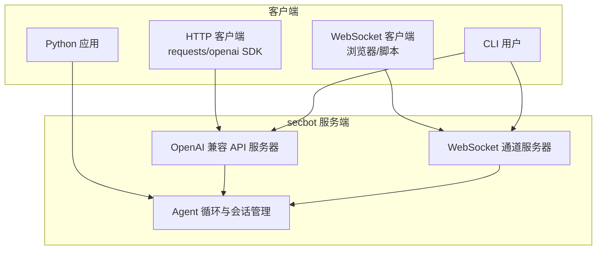
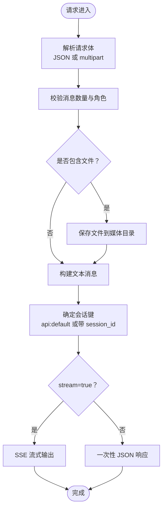
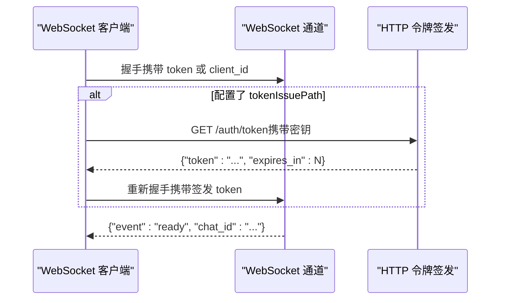
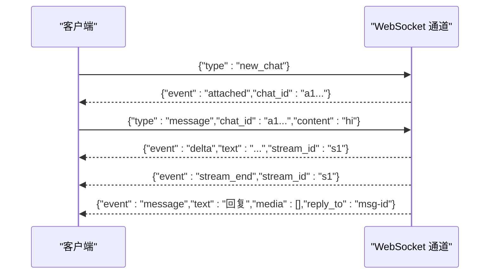
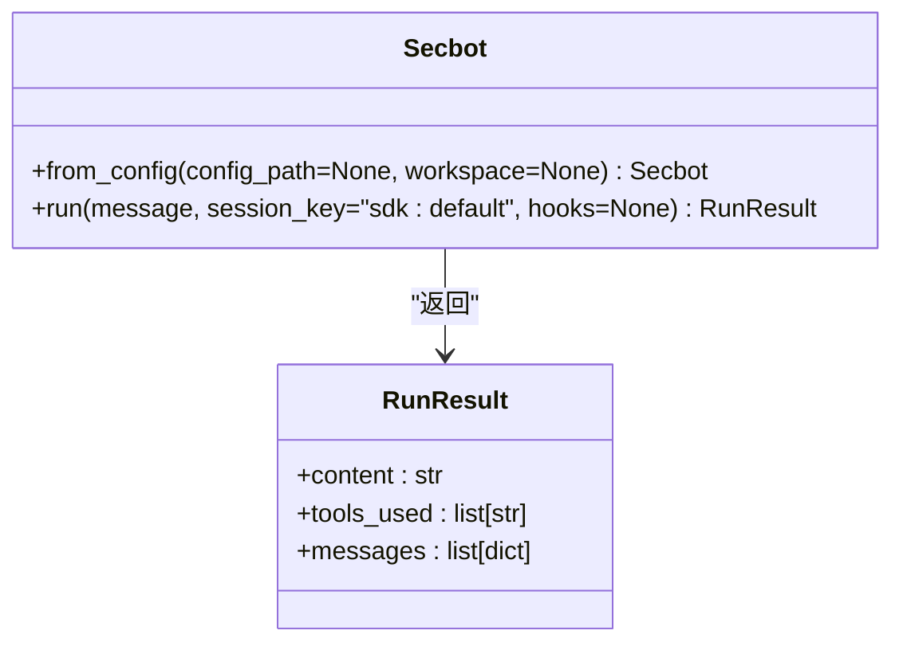
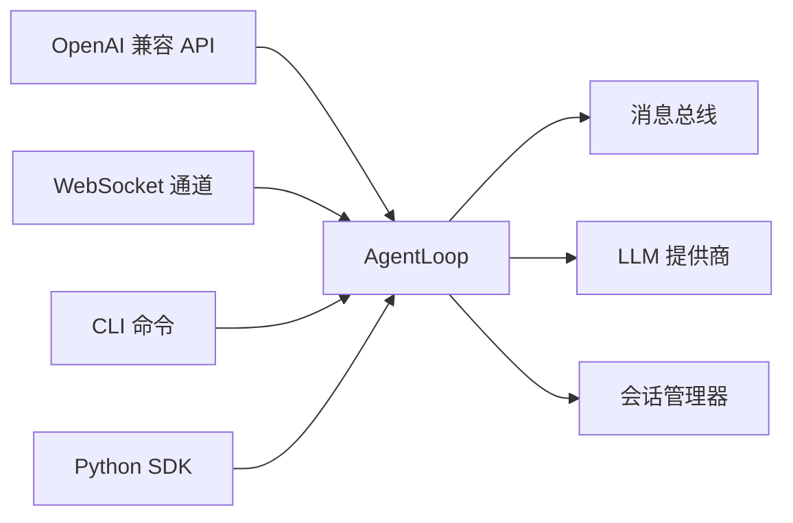

# API参考文档

<cite>
**本文档引用的文件**
- [openai-api.md](file://docs/openai-api.md)
- [websocket.md](file://docs/websocket.md)
- [cli-reference.md](file://docs/cli-reference.md)
- [python-sdk.md](file://docs/python-sdk.md)
- [configuration.md](file://docs/configuration.md)
- [server.py](file://secbot/api/server.py)
- [websocket.py](file://secbot/channels/websocket.py)
- [commands.py](file://secbot/cli/commands.py)
- [secbot.py](file://secbot/secbot.py)
- [__init__.py](file://secbot/__init__.py)
</cite>

## 目录
1. [简介](#简介)
2. [项目结构](#项目结构)
3. [核心组件](#核心组件)
4. [架构总览](#架构总览)
5. [详细组件分析](#详细组件分析)
6. [依赖分析](#依赖分析)
7. [性能考虑](#性能考虑)
8. [故障排除指南](#故障排除指南)
9. [结论](#结论)
10. [附录](#附录)

## 简介
本文件为 VAPT3/secbot 的完整 API 参考文档，覆盖以下能力：
- OpenAI 兼容 HTTP API：端点、请求/响应格式、流式传输、文件上传与媒体处理、错误码与行为约束
- WebSocket 实时通道：连接与鉴权、消息协议、事件类型、多聊天复用、令牌签发与限制
- CLI 命令参考：命令语法、参数、使用示例与退出码
- Python SDK 使用：客户端初始化、方法调用、钩子与可观测性、异常处理
- 配置参数：环境变量、配置文件格式、默认值与优先级
- 版本管理与向后兼容：模型名、响应字段与行为变更策略
- 错误处理与故障排除：常见问题定位与修复建议
- 性能优化与最佳实践：并发、超时、流式与资源限制
- SDK 扩展与自定义：钩子、工具与插件机制

## 项目结构
secbot 提供多种接入方式：
- OpenAI 兼容 API：通过 HTTP 暴露 /v1/chat/completions 与 /v1/models
- WebSocket 通道：作为服务端提供双向实时通信、流式输出与多聊天复用
- CLI：本地交互与网关启动
- Python SDK：以库形式直接集成到应用中



**图表来源**
- [server.py:381-401](file://secbot/api/server.py#L381-L401)
- [websocket.py:1986-2020](file://secbot/channels/websocket.py#L1986-L2020)

**章节来源**
- [openai-api.md:1-122](file://docs/openai-api.md#L1-L122)
- [websocket.md:1-397](file://docs/websocket.md#L1-L397)
- [cli-reference.md:1-22](file://docs/cli-reference.md#L1-L22)
- [python-sdk.md:1-220](file://docs/python-sdk.md#L1-L220)

## 核心组件
- OpenAI 兼容 API 服务器：提供 /v1/chat/completions 与 /v1/models；支持 JSON 与 multipart/form-data；支持 SSE 流式输出；固定模型名；会话隔离；文件上传与媒体处理
- WebSocket 通道：作为服务端监听指定主机/端口；支持静态令牌或签发令牌；支持 TLS；多聊天复用；REST 辅助接口（会话列表、设置、通知、仪表盘等）
- CLI：提供 onboard、agent、serve、gateway、channels、status 等命令；支持交互式聊天与单次消息模式
- Python SDK：Secbot 类封装 AgentLoop；RunResult 返回最终文本、工具使用与消息历史；支持钩子与可观测性
- 配置系统：支持环境变量占位符解析；提供全局与通道级配置；安全与并发控制

**章节来源**
- [server.py:194-351](file://secbot/api/server.py#L194-L351)
- [websocket.py:474-795](file://secbot/channels/websocket.py#L474-L795)
- [commands.py:514-601](file://secbot/cli/commands.py#L514-L601)
- [secbot.py:23-125](file://secbot/secbot.py#L23-L125)
- [configuration.md:10-27](file://docs/configuration.md#L10-L27)

## 架构总览
OpenAI 兼容 API 与 WebSocket 通道均通过 MessageBus 与 AgentLoop 协作，后者负责与 LLM、工具与会话交互。

```mermaid
sequenceDiagram
participant Client as "客户端"
participant API as "OpenAI 兼容 API"
participant Bus as "消息总线"
participant Loop as "Agent 循环"
participant Provider as "LLM 提供商"
Client->>API : POST /v1/chat/completions
API->>Loop : process_direct(消息, 会话键, 回调)
Loop->>Provider : 推理请求
Provider-->>Loop : 流式/非流式响应
Loop-->>API : 处理结果
API-->>Client : JSON 或 SSE 响应
```

**图表来源**
- [server.py:194-351](file://secbot/api/server.py#L194-L351)

**章节来源**
- [server.py:194-351](file://secbot/api/server.py#L194-L351)

## 详细组件分析

### OpenAI 兼容 API

#### 端点与行为
- /health：健康检查
- /v1/models：返回模型列表（固定模型名）
- /v1/chat/completions：支持 JSON 与 multipart/form-data；单用户消息输入；可选 session_id；支持 stream=true 进行 SSE 流式输出；文件上传最大 10MB；媒体路径写入媒体目录



**图表来源**
- [server.py:194-351](file://secbot/api/server.py#L194-L351)

**章节来源**
- [openai-api.md:12-122](file://docs/openai-api.md#L12-L122)
- [server.py:194-351](file://secbot/api/server.py#L194-L351)

#### 请求与响应规范
- HTTP 方法与 URL
  - GET /health
  - GET /v1/models
  - POST /v1/chat/completions
- 请求头
  - Content-Type: application/json 或 multipart/form-data
- 请求体（JSON）
  - messages: 必填，且仅允许一个用户消息
  - session_id: 可选，用于会话隔离
  - model: 可选，不传或与配置一致
  - stream: 可选，布尔值
- 请求体（multipart/form-data）
  - message: 文本消息
  - session_id: 可选
  - model: 可选
  - files: 支持图片、PDF、Word、Excel、PowerPoint（最多 10MB/个）
- 响应
  - 非流式：标准 OpenAI chat.completion JSON
  - 流式：SSE，每段包含 chat.completion.chunk，最后以 [DONE] 结束
- 错误码
  - 400：无效 JSON、文件过大、消息格式错误
  - 413：文件过大或上传无效
  - 504：请求超时
  - 500：内部服务器错误

**章节来源**
- [openai-api.md:33-122](file://docs/openai-api.md#L33-L122)
- [server.py:50-105](file://secbot/api/server.py#L50-L105)
- [server.py:194-351](file://secbot/api/server.py#L194-L351)

#### 文件上传与媒体处理
- JSON 内联图片：支持 data URL（base64），远程 URL 不支持
- multipart/form-data：支持多文件上传，自动保存至媒体目录，生成本地路径
- 最大文件大小：10MB/文件
- 媒体目录：按会话隔离存储

**章节来源**
- [openai-api.md:50-86](file://docs/openai-api.md#L50-L86)
- [server.py:112-186](file://secbot/api/server.py#L112-L186)

#### Python 客户端示例
- requests：发送 JSON 请求，设置超时
- openai SDK：设置 base_url 到 /v1，使用 extra_body 传递 session_id

**章节来源**
- [openai-api.md:88-122](file://docs/openai-api.md#L88-L122)

### WebSocket 通道

#### 连接与鉴权
- 连接 URL：ws://host:port/path?client_id=...&token=...
- 鉴权方式
  - 静态令牌：在配置中设置 token
  - 签发令牌：启用 tokenIssuePath 与 tokenIssueSecret，通过 HTTP 获取一次性令牌
  - 未配置时：websocketRequiresToken 默认为 true，需令牌
- TLS 支持：sslCertfile 与 sslKeyfile 同时设置启用 WSS，最低 TLSv1.2
- 访问控制：allowFrom 白名单



**图表来源**
- [websocket.md:217-261](file://docs/websocket.md#L217-L261)
- [websocket.py:631-654](file://secbot/channels/websocket.py#L631-L654)

**章节来源**
- [websocket.md:69-80](file://docs/websocket.md#L69-L80)
- [websocket.md:167-217](file://docs/websocket.md#L167-L217)
- [websocket.py:593-606](file://secbot/channels/websocket.py#L593-L606)

#### 消息协议与事件
- 服务端事件
  - ready：连接建立后立即返回，包含 chat_id 与 client_id
  - message：完整回复，含 text、media（可选）、reply_to（可选）
  - delta：流式分片，含 text 与 stream_id
  - stream_end：流结束信号
  - attached：订阅新聊天或附加现有聊天确认
  - error：软错误，连接保持开放
- 客户端帧
  - 旧版：纯文本或 {"content": "..."} 对象
  - 新版：带 type 字段的结构化信封
    - new_chat：新建聊天并订阅
    - attach：附加到已有聊天
    - message：向指定 chat_id 发送消息



**图表来源**
- [websocket.md:269-294](file://docs/websocket.md#L269-L294)

**章节来源**
- [websocket.md:84-166](file://docs/websocket.md#L84-L166)
- [websocket.md:269-305](file://docs/websocket.md#L269-L305)

#### 多聊天复用与安全边界
- 一个连接可同时承载多个 chat_id
- chat_id 是能力边界：持有有效令牌与 chat_id 即可附加并查看输出
- 建议多租户部署时对 chat_id 进行命名空间隔离

**章节来源**
- [websocket.md:269-310](file://docs/websocket.md#L269-L310)

#### REST 辅助接口（嵌入式 WebUI）
- /api/sessions：列出会话（过滤 websocket 前缀）
- /api/settings：读取/更新设置
- /api/commands：内置命令列表
- /api/notifications：通知中心
- /api/events：活动事件流
- /api/media/<sig>/<path>：签名媒体下载
- /api/dashboard/*：仪表盘聚合数据
- /api/reports：报告元数据

**章节来源**
- [websocket.py:657-795](file://secbot/channels/websocket.py#L657-L795)
- [websocket.py:856-918](file://secbot/channels/websocket.py#L856-L918)
- [websocket.py:1053-1091](file://secbot/channels/websocket.py#L1053-L1091)

### CLI 命令参考

#### 命令与参数
- nanobot onboard：初始化配置与工作区
- nanobot agent：与代理聊天
  - -m/--message：直接发送消息
  - -s/--session：会话标识
  - -w/--workspace：工作区覆盖
  - -c/--config：配置文件路径
  - --[no-]markdown：Markdown 渲染开关
  - --[no-]logs：显示运行日志
- nanobot serve：启动 OpenAI 兼容 API
  - -p/--port：端口
  - -H/--host：绑定地址
  - -t/--timeout：请求超时
  - -w/--workspace：工作区
  - -c/--config：配置文件
  - -v/--verbose：显示运行日志
- nanobot gateway：启动网关
  - -p/--port：端口
  - -w/--workspace：工作区
  - -c/--config：配置文件
  - -v/--verbose：详细输出
- nanobot channels login/status：频道登录与状态
- nanobot provider login：提供商 OAuth 登录
- nanobot status：显示状态

**章节来源**
- [cli-reference.md:3-22](file://docs/cli-reference.md#L3-L22)
- [commands.py:514-601](file://secbot/cli/commands.py#L514-L601)
- [commands.py:1077-1309](file://secbot/cli/commands.py#L1077-L1309)

#### 退出代码
- 成功：0
- 配置/参数错误：1
- 运行时异常：根据具体实现抛出或返回非零值

**章节来源**
- [cli-reference.md:21-22](file://docs/cli-reference.md#L21-L22)
- [commands.py:339-371](file://secbot/cli/commands.py#L339-L371)

### Python SDK 使用

#### 初始化与运行
- Secbot.from_config：从配置文件创建实例，支持覆盖工作区
- bot.run：执行一次对话，返回 RunResult（content、tools_used、messages）



**图表来源**
- [secbot.py:23-125](file://secbot/secbot.py#L23-L125)

**章节来源**
- [python-sdk.md:63-93](file://docs/python-sdk.md#L63-L93)
- [secbot.py:23-125](file://secbot/secbot.py#L23-L125)

#### 钩子与可观测性
- AgentHook：生命周期钩子，支持 wants_streaming、on_stream、finalize_content 等
- SDKCaptureHook：捕获工具使用与消息历史

**章节来源**
- [python-sdk.md:94-173](file://docs/python-sdk.md#L94-L173)
- [secbot.py:9-11](file://secbot/secbot.py#L9-L11)

#### 异常处理
- 配置不存在：FileNotFoundError
- 运行时异常：由底层 AgentLoop 抛出或记录日志

**章节来源**
- [python-sdk.md:74-75](file://docs/python-sdk.md#L74-L75)
- [secbot.py:56-58](file://secbot/secbot.py#L56-L58)

### 配置参数

#### 环境变量与配置文件
- 环境变量：在配置中使用 ${VAR_NAME} 引用，启动时解析
- 配置文件：~/.nanobot/config.json
- 优先级：命令行覆盖 > 环境变量解析后的配置 > 默认值

**章节来源**
- [configuration.md:10-27](file://docs/configuration.md#L10-L27)

#### WebSocket 通道配置
- 连接：host、port、path、maxMessageBytes
- 鉴权：token、websocketRequiresToken、tokenIssuePath、tokenIssueSecret、tokenTtlS
- 访问控制：allowFrom
- 流式：streaming
- 保活：pingIntervalS、pingTimeoutS
- TLS：sslCertfile、sslKeyfile

**章节来源**
- [websocket.md:167-217](file://docs/websocket.md#L167-L217)

#### OpenAI 兼容 API 配置
- 绑定地址与端口、请求超时、模型名（固定）
- 会话键：api:default 或带 session_id

**章节来源**
- [openai-api.md:10-17](file://docs/openai-api.md#L10-L17)
- [commands.py:542-546](file://secbot/cli/commands.py#L542-L546)

#### 全局与通道级设置
- 全局：sendProgress、sendToolHints、sendMaxRetries、transcriptionProvider、transcriptionLanguage
- 通道覆盖：各通道可独立设置上述字段

**章节来源**
- [configuration.md:667-710](file://docs/configuration.md#L667-L710)

## 依赖分析



**图表来源**
- [server.py:549-574](file://secbot/api/server.py#L549-L574)
- [websocket.py:640-701](file://secbot/channels/websocket.py#L640-L701)
- [commands.py:549-574](file://secbot/cli/commands.py#L549-L574)
- [secbot.py:69-91](file://secbot/secbot.py#L69-L91)

**章节来源**
- [server.py:549-574](file://secbot/api/server.py#L549-L574)
- [websocket.py:640-701](file://secbot/channels/websocket.py#L640-L701)
- [commands.py:549-574](file://secbot/cli/commands.py#L549-L574)
- [secbot.py:69-91](file://secbot/secbot.py#L69-L91)

## 性能考虑
- 并发与锁：API 会话键使用 asyncio.Lock 串行化请求，避免竞态
- 超时控制：请求超时可配置，默认约 120 秒
- 流式传输：SSE 流式输出减少首字节延迟
- 媒体处理：限制单文件大小与总数，避免内存压力
- WebSocket：maxMessageBytes 控制入站消息上限，防止 DoS
- 令牌签发：限制 outstanding tokens 数量，防止令牌洪泛

**章节来源**
- [server.py:228-230](file://secbot/api/server.py#L228-L230)
- [server.py:341-348](file://secbot/api/server.py#L341-L348)
- [websocket.py:607-629](file://secbot/channels/websocket.py#L607-L629)

## 故障排除指南
- API 413（文件过大）：检查单文件大小与总数，确保不超过 10MB/个
- API 504（超时）：增大请求超时或优化模型/工具调用
- WebSocket 401/403：确认令牌正确或 allowFrom 白名单配置
- WebSocket 404：确认握手路径与配置 path 一致
- 空响应：API 在空响应时会重试并回退到预设文本
- 令牌过多：签发令牌上限为 10,000，超过返回 429

**章节来源**
- [server.py:219-224](file://secbot/api/server.py#L219-L224)
- [server.py:341-348](file://secbot/api/server.py#L341-L348)
- [websocket.py:642-647](file://secbot/channels/websocket.py#L642-L647)
- [websocket.py:829-840](file://secbot/channels/websocket.py#L829-L840)

## 结论
本参考文档系统性地梳理了 secbot 的 OpenAI 兼容 API、WebSocket 通道、CLI 与 Python SDK 的使用方式，并提供了配置、错误处理与性能优化建议。建议在生产环境中：
- 使用签发令牌替代静态令牌
- 合理设置超时与并发
- 严格控制媒体文件大小与数量
- 通过钩子与可观测性增强调试与监控

## 附录

### API 版本管理与向后兼容
- 模型名固定为配置中的 model 名称，API 层不接受外部覆盖
- SSE 分块格式遵循 OpenAI 兼容结构，最后以 [DONE] 结束
- WebSocket 事件与信封格式保持稳定，新增事件不会破坏旧客户端（软错误）

**章节来源**
- [openai-api.md:14-17](file://docs/openai-api.md#L14-L17)
- [server.py:87-105](file://secbot/api/server.py#L87-L105)
- [websocket.md:137-141](file://docs/websocket.md#L137-L141)

### SDK 扩展与自定义
- 自定义钩子：实现 AgentHook 生命周期方法，支持流式回调与内容后处理
- 工具与 MCP：通过配置注册外部工具服务器，无缝融入 AgentLoop

**章节来源**
- [python-sdk.md:94-173](file://docs/python-sdk.md#L94-L173)
- [configuration.md:926-999](file://docs/configuration.md#L926-L999)