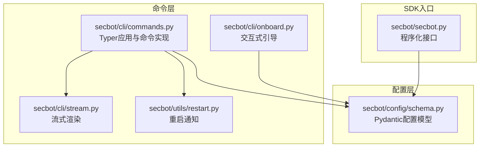
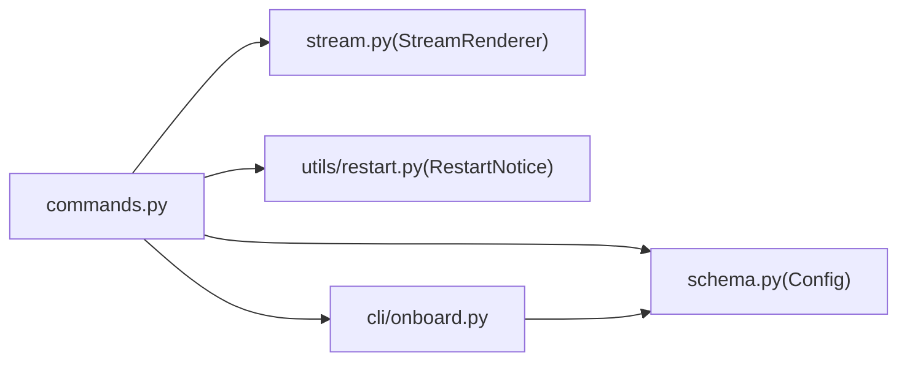

# CLI命令参考

<cite>
**本文档引用的文件**
- [secbot/cli/commands.py](file://secbot/cli/commands.py)
- [secbot/cli/onboard.py](file://secbot/cli/onboard.py)
- [secbot/cli/stream.py](file://secbot/cli/stream.py)
- [secbot/config/schema.py](file://secbot/config/schema.py)
- [secbot/utils/restart.py](file://secbot/utils/restart.py)
- [secbot/secbot.py](file://secbot/secbot.py)
- [docs/cli-reference.md](file://docs/cli-reference.md)
- [docs/configuration.md](file://docs/configuration.md)
- [tests/cli/test_commands.py](file://tests/cli/test_commands.py)
- [tests/cli/test_restart_command.py](file://tests/cli/test_restart_command.py)
</cite>

## 目录
1. [简介](#简介)
2. [项目结构](#项目结构)
3. [核心组件](#核心组件)
4. [架构总览](#架构总览)
5. [详细组件分析](#详细组件分析)
6. [依赖分析](#依赖分析)
7. [性能考虑](#性能考虑)
8. [故障排查指南](#故障排查指南)
9. [结论](#结论)
10. [附录](#附录)

## 简介
本文件为 VAPT3（secbot）命令行工具的完整参考文档，覆盖所有可用命令的语法、参数、选项、使用示例、退出码、错误处理与调试选项，并解释命令与配置文件的关系。重点命令包括：
- 初始化与配置：onboard、status
- 代理交互：agent
- 服务启动：serve（OpenAI兼容API）、gateway（网关）
- OAuth登录：provider login/logout
- 渠道管理：channels status/login
- 插件管理：plugins list
- 运行时重启：/restart（内置命令）

本参考面向不同技术背景的用户，既提供高层概览，也给出代码级映射以便深入理解。

## 项目结构
secbot 的 CLI 命令由 Typer 定义，集中于命令模块；配置模型采用 Pydantic；运行时渲染与流式输出由独立模块负责；重启通知通过环境变量在进程间传递。



图示来源
- [secbot/cli/commands.py:1-1731](file://secbot/cli/commands.py#L1-L1731)
- [secbot/cli/onboard.py:1-1127](file://secbot/cli/onboard.py#L1-L1127)
- [secbot/cli/stream.py:1-143](file://secbot/cli/stream.py#L1-L143)
- [secbot/config/schema.py:1-376](file://secbot/config/schema.py#L1-L376)
- [secbot/utils/restart.py:1-85](file://secbot/utils/restart.py#L1-L85)
- [secbot/secbot.py:1-132](file://secbot/secbot.py#L1-L132)

章节来源
- [secbot/cli/commands.py:1-1731](file://secbot/cli/commands.py#L1-L1731)
- [secbot/config/schema.py:1-376](file://secbot/config/schema.py#L1-L376)

## 核心组件
- 命令应用与路由：Typer 应用实例承载所有子命令与子组（channels、plugins、provider），并提供全局选项（如版本）。
- 配置加载与校验：通过 Pydantic 模型解析配置文件，支持环境变量注入与别名字段（驼峰/蛇形）。
- 流式渲染：Rich Live + 自定义状态指示器，保证稳定、无闪烁的终端输出体验。
- 重启通知：通过环境变量在重启前后传递通知消息，确保 CLI 会话可见重启完成提示。
- 交互式引导：onboard 提供交互式向导，生成或刷新配置并同步工作区模板。

章节来源
- [secbot/cli/commands.py:74-82](file://secbot/cli/commands.py#L74-L82)
- [secbot/config/schema.py:267-376](file://secbot/config/schema.py#L267-L376)
- [secbot/cli/stream.py:34-143](file://secbot/cli/stream.py#L34-L143)
- [secbot/utils/restart.py:18-85](file://secbot/utils/restart.py#L18-L85)
- [secbot/cli/onboard.py:30-1127](file://secbot/cli/onboard.py#L30-L1127)

## 架构总览
下图展示 CLI 命令到运行时组件的调用关系与数据流。

```mermaid
sequenceDiagram
participant U as "用户"
participant CLI as "Typer命令(app)"
participant CFG as "配置加载(schema.Config)"
participant PRV as "提供商工厂(factory)"
participant BUS as "消息总线(MessageBus)"
participant LOOP as "代理循环(AgentLoop)"
participant OUT as "输出(stream/控制台)"
U->>CLI : 执行命令(如 secbot agent)
CLI->>CFG : 解析/加载配置(支持--config/-c, --workspace/-w)
CLI->>PRV : 构建提供商(按模型/前缀自动匹配)
CLI->>BUS : 创建消息总线
CLI->>LOOP : 初始化AgentLoop(注入provider, 工作区, 工具配置)
CLI->>OUT : 渲染Markdown/文本/进度
LOOP-->>OUT : 流式输出(delta/结束)
CLI-->>U : 返回结果/日志/退出码
```

图示来源
- [secbot/cli/commands.py:514-601](file://secbot/cli/commands.py#L514-L601)
- [secbot/cli/commands.py:1077-1308](file://secbot/cli/commands.py#L1077-L1308)
- [secbot/config/schema.py:267-376](file://secbot/config/schema.py#L267-L376)
- [secbot/cli/stream.py:69-143](file://secbot/cli/stream.py#L69-L143)

## 详细组件分析

### onboard 初始化与配置
- 功能：初始化或刷新配置文件与工作区目录，支持交互式向导。
- 关键选项
  - --workspace/-w：覆盖工作区路径
  - --config/-c：指定配置文件路径
  - --wizard：启用交互式引导
- 行为要点
  - 若未指定配置路径，使用默认配置路径；若存在则询问是否覆盖或刷新合并。
  - 刷新时保留现有值并合并缺失默认字段。
  - 同步工作区模板，确保初始文件齐全。
  - 注入渠道默认配置（内置与插件发现）。
- 退出码
  - 成功：0；失败：1（典型为配置加载/保存异常）。
- 使用示例
  - secbot onboard
  - secbot onboard --wizard
  - secbot onboard -c ~/.secbot/config.json -w ~/workspace
- 参数验证
  - --config 指定的文件必须存在（刷新模式下）；否则报错并退出。
  - 交互式向导依赖可选依赖（questionary），缺失时报错并指导安装。
- 与配置文件的关系
  - 默认配置文件位于用户主目录下的工作区中；可通过 --config 指定。
  - 配置项遵循 Pydantic 模型，支持别名（camelCase/snake_case）与环境变量注入。

章节来源
- [secbot/cli/commands.py:304-400](file://secbot/cli/commands.py#L304-L400)
- [secbot/cli/commands.py:416-438](file://secbot/cli/commands.py#L416-L438)
- [secbot/cli/onboard.py:1-1127](file://secbot/cli/onboard.py#L1-L1127)
- [secbot/config/schema.py:267-376](file://secbot/config/schema.py#L267-L376)
- [tests/cli/test_commands.py:58-173](file://tests/cli/test_commands.py#L58-L173)

### agent 交互式代理
- 功能：与代理进行单轮对话或进入交互模式；支持 Markdown 渲染与运行时日志。
- 关键选项
  - --message/-m：一次性发送消息（非交互模式）
  - --session/-s：会话标识（默认 cli:direct）
  - --workspace/-w：覆盖工作区路径
  - --config/-c：指定配置文件
  - --markdown/--no-markdown：控制输出渲染
  - --logs/--no-logs：显示运行时日志
- 行为要点
  - 单次消息模式：直接调用 AgentLoop.process_direct，结束后关闭 MCP 连接。
  - 交互模式：通过消息总线驱动，支持进度/工具提示/流式输出；支持退出命令（exit、quit、/exit、/quit、:q、Ctrl+D）。
  - 进程信号处理：捕获 SIGINT/SIGTERM 并优雅退出；Windows 下忽略 SIGPIPE。
  - 重启通知：若存在重启完成通知且匹配当前会话，会在首次输出时打印“重启完成”提示。
- 退出码
  - 正常：0；键盘中断/EOF：0；异常：1。
- 使用示例
  - secbot agent -m "你好"
  - secbot agent -s telegram:user1
  - secbot agent --logs
  - secbot agent --no-markdown
- 参数验证
  - --config 指定的文件需存在；否则报错并退出。
  - 会话 ID 支持 channel:chat_id 形式。
- 与配置文件的关系
  - 通过 _load_runtime_config 加载并解析环境变量；支持工作区迁移（默认工作区）。
  - 工具配置、上下文窗口、最大迭代次数等均来自配置模型。

```mermaid
sequenceDiagram
participant U as "用户"
participant CLI as "agent命令"
participant CFG as "配置加载"
participant LOOP as "AgentLoop"
participant OUT as "流式渲染"
U->>CLI : secbot agent -m "..."/交互模式
CLI->>CFG : _load_runtime_config(--config, --workspace)
CLI->>LOOP : 初始化(注入provider, 工具, 会话)
alt 单次消息
CLI->>LOOP : process_direct(...)
LOOP-->>CLI : 返回响应
CLI-->>OUT : 渲染Markdown/文本
else 交互模式
CLI->>LOOP : run() + 消费出站消息
LOOP-->>CLI : on_progress/_stream_delta/_stream_end
CLI-->>OUT : 实时渲染/进度/工具提示
end
```

图示来源
- [secbot/cli/commands.py:1077-1308](file://secbot/cli/commands.py#L1077-L1308)
- [secbot/cli/stream.py:69-143](file://secbot/cli/stream.py#L69-L143)
- [secbot/utils/restart.py:76-85](file://secbot/utils/restart.py#L76-L85)

章节来源
- [secbot/cli/commands.py:1077-1308](file://secbot/cli/commands.py#L1077-L1308)
- [secbot/cli/stream.py:69-143](file://secbot/cli/stream.py#L69-L143)
- [secbot/utils/restart.py:26-85](file://secbot/utils/restart.py#L26-L85)
- [tests/cli/test_commands.py:623-787](file://tests/cli/test_commands.py#L623-L787)

### serve OpenAI 兼容 API 服务器
- 功能：启动 OpenAI 兼容的聊天补全 API 服务（/v1/chat/completions）。
- 关键选项
  - --port/-p：绑定端口（默认来自配置）
  - --host/-H：绑定地址（默认来自配置）
  - --timeout/-t：请求超时（秒，默认来自配置）
  - --verbose/-v：开启运行时日志
  - --workspace/-w：覆盖工作区路径
  - --config/-c：指定配置文件
- 行为要点
  - 依赖 aiohttp；缺失时提示安装扩展包。
  - 绑定地址为 0.0.0.0 或 :: 时发出安全警告。
  - 启动时构建 AgentLoop、消息总线、会话管理器与提供商快照。
- 退出码
  - 正常：0；异常：1。
- 使用示例
  - secbot serve
  - secbot serve -p 8000 -H 0.0.0.0
  - secbot serve --verbose
- 参数验证
  - --config 指定的文件需存在；否则报错并退出。
- 与配置文件的关系
  - 从配置读取 host/port/timeout；模型名称与工具配置来自 agents.defaults 与 tools.*。

章节来源
- [secbot/cli/commands.py:514-601](file://secbot/cli/commands.py#L514-L601)
- [secbot/config/schema.py:182-188](file://secbot/config/schema.py#L182-L188)
- [tests/cli/test_commands.py:1-200](file://tests/cli/test_commands.py#L1-L200)

### gateway 网关服务
- 功能：启动 secbot 网关，集成通道、心跳、定时任务与健康检查端点。
- 关键选项
  - --port/-p：网关端口（默认来自配置）
  - --workspace/-w：覆盖工作区路径
  - --verbose/-v：详细日志
  - --config/-c：指定配置文件
- 行为要点
  - 构建提供商快照、消息总线、会话管理器与 Cron 服务（工作区作用域）。
  - 注册系统级 Dream 任务（周期性记忆整理）。
  - 启动通道管理器、心跳服务、健康检查（/health）。
  - 支持浏览器自动打开（可选）。
- 退出码
  - 正常：0；异常：1。
- 使用示例
  - secbot gateway
  - secbot gateway -p 18790
  - secbot gateway --verbose
- 参数验证
  - --config 指定的文件需存在；否则报错并退出。
- 与配置文件的关系
  - 从配置读取 host/port、心跳间隔、工具与提供商设置。

章节来源
- [secbot/cli/commands.py:608-1069](file://secbot/cli/commands.py#L608-L1069)
- [secbot/config/schema.py:190-196](file://secbot/config/schema.py#L190-L196)
- [tests/cli/test_commands.py:1-200](file://tests/cli/test_commands.py#L1-L200)

### provider OAuth 登录与登出
- 子命令组：provider
- 子命令
  - provider login <provider>：OAuth 登录（支持 openai-codex、github-copilot）
  - provider logout <provider>：OAuth 登出
- 行为要点
  - login：根据提供商注册表选择处理器，执行交互式登录流程。
  - logout：删除本地 OAuth 凭据文件（含锁文件），并报告结果。
- 退出码
  - 成功：0；未知提供商/依赖缺失：1。
- 使用示例
  - secbot provider login openai-codex
  - secbot provider logout github-copilot
- 参数验证
  - 不支持的提供商：报错并退出。
  - 缺少依赖库：提示安装相应包后重试。

章节来源
- [secbot/cli/commands.py:1604-1731](file://secbot/cli/commands.py#L1604-L1731)
- [tests/cli/test_commands.py:223-280](file://tests/cli/test_commands.py#L223-L280)

### channels 渠道管理
- 子命令组：channels
- 子命令
  - channels status：显示已发现渠道的启用状态
  - channels login <channel> [--force/-f] [--config/-c]：对指定渠道进行登录（二维码/交互）
- 行为要点
  - status：遍历渠道注册表，读取配置中的 enabled 字段并输出表格。
  - login：校验渠道存在性，调用渠道类的 login 方法。
- 退出码
  - 成功：0；未知渠道/构建失败：1。
- 使用示例
  - secbot channels status
  - secbot channels login weixin --force
  - secbot channels login whatsapp --config ~/.secbot/config.json

章节来源
- [secbot/cli/commands.py:1320-1471](file://secbot/cli/commands.py#L1320-L1471)
- [tests/cli/test_commands.py:1-200](file://tests/cli/test_commands.py#L1-L200)

### plugins 插件管理
- 子命令组：plugins
- 子命令
  - plugins list：列出所有渠道（内置与插件），标注来源与启用状态
- 行为要点
  - 读取配置，遍历渠道注册表，输出表格。
- 退出码
  - 成功：0。
- 使用示例
  - secbot plugins list

章节来源
- [secbot/cli/commands.py:1481-1512](file://secbot/cli/commands.py#L1481-L1512)
- [tests/cli/test_commands.py:1-200](file://tests/cli/test_commands.py#L1-L200)

### status 状态查询
- 功能：显示配置文件、工作区与提供商密钥状态。
- 行为要点
  - 输出配置路径是否存在、工作区是否存在。
  - 遍历提供商注册表，检测 OAuth/本地/通用提供商的密钥状态。
- 退出码
  - 成功：0。
- 使用示例
  - secbot status

章节来源
- [secbot/cli/commands.py:1520-1556](file://secbot/cli/commands.py#L1520-L1556)
- [tests/cli/test_commands.py:1-200](file://tests/cli/test_commands.py#L1-L200)

### /restart 内置命令（运行时）
- 功能：触发进程重启，重启完成后在 CLI 会话中显示“重启完成”提示。
- 行为要点
  - 将重启通知写入环境变量（通道、会话、开始时间、元数据）。
  - 在下一个 CLI 进程启动时，若匹配当前会话，打印“重启完成（耗时）”。
- 退出码
  - 成功：0；异常：1。
- 使用示例
  - 在任意渠道内输入 /restart 触发重启；随后在 CLI 中看到重启完成提示。

章节来源
- [secbot/utils/restart.py:36-85](file://secbot/utils/restart.py#L36-L85)
- [tests/cli/test_restart_command.py:47-111](file://tests/cli/test_restart_command.py#L47-L111)

## 依赖分析
- 命令与配置
  - 所有命令通过 _load_runtime_config 加载配置，支持 --config 与 --workspace 覆盖。
  - 配置模型定义了 agents.defaults、tools.*、providers.*、api、gateway 等关键域。
- 命令与运行时
  - agent/serve/gateway 均依赖 AgentLoop、MessageBus、SessionManager、Provider 快照。
  - 流式输出依赖 StreamRenderer 与 ThinkingSpinner。
- 命令与重启
  - restart 通知通过环境变量跨进程传递，CLI 在启动时消费并清理。



图示来源
- [secbot/cli/commands.py:1-1731](file://secbot/cli/commands.py#L1-L1731)
- [secbot/config/schema.py:267-376](file://secbot/config/schema.py#L267-L376)
- [secbot/cli/stream.py:69-143](file://secbot/cli/stream.py#L69-L143)
- [secbot/utils/restart.py:18-85](file://secbot/utils/restart.py#L18-L85)
- [secbot/cli/onboard.py:1-1127](file://secbot/cli/onboard.py#L1-L1127)

章节来源
- [secbot/cli/commands.py:1-1731](file://secbot/cli/commands.py#L1-L1731)
- [secbot/config/schema.py:267-376](file://secbot/config/schema.py#L267-L376)

## 性能考虑
- 流式渲染
  - 使用 Rich Live 与自定义状态指示器，避免频繁刷新导致的闪烁与竞争条件。
  - on_delta/on_end 控制渲染节奏，减少不必要的屏幕更新。
- 日志级别
  - --verbose 开启运行时日志，可能影响性能；建议仅在调试时使用。
- 工作区与模板
  - 同步工作区模板仅在初始化或引导阶段执行，避免重复开销。
- 网络与超时
  - serve/gateway 的超时与绑定策略直接影响响应时间与安全性，建议合理配置。

## 故障排查指南
- 配置文件问题
  - --config 指定的文件不存在：命令会报错并退出（退出码 1）。请确认路径正确或先执行 onboard。
  - 配置键过期：命令会提示移除旧键（例如 memoryWindow）。
- 依赖缺失
  - serve 需要 aiohttp；缺失时会提示安装扩展包。
  - OAuth 登录需要相应依赖库；缺失时会提示安装。
- 渠道登录失败
  - 未知渠道：请检查渠道名称是否存在于注册表。
  - 依赖缺失：安装对应渠道所需的运行时依赖。
- 重启通知不显示
  - 确认当前会话与通知中的会话匹配；仅 CLI 通道支持此提示。
  - 检查环境变量是否被其他进程覆盖或清理。

章节来源
- [secbot/cli/commands.py:468-494](file://secbot/cli/commands.py#L468-L494)
- [secbot/cli/commands.py:524-528](file://secbot/cli/commands.py#L524-L528)
- [secbot/cli/commands.py:1456-1471](file://secbot/cli/commands.py#L1456-L1471)
- [secbot/utils/restart.py:76-85](file://secbot/utils/restart.py#L76-L85)

## 结论
本参考文档系统梳理了 secbot CLI 的全部核心命令及其参数、行为与配置关系。通过统一的配置模型与命令实现，用户可以快速完成初始化、交互式对话、服务启动与运维操作。建议在生产环境中谨慎配置网络绑定与超时参数，并优先使用配置文件与环境变量管理敏感信息。

## 附录

### 命令速查表
- secbot onboard [--workspace/-w] [--config/-c] [--wizard]
- secbot agent [--message/-m] [--session/-s] [--workspace/-w] [--config/-c] [--markdown/--no-markdown] [--logs/--no-logs]
- secbot serve [--port/-p] [--host/-H] [--timeout/-t] [--verbose/-v] [--workspace/-w] [--config/-c]
- secbot gateway [--port/-p] [--workspace/-w] [--verbose/-v] [--config/-c]
- secbot status
- secbot provider login <provider>
- secbot provider logout <provider>
- secbot channels status
- secbot channels login <channel> [--force/-f] [--config/-c]
- secbot plugins list

### 与配置文件的关系
- 配置文件位置与格式
  - 默认位于用户主目录的工作区中；可通过 --config 指定。
  - 支持环境变量注入（${VAR}）与别名字段（camelCase/snake_case）。
- 关键配置域
  - agents.defaults：模型、温度、上下文窗口、最大迭代次数、统一会话、技能禁用列表等。
  - tools.*：web、exec、my、mcp_servers、SSRF 白名单等。
  - providers.*：各提供商的 apiKey/apiBase/额外头部等。
  - api/gateway：API 服务器与网关的 host/port/timeout/心跳等。
- 环境变量前缀
  - SECBOT_（嵌套键使用双下划线分隔），用于注入密钥与基础 URL。

章节来源
- [docs/configuration.md:1-800](file://docs/configuration.md#L1-L800)
- [secbot/config/schema.py:267-376](file://secbot/config/schema.py#L267-L376)