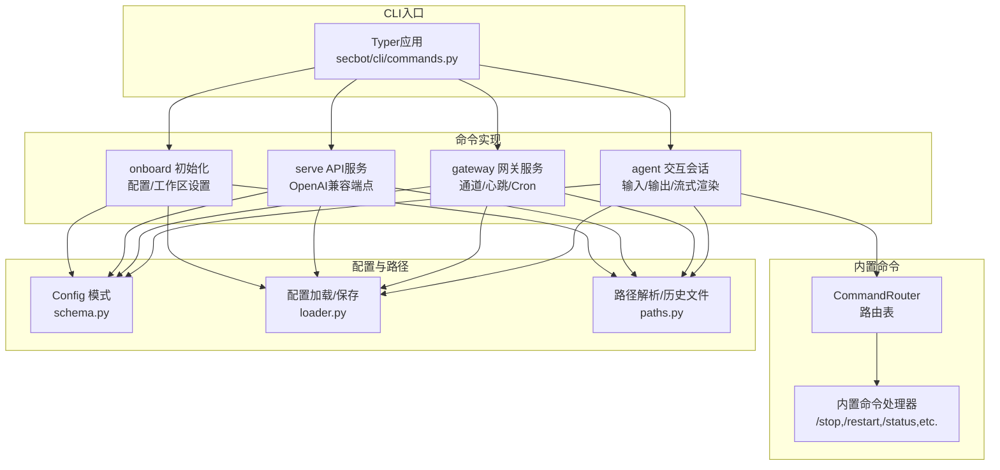
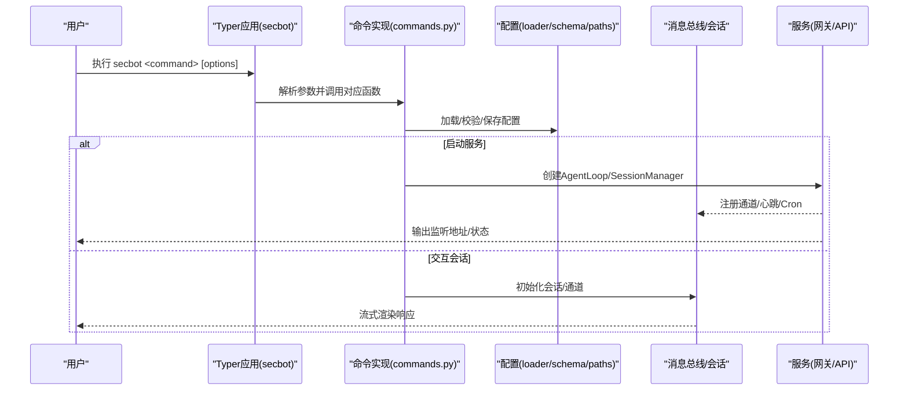
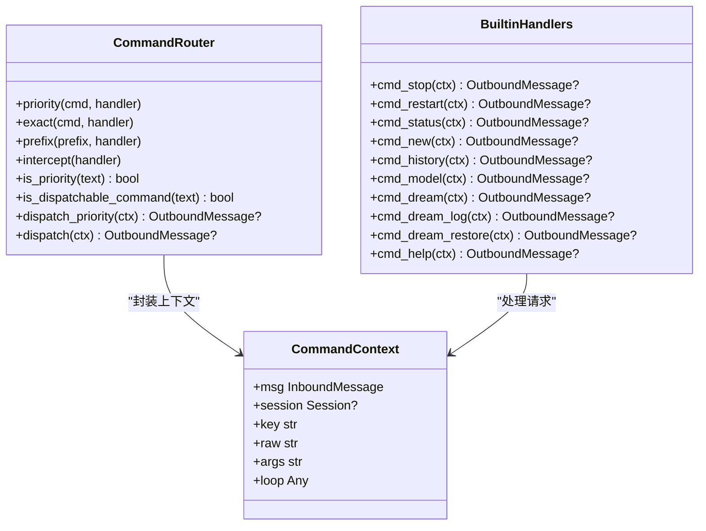
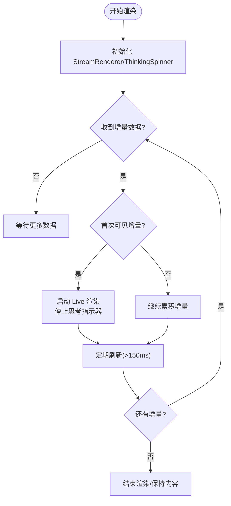
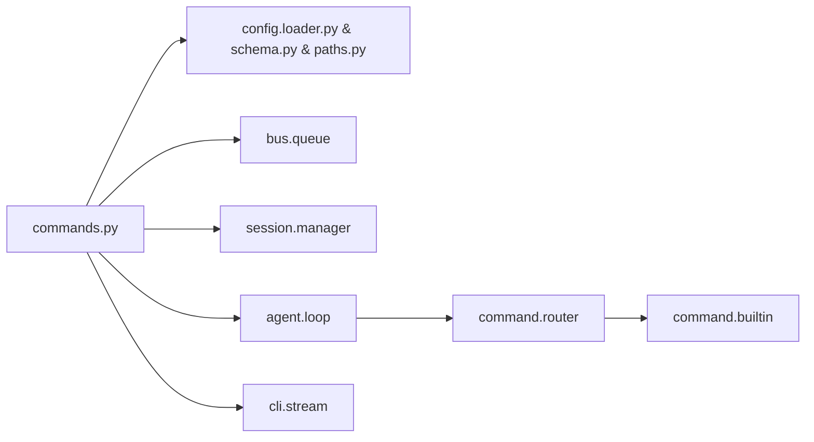

# CLI命令参考

<cite>
**本文档引用的文件**
- [commands.py](file://secbot/cli/commands.py)
- [onboard.py](file://secbot/cli/onboard.py)
- [stream.py](file://secbot/cli/stream.py)
- [router.py](file://secbot/command/router.py)
- [builtin.py](file://secbot/command/builtin.py)
- [models.py](file://secbot/cli/models.py)
- [config.schema.py](file://secbot/config/schema.py)
- [config.loader.py](file://secbot/config/loader.py)
- [paths.py](file://secbot/config/paths.py)
</cite>

## 目录
1. [简介](#简介)
2. [项目结构](#项目结构)
3. [核心组件](#核心组件)
4. [架构总览](#架构总览)
5. [详细组件分析](#详细组件分析)
6. [依赖关系分析](#依赖关系分析)
7. [性能考量](#性能考量)
8. [故障排除指南](#故障排除指南)
9. [结论](#结论)
10. [附录](#附录)

## 简介
本参考文档面向使用 secbot 的终端用户与运维人员，系统性梳理 CLI 命令的完整规范，覆盖启动命令、配置管理、会话操作与系统维护等场景。内容包括：
- 命令语法、参数选项、类型与约束
- 配置文件位置、环境变量与运行时参数
- 常用工作流的命令组合示例
- 故障排除与常见问题
- 退出码与错误信息说明

## 项目结构
CLI 命令由主入口 Typer 应用统一注册，核心实现位于 secbot/cli/commands.py；交互式会话渲染由 stream.py 提供；内置斜杠命令（/stop、/restart、/status、/history、/model、/dream 系列）在 command/builtin.py 中定义并通过 router.py 进行路由分发。

**图表来源**
- [commands.py](file://secbot/cli/commands.py)
- [router.py](file://secbot/command/router.py)
- [builtin.py](file://secbot/command/builtin.py)
- [config.schema.py](file://secbot/config/schema.py)
- [config.loader.py](file://secbot/config/loader.py)
- [paths.py](file://secbot/config/paths.py)

**章节来源**
- [commands.py:1-120](file://secbot/cli/commands.py#L1-L120)

## 核心组件
- Typer 应用与版本回调：定义命令命名空间与版本显示行为。
- onboard 初始化：创建/更新配置、注入通道默认配置、创建工作区并同步模板。
- serve API 服务器：启动 OpenAI 兼容接口，支持日志级别控制与超时设置。
- gateway 网关：启动通道、心跳、定时任务与消息总线，支持调试输出。
- agent 交互会话：基于 prompt_toolkit 的多行输入、粘贴模式、历史记录与 Rich 渲染。
- 内置斜杠命令：优先级命令（/stop、/restart、/status）、精确匹配与前缀匹配命令。
- 流式渲染器：ThinkingSpinner 与 Live 渲染，避免闪烁与竞态。
- 配置系统：加载、校验、迁移与路径解析。

**章节来源**
- [commands.py:288-400](file://secbot/cli/commands.py#L288-L400)
- [router.py:15-99](file://secbot/command/router.py#L15-L99)
- [builtin.py:103-651](file://secbot/command/builtin.py#L103-L651)
- [stream.py:34-143](file://secbot/cli/stream.py#L34-L143)

## 架构总览
下图展示 CLI 命令从入口到执行的关键调用链路与数据流。

**图表来源**
- [commands.py:514-601](file://secbot/cli/commands.py#L514-L601)
- [commands.py:608-632](file://secbot/cli/commands.py#L608-L632)
- [commands.py:299-400](file://secbot/cli/commands.py#L299-L400)

## 详细组件分析

### 命令：onboard（初始化与配置）
- 功能：初始化 secbot 配置与工作区，可选交互向导。
- 语法：secbot onboard [--workspace PATH|-w PATH] [--config PATH|-c PATH] [--wizard]
- 参数
  - --workspace/-w：工作区目录（覆盖配置中的默认工作区）
  - --config/-c：配置文件路径（若未指定则使用默认路径）
  - --wizard：启用交互式向导
- 行为
  - 若存在配置文件：可选择覆盖或刷新（保留新增字段）
  - 若不存在配置文件：创建默认配置
  - 向导模式：收集用户输入，完成后写入配置
  - 注入通道默认配置（发现所有通道后合并）
  - 创建工作区目录并同步模板
- 退出码
  - 成功：0
  - 失败：1（如向导依赖缺失、保存失败）

**章节来源**
- [commands.py:304-400](file://secbot/cli/commands.py#L304-L400)
- [onboard.py:53-61](file://secbot/cli/onboard.py#L53-L61)
- [onboard.py:784-800](file://secbot/cli/onboard.py#L784-L800)

### 命令：serve（OpenAI兼容API服务器）
- 功能：启动 OpenAI 兼容的 /v1/chat/completions 接口。
- 语法：secbot serve [--port NUM|-p NUM] [--host STR|-H STR] [--timeout NUM|-t NUM] [--verbose|-v] [--workspace PATH|-w PATH] [--config PATH|-c PATH]
- 参数
  - --port/-p：监听端口（默认来自配置）
  - --host/-H：绑定地址（默认来自配置）
  - --timeout/-t：请求超时秒数（默认来自配置）
  - --verbose/-v：开启 secbot 运行时日志
  - --workspace/-w：工作区目录（覆盖配置）
  - --config/-c：配置文件路径
- 行为
  - 校验 aiohttp 依赖
  - 加载运行时配置，构建 AgentLoop、SessionManager、MessageBus
  - 启动 Web 应用并打印监听地址与模型信息
  - 警告：绑定到 0.0.0.0 或 :: 时提示网络边界风险
- 退出码
  - 成功：0
  - 失败：1（缺少依赖、配置错误、端口占用等）

**章节来源**
- [commands.py:514-601](file://secbot/cli/commands.py#L514-L601)

### 命令：gateway（网关服务）
- 功能：启动 secbot 网关，承载通道、心跳、定时任务与消息总线。
- 语法：secbot gateway [--port NUM|-p NUM] [--workspace PATH|-w PATH] [--verbose|-v] [--config PATH|-c PATH]
- 参数
  - --port/-p：网关端口（默认来自配置）
  - --workspace/-w：工作区目录（覆盖配置）
  - --verbose/-v：启用 DEBUG 日志
  - --config/-c：配置文件路径
- 行为
  - 加载运行时配置，构建 Provider 快照与 AgentLoop
  - 迁移旧版 Cron 存储至工作区
  - 初始化 CronService、SessionManager、MessageBus
  - 设置通道投递回调，支持记录通道交付
  - 定时任务触发通过 AgentLoop 执行
- 退出码
  - 成功：0
  - 失败：1（配置错误、快照构建失败等）

**章节来源**
- [commands.py:608-701](file://secbot/cli/commands.py#L608-L701)

### 命令：agent（交互会话）
- 功能：进入交互式聊天界面，支持多行输入、历史记录与流式渲染。
- 语法：secbot agent [--workspace PATH|-w PATH] [--config PATH|-c PATH] [--no-md] [--no-spinner] [消息内容]
- 参数
  - --workspace/-w：工作区目录（覆盖配置）
  - --config/-c：配置文件路径
  - --no-md：禁用 Markdown 渲染
  - --no-spinner：隐藏思考指示器
  - [消息内容]：初始消息（可选）
- 行为
  - 初始化 prompt_toolkit 会话与安全历史记录
  - 构建 AgentLoop、SessionManager、MessageBus
  - 支持斜杠命令（/stop、/restart、/status 等）
  - 流式渲染响应，避免终端冲突
- 退出码
  - 成功：0
  - 用户中断：130（EOF/Ctrl+C）

**章节来源**
- [commands.py:299-400](file://secbot/cli/commands.py#L299-L400)
- [stream.py:69-143](file://secbot/cli/stream.py#L69-L143)

### 内置斜杠命令（agent 会话中使用）
- /stop：取消当前会话的活动任务
- /restart：原地重启进程
- /status：显示运行时、Provider 与通道状态
- /history [n]：显示最近 n 条对话（默认10，最大50）
- /model：列出可用模型或切换默认模型
- /dream：手动触发记忆整合
- /dream-log [sha]：查看最近或指定版本的记忆变更
- /dream-restore [sha]：恢复到指定版本
- /help：列出可用斜杠命令

**图表来源**
- [router.py:15-99](file://secbot/command/router.py#L15-L99)
- [builtin.py:108-651](file://secbot/command/builtin.py#L108-L651)

**章节来源**
- [builtin.py:37-100](file://secbot/command/builtin.py#L37-L100)
- [builtin.py:634-651](file://secbot/command/builtin.py#L634-L651)

### 流式渲染与终端适配
- ThinkingSpinner：在 Rich Live 渲染期间显示“正在思考…”指示器，并支持暂停以避免与用户输入冲突。
- StreamRenderer：按增量渲染 Markdown/纯文本，自动刷新，避免渲染竞态。
- 终端兼容性：Windows 控制台强制 UTF-8 编码；TTY 判断确保非交互输出不注入控制序列。

**图表来源**
- [stream.py:69-132](file://secbot/cli/stream.py#L69-L132)

**章节来源**
- [stream.py:20-32](file://secbot/cli/stream.py#L20-L32)
- [stream.py:34-67](file://secbot/cli/stream.py#L34-L67)

## 依赖关系分析
- CLI 命令依赖配置系统（加载、校验、路径解析），并在运行时构建 AgentLoop、SessionManager、MessageBus。
- 网关与 API 服务共享相同的 AgentLoop 构造参数，确保一致的工具与会话行为。
- 内置命令通过 CommandRouter 分发，优先级命令（/stop、/restart、/status）在锁外处理，其余命令在锁内处理。

**图表来源**
- [commands.py:514-701](file://secbot/cli/commands.py#L514-L701)
- [router.py:27-99](file://secbot/command/router.py#L27-L99)
- [builtin.py:634-651](file://secbot/command/builtin.py#L634-L651)

**章节来源**
- [commands.py:540-574](file://secbot/cli/commands.py#L540-L574)
- [commands.py:674-701](file://secbot/cli/commands.py#L674-L701)

## 性能考量
- 流式渲染：使用 Rich Live 并关闭自动刷新，仅在阈值时间到达时刷新，降低闪烁与 CPU 占用。
- 缓存：/model 命令对模型列表采用带 TTL 的缓存，减少对外部端点的频繁请求。
- 终端优化：Windows 强制 UTF-8 编码，TTY 判断避免在管道/脚本中注入控制序列。
- 超时控制：API 服务支持 per-request 超时，避免长时间阻塞。

[本节为通用指导，无需特定文件来源]

## 故障排除指南
- 缺少 aiohttp 依赖
  - 现象：执行 serve 报错提示安装扩展包
  - 处理：pip 安装包含 [api] 可选依赖
- 配置文件不存在或无效
  - 现象：加载配置失败或提示过时键
  - 处理：运行 onboard 生成默认配置；根据提示移除已废弃键
- 端口被占用或权限不足
  - 现象：serve/gateway 启动失败
  - 处理：更换端口或以管理员权限运行
- 向导依赖缺失
  - 现象：onboard --wizard 报错
  - 处理：安装包含向导依赖的可选包
- 终端显示异常（Windows）
  - 现象：特殊字符导致崩溃或乱码
  - 处理：系统自动重配置 UTF-8 编码；避免在不受支持的终端中使用表情符号

**章节来源**
- [commands.py:526-528](file://secbot/cli/commands.py#L526-L528)
- [commands.py:468-472](file://secbot/cli/commands.py#L468-L472)
- [onboard.py:53-60](file://secbot/cli/onboard.py#L53-L60)
- [commands.py:14-21](file://secbot/cli/commands.py#L14-L21)

## 结论
本文档提供了 secbot CLI 的完整命令参考与架构视图，涵盖初始化、服务启动、交互会话与系统维护等关键能力。建议在生产环境中结合配置文件与工作区管理，配合网关与 API 服务实现多通道接入与稳定运行。

[本节为总结，无需特定文件来源]

## 附录

### 常用工作流示例
- 快速初始化并开始聊天
  - secbot onboard --wizard
  - secbot agent
- 启动 API 服务用于集成
  - secbot serve --host 127.0.0.1 --port 8000
- 启动网关服务
  - secbot gateway --port 3000
- 在已有配置上切换模型
  - secbot agent
  - 在会话中输入 /model <模型名>

[本节为概念性示例，无需特定文件来源]

### 配置文件位置与环境变量
- 默认配置路径：由配置加载器解析（通常位于用户主目录下的特定子目录）
- 环境变量：配置加载器支持环境变量插值与覆盖
- 运行时参数：命令行选项可覆盖配置文件中的相应字段

**章节来源**
- [config.loader.py](file://secbot/config/loader.py)
- [paths.py](file://secbot/config/paths.py)

### 退出代码与错误信息
- 成功：0
- 用户中断：130（EOF/Ctrl+C）
- 失败：1（依赖缺失、配置错误、端口占用等）

**章节来源**
- [commands.py:526-528](file://secbot/cli/commands.py#L526-L528)
- [commands.py:279-281](file://secbot/cli/commands.py#L279-L281)