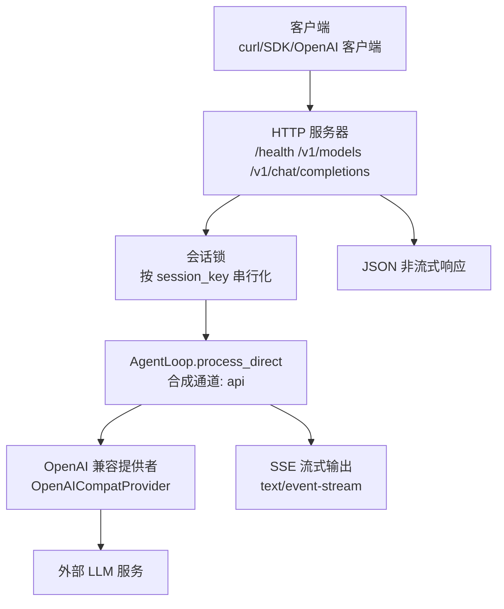
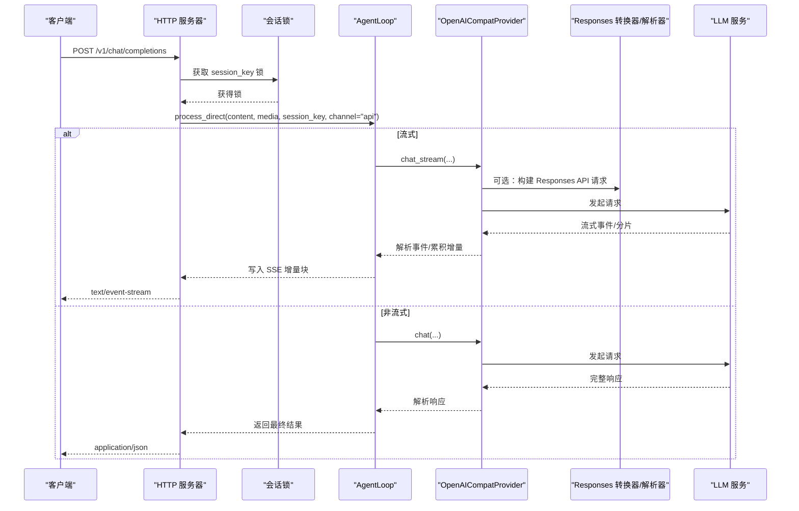
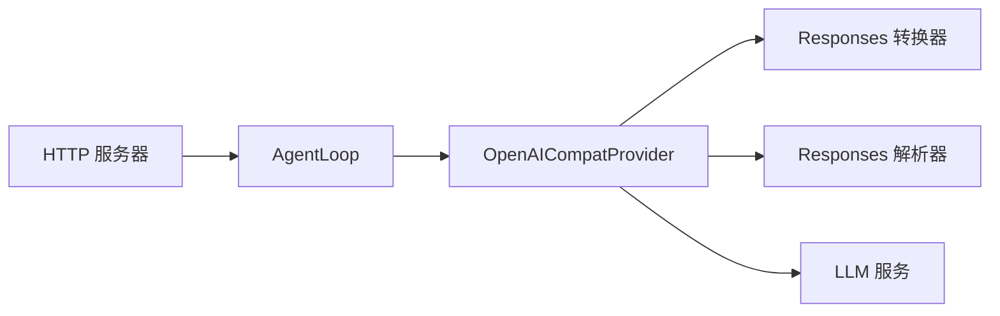

# OpenAI兼容API

<cite>
**本文引用的文件**   
- [docs/openai-api.md](file://docs/openai-api.md)
- [secbot/api/server.py](file://secbot/api/server.py)
- [secbot/providers/openai_compat_provider.py](file://secbot/providers/openai_compat_provider.py)
- [secbot/providers/openai_responses/converters.py](file://secbot/providers/openai_responses/converters.py)
- [secbot/providers/openai_responses/parsing.py](file://secbot/providers/openai_responses/parsing.py)
- [secbot/providers/base.py](file://secbot/providers/base.py)
- [tests/test_openai_api.py](file://tests/test_openai_api.py)
- [pyproject.toml](file://pyproject.toml)
- [docs/python-sdk.md](file://docs/python-sdk.md)
</cite>

## 目录
1. [简介](#简介)
2. [项目结构](#项目结构)
3. [核心组件](#核心组件)
4. [架构总览](#架构总览)
5. [详细组件分析](#详细组件分析)
6. [依赖分析](#依赖分析)
7. [性能考虑](#性能考虑)
8. [故障排查指南](#故障排查指南)
9. [结论](#结论)
10. [附录](#附录)

## 简介
本文件面向希望在本地或私有环境中使用 OpenAI 兼容 API 的开发者与运维人员，系统化说明 nanobot 提供的 OpenAI 兼容接口：端点映射、请求/响应格式、消息与工具调用处理、流式与非流式响应、模型名称管理、令牌计数与使用统计、错误处理与异常响应、第三方集成示例（含 curl 与 Python SDK），以及性能优化与最佳实践。

## 项目结构
- OpenAI 兼容 API 的核心由 HTTP 服务器与消息处理链路组成：
  - HTTP 层：提供 /health、/v1/models、/v1/chat/completions 三个端点，统一固定会话与请求超时控制。
  - 消息处理层：解析 JSON 或 multipart 请求体，提取文本与媒体，路由到合成通道“api”，并串行化同一会话的请求。
  - 响应生成层：支持非流式一次性返回与 Server-Sent Events 流式返回；对空响应进行一次重试兜底。
- 兼容适配层：将 OpenAI 风格的消息与工具定义转换为内部统一格式，并在必要时回退至 Responses API（针对特定模型与场景）。

图表来源
- [secbot/api/server.py:194-351](file://secbot/api/server.py#L194-L351)
- [secbot/providers/openai_compat_provider.py:254-585](file://secbot/providers/openai_compat_provider.py#L254-L585)

章节来源
- [docs/openai-api.md:1-122](file://docs/openai-api.md#L1-L122)
- [secbot/api/server.py:194-351](file://secbot/api/server.py#L194-L351)

## 核心组件
- HTTP 服务器与端点
  - /health：健康检查，返回状态码 200 与简单 JSON。
  - /v1/models：返回当前固定模型名（仅一个模型）。
  - /v1/chat/completions：核心聊天完成端点，支持 JSON 与 multipart/form-data 两种输入方式。
- 请求解析与会话隔离
  - 单消息约束：每次请求必须且仅能包含一个用户消息（role=user）。
  - 会话隔离：通过 session_id 将不同对话隔离；未提供则使用默认会话键。
  - 文件上传：支持 JSON base64 与 multipart 多文件上传（单次请求最多 10MB/文件）。
- 流式与非流式响应
  - 非流式：一次性返回标准 OpenAI 风格 JSON。
  - 流式：以 SSE 返回增量内容，终止时发送 [DONE]。
- 错误处理
  - 统一错误响应格式，包含 message、type、code 字段。
  - 对于文件过大、无效 JSON、远程图片 URL 等场景返回明确错误码与提示。

章节来源
- [secbot/api/server.py:50-105](file://secbot/api/server.py#L50-L105)
- [secbot/api/server.py:194-351](file://secbot/api/server.py#L194-L351)
- [tests/test_openai_api.py:66-134](file://tests/test_openai_api.py#L66-L134)

## 架构总览
下图展示从客户端到 LLM 的完整调用链，包括消息预处理、工具调用、Responses API 回退与 SSE 流式输出。

图表来源
- [secbot/api/server.py:236-304](file://secbot/api/server.py#L236-L304)
- [secbot/providers/openai_compat_provider.py:471-585](file://secbot/providers/openai_compat_provider.py#L471-L585)
- [secbot/providers/openai_responses/converters.py:9-55](file://secbot/providers/openai_responses/converters.py#L9-L55)
- [secbot/providers/openai_responses/parsing.py:28-131](file://secbot/providers/openai_responses/parsing.py#L28-L131)

## 详细组件分析

### 端点与行为规范
- /health
  - 方法：GET
  - 成功：200 OK，返回 {"status":"ok"}
- /v1/models
  - 方法：GET
  - 成功：200 OK，返回 {"object":"list","data":[{"id":"<固定模型名>","object":"model","created":0,"owned_by":"secbot"}]}
- /v1/chat/completions
  - 方法：POST
  - 支持 Content-Type：application/json 或 multipart/form-data
  - 输入要求：
    - JSON：messages 必须为数组且仅包含一个 role=user 的消息；可选 session_id；不支持多模型切换（仅允许使用固定模型名）。
    - multipart：message 为纯文本；files 为二进制文件（最多 10MB/个）；可选 session_id、model。
  - 输出：
    - 非流式：标准 OpenAI 风格 JSON，包含 choices[].message.content、usage 等。
    - 流式：SSE，逐块推送增量内容，结束时发送 [DONE]。
  - 行为：
    - 单消息输入、会话隔离、文件上传、空响应兜底重试。

章节来源
- [secbot/api/server.py:353-374](file://secbot/api/server.py#L353-L374)
- [secbot/api/server.py:194-351](file://secbot/api/server.py#L194-L351)
- [docs/openai-api.md:33-87](file://docs/openai-api.md#L33-L87)

### 请求解析与消息格式
- JSON 请求体
  - messages：必须为列表，且仅一个用户消息（role=user）。
  - content 支持字符串或 OpenAI 多模态内容数组（text 与 image_url）。
  - session_id：可选，用于会话隔离。
- Multipart 请求体
  - message：文本内容。
  - files：文件二进制（支持多文件）。
  - session_id、model：可选。
- 远程图片 URL 不被支持，仅接受 data: URL 或 multipart 上传。

章节来源
- [secbot/api/server.py:112-186](file://secbot/api/server.py#L112-L186)
- [tests/test_openai_api.py:290-342](file://tests/test_openai_api.py#L290-L342)

### 流式与非流式响应
- 非流式
  - 返回标准 OpenAI 结构，choices[].message 包含最终内容，usage 包含令牌统计。
- 流式
  - Content-Type: text/event-stream
  - 每个增量块包含 choices[].delta.content；结束时发送 data: [DONE]
  - SSE 增量块由 HTTP 服务器在内存队列中写入，保证顺序与完整性。

章节来源
- [secbot/api/server.py:57-105](file://secbot/api/server.py#L57-L105)
- [secbot/api/server.py:236-304](file://secbot/api/server.py#L236-L304)

### 模型名称管理
- 固定模型名：HTTP 服务器仅允许使用应用启动时配置的单一模型名；若请求体指定其他模型名，将返回 400。
- /v1/models 返回该固定模型名，便于客户端探测可用模型。

章节来源
- [secbot/api/server.py:225-227](file://secbot/api/server.py#L225-L227)
- [secbot/api/server.py:353-368](file://secbot/api/server.py#L353-L368)

### 令牌计数与使用统计
- 使用统计字段：prompt_tokens、completion_tokens、total_tokens、cached_tokens（跨供应商归一化）。
- 归一化策略：优先级链路覆盖 OpenAI/Zhipu/Qwen/Mistral/xAI 的 prompt_tokens_details.cached_tokens、StepFun/Moonshot 的 cached_tokens、DeepSeek/SiliconFlow 的 prompt_cache_hit_tokens。
- 注意：当上游响应缺少 usage 时，返回空字典；cached_tokens 仅在存在对应字段时填充。

章节来源
- [secbot/providers/openai_compat_provider.py:742-788](file://secbot/providers/openai_compat_provider.py#L742-L788)
- [secbot/providers/base.py:48-64](file://secbot/providers/base.py#L48-L64)

### 参数与兼容性映射
- 支持的关键参数（来自 OpenAI 兼容提供者）
  - model：固定模型名（不支持动态切换）
  - messages：消息数组（支持多模态 text 与 image_url）
  - tools/tool_choice：函数调用定义与选择策略
  - max_tokens/temperature：最大生成长度与采样温度
  - reasoning_effort：推理强度（如 "none"/"minimal"/"low"/"medium"/"high"/"xhigh"）
  - extra_body：透传给底层 SDK 的扩展参数（如 guided_json、repetition_penalty 等）
- 参数转换与兼容性
  - 温度参数：对某些推理模型（如 o1/o3/o4）在设置推理强度时自动剔除温度。
  - 推理模式：根据 ProviderSpec.thinking_style 与模型名称映射到 provider 特定的推理开关。
  - 工具调用：标准化工具调用 ID 与 arguments 格式，确保跨 provider 一致性。
  - 角色交替：强制执行 OpenAI 兼容的“角色交替”规则，避免连续相同角色导致的拒绝。

章节来源
- [secbot/providers/openai_compat_provider.py:471-585](file://secbot/providers/openai_compat_provider.py#L471-L585)
- [secbot/providers/openai_compat_provider.py:407-451](file://secbot/providers/openai_compat_provider.py#L407-L451)
- [secbot/providers/base.py:373-440](file://secbot/providers/base.py#L373-L440)

### Responses API 回退机制
- 触发条件：仅对直接 OpenAI 请求且满足推理需求时尝试 Responses API；失败后进入“熔断器”逻辑，超过阈值后短时间禁止再次尝试。
- 回退判断：基于错误状态码（400/404/422）与错误体关键词（如 responses、max_output_tokens、unsupported 等）判定是否为兼容性问题。
- 回退流程：将消息与工具转换为 Responses API 输入，禁用流式，解析 SDK 响应对象或 SSE 事件流，再映射为 OpenAI 风格响应。

章节来源
- [secbot/providers/openai_compat_provider.py:587-633](file://secbot/providers/openai_compat_provider.py#L587-L633)
- [secbot/providers/openai_compat_provider.py:634-662](file://secbot/providers/openai_compat_provider.py#L634-L662)
- [secbot/providers/openai_responses/converters.py:9-55](file://secbot/providers/openai_responses/converters.py#L9-L55)
- [secbot/providers/openai_responses/parsing.py:28-131](file://secbot/providers/openai_responses/parsing.py#L28-L131)

### 错误处理与异常响应
- 统一错误格式：{"error":{"message":"...","type":"...","code":...}}
- 常见错误
  - 400：单用户消息缺失、远程图片 URL、模型名不匹配、multipart 文件过大等。
  - 413：文件大小超限。
  - 504：请求超时。
  - 500：内部错误。
- 空响应兜底：若首次调用返回空内容，自动重试一次；仍为空则返回预设兜底文本。

章节来源
- [secbot/api/server.py:50-54](file://secbot/api/server.py#L50-L54)
- [secbot/api/server.py:217-223](file://secbot/api/server.py#L217-L223)
- [tests/test_openai_api.py:83-134](file://tests/test_openai_api.py#L83-L134)
- [tests/test_openai_api.py:346-400](file://tests/test_openai_api.py#L346-L400)

### 第三方集成指南
- curl 示例
  - 非流式请求：携带 JSON 请求体，包含 messages（仅一个用户消息）与可选 session_id。
  - 多模态（JSON base64）：在 content 中使用 OpenAI 多模态格式（text 与 image_url）。
  - 多文件上传（multipart）：message 为文本，files 为二进制文件，可附加 session_id。
- Python SDK（requests）
  - 直接 POST 到 /v1/chat/completions，设置超时，解析 choices[].message[].content。
- Python SDK（openai 库）
  - 设置 base_url 为 http://127.0.0.1:8900/v1，api_key 可任意值；通过 extra_body 传递 session_id。

章节来源
- [docs/openai-api.md:39-122](file://docs/openai-api.md#L39-L122)
- [docs/python-sdk.md:1-220](file://docs/python-sdk.md#L1-L220)

## 依赖分析
- 依赖关系
  - HTTP 服务器依赖会话锁与 AgentLoop；AgentLoop 依赖 OpenAI 兼容提供者；提供者依赖 Responses 转换与解析模块（在需要时）。
  - 令牌统计与错误处理在提供者层统一实现，向上游屏蔽差异。
- 关键耦合点
  - /v1/chat/completions 与固定模型名绑定，避免了上游 provider 选择的复杂性，简化了部署与运维。
  - 流式输出依赖 aiohttp 的 StreamResponse 与 SSE 编码，保证与 OpenAI 兼容的事件格式。

图表来源
- [secbot/api/server.py:194-351](file://secbot/api/server.py#L194-L351)
- [secbot/providers/openai_compat_provider.py:254-585](file://secbot/providers/openai_compat_provider.py#L254-L585)
- [secbot/providers/openai_responses/converters.py:9-55](file://secbot/providers/openai_responses/converters.py#L9-L55)
- [secbot/providers/openai_responses/parsing.py:28-131](file://secbot/providers/openai_responses/parsing.py#L28-L131)

章节来源
- [pyproject.toml:70-73](file://pyproject.toml#L70-L73)

## 性能考虑
- 会话串行化
  - 同一会话内的请求通过锁串行化，避免并发冲突；长耗时工具调用会阻塞后续请求。建议合理使用 session_id 进行业务隔离。
- 流式传输
  - 流式响应采用内存队列与 SSE 写入，适合低延迟交互；注意客户端缓冲与网络稳定性。
- 超时控制
  - 单请求超时可配置，默认约 120 秒；超出返回 504。建议在高延迟网络或大模型推理场景下调小超时或优化模型。
- 本地与云端差异
  - 本地模型服务器（如 Ollama、llama.cpp、vLLM）禁用 keepalive，避免连接复用导致的瞬断；云端服务保留 keepalive 以提升吞吐。
- 令牌统计
  - 使用统一的归一化逻辑提取 prompt/completion/total/cached 令牌，便于监控与成本控制。

章节来源
- [secbot/api/server.py:236-304](file://secbot/api/server.py#L236-L304)
- [secbot/providers/openai_compat_provider.py:296-311](file://secbot/providers/openai_compat_provider.py#L296-L311)
- [secbot/providers/openai_compat_provider.py:742-788](file://secbot/providers/openai_compat_provider.py#L742-L788)

## 故障排查指南
- 常见错误与定位
  - 400：检查 messages 是否仅有一个用户消息、是否使用了不被允许的模型名、是否混用了远程图片 URL。
  - 413：确认 multipart 文件大小未超过 10MB，或 base64 数据是否过大。
  - 504：检查请求超时设置与模型推理耗时，适当增大超时或优化模型。
  - 500：查看服务日志，关注异常堆栈；空响应兜底逻辑会触发重试与兜底文本。
- 单元测试参考
  - 测试覆盖了单用户消息校验、模型名不匹配、流式 SSE 类型、multipart 文件大小限制、空响应重试与兜底等场景，可作为回归验证依据。

章节来源
- [tests/test_openai_api.py:83-134](file://tests/test_openai_api.py#L83-L134)
- [tests/test_openai_api.py:181-201](file://tests/test_openai_api.py#L181-L201)
- [tests/test_openai_api.py:318-342](file://tests/test_openai_api.py#L318-L342)
- [tests/test_openai_api.py:346-400](file://tests/test_openai_api.py#L346-L400)

## 结论
本 OpenAI 兼容 API 在保持与 OpenAI 客户端生态高度一致的同时，提供了本地化、可部署、可观测的聊天完成能力。通过固定模型名与严格的请求约束，降低了集成复杂度；通过统一的令牌统计与错误处理，提升了可观测性与稳定性。配合 curl 与 Python SDK 示例，可快速完成第三方集成与自动化对接。

## 附录

### 端点与请求/响应对照
- /health
  - 方法：GET
  - 成功：200，{"status":"ok"}
- /v1/models
  - 方法：GET
  - 成功：200，{"object":"list","data":[{"id":"<固定模型名>","object":"model","created":0,"owned_by":"secbot"}]}
- /v1/chat/completions
  - 方法：POST
  - Content-Type：application/json 或 multipart/form-data
  - 请求体（JSON）：messages（仅一个用户消息）、可选 session_id；或 multipart：message、files、可选 session_id/model
  - 成功：
    - 非流式：200，OpenAI 风格 JSON，包含 choices[].message.content、usage
    - 流式：200，text/event-stream，逐块推送 choices[].delta.content，结束发送 [DONE]

章节来源
- [secbot/api/server.py:353-374](file://secbot/api/server.py#L353-L374)
- [secbot/api/server.py:194-351](file://secbot/api/server.py#L194-L351)

### 参数对照表（OpenAI 兼容提供者）
- model：固定模型名（不支持动态切换）
- messages：消息数组，支持 text 与 image_url
- tools/tool_choice：函数调用定义与选择策略
- max_tokens：最大生成长度（部分 provider 使用 max_completion_tokens）
- temperature：采样温度（推理强度激活时可能被剔除）
- reasoning_effort：推理强度（none/minimal/low/medium/high/xhigh）
- extra_body：透传扩展参数（如 guided_json、repetition_penalty 等）

章节来源
- [secbot/providers/openai_compat_provider.py:471-585](file://secbot/providers/openai_compat_provider.py#L471-L585)

### 令牌统计字段说明
- prompt_tokens：提示词令牌数
- completion_tokens：生成令牌数
- total_tokens：总令牌数
- cached_tokens：缓存命中令牌数（跨供应商归一化）

章节来源
- [secbot/providers/openai_compat_provider.py:742-788](file://secbot/providers/openai_compat_provider.py#L742-L788)