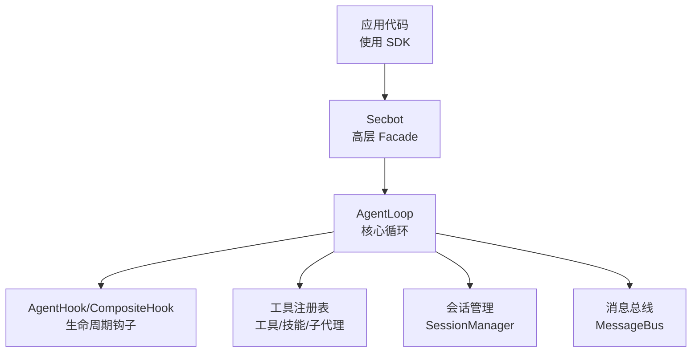
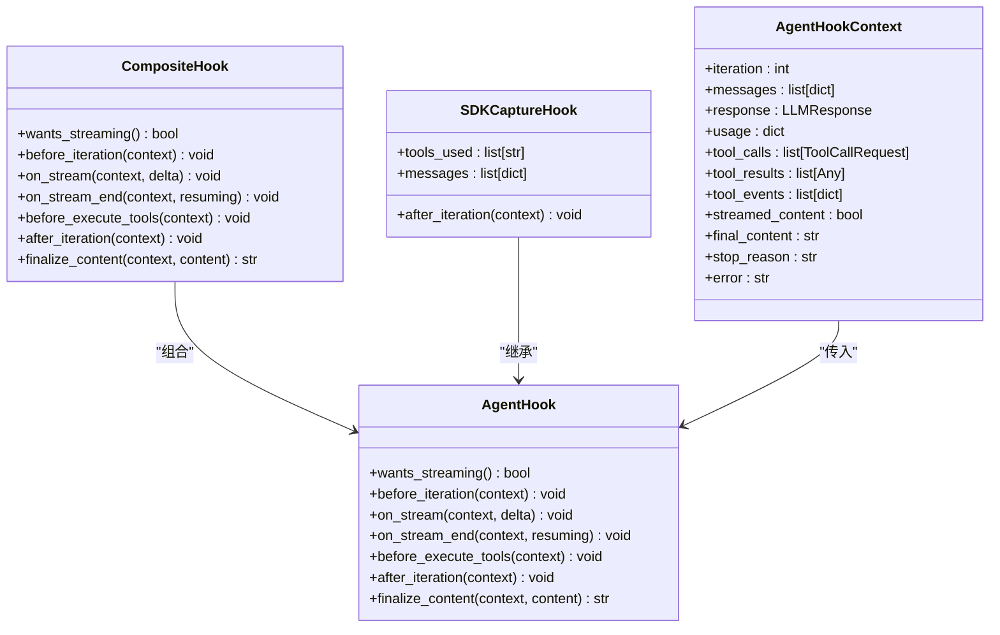
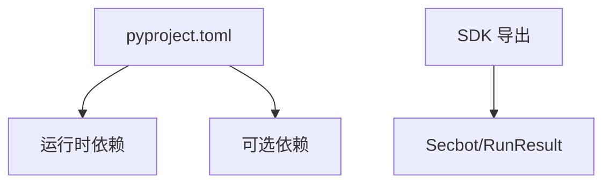

# Python SDK

<cite>
**本文引用的文件**
- [README.md](file://README.md)
- [pyproject.toml](file://pyproject.toml)
- [docs/python-sdk.md](file://docs/python-sdk.md)
- [secbot/__init__.py](file://secbot/__init__.py)
- [secbot/secbot.py](file://secbot/secbot.py)
- [secbot/agent/loop.py](file://secbot/agent/loop.py)
- [secbot/agent/hook.py](file://secbot/agent/hook.py)
</cite>

## 目录
1. [简介](#简介)
2. [项目结构](#项目结构)
3. [核心组件](#核心组件)
4. [架构总览](#架构总览)
5. [详细组件分析](#详细组件分析)
6. [依赖分析](#依赖分析)
7. [性能考虑](#性能考虑)
8. [故障排查指南](#故障排查指南)
9. [结论](#结论)
10. [附录](#附录)

## 简介
本文件为 secbot 的 Python SDK 使用文档，聚焦于以库方式在纯 Python 环境中直接调用 secbot 的智能体能力。SDK 提供简洁的高层接口，支持从配置文件加载运行参数、会话隔离、钩子扩展、以及流式回调等能力。同时，SDK 与 CLI/Gateway 的配置体系保持一致，便于在不同运行形态间复用。

## 项目结构
围绕 Python SDK 的关键文件与模块如下：
- 文档与入口
  - docs/python-sdk.md：SDK 使用说明与 API 参考
  - README.md：项目总体介绍与运行入口
- 包与版本
  - secbot/__init__.py：导出 SDK 主要符号（如 Secbot、RunResult）
  - pyproject.toml：依赖与版本声明
- 核心实现
  - secbot/secbot.py：高层 Facade（Secbot）与 RunResult 数据结构
  - secbot/agent/loop.py：AgentLoop 核心循环与工具注册、会话管理、并发控制等
  - secbot/agent/hook.py：AgentHook 生命周期钩子与 SDK 捕获钩子



**图表来源**
- [secbot/secbot.py:23-132](file://secbot/secbot.py#L23-L132)
- [secbot/agent/loop.py:176-325](file://secbot/agent/loop.py#L176-L325)
- [secbot/agent/hook.py:30-124](file://secbot/agent/hook.py#L30-L124)

**章节来源**
- [docs/python-sdk.md:1-220](file://docs/python-sdk.md#L1-L220)
- [README.md:1-298](file://README.md#L1-L298)
- [pyproject.toml:1-169](file://pyproject.toml#L1-L169)

## 核心组件
- Secbot：SDK 的高层入口，负责从配置创建 AgentLoop 并对外暴露 run 方法。
- RunResult：单次运行的结果载体，包含最终文本、使用的工具列表、消息历史等。
- AgentHook/CompositeHook：钩子框架，支持在迭代前后、工具执行前后、流式增量、内容最终化等阶段注入行为。
- AgentLoop：核心执行引擎，负责上下文构建、LLM 调用、工具执行、消息发布、会话与并发控制等。

**章节来源**
- [secbot/secbot.py:14-31](file://secbot/secbot.py#L14-L31)
- [secbot/secbot.py:23-132](file://secbot/secbot.py#L23-L132)
- [secbot/agent/hook.py:30-124](file://secbot/agent/hook.py#L30-L124)
- [secbot/agent/loop.py:176-325](file://secbot/agent/loop.py#L176-L325)

## 架构总览
SDK 的调用路径从 Secbot.run 开始，内部通过 AgentLoop 的 Runner 执行一次完整的“思考-工具-产出”循环，并通过钩子收集工具使用与消息历史，最终封装为 RunResult 返回。

```mermaid
sequenceDiagram
participant App as "应用代码"
participant SDK as "Secbot"
participant Loop as "AgentLoop"
participant Runner as "AgentRunner"
participant Tools as "工具注册表"
participant Bus as "消息总线"
App->>SDK : "run(消息, 会话键, 钩子)"
SDK->>Loop : "process_direct(消息, 会话键)"
Loop->>Runner : "run(AgentRunSpec)"
Runner->>Tools : "解析工具调用并执行"
Tools-->>Runner : "工具结果"
Runner-->>Loop : "迭代状态/最终内容"
Loop->>Bus : "发布中间/最终消息"
Loop-->>SDK : "最终内容/工具使用/消息"
SDK-->>App : "RunResult"
```

**图表来源**
- [secbot/secbot.py:93-125](file://secbot/secbot.py#L93-L125)
- [secbot/agent/loop.py:532-674](file://secbot/agent/loop.py#L532-L674)

## 详细组件分析

### 安装与初始化
- 安装
  - 使用 pip 安装项目（包含 SDK 导出），安装后可通过 Python 导入 SDK 符号。
- 初始化
  - 通过 Secbot.from_config 从配置文件创建实例；默认读取用户目录下的配置文件；可传入 workspace 覆盖工作区。
  - SDK 与 CLI/Gateway 共享同一套配置体系，因此可在不改动配置的情况下复用 Provider、模型、工具与工作区设置。

**章节来源**
- [docs/python-sdk.md:5-22](file://docs/python-sdk.md#L5-L22)
- [secbot/secbot.py:36-91](file://secbot/secbot.py#L36-L91)

### API 参考

- 类与数据结构
  - Secbot：高层 Facade，提供 from_config 与 run。
  - RunResult：包含 content、tools_used、messages 字段。
  - AgentHook/AgentHookContext/CompositeHook：钩子框架与上下文。
- 方法签名与语义
  - Secbot.from_config(config_path=None, *, workspace=None)
    - 作用：从配置创建 Secbot 实例。
    - 参数：
      - config_path：配置文件路径（默认读取用户目录下的配置）。
      - workspace：覆盖配置中的工作区路径。
    - 异常：当显式配置路径不存在时抛出 FileNotFoundError。
  - await Secbot.run(message, *, session_key="sdk:default", hooks=None)
    - 作用：执行一次智能体循环并返回 RunResult。
    - 参数：
      - message：用户输入文本。
      - session_key：会话键，用于隔离对话历史。
      - hooks：本次运行附加的钩子列表。
    - 返回：RunResult（content、tools_used、messages）。
  - AgentHook 生命周期方法（可覆写）
    - wants_streaming、before_iteration、on_stream、on_stream_end、before_execute_tools、after_iteration、finalize_content。
  - AgentHookContext 字段
    - iteration、messages、response、usage、tool_calls、tool_results、tool_events、streamed_content、final_content、stop_reason、error。

**章节来源**
- [docs/python-sdk.md:63-122](file://docs/python-sdk.md#L63-L122)
- [secbot/secbot.py:14-31](file://secbot/secbot.py#L14-L31)
- [secbot/secbot.py:36-125](file://secbot/secbot.py#L36-L125)
- [secbot/agent/hook.py:13-56](file://secbot/agent/hook.py#L13-L56)

### 使用示例

- 基本连接与消息发送
  - 使用 Secbot.from_config 创建实例，调用 run 发送消息，打印最终内容。
  - 示例参考：[docs/python-sdk.md:7-20](file://docs/python-sdk.md#L7-L20)
- 会话隔离
  - 通过 session_key 区分不同用户的独立历史。
  - 示例参考：[docs/python-sdk.md:37-44](file://docs/python-sdk.md#L37-L44)
- 钩子与可观测性
  - 通过自定义 AgentHook 订阅工具调用、流式增量、迭代状态等。
  - 示例参考：[docs/python-sdk.md:46-61](file://docs/python-sdk.md#L46-L61)
- 流式响应处理
  - 在钩子中实现 wants_streaming/on_stream/on_stream_end，逐字增量输出。
  - 示例参考：[docs/python-sdk.md:147-162](file://docs/python-sdk.md#L147-L162)
- 完整示例
  - 包含会话键、钩子与最终内容输出的综合示例。
  - 示例参考：[docs/python-sdk.md:185-219](file://docs/python-sdk.md#L185-L219)

**章节来源**
- [docs/python-sdk.md:7-219](file://docs/python-sdk.md#L7-L219)

### 钩子与生命周期
- 生命周期钩子
  - 在每次迭代前/后、工具执行前、流式增量、流式结束、最终内容后置处理等阶段触发。
- 组合钩子
  - CompositeHook 将多个钩子组合，异步方法具备错误隔离，finalize_content 作为管道串联。
- SDK 捕获钩子
  - SDKCaptureHook 用于记录工具使用与最终消息列表，供 RunResult 使用。



**图表来源**
- [secbot/agent/hook.py:30-124](file://secbot/agent/hook.py#L30-L124)

**章节来源**
- [docs/python-sdk.md:94-173](file://docs/python-sdk.md#L94-L173)
- [secbot/agent/hook.py:30-124](file://secbot/agent/hook.py#L30-L124)

### 错误处理与重试策略
- 错误处理
  - 钩子方法在 CompositeHook 中被安全调用，异常会被记录但不会中断主循环。
  - finalize_content 作为内容后置处理管道，异常将暴露以便调试。
- 重试策略
  - SDK 未内置显式的重试逻辑；具体重试行为由底层 Provider 与 AgentRunner 的配置决定（例如 provider_retry_mode 等）。
  - 若需自定义重试，可在钩子中结合 on_retry_wait 回调或在上层业务侧进行包装。

**章节来源**
- [docs/python-sdk.md:172-173](file://docs/python-sdk.md#L172-L173)
- [secbot/agent/loop.py:532-674](file://secbot/agent/loop.py#L532-L674)

### 高级功能与配置
- 自定义认证与 Provider
  - SDK 通过配置文件创建 Provider，遵循与 CLI/Gateway 相同的 Provider 体系。
- 代理设置与超时
  - Web 工具支持代理与用户代理配置；执行工具支持超时、沙箱、路径追加、环境变量白名单等。
- 会话与并发
  - 通过 session_key 实现会话隔离；内部使用信号量控制并发请求上限（受环境变量影响）。
- 工具与技能
  - 默认注册多种工具（文件读写、搜索、执行、Web 抓取/搜索、消息、定时等），可按配置启用/禁用。

**章节来源**
- [secbot/secbot.py:65-91](file://secbot/secbot.py#L65-L91)
- [secbot/agent/loop.py:360-413](file://secbot/agent/loop.py#L360-L413)
- [secbot/agent/loop.py:292-296](file://secbot/agent/loop.py#L292-L296)

## 依赖分析
- Python 版本与包信息
  - requires-python >= 3.11
  - 包名为 secbot-ai，版本来自打包元数据或 pyproject.toml
- 运行时依赖（节选）
  - typer、anthropic、pydantic、websockets、httpx、oauth-cli-kit、loguru、openai、sqlalchemy[asyncio]、alembic 等
- 可选依赖
  - API、企业微信、企业微信小程序、Microsoft Teams、Matrix、Discord、LangSmith、PDF、OLOStep 等



**图表来源**
- [pyproject.toml:25-68](file://pyproject.toml#L25-L68)
- [pyproject.toml:70-110](file://pyproject.toml#L70-L110)
- [secbot/__init__.py:30-33](file://secbot/__init__.py#L30-L33)

**章节来源**
- [pyproject.toml:1-169](file://pyproject.toml#L1-L169)
- [secbot/__init__.py:19-33](file://secbot/__init__.py#L19-L33)

## 性能考虑
- 并发与限流
  - SDK 内部通过信号量限制并发请求数量（默认 3，受环境变量影响），避免过载。
- 上下文压缩与记忆
  - 提供 Consolidator/AutoCompact/Dream 等机制，减少历史上下文长度，降低 Token 消耗。
- 工具执行与沙箱
  - 执行工具支持超时、沙箱、白名单/黑名单模式，避免长耗时或不受控命令。
- 流式输出
  - 通过钩子 on_stream 增量输出，改善感知延迟；注意在高频增量场景下控制日志级别。

**章节来源**
- [secbot/agent/loop.py:292-312](file://secbot/agent/loop.py#L292-L312)
- [secbot/agent/loop.py:308-317](file://secbot/agent/loop.py#L308-L317)

## 故障排查指南
- 配置文件路径错误
  - 显式传入的 config_path 不存在时会抛出 FileNotFoundError。
- Provider 未配置 API Key
  - 启动时若默认模型对应的 Provider 缺少 API Key，将报错提示。
- 流式回调未生效
  - 确保钩子实现了 wants_streaming 并在 on_stream/on_stream_end 中处理增量。
- 工具执行失败
  - 检查工具配置（如执行超时、沙箱、路径限制）与日志输出，定位失败原因。

**章节来源**
- [secbot/secbot.py:54-58](file://secbot/secbot.py#L54-L58)
- [README.md:171-178](file://README.md#L171-L178)
- [docs/python-sdk.md:147-162](file://docs/python-sdk.md#L147-L162)

## 结论
本 SDK 以简洁的高层接口将 secbot 的智能体能力引入纯 Python 环境，支持从配置加载、会话隔离、钩子扩展与流式输出等关键能力。通过与 CLI/Gateway 共享配置体系，开发者可以在不同运行形态之间无缝切换。建议在生产环境中结合并发控制、上下文压缩与工具沙箱等机制，确保稳定性与性能。

## 附录

### 安装与初始化步骤
- 安装项目（包含 SDK）
- 使用 Secbot.from_config 加载配置并创建实例
- 调用 run 发送消息，获取 RunResult

**章节来源**
- [docs/python-sdk.md:5-22](file://docs/python-sdk.md#L5-L22)
- [secbot/secbot.py:36-91](file://secbot/secbot.py#L36-L91)