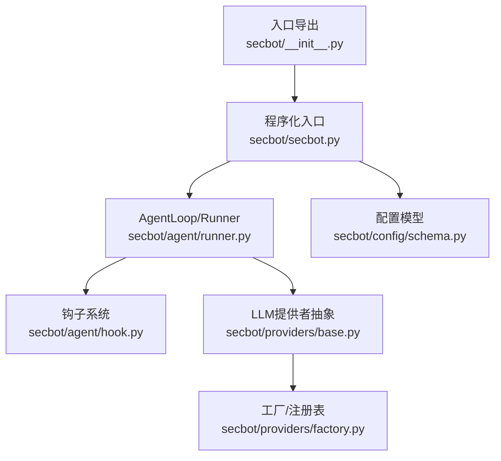
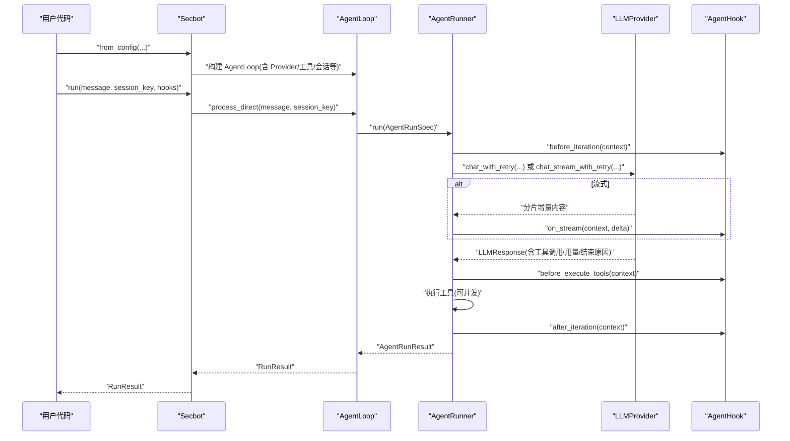
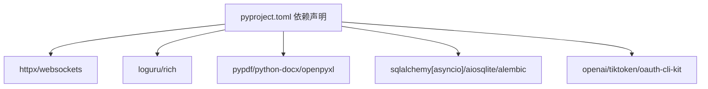

# Python SDK文档

<cite>
**本文引用的文件**
- [docs/python-sdk.md](file://docs/python-sdk.md)
- [secbot/__init__.py](file://secbot/__init__.py)
- [secbot/secbot.py](file://secbot/secbot.py)
- [secbot/agent/__init__.py](file://secbot/agent/__init__.py)
- [secbot/agent/hook.py](file://secbot/agent/hook.py)
- [secbot/agent/runner.py](file://secbot/agent/runner.py)
- [secbot/providers/base.py](file://secbot/providers/base.py)
- [secbot/providers/factory.py](file://secbot/providers/factory.py)
- [secbot/config/schema.py](file://secbot/config/schema.py)
- [pyproject.toml](file://pyproject.toml)
</cite>

## 目录
1. [简介](#简介)
2. [项目结构](#项目结构)
3. [核心组件](#核心组件)
4. [架构总览](#架构总览)
5. [详细组件分析](#详细组件分析)
6. [依赖关系分析](#依赖关系分析)
7. [性能考量](#性能考量)
8. [故障排查指南](#故障排查指南)
9. [结论](#结论)
10. [附录](#附录)

## 简介
本文件为 VAPT3（原 nanobot）的 Python SDK 使用文档，面向希望以库形式直接在应用中集成对话式多智能体平台的开发者。SDK 提供了从配置加载、模型提供者创建、会话运行到钩子扩展的完整能力，并内置对流式输出、重试机制、并发工具执行等高级特性的支持。

- SDK 作为库使用，无需 CLI 或网关，专注 Python 程序化调用。
- 通过配置文件自动推断模型、工具、工作空间与默认行为，亦支持显式覆盖。
- 提供简洁的入口类用于一次性运行与结果获取。

## 项目结构
围绕 SDK 的关键模块与职责如下：
- 入口与导出：顶层包导出核心类型与入口类，便于直接 import 使用。
- 运行器与循环：封装工具调用循环、消息治理、上下文压缩、注入与重试等逻辑。
- 钩子系统：提供生命周期钩子，支持流式回调、工具执行前后钩子、内容后处理等。
- 提供者抽象：统一 LLM 调用接口，内置重试、超时、流式支持与多种提供商适配。
- 配置系统：基于 Pydantic 的配置模型，支持环境变量前缀解析与多提供商配置。

图表来源
- [secbot/__init__.py:1-33](file://secbot/__init__.py#L1-L33)
- [secbot/secbot.py:1-132](file://secbot/secbot.py#L1-L132)
- [secbot/agent/runner.py:1-1203](file://secbot/agent/runner.py#L1-L1203)
- [secbot/agent/hook.py:1-124](file://secbot/agent/hook.py#L1-L124)
- [secbot/providers/base.py:1-792](file://secbot/providers/base.py#L1-L792)
- [secbot/providers/factory.py:1-130](file://secbot/providers/factory.py#L1-L130)
- [secbot/config/schema.py:1-376](file://secbot/config/schema.py#L1-L376)

章节来源
- [docs/python-sdk.md:1-220](file://docs/python-sdk.md#L1-L220)
- [secbot/__init__.py:19-33](file://secbot/__init__.py#L19-L33)

## 核心组件
- 入口类与结果
  - Secbot：程序化入口，负责从配置构建 AgentLoop 并执行一次运行，返回 RunResult。
  - RunResult：包含最终文本内容、使用的工具列表、完整消息历史等字段。
- 钩子系统
  - AgentHook：生命周期钩子基类，支持是否流式、迭代前后、工具执行前后、最终内容后处理等。
  - CompositeHook：组合多个钩子，提供并发 fan-out 与错误隔离。
  - SDKCaptureHook：SDK 内部用于捕获工具名与消息历史的钩子。
- 提供者抽象
  - LLMProvider：统一聊天与流式聊天接口，内置重试、超时、错误分类与退避策略。
  - GenerationSettings：温度、最大令牌数、推理强度等默认生成参数。
- 工厂与配置
  - make_provider/build_provider_snapshot：根据配置选择并构造具体提供商实例。
  - Config/AgentsConfig/ProvidersConfig/ToolsConfig：配置模型，支持环境变量前缀解析。

章节来源
- [secbot/secbot.py:14-132](file://secbot/secbot.py#L14-L132)
- [secbot/agent/hook.py:30-124](file://secbot/agent/hook.py#L30-L124)
- [secbot/providers/base.py:92-792](file://secbot/providers/base.py#L92-L792)
- [secbot/providers/factory.py:21-130](file://secbot/providers/factory.py#L21-L130)
- [secbot/config/schema.py:68-376](file://secbot/config/schema.py#L68-L376)

## 架构总览
SDK 的调用路径从 Secbot.from_config 开始，经由 AgentLoop/Runner 执行一次完整的 ReAct 循环（思考→工具调用→结果回填→继续决策），期间可插入钩子进行观测或修改，最终将结果封装为 RunResult 返回。

图表来源
- [secbot/secbot.py:36-124](file://secbot/secbot.py#L36-L124)
- [secbot/agent/runner.py:234-567](file://secbot/agent/runner.py#L234-L567)
- [secbot/providers/base.py:528-602](file://secbot/providers/base.py#L528-L602)
- [secbot/agent/hook.py:30-105](file://secbot/agent/hook.py#L30-L105)

## 详细组件分析

### 安装与导入
- 安装方式
  - 使用 pip 安装项目提供的包，版本号与依赖在项目元数据中声明。
- 依赖要求
  - Python 版本要求与核心依赖在项目配置中定义，包含 HTTP 客户端、日志、工具与渠道等。
- 导入与入口
  - 顶层导出入口类与结果类型，便于直接 import 使用。

章节来源
- [pyproject.toml:1-169](file://pyproject.toml#L1-L169)
- [secbot/__init__.py:19-33](file://secbot/__init__.py#L19-L33)

### 客户端初始化与配置
- 初始化入口
  - Secbot.from_config 支持传入配置路径与工作空间覆盖，内部解析配置并构建 AgentLoop。
- 关键配置项
  - 模型、温度、最大令牌数、上下文窗口、工具限制、会话 TTL、统一会话开关、技能禁用列表等。
  - 提供商配置（API Key、Base URL、额外请求头/体）、工具配置（网络搜索、执行沙箱、MCP 服务器等）。
- 会话与并发
  - 通过 session_key 实现对话历史隔离；工具执行支持并发批量。

章节来源
- [secbot/secbot.py:36-91](file://secbot/secbot.py#L36-L91)
- [secbot/config/schema.py:68-265](file://secbot/config/schema.py#L68-L265)

### API 方法与类
- Secbot
  - from_config(config_path=None, *, workspace=None)：从配置创建实例。
  - run(message, *, session_key="sdk:default", hooks=None)：执行一次运行并返回 RunResult。
- RunResult
  - 字段：content、tools_used、messages。
- 钩子
  - AgentHook：生命周期钩子基类，支持 wants_streaming、before_iteration、on_stream、on_stream_end、before_execute_tools、after_iteration、finalize_content。
  - CompositeHook：组合钩子，提供 fan-out 与错误隔离。
  - SDKCaptureHook：捕获工具使用与消息历史。
- 提供者
  - LLMProvider：chat/chat_stream、chat_with_retry/chat_stream_with_retry、重试与超时控制。
  - GenerationSettings：默认生成参数。
- 工厂
  - make_provider/build_provider_snapshot：按配置选择具体提供商。

章节来源
- [secbot/secbot.py:14-132](file://secbot/secbot.py#L14-L132)
- [secbot/agent/hook.py:30-124](file://secbot/agent/hook.py#L30-L124)
- [secbot/providers/base.py:92-792](file://secbot/providers/base.py#L92-L792)
- [secbot/providers/factory.py:21-130](file://secbot/providers/factory.py#L21-L130)

### 使用示例与场景
- 基本调用
  - 从配置创建实例并执行一次运行，打印最终内容。
- 会话隔离
  - 通过 session_key 区分不同用户的独立历史。
- 钩子观测
  - 审计工具调用、接收流式增量、后处理最终内容等。
- 完整示例
  - 展示计时钩子、工作空间覆盖、会话键与钩子组合的综合用法。

章节来源
- [docs/python-sdk.md:5-220](file://docs/python-sdk.md#L5-L220)

### 流式响应与进度回调
- 流式支持
  - 当钩子启用 wants_streaming 时，Runner 将以流式方式调用 Provider 的 chat_stream_with_retry，并逐块触发 on_stream 回调。
- 进度回调
  - 若未启用流式但 Provider 支持进度增量，且配置了 progress_callback，则可获得增量文本。
- 超时控制
  - Runner 在调用 Provider 时可设置 LLM 超时时间，超时后返回带错误标记的响应。

章节来源
- [secbot/agent/runner.py:591-666](file://secbot/agent/runner.py#L591-L666)
- [secbot/providers/base.py:528-602](file://secbot/providers/base.py#L528-L602)

### 错误处理与重试机制
- 重试策略
  - Provider 内置标准与持久重试模式，针对 429/5xx/瞬时错误进行指数退避与心跳提示。
  - 支持从响应内容/头部提取 retry-after，或使用结构化错误元数据。
- 非瞬时错误处理
  - 对非瞬时错误尝试去除图像内容后重试；若仍失败则直接返回。
- 超时与取消
  - 超时返回带错误标记的响应；取消异常透传。
- 运行器层面
  - 对空响应、长度截断、最大迭代次数等场景进行恢复与注入处理。

章节来源
- [secbot/providers/base.py:699-787](file://secbot/providers/base.py#L699-L787)
- [secbot/agent/runner.py:234-567](file://secbot/agent/runner.py#L234-L567)

### 并发工具执行与上下文治理
- 并发执行
  - 支持并发批量执行工具，提升吞吐。
- 上下文治理
  - 历史消息压缩、孤儿工具结果清理、长度截断恢复、注入消息合并等。
- 注入机制
  - 支持注入用户消息，保持角色交替与上限控制。

章节来源
- [secbot/agent/runner.py:701-741](file://secbot/agent/runner.py#L701-L741)
- [secbot/agent/runner.py:124-233](file://secbot/agent/runner.py#L124-L233)

### 与 OpenAI SDK 的兼容性与迁移
- 兼容点
  - Provider 接口与 OpenAI 风格的工具调用、消息格式、finish_reason 等语义相近。
  - 支持将工具调用序列化为 OpenAI 风格载荷。
- 迁移建议
  - 将现有 OpenAI 客户端替换为 Secbot 的 Provider 抽象与工厂创建方式。
  - 利用 Provider 的 chat_with_retry/chat_stream_with_retry 替代直接调用，以获得统一的重试与超时控制。
  - 使用 AgentHook 替代应用侧手动埋点，统一可观测性。

章节来源
- [secbot/providers/base.py:29-46](file://secbot/providers/base.py#L29-L46)
- [secbot/providers/base.py:528-602](file://secbot/providers/base.py#L528-L602)

### 扩展与自定义
- 自定义钩子
  - 继承 AgentHook 并实现所需生命周期方法；通过 CompositeHook 组合多个钩子。
- 自定义提供商
  - 继承 LLMProvider 并实现 chat/chat_stream 与默认模型查询；利用工厂注册或直接注入。
- 自定义工具
  - 通过工具注册表与 MCP 服务器扩展工具生态；受工具配置约束（如沙箱、白名单）。

章节来源
- [secbot/agent/hook.py:30-105](file://secbot/agent/hook.py#L30-L105)
- [secbot/providers/base.py:92-170](file://secbot/providers/base.py#L92-L170)
- [secbot/providers/factory.py:21-92](file://secbot/providers/factory.py#L21-L92)
- [secbot/config/schema.py:256-265](file://secbot/config/schema.py#L256-L265)

## 依赖关系分析
SDK 的核心依赖与外部集成如下：
- HTTP 客户端与网络
  - httpx/websockets/websocket-client：用于与 LLM 提供商交互与 WebSocket 通道。
- 日志与工具
  - loguru、rich、prompt-toolkit、questionary：日志、终端 UI 与交互。
- 文件与文档处理
  - readability-lxml、pypdf、python-docx、openpyxl、python-pptx：文档解析与读取。
- 数据库与异步
  - sqlalchemy[asyncio]/aiosqlite/alembic：数据库 ORM 与迁移。
- 其他渠道与工具
  - slack-sdk、matrix-nio、discord.py、python-telegram-bot 等：多渠道集成（可选）。

图表来源
- [pyproject.toml:25-68](file://pyproject.toml#L25-L68)

章节来源
- [pyproject.toml:1-169](file://pyproject.toml#L1-L169)

## 性能考量
- 连接与并发
  - 使用 httpx 与合理的超时设置避免阻塞；并发工具执行可显著降低端到端延迟。
- 上下文治理
  - 历史压缩与长度恢复减少 token 消耗，提高吞吐。
- 重试与退避
  - 标准与持久重试模式在稳定性与资源占用间平衡；合理设置 retry_mode 与超时。
- 流式输出
  - 流式回调可提前感知响应，改善用户体验；注意增量处理的开销。

## 故障排查指南
- 常见问题
  - API Key 缺失：确保配置中为所选提供商设置有效 API Key。
  - 超时错误：检查 SECBOT_LLM_TIMEOUT_S 环境变量或 Runner 的 llm_timeout_s 参数。
  - 图像内容导致非瞬时错误：Provider 会在检测到非瞬时错误时尝试去除图像后重试。
  - 工具执行失败：查看工具事件与错误详情，必要时开启 fail_on_tool_error 获取更严格的行为。
- 定位手段
  - 使用审计钩子记录工具调用与消息历史。
  - 启用流式钩子观察增量输出，辅助定位卡顿或异常。
  - 检查 Provider 的 retry_after 与错误元数据，判断是否为限流或配额问题。

章节来源
- [secbot/providers/base.py:699-787](file://secbot/providers/base.py#L699-L787)
- [secbot/agent/runner.py:234-567](file://secbot/agent/runner.py#L234-L567)
- [secbot/agent/hook.py:107-124](file://secbot/agent/hook.py#L107-L124)

## 结论
VAPT3 的 Python SDK 以简洁的入口类与强大的运行器为核心，提供了从配置驱动、流式输出、并发工具执行到重试与上下文治理的一体化能力。通过钩子系统与 Provider 抽象，开发者可以轻松扩展与定制，同时保持与主流 LLM 生态的兼容性。

## 附录
- 快速开始与示例参考
  - 参考文档中的快速开始、常见模式与完整示例，了解基本用法与钩子实践。
- 配置参考
  - 通过 Config/AgentsConfig/ProvidersConfig/ToolsConfig 的字段了解可配置项与默认值。

章节来源
- [docs/python-sdk.md:5-220](file://docs/python-sdk.md#L5-L220)
- [secbot/config/schema.py:68-376](file://secbot/config/schema.py#L68-L376)