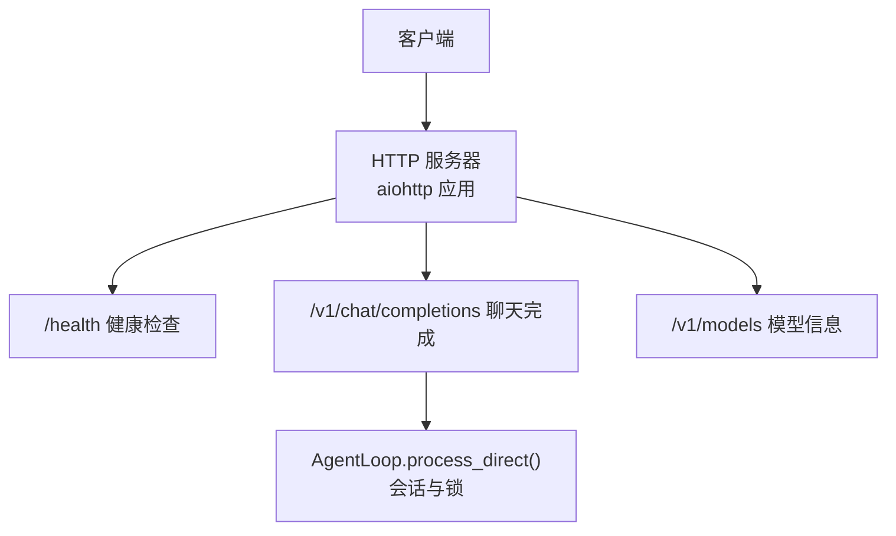
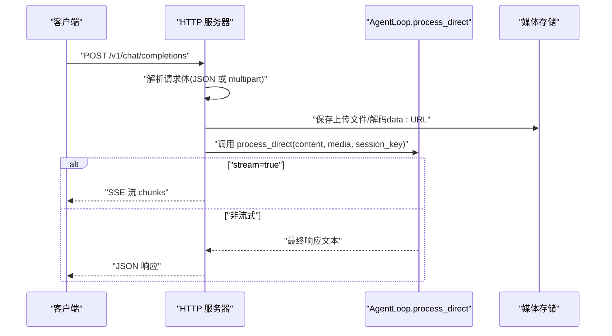
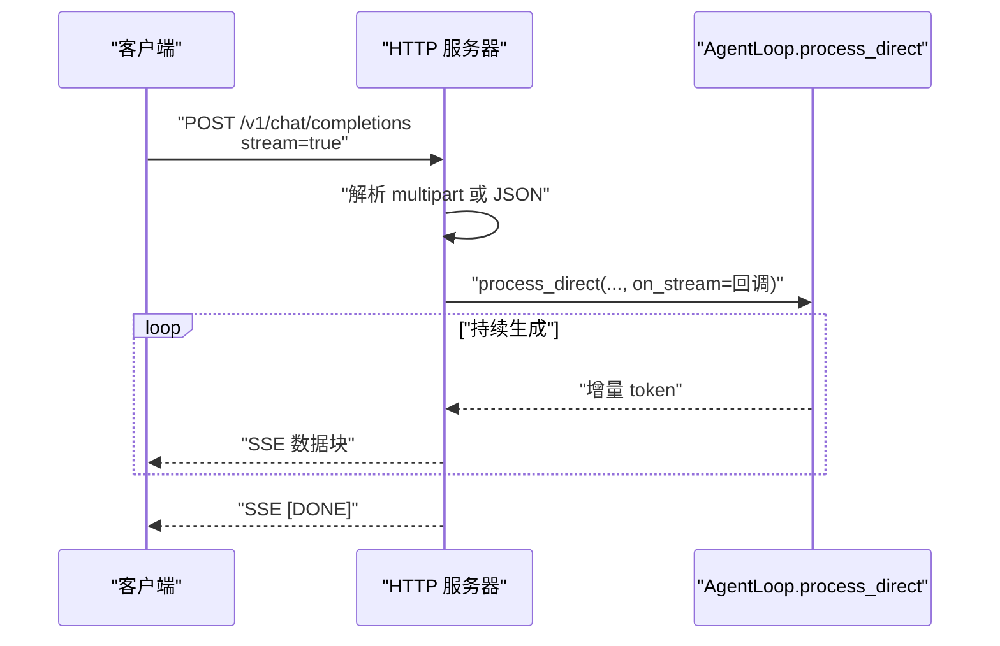
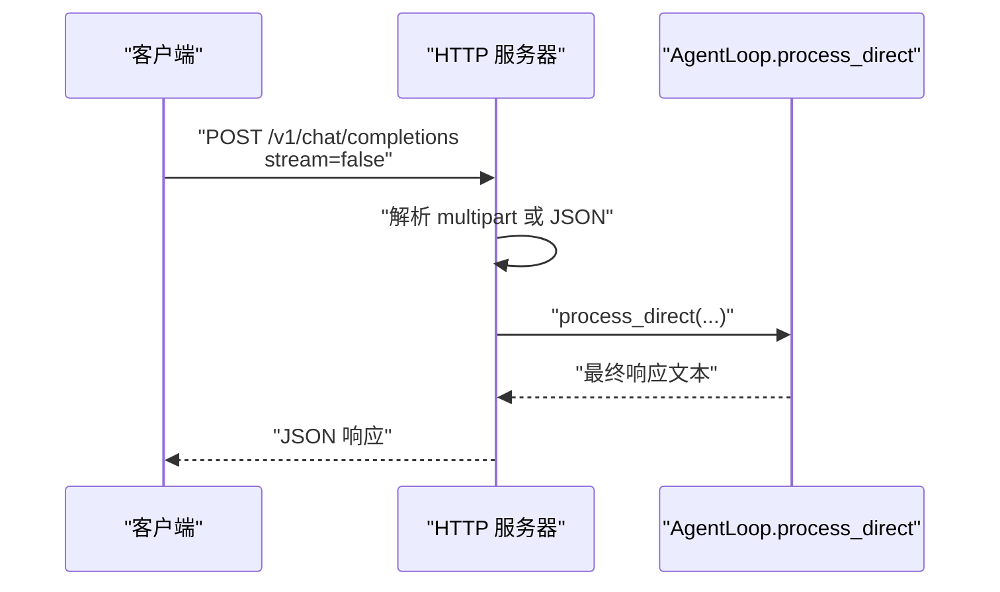
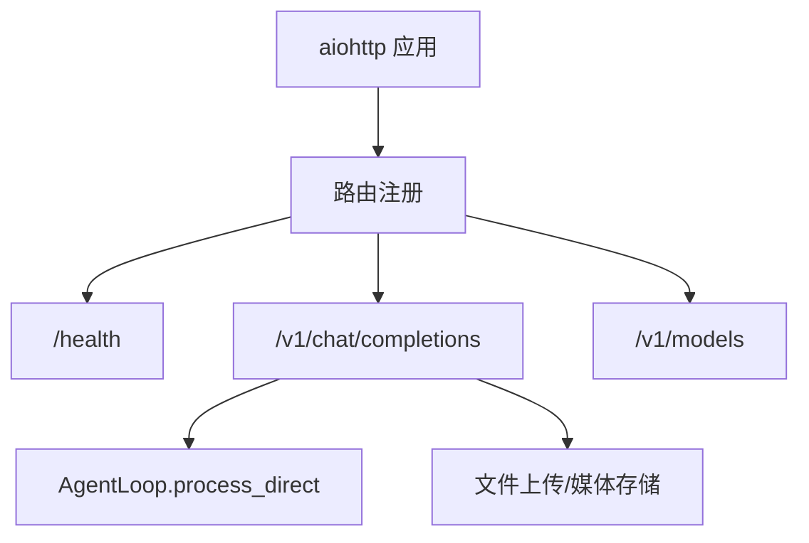

# REST API

<cite>
**本文引用的文件**
- [secbot/api/server.py](file://secbot/api/server.py)
- [pyproject.toml](file://pyproject.toml)
</cite>

## 目录
1. [简介](#简介)
2. [项目结构](#项目结构)
3. [核心组件](#核心组件)
4. [架构总览](#架构总览)
5. [详细组件分析](#详细组件分析)
6. [依赖分析](#依赖分析)
7. [性能考虑](#性能考虑)
8. [故障排查指南](#故障排查指南)
9. [结论](#结论)
10. [附录](#附录)

## 简介
本文件为该代码库中提供的 OpenAI 兼容 HTTP API 的完整接口文档，覆盖以下端点：
- 健康检查：GET /health
- 聊天完成：POST /v1/chat/completions（支持 JSON 与 multipart/form-data）
- 模型信息：GET /v1/models

文档内容包括：
- 请求与响应的数据格式、JSON 模式与字段定义
- 认证机制、请求头要求与错误响应格式
- 文件上传处理、媒体文件管理与大小限制
- API 版本控制策略与向后兼容性说明
- 完整端点清单、参数说明与示例响应位置

## 项目结构
与本 API 相关的核心文件位于 secbot/api/server.py，负责：
- 注册路由：/health、/v1/chat/completions、/v1/models
- 处理聊天完成请求（含流式与非流式）
- 提供模型列表
- 处理健康检查

图表来源
- [secbot/api/server.py:397-400](file://secbot/api/server.py#L397-L400)

章节来源
- [secbot/api/server.py:1-401](file://secbot/api/server.py#L1-L401)

## 核心组件
- HTTP 应用工厂：create_app
  - 初始化 aiohttp 应用，设置路由、超时、模型名与会话锁字典
  - 设置客户端最大请求体大小（用于 base64 图片）
- 路由处理器：
  - handle_health：返回状态
  - handle_chat_completions：处理聊天完成请求（JSON 与 multipart/form-data），支持流式输出
  - handle_models：返回可用模型列表
- 工具函数：
  - 错误响应构造器
  - SSE 流块生成
  - JSON 与 multipart 解析
  - 文件上传解析与大小限制

章节来源
- [secbot/api/server.py:381-400](file://secbot/api/server.py#L381-L400)
- [secbot/api/server.py:194-351](file://secbot/api/server.py#L194-L351)
- [secbot/api/server.py:353-368](file://secbot/api/server.py#L353-L368)
- [secbot/api/server.py:371-373](file://secbot/api/server.py#L371-L373)

## 架构总览
下图展示客户端到服务端的交互流程，以及关键数据在各组件间的传递。

图表来源
- [secbot/api/server.py:194-351](file://secbot/api/server.py#L194-L351)

## 详细组件分析

### 健康检查 /health
- 方法：GET
- 路径：/health
- 功能：返回服务健康状态
- 成功响应：{"status":"ok"}
- 错误响应：无（始终成功）

章节来源
- [secbot/api/server.py:371-373](file://secbot/api/server.py#L371-L373)

### 聊天完成 /v1/chat/completions
- 方法：POST
- 路径：/v1/chat/completions
- 支持两种请求体格式：
  - JSON（Content-Type: application/json）
  - multipart/form-data（多部分表单）

#### JSON 请求体字段
- messages: 数组，仅允许一个元素且必须为用户消息
  - role: 必须为 "user"
  - content: 字符串或对象数组
    - 当为字符串：直接作为文本输入
    - 当为数组：支持混合类型
      - type: "text"，text: 文本片段
      - type: "image_url"，image_url.url: data: 基础数据 URL 或本地路径（远程 URL 不支持）
- stream: 可选布尔值，默认 false；true 时启用流式输出
- model: 可选字符串；若提供则必须与服务配置一致
- session_id: 可选字符串；用于区分会话
- 其他字段：按需传入，但当前实现主要使用上述字段

请求头
- Content-Type: application/json 或 multipart/form-data
- Accept: text/event-stream（当 stream=true 时）

响应
- 非流式：返回标准 OpenAI 兼容响应对象
  - id: 字符串
  - object: "chat.completion"
  - created: 时间戳
  - model: 模型名
  - choices: 数组
    - index: 整数
    - message: {role: "assistant", content: 文本}
    - finish_reason: "stop"
  - usage: {prompt_tokens, completion_tokens, total_tokens}
- 流式：SSE 输出多个 chunk，最后以 [DONE] 结束

错误响应
- 400：请求体无效、内容格式不支持、model 与配置不一致
- 413：文件过大或上传无效
- 504：请求超时
- 500：内部错误

文件上传与媒体处理（multipart/form-data）
- 表单项
  - message: 文本内容
  - session_id: 会话标识
  - model: 模型名称（可选）
  - files: 多个文件（二进制），每个文件大小受限制
- 上传行为
  - 将每个文件写入媒体目录并记录路径
  - 若未提供 message，则默认使用提示语句
- 大小限制
  - 单文件大小上限由内部常量控制
  - 客户端最大请求体大小在应用初始化时设置

章节来源
- [secbot/api/server.py:194-351](file://secbot/api/server.py#L194-L351)
- [secbot/api/server.py:112-186](file://secbot/api/server.py#L112-L186)
- [secbot/api/server.py:381-400](file://secbot/api/server.py#L381-L400)

#### /v1/chat/completions 请求/响应序列图（流式）

图表来源
- [secbot/api/server.py:236-304](file://secbot/api/server.py#L236-L304)

#### /v1/chat/completions 请求/响应序列图（非流式）

图表来源
- [secbot/api/server.py:306-350](file://secbot/api/server.py#L306-L350)

### 模型信息 /v1/models
- 方法：GET
- 路径：/v1/models
- 返回：可用模型列表
  - object: "list"
  - data: 数组，每项包含
    - id: 模型名
    - object: "model"
    - created: 时间戳
    - owned_by: "secbot"

章节来源
- [secbot/api/server.py:353-368](file://secbot/api/server.py#L353-L368)

## 依赖分析
- aiohttp：HTTP 服务器框架，负责路由注册与请求处理
- AgentLoop：业务处理核心，负责对话生成与工具调用
- 媒体处理：基于文件系统存储上传文件，受大小限制约束
- 配置与版本：通过应用参数注入模型名与超时时间

图表来源
- [secbot/api/server.py:397-400](file://secbot/api/server.py#L397-L400)

章节来源
- [secbot/api/server.py:194-351](file://secbot/api/server.py#L194-L351)
- [secbot/api/server.py:353-368](file://secbot/api/server.py#L353-L368)

## 性能考虑
- 超时控制：每请求超时时间可通过应用参数配置，默认值见应用工厂
- 并发与锁：按会话键维护互斥锁，避免并发冲突
- 流式输出：SSE 流式传输减少内存占用，提升大响应场景体验
- 媒体大小限制：防止异常大文件导致资源耗尽

章节来源
- [secbot/api/server.py:381-400](file://secbot/api/server.py#L381-L400)
- [secbot/api/server.py:200-230](file://secbot/api/server.py#L200-L230)

## 故障排查指南
常见错误与处理建议：
- 400 错误
  - JSON 无效或消息格式不正确
  - model 与服务配置不一致
  - 处理：检查请求体结构与 model 字段
- 413 错误
  - 上传文件超过大小限制
  - 处理：减小文件体积或拆分上传
- 504 错误
  - 请求超时
  - 处理：增大超时配置或优化下游处理逻辑
- 500 错误
  - 内部异常
  - 处理：查看服务日志定位问题

章节来源
- [secbot/api/server.py:217-223](file://secbot/api/server.py#L217-L223)
- [secbot/api/server.py:341-348](file://secbot/api/server.py#L341-L348)

## 结论
本 API 提供了 OpenAI 兼容的聊天完成能力，支持 JSON 与 multipart/form-data 两种输入方式，并通过 SSE 实现流式输出。模型信息与健康检查端点便于集成与运维监控。通过会话锁与超时控制保障并发安全与稳定性；通过媒体大小限制与文件系统存储确保资源可控。

## 附录

### 端点完整清单
- GET /health
  - 用途：健康检查
  - 成功响应：{"status":"ok"}
- POST /v1/chat/completions
  - 用途：生成回复（支持流式）
  - 请求体格式：application/json 或 multipart/form-data
  - JSON 字段要点：messages（仅一个用户消息）、content（字符串或对象数组）、stream、model、session_id
  - multipart 字段要点：message、session_id、model、files
  - 响应：非流式为标准 OpenAI 兼容对象；流式为 SSE
- GET /v1/models
  - 用途：查询可用模型
  - 响应：包含模型列表与元信息

章节来源
- [secbot/api/server.py:371-373](file://secbot/api/server.py#L371-L373)
- [secbot/api/server.py:194-351](file://secbot/api/server.py#L194-L351)
- [secbot/api/server.py:353-368](file://secbot/api/server.py#L353-L368)

### 认证机制
- 本 API 未内置认证逻辑，通常由前置网关或反向代理负责鉴权与转发
- 如需自定义认证，请在应用层扩展路由中间件或在上游接入鉴权组件

章节来源
- [secbot/api/server.py:397-400](file://secbot/api/server.py#L397-L400)

### 请求头要求
- Content-Type：application/json 或 multipart/form-data
- Accept：text/event-stream（当 stream=true 时）

章节来源
- [secbot/api/server.py:196-216](file://secbot/api/server.py#L196-L216)

### 错误响应格式
- 统一结构：{"error":{"message":"...","type":"...","code":...}}
- 常见类型：
  - invalid_request_error：请求参数或格式错误
  - server_error：服务器内部错误

章节来源
- [secbot/api/server.py:50-54](file://secbot/api/server.py#L50-L54)

### 文件上传与媒体管理
- 支持 multipart/form-data 的 files 字段上传多个文件
- 单文件大小限制由内部常量控制
- 上传文件保存至媒体目录并记录绝对路径
- JSON 中的 image_url 支持 data: 基础数据 URL，远程 URL 不支持

章节来源
- [secbot/api/server.py:152-186](file://secbot/api/server.py#L152-L186)
- [secbot/api/server.py:132-142](file://secbot/api/server.py#L132-L142)

### API 版本控制与兼容性
- 版本策略：采用 /v1 前缀进行版本化，便于未来演进
- 兼容性：保持 OpenAI 兼容响应结构，降低迁移成本
- 向后兼容：新增字段以可选形式提供，不影响现有客户端

章节来源
- [secbot/api/server.py:381-400](file://secbot/api/server.py#L381-L400)