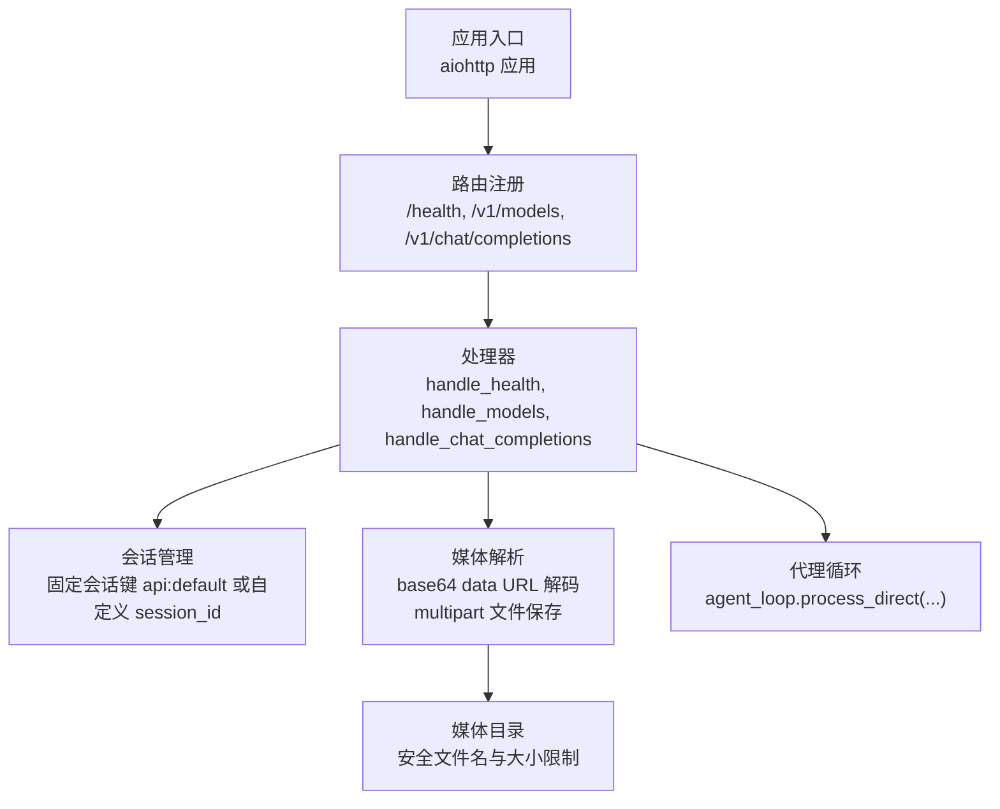
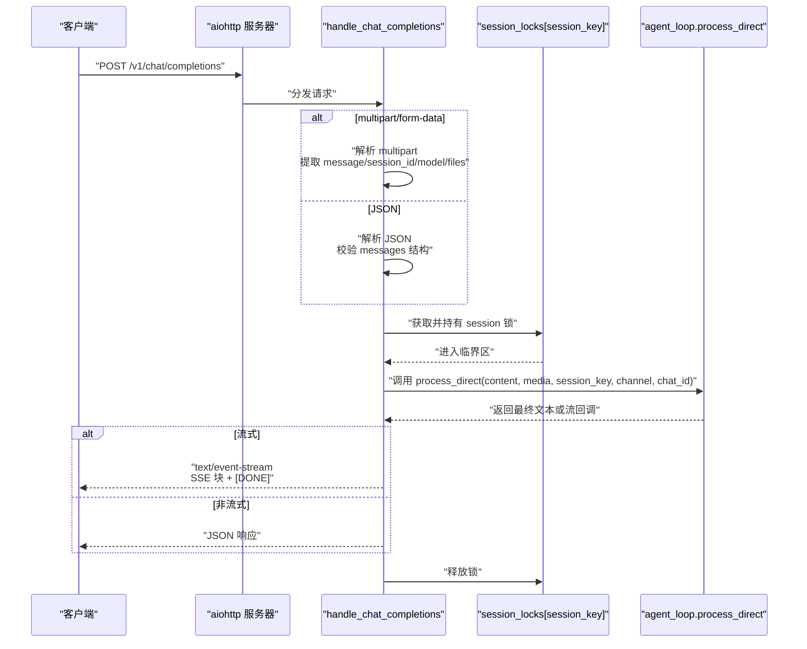
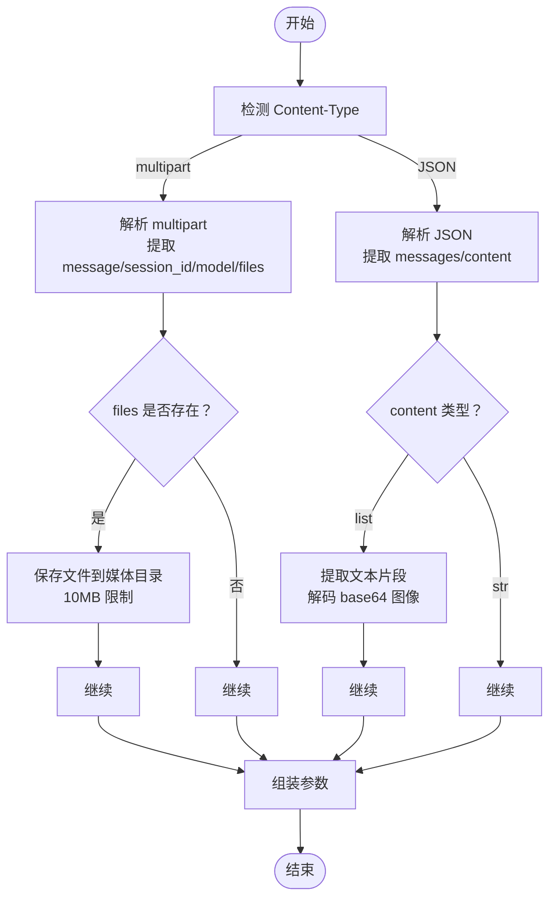
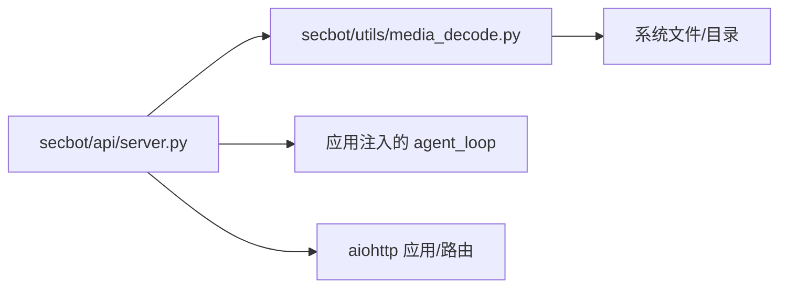

# REST API端点

<cite>
**本文档引用的文件**
- [secbot/api/server.py](file://secbot/api/server.py)
- [secbot/api/__init__.py](file://secbot/api/__init__.py)
- [secbot/api/prompts.py](file://secbot/api/prompts.py)
- [secbot/utils/media_decode.py](file://secbot/utils/media_decode.py)
- [tests/test_openai_api.py](file://tests/test_openai_api.py)
- [tests/test_api_attachment.py](file://tests/test_api_attachment.py)
- [docs/openai-api.md](file://docs/openai-api.md)
- [docs/python-sdk.md](file://docs/python-sdk.md)
- [webui/src/hooks/useAttachedImages.ts](file://webui/src/hooks/useAttachedImages.ts)
- [webui/src/lib/imageEncode.ts](file://webui/src/lib/imageEncode.ts)
- [webui/src/workers/imageEncode.worker.ts](file://webui/src/workers/imageEncode.worker.ts)
- [secbot/channels/websocket.py](file://secbot/channels/websocket.py)
</cite>

## 目录
1. [简介](#简介)
2. [项目结构](#项目结构)
3. [核心组件](#核心组件)
4. [架构总览](#架构总览)
5. [详细组件分析](#详细组件分析)
6. [依赖关系分析](#依赖关系分析)
7. [性能考虑](#性能考虑)
8. [故障排查指南](#故障排查指南)
9. [结论](#结论)
10. [附录](#附录)

## 简介
本文件为 VAPT3 的 OpenAI 兼容 REST API 提供完整、可操作的端点文档与实现细节说明。覆盖以下核心端点：
- GET /health 健康检查
- GET /v1/models 模型列表
- POST /v1/chat/completions 聊天补全（支持 JSON 与 multipart/form-data）

同时详细说明：
- 请求/响应格式、状态码、错误处理
- 会话隔离机制
- 文件上传支持（base64 data URL 与 multipart）
- 流式响应（Server-Sent Events）
- 重试策略与超时控制
- 多编程语言客户端调用示例

## 项目结构
后端基于 aiohttp 构建，API 路由集中在 API 服务器模块，媒体解析与文件大小限制通过共享工具模块实现。



图表来源
- [secbot/api/server.py:381-400](file://secbot/api/server.py#L381-L400)
- [secbot/api/server.py:194-351](file://secbot/api/server.py#L194-L351)
- [secbot/utils/media_decode.py:28-56](file://secbot/utils/media_decode.py#L28-L56)

章节来源
- [secbot/api/server.py:1-401](file://secbot/api/server.py#L1-L401)
- [secbot/api/__init__.py:1-2](file://secbot/api/__init__.py#L1-L2)

## 核心组件
- 应用工厂 create_app：初始化 aiohttp 应用、注入 agent_loop、模型名与超时，并注册路由。
- 健康检查 handle_health：返回简单健康状态。
- 模型列表 handle_models：返回当前可用模型（受 app 配置约束）。
- 聊天补全 handle_chat_completions：支持 JSON 与 multipart；支持流式与非流式；支持会话隔离与媒体文件。

章节来源
- [secbot/api/server.py:353-374](file://secbot/api/server.py#L353-L374)
- [secbot/api/server.py:381-400](file://secbot/api/server.py#L381-L400)
- [secbot/api/server.py:194-351](file://secbot/api/server.py#L194-L351)

## 架构总览
下图展示从客户端到代理循环的调用链路，以及媒体解析与会话锁的关键节点。



图表来源
- [secbot/api/server.py:194-351](file://secbot/api/server.py#L194-L351)
- [secbot/api/server.py:262-304](file://secbot/api/server.py#L262-L304)

## 详细组件分析

### GET /health 健康检查
- 方法与路径：GET /health
- 功能：返回服务健康状态
- 成功响应：200 OK，JSON 对象包含状态字段
- 示例响应体：
  ```json
  {"status":"ok"}
  ```
- cURL 示例：
  ```bash
  curl http://127.0.0.1:8900/health
  ```

章节来源
- [secbot/api/server.py:371-374](file://secbot/api/server.py#L371-L374)

### GET /v1/models 模型列表
- 方法与路径：GET /v1/models
- 功能：返回当前可用模型列表
- 成功响应：200 OK，OpenAI 兼容的 list 结构
- 响应体字段：
  - object: "list"
  - data: 数组，元素为模型对象
    - id: 模型名称（来自 app 配置）
    - object: "model"
    - created: 时间戳
    - owned_by: "secbot"
- 示例响应体：
  ```json
  {
    "object": "list",
    "data": [
      {
        "id": "secbot",
        "object": "model",
        "created": 0,
        "owned_by": "secbot"
      }
    ]
  }
  ```
- cURL 示例：
  ```bash
  curl http://127.0.0.1:8900/v1/models
  ```

章节来源
- [secbot/api/server.py:353-368](file://secbot/api/server.py#L353-L368)

### POST /v1/chat/completions 聊天补全
- 方法与路径：POST /v1/chat/completions
- 内容类型：
  - application/json（推荐）
  - multipart/form-data（支持文件上传）
- 请求头要求：
  - Content-Type：application/json 或 multipart/form-data
  - 可选：自定义请求头（如认证头，取决于部署）
- 查询参数：无
- 请求体格式（两种模式）：

  1) JSON 模式
  - messages: 必填，数组，且必须包含且仅包含一个 role 为 "user" 的消息
  - content: 支持纯文本或 OpenAI 多模态内容数组
    - 文本片段：{"type":"text","text":"..."}
    - 图像片段：{"type":"image_url","image_url":{"url":"data:...;base64,..."}}（不支持远程 URL）
  - session_id: 可选，字符串，用于会话隔离
  - model: 可选，字符串，仅允许与服务端配置的模型名一致
  - stream: 可选，布尔，true 表示启用流式响应
  - 其他字段：按 OpenAI 兼容语义透传

  2) multipart/form-data 模式
  - message: 可选，字符串，作为用户输入文本
  - session_id: 可选，字符串，会话隔离键
  - model: 可选，字符串，模型名（需与服务端配置一致）
  - files: 可选，二进制文件，支持多文件上传
- 响应格式：
  - 非流式：200 OK，JSON，OpenAI 兼容的 chat.completion 结构
  - 流式：200 OK，Content-Type: text/event-stream，SSE 块序列，最后以 [DONE] 结束
- 响应体字段（非流式）：
  - id: 唯一请求标识
  - object: "chat.completion"
  - created: 时间戳
  - model: 模型名
  - choices: 数组
    - index: 0
    - message: {"role":"assistant","content":"..."}
    - finish_reason: "stop"
  - usage: {"prompt_tokens":0,"completion_tokens":0,"total_tokens":0}
- 响应体字段（流式）：
  - 每个 SSE 块包含：
    - id: 块级标识
    - object: "chat.completion.chunk"
    - created: 时间戳
    - model: 模型名
    - choices: 数组
      - index: 0
      - delta: {"content":"..."}（增量文本）
      - finish_reason: 最后一块包含 "stop"
  - 结束块：data: [DONE]
- 状态码：
  - 200：成功
  - 400：请求无效（如缺少 messages、非单用户消息、远程图像 URL、模型名不匹配、JSON 解析失败、文件过大等）
  - 413：请求实体过大（文件超过限制）
  - 500：内部服务器错误
  - 504：请求超时
- 错误响应体：
  - {"error":{"message":"...","type":"...","code":...}}
- 会话隔离：
  - 默认会话键：api:default
  - 自定义 session_id：api:{session_id}
  - 同一会话键内的请求串行化执行，确保上下文一致性
- 文件上传支持：
  - base64 data URL：仅支持 data: 开头的内联数据，自动解码并保存至媒体目录，扩展名由 MIME 推断
  - multipart/form-data：直接保存文件，支持多文件
  - 大小限制：默认 10MB/文件
  - 安全性：使用安全文件名与媒体目录隔离
- 流式响应（SSE）：
  - Content-Type: text/event-stream
  - 逐块发送增量内容，最后发送 [DONE]
- 重试策略：
  - 当非流式响应为空时，自动重试一次；若仍为空，使用回退消息
  - 超时：由 app.request_timeout 控制，默认 120 秒
- 示例请求与响应（JSON 模式）：
  - cURL：
    ```bash
    curl http://127.0.0.1:8900/v1/chat/completions \
      -H "Content-Type: application/json" \
      -d '{
        "messages": [{"role": "user", "content": "hi"}],
        "session_id": "my-session"
      }'
    ```
  - 响应（简化）：
    ```json
    {
      "id": "chatcmpl-...",
      "object": "chat.completion",
      "created": 1700000000,
      "model": "secbot",
      "choices": [{"index":0,"message":{"role":"assistant","content":"..."},"finish_reason":"stop"}],
      "usage": {"prompt_tokens":0,"completion_tokens":0,"total_tokens":0}
    }
    ```
- 示例请求与响应（流式）：
  - cURL：
    ```bash
    curl http://127.0.0.1:8900/v1/chat/completions \
      -H "Content-Type: application/json" \
      -d '{
        "messages": [{"role": "user", "content": "hi"}],
        "stream": true
      }'
    ```
  - 响应（SSE 片段）：
    ```
    data: {"id":"...","object":"chat.completion.chunk", ... "choices":[{"index":0,"delta":{"content":"..."},"finish_reason":null}]}
    ...
    data: [DONE]
    ```
- 示例请求与响应（multipart）：
  - cURL：
    ```bash
    curl http://127.0.0.1:8900/v1/chat/completions \
      -F "message=Summarize this report" \
      -F "files=@report.docx"
    ```
- Python 客户端示例（requests/openai）：
  - requests：
    ```python
    import requests

    resp = requests.post(
        "http://127.0.0.1:8900/v1/chat/completions",
        json={"messages": [{"role": "user", "content": "hi"}], "session_id": "my-session"},
        timeout=120,
    )
    resp.raise_for_status()
    print(resp.json()["choices"][0]["message"]["content"])
    ```
  - openai：
    ```python
    from openai import OpenAI

    client = OpenAI(base_url="http://127.0.0.1:8900/v1", api_key="dummy")

    resp = client.chat.completions.create(
        model="MiniMax-M2.7",
        messages=[{"role": "user", "content": "hi"}],
        extra_body={"session_id": "my-session"},
    )
    print(resp.choices[0].message.content)
    ```

章节来源
- [secbot/api/server.py:194-351](file://secbot/api/server.py#L194-L351)
- [secbot/api/server.py:112-186](file://secbot/api/server.py#L112-L186)
- [secbot/utils/media_decode.py:28-56](file://secbot/utils/media_decode.py#L28-L56)
- [tests/test_openai_api.py:83-288](file://tests/test_openai_api.py#L83-L288)
- [tests/test_api_attachment.py:69-134](file://tests/test_api_attachment.py#L69-L134)
- [docs/openai-api.md:33-122](file://docs/openai-api.md#L33-L122)
- [docs/python-sdk.md:88-220](file://docs/python-sdk.md#L88-L220)

### 会话隔离机制
- 固定会话键：api:default（未指定 session_id）
- 自定义会话键：api:{session_id}
- 并发控制：每个会话键对应一个 asyncio.Lock，保证同一会话内请求串行化，避免并发写入导致的历史错乱
- 上下文持久化：agent_loop.process_direct 在指定 session_key 下维护对话历史

章节来源
- [secbot/api/server.py:41-42](file://secbot/api/server.py#L41-L42)
- [secbot/api/server.py:228-230](file://secbot/api/server.py#L228-L230)
- [secbot/api/server.py:262-287](file://secbot/api/server.py#L262-L287)

### 文件上传支持（base64 与 multipart）
- base64 data URL
  - 仅支持 data: 开头的内联数据
  - 自动解码并保存至媒体目录，扩展名由 MIME 推断
  - 大小限制：默认 10MB/文件
- multipart/form-data
  - files 字段支持多文件上传
  - 每个文件独立保存，文件名安全化
  - 大小限制：默认 10MB/文件
- 媒体解析流程（简化）


图表来源
- [secbot/api/server.py:152-186](file://secbot/api/server.py#L152-L186)
- [secbot/api/server.py:112-149](file://secbot/api/server.py#L112-L149)
- [secbot/utils/media_decode.py:28-56](file://secbot/utils/media_decode.py#L28-L56)

章节来源
- [secbot/api/server.py:112-186](file://secbot/api/server.py#L112-L186)
- [secbot/utils/media_decode.py:28-56](file://secbot/utils/media_decode.py#L28-L56)
- [webui/src/hooks/useAttachedImages.ts:43-49](file://webui/src/hooks/useAttachedImages.ts#L43-L49)
- [webui/src/lib/imageEncode.ts:65-94](file://webui/src/lib/imageEncode.ts#L65-L94)
- [webui/src/workers/imageEncode.worker.ts:83-119](file://webui/src/workers/imageEncode.worker.ts#L83-L119)

### 流式响应（Server-Sent Events）
- 触发条件：请求体设置 stream=true
- 响应头：
  - Content-Type: text/event-stream
  - Cache-Control: no-cache
  - Connection: keep-alive
  - 启用压缩
- 数据格式：每块为一条 JSON，最后发送 [DONE]
- 客户端消费建议：使用 fetch + ReadableStream 或 SSE 客户端库

章节来源
- [secbot/api/server.py:236-304](file://secbot/api/server.py#L236-L304)

### 错误处理与状态码
- 400：请求无效
  - 缺少 messages
  - 非单用户消息
  - 远程图像 URL（不支持）
  - 模型名不匹配
  - JSON 解析失败
- 413：请求实体过大
  - base64 payload 超限
  - multipart 单文件超限
- 500：内部服务器错误
  - 处理异常
- 504：请求超时
  - 超过 app.request_timeout
- 错误响应体统一为：
  ```json
  {"error":{"message":"...","type":"...","code":...}}
  ```

章节来源
- [secbot/api/server.py:50-54](file://secbot/api/server.py#L50-L54)
- [secbot/api/server.py:217-223](file://secbot/api/server.py#L217-L223)
- [tests/test_openai_api.py:83-134](file://tests/test_openai_api.py#L83-L134)

### 重试策略
- 非流式响应为空时，自动重试一次；若仍为空，使用回退消息
- 超时：由 app.request_timeout 控制（默认 120 秒）

章节来源
- [secbot/api/server.py:309-348](file://secbot/api/server.py#L309-L348)
- [tests/test_openai_api.py:344-400](file://tests/test_openai_api.py#L344-L400)

## 依赖关系分析
- 组件耦合
  - API 服务器依赖 agent_loop（外部注入），通过 process_direct 调用代理循环
  - 媒体解析与文件大小限制通过共享模块提供，确保 API 与 WebSocket 通道一致
- 外部依赖
  - aiohttp：Web 服务器框架
  - loguru：日志
  - mimetypes/base64：媒体解码
- 可能的循环依赖
  - 无直接循环依赖；模块职责清晰（API、工具、通道）



图表来源
- [secbot/api/server.py:19-30](file://secbot/api/server.py#L19-L30)
- [secbot/utils/media_decode.py:10-16](file://secbot/utils/media_decode.py#L10-L16)

章节来源
- [secbot/api/server.py:19-30](file://secbot/api/server.py#L19-L30)
- [secbot/utils/media_decode.py:10-16](file://secbot/utils/media_decode.py#L10-L16)

## 性能考虑
- 串行化会话：同一 session_key 内请求串行，避免并发写入开销
- 流式输出：SSE 降低内存峰值，适合长文本生成
- 超时控制：合理设置 request_timeout，避免长时间占用资源
- 文件大小限制：默认 10MB，防止大文件拖垮服务端
- 压缩：SSE 响应启用压缩，减少网络传输

## 故障排查指南
- 400 错误
  - 检查 messages 是否仅包含一个用户消息
  - 检查 content 格式是否符合 OpenAI 多模态规范
  - 确认 model 名称与服务端配置一致
- 413 错误
  - base64 payload 是否超过 10MB
  - multipart 单文件是否超过 10MB
- 504 错误
  - 增加 request_timeout 或优化上游模型响应时间
- 500 错误
  - 查看服务端日志定位异常
- 流式连接中断
  - 检查客户端 SSE 处理逻辑，确保正确消费 [DONE] 结束块

章节来源
- [secbot/api/server.py:217-223](file://secbot/api/server.py#L217-L223)
- [secbot/api/server.py:341-348](file://secbot/api/server.py#L341-L348)
- [tests/test_openai_api.py:83-134](file://tests/test_openai_api.py#L83-L134)

## 结论
VAPT3 的 OpenAI 兼容 API 提供了简洁稳定的聊天补全能力，具备会话隔离、文件上传与流式响应等特性。通过合理的错误处理、超时与重试策略，可在多种场景下稳定运行。建议在生产环境中结合部署层的认证与速率限制策略进一步增强安全性与稳定性。

## 附录
- 会话管理与媒体目录
  - 会话键：api:default 或 api:{session_id}
  - 媒体目录：安全文件名与大小限制
- 多模态前端配合
  - 前端对图片进行预编码与校验，确保只上传受支持的 MIME 类型与数量

章节来源
- [secbot/api/server.py:41-42](file://secbot/api/server.py#L41-L42)
- [secbot/utils/media_decode.py:28-56](file://secbot/utils/media_decode.py#L28-L56)
- [webui/src/hooks/useAttachedImages.ts:43-49](file://webui/src/hooks/useAttachedImages.ts#L43-L49)
- [webui/src/lib/imageEncode.ts:65-94](file://webui/src/lib/imageEncode.ts#L65-L94)
- [webui/src/workers/imageEncode.worker.ts:83-119](file://webui/src/workers/imageEncode.worker.ts#L83-L119)