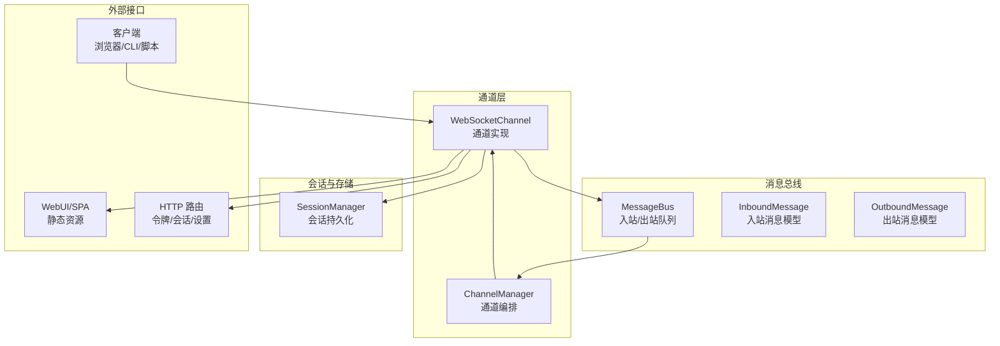
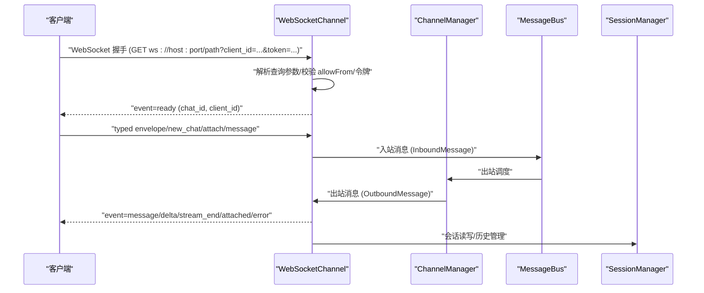
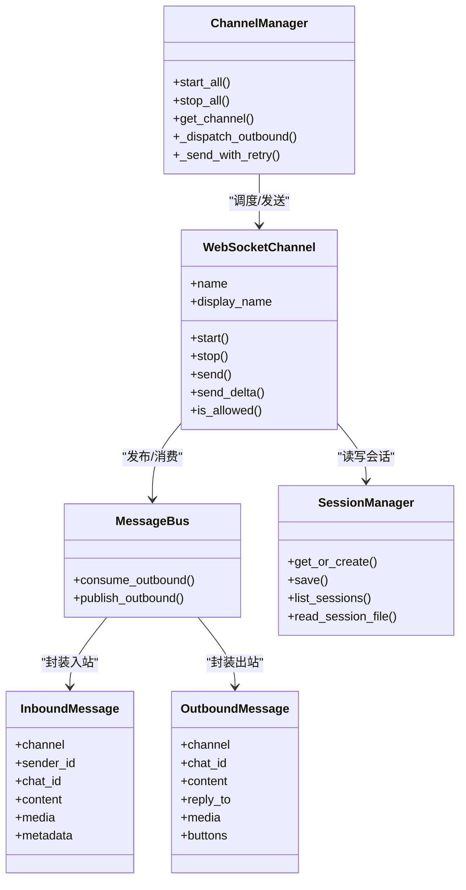

# WebSocket API

<cite>
**本文引用的文件**
- [websocket.md](file://docs/websocket.md)
- [websocket.py](file://secbot/channels/websocket.py)
- [events.py](file://secbot/bus/events.py)
- [manager.py](file://secbot/channels/manager.py)
- [service.py](file://secbot/heartbeat/service.py)
- [manager.py](file://secbot/session/manager.py)
</cite>

## 目录
1. [简介](#简介)
2. [项目结构](#项目结构)
3. [核心组件](#核心组件)
4. [架构总览](#架构总览)
5. [详细组件分析](#详细组件分析)
6. [依赖关系分析](#依赖关系分析)
7. [性能与可靠性](#性能与可靠性)
8. [故障排查指南](#故障排查指南)
9. [结论](#结论)
10. [附录：客户端集成与最佳实践](#附录客户端集成与最佳实践)

## 简介
本文件为 Nanobot 的 WebSocket 实时通信 API 文档，覆盖连接建立流程、消息格式与事件类型、会话与多聊天复用、认证与安全、媒体文件传输、错误处理与重连策略等。读者可据此在 Web 应用、CLI 或脚本中以持久连接的方式与 Agent 进行双向实时交互，并支持流式输出。

## 项目结构
WebSocket 服务由通道层（Channel）实现，通过消息总线（MessageBus）与会话管理（SessionManager）协作，对外提供统一的 WebSocket 协议接口；同时内置 HTTP 路由用于令牌签发、WebUI 引导、会话列表与设置查询等。

图示来源
- [websocket.py:414-800](file://secbot/channels/websocket.py#L414-L800)
- [manager.py:41-120](file://secbot/channels/manager.py#L41-L120)
- [events.py:8-39](file://secbot/bus/events.py#L8-L39)
- [manager.py:239-320](file://secbot/session/manager.py#L239-L320)

章节来源
- [websocket.py:414-800](file://secbot/channels/websocket.py#L414-L800)
- [manager.py:41-120](file://secbot/channels/manager.py#L41-L120)
- [events.py:8-39](file://secbot/bus/events.py#L8-L39)
- [manager.py:239-320](file://secbot/session/manager.py#L239-L320)

## 核心组件
- WebSocketChannel：作为 WebSocket 服务器，负责握手、鉴权、订阅管理、消息分发与事件发送。
- ChannelManager：协调各通道启动/停止、出站消息派发与去重合并、重试与退避。
- MessageBus：入站/出站消息队列，承载 Agent 与通道之间的数据交换。
- SessionManager：会话持久化与历史管理，支持按 key（channel:chat_id）读写 JSONL 文件。
- 事件模型：InboundMessage/OutboundMessage 定义了消息字段与语义。

章节来源
- [websocket.py:414-800](file://secbot/channels/websocket.py#L414-L800)
- [manager.py:41-120](file://secbot/channels/manager.py#L41-L120)
- [events.py:8-39](file://secbot/bus/events.py#L8-L39)
- [manager.py:239-320](file://secbot/session/manager.py#L239-L320)

## 架构总览
WebSocket 服务在启动后监听指定主机与端口，支持可选 TLS；客户端通过查询参数携带 client_id 与 token 建立连接。服务端在握手阶段进行 allow-from 校验与令牌校验，随后向客户端发送 ready 事件并建立订阅。消息通过消息总线路由到对应通道，通道再将消息推送给订阅该 chat_id 的连接集合。

图示来源
- [websocket.py:556-624](file://secbot/channels/websocket.py#L556-L624)
- [websocket.py:473-484](file://secbot/channels/websocket.py#L473-L484)
- [manager.py:263-321](file://secbot/channels/manager.py#L263-L321)
- [events.py:8-39](file://secbot/bus/events.py#L8-L39)
- [manager.py:239-320](file://secbot/session/manager.py#L239-L320)

## 详细组件分析

### 连接建立与握手
- 连接 URL：ws://host:port/path?client_id=...&token=...
- 握手阶段：
  - 校验 path 与 Upgrade 头；
  - 校验 allowFrom（client_id 长度限制与白名单）；
  - 校验令牌：静态 token 或 issued token（一次性），或 token_issue_secret 授权的签发；
  - 成功后发送 ready 事件，包含默认 chat_id 与 client_id。
- TLS 支持：当配置证书与私钥时启用 WSS，强制 TLSv1.2。

章节来源
- [websocket.md:69-80](file://docs/websocket.md#L69-L80)
- [websocket.py:66-142](file://secbot/channels/websocket.py#L66-L142)
- [websocket.py:556-624](file://secbot/channels/websocket.py#L556-L624)
- [websocket.py:489-504](file://secbot/channels/websocket.py#L489-L504)

### 消息格式与事件类型
- 所有帧为 JSON 文本，必须包含 event 字段。
- 服务器 → 客户端事件：
  - ready：连接建立后的首个事件，包含 chat_id 与 client_id。
  - message：完整响应，包含 text、可选 media 与 reply_to。
  - delta：流式文本片段（当 streaming=true）。
  - stream_end：流结束信号。
  - attached：订阅成功确认（new_chat/attach 后返回）。
  - error：软错误（如无效 chat_id/envelope），连接保持开放。
- 客户端 → 服务器：
  - 兼容旧版：纯字符串或 {"content"/"text"/"message": "..."}。
  - 新版 typed envelope：type 字段标识操作，常见类型：
    - new_chat：服务端生成新 chat_id 并订阅；
    - attach：订阅已有 chat_id；
    - message：向指定 chat_id 发送内容，首次使用自动 attach。

章节来源
- [websocket.md:84-166](file://docs/websocket.md#L84-L166)
- [websocket.py:212-261](file://secbot/channels/websocket.py#L212-L261)

### 多聊天复用与订阅管理
- 一个连接可同时订阅多个 chat_id，服务端维护 chat_id → connections 与 connection → chat_ids 的映射。
- chat_id 格式限制：长度 1-64，字符集为字母数字与“_: -”。
- 首次对某 chat_id 发送 message 时自动 attach，无需显式 attach。
- 错误为软错误：返回 error 事件并继续维持连接。

章节来源
- [websocket.md:269-310](file://docs/websocket.md#L269-L310)
- [websocket.py:456-472](file://secbot/channels/websocket.py#L456-L472)
- [websocket.py:237-239](file://secbot/channels/websocket.py#L237-L239)

### 认证与安全
- 静态 token：配置项 token，客户端需在查询参数中提供匹配值（定时安全比较）。
- issued token：通过 token_issue_path 提供一次性短命令牌，客户端在握手时携带。
- allowFrom：基于 client_id 的访问控制，支持通配与空列表拒绝。
- TLS：开启证书与私钥后启用 WSS，最低版本 TLSv1.2。
- 令牌签发路由：支持 Authorization: Bearer 或 X-Secbot-Auth 头；未配置密钥时会发出警告。

章节来源
- [websocket.md:181-190](file://docs/websocket.md#L181-L190)
- [websocket.md:217-268](file://docs/websocket.md#L217-L268)
- [websocket.py:400-412](file://secbot/channels/websocket.py#L400-L412)
- [websocket.py:530-552](file://secbot/channels/websocket.py#L530-L552)

### 媒体文件与附件
- 出站 message 可包含本地文件路径数组（media 字段）。
- 客户端无法直接访问这些路径，需要共享文件系统或通过 HTTP 服务暴露媒体目录。
- 上传与解码：支持 data URL，限定允许的 MIME 类型（图片/视频），并有大小上限与数量限制。

章节来源
- [websocket.md:319-325](file://docs/websocket.md#L319-L325)
- [websocket.py:267-288](file://secbot/channels/websocket.py#L267-L288)

### 心跳与保活
- 通道层未内置心跳循环；心跳服务独立于 WebSocket 通道，用于周期性任务检查与执行。
- 若需心跳保活，可在客户端侧实现 ping/pong 或使用 WebSocket 层的 ping/pong 机制（通道层未显式暴露相关配置项）。

章节来源
- [service.py:118-149](file://secbot/heartbeat/service.py#L118-L149)

### 会话管理与历史
- 会话键：channel:chat_id，WebSocket 通道使用 websocket:chat_id 前缀过滤。
- 会话持久化：JSONL 文件，支持元数据、时间戳、媒体占位等。
- 历史切片：按消息数与 token 预算切片，保留合法工具调用边界与用户起始点。
- 列表与读取：提供 REST 接口列出会话、读取会话文件，便于 WebUI 使用。

章节来源
- [manager.py:531-576](file://secbot/session/manager.py#L531-L576)
- [manager.py:74-158](file://secbot/session/manager.py#L74-L158)
- [websocket.py:685-700](file://secbot/channels/websocket.py#L685-L700)

### 错误处理与退避
- 软错误：非法 envelope、未知 type、无效 chat_id 等，返回 error 事件并保持连接。
- 出站发送失败：ChannelManager 使用指数退避重试，最多尝试若干次。
- 去重与合并：对连续的流式 delta 进行合并，减少 API 调用与延迟。

章节来源
- [websocket.md:137-142](file://docs/websocket.md#L137-L142)
- [manager.py:380-409](file://secbot/channels/manager.py#L380-L409)
- [manager.py:330-378](file://secbot/channels/manager.py#L330-L378)

## 依赖关系分析

图示来源
- [websocket.py:414-800](file://secbot/channels/websocket.py#L414-L800)
- [manager.py:41-120](file://secbot/channels/manager.py#L41-L120)
- [events.py:8-39](file://secbot/bus/events.py#L8-L39)
- [manager.py:239-320](file://secbot/session/manager.py#L239-L320)

章节来源
- [websocket.py:414-800](file://secbot/channels/websocket.py#L414-L800)
- [manager.py:41-120](file://secbot/channels/manager.py#L41-L120)
- [events.py:8-39](file://secbot/bus/events.py#L8-L39)
- [manager.py:239-320](file://secbot/session/manager.py#L239-L320)

## 性能与可靠性
- 流式输出：当 streaming=true 时，服务端以 delta + stream_end 组合推送，降低首字节延迟。
- 去重与合并：对连续流式 delta 合并，减少网络与 API 调用次数。
- 重试与退避：出站发送失败采用指数退避，提升网络抖动下的稳定性。
- 令牌池容量：issued token 与 API token 最大并发上限为 10,000，超限返回 429。
- 媒体与消息大小：默认最大消息字节数为约 36MB，适配多张图片上传场景。

章节来源
- [websocket.md:197-201](file://docs/websocket.md#L197-L201)
- [websocket.md:179](file://docs/websocket.md#L179)
- [websocket.py:506-508](file://secbot/channels/websocket.py#L506-L508)
- [manager.py:380-409](file://secbot/channels/manager.py#L380-L409)
- [manager.py:330-378](file://secbot/channels/manager.py#L330-L378)

## 故障排查指南
- 握手失败（401/403）：检查 token 是否正确、allowFrom 是否包含 client_id、是否配置了 token_issue_secret。
- 令牌签发失败（401/429）：确认 Authorization 头或 X-Secbot-Auth 与 token_issue_secret 匹配；关注 outstanding tokens 上限。
- 连接被关闭：检查 ping/pong 设置（通道层未显式暴露相关配置），确保客户端维持心跳。
- 无效 chat_id：确认格式与长度限制，避免非法字符。
- 媒体不可访问：确认媒体目录可通过 HTTP 服务暴露或共享挂载。
- 出站消息未送达：查看 ChannelManager 的重试日志与退避行为。

章节来源
- [websocket.py:530-552](file://secbot/channels/websocket.py#L530-L552)
- [websocket.py:506-508](file://secbot/channels/websocket.py#L506-L508)
- [websocket.py:237-239](file://secbot/channels/websocket.py#L237-L239)
- [websocket.md:319-325](file://docs/websocket.md#L319-L325)
- [manager.py:380-409](file://secbot/channels/manager.py#L380-L409)

## 结论
WebSocket 通道为 Nanobot 提供了低延迟、可扩展的实时通信能力，支持多聊天复用、流式输出、令牌签发与会话持久化。通过合理的配置与客户端保活策略，可在生产环境中稳定运行。

## 附录：客户端集成与最佳实践

### 连接参数与认证
- 连接 URL：ws://host:port/path?client_id=...&token=...
- 认证方式：
  - 静态 token：在配置中设置 token，客户端在查询参数中提供；
  - issued token：通过 token_issue_path 获取一次性令牌；
  - allowFrom：在服务端配置允许的 client_id 列表。
- TLS：启用证书与私钥后使用 WSS，最低版本 TLSv1.2。

章节来源
- [websocket.md:69-80](file://docs/websocket.md#L69-L80)
- [websocket.md:181-190](file://docs/websocket.md#L181-L190)
- [websocket.md:217-268](file://docs/websocket.md#L217-L268)
- [websocket.py:489-504](file://secbot/channels/websocket.py#L489-L504)

### 消息类型与序列化
- 服务器 → 客户端事件：ready、message、delta、stream_end、attached、error。
- 客户端 → 服务器：
  - 兼容旧版：纯字符串或 {"content"/"text"/"message": "..."}；
  - 新版：带 type 的 typed envelope（new_chat/attach/message）。
- 序列化：所有帧为 JSON 文本，字段遵循事件定义。

章节来源
- [websocket.md:84-166](file://docs/websocket.md#L84-L166)
- [websocket.py:212-261](file://secbot/channels/websocket.py#L212-L261)

### 会话与多聊天复用
- 一个连接可订阅多个 chat_id，首次对某 chat_id 发送 message 时自动 attach；
- chat_id 为能力凭证，持有者可附加到任意已知 chat_id；
- 服务端维护 fan-out 订阅表，支持同一 chat_id 在多个连接间镜像。

章节来源
- [websocket.md:269-310](file://docs/websocket.md#L269-L310)
- [websocket.py:456-472](file://secbot/channels/websocket.py#L456-L472)

### 媒体与附件
- 出站 message 的 media 字段为本地路径数组，客户端需通过共享文件系统或 HTTP 服务访问；
- 上传 data URL 时受 MIME 白名单与大小限制约束。

章节来源
- [websocket.md:319-325](file://docs/websocket.md#L319-L325)
- [websocket.py:267-288](file://secbot/channels/websocket.py#L267-L288)

### 心跳与断线重连
- 心跳服务独立于 WebSocket 通道，不直接提供 ping/pong 配置；
- 客户端建议实现 ping/pong 或定期发送轻量帧维持连接；
- 断线重连：客户端在 error 事件后可选择重新连接并 attach 到目标 chat_id。

章节来源
- [service.py:118-149](file://secbot/heartbeat/service.py#L118-L149)
- [websocket.md:137-142](file://docs/websocket.md#L137-L142)

### 安全与合规
- 定时安全比较：静态 token 与 issued token 校验使用安全比较；
- 防御纵深：HTTP 与消息级 allowFrom 校验；
- 默认安全：websocket_requires_token 默认 true，仅在可信网络显式关闭。

章节来源
- [websocket.md:311-318](file://docs/websocket.md#L311-L318)
- [websocket.py:400-412](file://secbot/channels/websocket.py#L400-L412)