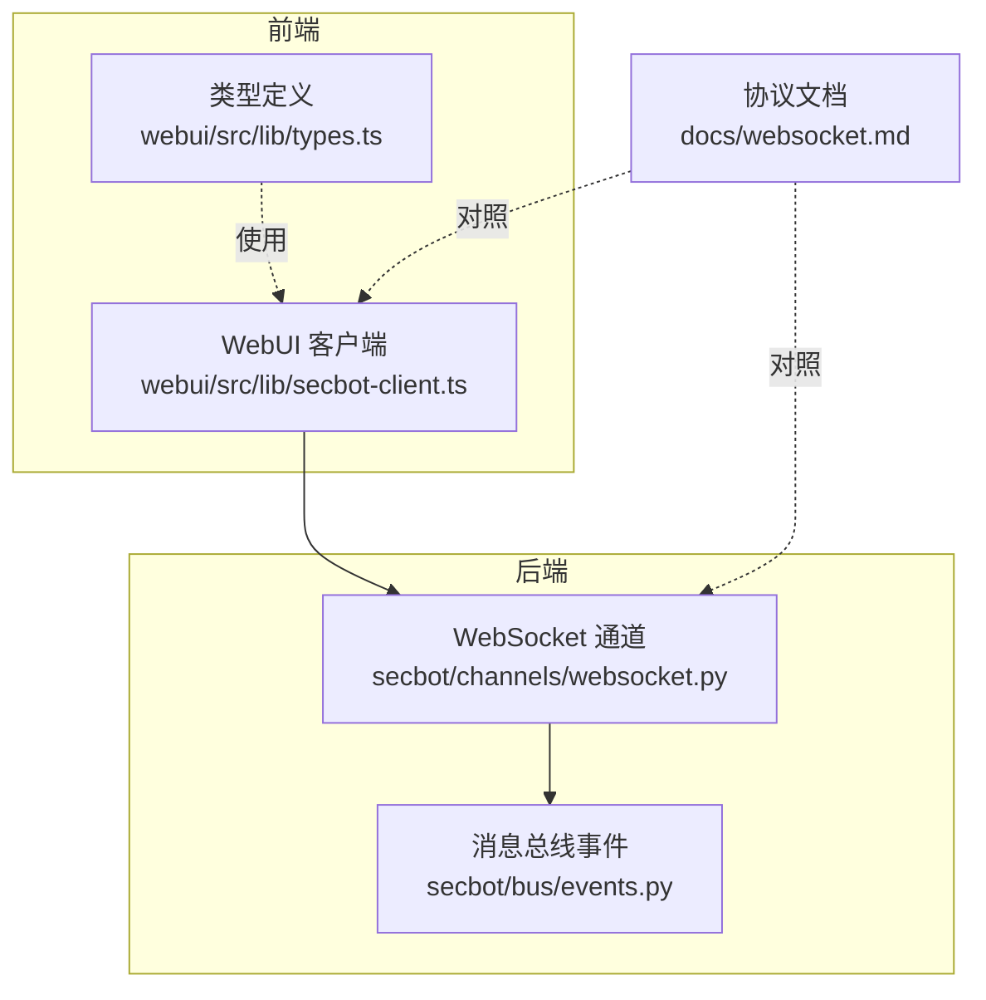
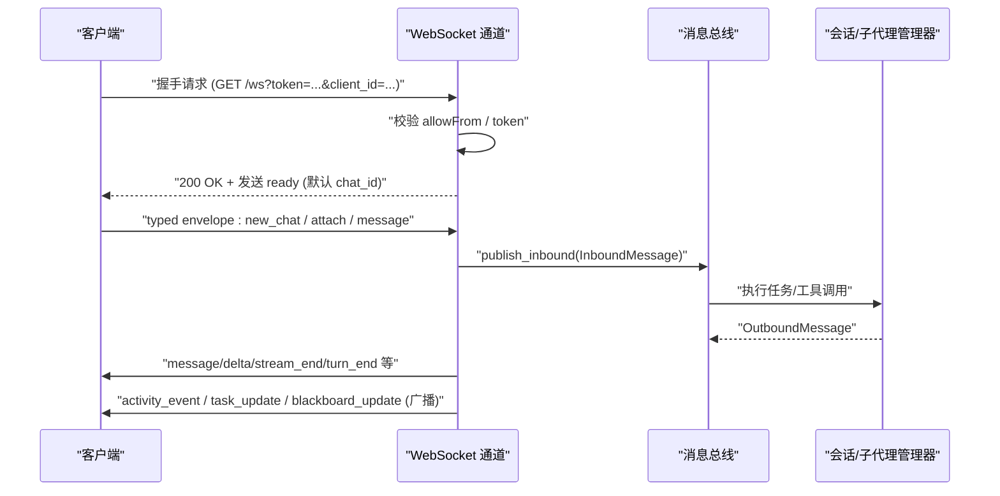
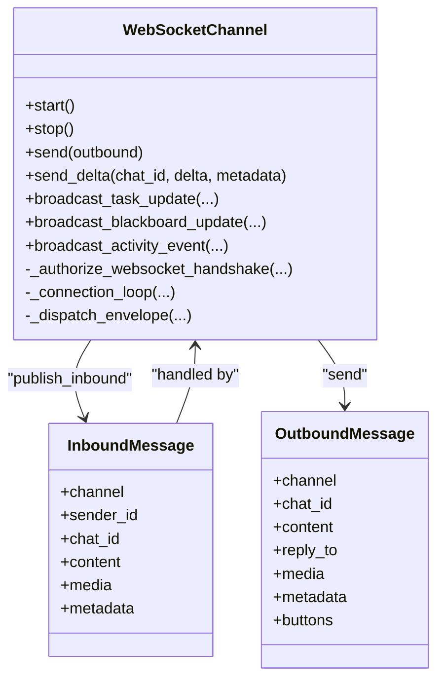

# WebSocket接口

<cite>
**本文引用的文件列表**
- [websocket.md](file://docs/websocket.md)
- [websocket.py](file://secbot/channels/websocket.py)
- [events.py](file://secbot/bus/events.py)
- [secbot-client.ts](file://webui/src/lib/secbot-client.ts)
- [types.ts](file://webui/src/lib/types.ts)
- [test_websocket_channel.py](file://tests/channels/test_websocket_channel.py)
- [test_websocket_integration.py](file://tests/channels/test_websocket_integration.py)
- [test_ws_activity_event.py](file://tests/channels/test_ws_activity_event.py)
- [bootstrap.ts](file://webui/src/lib/bootstrap.ts)
</cite>

## 目录
1. [简介](#简介)
2. [项目结构](#项目结构)
3. [核心组件](#核心组件)
4. [架构总览](#架构总览)
5. [详细组件分析](#详细组件分析)
6. [依赖关系分析](#依赖关系分析)
7. [性能考量](#性能考量)
8. [故障排查指南](#故障排查指南)
9. [结论](#结论)
10. [附录](#附录)

## 简介
本文件系统化梳理 VAPT3 的 WebSocket 接口，覆盖连接建立流程、认证机制、消息协议、事件类型、实时交互模式、连接管理最佳实践，以及与 REST API 的关系与使用场景差异。目标读者既包括需要快速接入的开发者，也包括希望理解整体设计的运维与平台工程师。

## 项目结构
WebSocket 服务位于 secbot 子系统中，作为“通道”之一对外提供实时通信能力。其核心文件与职责如下：
- 文档：docs/websocket.md 提供协议概览、配置参考与示例
- 通道实现：secbot/channels/websocket.py 实现 WebSocket 服务器、握手、鉴权、消息分发与广播
- 事件模型：secbot/bus/events.py 定义入站/出站消息的数据结构
- WebUI 客户端：webui/src/lib/secbot-client.ts 提供连接管理、自动重连、多聊天订阅、消息发送与接收
- 类型定义：webui/src/lib/types.ts 定义事件帧、出站消息、媒体附件等类型
- 测试：tests/channels 下的多个测试文件验证握手、认证、多聊天、广播、活动事件等行为

图表来源
- [websocket.py:474-548](file://secbot/channels/websocket.py#L474-L548)
- [events.py:8-39](file://secbot/bus/events.py#L8-L39)
- [secbot-client.ts:59-93](file://webui/src/lib/secbot-client.ts#L59-L93)
- [types.ts:141-208](file://webui/src/lib/types.ts#L141-L208)
- [websocket.md:1-397](file://docs/websocket.md#L1-L397)

章节来源
- [websocket.md:1-397](file://docs/websocket.md#L1-L397)
- [websocket.py:474-548](file://secbot/channels/websocket.py#L474-L548)
- [events.py:8-39](file://secbot/bus/events.py#L8-L39)
- [secbot-client.ts:59-93](file://webui/src/lib/secbot-client.ts#L59-L93)
- [types.ts:141-208](file://webui/src/lib/types.ts#L141-L208)

## 核心组件
- WebSocket 通道（WebSocketChannel）
  - 负责监听、握手、鉴权、消息解析与分发、广播、静态资源与 REST 辅助接口
  - 支持多聊天订阅、流式输出、媒体附件、心跳与超时控制
- 消息总线事件（InboundMessage/OutboundMessage）
  - 入站消息：来自 WebSocket 的文本或结构化消息，携带 chat_id、sender_id、content、media 等
  - 出站消息：从后端生成，面向 WebSocket 客户端，支持按钮、媒体、回复引用等
- WebUI 客户端（SecbotClient）
  - 单例连接、透明重连、指数退避、自动 re-attach、队列发送、事件分发到各 chat_id
  - 支持 activity_event 全局广播与 per-chat 分发

章节来源
- [websocket.py:474-548](file://secbot/channels/websocket.py#L474-L548)
- [events.py:8-39](file://secbot/bus/events.py#L8-L39)
- [secbot-client.ts:59-93](file://webui/src/lib/secbot-client.ts#L59-L93)

## 架构总览
WebSocket 通道同时承担 WebSocket 服务器与 HTTP 辅助服务的角色：
- WebSocket 服务器：处理握手、认证、消息收发、广播
- HTTP 辅助：提供令牌签发、WebUI 引导、会话列表、通知中心、活动事件流、报告元数据、媒体签名下载等 REST 接口
- 与消息总线集成：入站消息经总线进入 Agent 回路，出站消息由通道广播给订阅者

图表来源
- [websocket.py:1953-2077](file://secbot/channels/websocket.py#L1953-L2077)
- [websocket.py:2146-2251](file://secbot/channels/websocket.py#L2146-L2251)
- [events.py:8-39](file://secbot/bus/events.py#L8-L39)

章节来源
- [websocket.py:1953-2077](file://secbot/channels/websocket.py#L1953-L2077)
- [websocket.py:2146-2251](file://secbot/channels/websocket.py#L2146-L2251)
- [events.py:8-39](file://secbot/bus/events.py#L8-L39)

## 详细组件分析

### 连接建立与握手
- 连接 URL
  - ws://{host}:{port}{path}?client_id={id}&token={token}
  - path 与 token_issue_path 必须不同，且 path 以 “/” 开头
- 握手阶段
  - 校验 allowFrom（client_id 白名单）
  - 校验 token：支持静态 token 或 issued token（一次性），或关闭鉴权（仅本地可信网络）
  - 发送 ready 事件，包含默认 chat_id 与 client_id
- 客户端 ID 规范
  - client_id 最大长度 128；未提供时自动生成 anon- 前缀
- 证书与安全
  - 支持 WSS，强制 TLSv1.2；当 host 为 0.0.0.0 且未配置 token 或 token_issue_secret 时会报错以防止匿名访问

章节来源
- [websocket.md:69-80](file://docs/websocket.md#L69-L80)
- [websocket.py:1953-2077](file://secbot/channels/websocket.py#L1953-L2077)
- [websocket.py:120-195](file://secbot/channels/websocket.py#L120-L195)

### 认证机制
- 静态 token
  - 在配置中设置 token，客户端必须携带 ?token=...
- issued token（推荐）
  - 通过 HTTP 端点签发一次性 token，客户端在握手时携带
  - 支持 token_issue_secret 保护签发端点
- API token（用于嵌入式 WebUI 的 REST 表面）
  - 与 issued token 共享池，带 TTL；用于 /api/* 端点鉴权
- 访问控制
  - allowFrom 限制 client_id；默认允许所有（["*"]）

章节来源
- [websocket.md:181-190](file://docs/websocket.md#L181-L190)
- [websocket.md:217-268](file://docs/websocket.md#L217-L268)
- [websocket.py:798-816](file://secbot/channels/websocket.py#L798-L816)
- [websocket.py:631-654](file://secbot/channels/websocket.py#L631-L654)

### 消息协议与事件类型
- 文本帧与结构化帧
  - 旧版：纯文本或 {"content"/"text"/"message"} 的 JSON
  - 新版：带 type 字段的 typed envelope
- typed envelope 类型
  - new_chat：申请新 chat_id
  - attach：订阅已有 chat_id
  - message：向指定 chat_id 发送内容，可带媒体
  - stop：静默取消当前回合（webui 专用）
- 服务器推送事件
  - ready：连接建立后的首个事件，含默认 chat_id
  - attached：attach/new_chat 成功返回
  - message：完整回复，可含 text、media、reply_to、buttons、kind 等
  - delta：流式片段（streaming=true 时）
  - stream_end：流结束标记
  - turn_end：回合完成
  - session_updated：会话元数据更新
  - error：软错误（连接保持）
- 广播事件
  - task_update：任务状态更新
  - blackboard_update：看板统计更新
  - activity_event：活动事件（工具调用/结果等）

章节来源
- [websocket.md:80-166](file://docs/websocket.md#L80-L166)
- [websocket.py:2146-2251](file://secbot/channels/websocket.py#L2146-L2251)
- [websocket.py:1579-1661](file://secbot/channels/websocket.py#L1579-L1661)

### 多聊天订阅与广播
- 多聊天订阅
  - 一个连接可订阅多个 chat_id，通过 attach/new_chat 管理
  - 默认 chat_id 由 ready 返回，旧版消息默认路由到该 chat_id
- 广播
  - 按 chat_id 范围广播（如 activity_event/task_update/blackboard_update）
  - 1 秒内同事件同 chat_id 去抖
- 媒体处理
  - 支持 data URL 图片/视频上传，服务端解码并签名 URL 供前端下载
  - 媒体路径白名单，SVG 明确排除

章节来源
- [websocket.md:269-310](file://docs/websocket.md#L269-L310)
- [websocket.py:1564-1682](file://secbot/channels/websocket.py#L1564-L1682)
- [websocket.py:2078-2144](file://secbot/channels/websocket.py#L2078-L2144)

### 客户端连接与消息处理（WebUI）
- 连接管理
  - 单例连接、自动重连（指数退避，上限可配）、队列发送、re-attach 已知 chat_id
  - 支持 onReauth 回调刷新 token 后自动重连
- 事件分发
  - ready/attached/message/delta/stream_end/turn_end/session_updated/error
  - activity_event 全局广播与 per-chat 分发
- 出站消息
  - new_chat/attach/stop/message（可带 media）
  - webui 标记用于区分来源

章节来源
- [secbot-client.ts:59-93](file://webui/src/lib/secbot-client.ts#L59-L93)
- [secbot-client.ts:155-182](file://webui/src/lib/secbot-client.ts#L155-L182)
- [secbot-client.ts:226-244](file://webui/src/lib/secbot-client.ts#L226-L244)
- [types.ts:141-208](file://webui/src/lib/types.ts#L141-L208)

### 与 REST API 的关系与使用场景差异
- REST API
  - 用于配置、会话管理、通知、活动事件历史、报告元数据、媒体签名下载等
  - 当前 websockets HTTP 解析器仅支持 GET，因此部分端点采用 GET 形式（如 /api/sessions/{key}/archive）
- WebSocket
  - 用于实时双向通信、流式输出、多聊天订阅、广播事件
  - 适合需要低延迟、持续交互的场景（如聊天、仪表盘活动流）
- 两者结合
  - WebUI 通过 /webui/bootstrap 获取 token 与 ws_path，再建立 WebSocket 连接
  - REST 用于一次性操作与历史数据获取

章节来源
- [websocket.py:818-854](file://secbot/channels/websocket.py#L818-L854)
- [websocket.py:657-794](file://secbot/channels/websocket.py#L657-L794)
- [bootstrap.ts:60-76](file://webui/src/lib/bootstrap.ts#L60-L76)

## 依赖关系分析

图表来源
- [websocket.py:474-548](file://secbot/channels/websocket.py#L474-L548)
- [events.py:8-39](file://secbot/bus/events.py#L8-L39)

章节来源
- [websocket.py:474-548](file://secbot/channels/websocket.py#L474-L548)
- [events.py:8-39](file://secbot/bus/events.py#L8-L39)

## 性能考量
- 帧大小限制
  - max_message_bytes 控制最大帧大小，默认约 36MB，支持最多 4 张图片（每张约 6MB，含 base64 开销）
- 广播节流
  - 每事件每 chat_id 每秒最多一次，避免 UI 与网络拥塞
- 媒体处理
  - 服务端解码 data URL，限制数量与大小，失败时回滚已写入文件
- 心跳与超时
  - ping_interval_s/ping_timeout_s 控制保活，避免长时间空闲连接占用资源

章节来源
- [websocket.md:171-209](file://docs/websocket.md#L171-L209)
- [websocket.py:114-116](file://secbot/channels/websocket.py#L114-L116)
- [websocket.py:1564-1577](file://secbot/channels/websocket.py#L1564-L1577)
- [websocket.py:2078-2144](file://secbot/channels/websocket.py#L2078-L2144)

## 故障排查指南
- 握手失败
  - 401 Unauthorized：token 缺失或不匹配；检查静态 token、issued token 是否过期
  - 403 Forbidden：client_id 不在 allowFrom 白名单
  - 404 Not Found：路径不匹配或不是 WebSocket 升级请求
- 帧解析错误
  - 旧版帧为空或无效时会被忽略；检查客户端是否发送了合法 JSON 或纯文本
- 多聊天问题
  - attach/new_chat 返回 error：chat_id 格式非法或不存在
  - 断线后未收到消息：确认客户端已 re-attach；检查订阅集合
- 媒体上传失败
  - 图片/视频数量或大小超过限制；检查 MIME 类型是否在白名单
- 重连与心跳
  - 客户端自动重连；若出现“消息过大”，浏览器 close code 1009，需降低媒体尺寸或减少附件数量

章节来源
- [websocket.py:1953-2077](file://secbot/channels/websocket.py#L1953-L2077)
- [websocket.py:2146-2251](file://secbot/channels/websocket.py#L2146-L2251)
- [test_websocket_channel.py:858-899](file://tests/channels/test_websocket_channel.py#L858-L899)
- [test_websocket_integration.py:356-393](file://tests/channels/test_websocket_integration.py#L356-L393)

## 结论
VAPT3 的 WebSocket 接口以“通道 + 总线”的架构实现了高可用、可扩展的实时通信能力。通过 issued token、多聊天订阅、流式输出与广播机制，既能满足 WebUI 的交互需求，也能支撑仪表盘与通知中心的实时展示。配合 REST API，形成“离线/一次性操作 + 实时双向通信”的完整方案。

## 附录

### 连接管理最佳实践
- 重连策略
  - 指数退避（上限可配），断线后自动 re-attach 已知 chat_id
  - 支持 onReauth 回调刷新 token 后无缝重连
- 心跳检测
  - 合理设置 ping_interval_s 与 ping_timeout_s，避免空闲连接占用
- 错误处理
  - 将传输层错误映射为 UI 友好的错误提示（如“消息过大”）
  - 对于软错误（error 事件）保持连接并继续工作

章节来源
- [secbot-client.ts:340-357](file://webui/src/lib/secbot-client.ts#L340-L357)
- [websocket.md:203-209](file://docs/websocket.md#L203-L209)

### 客户端连接示例与消息处理要点
- 连接示例
  - 使用 /webui/bootstrap 获取 token 与 ws_path，构造 ws/wss URL
  - 通过 SecbotClient 建立连接，注册 onChat/onActivityEvent 处理器
- 消息处理
  - ready：保存默认 chat_id
  - attached：处理新 chat_id 或 re-attach 成功
  - message/delta/stream_end：渲染流式输出
  - activity_event：聚合仪表盘活动流
  - error：提示用户并引导修复（如 chat_id 格式）

章节来源
- [bootstrap.ts:60-76](file://webui/src/lib/bootstrap.ts#L60-L76)
- [secbot-client.ts:246-284](file://webui/src/lib/secbot-client.ts#L246-L284)
- [types.ts:141-208](file://webui/src/lib/types.ts#L141-L208)