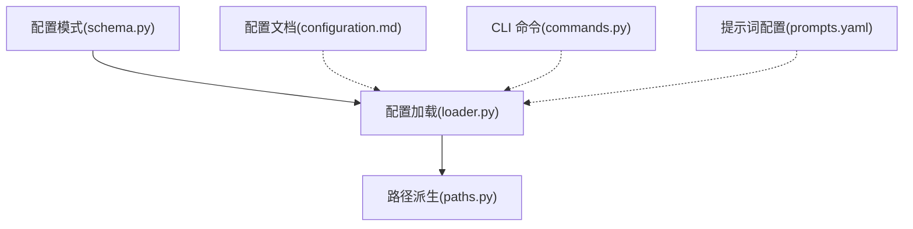
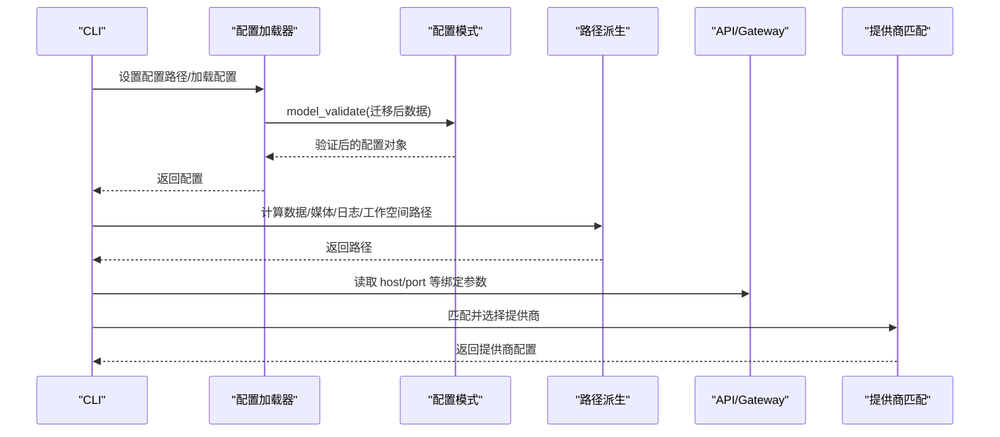
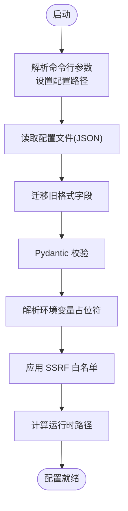
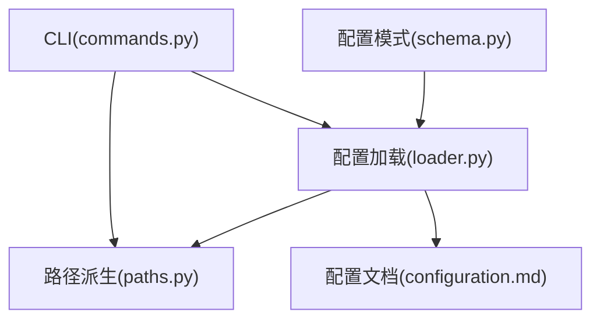

# 配置参数说明

<cite>
**本文档引用的文件**
- [schema.py](file://secbot/config/schema.py)
- [loader.py](file://secbot/config/loader.py)
- [paths.py](file://secbot/config/paths.py)
- [configuration.md](file://docs/configuration.md)
- [commands.py](file://secbot/cli/commands.py)
- [prompts.yaml](file://secbot/config/prompts.yaml)
- [config.toml](file://.codex/config.toml)
- [config.yaml](file://.trellis/config.yaml)
- [test_env_interpolation.py](file://tests/config/test_env_interpolation.py)
</cite>

## 目录
1. [简介](#简介)
2. [项目结构](#项目结构)
3. [核心组件](#核心组件)
4. [架构总览](#架构总览)
5. [详细组件分析](#详细组件分析)
6. [依赖关系分析](#依赖关系分析)
7. [性能考量](#性能考量)
8. [故障排除指南](#故障排除指南)
9. [结论](#结论)
10. [附录](#附录)

## 简介
本文件为 VAPT3 的配置系统提供完整参数说明，覆盖以下方面：
- 配置参数的名称、类型、默认值、取值范围与作用域
- 配置来源与优先级：环境变量、配置文件、命令行参数
- 配置验证规则、错误处理与动态更新机制
- 安全配置、模型设置、API 绑定地址与端口、工具与通道配置等关键项
- 开发与生产环境的配置示例与最佳实践

## 项目结构
VAPT3 的配置系统由“模式定义 + 加载器 + 路径派生 + 文档”四部分组成：
- 模式定义：使用 Pydantic 定义配置结构与校验规则
- 加载器：负责加载、迁移、解析环境变量、保存配置
- 路径派生：根据当前配置推导运行时目录与路径
- 文档：提供环境变量、提供商、工具与通道等配置说明

图表来源
- [schema.py:267-376](file://secbot/config/schema.py#L267-L376)
- [loader.py:32-81](file://secbot/config/loader.py#L32-L81)
- [paths.py:11-63](file://secbot/config/paths.py#L11-L63)
- [configuration.md:1-120](file://docs/configuration.md#L1-L120)
- [commands.py:454-465](file://secbot/cli/commands.py#L454-L465)
- [prompts.yaml:1-33](file://secbot/config/prompts.yaml#L1-L33)

章节来源
- [schema.py:1-376](file://secbot/config/schema.py#L1-L376)
- [loader.py:1-173](file://secbot/config/loader.py#L1-L173)
- [paths.py:1-63](file://secbot/config/paths.py#L1-L63)
- [configuration.md:1-120](file://docs/configuration.md#L1-L120)
- [commands.py:454-465](file://secbot/cli/commands.py#L454-L465)
- [prompts.yaml:1-33](file://secbot/config/prompts.yaml#L1-L33)

## 核心组件
- 配置模式（Pydantic）：定义根配置对象及各子模块字段、默认值、别名与校验约束
- 配置加载器：支持从 JSON 文件加载、迁移旧格式、解析环境变量占位符、保存配置
- 路径派生：基于当前配置计算数据目录、媒体目录、日志目录、工作空间路径等
- CLI 集成：在启动时加载配置、解析命令行覆盖、设置配置路径
- 文档与示例：提供环境变量、提供商、工具与通道的配置说明与示例

章节来源
- [schema.py:267-376](file://secbot/config/schema.py#L267-L376)
- [loader.py:32-81](file://secbot/config/loader.py#L32-L81)
- [paths.py:11-63](file://secbot/config/paths.py#L11-L63)
- [commands.py:454-465](file://secbot/cli/commands.py#L454-L465)

## 架构总览
配置系统的关键流程如下：
- 启动阶段：CLI 解析命令行参数，设置配置路径；加载器从 JSON 文件读取配置，应用迁移与环境变量解析
- 运行阶段：路径派生模块根据当前配置计算运行时目录；API/Gateway 读取绑定地址与端口；提供商匹配与路由生效
- 动态更新：通过保存新配置并触发重载，实现运行时调整（如提供商快照刷新）

图表来源
- [commands.py:454-465](file://secbot/cli/commands.py#L454-L465)
- [loader.py:32-81](file://secbot/config/loader.py#L32-L81)
- [schema.py:267-376](file://secbot/config/schema.py#L267-L376)
- [paths.py:11-63](file://secbot/config/paths.py#L11-L63)

## 详细组件分析

### 配置参数总览与优先级
- 配置来源与优先级（从高到低）
  1) 命令行参数（如 -c 指定配置文件路径）
  2) 环境变量（SECBOT_ 前缀 + 双下划线分隔的嵌套键）
  3) 配置文件（默认 ~/.secbot/config.json）
  4) 模式默认值
- 环境变量占位符解析：支持 ${VAR} 占位符，未设置会抛出异常
- 配置迁移：旧版字段自动迁移到新版位置（如 tools.exec.restrictToWorkspace → tools.restrictToWorkspace）

章节来源
- [loader.py:83-148](file://secbot/config/loader.py#L83-L148)
- [loader.py:150-173](file://secbot/config/loader.py#L150-L173)
- [schema.py:374-376](file://secbot/config/schema.py#L374-L376)
- [commands.py:454-465](file://secbot/cli/commands.py#L454-L465)

### 根配置对象与子模块
- 根配置字段
  - agents: AgentDefaults（默认代理配置）
  - channels: ChannelsConfig（通道通用配置）
  - providers: ProvidersConfig（提供商配置集合）
  - api: ApiConfig（OpenAI 兼容 API 服务器）
  - gateway: GatewayConfig（网关/服务绑定）
  - tools: ToolsConfig（工具集配置）
- 关键字段说明（节选）
  - agents.defaults.workspace: 工作空间路径，默认 "~/.secbot/workspace"
  - api.host/port/timeout: API 绑定地址、端口与请求超时
  - gateway.host/port/heartbeat: 网关绑定地址、端口与心跳配置
  - tools.restrict_to_workspace: 是否限制工具访问仅限工作空间
  - tools.ssrf_whitelist: SSRF 白名单（CIDR 列表）

章节来源
- [schema.py:267-276](file://secbot/config/schema.py#L267-L276)
- [schema.py:182-188](file://secbot/config/schema.py#L182-L188)
- [schema.py:190-196](file://secbot/config/schema.py#L190-L196)
- [schema.py:256-265](file://secbot/config/schema.py#L256-L265)

### 代理与模型配置
- 代理默认配置（AgentsConfig.defaults）
  - workspace: 工作空间路径
  - model: 默认模型名
  - provider: 提供商名称或 "auto"
  - max_tokens/context_window_tokens: 上下文与输出长度限制
  - temperature/max_tool_iterations: 温度与工具调用迭代上限
  - max_concurrent_subagents: 并发子代理数量
  - provider_retry_mode: 重试策略（standard/persistent）
  - tool_hint_max_length: 工具提示最大长度（20–500）
  - reasoning_effort: 思维模式（low/medium/high/adaptive）
  - timezone: IANA 时区
  - unified_session: 是否跨通道统一会话
  - disabled_skills: 禁用技能列表
  - session_ttl_minutes/idleCompactAfterMinutes: 会话空闲压缩阈值
  - max_messages: 会话历史最大消息数
  - consolidation_ratio: 上下文压缩比例（0.1–0.95）
  - dream: 梦境记忆整合配置（间隔、cron、模型覆盖、批大小、迭代次数等）

章节来源
- [schema.py:68-113](file://secbot/config/schema.py#L68-L113)
- [schema.py:35-66](file://secbot/config/schema.py#L35-L66)

### 通道配置（ChannelsConfig）
- send_progress: 是否向通道流式发送文本进度
- send_tool_hints: 是否流式发送工具调用提示
- send_max_retries: 最大投递尝试次数（含首次）
- transcription_provider: 语音转写提供商（groq/openai）
- transcription_language: 可选 ISO-639-1 语言代码

章节来源
- [schema.py:18-33](file://secbot/config/schema.py#L18-L33)

### 提供商配置（ProvidersConfig）
- 支持的提供商：custom、azure_openai、bedrock、anthropic、openai、openrouter、huggingface、deepseek、groq、zhipu、dashscope、vllm、ollama、lm_studio、ovms、gemini、moonshot、minimax、minimax_anthropic、mistral、stepfun、xiaomi_mimo、longcat、aihubmix、siliconflow、volcengine、byteplus、openai_codex、github_copilot、qianfan
- 每个提供商包含 api_key、api_base、extra_headers、extra_body 等字段
- 自动匹配逻辑：根据模型名前缀/关键字/本地检测/默认 API Base 等规则选择提供商

章节来源
- [schema.py:137-172](file://secbot/config/schema.py#L137-L172)
- [schema.py:282-356](file://secbot/config/schema.py#L282-L356)

### API 与网关配置
- ApiConfig
  - host: 默认 127.0.0.1（本地回环更安全）
  - port: 默认 8900
  - timeout: 请求超时秒数
- GatewayConfig
  - host/port: 默认 127.0.0.1:18790
  - heartbeat: 心跳开关、周期与保留消息数

章节来源
- [schema.py:182-188](file://secbot/config/schema.py#L182-L188)
- [schema.py:190-196](file://secbot/config/schema.py#L190-L196)
- [schema.py:174-180](file://secbot/config/schema.py#L174-L180)

### 工具配置（ToolsConfig）
- web: Web 搜索与抓取
  - enable: 是否启用内置 Web 工具
  - proxy: 代理 URL
  - userAgent: 用户代理
  - search: provider/apiKey/baseUrl/maxResults/timeout
  - fetch: useJinaReader
- exec: Shell 执行工具
  - enable/timeout/path_append/sandbox/allowed_env_keys/allow_patterns/deny_patterns
- my: 自检工具
  - enable/allow_set
- mcp_servers: MCP 服务器连接（stdio/sse/streamableHttp）
- ssrf_whitelist: SSRF 白名单（CIDR 列表）
- restrict_to_workspace: 是否限制工具访问仅限工作空间

章节来源
- [schema.py:256-265](file://secbot/config/schema.py#L256-L265)
- [schema.py:226-236](file://secbot/config/schema.py#L226-L236)
- [schema.py:237-248](file://secbot/config/schema.py#L237-L248)
- [schema.py:249-254](file://secbot/config/schema.py#L249-L254)
- [schema.py:214-224](file://secbot/config/schema.py#L214-L224)

### 环境变量与配置文件
- 环境变量前缀：SECBOT_
- 嵌套键分隔符：双下划线（__）
- 示例：SECBOT_PROVIDERS_GROQ_API_KEY 对应 providers.groq.apiKey
- 环境变量占位符：${VAR_NAME} 在启动时解析，未设置会报错
- 配置文件：默认 ~/.secbot/config.json，可由命令行 -c 指定

章节来源
- [schema.py:374-376](file://secbot/config/schema.py#L374-L376)
- [loader.py:83-148](file://secbot/config/loader.py#L83-L148)
- [commands.py:454-465](file://secbot/cli/commands.py#L454-L465)

### 配置加载与保存流程

图表来源
- [loader.py:32-81](file://secbot/config/loader.py#L32-L81)
- [loader.py:150-173](file://secbot/config/loader.py#L150-L173)
- [loader.py:86-127](file://secbot/config/loader.py#L86-L127)
- [paths.py:11-18](file://secbot/config/paths.py#L11-L18)

章节来源
- [loader.py:32-81](file://secbot/config/loader.py#L32-L81)
- [loader.py:150-173](file://secbot/config/loader.py#L150-L173)
- [loader.py:86-127](file://secbot/config/loader.py#L86-L127)
- [paths.py:11-18](file://secbot/config/paths.py#L11-L18)

### 配置验证规则与错误处理
- 字段类型与范围校验：如 send_max_retries ∈ [0,10]、tool_hint_max_length ∈ [20,500]、consolidation_ratio ∈ [0.1,0.95]
- 环境变量缺失：解析 ${VAR} 时若未设置，抛出异常
- JSON/校验失败：加载器捕获异常并回退到默认配置
- CLI 参数校验：不存在的配置文件会直接报错并退出

章节来源
- [schema.py:30-31](file://secbot/config/schema.py#L30-L31)
- [schema.py:84-90](file://secbot/config/schema.py#L84-L90)
- [schema.py:105-111](file://secbot/config/schema.py#L105-L111)
- [loader.py:50-56](file://secbot/config/loader.py#L50-L56)
- [commands.py:458-464](file://secbot/cli/commands.py#L458-L464)
- [test_env_interpolation.py:46-48](file://tests/config/test_env_interpolation.py#L46-L48)

### 动态配置更新机制
- 保存配置：将当前配置以 JSON 写回配置文件
- 运行时刷新：通过提供商快照刷新与路径派生更新，实现部分配置的热更新
- 注意事项：当前轮次仍在使用旧配置，下一轮开始使用新配置；极端情况下文件写入中断需考虑加载器的兜底

章节来源
- [loader.py:66-81](file://secbot/config/loader.py#L66-L81)
- [loader.py:59-63](file://secbot/config/loader.py#L59-L63)
- [prompts.yaml:1-11](file://secbot/config/prompts.yaml#L1-L11)

### 开发与生产环境配置示例

- 开发环境（本地回环 + 便捷调试）
  - 绑定地址：127.0.0.1（仅本地访问）
  - 端口：api.port=8900，gateway.port=18790
  - 工作空间：agents.defaults.workspace 指向本地目录
  - 提供商：groq/openai 等免费额度可用
  - 工具：tools.web.enable=true，tools.restrict_to_workspace=false（便于测试）

- 生产环境（安全加固 + 外部访问）
  - 绑定地址：0.0.0.0 或受信网段
  - 端口：使用反向代理暴露 HTTPS，后端使用 8900/18790
  - 安全：tools.restrict_to_workspace=true，tools.exec.sandbox=bwrap，SSRF 白名单最小化
  - 提供商：使用自有 apiBase 或企业网关，避免泄露密钥
  - 日志与路径：确保 get_logs_dir()/get_media_dir() 可写且权限受限

章节来源
- [schema.py:182-188](file://secbot/config/schema.py#L182-L188)
- [schema.py:190-196](file://secbot/config/schema.py#L190-L196)
- [configuration.md:1003-1019](file://docs/configuration.md#L1003-L1019)

### 关键配置项清单（名称/类型/默认值/说明）
- agents.defaults.workspace: 字符串/默认 "~/.secbot/workspace"
- agents.defaults.model: 字符串/默认模型标识
- agents.defaults.provider: 字符串/默认 "auto"
- agents.defaults.max_tokens: 整数/默认 8192
- agents.defaults.context_window_tokens: 整数/默认 65536
- agents.defaults.context_block_limit: 整数或空/默认空
- agents.defaults.temperature: 浮点/默认 0.1
- agents.defaults.max_tool_iterations: 整数/默认 200
- agents.defaults.max_concurrent_subagents: 整数/默认 1
- agents.defaults.max_tool_result_chars: 整数/默认 16000
- agents.defaults.provider_retry_mode: 字符串枚举/默认 "standard"
- agents.defaults.tool_hint_max_length: 整数/默认 40（范围 20–500）
- agents.defaults.reasoning_effort: 字符串或空/默认空
- agents.defaults.timezone: 字符串/默认 "UTC"
- agents.defaults.unified_session: 布尔/默认 false
- agents.defaults.disabled_skills: 数组/默认 []
- agents.defaults.session_ttl_minutes: 整数/默认 0（范围 0–）
- agents.defaults.max_messages: 整数/默认 120（范围 0–）
- agents.defaults.consolidation_ratio: 浮点/默认 0.5（范围 0.1–0.95）
- agents.defaults.dream.interval_h: 整数/默认 2（范围 ≥1）
- agents.defaults.dream.max_batch_size: 整数/默认 20（范围 ≥1）
- agents.defaults.dream.max_iterations: 整数/默认 15（范围 ≥1）
- agents.defaults.dream.annotate_line_ages: 布尔/默认 true
- api.host: 字符串/默认 "127.0.0.1"
- api.port: 整数/默认 8900
- api.timeout: 浮点/默认 120.0
- gateway.host: 字符串/默认 "127.0.0.1"
- gateway.port: 整数/默认 18790
- gateway.heartbeat.enabled: 布尔/默认 true
- gateway.heartbeat.interval_s: 整数/默认 1800
- gateway.heartbeat.keep_recent_messages: 整数/默认 8
- tools.restrict_to_workspace: 布尔/默认 false
- tools.ssrf_whitelist: 数组/默认 []
- tools.web.enable: 布尔/默认 true
- tools.web.proxy: 字符串或空/默认空
- tools.web.userAgent: 字符串或空/默认空
- tools.web.search.provider: 字符串/默认 "duckduckgo"
- tools.web.search.apiKey: 字符串/默认 ""
- tools.web.search.baseUrl: 字符串/默认 ""
- tools.web.search.maxResults: 整数/默认 5（范围 1–10）
- tools.web.fetch.useJinaReader: 布尔/默认 true
- tools.exec.enable: 布尔/默认 true
- tools.exec.timeout: 整数/默认 60
- tools.exec.path_append: 字符串/默认 ""
- tools.exec.sandbox: 字符串/默认 ""
- tools.exec.allowed_env_keys: 数组/默认 []
- tools.exec.allow_patterns: 数组/默认 []
- tools.exec.deny_patterns: 数组/默认 []
- tools.my.enable: 布尔/默认 true
- tools.my.allow_set: 布尔/默认 false
- channels.send_progress: 布尔/默认 true
- channels.send_tool_hints: 布尔/默认 false
- channels.send_max_retries: 整数/默认 3（范围 0–10）
- channels.transcription_provider: 字符串/默认 "groq"
- channels.transcription_language: 字符串或空/默认空

章节来源
- [schema.py:68-113](file://secbot/config/schema.py#L68-L113)
- [schema.py:182-188](file://secbot/config/schema.py#L182-L188)
- [schema.py:190-196](file://secbot/config/schema.py#L190-L196)
- [schema.py:214-224](file://secbot/config/schema.py#L214-L224)
- [schema.py:226-236](file://secbot/config/schema.py#L226-L236)
- [schema.py:249-254](file://secbot/config/schema.py#L249-L254)
- [schema.py:18-33](file://secbot/config/schema.py#L18-L33)

## 依赖关系分析
- 配置模式依赖 Pydantic（字段别名、嵌套校验、环境变量映射）
- 加载器依赖配置模式进行校验，并调用网络模块应用 SSRF 白名单
- CLI 依赖加载器与路径派生模块
- 文档与示例为配置使用提供参考

图表来源
- [schema.py:267-376](file://secbot/config/schema.py#L267-L376)
- [loader.py:32-81](file://secbot/config/loader.py#L32-L81)
- [paths.py:11-63](file://secbot/config/paths.py#L11-L63)
- [configuration.md:1-120](file://docs/configuration.md#L1-L120)
- [commands.py:454-465](file://secbot/cli/commands.py#L454-L465)

章节来源
- [schema.py:267-376](file://secbot/config/schema.py#L267-L376)
- [loader.py:32-81](file://secbot/config/loader.py#L32-L81)
- [paths.py:11-63](file://secbot/config/paths.py#L11-L63)
- [configuration.md:1-120](file://docs/configuration.md#L1-L120)
- [commands.py:454-465](file://secbot/cli/commands.py#L454-L465)

## 性能考量
- 配置加载开销极小（JSON 解析 + Pydantic 校验），通常在毫秒级
- 环境变量解析采用正则替换，字符串较大时注意内存占用
- 工具与通道配置影响 I/O 与网络请求，合理设置超时与重试可提升稳定性
- 使用统一会话与上下文压缩可降低长会话的首 Token 延迟

## 故障排除指南
- 环境变量未设置导致解析失败
  - 现象：启动时报错，提示某 ${VAR} 未设置
  - 处理：在部署环境中正确注入环境变量，或在配置文件中直接填写
  - 参考：[环境变量解析:140-147](file://secbot/config/loader.py#L140-L147)
- 配置文件损坏或格式错误
  - 现象：加载失败，回退到默认配置
  - 处理：检查 JSON 格式，必要时运行 onboard 合并默认字段
  - 参考：[加载与回退:50-56](file://secbot/config/loader.py#L50-L56)
- 字段类型或范围不合法
  - 现象：Pydantic 校验失败
  - 处理：修正字段类型或取值范围
  - 参考：[字段校验:30-31](file://secbot/config/schema.py#L30-L31)
- 提供商匹配失败
  - 现象：无法路由到有效提供商
  - 处理：确认 provider 名称、模型前缀或 apiBase 设置
  - 参考：[提供商匹配:282-356](file://secbot/config/schema.py#L282-L356)
- 动态更新未生效
  - 现象：修改配置后当前轮次仍使用旧配置
  - 处理：等待下一轮开始或手动触发刷新
  - 参考：[动态更新说明:1-11](file://secbot/config/prompts.yaml#L1-L11)

章节来源
- [loader.py:50-56](file://secbot/config/loader.py#L50-L56)
- [loader.py:140-147](file://secbot/config/loader.py#L140-L147)
- [schema.py:30-31](file://secbot/config/schema.py#L30-L31)
- [schema.py:282-356](file://secbot/config/schema.py#L282-L356)
- [prompts.yaml:1-11](file://secbot/config/prompts.yaml#L1-L11)

## 结论
VAPT3 的配置系统以 Pydantic 为核心，结合环境变量解析、配置迁移与路径派生，提供了清晰、可扩展且安全的配置管理能力。通过明确的优先级与严格的校验，既满足开发场景的灵活性，又保障生产环境的安全性与稳定性。

## 附录

### 环境变量与 CLI 映射示例
- 环境变量前缀：SECBOT_
- 嵌套键分隔符：双下划线（__）
- 示例映射：
  - SECBOT_PROVIDERS_GROQ_API_KEY → providers.groq.apiKey
  - SECBOT_AGENTS_DEFAULTS_MODEL → agents.defaults.model
  - SECBOT_API_HOST → api.host

章节来源
- [schema.py:374-376](file://secbot/config/schema.py#L374-L376)
- [configuration.md:10-27](file://docs/configuration.md#L10-L27)

### 项目级配置参考
- Codex 项目级默认（用于 Trellis 工作流）
  - features.multi_agent_v2.enabled 与并发参数
- Trellis 项目级配置
  - 会话记录、任务生命周期钩子、包声明等

章节来源
- [config.toml:29-33](file://.codex/config.toml#L29-L33)
- [config.yaml:1-60](file://.trellis/config.yaml#L1-L60)