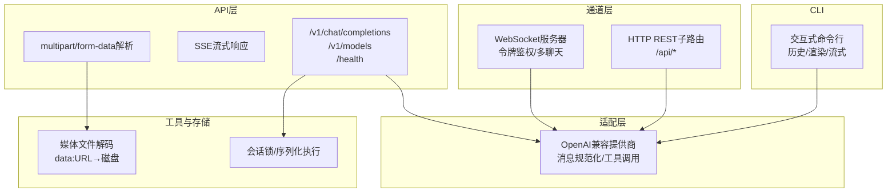
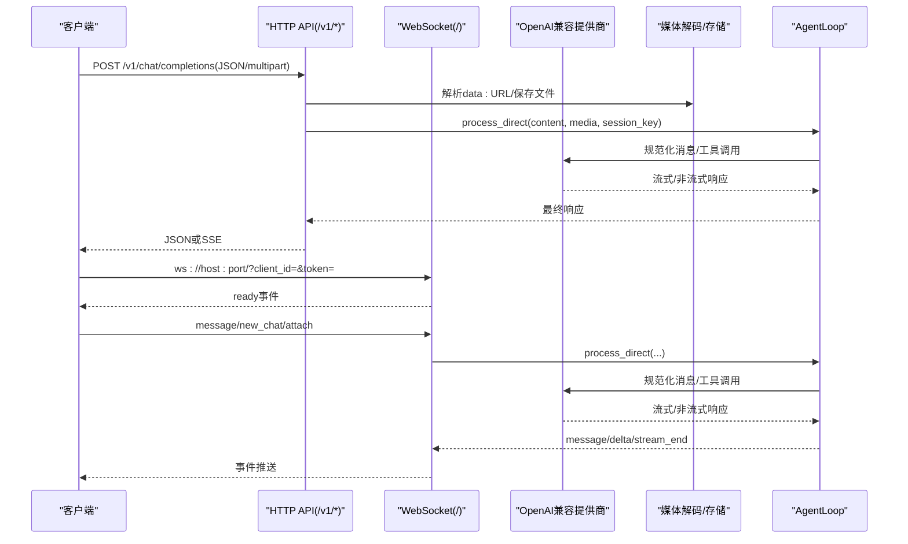
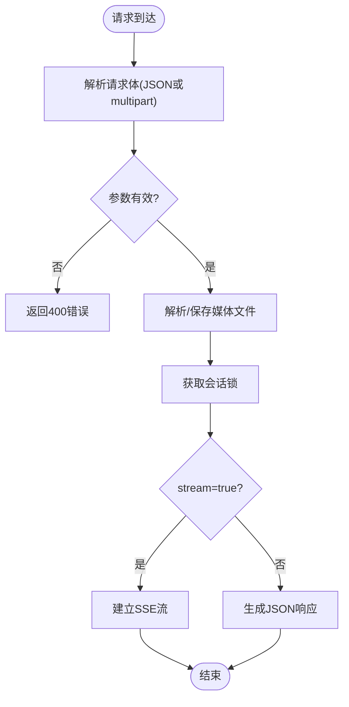
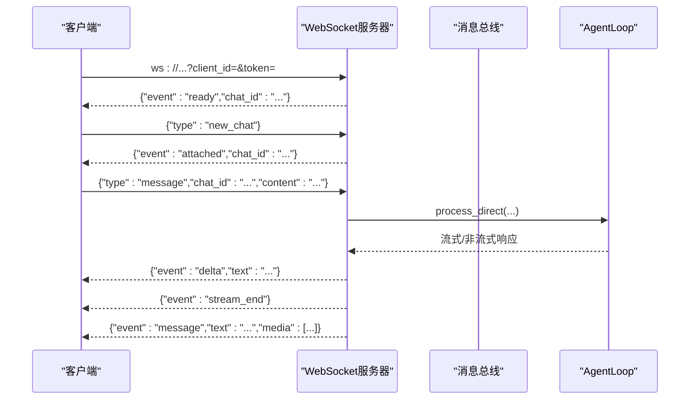
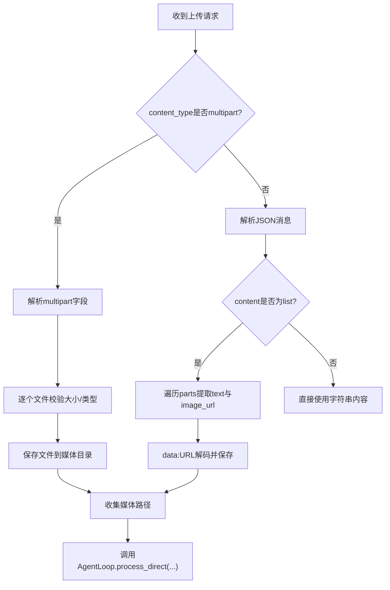
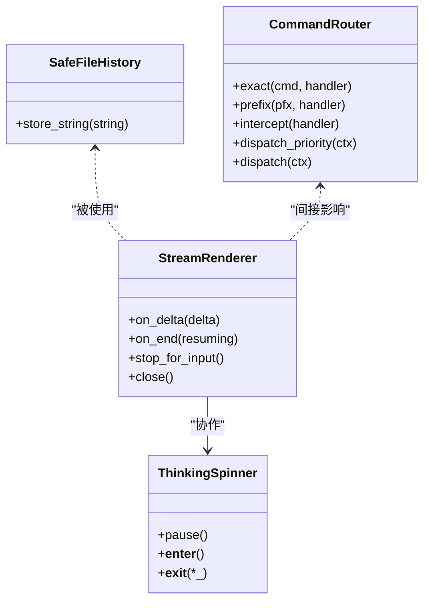
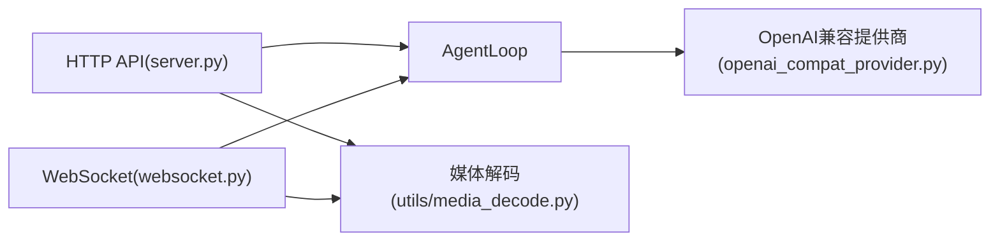

# API服务设计

<cite>
**本文档引用的文件**
- [secbot/api/server.py](file://secbot/api/server.py)
- [secbot/providers/openai_compat_provider.py](file://secbot/providers/openai_compat_provider.py)
- [secbot/channels/websocket.py](file://secbot/channels/websocket.py)
- [secbot/utils/media_decode.py](file://secbot/utils/media_decode.py)
- [docs/openai-api.md](file://docs/openai-api.md)
- [docs/websocket.md](file://docs/websocket.md)
- [tests/test_openai_api.py](file://tests/test_openai_api.py)
- [tests/channels/test_websocket_channel.py](file://tests/channels/test_websocket_channel.py)
- [secbot/cli/stream.py](file://secbot/cli/stream.py)
- [secbot/cli/commands.py](file://secbot/cli/commands.py)
- [secbot/command/router.py](file://secbot/command/router.py)
- [.trellis/tasks/05-09-uiux-template-refactor/api-design.md](file://.trellis/tasks/05-09-uiux-template-refactor/api-design.md)
</cite>

## 目录
1. [简介](#简介)
2. [项目结构](#项目结构)
3. [核心组件](#核心组件)
4. [架构总览](#架构总览)
5. [详细组件分析](#详细组件分析)
6. [依赖关系分析](#依赖关系分析)
7. [性能考量](#性能考量)
8. [故障排查指南](#故障排查指南)
9. [结论](#结论)
10. [附录](#附录)

## 简介
本文件面向VAPT3/secbot的API服务系统，提供OpenAI兼容API、WebSocket实时通信、SSE流式响应、文件上传处理、Python SDK使用指南、鉴权与安全、版本管理与向后兼容策略、以及完整的测试与集成示例。目标是帮助开发者与运维人员快速理解并正确使用API服务，同时为后续扩展提供清晰的参考。

## 项目结构
API服务主要由以下模块构成：
- OpenAI兼容HTTP API：提供/v1/chat/completions与/v1/models端点，支持JSON与multipart/form-data两种输入方式，并通过SSE返回流式结果。
- WebSocket通道：提供持久化双向通信，支持多聊天并发、令牌鉴权、媒体文件访问等。
- 提供商适配层：统一OpenAI兼容接口，负责消息规范化、工具调用、超时控制与回退策略。
- 文件上传与解码：共享的data:URL解码与落地逻辑，确保大小限制与安全命名。
- CLI与渲染：提供命令行交互、历史记录、Markdown渲染与流式输出。
- 测试与文档：覆盖API行为、WebSocket鉴权与令牌发放、路由策略与版本管理等。

图表来源
- [secbot/api/server.py:391-401](file://secbot/api/server.py#L391-L401)
- [secbot/channels/websocket.py:474-544](file://secbot/channels/websocket.py#L474-L544)
- [secbot/providers/openai_compat_provider.py:254-312](file://secbot/providers/openai_compat_provider.py#L254-L312)
- [secbot/utils/media_decode.py:28-56](file://secbot/utils/media_decode.py#L28-L56)

章节来源
- [secbot/api/server.py:1-401](file://secbot/api/server.py#L1-L401)
- [docs/openai-api.md:1-122](file://docs/openai-api.md#L1-L122)

## 核心组件
- OpenAI兼容HTTP API
  - 端点：/v1/chat/completions（POST）、/v1/models（GET）、/health（GET）
  - 支持单消息输入、固定模型名、可选流式SSE
  - 支持JSON与multipart/form-data两种请求体
- WebSocket通道
  - 连接URL：ws://host:port/path?client_id=...&token=...
  - 事件：ready、message、delta、stream_end、attached、error
  - 鉴权：静态令牌或短期令牌；支持TLS/WSS
  - 多聊天：一个连接可订阅多个chat_id
- OpenAI兼容提供商
  - 统一消息规范化、工具调用、温度参数处理、推理模式映射
  - 本地/云模型连接池差异、超时与回退策略
- 文件上传与解码
  - data:URL解码、大小限制、安全文件名、媒体目录组织
- CLI与渲染
  - 交互式输入、历史记录、Markdown渲染、Thinking Spinner
- 测试与文档
  - API行为测试、WebSocket鉴权与令牌发放测试、路由策略与版本管理说明

章节来源
- [secbot/api/server.py:194-351](file://secbot/api/server.py#L194-L351)
- [secbot/channels/websocket.py:474-816](file://secbot/channels/websocket.py#L474-L816)
- [secbot/providers/openai_compat_provider.py:254-800](file://secbot/providers/openai_compat_provider.py#L254-L800)
- [secbot/utils/media_decode.py:1-56](file://secbot/utils/media_decode.py#L1-L56)
- [docs/websocket.md:1-397](file://docs/websocket.md#L1-L397)
- [docs/openai-api.md:1-122](file://docs/openai-api.md#L1-L122)

## 架构总览
下图展示了从客户端到后端处理的端到端路径，包括HTTP API、WebSocket、提供商适配与媒体处理：

图表来源
- [secbot/api/server.py:194-351](file://secbot/api/server.py#L194-L351)
- [secbot/channels/websocket.py:574-654](file://secbot/channels/websocket.py#L574-L654)
- [secbot/providers/openai_compat_provider.py:407-585](file://secbot/providers/openai_compat_provider.py#L407-L585)
- [secbot/utils/media_decode.py:28-56](file://secbot/utils/media_decode.py#L28-L56)

## 详细组件分析

### OpenAI兼容HTTP API
- 端点与方法
  - POST /v1/chat/completions：支持JSON与multipart/form-data
  - GET /v1/models：返回当前可用模型
  - GET /health：健康检查
- 请求/响应模式
  - JSON：messages数组必须包含且仅包含一个role为"user"的消息；可选stream、model、session_id
  - multipart/form-data：字段包括message、files、session_id、model
- 流式SSE
  - 当stream=true时，返回text/event-stream，每条数据为OpenAI兼容的chunk，以"data: [DONE]"结束
- 会话与并发
  - 固定会话键"api:default"，可通过session_id隔离；每个session_key有独立锁，保证串行执行
- 错误处理
  - 参数错误返回400；文件过大返回413；超时返回504；内部错误返回500
- 文件上传
  - JSON中支持image_url的data:URL；multipart支持任意受支持文件类型

图表来源
- [secbot/api/server.py:194-351](file://secbot/api/server.py#L194-L351)
- [secbot/utils/media_decode.py:28-56](file://secbot/utils/media_decode.py#L28-L56)

章节来源
- [secbot/api/server.py:194-351](file://secbot/api/server.py#L194-L351)
- [tests/test_openai_api.py:83-288](file://tests/test_openai_api.py#L83-L288)
- [docs/openai-api.md:33-122](file://docs/openai-api.md#L33-L122)

### WebSocket通信协议
- 连接与鉴权
  - URL参数：client_id、token；可选path、TLS证书
  - 静态令牌或短期令牌；allowFrom白名单；默认开启token要求
- 事件类型
  - 服务端→客户端：ready、message、delta、stream_end、attached、error
  - 客户端→服务端：message、new_chat、attach（含typed envelope）
- 多聊天并发
  - 一个连接可订阅多个chat_id；chat_id即能力凭证
- 媒体文件
  - outbound message可能包含本地路径；需共享文件系统或HTTP服务

图表来源
- [secbot/channels/websocket.py:574-654](file://secbot/channels/websocket.py#L574-L654)
- [docs/websocket.md:80-166](file://docs/websocket.md#L80-L166)

章节来源
- [secbot/channels/websocket.py:474-816](file://secbot/channels/websocket.py#L474-L816)
- [docs/websocket.md:1-397](file://docs/websocket.md#L1-L397)
- [tests/channels/test_websocket_channel.py:858-899](file://tests/channels/test_websocket_channel.py#L858-L899)

### SSE流式响应机制与性能优化
- SSE格式
  - 每个token封装为OpenAI兼容的chunk；结束时发送"data: [DONE]"
- 性能要点
  - 使用异步队列传递token，避免阻塞；及时取消未完成任务
  - 压缩启用；缓存控制与连接保持
  - 会话级锁确保请求串行，避免竞争条件

章节来源
- [secbot/api/server.py:236-304](file://secbot/api/server.py#L236-L304)

### 文件上传处理流程
- JSON内联图片
  - image_url.url为data:URL时，解码并保存至媒体目录，返回绝对路径
- multipart上传
  - files字段支持多文件；超过上限触发413；安全文件名与UUID前缀
- 安全与清理
  - 统一的大小限制与MIME白名单；路径安全与最小权限原则

图表来源
- [secbot/api/server.py:152-186](file://secbot/api/server.py#L152-L186)
- [secbot/utils/media_decode.py:28-56](file://secbot/utils/media_decode.py#L28-L56)

章节来源
- [secbot/api/server.py:112-186](file://secbot/api/server.py#L112-L186)
- [secbot/utils/media_decode.py:1-56](file://secbot/utils/media_decode.py#L1-L56)

### Python SDK使用指南
- 基本用法
  - 通过Nanobot.from_config()加载配置，调用run(message, session_key, hooks)
- 常见模式
  - 指定会话键进行对话隔离
  - 通过AgentHook观察工具调用、流式输出与迭代状态
- 示例
  - 审计工具调用、接收流式token、后处理最终内容

章节来源
- [docs/python-sdk.md:1-220](file://docs/python-sdk.md#L1-L220)

### CLI命令系统设计
- 交互式输入
  - prompt_toolkit提供历史、粘贴、显示；支持多行输入
  - 安全历史记录：Windows特殊字符转义
- Markdown渲染与流式输出
  - StreamRenderer结合Rich Live实现稳定渲染
  - ThinkingSpinner提供“思考中”提示
- 命令路由
  - CommandRouter支持精确匹配、前缀匹配与拦截器
- 历史记录
  - SafeFileHistory确保跨平台稳定性

图表来源
- [secbot/cli/stream.py:69-143](file://secbot/cli/stream.py#L69-L143)
- [secbot/cli/commands.py:53-73](file://secbot/cli/commands.py#L53-L73)
- [secbot/command/router.py:47-83](file://secbot/command/router.py#L47-L83)

章节来源
- [secbot/cli/stream.py:1-143](file://secbot/cli/stream.py#L1-L143)
- [secbot/cli/commands.py:1-200](file://secbot/cli/commands.py#L1-L200)
- [secbot/command/router.py:47-83](file://secbot/command/router.py#L47-L83)

### API版本管理与向后兼容
- 路由策略
  - 新增写接口原生走aiohttp（支持POST/PUT/DELETE+JSON Body）
  - 老接口（如/sessions/**、/settings/**、/commands、/media/**）保留在WebSocket HTTP fallback
- 版本边界
  - API层与WebSocket层分离，避免互相影响
  - 通过明确的路由注册与文档约束，确保演进可控

章节来源
- [.trellis/tasks/05-09-uiux-template-refactor/api-design.md:1037-1048](file://.trellis/tasks/05-09-uiux-template-refactor/api-design.md#L1037-L1048)

## 依赖关系分析
- 组件耦合
  - HTTP API依赖AgentLoop与OpenAI兼容提供商；WebSocket通道同样依赖AgentLoop
  - 媒体解码逻辑在API与WebSocket之间共享，降低重复与不一致风险
- 外部依赖
  - aiohttp用于HTTP API；websockets用于WebSocket；httpx用于OpenAI兼容提供商的HTTP调用
- 潜在循环
  - 未发现直接循环依赖；各层职责清晰（API/WS→AgentLoop→Provider）

图表来源
- [secbot/api/server.py:194-351](file://secbot/api/server.py#L194-L351)
- [secbot/channels/websocket.py:474-544](file://secbot/channels/websocket.py#L474-L544)
- [secbot/providers/openai_compat_provider.py:254-312](file://secbot/providers/openai_compat_provider.py#L254-L312)
- [secbot/utils/media_decode.py:1-56](file://secbot/utils/media_decode.py#L1-L56)

章节来源
- [secbot/api/server.py:1-401](file://secbot/api/server.py#L1-L401)
- [secbot/channels/websocket.py:1-2376](file://secbot/channels/websocket.py#L1-L2376)
- [secbot/providers/openai_compat_provider.py:1-800](file://secbot/providers/openai_compat_provider.py#L1-L800)

## 性能考量
- 流式传输
  - SSE与WebSocket均采用增量推送，减少首字节延迟
- 并发控制
  - 会话级锁确保串行执行，避免上下文污染；高并发下建议按会话隔离
- 超时与回退
  - HTTP请求超时与AgentLoop超时双重保护；空响应自动重试与降级
- 连接与压缩
  - WebSocket启用ping/pong与压缩；HTTP启用SSE压缩与缓存控制

## 故障排查指南
- HTTP API常见问题
  - 400：messages格式错误、缺少user消息、model不匹配
  - 413：文件过大或data:URL解码失败
  - 504：请求超时
  - 500：内部异常
- WebSocket常见问题
  - 403：client_id不在allowFrom白名单
  - 401：静态令牌或短期令牌无效
  - 429：短期令牌发放达到上限
- 自检清单
  - 确认URL参数与鉴权头正确
  - 检查媒体文件大小与类型
  - 核对会话键与并发策略

章节来源
- [tests/test_openai_api.py:66-134](file://tests/test_openai_api.py#L66-L134)
- [tests/channels/test_websocket_channel.py:858-899](file://tests/channels/test_websocket_channel.py#L858-L899)
- [secbot/api/server.py:217-224](file://secbot/api/server.py#L217-L224)
- [secbot/channels/websocket.py:631-654](file://secbot/channels/websocket.py#L631-L654)

## 结论
本API服务系统以OpenAI兼容为核心，结合WebSocket实现实时交互，辅以完善的文件上传、鉴权与版本管理策略。通过清晰的分层与严格的测试覆盖，既满足易用性也兼顾安全性与可维护性。建议在生产环境启用TLS、令牌与白名单策略，并根据负载选择合适的并发与会话隔离方案。

## 附录
- API端点速查
  - /v1/chat/completions（POST）：JSON或multipart
  - /v1/models（GET）：列出可用模型
  - /health（GET）：健康检查
- WebSocket端点速查
  - ws://host:port/?client_id=&token=：连接
  - /api/*：REST子路由（部分接口）
- 测试用例参考
  - OpenAI兼容API行为测试
  - WebSocket鉴权与令牌发放测试
- CLI与SDK
  - 交互式命令行与Markdown渲染
  - Python SDK钩子与流式回调