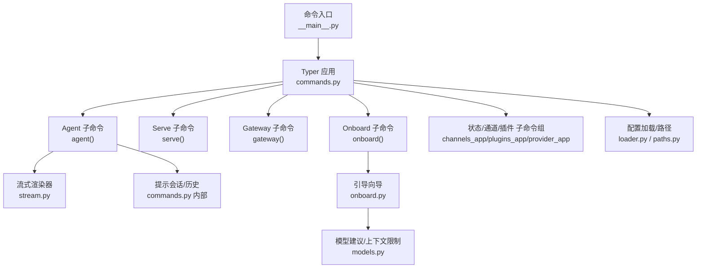
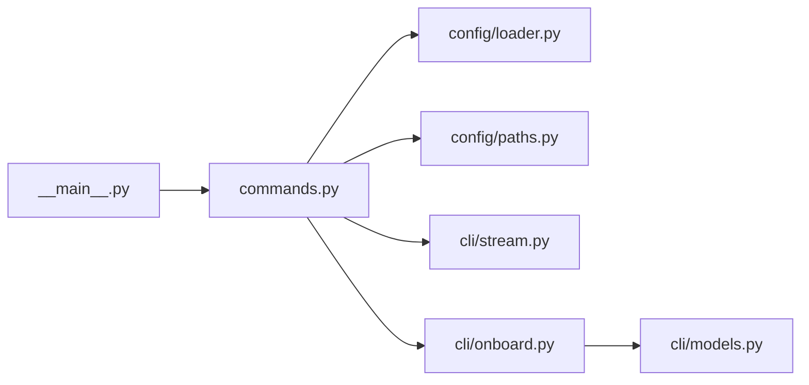

# CLI命令系统

<cite>
**本文引用的文件**
- [secbot/cli/commands.py](file://secbot/cli/commands.py)
- [secbot/cli/stream.py](file://secbot/cli/stream.py)
- [secbot/cli/onboard.py](file://secbot/cli/onboard.py)
- [secbot/cli/models.py](file://secbot/cli/models.py)
- [secbot/__main__.py](file://secbot/__main__.py)
- [secbot/secbot.py](file://secbot/secbot.py)
- [docs/cli-reference.md](file://docs/cli-reference.md)
- [secbot/config/paths.py](file://secbot/config/paths.py)
- [secbot/config/loader.py](file://secbot/config/loader.py)
- [tests/cli/test_cli_input.py](file://tests/cli/test_cli_input.py)
</cite>

## 目录
1. [简介](#简介)
2. [项目结构](#项目结构)
3. [核心组件](#核心组件)
4. [架构总览](#架构总览)
5. [详细组件分析](#详细组件分析)
6. [依赖分析](#依赖分析)
7. [性能考虑](#性能考虑)
8. [故障排除指南](#故障排除指南)
9. [结论](#结论)
10. [附录](#附录)

## 简介
本文件面向使用者与开发者，系统化梳理 VAPT3 的 CLI 命令体系，涵盖命令注册机制、参数解析、交互模式、历史记录、Markdown 渲染、与后端服务的交互（进程管理、信号处理、优雅关闭）、以及在自动化脚本中的应用与最佳实践。目标是帮助用户高效使用 secbot 的命令行工具，并为维护者提供清晰的实现脉络。

## 项目结构
围绕 CLI 的关键模块如下：
- 命令入口与子命令：secbot/cli/commands.py
- 流式渲染与终端体验：secbot/cli/stream.py
- 引导向导与配置注入：secbot/cli/onboard.py、secbot/cli/models.py
- 程序入口：secbot/__main__.py
- 程序化接口：secbot/secbot.py
- CLI 参考文档：docs/cli-reference.md
- 配置与路径：secbot/config/paths.py、secbot/config/loader.py
- 单元测试：tests/cli/test_cli_input.py



图表来源
- [secbot/__main__.py:1-9](file://secbot/__main__.py#L1-L9)
- [secbot/cli/commands.py:74-79](file://secbot/cli/commands.py#L74-L79)
- [secbot/cli/stream.py:69-143](file://secbot/cli/stream.py#L69-L143)
- [secbot/cli/onboard.py:1-120](file://secbot/cli/onboard.py#L1-L120)
- [secbot/cli/models.py:13-32](file://secbot/cli/models.py#L13-L32)
- [secbot/config/loader.py:32-81](file://secbot/config/loader.py#L32-L81)
- [secbot/config/paths.py:50-57](file://secbot/config/paths.py#L50-L57)

章节来源
- [secbot/__main__.py:1-9](file://secbot/__main__.py#L1-L9)
- [secbot/cli/commands.py:74-79](file://secbot/cli/commands.py#L74-L79)
- [docs/cli-reference.md:1-22](file://docs/cli-reference.md#L1-L22)

## 核心组件
- Typer 应用与命令注册
  - 使用 Typer 构建主应用，定义全局选项与子命令；通过装饰器注册 onboard、agent、serve、gateway、status、channels、plugins、provider 等命令。
- 交互式会话与历史
  - 基于 prompt_toolkit 的 PromptSession，支持多行粘贴、历史导航、编辑器集成等；历史持久化到 ~/.secbot/history/cli_history。
- 流式渲染与 Markdown
  - StreamRenderer 结合 Rich Live 实现稳定、低闪烁的 Markdown 流式渲染；ThinkingSpinner 提供“思考中”指示。
- 配置与路径
  - 加载配置、解析环境变量、迁移旧配置；路径函数统一管理数据目录、媒体、工作区、历史等。
- 引导向导
  - onboard 子命令支持交互式问答、敏感字段掩码、字段约束校验、模型自动补全与上下文窗口推荐。

章节来源
- [secbot/cli/commands.py:74-79](file://secbot/cli/commands.py#L74-L79)
- [secbot/cli/commands.py:126-146](file://secbot/cli/commands.py#L126-L146)
- [secbot/cli/stream.py:69-143](file://secbot/cli/stream.py#L69-L143)
- [secbot/config/paths.py:50-57](file://secbot/config/paths.py#L50-L57)
- [secbot/cli/onboard.py:300-734](file://secbot/cli/onboard.py#L300-L734)

## 架构总览
CLI 作为前端入口，协调配置加载、消息总线、代理循环、通道与网关服务，并通过流式渲染与提示会话提供良好的用户体验。

```mermaid
sequenceDiagram
participant U as "用户"
participant CLI as "Typer 应用(commands.py)"
participant CFG as "配置(loader.py/paths.py)"
participant BUS as "消息总线"
participant LOOP as "AgentLoop"
participant SR as "流式渲染(stream.py)"
U->>CLI : 执行 secbot agent -m "..."/interactive
CLI->>CFG : 加载并解析配置
CLI->>BUS : 创建消息总线
CLI->>LOOP : 初始化 AgentLoop
alt 单次消息模式
CLI->>LOOP : process_direct(...)
LOOP-->>SR : 流式增量(delta)
SR-->>U : 渲染 Markdown/文本
else 交互模式
CLI->>LOOP : run() 并发消费出站消息
LOOP-->>CLI : 进度/提示/最终回复
CLI-->>U : 交互式打印与渲染
end
```

图表来源
- [secbot/cli/commands.py:1077-1308](file://secbot/cli/commands.py#L1077-L1308)
- [secbot/cli/stream.py:69-143](file://secbot/cli/stream.py#L69-L143)
- [secbot/config/loader.py:32-81](file://secbot/config/loader.py#L32-L81)
- [secbot/config/paths.py:37-47](file://secbot/config/paths.py#L37-L47)

## 详细组件分析

### 命令注册与参数解析
- 全局应用与回调
  - 主应用名为 “secbot”，支持 -h/--help；版本选项通过回调输出版本后退出。
- 子命令
  - onboard：初始化或刷新配置与工作区，可选交互式向导。
  - agent：单次消息或交互式聊天；支持 Markdown 渲染开关、运行时日志开关、指定会话键。
  - serve：启动 OpenAI 兼容 API 服务器，支持主机、端口、超时、详细日志。
  - gateway：启动网关（含通道、心跳、计划任务），支持端口与详细日志。
  - status：显示配置、工作区、模型与各提供商密钥状态。
  - channels：通道状态查看、登录（QR/交互）。
  - plugins：列出通道插件。
  - provider：OAuth 登录/登出（按提供商注册）。
- 参数解析与默认值
  - 多数命令支持 --config/-c 指定配置文件路径、--workspace/-w 指定工作区、--verbose/-v 控制日志级别。
  - serve 支持 --host/-H、--port/-p、--timeout/-t；agent 支持 --session/-s；gateway 支持 --port/-p。

章节来源
- [secbot/cli/commands.py:289-296](file://secbot/cli/commands.py#L289-L296)
- [secbot/cli/commands.py:304-400](file://secbot/cli/commands.py#L304-L400)
- [secbot/cli/commands.py:514-601](file://secbot/cli/commands.py#L514-L601)
- [secbot/cli/commands.py:608-632](file://secbot/cli/commands.py#L608-L632)
- [secbot/cli/commands.py:1077-1308](file://secbot/cli/commands.py#L1077-L1308)
- [secbot/cli/commands.py:1316-1599](file://secbot/cli/commands.py#L1316-L1599)
- [docs/cli-reference.md:1-22](file://docs/cli-reference.md#L1-L22)

### 历史记录与自动补全
- 历史文件
  - CLI 历史存储于 ~/.secbot/history/cli_history，使用 SafeFileHistory 规避 Windows 特殊字符写入问题。
- 自动补全
  - onboard 向导对模型输入提供动态补全（基于 get_model_suggestions），并在配置模型时尝试填充上下文窗口大小。
- 交互式输入
  - 交互模式下，使用 prompt_toolkit 的 PromptSession 提供历史导航、多行粘贴、编辑器集成等能力。

章节来源
- [secbot/cli/commands.py:53-64](file://secbot/cli/commands.py#L53-L64)
- [secbot/cli/commands.py:126-146](file://secbot/cli/commands.py#L126-L146)
- [secbot/cli/commands.py:264-281](file://secbot/cli/commands.py#L264-L281)
- [secbot/cli/onboard.py:473-511](file://secbot/cli/onboard.py#L473-L511)
- [secbot/cli/models.py:25-26](file://secbot/cli/models.py#L25-L26)

### Markdown 渲染与输出控制
- 渲染策略
  - _response_renderable 根据 render_markdown 与 metadata.render_as 控制是否以 Markdown 输出；否则输出纯文本。
  - StreamRenderer 使用 Rich Live 与 Markdown 组件，配合 ThinkingSpinner 提供“思考中”状态；在增量到达时按阈值刷新，避免闪烁。
- 终端兼容性
  - _make_console 根据 stdout 是否 TTY 决定是否强制终端输出，避免管道/非交互环境污染控制序列。
- 交互式渲染
  - 交互模式下，进度消息与最终回复分别通过 _print_interactive_progress_line/_print_interactive_response 输出，保证与 spinner 的协作。

章节来源
- [secbot/cli/commands.py:179-186](file://secbot/cli/commands.py#L179-L186)
- [secbot/cli/commands.py:188-218](file://secbot/cli/commands.py#L188-L218)
- [secbot/cli/stream.py:20-32](file://secbot/cli/stream.py#L20-L32)
- [secbot/cli/stream.py:69-143](file://secbot/cli/stream.py#L69-L143)
- [tests/cli/test_cli_input.py:145-175](file://tests/cli/test_cli_input.py#L145-L175)

### 命令功能与用法详解

#### onboard：初始化与配置
- 功能要点
  - 若提供 --config 指定配置路径，则设置当前配置；否则使用默认路径。
  - 支持 --wizard 启动交互式向导；否则询问覆盖或刷新现有配置。
  - 注入所有已发现通道的默认配置，确保新安装即具备可用通道。
  - 创建工作区目录并同步模板。
- 交互式向导
  - 使用 questionary 与 prompt_toolkit 构建菜单与自动补全；敏感字段掩码显示；字段约束校验与提示。
- 常见用法
  - secbot onboard
  - secbot onboard --wizard
  - secbot onboard -c ~/.secbot/my-config.json -w ~/my-workspace

章节来源
- [secbot/cli/commands.py:304-400](file://secbot/cli/commands.py#L304-L400)
- [secbot/cli/onboard.py:300-734](file://secbot/cli/onboard.py#L300-L734)
- [secbot/cli/models.py:13-32](file://secbot/cli/models.py#L13-L32)

#### agent：与代理交互
- 单次消息模式
  - 通过 --message/-m 发送一次性消息；可选 --no-markdown 关闭 Markdown 渲染；--logs 显示运行时日志。
- 交互模式
  - 无 --message 时进入交互式聊天；支持退出命令（exit、quit、/exit、/quit、:q、Ctrl+D）。
  - 信号处理：捕获 SIGINT/SIGTERM/SIGHUP，恢复终端状态并优雅退出；忽略 SIGPIPE 防止管道关闭导致异常终止。
- 会话与历史
  - 会话键由 --session/-s 指定，默认 "cli:direct"；交互模式使用 SafeFileHistory 记录历史。
- 常见用法
  - secbot agent -m "你好"
  - secbot agent --no-markdown
  - secbot agent --logs
  - secbot agent --session cli:thread123

章节来源
- [secbot/cli/commands.py:1077-1308](file://secbot/cli/commands.py#L1077-L1308)
- [secbot/cli/commands.py:1186-1200](file://secbot/cli/commands.py#L1186-L1200)
- [secbot/cli/commands.py:1254-1308](file://secbot/cli/commands.py#L1254-L1308)

#### serve：OpenAI 兼容 API 服务
- 功能要点
  - 启动 aiohttp 应用，绑定地址与端口，设置请求超时。
  - 通过 AgentLoop 驱动消息流转；启动/清理阶段连接 MCP。
  - 可通过 --verbose 输出运行时日志。
- 常见用法
  - secbot serve
  - secbot serve -H 0.0.0.0 -p 8080 -t 120 --verbose

章节来源
- [secbot/cli/commands.py:514-601](file://secbot/cli/commands.py#L514-L601)

#### gateway：WebUI 与通道网关
- 功能要点
  - 启动 AgentLoop、通道管理器、心跳服务、计划任务；支持健康检查端点。
  - 可选打开浏览器访问 WebUI；异步并发运行多个服务并通过 asyncio.gather 管理。
  - 优雅关闭：停止心跳、计划任务、通道、AgentLoop，刷新会话缓存。
- 常见用法
  - secbot gateway
  - secbot gateway --port 3000 --verbose

章节来源
- [secbot/cli/commands.py:608-632](file://secbot/cli/commands.py#L608-L632)
- [secbot/cli/commands.py:634-1069](file://secbot/cli/commands.py#L634-L1069)

#### status：状态查询
- 功能要点
  - 显示配置文件与工作区存在性；打印当前模型名称；遍历提供商并标注密钥状态（含 OAuth 与本地部署）。

章节来源
- [secbot/cli/commands.py:1520-1556](file://secbot/cli/commands.py#L1520-L1556)

#### channels：通道管理
- channels status：列出所有通道及其启用状态。
- channels login：针对指定通道进行交互式登录（如二维码）。

章节来源
- [secbot/cli/commands.py:1316-1351](file://secbot/cli/commands.py#L1316-L1351)
- [secbot/cli/commands.py:1438-1471](file://secbot/cli/commands.py#L1438-L1471)

#### plugins：插件管理
- plugins list：列出内置与插件通道，并标注启用状态。

章节来源
- [secbot/cli/commands.py:1477-1512](file://secbot/cli/commands.py#L1477-L1512)

#### provider：提供商管理
- provider login/logout：按提供商注册表执行 OAuth 登录/登出流程。

章节来源
- [secbot/cli/commands.py:1561-1599](file://secbot/cli/commands.py#L1561-L1599)

### 与后端服务的交互机制
- 进程管理与并发
  - gateway 中使用 asyncio.gather 并发启动 AgentLoop、通道、健康检查与可选浏览器打开。
- 信号处理与优雅关闭
  - agent 交互模式捕获 SIGINT/SIGTERM/SIGHUP，恢复终端属性并退出；gateway 在 finally 分支中停止心跳、计划任务、通道与 AgentLoop，并刷新会话缓存。
- 会话与历史
  - 交互模式使用 SafeFileHistory；历史文件位于 ~/.secbot/history/cli_history；内存会话在关闭前 flush 到磁盘，避免缓存介质（如 rclone/NFS/FUSE）导致的数据丢失。

章节来源
- [secbot/cli/commands.py:1186-1200](file://secbot/cli/commands.py#L1186-L1200)
- [secbot/cli/commands.py:1037-1069](file://secbot/cli/commands.py#L1037-L1069)
- [secbot/config/paths.py:50-57](file://secbot/config/paths.py#L50-L57)

### 自动化脚本中的应用
- 批处理与定时任务
  - 使用 agent 的单次消息模式（--message）结合计划任务（如 cron）执行固定任务；通过 --no-markdown 获取纯文本输出便于解析。
- CI/CD 集成
  - 在流水线中调用 secbot serve/gateway，结合 --host/--port/--timeout 控制服务暴露与超时；通过 status 快速检查配置与密钥状态。
- 最佳实践
  - 明确指定 --config 与 --workspace，避免多实例冲突。
  - 在容器/非 TTY 环境中使用 --no-markdown 与 --logs 控制输出与日志级别。
  - 对需要稳定输出的场景，优先使用 agent 的单次消息模式并结合 --logs 定位问题。

章节来源
- [secbot/cli/commands.py:514-601](file://secbot/cli/commands.py#L514-L601)
- [secbot/cli/commands.py:1077-1174](file://secbot/cli/commands.py#L1077-L1174)
- [docs/cli-reference.md:1-22](file://docs/cli-reference.md#L1-L22)

## 依赖分析
- 组件耦合
  - commands.py 是 CLI 的中枢，依赖 config/loader.py、config/paths.py、providers/factory、agent.loop、bus.queue、channels.registry 等。
  - stream.py 与 commands.py 的渲染与交互逻辑紧密耦合。
  - onboard.py 依赖 models.py 的模型建议与上下文限制辅助函数。
- 外部依赖
  - Typer（命令定义）、prompt_toolkit（交互与历史）、Rich（渲染与 Live）、aiohttp（API 服务）、loguru（日志）。



图表来源
- [secbot/cli/commands.py:74-79](file://secbot/cli/commands.py#L74-L79)
- [secbot/config/loader.py:32-81](file://secbot/config/loader.py#L32-L81)
- [secbot/config/paths.py:37-47](file://secbot/config/paths.py#L37-L47)
- [secbot/cli/stream.py:69-143](file://secbot/cli/stream.py#L69-L143)
- [secbot/cli/onboard.py:19-25](file://secbot/cli/onboard.py#L19-L25)
- [secbot/cli/models.py:13-32](file://secbot/cli/models.py#L13-L32)
- [secbot/__main__.py:5](file://secbot/__main__.py#L5)

章节来源
- [secbot/cli/commands.py:74-79](file://secbot/cli/commands.py#L74-L79)
- [secbot/config/loader.py:32-81](file://secbot/config/loader.py#L32-L81)
- [secbot/config/paths.py:37-47](file://secbot/config/paths.py#L37-L47)
- [secbot/cli/stream.py:69-143](file://secbot/cli/stream.py#L69-L143)
- [secbot/cli/onboard.py:19-25](file://secbot/cli/onboard.py#L19-L25)
- [secbot/cli/models.py:13-32](file://secbot/cli/models.py#L13-L32)
- [secbot/__main__.py:5](file://secbot/__main__.py#L5)

## 性能考虑
- 流式渲染
  - StreamRenderer 使用 auto_refresh=False 降低刷新竞争；按时间阈值刷新，避免频繁重绘。
- 终端输出
  - _make_console 根据 isatty 判断是否强制终端输出，减少非交互环境的控制序列开销。
- 历史与会话
  - SafeFileHistory 与 fsync 目录写回策略，保障历史与会话持久化稳定性。

章节来源
- [secbot/cli/stream.py:69-143](file://secbot/cli/stream.py#L69-L143)
- [secbot/cli/commands.py:53-64](file://secbot/cli/commands.py#L53-L64)

## 故障排除指南
- 常见错误与诊断
  - 配置文件不存在或格式错误：检查 --config 路径与 JSON 格式；使用 status 查看配置状态。
  - 缺少 aiohttp：serve 子命令需要安装可选依赖；根据提示安装后重试。
  - 端口占用：serve/gateway 指定不同 --port 或 --host；注意对外绑定的安全风险。
  - 交互卡顿：确认终端编码为 UTF-8；Windows 下确保 stdout/stderr 重新配置为 UTF-8。
- 日志分析
  - 使用 --logs 或 --verbose 查看运行时日志；必要时临时提升日志级别定位问题。
- 性能优化
  - 非 TTY 环境使用 --no-markdown 减少渲染开销；合理设置 context_window_tokens 与 max_tool_result_chars。
  - 在容器或远程会话中，避免不必要的 spinner 与频繁刷新。

章节来源
- [secbot/cli/commands.py:524-529](file://secbot/cli/commands.py#L524-L529)
- [secbot/cli/commands.py:1107-1111](file://secbot/cli/commands.py#L1107-L1111)
- [secbot/cli/commands.py:14-21](file://secbot/cli/commands.py#L14-L21)
- [secbot/cli/commands.py:1520-1556](file://secbot/cli/commands.py#L1520-L1556)

## 结论
VAPT3 的 CLI 以 Typer 为核心，结合 prompt_toolkit、Rich 与 aiohttp，提供了从引导配置、交互聊天、API 服务到网关管理的完整命令体系。其设计注重用户体验（历史、自动补全、流式渲染）、可运维性（日志、优雅关闭、路径与配置管理）与可扩展性（通道与插件）。遵循本文档的用法与最佳实践，可在本地开发、自动化脚本与生产环境中高效使用。

## 附录

### 命令行示例与最佳实践
- 初始化与配置
  - secbot onboard
  - secbot onboard --wizard
  - secbot onboard -c ~/.secbot/my-config.json -w ~/my-workspace
- 与代理交互
  - secbot agent -m "你好"
  - secbot agent --no-markdown
  - secbot agent --logs
  - secbot agent --session cli:thread123
- 启动服务
  - secbot serve -H 0.0.0.0 -p 8080 -t 120 --verbose
  - secbot gateway --port 3000 --verbose
- 状态与通道
  - secbot status
  - secbot channels status
  - secbot channels login weixin
  - secbot plugins list
- 程序化接口
  - 使用 Secbot.from_config() 与 run() 在 SDK 中直接调用代理，适合自动化脚本与集成。

章节来源
- [docs/cli-reference.md:1-22](file://docs/cli-reference.md#L1-L22)
- [secbot/secbot.py:36-91](file://secbot/secbot.py#L36-L91)