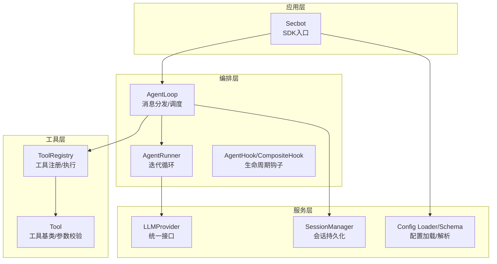
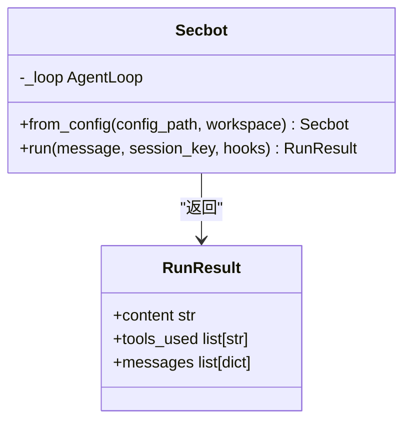
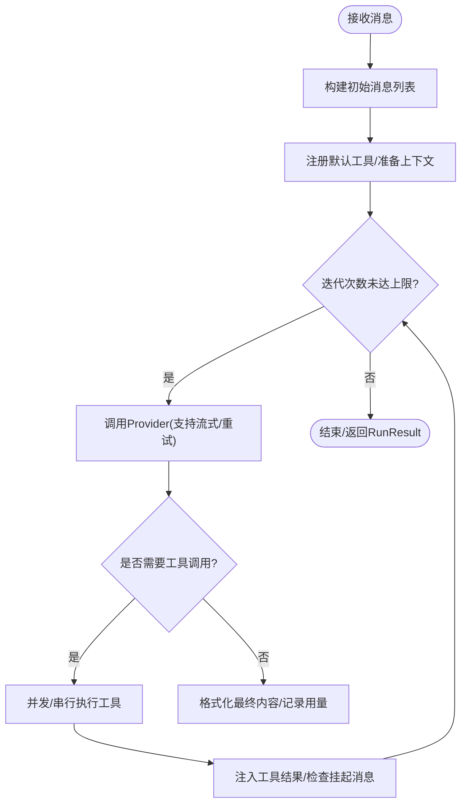
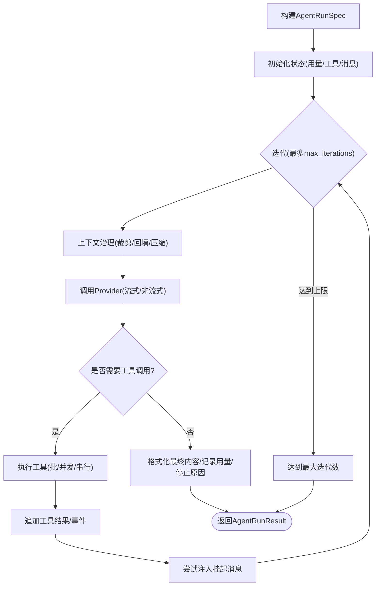
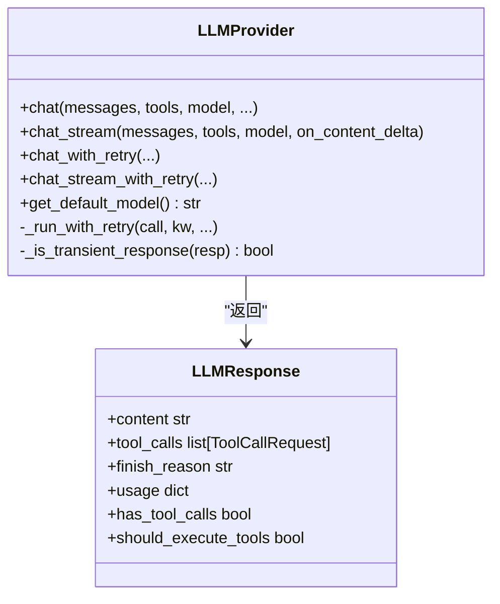
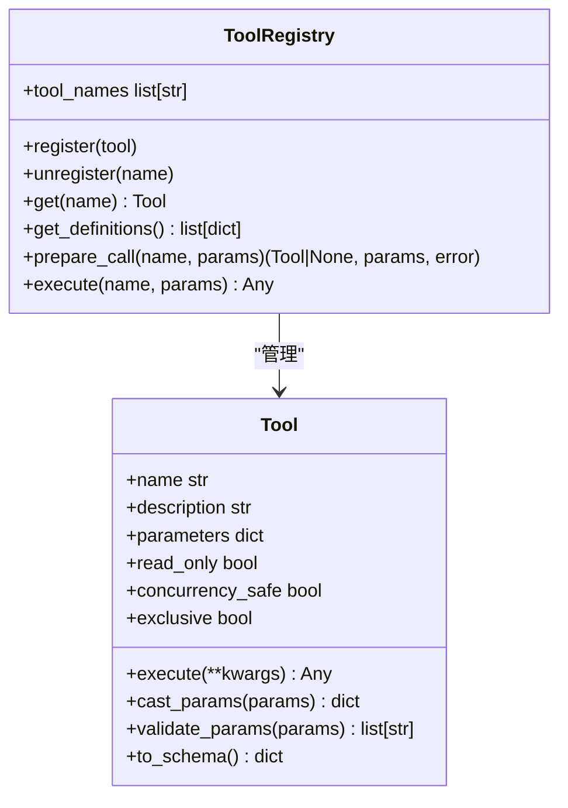
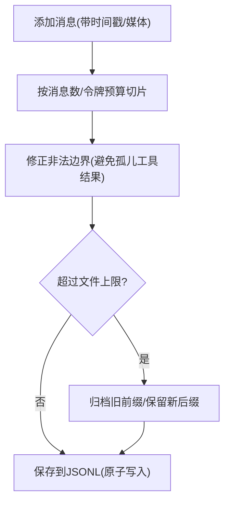
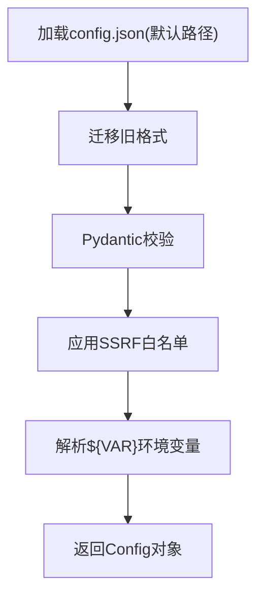
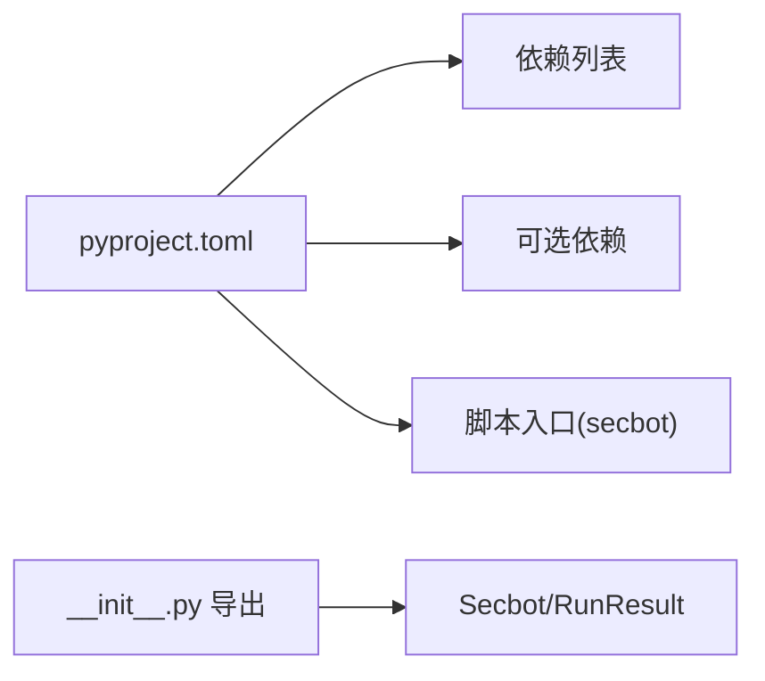

# Python SDK集成

<cite>
**本文档引用的文件**
- [docs/python-sdk.md](file://docs/python-sdk.md)
- [secbot/__init__.py](file://secbot/__init__.py)
- [secbot/secbot.py](file://secbot/secbot.py)
- [secbot/agent/runner.py](file://secbot/agent/runner.py)
- [secbot/agent/hook.py](file://secbot/agent/hook.py)
- [secbot/agent/loop.py](file://secbot/agent/loop.py)
- [secbot/agent/tools/registry.py](file://secbot/agent/tools/registry.py)
- [secbot/agent/tools/base.py](file://secbot/agent/tools/base.py)
- [secbot/providers/base.py](file://secbot/providers/base.py)
- [secbot/session/manager.py](file://secbot/session/manager.py)
- [secbot/config/loader.py](file://secbot/config/loader.py)
- [secbot/config/schema.py](file://secbot/config/schema.py)
- [pyproject.toml](file://pyproject.toml)
</cite>

## 目录
1. [简介](#简介)
2. [项目结构](#项目结构)
3. [核心组件](#核心组件)
4. [架构总览](#架构总览)
5. [详细组件分析](#详细组件分析)
6. [依赖关系分析](#依赖关系分析)
7. [性能考虑](#性能考虑)
8. [故障排查指南](#故障排查指南)
9. [结论](#结论)
10. [附录](#附录)

## 简介
本指南面向希望在Python应用中集成VAPT3（原nanobot）SDK的开发者，系统讲解SDK的设计架构、核心类结构与运行机制，覆盖客户端初始化、连接管理、请求发送、会话管理、工具执行、钩子扩展、异步并发、错误处理、高级配置（自定义请求头、代理、SSL）等主题，并提供可直接参考的代码片段路径与实践建议。

## 项目结构
VAPT3采用分层清晰的模块化设计：上层通过Secbot对外暴露简洁的编程接口；中间层AgentLoop负责消息分发、上下文构建、工具注册与调度；底层AgentRunner封装LLM调用与工具执行；Provider抽象屏蔽多厂商差异；SessionManager持久化对话历史；Config体系统一加载与解析配置。



**图表来源**
- [secbot/secbot.py:23-91](file://secbot/secbot.py#L23-L91)
- [secbot/agent/loop.py:276-425](file://secbot/agent/loop.py#L276-L425)
- [secbot/agent/runner.py:100-234](file://secbot/agent/runner.py#L100-L234)
- [secbot/providers/base.py:92-170](file://secbot/providers/base.py#L92-L170)
- [secbot/agent/tools/registry.py:8-71](file://secbot/agent/tools/registry.py#L8-L71)
- [secbot/agent/tools/base.py:117-172](file://secbot/agent/tools/base.py#L117-L172)
- [secbot/session/manager.py:239-256](file://secbot/session/manager.py#L239-L256)
- [secbot/config/loader.py:32-56](file://secbot/config/loader.py#L32-L56)
- [secbot/config/schema.py:267-281](file://secbot/config/schema.py#L267-L281)

**章节来源**
- [docs/python-sdk.md:1-220](file://docs/python-sdk.md#L1-L220)
- [secbot/__init__.py:30-32](file://secbot/__init__.py#L30-L32)

## 核心组件
- Secbot：SDK高层入口，负责从配置创建AgentLoop并提供run()方法。
- AgentLoop：消息分发与任务路由，注册默认工具，协调Runner与Session。
- AgentRunner：单次Agent执行的迭代循环，封装LLM调用、工具执行、上下文治理与重试。
- LLMProvider：抽象LLM调用接口，内置重试、流式回调、错误分类与退避策略。
- ToolRegistry/Tool：工具注册、参数类型转换与校验、执行与错误包装。
- SessionManager：会话持久化、历史截取、归档与恢复。
- 配置系统：Config/Loader/Schema统一加载、环境变量注入、默认值与别名映射。

**章节来源**
- [secbot/secbot.py:23-124](file://secbot/secbot.py#L23-L124)
- [secbot/agent/runner.py:100-234](file://secbot/agent/runner.py#L100-L234)
- [secbot/providers/base.py:92-170](file://secbot/providers/base.py#L92-L170)
- [secbot/agent/tools/registry.py:8-126](file://secbot/agent/tools/registry.py#L8-L126)
- [secbot/agent/tools/base.py:117-280](file://secbot/agent/tools/base.py#L117-L280)
- [secbot/session/manager.py:239-659](file://secbot/session/manager.py#L239-L659)
- [secbot/config/loader.py:32-173](file://secbot/config/loader.py#L32-L173)
- [secbot/config/schema.py:68-113](file://secbot/config/schema.py#L68-L113)

## 架构总览
SDK以“配置驱动 + 生命周期钩子 + 工具生态 + 会话持久化”的方式组织，支持同步与异步两种调用模式，具备完善的错误隔离、并发控制与可观测性能力。

```mermaid
sequenceDiagram
participant App as "应用"
participant SDK as "Secbot"
participant Loop as "AgentLoop"
participant Runner as "AgentRunner"
participant Provider as "LLMProvider"
participant Tools as "ToolRegistry"
App->>SDK : 初始化/加载配置
SDK->>Loop : 创建AgentLoop(工作区/工具/会话/超时等)
App->>SDK : run(消息, 会话键, 钩子)
SDK->>Loop : process_direct(消息, 会话键)
Loop->>Runner : 构建AgentRunSpec并执行
Runner->>Provider : chat_with_retry/chat_stream_with_retry
Provider-->>Runner : LLMResponse(内容/工具调用/用量)
alt 需要工具调用
Runner->>Tools : 执行工具(并发/串行)
Tools-->>Runner : 工具结果/事件
Runner->>Provider : 再次调用(注入工具结果)
end
Runner-->>Loop : 迭代结果(最终内容/用量/停止原因)
Loop-->>SDK : 返回RunResult
SDK-->>App : 返回RunResult
```

**图表来源**
- [secbot/secbot.py:93-124](file://secbot/secbot.py#L93-L124)
- [secbot/agent/loop.py:644-786](file://secbot/agent/loop.py#L644-L786)
- [secbot/agent/runner.py:234-567](file://secbot/agent/runner.py#L234-L567)
- [secbot/providers/base.py:563-602](file://secbot/providers/base.py#L563-L602)
- [secbot/agent/tools/registry.py:100-114](file://secbot/agent/tools/registry.py#L100-L114)

## 详细组件分析

### SDK入口与初始化
- 入口导出：通过包级导出Secbot与RunResult，便于直接from secbot import Secbot使用。
- 初始化流程：Secbot.from_config()加载配置、解析环境变量、创建Provider与AgentLoop，支持覆盖工作区与会话参数。
- 运行接口：Secbot.run()将用户消息交由AgentLoop处理，返回RunResult（内容、工具列表、消息列表）。



**图表来源**
- [secbot/__init__.py:30-32](file://secbot/__init__.py#L30-L32)
- [secbot/secbot.py:14-21](file://secbot/secbot.py#L14-L21)
- [secbot/secbot.py:36-91](file://secbot/secbot.py#L36-L91)
- [secbot/secbot.py:93-124](file://secbot/secbot.py#L93-L124)

**章节来源**
- [docs/python-sdk.md:63-93](file://docs/python-sdk.md#L63-L93)
- [secbot/__init__.py:30-32](file://secbot/__init__.py#L30-L32)
- [secbot/secbot.py:36-124](file://secbot/secbot.py#L36-L124)

### AgentLoop：消息分发与调度
- 注册默认工具集：文件读写、搜索、执行、网络抓取、消息投递、定时任务等。
- 会话管理：按channel:chat_id或统一会话键管理历史，支持并发会话锁与挂起队列。
- 并发控制：通过信号量限制最大并发请求，避免资源争用。
- 生命周期钩子：_LoopHook桥接Streaming/进度回调，广播活动事件，剥离<think>内容。



**图表来源**
- [secbot/agent/loop.py:460-513](file://secbot/agent/loop.py#L460-L513)
- [secbot/agent/loop.py:644-786](file://secbot/agent/loop.py#L644-L786)
- [secbot/agent/runner.py:234-567](file://secbot/agent/runner.py#L234-L567)

**章节来源**
- [secbot/agent/loop.py:276-425](file://secbot/agent/loop.py#L276-L425)
- [secbot/agent/loop.py:644-786](file://secbot/agent/loop.py#L644-L786)

### AgentRunner：迭代循环与上下文治理
- 上下文治理：微压缩、工具结果回填、长度回收、角色交替修正、非法孤儿节点清理。
- 工具执行：批分区、并发/串行策略、重复外部访问阻断、错误分类与致命错误短路。
- 流式与进度：支持on_content_delta回调与progress_callback增量推送。
- 重试与超时：基于finish_reason与错误语义判断，结合retry_after与指数退避。



**图表来源**
- [secbot/agent/runner.py:56-83](file://secbot/agent/runner.py#L56-L83)
- [secbot/agent/runner.py:234-567](file://secbot/agent/runner.py#L234-L567)

**章节来源**
- [secbot/agent/runner.py:100-567](file://secbot/agent/runner.py#L100-L567)

### LLMProvider：统一接口与重试策略
- 统一接口：chat/chat_stream/chat_with_retry/chat_stream_with_retry，支持默认生成参数与重试模式。
- 错误分类：基于状态码、错误类型/代码、文本标记与结构化元数据，区分瞬时/永久错误。
- 重试与退避：内置延迟序列、持久重试阈值、心跳提示、从响应头/内容提取retry-after。
- 图像内容处理：自动剥离图片块或替换占位符，避免不支持的输入。



**图表来源**
- [secbot/providers/base.py:92-170](file://secbot/providers/base.py#L92-L170)
- [secbot/providers/base.py:266-291](file://secbot/providers/base.py#L266-L291)
- [secbot/providers/base.py:483-527](file://secbot/providers/base.py#L483-L527)
- [secbot/providers/base.py:699-786](file://secbot/providers/base.py#L699-L786)

**章节来源**
- [secbot/providers/base.py:92-792](file://secbot/providers/base.py#L92-L792)

### 工具体系：注册、参数校验与执行
- ToolRegistry：动态注册/注销工具，生成稳定顺序的工具定义，支持参数预处理与错误提示。
- Tool基类：提供参数类型转换、JSON Schema校验、OpenAI函数schema输出。
- 默认工具集：文件系统、搜索、执行、网络、消息、定时等，按配置启用。



**图表来源**
- [secbot/agent/tools/registry.py:8-126](file://secbot/agent/tools/registry.py#L8-L126)
- [secbot/agent/tools/base.py:117-280](file://secbot/agent/tools/base.py#L117-L280)

**章节来源**
- [secbot/agent/tools/registry.py:8-126](file://secbot/agent/tools/registry.py#L8-L126)
- [secbot/agent/tools/base.py:117-280](file://secbot/agent/tools/base.py#L117-L280)

### 会话管理：历史截取、归档与恢复
- Session：消息增删、时间戳标注、媒体面包屑合成、历史切片与令牌预算约束。
- SessionManager：内存缓存、原子落盘、迁移兼容、损坏修复、列表与预览、归档标记。
- 文件容量控制：前缀归档与后缀保留，保证合法边界与工具调用完整性。



**图表来源**
- [secbot/session/manager.py:74-158](file://secbot/session/manager.py#L74-L158)
- [secbot/session/manager.py:208-237](file://secbot/session/manager.py#L208-L237)
- [secbot/session/manager.py:403-449](file://secbot/session/manager.py#L403-L449)

**章节来源**
- [secbot/session/manager.py:26-659](file://secbot/session/manager.py#L26-L659)

### 配置系统：加载、解析与环境变量注入
- 加载器：支持默认路径、迁移旧格式、SSRF白名单应用、保存配置。
- 解析器：递归解析${VAR}环境变量引用，缺失时报错。
- Schema：camelCase/snake_case双键支持、别名映射、默认值与字段验证。



**图表来源**
- [secbot/config/loader.py:32-173](file://secbot/config/loader.py#L32-L173)
- [secbot/config/schema.py:267-375](file://secbot/config/schema.py#L267-L375)

**章节来源**
- [secbot/config/loader.py:32-173](file://secbot/config/loader.py#L32-L173)
- [secbot/config/schema.py:68-113](file://secbot/config/schema.py#L68-L113)

## 依赖关系分析
- 版本与依赖：项目要求Python 3.11+，声明大量第三方库用于HTTP、WebSocket、工具链、文档处理、数据库等。
- 可选依赖：API、企业微信、企业微信小程序、Teams、Matrix、Discord、LangSmith、PDF、Olostep等通道与功能。
- 包导出：通过__all__与__init__.py集中导出Secbot与RunResult，简化外部导入。



**图表来源**
- [pyproject.toml:1-169](file://pyproject.toml#L1-L169)
- [secbot/__init__.py:27-32](file://secbot/__init__.py#L27-L32)

**章节来源**
- [pyproject.toml:25-110](file://pyproject.toml#L25-L110)
- [secbot/__init__.py:27-32](file://secbot/__init__.py#L27-L32)

## 性能考虑
- 连接与并发
  - 通过环境变量SECBOT_MAX_CONCURRENT_REQUESTS限制并发请求数，默认3，避免过载。
  - Provider重试采用指数退避与心跳提示，减少抖动对下游影响。
- 上下文治理
  - 微压缩与工具结果回填降低历史冗余，提升token利用率。
  - 历史截取优先按消息数，再按令牌预算，确保关键对话不被裁剪。
- 缓存与归档
  - SessionManager前缀归档与后缀保留，配合文件上限控制，平衡内存与磁盘。
- 批处理与并发工具
  - Runner对工具调用进行批分区，支持并发执行，缩短端到端时延。
- 超时与重试
  - Provider支持超时与持久重试模式，结合retry-after与结构化错误元数据，提升鲁棒性。

[本节为通用指导，无需特定文件引用]

## 故障排查指南
- 常见问题定位
  - LLM错误：查看finish_reason与error_*字段，区分瞬时/永久错误；必要时剥离图像内容重试。
  - 工具执行失败：检查参数校验与类型转换，关注致命错误（如AskUserInterrupt）与重复外部访问阻断。
  - 会话异常：SessionManager提供损坏修复与迁移逻辑，关注JSONL解析与原子写入。
- 观测与日志
  - 使用AgentHook/CompositeHook捕获迭代、流式、工具执行阶段信息，便于审计与调试。
  - 开启进度回调与活动事件广播，辅助实时监控。
- 配置校验
  - 确认环境变量SECBOT_*前缀的配置项已正确注入，缺失时会报错。
  - 检查Provider匹配与API Key/基础URL配置，避免路由错误。

**章节来源**
- [secbot/providers/base.py:294-370](file://secbot/providers/base.py#L294-L370)
- [secbot/agent/runner.py:708-786](file://secbot/agent/runner.py#L708-L786)
- [secbot/session/manager.py:338-391](file://secbot/session/manager.py#L338-L391)
- [secbot/agent/hook.py:58-104](file://secbot/agent/hook.py#L58-L104)
- [secbot/config/loader.py:86-147](file://secbot/config/loader.py#L86-L147)

## 结论
VAPT3 Python SDK以清晰的分层架构、完善的工具生态与会话持久化能力，为安全运营场景提供了强大的多模态Agent能力。通过配置驱动与钩子扩展，开发者可在Web/Dashboard/桌面/自动化脚本等多种场景中快速集成，并借助并发控制、上下文治理与重试机制获得稳定可靠的性能表现。

[本节为总结，无需特定文件引用]

## 附录

### 安装与配置
- 安装
  - 使用pip安装项目包，或根据需求启用可选通道与功能依赖。
- 配置
  - 默认配置路径：~/.secbot/config.json；可通过from_config传入自定义路径与工作区。
  - 支持环境变量注入（SECBOT_*），用于覆盖Provider、API Key、API Base等。
  - 提供默认Agent配置（模型、温度、上下文窗口、最大迭代等）。

**章节来源**
- [pyproject.toml:25-110](file://pyproject.toml#L25-L110)
- [docs/python-sdk.md:5-24](file://docs/python-sdk.md#L5-L24)
- [secbot/config/loader.py:32-173](file://secbot/config/loader.py#L32-L173)
- [secbot/config/schema.py:68-113](file://secbot/config/schema.py#L68-L113)

### 快速开始与示例
- 基础调用
  - 参考文档中的最小示例，展示从配置创建实例并发起一次对话。
- 会话隔离
  - 使用session_key区分不同用户/任务的历史，实现独立对话树。
- 钩子扩展
  - 自定义AgentHook实现审计、计时、流式输出、内容后处理等功能。
- 多钩子组合
  - 将多个钩子组合为CompositeHook，实现观测与行为增强的解耦。

**章节来源**
- [docs/python-sdk.md:7-24](file://docs/python-sdk.md#L7-L24)
- [docs/python-sdk.md:37-44](file://docs/python-sdk.md#L37-L44)
- [docs/python-sdk.md:46-173](file://docs/python-sdk.md#L46-L173)

### 异步与并发
- 异步模式
  - SDK完全基于async/await，适合高并发Web/Dashboard集成。
- 并发控制
  - 通过SECBOT_MAX_CONCURRENT_REQUESTS限制并发请求，避免资源争用。
  - 工具执行支持批内并发，结合信号量与任务取消保障稳定性。

**章节来源**
- [secbot/agent/loop.py:392-396](file://secbot/agent/loop.py#L392-L396)
- [secbot/agent/runner.py:708-740](file://secbot/agent/runner.py#L708-L740)

### 高级配置
- 自定义请求头与额外请求体
  - 在ProviderConfig中设置extra_headers与extra_body，影响所有请求。
- 代理与网络
  - Web工具支持HTTP/SOCKS5代理配置；SSRF白名单可限制网络范围。
- SSL与本地模型
  - 通过api_base指向本地/私有部署端点；按需配置证书与鉴权。

**章节来源**
- [secbot/config/schema.py:121-172](file://secbot/config/schema.py#L121-L172)
- [secbot/config/schema.py:214-224](file://secbot/config/schema.py#L214-L224)
- [secbot/config/schema.py:262-264](file://secbot/config/schema.py#L262-L264)

### 应用场景与最佳实践
- Web/Dashboard集成
  - 使用钩子实现流式输出与活动事件广播，提升交互体验。
- 桌面应用
  - 利用会话管理与统一模型切换，支持跨设备一致的对话体验。
- 自动化脚本
  - 通过会话键隔离任务历史，结合工具链完成文件/网络/命令执行。

**章节来源**
- [secbot/agent/loop.py:120-274](file://secbot/agent/loop.py#L120-L274)
- [secbot/session/manager.py:239-659](file://secbot/session/manager.py#L239-L659)

### 测试与调试
- 单元测试
  - 使用pytest与pytest-asyncio，覆盖工具参数校验、Provider重试、会话持久化等。
- 集成测试
  - 通过AgentLoop与Runner端到端验证，结合钩子与进度回调验证可观测性。
- 性能测试
  - 关注并发请求、工具批处理、上下文治理对吞吐与延迟的影响。

**章节来源**
- [pyproject.toml:103-110](file://pyproject.toml#L103-L110)
- [pyproject.toml:153-169](file://pyproject.toml#L153-L169)