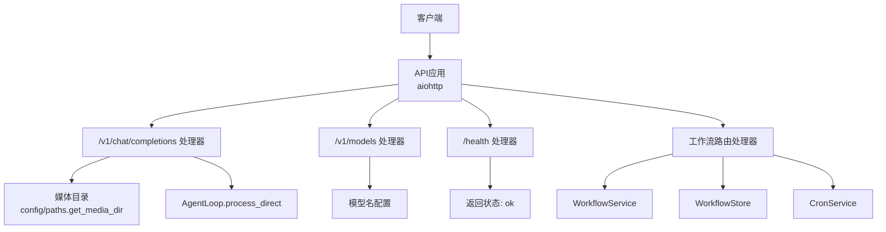
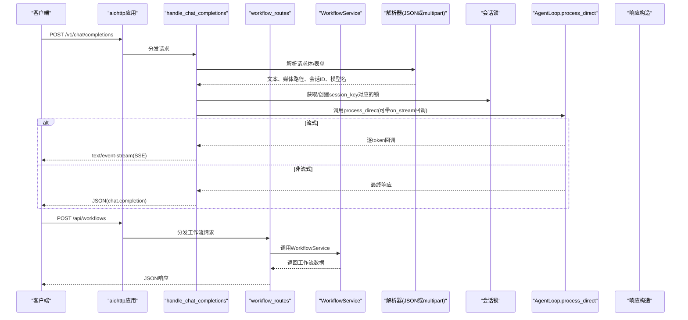
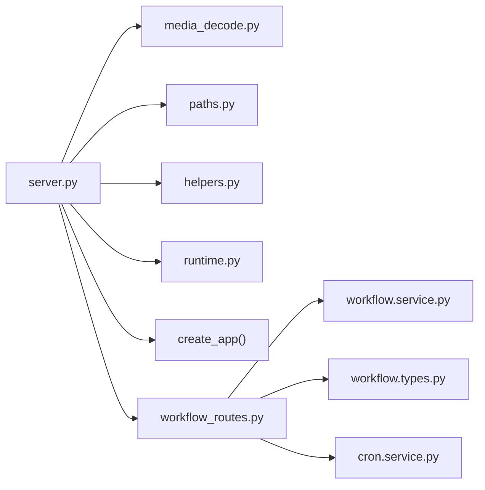

# REST API端点

<cite>
**本文引用的文件**
- [secbot/api/server.py](file://secbot/api/server.py)
- [secbot/api/workflow_routes.py](file://secbot/api/workflow_routes.py)
- [secbot/api/prompts.py](file://secbot/api/prompts.py)
- [secbot/utils/media_decode.py](file://secbot/utils/media_decode.py)
- [secbot/utils/helpers.py](file://secbot/utils/helpers.py)
- [secbot/utils/runtime.py](file://secbot/utils/runtime.py)
- [secbot/config/paths.py](file://secbot/config/paths.py)
- [secbot/workflow/types.py](file://secbot/workflow/types.py)
- [secbot/workflow/service.py](file://secbot/workflow/service.py)
- [webui/src/lib/workflow-client.ts](file://webui/src/lib/workflow-client.ts)
- [tests/test_api_stream.py](file://tests/test_api_stream.py)
- [tests/test_api_attachment.py](file://tests/test_api_attachment.py)
- [tests/api/test_workflow_routes.py](file://tests/api/test_workflow_routes.py)
- [README.md](file://README.md)
</cite>

## 更新摘要
**变更内容**
- 新增工作流引擎API端点文档，涵盖完整的CRUD操作、运行控制和调度功能
- 增强现有API功能，添加工作流相关的元数据端点
- 更新架构图以反映新的工作流服务集成
- 添加工作流执行器类型和步骤结果的数据模型说明
- 完善错误处理机制，包含工作流特定的错误类型

## 目录
1. [简介](#简介)
2. [项目结构](#项目结构)
3. [核心组件](#核心组件)
4. [架构总览](#架构总览)
5. [详细组件分析](#详细组件分析)
6. [工作流引擎API](#工作流引擎api)
7. [依赖关系分析](#依赖关系分析)
8. [性能考量](#性能考量)
9. [故障排查指南](#故障排查指南)
10. [结论](#结论)
11. [附录](#附录)

## 简介
本文件聚焦于VAPT3的OpenAI兼容REST API端点，现已扩展为包含工作流引擎的完整API系统。涵盖以下关键接口与行为：

### 核心API端点
- **/v1/chat/completions（POST）**：支持JSON请求体与multipart/form-data表单；支持流式（SSE）与非流式响应；请求体参数验证、媒体文件处理、会话ID管理、超时与并发锁机制。
- **/v1/models（GET）**：返回可用模型列表。
- **/health（GET）**：健康检查端点。

### 工作流引擎API端点
- **/api/workflows（GET/POST）**：工作流列表查询与创建工作流定义。
- **/api/workflows/{id}（GET/PUT/DELETE）**：获取、更新、删除指定工作流。
- **/api/workflows/{id}/run（POST）**：手动触发工作流执行。
- **/api/workflows/{id}/runs（GET）**：获取工作流运行历史。
- **/api/workflows/{id}/runs/{runId}（GET）**：获取指定运行详情。
- **/api/workflows/{id}/schedule（POST/DELETE）**：设置和删除工作流调度。
- **/api/workflows/_tools（GET）**：获取可用工具元数据。
- **/api/workflows/_agents（GET）**：获取可用代理元数据。
- **/api/workflows/_templates（GET）**：获取内置工作流模板。

### 错误处理机制
- **400（无效请求）**：工作流验证错误、参数格式错误。
- **404（未找到）**：工作流或运行不存在。
- **413（文件过大）**：JSON base64 payload或multipart files超过10MB。
- **500（服务器错误）**：AgentLoop调用异常、空响应兜底失败等。
- **503（服务不可用）**：工作流服务未连接。
- **504（请求超时）**：超过per-request超时阈值。

## 项目结构
与REST API直接相关的核心模块如下：

### 核心API模块
- **API路由与处理器**：secbot/api/server.py
- **工作流路由处理器**：secbot/api/workflow_routes.py
- **媒体文件解析与大小限制**：secbot/utils/media_decode.py
- **路径与媒体目录**：secbot/config/paths.py
- **辅助函数（含安全文件名、文本拼接等）**：secbot/utils/helpers.py
- **运行时常量（空响应兜底提示）**：secbot/utils/runtime.py
- **提示词加载（与本节无关，但同属API子系统）**：secbot/api/prompts.py

### 工作流引擎模块
- **工作流数据模型**：secbot/workflow/types.py
- **工作流服务**：secbot/workflow/service.py
- **WebUI工作流客户端**：webui/src/lib/workflow-client.ts

### 测试用例
- **API流式响应测试**：tests/test_api_stream.py
- **API附件上传测试**：tests/test_api_attachment.py
- **工作流路由测试**：tests/api/test_workflow_routes.py



**图表来源**
- [secbot/api/server.py:410-427](file://secbot/api/server.py#L410-L427)
- [secbot/api/workflow_routes.py:497-525](file://secbot/api/workflow_routes.py#L497-L525)

**章节来源**
- [secbot/api/server.py:1-427](file://secbot/api/server.py#L1-L427)
- [secbot/api/workflow_routes.py:1-525](file://secbot/api/workflow_routes.py#L1-L525)
- [README.md:113-179](file://README.md#L113-L179)

## 核心组件
### 应用工厂与路由
- **create_app**：创建aiohttp应用，注册/v1/chat/completions、/v1/models、/health路由，设置client_max_size、模型名与请求超时。
- **create_workflow_app**：创建独立的工作流应用，提供/CORS预检支持和健康检查。

### 处理器
- **handle_chat_completions**：统一处理JSON与multipart请求，支持流式SSE与非流式JSON；负责参数校验、媒体解析、会话锁、超时控制与错误映射。
- **handle_models**：返回单模型信息。
- **handle_health**：返回健康状态。
- **workflow_routes**：工作流引擎的完整CRUD、运行控制和调度管理。

### 媒体与文件处理
- **_parse_json_content**：从JSON消息中提取文本与base64图片，保存为本地文件并返回路径。
- **_parse_multipart**：解析multipart/form-data，支持message、session_id、model、files字段，文件大小限制。
- **media_decode.save_base64_data_url**：解码dataURL并落盘，带大小限制。

### 工作流服务集成
- **WorkflowService**：工作流引擎的主服务，负责工作流的存储、执行和调度。
- **WorkflowStore**：持久化存储工作流定义和运行记录。
- **WorkflowRunner**：单次运行的编排器，处理步骤执行、条件判断和重试逻辑。

**章节来源**
- [secbot/api/server.py:194-351](file://secbot/api/server.py#L194-L351)
- [secbot/api/server.py:353-374](file://secbot/api/server.py#L353-L374)
- [secbot/api/server.py:476-509](file://secbot/api/server.py#L476-L509)
- [secbot/api/workflow_routes.py:184-525](file://secbot/api/workflow_routes.py#L184-L525)
- [secbot/utils/media_decode.py:28-56](file://secbot/utils/media_decode.py#L28-L56)

## 架构总览
下图展示了请求从客户端到AgentLoop和工作流引擎的完整路径，以及SSE流式响应和工作流执行的生成过程。



**图表来源**
- [secbot/api/server.py:194-351](file://secbot/api/server.py#L194-L351)
- [secbot/api/workflow_routes.py:210-233](file://secbot/api/workflow_routes.py#L210-L233)

## 详细组件分析

### /v1/chat/completions（POST）
- **方法与路由**：POST /v1/chat/completions
- **请求体格式**：
  - **JSON模式**：messages数组，仅允许单条用户消息（role=user），content可为字符串或对象数组（支持text与image_url两类元素）。
  - **multipart/form-data模式**：字段包括message、session_id、model、files。
- **响应格式**：
  - 非流式：标准OpenAI风格chat.completion JSON。
  - 流式：text/event-stream，每块为chat.completion.chunk，最后以[DONE]结束。
- **参数验证与错误**：
  - 仅支持单条用户消息，否则返回400。
  - content类型非法返回400。
  - 远程图片URL不被支持（仅允许data:base64），否则返回400。
  - 文件大小超过限制（默认10MB）返回413。
  - 模型名不匹配返回400。
  - 请求超时返回504。
  - 其他内部错误返回500。
- **媒体文件处理**：JSON和multipart模式均支持base64图片解码和文件保存。
- **会话管理**：session_key = "api:" + session_id（若提供），否则固定键。
- **超时机制**：per-request超时由create_app传入，处理过程中以wait_for包裹AgentLoop调用。

**章节来源**
- [secbot/api/server.py:194-351](file://secbot/api/server.py#L194-L351)
- [tests/test_api_stream.py:100-170](file://tests/test_api_stream.py#L100-L170)
- [tests/test_api_attachment.py:185-313](file://tests/test_api_attachment.py#L185-L313)

### /v1/models（GET）
- 返回当前服务端配置的模型列表（单模型）。
- 响应字段：object=list，data=[{id, object=model, created, owned_by}]。
- 模型名来自create_app(model_name)。

**章节来源**
- [secbot/api/server.py:353-374](file://secbot/api/server.py#L353-L374)

### /health（GET）
- 返回{"status":"ok"}，用于健康检查。

**章节来源**
- [secbot/api/server.py:371-374](file://secbot/api/server.py#L371-L374)

## 工作流引擎API

### 工作流CRUD操作
#### 列表查询（GET /api/workflows）
- **功能**：获取所有工作流定义，支持过滤参数。
- **查询参数**：
  - tag：按标签过滤
  - search：按名称或描述搜索
- **响应**：包含items数组、total计数和stats统计信息。

#### 创建工作流（POST /api/workflows）
- **请求体**：WorkflowDraft对象，包含name、description、tags、inputs、steps字段。
- **响应**：创建的工作流对象，状态码201。
- **验证规则**：
  - name必须存在且非空
  - inputs必须为数组格式
  - steps必须为数组格式
  - 每个step的kind必须为tool/script/agent/llm之一

#### 获取工作流（GET /api/workflows/{id}）
- **功能**：获取指定ID的工作流定义。
- **响应**：完整的Workflow对象。
- **错误**：工作流不存在返回404。

#### 更新工作流（PUT /api/workflows/{id}）
- **功能**：完全替换指定工作流的属性。
- **响应**：更新后的工作流对象。
- **注意**：id、createdAtMs、scheduleRef等字段由服务器管理，不会被客户端修改。

#### 删除工作流（DELETE /api/workflows/{id}）
- **功能**：删除指定ID的工作流。
- **响应**：{"deleted": id}。
- **错误**：工作流不存在返回404。

### 工作流运行控制
#### 手动运行（POST /api/workflows/{id}/run）
- **请求体**：包含inputs对象，提供运行时输入参数。
- **响应**：RunStartResponse，包含runId和初始状态。
- **触发类型**：trigger字段为"api"。

#### 运行历史（GET /api/workflows/{id}/runs）
- **功能**：获取工作流的运行历史。
- **查询参数**：
  - limit：限制返回数量（1-500，默认20）

#### 获取运行详情（GET /api/workflows/{id}/runs/{runId}）
- **功能**：获取指定运行的详细信息。
- **响应**：WorkflowRun对象，包含步骤结果和执行状态。

### 工作流调度
#### 设置调度（POST /api/workflows/{id}/schedule）
- **请求体**：SchedulePayload，支持三种调度类型：
  - **cron**：基于cron表达式的定时调度
  - **every**：每隔固定时间执行
  - **at**：在指定时间点执行
- **响应**：更新后的工作流对象，包含scheduleRef。

#### 删除调度（DELETE /api/workflows/{id}/schedule）
- **功能**：移除工作流的调度配置。
- **响应**：更新后的工作流对象。

### 元数据端点
#### 工具元数据（GET /api/workflows/_tools）
- **功能**：获取可用工具的元数据列表。
- **响应**：包含name、title、description、inputSchema、outputSchema的工具信息。

#### 代理元数据（GET /api/workflows/_agents）
- **功能**：获取可用代理的规格信息。
- **响应**：包含name、title、description、inputSchema、outputSchema的代理信息。

#### 模板（GET /api/workflows/_templates）
- **功能**：获取内置工作流模板列表。
- **响应**：包含模板ID、名称、描述和预填充的工作流草稿。

### 数据模型

#### Workflow（工作流定义）
- **字段**：
  - id：唯一标识符
  - name：工作流名称
  - description：描述
  - tags：标签数组
  - inputs：输入参数定义数组
  - steps：步骤定义数组
  - scheduleRef：调度引用
  - createdAtMs/updatedAtMs：时间戳

#### WorkflowInput（输入参数）
- **字段**：
  - name：参数名称
  - label：显示标签
  - type：类型（string/cidr/int/bool/enum）
  - required：是否必需
  - default：默认值
  - description：描述
  - enumValues：枚举值数组

#### WorkflowStep（步骤定义）
- **字段**：
  - id：步骤ID
  - name：步骤名称
  - kind：执行器类型（tool/script/agent/llm）
  - ref：引用标识
  - args：参数对象
  - condition：条件表达式
  - onError：错误处理策略（stop/continue/retry）
  - retry：重试次数

#### WorkflowRun（运行实例）
- **字段**：
  - id：运行ID
  - workflowId：所属工作流ID
  - startedAtMs/finishedAtMs：开始/结束时间戳
  - status：运行状态（running/ok/error/cancelled）
  - inputs：输入参数
  - stepResults：步骤结果映射
  - trigger：触发类型（manual/cron/api）
  - error：错误信息

#### StepResult（步骤结果）
- **字段**：
  - status：状态（ok/error/skipped/retried）
  - startedAtMs/finishedAtMs/durationMs：时间信息
  - output：输出结果
  - error：错误信息

### 错误处理机制
- **400（无效请求）**：工作流验证错误、参数格式错误。
- **404（未找到）**：工作流或运行不存在。
- **413（文件过大）**：JSON base64 payload或multipart files超过10MB。
- **500（服务器错误）**：AgentLoop调用异常、空响应兜底失败等。
- **503（服务不可用）**：工作流服务未连接或不可用。
- **504（请求超时）**：超过per-request超时阈值。

**章节来源**
- [secbot/api/workflow_routes.py:184-525](file://secbot/api/workflow_routes.py#L184-L525)
- [secbot/workflow/types.py:78-275](file://secbot/workflow/types.py#L78-L275)
- [tests/api/test_workflow_routes.py:1-535](file://tests/api/test_workflow_routes.py#L1-L535)

## 依赖关系分析
### 处理器依赖
- **解析器依赖**：媒体目录路径与文件大小限制。
- **媒体保存依赖**：安全文件名与路径工具。
- **空响应兜底依赖**：运行时常量。
- **工作流服务依赖**：WorkflowService、WorkflowStore、CronService。

### 路由与应用
- **create_app**：集中初始化路由、超时、模型名与会话锁字典。
- **create_workflow_app**：独立工作流应用，提供CORS支持和健康检查。



**图表来源**
- [secbot/api/server.py:19-31](file://secbot/api/server.py#L19-L31)
- [secbot/api/workflow_routes.py:27-33](file://secbot/api/workflow_routes.py#L27-L33)
- [secbot/utils/media_decode.py:18-19](file://secbot/utils/media_decode.py#L18-L19)
- [secbot/config/paths.py:21-24](file://secbot/config/paths.py#L21-L24)
- [secbot/utils/helpers.py:136-138](file://secbot/utils/helpers.py#L136-L138)
- [secbot/utils/runtime.py:18-21](file://secbot/utils/runtime.py#L18-L21)
- [secbot/api/server.py:410-427](file://secbot/api/server.py#L410-L427)

**章节来源**
- [secbot/api/server.py:19-31](file://secbot/api/server.py#L19-L31)
- [secbot/api/workflow_routes.py:27-33](file://secbot/api/workflow_routes.py#L27-L33)
- [secbot/utils/media_decode.py:18-19](file://secbot/utils/media_decode.py#L18-L19)
- [secbot/config/paths.py:21-24](file://secbot/config/paths.py#L21-L24)
- [secbot/utils/helpers.py:136-138](file://secbot/utils/helpers.py#L136-L138)
- [secbot/utils/runtime.py:18-21](file://secbot/utils/runtime.py#L18-L21)
- [secbot/api/server.py:410-427](file://secbot/api/server.py#L410-L427)

## 性能考量
### 流式响应
- **SSE逐token推送**：降低首包延迟，适合长文本生成。

### 文件大小限制
- **JSON base64与multipart均受10MB限制**：避免内存与磁盘压力。

### 并发控制
- **会话级锁避免竞争**：但可能带来排队延迟；可根据业务调整会话粒度。

### 超时控制
- **per-request超时防止长时间占用**：提升系统稳定性。

### 工作流执行优化
- **步骤并行执行**：支持多个步骤同时运行（取决于执行器实现）。
- **重试机制**：onError策略支持重试，提高执行可靠性。
- **进度回调**：支持运行进度的实时通知。

## 故障排查指南
### 400错误
- **消息格式不符**：检查messages是否仅有一条且role=user；content类型是否正确。
- **JSON中image_url是否为data:base64**：远程URL会被拒绝。
- **工作流验证错误**：检查name、inputs、steps格式是否符合要求。

### 404错误
- **工作流不存在**：确认工作流ID是否正确。
- **运行记录不存在**：确认运行ID是否正确。

### 413错误
- **检查base64 payload长度或multipart文件大小是否超过10MB。**

### 500错误
- **查看服务端日志定位AgentLoop异常**：确认空响应兜底逻辑是否生效。
- **工作流服务异常**：检查WorkflowService状态。

### 503错误
- **工作流服务未连接**：确认workflow_service参数是否正确传递。

### 504错误
- **检查request_timeout配置**：适当增大超时或优化后端处理耗时。

### 并发问题
- **确认不同会话是否使用不同session_id**：同一会话内串行处理。

**章节来源**
- [tests/test_api_stream.py:341-364](file://tests/test_api_stream.py#L341-L364)
- [tests/test_api_attachment.py:240-261](file://tests/test_api_attachment.py#L240-L261)
- [secbot/api/server.py:341-348](file://secbot/api/server.py#L341-L348)
- [tests/api/test_workflow_routes.py:277-353](file://tests/api/test_workflow_routes.py#L277-L353)

## 结论
VAPT3的OpenAI兼容API在保持简洁的同时提供了完善的媒体处理、会话隔离与错误处理能力。新增的工作流引擎API进一步增强了系统的自动化能力，提供了完整的CRUD操作、运行控制和调度功能。通过SSE流式响应与严格的文件大小限制，既满足实时交互需求，又保障了系统稳定性。工作流引擎支持多种执行器类型和灵活的调度机制，适合构建复杂的自动化流程。建议在生产环境中合理设置超时与并发策略，并对会话ID和工作流ID进行规范化管理以避免冲突。

## 附录

### API调用示例（基于测试用例与源码）

#### curl示例
- **curl（JSON，非流式）**
  - 参考测试用例中POST JSON请求，body包含messages与stream=false。
  - 路径参考：[tests/test_api_stream.py:130-148](file://tests/test_api_stream.py#L130-L148)

- **curl（JSON，流式）**
  - 将stream设为true，监听SSE；最后一条数据为[DONE]。
  - 路径参考：[tests/test_api_stream.py:100-126](file://tests/test_api_stream.py#L100-L126)

- **curl（multipart，上传文件）**
  - 使用multipart/form-data，字段包括message与files。
  - 路径参考：[tests/test_api_attachment.py:187-210](file://tests/test_api_attachment.py#L187-L210)

- **curl（工作流CRUD）**
  - 创建工作流：`curl -X POST http://localhost:8000/api/workflows -H "Content-Type: application/json" -d '{"name":"test","description":"test","inputs":[],"steps":[]}'`
  - 获取工作流：`curl http://localhost:8000/api/workflows/{id}`
  - 更新工作流：`curl -X PUT http://localhost:8000/api/workflows/{id} -H "Content-Type: application/json" -d '{"name":"updated"}'`
  - 删除工作流：`curl -X DELETE http://localhost:8000/api/workflows/{id}`

- **curl（工作流运行）**
  - 运行工作流：`curl -X POST http://localhost:8000/api/workflows/{id}/run -H "Content-Type: application/json" -d '{"inputs":{"target":"10.0.0.1"}}'`

#### 多语言客户端
- **Python requests示例**
  ```python
  import requests
  import json
  
  # 工作流创建
  response = requests.post(
      "http://localhost:8000/api/workflows",
      json={
          "name": "test-workflow",
          "description": "Test workflow",
          "inputs": [],
          "steps": []
      }
  )
  workflow_id = response.json()["id"]
  
  # 工作流运行
  response = requests.post(
      f"http://localhost:8000/api/workflows/{workflow_id}/run",
      json={"inputs": {"target": "10.0.0.1"}}
  )
  run_id = response.json()["runId"]
  ```

- **JavaScript fetch示例**
  ```javascript
  // 工作流创建
  const response = await fetch('http://localhost:8000/api/workflows', {
      method: 'POST',
      headers: {'Content-Type': 'application/json'},
      body: JSON.stringify({
          name: 'test-workflow',
          description: 'Test workflow',
          inputs: [],
          steps: []
      })
  });
  
  const workflow = await response.json();
  const workflowId = workflow.id;
  
  // 工作流运行
  const runResponse = await fetch(`http://localhost:8000/api/workflows/${workflowId}/run`, {
      method: 'POST',
      headers: {'Content-Type': 'application/json'},
      body: JSON.stringify({inputs: {target: '10.0.0.1'}})
  });
  ```

### 端口与入口
- **OpenAI兼容API默认端口为8000**，可通过命令行参数配置。
- **工作流API默认端口为8001**，通过create_workflow_app创建独立应用。
- **路径参考**：[README.md:171-178](file://README.md#L171-L178)

### WebUI集成
- **工作流客户端**：webui/src/lib/workflow-client.ts提供完整的前端集成示例。
- **CORS支持**：工作流应用提供跨域访问支持，便于WebUI集成。
- **认证机制**：使用与聊天WebSocket相同的Bearer token认证。

**章节来源**
- [webui/src/lib/workflow-client.ts:289-380](file://webui/src/lib/workflow-client.ts#L289-L380)
- [secbot/api/server.py:476-509](file://secbot/api/server.py#L476-L509)
- [README.md:171-178](file://README.md#L171-L178)