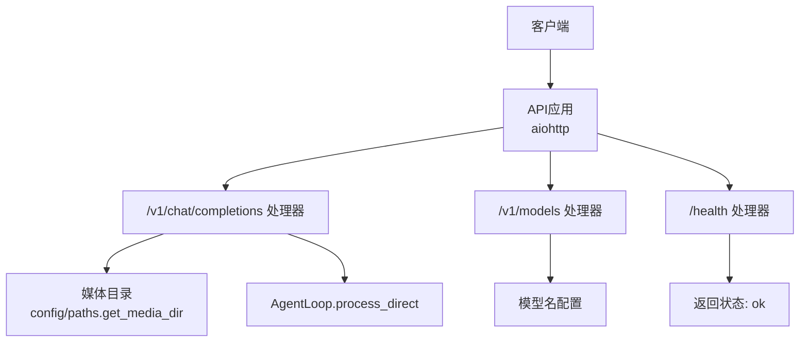
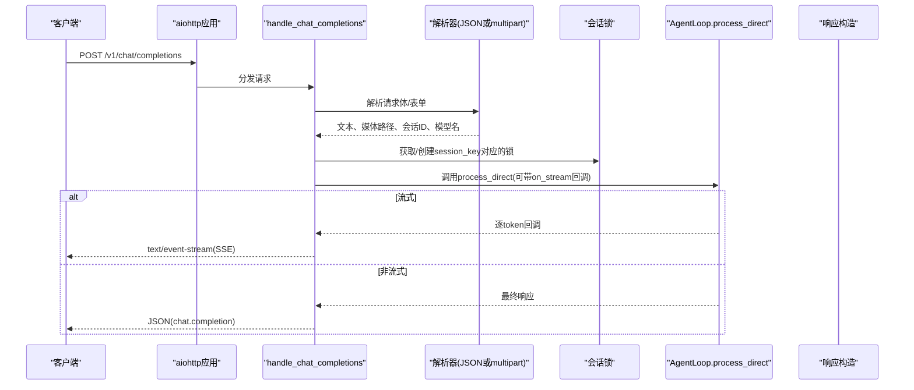
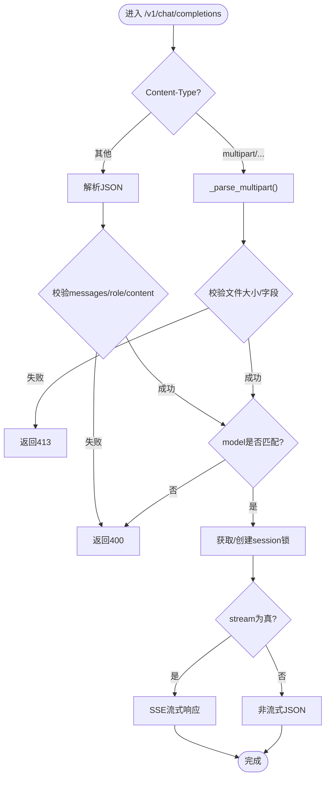
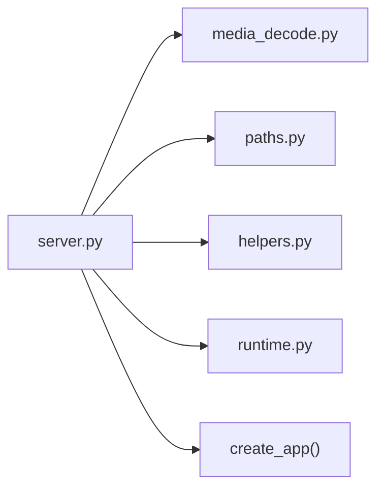

# REST API端点

<cite>
**本文引用的文件**
- [secbot/api/server.py](file://secbot/api/server.py)
- [secbot/api/prompts.py](file://secbot/api/prompts.py)
- [secbot/utils/media_decode.py](file://secbot/utils/media_decode.py)
- [secbot/utils/helpers.py](file://secbot/utils/helpers.py)
- [secbot/utils/runtime.py](file://secbot/utils/runtime.py)
- [secbot/config/paths.py](file://secbot/config/paths.py)
- [tests/test_api_stream.py](file://tests/test_api_stream.py)
- [tests/test_api_attachment.py](file://tests/test_api_attachment.py)
- [README.md](file://README.md)
</cite>

## 目录
1. [简介](#简介)
2. [项目结构](#项目结构)
3. [核心组件](#核心组件)
4. [架构总览](#架构总览)
5. [详细组件分析](#详细组件分析)
6. [依赖关系分析](#依赖关系分析)
7. [性能考量](#性能考量)
8. [故障排查指南](#故障排查指南)
9. [结论](#结论)
10. [附录](#附录)

## 简介
本文件聚焦于VAPT3的OpenAI兼容REST API端点，覆盖以下关键接口与行为：
- /v1/chat/completions（POST）：支持JSON请求体与multipart/form-data表单；支持流式（SSE）与非流式响应；请求体参数验证、媒体文件处理、会话ID管理、超时与并发锁机制。
- /v1/models（GET）：返回可用模型列表。
- /health（GET）：健康检查端点。
- 错误处理：400（无效请求）、404（未找到）、413（文件过大）、500（服务器错误）、504（请求超时）等。
- 请求示例：提供curl命令与多语言客户端调用思路。

## 项目结构
与REST API直接相关的核心模块如下：
- API路由与处理器：secbot/api/server.py
- 媒体文件解析与大小限制：secbot/utils/media_decode.py
- 路径与媒体目录：secbot/config/paths.py
- 辅助函数（含安全文件名、文本拼接等）：secbot/utils/helpers.py
- 运行时常量（空响应兜底提示）：secbot/utils/runtime.py
- 提示词加载（与本节无关，但同属API子系统）：secbot/api/prompts.py
- 测试用例（验证SSE、附件上传、超时与并发）：tests/test_api_stream.py、tests/test_api_attachment.py
- 项目说明（端口与入口）：README.md

图表来源
- [secbot/api/server.py:381-401](file://secbot/api/server.py#L381-L401)
- [secbot/config/paths.py:21-24](file://secbot/config/paths.py#L21-L24)

章节来源
- [secbot/api/server.py:1-401](file://secbot/api/server.py#L1-L401)
- [README.md:113-179](file://README.md#L113-L179)

## 核心组件
- 应用工厂与路由
  - create_app：创建aiohttp应用，注册/v1/chat/completions、/v1/models、/health路由，设置client_max_size、模型名与请求超时。
- 处理器
  - handle_chat_completions：统一处理JSON与multipart请求，支持流式SSE与非流式JSON；负责参数校验、媒体解析、会话锁、超时控制与错误映射。
  - handle_models：返回单模型信息。
  - handle_health：返回健康状态。
- 媒体与文件处理
  - _parse_json_content：从JSON消息中提取文本与base64图片，保存为本地文件并返回路径。
  - _parse_multipart：解析multipart/form-data，支持message、session_id、model、files字段，文件大小限制。
  - media_decode.save_base64_data_url：解码dataURL并落盘，带大小限制。
- 并发与会话
  - 以session_key为粒度的异步锁，避免并发请求互相干扰。
- 超时与兜底
  - per-request超时；空响应兜底提示。

章节来源
- [secbot/api/server.py:194-351](file://secbot/api/server.py#L194-L351)
- [secbot/api/server.py:353-374](file://secbot/api/server.py#L353-L374)
- [secbot/api/server.py:381-401](file://secbot/api/server.py#L381-L401)
- [secbot/utils/media_decode.py:28-56](file://secbot/utils/media_decode.py#L28-L56)
- [secbot/utils/helpers.py:136-138](file://secbot/utils/helpers.py#L136-L138)
- [secbot/utils/runtime.py:18-21](file://secbot/utils/runtime.py#L18-L21)

## 架构总览
下图展示了请求从客户端到AgentLoop的完整路径，以及SSE流式响应的生成过程。

图表来源
- [secbot/api/server.py:194-351](file://secbot/api/server.py#L194-L351)

## 详细组件分析

### /v1/chat/completions（POST）
- 方法与路由
  - POST /v1/chat/completions
- 请求体格式
  - JSON模式
    - messages：数组，仅允许单条用户消息（role=user），content可为字符串或对象数组（支持text与image_url两类元素）。
    - stream：布尔，true表示SSE流式响应。
    - model：可选，若提供则必须与服务端配置一致。
    - session_id：可选，用于隔离会话。
  - multipart/form-data模式
    - 字段：
      - message：文本内容。
      - session_id：可选会话ID。
      - model：可选模型名。
      - files：二进制文件，支持多个。
- 响应格式
  - 非流式：标准OpenAI风格chat.completion JSON。
  - 流式：text/event-stream，每块为chat.completion.chunk，最后以[DONE]结束。
- 参数验证与错误
  - 仅支持单条用户消息，否则返回400。
  - content类型非法返回400。
  - 远程图片URL不被支持（仅允许data:base64），否则返回400。
  - 文件大小超过限制（默认10MB）返回413。
  - 模型名不匹配返回400。
  - 请求超时返回504。
  - 其他内部错误返回500。
- 媒体文件处理
  - JSON：当content为对象数组时，遍历其中的image_url，若为data:base64则解码并保存至媒体目录，返回本地路径列表。
  - multipart：files字段逐个读取并保存，超过限制则拒绝。
- 会话管理
  - session_key = "api:" + session_id（若提供），否则固定键。
  - 使用字典维护每个session_key的异步锁，确保同一会话内串行处理。
- 超时机制
  - per-request超时由create_app传入，处理过程中以wait_for包裹AgentLoop调用。
- 示例
  - curl（JSON，非流式）：参考测试用例中的POST JSON请求。
  - curl（JSON，流式）：将stream设为true，监听SSE。
  - curl（multipart）：发送message与files字段。
  - 多语言客户端：可参考测试用例中aiohttp TestClient的调用方式，转换为对应语言的HTTP客户端即可。

图表来源
- [secbot/api/server.py:194-351](file://secbot/api/server.py#L194-L351)
- [secbot/utils/media_decode.py:28-56](file://secbot/utils/media_decode.py#L28-L56)

章节来源
- [secbot/api/server.py:194-351](file://secbot/api/server.py#L194-L351)
- [tests/test_api_stream.py:100-170](file://tests/test_api_stream.py#L100-L170)
- [tests/test_api_attachment.py:185-313](file://tests/test_api_attachment.py#L185-L313)

### /v1/models（GET）
- 返回当前服务端配置的模型列表（单模型）。
- 响应字段：object=list，data=[{id, object=model, created, owned_by}]。
- 模型名来自create_app(model_name)。

章节来源
- [secbot/api/server.py:353-374](file://secbot/api/server.py#L353-L374)

### /health（GET）
- 返回{"status":"ok"}，用于健康检查。

章节来源
- [secbot/api/server.py:371-374](file://secbot/api/server.py#L371-L374)

### 请求参数验证机制
- 消息格式
  - 仅允许单条用户消息（role=user），content为字符串或对象数组。
  - 对象数组中仅识别type=text与type=image_url两种元素。
- 媒体文件处理
  - JSON：仅支持data:base64形式的image_url；远程URL不被接受。
  - multipart：files字段逐个保存，超过10MB触发413。
- 会话ID管理
  - session_id为空时使用固定键；提供时以"api:{session_id}"作为会话键。
  - 每个会话键独立异步锁，避免并发冲突。

章节来源
- [secbot/api/server.py:112-149](file://secbot/api/server.py#L112-L149)
- [secbot/api/server.py:152-186](file://secbot/api/server.py#L152-L186)
- [secbot/utils/media_decode.py:28-56](file://secbot/utils/media_decode.py#L28-L56)

### 错误处理机制
- 400（无效请求）
  - 消息格式不符、content类型非法、远程图片URL、model不匹配。
- 404（未找到）
  - 当前实现未显式处理404；若路由不存在将由aiohttp默认处理。
- 413（文件过大）
  - JSON base64 payload或multipart files超过10MB。
- 500（服务器错误）
  - AgentLoop调用异常、空响应兜底失败等。
- 504（请求超时）
  - 超过per-request超时阈值。

章节来源
- [secbot/api/server.py:217-223](file://secbot/api/server.py#L217-L223)
- [secbot/api/server.py:341-348](file://secbot/api/server.py#L341-L348)

### 请求超时机制、并发锁与会话管理
- 超时
  - create_app接收request_timeout（秒），处理时以wait_for包裹AgentLoop调用。
- 并发锁
  - app["session_locks"]为字典，键为session_key，值为asyncio.Lock；同一会话串行处理。
- 会话管理
  - session_key规则："api:" + session_id（若提供），否则固定键。
  - 会话历史与持久化由上层AgentLoop负责，API层仅保证并发安全。

章节来源
- [secbot/api/server.py:200-202](file://secbot/api/server.py#L200-L202)
- [secbot/api/server.py:228-230](file://secbot/api/server.py#L228-L230)
- [secbot/api/server.py:381-395](file://secbot/api/server.py#L381-L395)

## 依赖关系分析
- 处理器依赖
  - 解析器依赖媒体目录路径与文件大小限制。
  - 媒体保存依赖安全文件名与路径工具。
  - 空响应兜底依赖运行时常量。
- 路由与应用
  - create_app集中初始化路由、超时、模型名与会话锁字典。

图表来源
- [secbot/api/server.py:19-31](file://secbot/api/server.py#L19-L31)
- [secbot/utils/media_decode.py:18-19](file://secbot/utils/media_decode.py#L18-L19)
- [secbot/config/paths.py:21-24](file://secbot/config/paths.py#L21-L24)
- [secbot/utils/helpers.py:136-138](file://secbot/utils/helpers.py#L136-L138)
- [secbot/utils/runtime.py:18-21](file://secbot/utils/runtime.py#L18-L21)
- [secbot/api/server.py:381-401](file://secbot/api/server.py#L381-L401)

章节来源
- [secbot/api/server.py:19-31](file://secbot/api/server.py#L19-L31)
- [secbot/utils/media_decode.py:18-19](file://secbot/utils/media_decode.py#L18-L19)
- [secbot/config/paths.py:21-24](file://secbot/config/paths.py#L21-L24)
- [secbot/utils/helpers.py:136-138](file://secbot/utils/helpers.py#L136-L138)
- [secbot/utils/runtime.py:18-21](file://secbot/utils/runtime.py#L18-L21)
- [secbot/api/server.py:381-401](file://secbot/api/server.py#L381-L401)

## 性能考量
- 流式响应
  - SSE逐token推送，降低首包延迟，适合长文本生成。
- 文件大小限制
  - JSON base64与multipart均受10MB限制，避免内存与磁盘压力。
- 并发控制
  - 会话级锁避免竞争，但可能带来排队延迟；可根据业务调整会话粒度。
- 超时控制
  - per-request超时防止长时间占用，提升系统稳定性。

## 故障排查指南
- 400错误
  - 检查messages是否仅有一条且role=user；content类型是否正确。
  - JSON中image_url是否为data:base64；远程URL会被拒绝。
- 413错误
  - 检查base64 payload长度或multipart文件大小是否超过10MB。
- 500错误
  - 查看服务端日志定位AgentLoop异常；确认空响应兜底逻辑是否生效。
- 504错误
  - 检查request_timeout配置；适当增大超时或优化后端处理耗时。
- 并发问题
  - 确认不同会话是否使用不同session_id；同一会话内串行处理。

章节来源
- [tests/test_api_stream.py:341-364](file://tests/test_api_stream.py#L341-L364)
- [tests/test_api_attachment.py:240-261](file://tests/test_api_attachment.py#L240-L261)
- [secbot/api/server.py:341-348](file://secbot/api/server.py#L341-L348)

## 结论
VAPT3的OpenAI兼容API在保持简洁的同时提供了完善的媒体处理、会话隔离与错误处理能力。通过SSE流式响应与严格的文件大小限制，既满足实时交互需求，又保障了系统稳定性。建议在生产环境中合理设置超时与并发策略，并对会话ID进行规范化管理以避免冲突。

## 附录

### API调用示例（基于测试用例与源码）
- curl（JSON，非流式）
  - 参考测试用例中POST JSON请求，body包含messages与stream=false。
  - 路径参考：[tests/test_api_stream.py:130-148](file://tests/test_api_stream.py#L130-L148)
- curl（JSON，流式）
  - 将stream设为true，监听SSE；最后一条数据为[DONE]。
  - 路径参考：[tests/test_api_stream.py:100-126](file://tests/test_api_stream.py#L100-L126)
- curl（multipart，上传文件）
  - 使用multipart/form-data，字段包括message与files。
  - 路径参考：[tests/test_api_attachment.py:187-210](file://tests/test_api_attachment.py#L187-L210)
- 多语言客户端
  - 可参考测试用例中aiohttp TestClient的调用方式，转换为对应语言HTTP客户端（如Python requests、JavaScript fetch、Go net/http等）。

### 端口与入口
- OpenAI兼容API默认端口为8000，可通过命令行参数配置。
- 路径参考：[README.md:171-178](file://README.md#L171-L178)