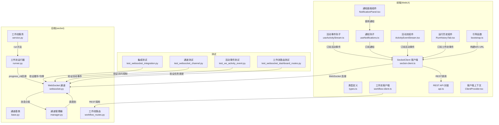
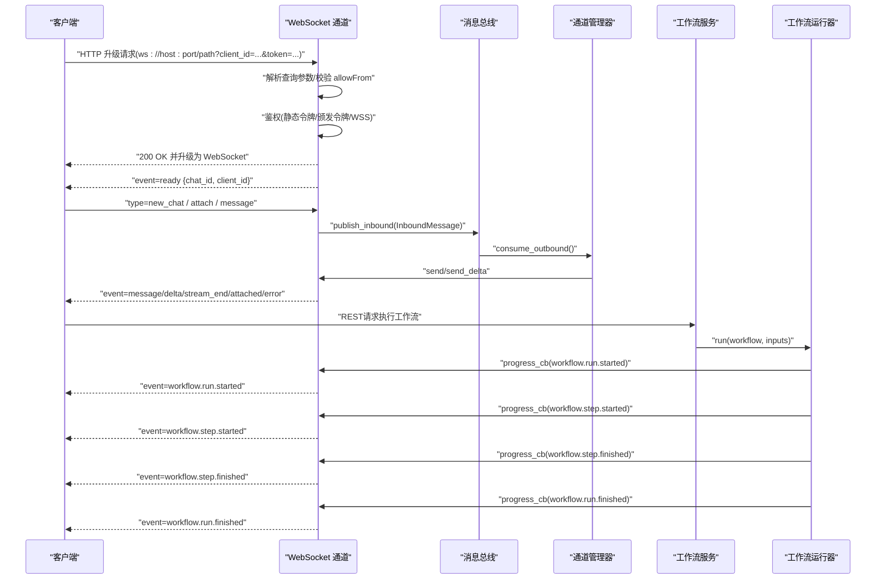
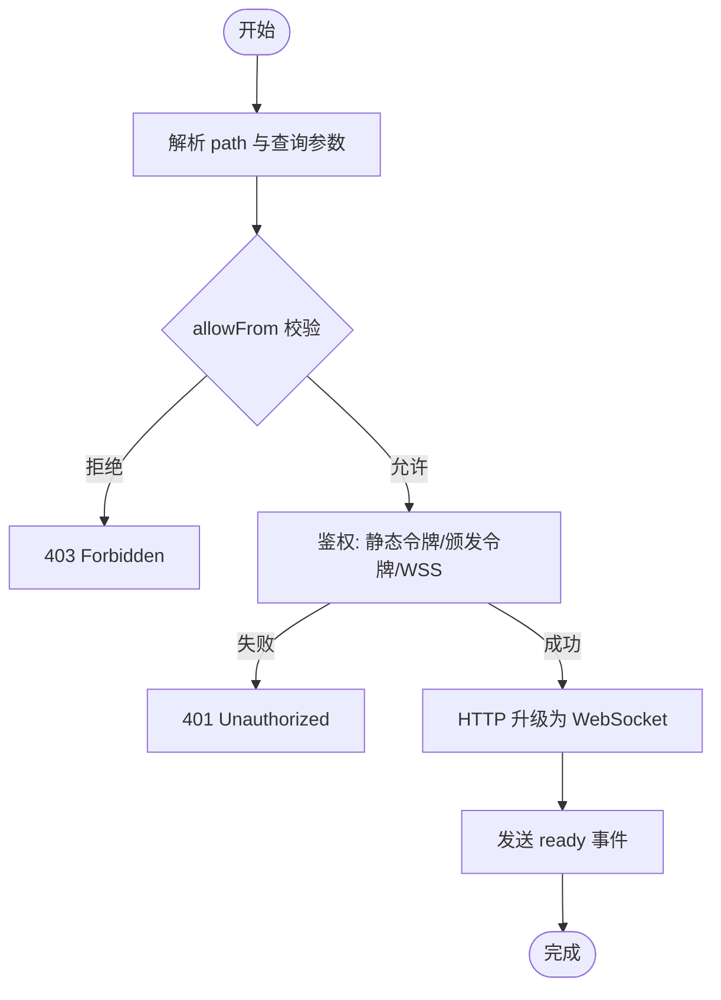
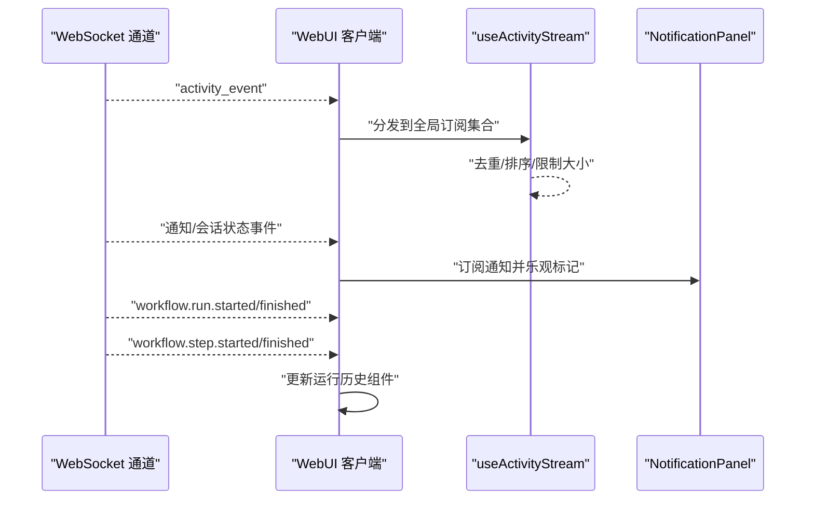
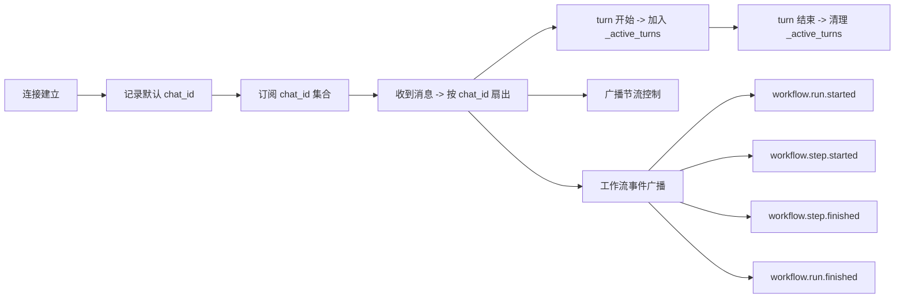
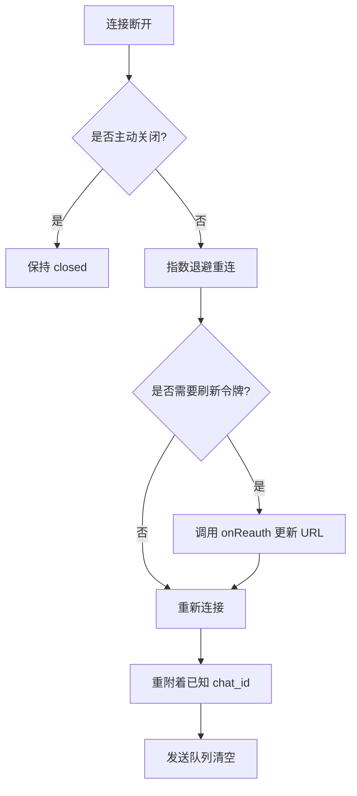
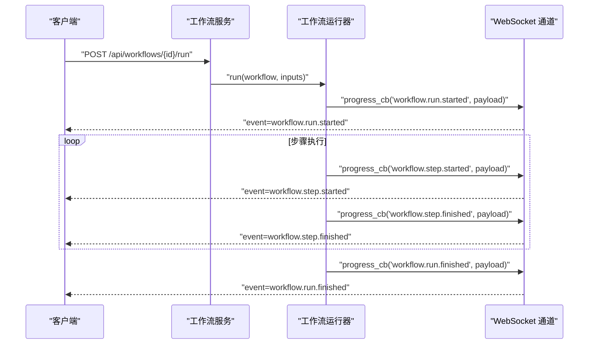
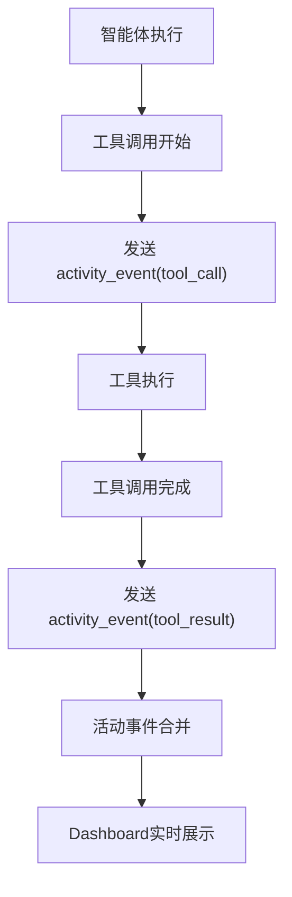
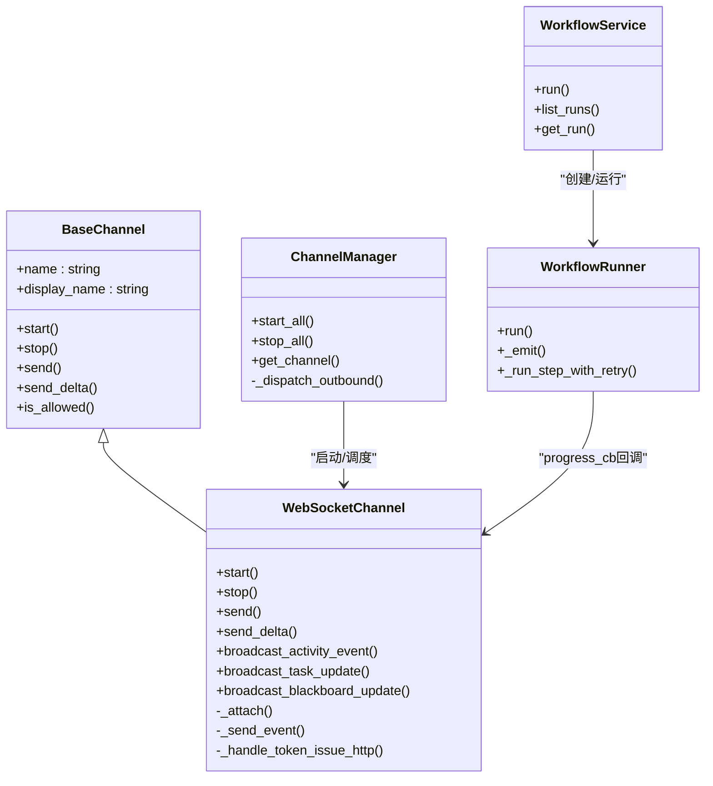

# WebSocket通信

<cite>
**本文档引用的文件**
- [websocket.md](file://docs/websocket.md)
- [websocket.py](file://secbot/channels/websocket.py)
- [base.py](file://secbot/channels/base.py)
- [manager.py](file://secbot/channels/manager.py)
- [runner.py](file://secbot/workflow/runner.py)
- [service.py](file://secbot/workflow/service.py)
- [workflow_routes.py](file://secbot/api/workflow_routes.py)
- [bootstrap.ts](file://webui/src/lib/bootstrap.ts)
- [workflow-client.ts](file://webui/src/lib/workflow-client.ts)
- [secbot-client.ts](file://webui/src/lib/secbot-client.ts)
- [types.ts](file://webui/src/lib/types.ts)
- [useActivityStream.ts](file://webui/src/hooks/useActivityStream.ts)
- [useNotifications.ts](file://webui/src/hooks/useNotifications.ts)
- [NotificationPanel.tsx](file://webui/src/components/NotificationPanel.tsx)
- [ActivityEventStream.tsx](file://webui/src/components/ActivityEventStream.tsx)
- [RunHistoryTab.tsx](file://webui/src/components/workflow/RunHistoryTab.tsx)
- [api.ts](file://webui/src/lib/api.ts)
- [ClientProvider.tsx](file://webui/src/providers/ClientProvider.tsx)
- [test_websocket_integration.py](file://tests/channels/test_websocket_integration.py)
- [test_websocket_channel.py](file://tests/channels/test_websocket_channel.py)
- [test_ws_activity_event.py](file://tests/channels/test_ws_activity_event.py)
- [test_websocket_dashboard_routes.py](file://tests/channels/test_websocket_dashboard_routes.py)
</cite>

## 更新摘要
**所做更改**
- 新增工作流执行实时通信章节，详细说明workflow.run.*和workflow.step.*事件
- 增强活动事件流章节，包含工作流执行状态更新
- 更新WebSocket频道管理章节，增加工作流事件广播机制
- 新增工作流客户端集成章节，说明REST与WebSocket事件的协同
- 更新故障排查指南，增加工作流相关问题诊断

## 目录
1. [简介](#简介)
2. [项目结构](#项目结构)
3. [核心组件](#核心组件)
4. [架构总览](#架构总览)
5. [详细组件分析](#详细组件分析)
6. [工作流执行实时通信](#工作流执行实时通信)
7. [活动事件流增强](#活动事件流增强)
8. [依赖关系分析](#依赖关系分析)
9. [性能考量](#性能考量)
10. [故障排查指南](#故障排查指南)
11. [结论](#结论)
12. [附录](#附录)

## 简介
本文件为 VAPT3 的 WebSocket 通信系统提供完整协议与实现文档，覆盖连接建立、握手与认证、消息格式、实时推送、频道管理、客户端示例、错误与重连、心跳与超时、工作流执行实时通信以及在 WebUI 中的应用场景（实时聊天、任务状态更新、通知推送、工作流执行状态跟踪）。内容基于仓库中的官方文档与源码实现进行提炼与可视化呈现。

## 项目结构
WebSocket 服务端位于 secbot 后端通道模块，前端 WebUI 通过 TypeScript 客户端与后端交互；测试用例验证握手、令牌发放与访问控制等关键流程。新增的工作流执行实时通信功能通过WorkflowService的progress_cb回调机制实现。



**图表来源**
- [websocket.py:1-2532](file://secbot/channels/websocket.py#L1-L2532)
- [runner.py:1-313](file://secbot/workflow/runner.py#L1-L313)
- [service.py:1-290](file://secbot/workflow/service.py#L1-L290)
- [workflow_routes.py:1-525](file://secbot/api/workflow_routes.py#L1-L525)
- [bootstrap.ts:60-99](file://webui/src/lib/bootstrap.ts#L60-L99)
- [workflow-client.ts:1-499](file://webui/src/lib/workflow-client.ts#L1-L499)
- [secbot-client.ts:1-377](file://webui/src/lib/secbot-client.ts#L1-L377)
- [types.ts:1-306](file://webui/src/lib/types.ts#L1-L306)
- [useActivityStream.ts:1-198](file://webui/src/hooks/useActivityStream.ts#L1-L198)
- [useNotifications.ts:1-180](file://webui/src/hooks/useNotifications.ts#L1-L180)
- [NotificationPanel.tsx:1-215](file://webui/src/components/NotificationPanel.tsx#L1-L215)
- [ActivityEventStream.tsx:1-281](file://webui/src/components/ActivityEventStream.tsx#L1-L281)
- [RunHistoryTab.tsx:1-325](file://webui/src/components/workflow/RunHistoryTab.tsx#L1-L325)
- [api.ts:1-272](file://webui/src/lib/api.ts#L1-L272)
- [ClientProvider.tsx:1-58](file://webui/src/providers/ClientProvider.tsx#L1-L58)

**章节来源**
- [websocket.py:1-2532](file://secbot/channels/websocket.py#L1-L2532)
- [websocket.md:1-397](file://docs/websocket.md#L1-L397)

## 核心组件
- WebSocket 通道：作为 WebSocket 服务器，负责握手、鉴权、多聊天并发、消息广播与媒体签名链接生成，现支持工作流执行事件广播。
- 通道基类：统一接口与权限校验（allowFrom）、流式发送能力开关。
- 通道管理器：启动/停止通道、出站消息分发、重试与去重合并。
- 工作流运行器：执行工作流步骤，通过progress_cb回调向WebSocket通道发送实时状态更新。
- 工作流服务：协调工作流CRUD操作，将progress_cb回调注入运行器。
- WebUI 客户端：单连接多聊天复用、自动重连、队列化发送、事件分发，支持工作流事件订阅。
- 钩子与组件：活动事件流、通知中心、通知面板、运行历史等 UI 实时更新。

**章节来源**
- [websocket.py:474-816](file://secbot/channels/websocket.py#L474-L816)
- [runner.py:29-35](file://secbot/workflow/runner.py#L29-L35)
- [service.py:68-79](file://secbot/workflow/service.py#L68-L79)
- [base.py:15-201](file://secbot/channels/base.py#L15-L201)
- [manager.py:43-126](file://secbot/channels/manager.py#L43-L126)
- [secbot-client.ts:59-377](file://webui/src/lib/secbot-client.ts#L59-L377)
- [types.ts:141-208](file://webui/src/lib/types.ts#L141-L208)

## 架构总览
WebSocket 通道在启动时绑定监听地址与路径，支持静态令牌或颁发令牌两种鉴权方式，并对 client_id 进行 allowFrom 白名单校验。握手成功后向客户端发送 ready 事件并分配默认 chat_id；客户端可发起 new_chat/attach/message 等 typed envelope，服务端按 chat_id 扇出到订阅连接。工作流执行过程中，WorkflowRunner通过progress_cb回调触发workflow.run.*和workflow.step.*事件的广播，实现工作流执行状态的实时跟踪。



**图表来源**
- [websocket.py:657-795](file://secbot/channels/websocket.py#L657-L795)
- [websocket.py:827-899](file://secbot/channels/websocket.py#L827-L899)
- [runner.py:111-158](file://secbot/workflow/runner.py#L111-L158)
- [service.py:171-183](file://secbot/workflow/service.py#L171-L183)
- [manager.py:278-424](file://secbot/channels/manager.py#L278-L424)
- [websocket.md:69-166](file://docs/websocket.md#L69-L166)

## 详细组件分析

### WebSocket 连接与握手
- 连接 URL：ws://host:port/path?client_id=...&token=...
- 握手阶段：
  - 解析 path 与查询参数，校验 allowFrom；
  - 鉴权：静态令牌或颁发令牌（token_issue_path），支持 WSS；
  - 成功后返回 ready 事件并分配默认 chat_id。
- 访问控制：allowFrom 支持通配符与精确匹配；空列表拒绝所有。



**图表来源**
- [websocket.py:780-786](file://secbot/channels/websocket.py#L780-L786)
- [websocket.py:631-653](file://secbot/channels/websocket.py#L631-L653)
- [websocket.md:69-80](file://docs/websocket.md#L69-L80)

**章节来源**
- [websocket.py:657-795](file://secbot/channels/websocket.py#L657-L795)
- [websocket.md:69-80](file://docs/websocket.md#L69-L80)
- [test_websocket_channel.py:884-899](file://tests/channels/test_websocket_channel.py#L884-L899)

### 认证机制
- 静态令牌：配置项 token，查询参数 token 匹配；
- 颁发令牌：开启 token_issue_path 与 token_issue_secret，通过 HTTP GET 获取一次性短命令牌；
- API 令牌：用于嵌入式 WebUI 的 REST 表面，多用、带 TTL；
- 安全边界：chat_id 为能力码，持有者可附加到任意对话；建议按用户命名空间隔离。

**章节来源**
- [websocket.py:631-653](file://secbot/channels/websocket.py#L631-L653)
- [websocket.py:798-816](file://secbot/channels/websocket.py#L798-L816)
- [websocket.md:217-268](file://docs/websocket.md#L217-L268)

### 消息格式规范
- 服务器下发事件：
  - ready：连接就绪，携带默认 chat_id 与 client_id；
  - message：完整回复，含文本、可选媒体路径数组；
  - delta：流式文本片段；
  - stream_end：流结束；
  - attached：订阅新/已有 chat_id 成功；
  - error：软错误（保持连接）；
  - workflow.run.started：工作流开始执行；
  - workflow.step.started：工作流步骤开始；
  - workflow.step.finished：工作流步骤完成；
  - workflow.run.finished：工作流执行结束；
  - workflow.run.failed：工作流执行失败；
  - workflow.run.cancelled：工作流手动取消；
  - workflow.schedule.updated：工作流调度更新；
  - activity_event：智能体活动事件（思考/工具调用/结果）。
- 客户端上行帧：
  - 兼容旧版：纯文本或 {"content"/"text"/"message": "..."}；
  - typed envelope：type=new_chat/attach/message，携带 chat_id/content/media 等。

```mermaid
classDiagram
class InboundEvent {
+event : "ready"|"message"|"delta"|"stream_end"|"attached"|"error"
+"workflow.run.started"|"workflow.step.started"|"workflow.step.finished"
+"workflow.run.finished"|"workflow.run.failed"|"workflow.run.cancelled"
+"workflow.schedule.updated"|"activity_event"
+chat_id : string
+client_id? : string
+text? : string
+media? : string[]
+media_urls? : [{url,name}]
+buttons? : string[][]
+button_prompt? : string
+kind? : "tool_hint"|"progress"
+stream_id? : string
+active_turn? : boolean
+runId? : string
+workflowId? : string
+stepId? : string
+status? : string
+durationMs? : number
+error? : string
+category? : string
+agent? : string
+step? : string
+timestamp? : string
}
class Outbound {
+type : "new_chat"|"attach"|"message"|"stop"
+chat_id : string
+content : string
+media? : OutboundMedia[]
+webui? : true
}
class OutboundMedia {
+data_url : string
+name? : string
}
InboundEvent <.. Outbound : "路由/订阅"
```

**图表来源**
- [types.ts:141-208](file://webui/src/lib/types.ts#L141-L208)
- [websocket.md:84-166](file://docs/websocket.md#L84-L166)

**章节来源**
- [websocket.md:84-166](file://docs/websocket.md#L84-L166)
- [types.ts:141-208](file://webui/src/lib/types.ts#L141-L208)

### 实时消息推送机制
- 多聊天复用：单连接可订阅多个 chat_id，服务端按 chat_id 扇出；
- 活动事件流：全局 activity_event 广播，WebUI 组件订阅并合并 REST 种子；
- 通知中心：REST 列表与标记接口，配合乐观更新与后台同步；
- 会话状态变化：turn_end/session_updated 等事件驱动 UI 状态刷新；
- 工作流执行状态：workflow.run.* 和 workflow.step.* 事件实现实时跟踪。



**图表来源**
- [secbot-client.ts:274-303](file://webui/src/lib/secbot-client.ts#L274-L303)
- [useActivityStream.ts:123-198](file://webui/src/hooks/useActivityStream.ts#L123-L198)
- [NotificationPanel.tsx:52-215](file://webui/src/components/NotificationPanel.tsx#L52-L215)

**章节来源**
- [secbot-client.ts:141-153](file://webui/src/lib/secbot-client.ts#L141-L153)
- [useActivityStream.ts:123-198](file://webui/src/hooks/useActivityStream.ts#L123-L198)
- [useNotifications.ts:70-180](file://webui/src/hooks/useNotifications.ts#L70-L180)

### WebSocket 频道管理
- 订阅维护：chat_id -> connections 与 connection -> chat_ids 双向映射；
- 默认 chat_id：ready 事件返回的默认会话；
- 主动 turn 状态：_active_turns 用于渲染"停止"按钮；
- 广播节流：每事件/作用域最小间隔 1 秒；
- 媒体签名：process-local 密钥签发短期可访问 URL；
- 工作流事件广播：支持workflow.run.*和workflow.step.*事件的全局或作用域广播。



**图表来源**
- [websocket.py:505-530](file://secbot/channels/websocket.py#L505-L530)
- [websocket.py:518-519](file://secbot/channels/websocket.py#L518-L519)
- [websocket.py:528-530](file://secbot/channels/websocket.py#L528-L530)
- [websocket.py:1788-1817](file://secbot/channels/websocket.py#L1788-L1817)

**章节来源**
- [websocket.py:505-530](file://secbot/channels/websocket.py#L505-L530)
- [websocket.py:518-519](file://secbot/channels/websocket.py#L518-L519)

### 客户端连接示例
- JavaScript（浏览器/Node）：使用标准 WebSocket API，连接 URL 含 client_id 与 token 查询参数；参考官方文档示例。
- Python：使用 websockets 库，连接后接收 ready，随后发送消息并接收增量/完整响应。
- WebUI 客户端：封装了连接、重连、队列化发送、按 chat_id 分发、活动事件与通知订阅，支持工作流事件订阅。

**章节来源**
- [websocket.md:49-67](file://docs/websocket.md#L49-L67)
- [secbot-client.ts:155-181](file://webui/src/lib/secbot-client.ts#L155-L181)

### 错误处理与重连机制
- 传输层错误：捕获 onerror/onclose，区分 1009（消息过大）等；
- 自动重连：指数退避（上限可配置），支持 onReauth 刷新令牌；
- 发送队列：未连接时缓存帧，连接恢复后顺序发送；
- 软错误：服务端返回 error 事件不中断连接。



**图表来源**
- [secbot-client.ts:305-357](file://webui/src/lib/secbot-client.ts#L305-L357)
- [websocket.md:137-142](file://docs/websocket.md#L137-L142)

**章节来源**
- [secbot-client.ts:305-357](file://webui/src/lib/secbot-client.ts#L305-L357)
- [websocket.md:137-142](file://docs/websocket.md#L137-L142)

### 心跳与超时
- 心跳间隔与超时：由配置项 ping_interval_s 与 ping_timeout_s 控制；
- 服务端：维持连接活跃，超时则关闭；
- 客户端：感知 onclose 并触发重连策略。

**章节来源**
- [websocket.py:155-156](file://secbot/channels/websocket.py#L155-L156)
- [websocket.md:203-209](file://docs/websocket.md#L203-L209)

### 在 WebUI 中的应用场景
- 实时聊天：多聊天并发、增量流式显示、停止当前轮次；
- 任务状态更新：turn_end/session_updated 事件驱动 UI 刷新；
- 通知推送：REST 通知列表与标记接口，配合乐观更新；
- 活动事件流：全局活动事件广播，合并 REST 种子，滚动展示；
- 工作流执行跟踪：workflow.run.*和workflow.step.*事件实现实时状态更新。

**章节来源**
- [ActivityEventStream.tsx:236-281](file://webui/src/components/ActivityEventStream.tsx#L236-L281)
- [NotificationPanel.tsx:52-215](file://webui/src/components/NotificationPanel.tsx#L52-L215)
- [useActivityStream.ts:123-198](file://webui/src/hooks/useActivityStream.ts#L123-L198)
- [useNotifications.ts:70-180](file://webui/src/hooks/useNotifications.ts#L70-L180)

### 调试与监控
- 浏览器开发者工具：Network 面板查看 WebSocket 升级与帧；
- 日志：服务端使用 loguru 输出握手、鉴权、令牌发放与清理日志；
- 测试：集成测试覆盖静态令牌拒绝、颁发令牌全流程、allowFrom 拒绝等。

**章节来源**
- [websocket.py:631-653](file://secbot/channels/websocket.py#L631-L653)
- [test_websocket_integration.py:356-393](file://tests/channels/test_websocket_integration.py#L356-L393)
- [test_websocket_channel.py:858-899](file://tests/channels/test_websocket_channel.py#L858-L899)

## 工作流执行实时通信

### 工作流事件生命周期
工作流执行过程中的实时通信通过WorkflowRunner的progress_cb回调机制实现，确保每个执行阶段都能及时推送到WebSocket客户端。



**图表来源**
- [runner.py:111-158](file://secbot/workflow/runner.py#L111-L158)
- [runner.py:235-244](file://secbot/workflow/runner.py#L235-L244)
- [service.py:171-183](file://secbot/workflow/service.py#L171-L183)

### 工作流事件类型与负载
- workflow.run.started：工作流开始执行，包含runId、workflowId、inputs等信息
- workflow.step.started：工作流步骤开始，包含runId、stepId、name等信息
- workflow.step.finished：工作流步骤完成，包含status、durationMs、output等信息
- workflow.run.finished：工作流执行结束，包含status、durationMs等信息
- workflow.run.failed：工作流执行失败，包含error信息
- workflow.run.cancelled：工作流手动取消，包含runId
- workflow.schedule.updated：工作流调度更新，包含nextRunAtMs

**章节来源**
- [runner.py:111-158](file://secbot/workflow/runner.py#L111-L158)
- [runner.py:291-312](file://secbot/workflow/runner.py#L291-L312)
- [websocket.md:313-324](file://docs/websocket.md#L313-L324)

### WebSocket 事件广播实现
WebSocket通道通过broadcast_activity_event方法实现工作流事件的广播，支持按chat_id作用域或全局广播。

**章节来源**
- [websocket.py:1788-1817](file://secbot/channels/websocket.py#L1788-L1817)
- [websocket.py:1819-1838](file://secbot/channels/websocket.py#L1819-L1838)

### WebUI 工作流事件处理
WebUI客户端通过SecbotClient的onActivityEvent方法订阅工作流事件，实现运行历史的实时更新。

**章节来源**
- [secbot-client.ts:141-153](file://webui/src/lib/secbot-client.ts#L141-L153)
- [RunHistoryTab.tsx:23-80](file://webui/src/components/workflow/RunHistoryTab.tsx#L23-L80)

## 活动事件流增强

### 智能体活动事件
活动事件流现在包含工作流执行过程中的智能体活动，通过activity_event事件实现近实时的可视化展示。



**图表来源**
- [websocket.py:1788-1817](file://secbot/channels/websocket.py#L1788-L1817)
- [useActivityStream.ts:123-198](file://webui/src/hooks/useActivityStream.ts#L123-L198)

### 活动事件数据结构
- category：事件类别（tool_call、tool_result、thought等）
- agent：执行智能体名称
- step：步骤标识
- chat_id：对话ID
- duration_ms：执行持续时间
- timestamp：事件时间戳

**章节来源**
- [websocket.py:1788-1817](file://secbot/channels/websocket.py#L1788-L1817)
- [useActivityStream.ts:89-104](file://webui/src/hooks/useActivityStream.ts#L89-L104)

### 事件节流与性能优化
活动事件采用每事件/作用域最小间隔1秒的节流策略，避免UI抖动与后端压力，同时保证实时性。

**章节来源**
- [websocket.py:1805-1806](file://secbot/channels/websocket.py#L1805-L1806)
- [websocket.py:1745-1764](file://secbot/channels/websocket.py#L1745-L1764)

## 依赖关系分析
- 通道管理器负责启动通道、出站消息分发与重试；
- WebSocket 通道继承自 BaseChannel，实现 start/stop/send/send_delta；
- 工作流服务通过progress_cb回调将工作流执行状态推送到WebSocket通道；
- WebUI 客户端依赖类型定义与 REST API 封装，提供订阅与状态管理。



**图表来源**
- [base.py:15-201](file://secbot/channels/base.py#L15-L201)
- [websocket.py:474-816](file://secbot/channels/websocket.py#L474-L816)
- [manager.py:43-126](file://secbot/channels/manager.py#L43-L126)
- [runner.py:71-91](file://secbot/workflow/runner.py#L71-L91)
- [service.py:57-79](file://secbot/workflow/service.py#L57-L79)

**章节来源**
- [base.py:15-201](file://secbot/channels/base.py#L15-L201)
- [websocket.py:474-816](file://secbot/channels/websocket.py#L474-L816)
- [manager.py:43-126](file://secbot/channels/manager.py#L43-L126)
- [runner.py:71-91](file://secbot/workflow/runner.py#L71-L91)
- [service.py:57-79](file://secbot/workflow/service.py#L57-L79)

## 性能考量
- 流式传输：启用 streaming 时，delta+stream_end 减少 RTT 与内存峰值；
- 去重与合并：通道管理器对连续 _stream_delta 合并，降低上游压力；
- 广播节流：每事件/作用域最小间隔 1 秒，避免 UI 抖动与后端压力；
- 媒体限制：服务端对单消息图片/视频数量与大小限制，防止资源滥用；
- 最大消息字节数：默认约 36MB，可根据部署场景调整；
- 工作流事件节流：活动事件采用1秒节流策略，确保实时性同时控制负载。

**章节来源**
- [websocket.py:320-342](file://secbot/channels/websocket.py#L320-L342)
- [websocket.py:154-155](file://secbot/channels/websocket.py#L154-L155)
- [manager.py:345-394](file://secbot/channels/manager.py#L345-L394)
- [websocket.py:1805-1806](file://secbot/channels/websocket.py#L1805-L1806)

## 故障排查指南
- 握手失败（401/403）：检查 token 是否正确、allowFrom 是否包含 client_id、WSS 证书配置；
- 颁发令牌失败（401/429）：确认 token_issue_secret、容量上限（10000）；
- 连接断开：观察 onclose 代码，1009 表示消息过大；检查 maxMessageBytes；
- 重连无效：确认 onReauth 返回新 URL，maxBackoffMs 设置合理；
- 活动事件/通知不刷新：确认订阅已建立且未被异常处理器吞没；
- 工作流事件丢失：检查WorkflowService的progress_cb回调是否正确注入；
- 工作流执行状态不同步：确认WebSocket通道的事件广播逻辑正常。

**章节来源**
- [websocket.py:631-653](file://secbot/channels/websocket.py#L631-L653)
- [websocket.py:798-816](file://secbot/channels/websocket.py#L798-L816)
- [test_websocket_integration.py:356-393](file://tests/channels/test_websocket_integration.py#L356-L393)
- [test_websocket_channel.py:858-899](file://tests/channels/test_websocket_channel.py#L858-L899)
- [secbot-client.ts:305-357](file://webui/src/lib/secbot-client.ts#L305-L357)
- [test_ws_activity_event.py:277-299](file://tests/channels/test_ws_activity_event.py#L277-L299)

## 结论
VAPT3 的 WebSocket 通信体系以"单连接多聊天"为核心，结合严格的鉴权与访问控制、可靠的自动重连与节流策略、完善的 WebUI 实时体验，实现了从聊天到任务状态、从通知到活动事件的全链路实时交互。新增的工作流执行实时通信能力通过progress_cb回调机制，实现了工作流执行状态的近实时跟踪，为用户提供了完整的执行过程可视化体验。生产部署建议启用颁发令牌与 WSS，并根据业务场景调整消息大小与流式策略。

## 附录
- 配置参考与示例：见官方文档"配置参考"与"常见模式"章节；
- REST 接口：会话列表、设置、命令、报告、仪表盘聚合、通知与活动事件流等；
- 客户端实现要点：多聊天 attach/new_chat、增量流式处理、错误与重连策略；
- 工作流事件规范：workflow.run.*和workflow.step.*事件的详细规范与负载结构。

**章节来源**
- [websocket.md:167-397](file://docs/websocket.md#L167-L397)
- [api.ts:19-272](file://webui/src/lib/api.ts#L19-L272)
- [workflow-client.ts:1-499](file://webui/src/lib/workflow-client.ts#L1-499)
- [bootstrap.ts:60-99](file://webui/src/lib/bootstrap.ts#L60-L99)