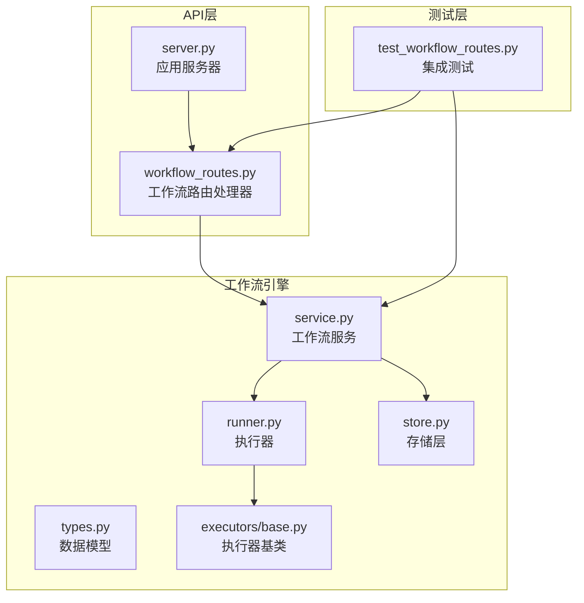
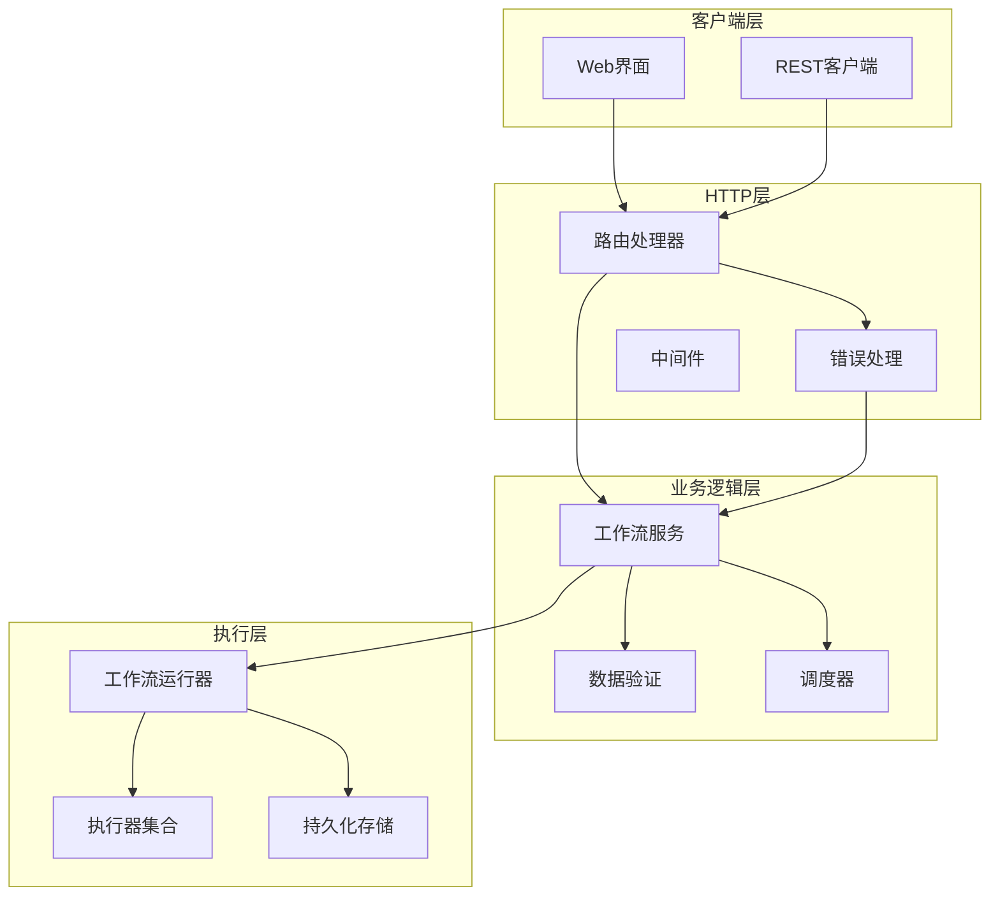
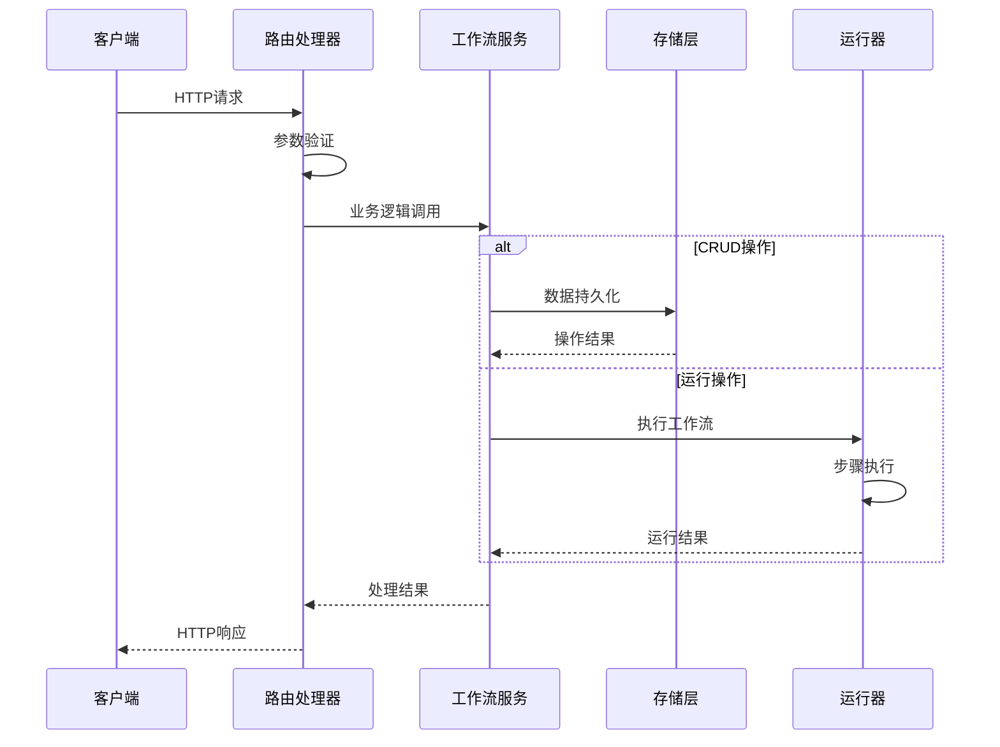
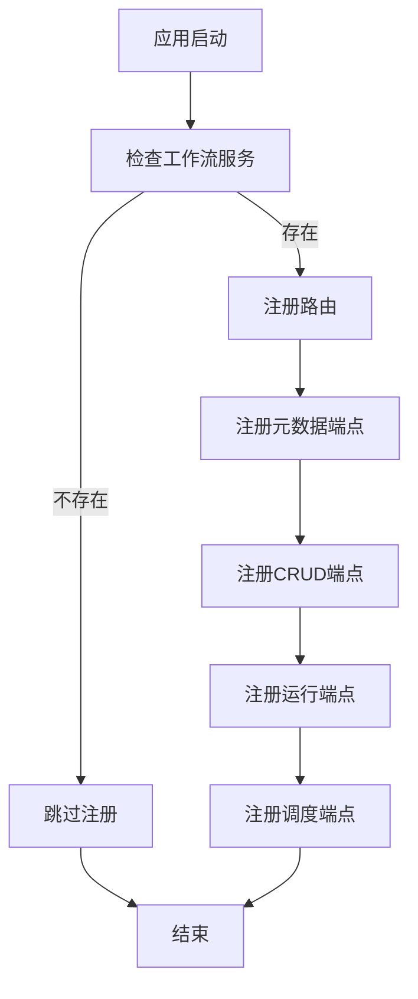
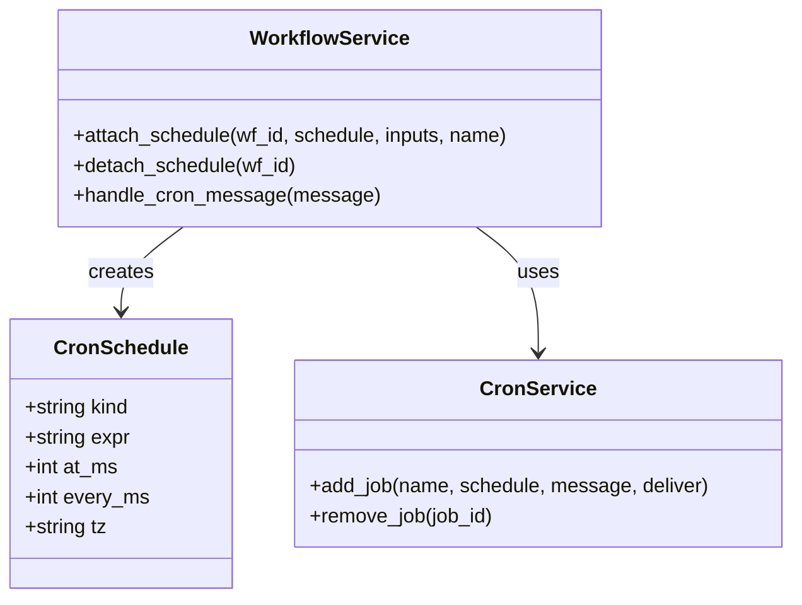
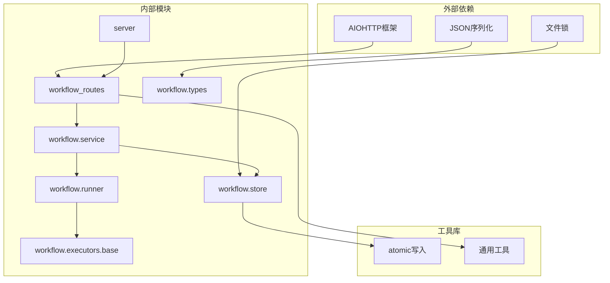
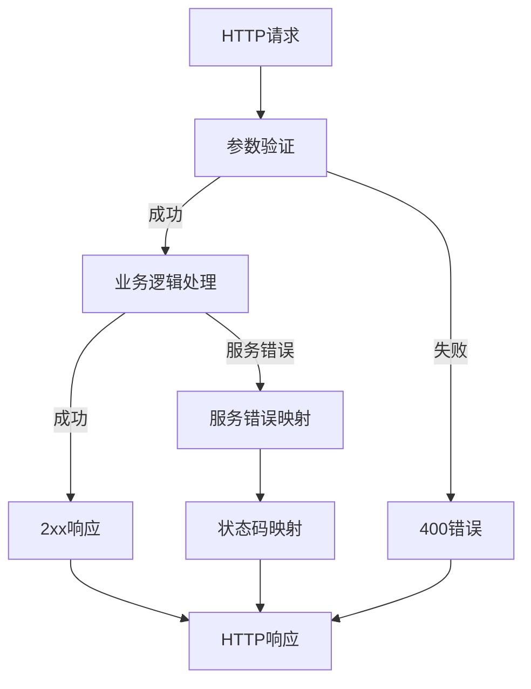

# 工作流API路由

<cite>
**本文档引用的文件**
- [workflow_routes.py](file://secbot/api/workflow_routes.py)
- [server.py](file://secbot/api/server.py)
- [types.py](file://secbot/workflow/types.py)
- [service.py](file://secbot/workflow/service.py)
- [runner.py](file://secbot/workflow/runner.py)
- [store.py](file://secbot/workflow/store.py)
- [base.py](file://secbot/workflow/executors/base.py)
- [test_workflow_routes.py](file://tests/api/test_workflow_routes.py)
- [workflow-client.ts](file://webui/src/lib/workflow-client.ts)
</cite>

## 目录
1. [简介](#简介)
2. [项目结构](#项目结构)
3. [核心组件](#核心组件)
4. [架构概览](#架构概览)
5. [详细组件分析](#详细组件分析)
6. [依赖关系分析](#依赖关系分析)
7. [性能考虑](#性能考虑)
8. [故障排除指南](#故障排除指南)
9. [结论](#结论)

## 简介

工作流API路由是SecBot平台的核心组件之一，负责提供REST接口来管理、执行和监控工作流。该系统允许用户创建复杂的工作流定义，配置自动化任务，并通过Web界面进行可视化编辑和管理。

工作流系统采用分层架构设计，将HTTP处理层与业务逻辑层分离，确保了代码的可维护性和扩展性。系统支持多种执行器类型（工具、脚本、代理、LLM），提供了灵活的任务编排能力。

## 项目结构

工作流API路由位于SecBot项目的API层中，主要包含以下关键文件：

**图表来源**
- [workflow_routes.py:1-525](file://secbot/api/workflow_routes.py#L1-L525)
- [server.py:1-509](file://secbot/api/server.py#L1-L509)

**章节来源**
- [workflow_routes.py:1-525](file://secbot/api/workflow_routes.py#L1-L525)
- [server.py:1-509](file://secbot/api/server.py#L1-L509)

## 核心组件

### 工作流路由处理器

工作流路由处理器是HTTP层的核心，负责处理所有与工作流相关的REST请求。它实现了完整的CRUD操作、运行控制和调度管理功能。

主要功能包括：
- **CRUD操作**：创建工作流、获取工作流详情、更新工作流、删除工作流
- **运行控制**：立即执行工作流、列出运行历史、获取特定运行详情
- **调度管理**：设置工作流调度、删除工作流调度
- **元数据查询**：获取可用工具列表、代理列表、模板列表

### 应用服务器

应用服务器负责创建和配置AIOHTTP应用程序实例，将工作流路由注册到应用程序中。它支持两种部署模式：

1. **主应用模式**：集成OpenAI兼容API和工作流服务
2. **独立工作流服务模式**：仅提供工作流相关API

### 数据模型

工作流系统使用强类型的数据模型来确保数据的一致性和完整性：

- **Workflow**：工作流定义，包含名称、描述、标签、输入参数和步骤
- **WorkflowRun**：工作流运行实例，跟踪执行状态和结果
- **WorkflowStep**：工作流步骤，定义执行的具体操作
- **StepResult**：步骤执行结果，包含输出、错误信息和时间戳

**章节来源**
- [workflow_routes.py:184-285](file://secbot/api/workflow_routes.py#L184-L285)
- [server.py:382-427](file://secbot/api/server.py#L382-L427)
- [types.py:78-275](file://secbot/workflow/types.py#L78-L275)

## 架构概览

工作流API路由采用分层架构设计，确保了关注点分离和代码的可维护性：

**图表来源**
- [workflow_routes.py:497-525](file://secbot/api/workflow_routes.py#L497-L525)
- [service.py:57-290](file://secbot/workflow/service.py#L57-L290)

### 请求处理流程

当客户端发送请求时，系统遵循以下处理流程：

**图表来源**
- [workflow_routes.py:210-273](file://secbot/api/workflow_routes.py#L210-L273)
- [service.py:171-183](file://secbot/workflow/service.py#L171-L183)

## 详细组件分析

### 路由注册机制

工作流路由通过`register_routes`函数统一注册，确保了路由的一致性和可维护性：

**图表来源**
- [workflow_routes.py:497-525](file://secbot/api/workflow_routes.py#L497-L525)

### CRUD操作实现

CRUD操作是工作流系统的基础功能，每个操作都经过精心设计以确保数据一致性和用户体验：

#### 创建工作流 (`POST /api/workflows`)
- 验证请求体格式
- 构建工作流对象
- 执行业务规则验证
- 保存到持久化存储
- 返回创建的工作流

#### 获取工作流 (`GET /api/workflows/{id}`)
- 从存储中检索工作流
- 处理未找到的情况
- 返回工作流详情

#### 更新工作流 (`PUT /api/workflows/{id}`)
- 获取现有工作流
- 应用变更到工作流
- 更新修改时间戳
- 保存更改

#### 删除工作流 (`DELETE /api/workflows/{id}`)
- 删除工作流定义
- 清理关联的调度任务
- 返回删除确认

**章节来源**
- [workflow_routes.py:210-285](file://secbot/api/workflow_routes.py#L210-L285)

### 运行控制功能

运行控制功能允许用户实时执行和监控工作流：

#### 立即运行 (`POST /api/workflows/{id}/run`)
- 验证输入参数
- 创建运行实例
- 执行工作流步骤
- 实时返回执行状态

#### 运行历史 (`GET /api/workflows/{id}/runs`)
- 支持分页和过滤
- 返回最近的运行记录
- 包含统计信息

#### 单次运行详情 (`GET /api/workflows/{id}/runs/{runId}`)
- 获取特定运行的完整信息
- 包含步骤执行详情

**章节来源**
- [workflow_routes.py:293-347](file://secbot/api/workflow_routes.py#L293-L347)

### 调度管理系统

调度系统支持多种调度模式，满足不同的自动化需求：

**图表来源**
- [workflow_routes.py:394-424](file://secbot/api/workflow_routes.py#L394-L424)
- [service.py:113-157](file://secbot/workflow/service.py#L113-L157)

### 元数据端点

元数据端点为工作流编辑器提供必要的上下文信息：

#### 工具列表 (`GET /api/workflows/_tools`)
- 返回可用工具的完整列表
- 包含输入输出模式定义
- 支持动态工具发现

#### 代理列表 (`GET /api/workflows/_agents`)
- 提供可用代理的规范信息
- 支持代理参数验证

#### 模板列表 (`GET /api/workflows/_templates`)
- 返回内置工作流模板
- 支持快速创建工作流

**章节来源**
- [workflow_routes.py:432-489](file://secbot/api/workflow_routes.py#L432-L489)

## 依赖关系分析

工作流API路由系统具有清晰的依赖层次结构：

**图表来源**
- [workflow_routes.py:25-33](file://secbot/api/workflow_routes.py#L25-L33)
- [store.py:23-26](file://secbot/workflow/store.py#L23-L26)

### 错误处理策略

系统采用统一的错误处理机制，确保错误信息的一致性和可理解性：

**图表来源**
- [workflow_routes.py:43-62](file://secbot/api/workflow_routes.py#L43-L62)

**章节来源**
- [workflow_routes.py:43-101](file://secbot/api/workflow_routes.py#L43-L101)

## 性能考虑

工作流API路由系统在设计时充分考虑了性能优化：

### 并发处理
- 使用文件锁确保并发安全
- 异步I/O操作提高吞吐量
- 进程间通信最小化

### 缓存策略
- 内存中的工作流缓存
- 文件系统级别的原子写入
- 运行历史的增量更新

### 资源管理
- 连接池管理
- 内存使用监控
- 超时控制机制

## 故障排除指南

### 常见问题诊断

#### 工作流服务未注册
当工作流服务未正确注册时，所有工作流相关API都会返回404错误。检查应用初始化代码中的服务注册部分。

#### JSON解析错误
如果遇到JSON解析错误，检查请求体格式是否正确，确保所有必需字段都已提供。

#### 权限问题
确保工作流存储目录具有适当的读写权限，特别是在多用户环境中。

### 调试技巧

使用以下方法进行调试：
- 启用详细的日志记录
- 检查文件锁状态
- 验证数据库连接
- 监控内存使用情况

**章节来源**
- [test_workflow_routes.py:498-505](file://tests/api/test_workflow_routes.py#L498-L505)

## 结论

工作流API路由系统展现了优秀的软件工程实践，通过清晰的分层架构、完善的错误处理机制和全面的测试覆盖，为用户提供了一个强大而可靠的工作流管理平台。

系统的模块化设计使得各个组件职责明确，易于维护和扩展。同时，异步编程模型和文件锁机制确保了在高并发场景下的稳定性和一致性。

未来可以考虑的改进方向包括：
- 添加更多的监控和指标收集
- 实现更细粒度的权限控制
- 增加工作流版本管理和回滚功能
- 优化大规模工作流的性能表现