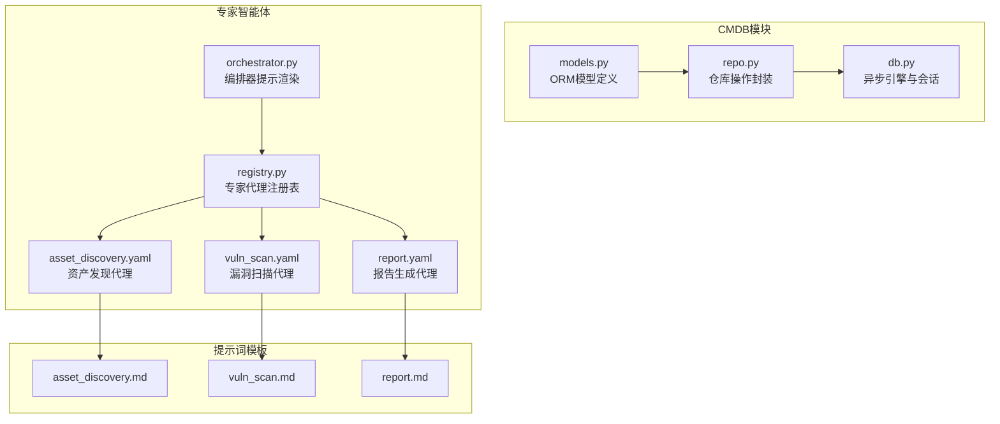
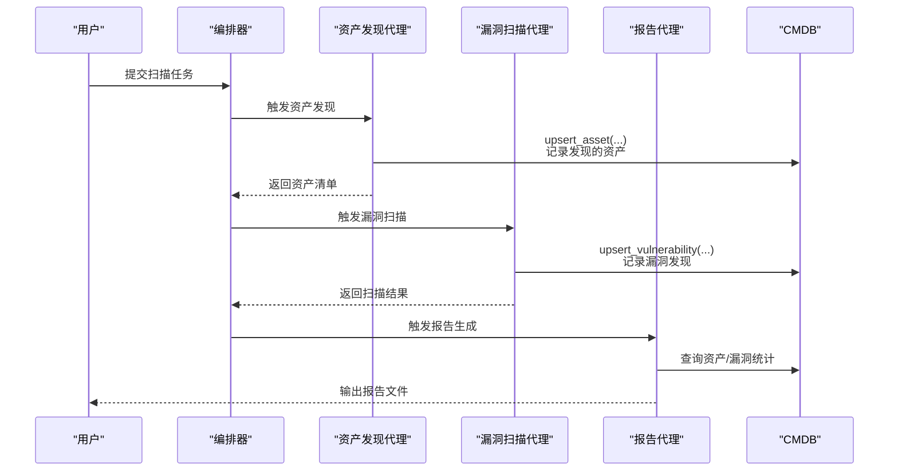
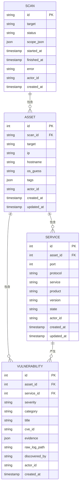
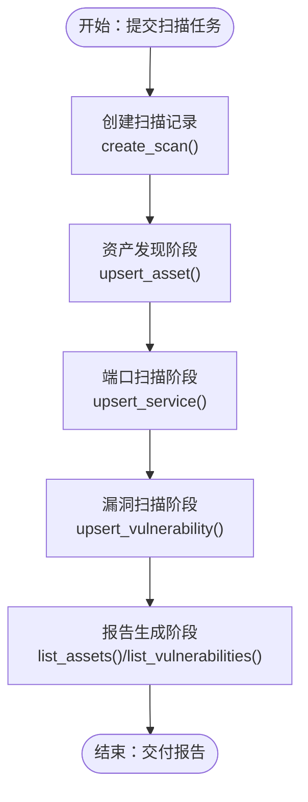
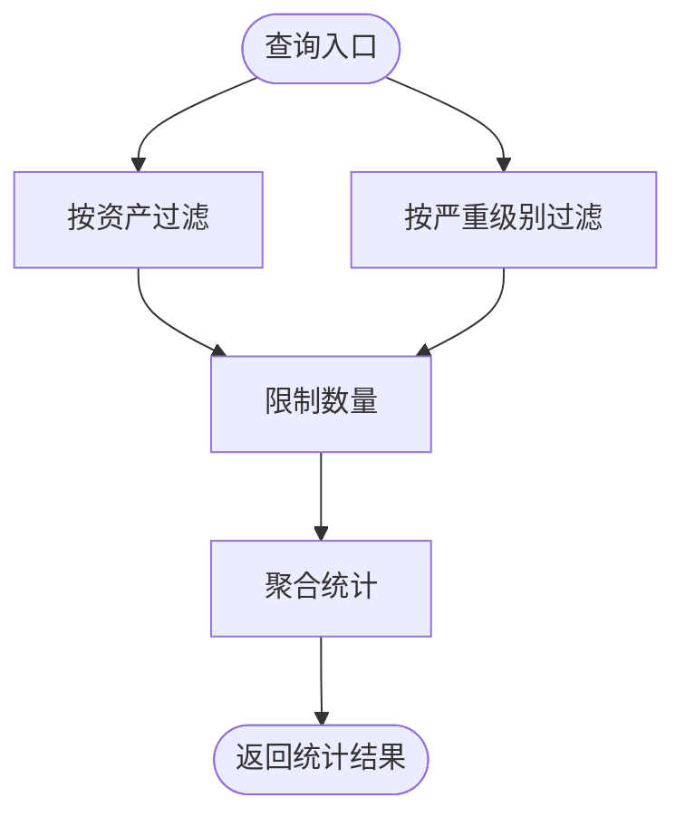
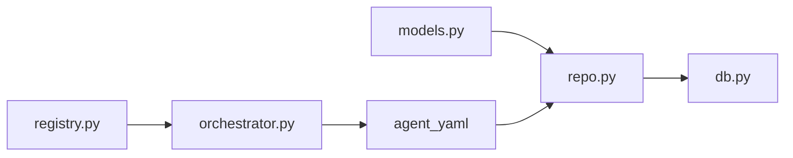

# CMDB系统集成

<cite>
**本文档引用的文件**
- [models.py](file://secbot/cmdb/models.py)
- [repo.py](file://secbot/cmdb/repo.py)
- [db.py](file://secbot/cmdb/db.py)
- [orchestrator.py](file://secbot/agents/orchestrator.py)
- [registry.py](file://secbot/agents/registry.py)
- [asset_discovery.yaml](file://secbot/agents/asset_discovery.yaml)
- [vuln_scan.yaml](file://secbot/agents/vuln_scan.yaml)
- [report.yaml](file://secbot/agents/report.yaml)
- [asset_discovery.md](file://secbot/agents/prompts/asset_discovery.md)
- [vuln_scan.md](file://secbot/agents/prompts/vuln_scan.md)
- [report.md](file://secbot/agents/prompts/report.md)
- [quick-start.md](file://docs/quick-start.md)
</cite>

## 目录
1. [简介](#简介)
2. [项目结构](#项目结构)
3. [核心组件](#核心组件)
4. [架构总览](#架构总览)
5. [详细组件分析](#详细组件分析)
6. [依赖关系分析](#依赖关系分析)
7. [性能考虑](#性能考虑)
8. [故障排查指南](#故障排查指南)
9. [结论](#结论)
10. [附录](#附录)

## 简介
本文件面向CMDB（配置管理数据库）与安全扫描流程的集成，系统性阐述以下内容：
- 资产发现、漏洞扫描与报告生成在CMDB中的数据流转过程
- CMDB在专家智能体系统中的角色与数据交互机制
- CMDB查询API的使用指南与集成示例（资产查询、漏洞统计、扫描状态管理）
- CMDB与其他系统模块的接口设计与数据同步策略
- 在VAPT（漏洞评估、渗透测试）自动化流程中的应用场景与最佳实践
- 系统集成的故障排查与性能优化建议

## 项目结构
本项目采用分层与功能模块化组织，CMDB相关代码集中在`secbot/cmdb`目录，安全扫描相关的专家智能体定义位于`secbot/agents`目录，提示词模板位于`secbot/agents/prompts`目录。

**图表来源**
- [models.py:1-178](file://secbot/cmdb/models.py#L1-L178)
- [repo.py:1-370](file://secbot/cmdb/repo.py#L1-L370)
- [db.py:1-133](file://secbot/cmdb/db.py#L1-L133)
- [orchestrator.py:1-70](file://secbot/agents/orchestrator.py#L1-L70)
- [registry.py:1-248](file://secbot/agents/registry.py#L1-L248)
- [asset_discovery.yaml:1-46](file://secbot/agents/asset_discovery.yaml#L1-L46)
- [vuln_scan.yaml:1-53](file://secbot/agents/vuln_scan.yaml#L1-L53)
- [report.yaml:1-39](file://secbot/agents/report.yaml#L1-L39)
- [asset_discovery.md](file://secbot/agents/prompts/asset_discovery.md)
- [vuln_scan.md](file://secbot/agents/prompts/vuln_scan.md)
- [report.md](file://secbot/agents/prompts/report.md)

**章节来源**
- [models.py:1-178](file://secbot/cmdb/models.py#L1-L178)
- [repo.py:1-370](file://secbot/cmdb/repo.py#L1-L370)
- [db.py:1-133](file://secbot/cmdb/db.py#L1-L133)
- [orchestrator.py:1-70](file://secbot/agents/orchestrator.py#L1-L70)
- [registry.py:1-248](file://secbot/agents/registry.py#L1-L248)
- [asset_discovery.yaml:1-46](file://secbot/agents/asset_discovery.yaml#L1-L46)
- [vuln_scan.yaml:1-53](file://secbot/agents/vuln_scan.yaml#L1-L53)
- [report.yaml:1-39](file://secbot/agents/report.yaml#L1-L39)

## 核心组件
- CMDB ORM模型：定义扫描、资产、服务、漏洞等实体及其关系与索引约束，确保多租户隔离与可扩展性。
- 仓库操作封装：提供异步事务内读写能力，统一执行插入/更新（upsert）、列表查询、状态变更等操作。
- 异步数据库引擎：基于SQLite + aiosqlite，启用WAL模式提升并发读写稳定性。
- 专家智能体注册表与编排器：定义专家代理的能力边界、输入输出规范与工具表面，确保扫描流程的有序执行。

**章节来源**
- [models.py:34-178](file://secbot/cmdb/models.py#L34-L178)
- [repo.py:68-370](file://secbot/cmdb/repo.py#L68-L370)
- [db.py:64-133](file://secbot/cmdb/db.py#L64-L133)
- [registry.py:37-92](file://secbot/agents/registry.py#L37-L92)
- [orchestrator.py:17-70](file://secbot/agents/orchestrator.py#L17-L70)

## 架构总览
CMDB作为安全扫描流程的数据中枢，贯穿资产发现、端口扫描、漏洞扫描、弱口令检测与报告生成的全生命周期。专家智能体通过编排器按序调用，所有结果持久化至CMDB，最终由报告代理从CMDB抽取数据生成交付物。

**图表来源**
- [orchestrator.py:22-40](file://secbot/agents/orchestrator.py#L22-L40)
- [asset_discovery.yaml:11-17](file://secbot/agents/asset_discovery.yaml#L11-L17)
- [vuln_scan.yaml:10-13](file://secbot/agents/vuln_scan.yaml#L10-L13)
- [report.yaml:10-14](file://secbot/agents/report.yaml#L10-L14)
- [repo.py:141-189](file://secbot/cmdb/repo.py#L141-L189)
- [repo.py:281-348](file://secbot/cmdb/repo.py#L281-L348)

## 详细组件分析

### CMDB数据模型与关系
CMDB采用四张核心表：扫描、资产、服务、漏洞，通过外键建立层次化关系，支持按租户隔离与高效查询。

**图表来源**
- [models.py:38-171](file://secbot/cmdb/models.py#L38-L171)

**章节来源**
- [models.py:38-178](file://secbot/cmdb/models.py#L38-L178)

### CMDB仓库操作API
仓库层提供统一的异步API，覆盖扫描、资产、服务、漏洞的增删改查与状态管理，保证幂等性与一致性。

- 扫描管理
  - 创建扫描：[create_scan:68-85](file://secbot/cmdb/repo.py#L68-L85)
  - 查询扫描：[get_scan:88-90](file://secbot/cmdb/repo.py#L88-L90)
  - 列出扫描：[list_scans:93-106](file://secbot/cmdb/repo.py#L93-L106)
  - 更新状态：[update_scan_status:109-133](file://secbot/cmdb/repo.py#L109-L133)

- 资产管理
  - 插入/更新资产：[upsert_asset:141-189](file://secbot/cmdb/repo.py#L141-L189)
  - 列出资产：[list_assets:192-203](file://secbot/cmdb/repo.py#L192-L203)

- 服务管理
  - 插入/更新服务：[upsert_service:211-259](file://secbot/cmdb/repo.py#L211-L259)
  - 列出服务：[list_services:262-273](file://secbot/cmdb/repo.py#L262-L273)

- 漏洞管理
  - 插入/更新漏洞：[upsert_vulnerability:281-348](file://secbot/cmdb/repo.py#L281-L348)
  - 列出漏洞：[list_vulnerabilities:351-369](file://secbot/cmdb/repo.py#L351-L369)

- 并发与事务
  - 获取会话：[get_session:103-122](file://secbot/cmdb/db.py#L103-L122)
  - 初始化引擎：[init_engine:64-93](file://secbot/cmdb/db.py#L64-L93)

**章节来源**
- [repo.py:68-370](file://secbot/cmdb/repo.py#L68-L370)
- [db.py:64-122](file://secbot/cmdb/db.py#L64-L122)

### 专家智能体与CMDB集成
- 编排器规则
  - 固定执行顺序：资产发现 → 端口扫描 → 漏洞扫描 → 弱口令/渗透 → 报告
  - 高风险确认与范围约束
  - 输出摘要与原始日志链接

- 资产发现代理
  - 支持技能：主机发现、资产发现、历史查询、添加目标
  - 将发现的资产写入CMDB，供后续阶段复用

- 漏洞扫描代理
  - 基于模板（nuclei）与指纹（fscan）的扫描
  - 将发现的漏洞写入CMDB，支持按严重级别过滤

- 报告代理
  - 从CMDB读取资产与漏洞统计，生成多种格式报告

**章节来源**
- [orchestrator.py:22-40](file://secbot/agents/orchestrator.py#L22-L40)
- [asset_discovery.yaml:11-17](file://secbot/agents/asset_discovery.yaml#L11-L17)
- [vuln_scan.yaml:10-13](file://secbot/agents/vuln_scan.yaml#L10-L13)
- [report.yaml:10-14](file://secbot/agents/report.yaml#L10-L14)

### 数据流与处理逻辑

#### 资产发现到漏洞扫描的数据流

**图表来源**
- [repo.py:68-85](file://secbot/cmdb/repo.py#L68-L85)
- [repo.py:141-189](file://secbot/cmdb/repo.py#L141-L189)
- [repo.py:211-259](file://secbot/cmdb/repo.py#L211-L259)
- [repo.py:281-348](file://secbot/cmdb/repo.py#L281-L348)
- [repo.py:192-203](file://secbot/cmdb/repo.py#L192-L203)
- [repo.py:351-369](file://secbot/cmdb/repo.py#L351-L369)

#### 漏洞统计与聚合

**图表来源**
- [repo.py:351-369](file://secbot/cmdb/repo.py#L351-L369)

## 依赖关系分析
- CMDB层内部依赖：ORM模型 → 仓库操作 → 异步引擎
- 专家智能体层依赖：注册表 → 编排器 → 技能工具 → CMDB
- 外部依赖：异步SQLAlchemy、JSON Schema校验、SQLite驱动

**图表来源**
- [models.py:1-178](file://secbot/cmdb/models.py#L1-L178)
- [repo.py:1-370](file://secbot/cmdb/repo.py#L1-L370)
- [db.py:1-133](file://secbot/cmdb/db.py#L1-L133)
- [registry.py:1-248](file://secbot/agents/registry.py#L1-L248)
- [orchestrator.py:1-70](file://secbot/agents/orchestrator.py#L1-L70)
- [asset_discovery.yaml:1-46](file://secbot/agents/asset_discovery.yaml#L1-L46)
- [vuln_scan.yaml:1-53](file://secbot/agents/vuln_scan.yaml#L1-L53)
- [report.yaml:1-39](file://secbot/agents/report.yaml#L1-L39)

**章节来源**
- [registry.py:99-144](file://secbot/agents/registry.py#L99-L144)
- [orchestrator.py:52-69](file://secbot/agents/orchestrator.py#L52-L69)

## 性能考虑
- 数据库并发
  - 启用WAL模式与连接预检查，减少锁竞争
  - 使用异步会话管理，避免阻塞
- 索引与查询
  - 为常用过滤字段建立复合索引，降低查询成本
  - 控制查询结果集大小，避免内存压力
- 写入幂等
  - upsert策略确保重复扫描不产生重复数据
- 事务边界
  - 明确事务范围，批量写入时合并flush以减少往返

[本节为通用性能建议，无需特定文件来源]

## 故障排查指南
- 连接与初始化
  - 确认数据库URL与权限正确，必要时设置环境变量
  - 检查WAL参数是否生效
- 事务与回滚
  - 发生异常时自动回滚，确保数据一致性
- 参数校验
  - 无效状态、严重级别或类别将触发错误
- 常见问题定位
  - 查询不到数据：检查actor_id与过滤条件
  - 写入冲突：确认upsert键组合是否唯一
  - 报告为空：确认扫描已完成且数据已落库

**章节来源**
- [db.py:64-93](file://secbot/cmdb/db.py#L64-L93)
- [db.py:103-122](file://secbot/cmdb/db.py#L103-L122)
- [repo.py:102-104](file://secbot/cmdb/repo.py#L102-L104)
- [repo.py:301-306](file://secbot/cmdb/repo.py#L301-L306)

## 结论
CMDB作为安全扫描流程的核心数据枢纽，通过明确的模型设计、严格的upsert策略与异步事务管理，支撑了从资产发现到报告生成的完整自动化链路。专家智能体通过编排器有序调度，将各阶段结果可靠沉淀至CMDB，最终实现可审计、可追溯、可复现的VAPT自动化流程。

[本节为总结性内容，无需特定文件来源]

## 附录

### CMDB查询API使用指南与集成示例
- 创建扫描
  - 接口：[create_scan:68-85](file://secbot/cmdb/repo.py#L68-L85)
  - 典型用途：启动一次新的扫描任务，记录目标与范围
- 查询扫描
  - 接口：[get_scan:88-90](file://secbot/cmdb/repo.py#L88-L90)
  - 典型用途：获取扫描状态与时间戳
- 列出扫描
  - 接口：[list_scans:93-106](file://secbot/cmdb/repo.py#L93-L106)
  - 典型用途：仪表板展示、批量处理
- 更新扫描状态
  - 接口：[update_scan_status:109-133](file://secbot/cmdb/repo.py#L109-L133)
  - 典型用途：扫描开始/完成/失败/取消的状态推进
- 插入/更新资产
  - 接口：[upsert_asset:141-189](file://secbot/cmdb/repo.py#L141-L189)
  - 典型用途：资产发现后写入CMDB，支持重扫覆盖
- 列出资产
  - 接口：[list_assets:192-203](file://secbot/cmdb/repo.py#L192-L203)
  - 典型用途：报告生成前的资产清单准备
- 插入/更新服务
  - 接口：[upsert_service:211-259](file://secbot/cmdb/repo.py#L211-L259)
  - 典型用途：端口扫描结果入库
- 列出服务
  - 接口：[list_services:262-273](file://secbot/cmdb/repo.py#L262-L273)
  - 典型用途：漏洞扫描输入准备
- 插入/更新漏洞
  - 接口：[upsert_vulnerability:281-348](file://secbot/cmdb/repo.py#L281-L348)
  - 典型用途：漏洞扫描结果入库，支持证据与日志路径
- 列出漏洞
  - 接口：[list_vulnerabilities:351-369](file://secbot/cmdb/repo.py#L351-L369)
  - 典型用途：按严重级别统计与报告生成
- 会话管理
  - 接口：[get_session:103-122](file://secbot/cmdb/db.py#L103-L122)
  - 典型用途：所有CMDB操作必须在该上下文中进行

**章节来源**
- [repo.py:68-370](file://secbot/cmdb/repo.py#L68-L370)
- [db.py:103-122](file://secbot/cmdb/db.py#L103-L122)

### CMDB在VAPT自动化流程中的应用与最佳实践
- 应用场景
  - 自动化资产发现与持续识别
  - 漏洞扫描与证据归档
  - 多轮扫描对比与趋势分析
  - 报告生成与合规交付
- 最佳实践
  - 使用actor_id实现多租户隔离
  - 严格控制输入参数与枚举值
  - 使用upsert保证幂等性
  - 合理设置查询限制与索引
  - 通过编排器强制执行流程顺序

**章节来源**
- [orchestrator.py:22-40](file://secbot/agents/orchestrator.py#L22-L40)
- [models.py:173-178](file://secbot/cmdb/models.py#L173-L178)
- [asset_discovery.yaml:11-17](file://secbot/agents/asset_discovery.yaml#L11-L17)
- [vuln_scan.yaml:10-13](file://secbot/agents/vuln_scan.yaml#L10-L13)
- [report.yaml:10-14](file://secbot/agents/report.yaml#L10-L14)

### 快速开始与环境配置
- 安装与初始化
  - 参考：[quick-start.md:10-105](file://docs/quick-start.md#L10-L105)
- 配置API密钥与模型
  - 参考：[quick-start.md:71-96](file://docs/quick-start.md#L71-L96)

**章节来源**
- [quick-start.md:10-105](file://docs/quick-start.md#L10-L105)