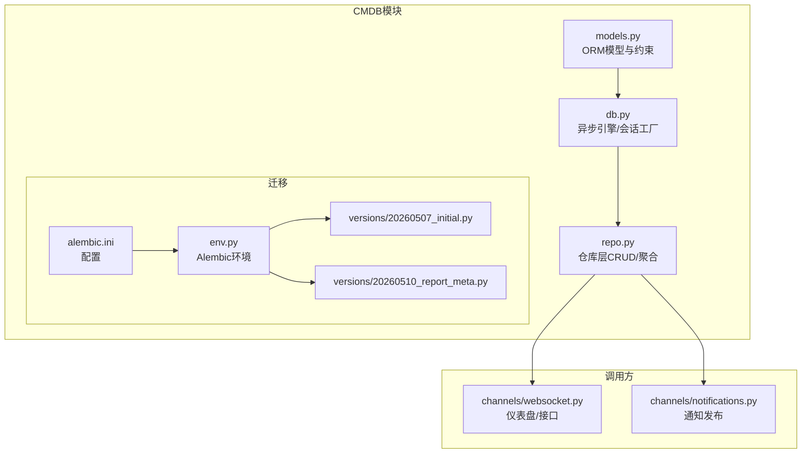
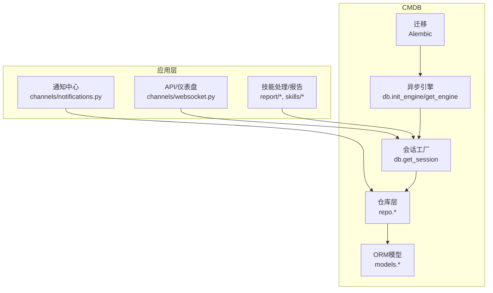
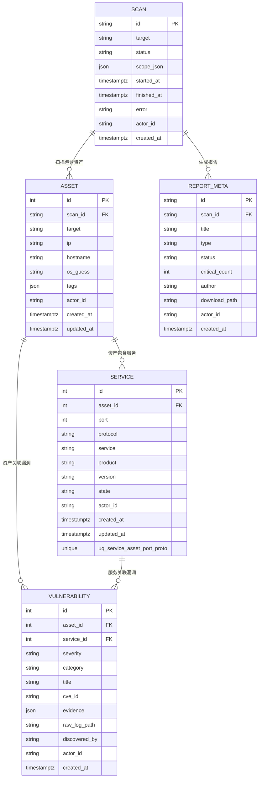
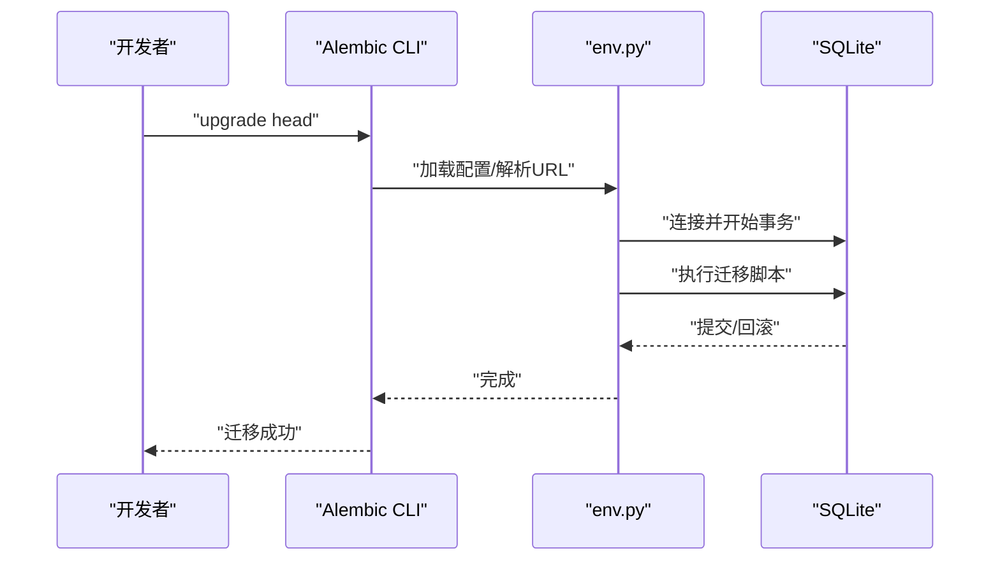
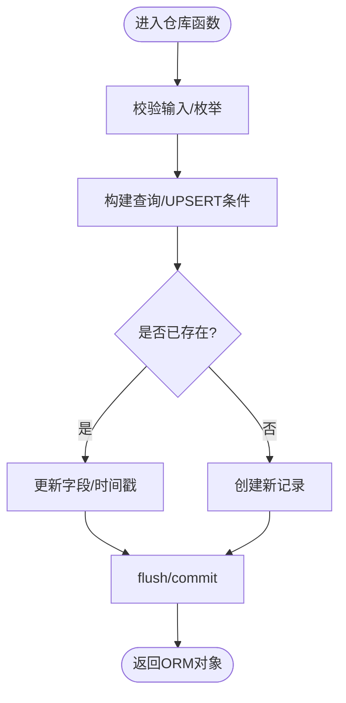
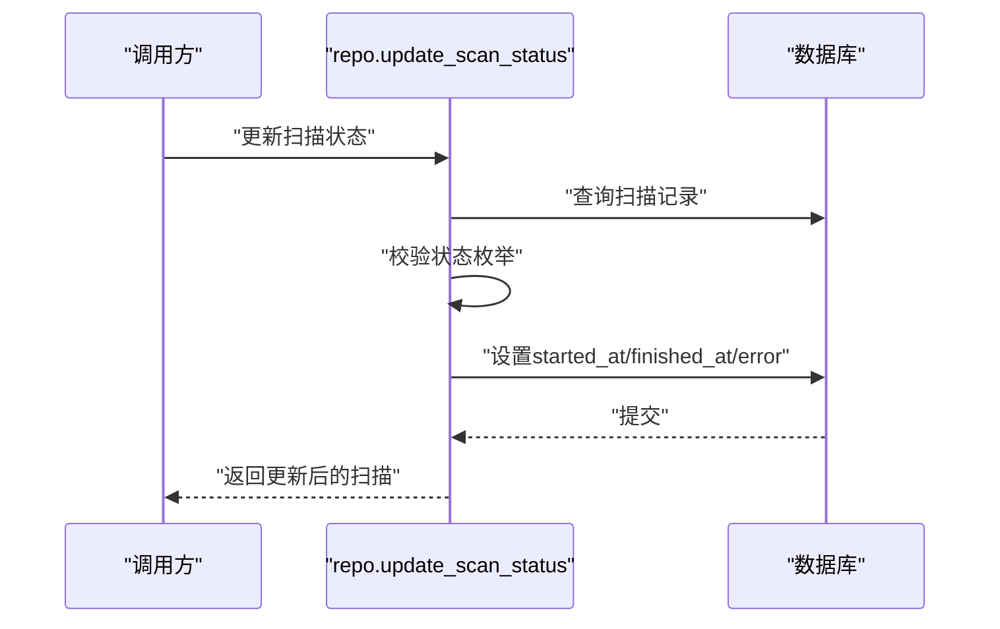
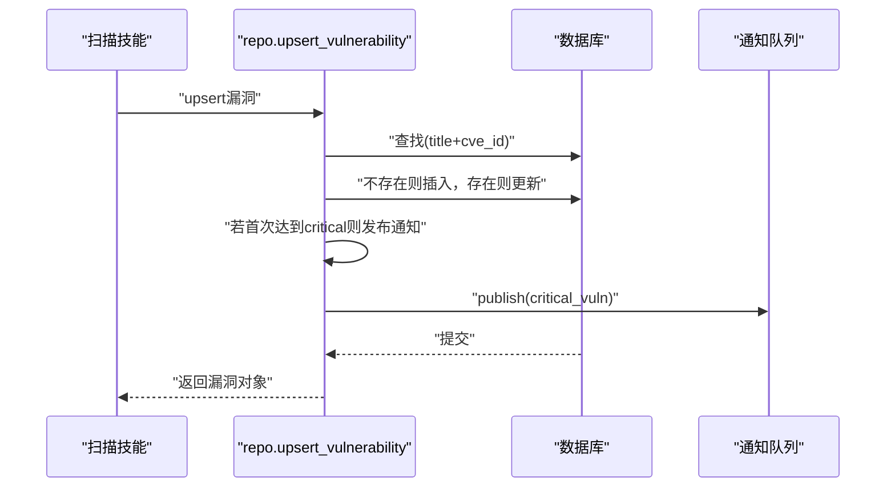
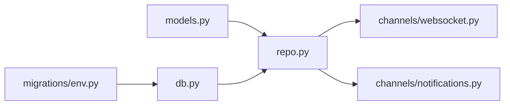

# CMDB资产管理

<cite>
**本文引用的文件**
- [models.py](file://secbot/cmdb/models.py)
- [db.py](file://secbot/cmdb/db.py)
- [repo.py](file://secbot/cmdb/repo.py)
- [20260507_initial.py](file://secbot/cmdb/migrations/versions/20260507_initial.py)
- [20260510_report_meta.py](file://secbot/cmdb/migrations/versions/20260510_report_meta.py)
- [env.py](file://secbot/cmdb/migrations/env.py)
- [alembic.ini](file://secbot/cmdb/alembic.ini)
- [test_repo.py](file://tests/cmdb/test_repo.py)
- [websocket.py](file://secbot/channels/websocket.py)
- [notifications.py](file://secbot/channels/notifications.py)
</cite>

## 目录
1. [简介](#简介)
2. [项目结构](#项目结构)
3. [核心组件](#核心组件)
4. [架构总览](#架构总览)
5. [详细组件分析](#详细组件分析)
6. [依赖分析](#依赖分析)
7. [性能考量](#性能考量)
8. [故障排查指南](#故障排查指南)
9. [结论](#结论)
10. [附录](#附录)

## 简介
本文件面向VAPT3/secbot的CMDB（配置管理数据库）资产管理子系统，系统采用SQLite + SQLAlchemy 2.x + Alembic的组合方案，围绕资产、服务、漏洞、扫描任务与报告元数据构建数据模型与持久化层。文档从数据库架构设计、实体关系、ORM模型实现、迁移管理、查询优化、CLI与API使用、数据生命周期管理到导入导出与迁移最佳实践进行系统性说明。

## 项目结构
CMDB相关代码集中在secbot/cmdb目录，关键文件如下：
- models.py：定义ORM模型与索引约束
- db.py：异步引擎与会话工厂初始化、连接参数与SQLite PRAGMA设置
- repo.py：仓库层封装CRUD与聚合查询，提供upsert语义与仪表盘聚合函数
- migrations/：Alembic迁移脚本与环境配置
- tests/cmdb/test_repo.py：仓库层行为测试，覆盖多租户隔离、枚举校验、幂等upsert等

图表来源
- [models.py:34-263](file://secbot/cmdb/models.py#L34-L263)
- [db.py:64-133](file://secbot/cmdb/db.py#L64-L133)
- [repo.py:76-994](file://secbot/cmdb/repo.py#L76-L994)
- [env.py:33-77](file://secbot/cmdb/migrations/env.py#L33-L77)
- [alembic.ini:4-45](file://secbot/cmdb/alembic.ini#L4-L45)
- [20260507_initial.py:23-159](file://secbot/cmdb/migrations/versions/20260507_initial.py#L23-L159)
- [20260510_report_meta.py:24-72](file://secbot/cmdb/migrations/versions/20260510_report_meta.py#L24-L72)
- [websocket.py:1106-1324](file://secbot/channels/websocket.py#L1106-L1324)
- [notifications.py:29-29](file://secbot/channels/notifications.py#L29-L29)

章节来源
- [models.py:1-263](file://secbot/cmdb/models.py#L1-L263)
- [db.py:1-133](file://secbot/cmdb/db.py#L1-L133)
- [repo.py:1-994](file://secbot/cmdb/repo.py#L1-L994)
- [20260507_initial.py:1-159](file://secbot/cmdb/migrations/versions/20260507_initial.py#L1-L159)
- [20260510_report_meta.py:1-72](file://secbot/cmdb/migrations/versions/20260510_report_meta.py#L1-L72)
- [env.py:1-78](file://secbot/cmdb/migrations/env.py#L1-L78)
- [alembic.ini:1-45](file://secbot/cmdb/alembic.ini#L1-L45)

## 核心组件
- 异步数据库引擎与会话工厂：负责连接建立、PRAGMA设置、会话生命周期管理
- ORM模型层：定义表结构、索引、外键、默认值与时间戳
- 仓库层：提供事务边界内的CRUD与聚合查询，保证幂等upsert与多租户隔离
- 迁移系统：基于Alembic的版本化schema演进

章节来源
- [db.py:64-133](file://secbot/cmdb/db.py#L64-L133)
- [models.py:34-263](file://secbot/cmdb/models.py#L34-L263)
- [repo.py:76-994](file://secbot/cmdb/repo.py#L76-L994)
- [env.py:33-77](file://secbot/cmdb/migrations/env.py#L33-L77)

## 架构总览
下图展示CMDB在应用中的位置与交互：

图表来源
- [db.py:64-133](file://secbot/cmdb/db.py#L64-L133)
- [repo.py:76-994](file://secbot/cmdb/repo.py#L76-L994)
- [models.py:34-263](file://secbot/cmdb/models.py#L34-L263)
- [env.py:33-77](file://secbot/cmdb/migrations/env.py#L33-L77)
- [websocket.py:1106-1324](file://secbot/channels/websocket.py#L1106-L1324)
- [notifications.py:29-29](file://secbot/channels/notifications.py#L29-L29)

## 详细组件分析

### 数据库架构设计（SQLite + SQLAlchemy + Alembic）
- SQLite作为本地单机存储，适配短写入并发；通过WAL模式与PRAGMA提升并发与可靠性
- SQLAlchemy 2.x ORM提供强类型模型与声明式关系映射
- Alembic进行版本化迁移，支持离线/在线两种执行模式，URL解析优先级可配置

章节来源
- [db.py:51-93](file://secbot/cmdb/db.py#L51-L93)
- [env.py:33-77](file://secbot/cmdb/migrations/env.py#L33-L77)
- [alembic.ini:4-45](file://secbot/cmdb/alembic.ini#L4-L45)

### 核心实体模型与关系
- Scan（扫描任务）：主键为ULID字符串，记录目标、状态、范围JSON、时间戳与错误信息，并带actor_id与创建时间
- Asset（资产）：属于一次扫描，包含IP/主机名/OS猜测/标签等，带actor_id与更新时间
- Service（服务）：属于资产，唯一约束为(资产, 端口, 协议)，记录协议、产品、版本、状态
- Vulnerability（漏洞）：属于资产与可选服务，按标题+CVE去重，记录严重级别、类别、证据、原始日志路径
- ReportMeta（报告元数据）：与Scan关联，记录报告标题、类型、状态、关键数、作者与下载路径

图表来源
- [models.py:38-174](file://secbot/cmdb/models.py#L38-L174)
- [models.py:177-218](file://secbot/cmdb/models.py#L177-L218)

章节来源
- [models.py:38-218](file://secbot/cmdb/models.py#L38-L218)

### ORM模型实现细节
- 字段定义：使用String/Integer/JSON/DateTime(timezone=True)等类型，确保时区安全
- 索引设计：针对高频过滤与排序列建立复合索引，如scan的(actor,status)、(actor,created_at)，asset的(actor,ip)、(actor,hostname)、scan_id，vulnerability的(actor,severity,created_at)、asset_id
- 外键关系：RESTRICT用于资产删除保护，CASCADE用于服务删除级联，SET NULL用于漏洞与服务解绑
- 默认值与服务器默认：通过server_default绑定func.now()与固定字符串，确保一致性
- 时间戳：created_at默认当前UTC，updated_at在onupdate触发更新

章节来源
- [models.py:38-218](file://secbot/cmdb/models.py#L38-L218)

### Alembic迁移管理
- 初始版本（20260507_initial）：创建scan、asset、service、vulnerability四张表及索引
- 报告元数据版本（20260510_report_meta）：新增report_meta表与索引
- 环境配置：env.py解析URL优先级（命令行参数 > 环境变量 > 默认路径），离线/在线模式分别处理
- 配置文件：alembic.ini集中管理日志与路径

图表来源
- [env.py:59-77](file://secbot/cmdb/migrations/env.py#L59-L77)
- [20260507_initial.py:23-159](file://secbot/cmdb/migrations/versions/20260507_initial.py#L23-L159)
- [20260510_report_meta.py:24-72](file://secbot/cmdb/migrations/versions/20260510_report_meta.py#L24-L72)

章节来源
- [env.py:33-77](file://secbot/cmdb/migrations/env.py#L33-L77)
- [alembic.ini:4-45](file://secbot/cmdb/alembic.ini#L4-L45)
- [20260507_initial.py:1-159](file://secbot/cmdb/migrations/versions/20260507_initial.py#L1-L159)
- [20260510_report_meta.py:1-72](file://secbot/cmdb/migrations/versions/20260510_report_meta.py#L1-L72)

### 仓库层与查询逻辑
- 幂等upsert：以自然键为条件查找并更新或插入，避免重复扫描导致的数据膨胀
- 多租户隔离：所有读写均以actor_id过滤，确保不同用户数据隔离
- 枚举校验：对严重级别、漏洞类别、扫描状态、协议等进行严格校验
- 聚合查询：提供仪表盘所需的关键指标统计、趋势分析、分布统计与集群聚合

图表来源
- [repo.py:149-206](file://secbot/cmdb/repo.py#L149-L206)
- [repo.py:227-276](file://secbot/cmdb/repo.py#L227-L276)
- [repo.py:297-385](file://secbot/cmdb/repo.py#L297-L385)

章节来源
- [repo.py:76-994](file://secbot/cmdb/repo.py#L76-L994)
- [test_repo.py:22-265](file://tests/cmdb/test_repo.py#L22-L265)

### 关键流程示例

#### 扫描状态流转与时间戳更新

图表来源
- [repo.py:117-142](file://secbot/cmdb/repo.py#L117-L142)

#### 漏洞upsert与关键漏洞通知

图表来源
- [repo.py:297-385](file://secbot/cmdb/repo.py#L297-L385)
- [notifications.py:29-29](file://secbot/channels/notifications.py#L29-L29)

## 依赖分析
- 模型依赖：各实体间通过外键约束形成清晰的层次关系
- 仓库依赖：仓库层依赖模型与SQLAlchemy表达式，不直接依赖通道层，保持关注点分离
- 迁移依赖：迁移脚本仅依赖Alembic与SQLAlchemy，URL解析由env.py统一处理
- 运行时依赖：API与仪表盘通过db.get_session获取会话，确保事务边界与一致性

图表来源
- [models.py:34-263](file://secbot/cmdb/models.py#L34-L263)
- [repo.py:26-40](file://secbot/cmdb/repo.py#L26-L40)
- [db.py:64-133](file://secbot/cmdb/db.py#L64-L133)
- [env.py:33-77](file://secbot/cmdb/migrations/env.py#L33-L77)
- [websocket.py:1106-1324](file://secbot/channels/websocket.py#L1106-L1324)
- [notifications.py:29-29](file://secbot/channels/notifications.py#L29-L29)

章节来源
- [repo.py:26-40](file://secbot/cmdb/repo.py#L26-L40)
- [db.py:64-133](file://secbot/cmdb/db.py#L64-L133)
- [env.py:33-77](file://secbot/cmdb/migrations/env.py#L33-L77)

## 性能考量
- 并发与锁：启用WAL模式与合理的busy_timeout，减少“database is locked”问题
- 索引优化：针对高频过滤列建立复合索引，避免全表扫描
- 查询限制：列表查询默认限制数量，防止内存与网络压力
- 时间窗口：仪表盘聚合使用日期函数与本地时区计算，避免跨时区复杂度
- 事务粒度：仓库层每个操作在调用方提供的会话内执行，避免长事务

章节来源
- [db.py:51-93](file://secbot/cmdb/db.py#L51-L93)
- [models.py:56-104](file://secbot/cmdb/models.py#L56-L104)
- [models.py:171-174](file://secbot/cmdb/models.py#L171-L174)
- [models.py:210-218](file://secbot/cmdb/models.py#L210-L218)
- [repo.py:101-114](file://secbot/cmdb/repo.py#L101-L114)
- [repo.py:278-289](file://secbot/cmdb/repo.py#L278-L289)
- [repo.py:387-405](file://secbot/cmdb/repo.py#L387-L405)

## 故障排查指南
- 连接与迁移
  - 使用env.py解析的URL确认数据库路径与驱动
  - 在线/离线模式分别检查连接参数与渲染模式
- 枚举与约束
  - 若出现“未知扫描状态/漏洞严重级别/类别”，检查枚举集合与输入值
  - 唯一约束冲突时，确认upsert键组合是否正确
- 事务与会话
  - 确保通过db.get_session获取会话并在异常时自动回滚
  - 长时间未提交会导致锁等待，适当调整超时
- 通知与集成
  - 关键漏洞通知失败不影响主流程，但需检查通知通道可用性

章节来源
- [env.py:33-77](file://secbot/cmdb/migrations/env.py#L33-L77)
- [repo.py:117-142](file://secbot/cmdb/repo.py#L117-L142)
- [repo.py:297-385](file://secbot/cmdb/repo.py#L297-L385)
- [db.py:103-122](file://secbot/cmdb/db.py#L103-L122)

## 结论
本CMDB方案以SQLite为存储底座，结合SQLAlchemy ORM与Alembic迁移，实现了轻量、可靠且可演进的资产管理能力。通过严格的多租户隔离、幂等upsert与完善的索引策略，满足了扫描、资产、服务、漏洞与报告元数据的全生命周期管理需求。配合仓库层聚合查询，为仪表盘与报告提供了高效的数据支撑。

## 附录

### 数据库操作与CLI使用
- 初始化与迁移
  - 在线迁移：使用Alembic CLI指定配置文件并升级至最新版本
  - 离线迁移：在无运行时环境时，通过同步驱动执行
- 会话与事务
  - 通过db.get_session获取异步会话，确保在try/finally中提交或回滚
- 示例流程
  - 创建扫描 -> upsert资产 -> upsert服务 -> upsert漏洞 -> 聚合统计 -> 生成报告元数据

章节来源
- [alembic.ini:4-45](file://secbot/cmdb/alembic.ini#L4-L45)
- [env.py:59-77](file://secbot/cmdb/migrations/env.py#L59-L77)
- [db.py:103-122](file://secbot/cmdb/db.py#L103-L122)
- [repo.py:76-994](file://secbot/cmdb/repo.py#L76-L994)

### 数据生命周期管理
- 清理策略
  - 可根据created_at设置保留周期，定期删除过期扫描与报告
  - 删除扫描前需确保无活动任务与报告依赖
- 备份与恢复
  - 直接复制SQLite文件即可备份；恢复时停止服务后替换文件
- 审计日志
  - 通过created_at与actor_id进行审计追踪；必要时扩展审计表

### 导入导出与迁移最佳实践
- 导入
  - 使用仓库层upsert函数保证幂等；分批导入避免大事务
  - 先导入低依赖表（如scan），再导入高依赖表（asset/service/vuln）
- 导出
  - 使用聚合查询导出仪表盘所需维度；注意时区转换与本地化
- 迁移
  - 新增索引与约束时先添加迁移脚本，避免生产环境长时间锁表
  - 对大表变更采用分批处理与维护窗口