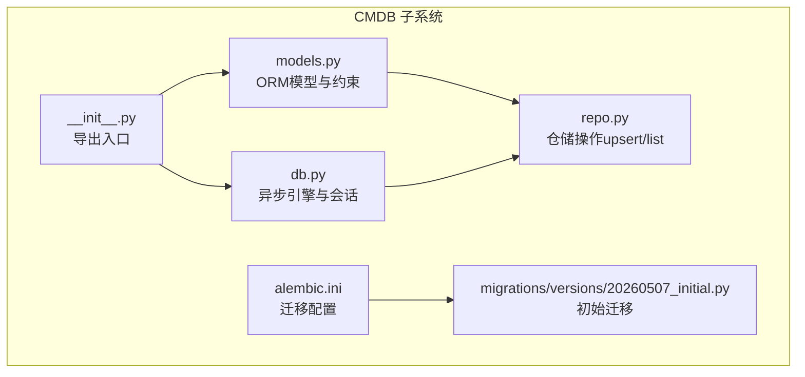
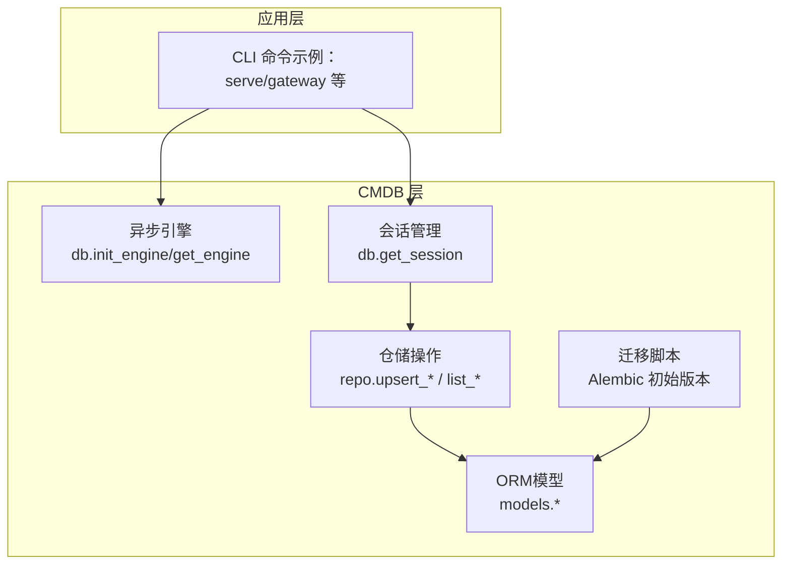
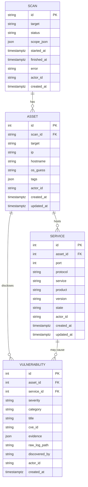
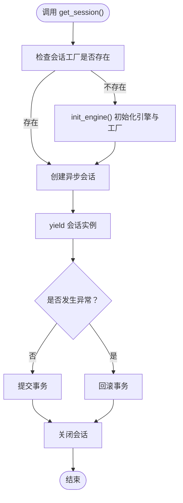
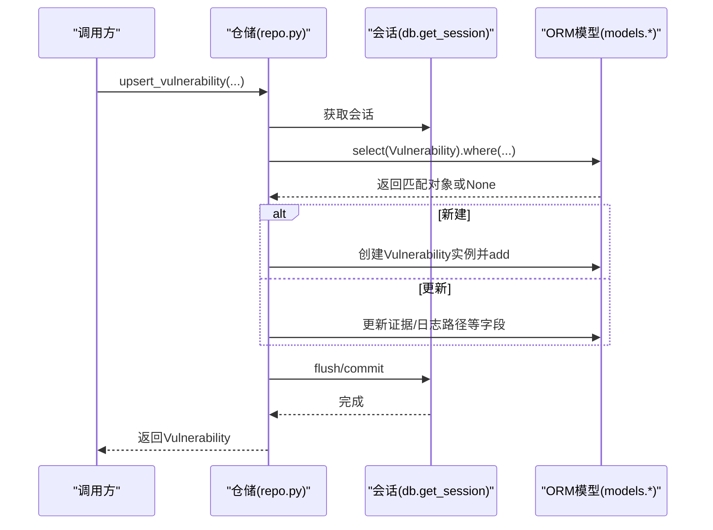
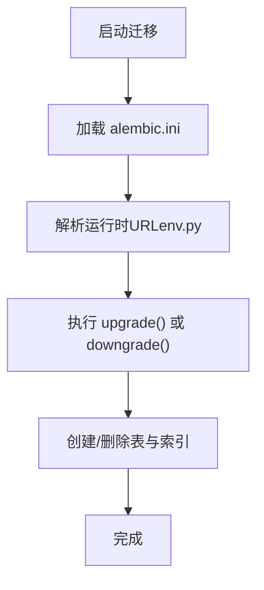
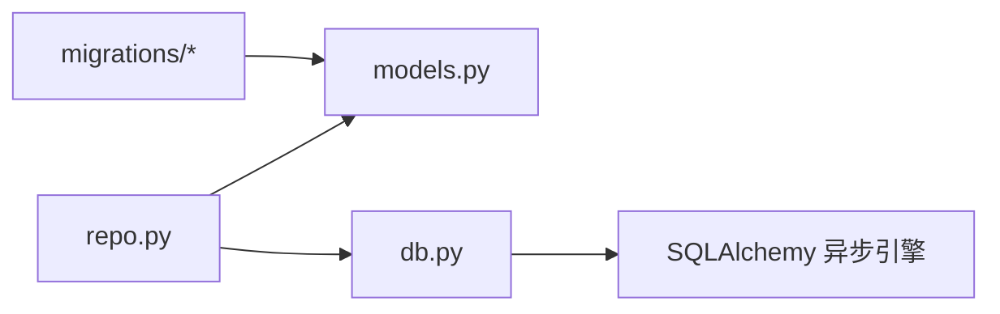
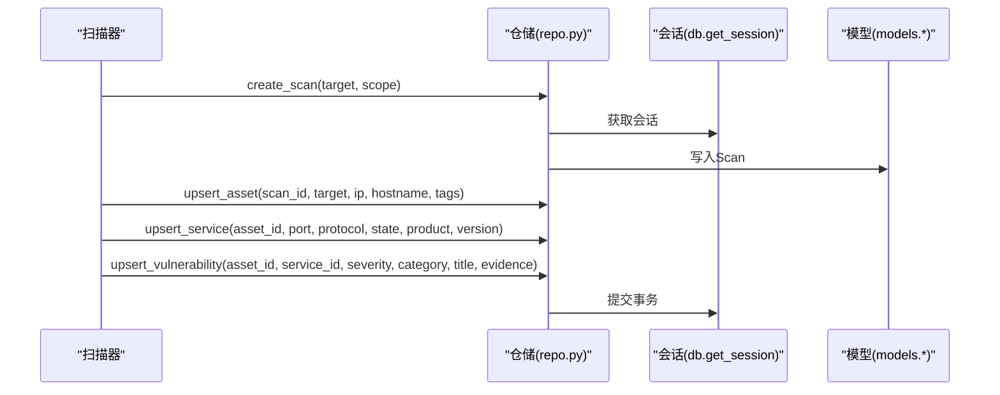

# CMDB资产管理

<cite>
**本文引用的文件**
- [models.py](file://secbot/cmdb/models.py)
- [db.py](file://secbot/cmdb/db.py)
- [repo.py](file://secbot/cmdb/repo.py)
- [__init__.py](file://secbot/cmdb/__init__.py)
- [20260507_initial.py](file://secbot/cmdb/migrations/versions/20260507_initial.py)
- [alembic.ini](file://secbot/cmdb/alembic.ini)
- [commands.py](file://secbot/cli/commands.py)
- [cli-reference.md](file://docs/cli-reference.md)
</cite>

## 目录
1. [简介](#简介)
2. [项目结构](#项目结构)
3. [核心组件](#核心组件)
4. [架构总览](#架构总览)
5. [详细组件分析](#详细组件分析)
6. [依赖关系分析](#依赖关系分析)
7. [性能考量](#性能考量)
8. [故障排查指南](#故障排查指南)
9. [结论](#结论)
10. [附录](#附录)

## 简介
本文件为CMDB（配置管理数据库）资产管理系统的综合技术文档，聚焦于资产、服务、漏洞、扫描任务等核心实体的数据模型与关系，以及基于SQLite + SQLAlchemy 2.x + Alembic的本地化数据库方案。文档同时覆盖：
- 数据库架构设计：实体关系、索引策略、约束与多租户字段
- 技术栈优势与使用方法：异步引擎、会话管理、连接级PRAGMA设置
- 资产发现、漏洞跟踪、任务管理的完整功能说明
- 数据迁移与版本管理：迁移脚本编写与升级流程
- CMDB查询与管理命令使用指南
- 数据导入导出、备份恢复与性能优化最佳实践
- 与安全扫描流程的集成方式与数据流转过程

## 项目结构
CMDB子系统位于 secbot/cmdb 目录，核心由以下模块组成：
- 模型层：定义ORM基类与四张核心表（scan、asset、service、vulnerability）
- 引擎与会话：封装异步SQLAlchemy引擎初始化、连接PRAGMA设置、会话上下文管理
- 仓储层：提供upsert/list查询等高阶操作，遵循自然键与事务边界约定
- 迁移：Alembic初始迁移脚本，定义表结构、索引与约束
- 导出入口：对外暴露统一的初始化与会话接口

图表来源
- [models.py:34-177](file://secbot/cmdb/models.py#L34-L177)
- [db.py:64-133](file://secbot/cmdb/db.py#L64-L133)
- [repo.py:68-370](file://secbot/cmdb/repo.py#L68-L370)
- [__init__.py:13-25](file://secbot/cmdb/__init__.py#L13-L25)
- [20260507_initial.py:23-159](file://secbot/cmdb/migrations/versions/20260507_initial.py#L23-L159)
- [alembic.ini:4-8](file://secbot/cmdb/alembic.ini#L4-L8)

章节来源
- [__init__.py:1-26](file://secbot/cmdb/__init__.py#L1-L26)
- [models.py:1-178](file://secbot/cmdb/models.py#L1-L178)
- [db.py:1-133](file://secbot/cmdb/db.py#L1-L133)
- [repo.py:1-370](file://secbot/cmdb/repo.py#L1-L370)
- [20260507_initial.py:1-159](file://secbot/cmdb/migrations/versions/20260507_initial.py#L1-L159)
- [alembic.ini:1-45](file://secbot/cmdb/alembic.ini#L1-L45)

## 核心组件
- 异步数据库引擎与会话管理：负责默认数据库URL解析、WAL模式与PRAGMA设置、进程内单引擎与会话工厂的生命周期管理；提供安全的异步上下文会话，确保提交/回滚/关闭的正确性。
- ORM模型与约束：定义四张核心表及外键关系、JSON字段、时间戳字段、索引与唯一约束；统一引入actor_id以支持多租户与未来RBAC扩展。
- 仓储操作：提供扫描、资产、服务、漏洞的创建、查询与upsert逻辑，严格遵循自然键与事务边界，保证重扫描与重复发现的幂等性。

章节来源
- [db.py:64-133](file://secbot/cmdb/db.py#L64-L133)
- [models.py:34-177](file://secbot/cmdb/models.py#L34-L177)
- [repo.py:68-370](file://secbot/cmdb/repo.py#L68-L370)

## 架构总览
CMDB采用“模型-引擎-仓储-迁移”的分层架构：
- 模型层：声明式基类与实体定义，承载业务表结构与约束
- 引擎层：异步SQLAlchemy引擎与连接级PRAGMA设置，保障并发与一致性
- 仓储层：面向业务的upsert/list操作，封装事务边界
- 迁移层：Alembic初始迁移脚本，定义表结构、索引与约束

图表来源
- [db.py:64-133](file://secbot/cmdb/db.py#L64-L133)
- [repo.py:68-370](file://secbot/cmdb/repo.py#L68-L370)
- [models.py:34-177](file://secbot/cmdb/models.py#L34-L177)
- [20260507_initial.py:23-159](file://secbot/cmdb/migrations/versions/20260507_initial.py#L23-L159)

## 详细组件分析

### 数据库架构与实体关系
- 实体与主键
  - Scan：主键为字符串型ULID
  - Asset：自增整数主键，关联Scan
  - Service：自增整数主键，关联Asset，唯一约束（asset_id, port, protocol）
  - Vulnerability：自增整数主键，关联Asset与Service（可空），用于记录漏洞证据与日志路径
- 外键与删除策略
  - Asset对Scan使用RESTRICT，避免误删仍在使用的扫描记录
  - Service对Asset使用CASCADE，清理资产时同步删除其服务
  - Vulnerability对Service使用SET NULL，允许服务被删除后保留漏洞归属信息
- 索引与约束
  - Scan：按actor_id+status、actor_id+created_at建立复合索引
  - Asset：按actor_id+ip、actor_id+hostname、scan_id建立索引
  - Service：唯一约束（asset_id, port, protocol）
  - Vulnerability：按actor_id+severity+created_at、asset_id建立索引
- 多租户字段
  - 所有表均包含actor_id，默认值为local，便于未来扩展RBAC且不破坏现有数据

图表来源
- [models.py:38-170](file://secbot/cmdb/models.py#L38-L170)
- [20260507_initial.py:24-144](file://secbot/cmdb/migrations/versions/20260507_initial.py#L24-L144)

章节来源
- [models.py:38-177](file://secbot/cmdb/models.py#L38-L177)
- [20260507_initial.py:23-159](file://secbot/cmdb/migrations/versions/20260507_initial.py#L23-L159)

### 异步引擎与会话管理
- 默认数据库URL解析：优先环境变量，其次用户家目录下的固定路径，确保可配置性与便携性
- 连接级PRAGMA设置：启用WAL、NORMAL同步、外键检查、忙等待超时，提升并发写入稳定性
- 引擎与会话工厂：支持多次初始化与销毁，提供安全的异步上下文会话，自动提交或回滚
- 使用建议：所有CMDB读写必须通过会话上下文进行，避免直接使用sqlite3或原生SQL

图表来源
- [db.py:103-122](file://secbot/cmdb/db.py#L103-L122)

章节来源
- [db.py:29-93](file://secbot/cmdb/db.py#L29-L93)
- [db.py:103-133](file://secbot/cmdb/db.py#L103-L133)

### 仓储操作与幂等性
- 扫描（Scan）
  - 创建：生成ULID，设置状态为排队，写入作用域JSON
  - 查询：按actor_id与scan_id精确查询；列表查询支持按状态过滤与限制数量
  - 状态更新：严格校验状态集合，首次运行设置开始时间，结束态设置完成时间与错误信息
- 资产（Asset）
  - upsert：以（actor_id, scan_id, target）为自然键，同一扫描内的目标视为唯一，更新IP/主机名/OS/标签与更新时间
  - 查询：支持按scan_id过滤与数量限制
- 服务（Service）
  - upsert：以（asset_id, port, protocol）为自然键，协议限定为tcp/udp，更新状态与产品信息
  - 查询：支持按资产过滤与数量限制
- 漏洞（Vulnerability）
  - upsert：以（asset_id, service_id, title, cve_id）为自然键，重复发现仅刷新证据与日志路径
  - 查询：支持按资产、严重级别过滤与数量限制

图表来源
- [repo.py:281-348](file://secbot/cmdb/repo.py#L281-L348)
- [models.py:139-170](file://secbot/cmdb/models.py#L139-L170)

章节来源
- [repo.py:68-370](file://secbot/cmdb/repo.py#L68-L370)
- [models.py:38-177](file://secbot/cmdb/models.py#L38-L177)

### 迁移与版本管理
- 初始迁移：定义四张表、索引与约束，确保首次部署即具备完整的CMDB结构
- 升级流程：通过Alembic在运行时解析URL，执行upgrade/downgrade；迁移脚本中显式声明修订ID与依赖
- 配置文件：alembic.ini集中管理脚本位置、路径分隔符与日志级别

图表来源
- [20260507_initial.py:23-159](file://secbot/cmdb/migrations/versions/20260507_initial.py#L23-L159)
- [alembic.ini:4-8](file://secbot/cmdb/alembic.ini#L4-L8)

章节来源
- [20260507_initial.py:1-159](file://secbot/cmdb/migrations/versions/20260507_initial.py#L1-L159)
- [alembic.ini:1-45](file://secbot/cmdb/alembic.ini#L1-L45)

### CMDB查询与管理命令使用指南
- 命令入口：CLI命令模块提供多种运行模式（网关、API服务、引导等），CMDB作为底层数据存储被这些命令间接使用
- 交互与输出：CLI使用Rich与prompt_toolkit渲染终端输出，支持历史、粘贴、Markdown渲染等
- 会话与事务：所有CMDB访问需通过会话上下文，确保一致性与并发安全

章节来源
- [commands.py:1-800](file://secbot/cli/commands.py#L1-L800)
- [cli-reference.md:1-22](file://docs/cli-reference.md#L1-L22)

## 依赖关系分析
- 组件耦合
  - 仓储层依赖模型层与异步会话；模型层不依赖仓储；引擎层独立于业务逻辑
  - 迁移脚本独立于运行时代码，仅在部署阶段使用
- 外部依赖
  - SQLAlchemy 2.x（异步）、Alembic（迁移）、SQLite（文件型数据库）

图表来源
- [repo.py:25-34](file://secbot/cmdb/repo.py#L25-L34)
- [models.py:25-34](file://secbot/cmdb/models.py#L25-L34)
- [db.py:18-23](file://secbot/cmdb/db.py#L18-L23)
- [20260507_initial.py:14-15](file://secbot/cmdb/migrations/versions/20260507_initial.py#L14-L15)

章节来源
- [repo.py:25-34](file://secbot/cmdb/repo.py#L25-L34)
- [models.py:25-34](file://secbot/cmdb/models.py#L25-L34)
- [db.py:18-23](file://secbot/cmdb/db.py#L18-L23)

## 性能考量
- 并发与锁：启用WAL模式与合理的busy_timeout，减少短事务写入时的“数据库被锁定”问题
- 索引策略：针对高频过滤字段（actor_id、status、created_at、scan_id、asset_id）建立复合索引，提升查询效率
- 写入路径：使用upsert与flush策略，避免重复插入与多余事务开销
- 会话复用：通过进程级引擎与会话工厂，降低连接创建成本
- I/O与磁盘：SQLite文件位于用户家目录下，建议在SSD上运行以提升随机读写性能

## 故障排查指南
- 数据库连接失败
  - 检查SECBOT_HOME或默认路径权限，确认数据库文件存在且可读写
  - 确认未同时占用数据库文件（例如其他进程打开）
- 迁移执行失败
  - 查看Alembic日志级别与输出，确认URL解析正确
  - 确认目标数据库版本与脚本兼容
- 并发写入冲突
  - 检查PRAGMA设置是否生效（WAL、foreign_keys、busy_timeout）
  - 减少长事务，尽量缩短会话生命周期
- 查询性能差
  - 确认WHERE条件命中索引（如actor_id、scan_id、asset_id）
  - 控制返回结果集大小（limit参数）

章节来源
- [db.py:51-62](file://secbot/cmdb/db.py#L51-L62)
- [alembic.ini:26-44](file://secbot/cmdb/alembic.ini#L26-L44)

## 结论
本CMDB子系统以SQLite + SQLAlchemy 2.x + Alembic构建，围绕资产、服务、漏洞、扫描任务形成清晰的实体关系与索引策略，提供异步引擎与严格的会话管理，确保在单机场景下的高可用与高性能。通过自然键upsert与多租户字段，系统具备良好的幂等性与扩展性。结合迁移脚本与统一的会话入口，能够稳定支撑资产发现、漏洞跟踪与任务管理等核心功能。

## 附录

### 数据导入导出与备份恢复
- 导出
  - 使用ORM查询导出JSON/CSV：通过list_*接口获取数据，序列化为JSON或CSV格式
  - 备份数据库文件：直接复制SQLite文件（建议在停止写入时进行）
- 导入
  - 通过upsert_*接口批量写入，注意控制事务大小与并发
  - 迁移前先备份，迁移后验证关键索引与约束
- 恢复
  - 停止服务，替换数据库文件，重启服务
  - 如需回滚，使用Alembic downgrade至目标版本

### 与安全扫描流程的集成
- 资产发现：创建扫描任务，记录目标与范围；通过upsert_asset将发现的资产写入
- 端口扫描：基于资产ID与端口协议upsert_service，记录服务指纹
- 漏洞扫描：基于资产与服务upsert_vulnerability，记录严重级别、类别、证据与原始日志路径
- 任务编排：通过扫描状态管理（queued/running/completed/failed/cancelled）协调各步骤

图表来源
- [repo.py:68-348](file://secbot/cmdb/repo.py#L68-L348)
- [models.py:38-170](file://secbot/cmdb/models.py#L38-L170)