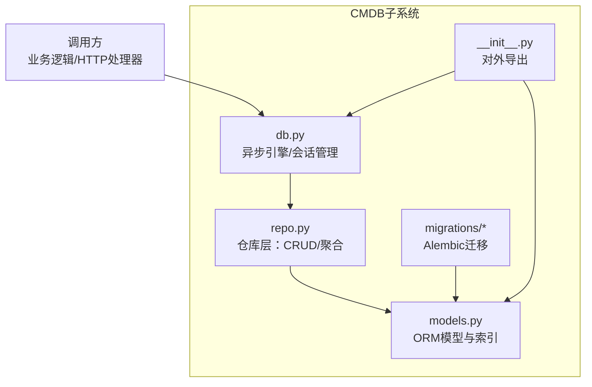
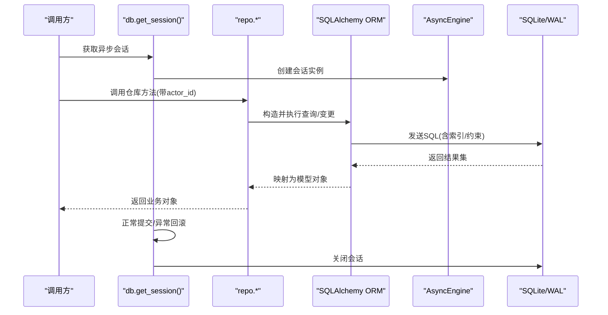
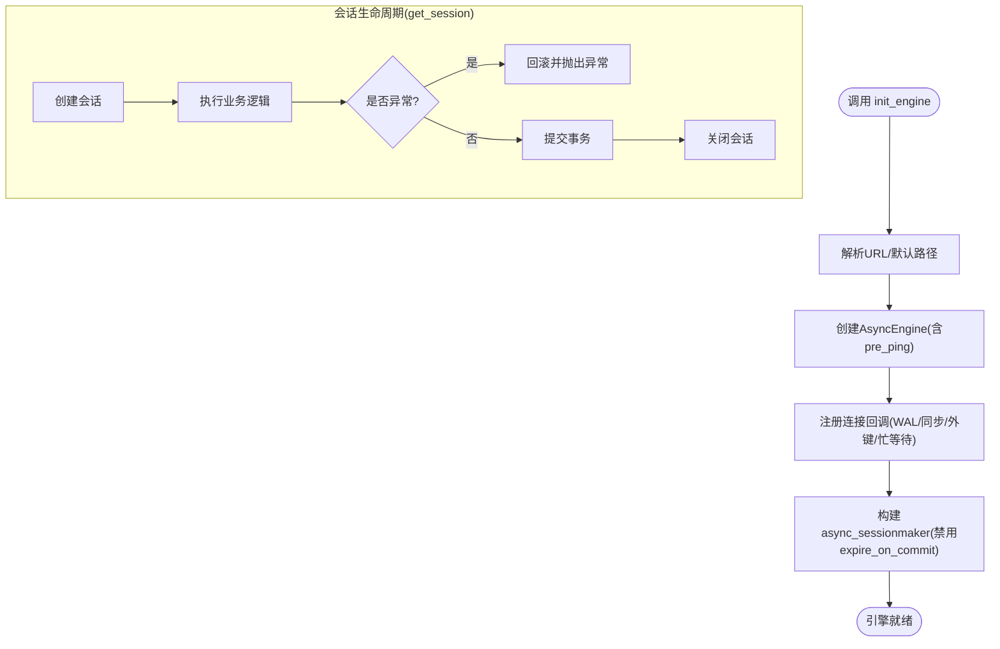
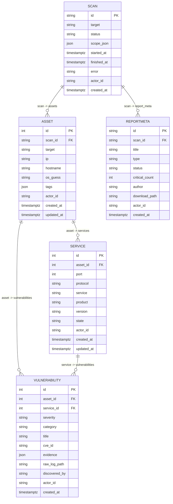
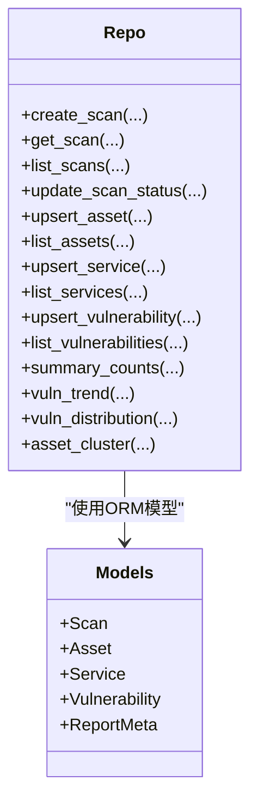
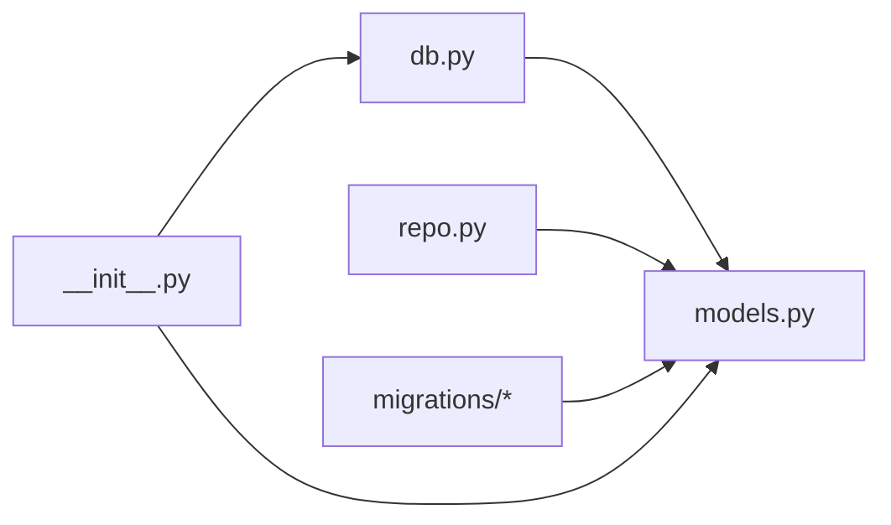

# ORM实现细节

<cite>
**本文档引用的文件**
- [secbot/cmdb/db.py](file://secbot/cmdb/db.py)
- [secbot/cmdb/models.py](file://secbot/cmdb/models.py)
- [secbot/cmdb/repo.py](file://secbot/cmdb/repo.py)
- [secbot/cmdb/migrations/versions/20260507_initial.py](file://secbot/cmdb/migrations/versions/20260507_initial.py)
- [secbot/cmdb/migrations/versions/20260510_report_meta.py](file://secbot/cmdb/migrations/versions/20260510_report_meta.py)
- [secbot/cmdb/migrations/env.py](file://secbot/cmdb/migrations/env.py)
- [secbot/cmdb/__init__.py](file://secbot/cmdb/__init__.py)
- [tests/cmdb/test_repo.py](file://tests/cmdb/test_repo.py)
- [tests/cmdb/test_report_meta.py](file://tests/cmdb/test_report_meta.py)
- [.trellis/spec/backend/dashboard-aggregation.md](file://.trellis/spec/backend/dashboard-aggregation.md)
</cite>

## 目录
1. [简介](#简介)
2. [项目结构](#项目结构)
3. [核心组件](#核心组件)
4. [架构总览](#架构总览)
5. [详细组件分析](#详细组件分析)
6. [依赖分析](#依赖分析)
7. [性能考虑](#性能考虑)
8. [故障排查指南](#故障排查指南)
9. [结论](#结论)
10. [附录](#附录)

## 简介
本文件系统性梳理 VAPT3 的本地 CMDB（资产、服务、漏洞、扫描）ORM 实现，围绕 SQLAlchemy 2.x 异步引擎与会话管理、仓库（Repo）模式的数据访问层设计、查询优化策略、异常处理与错误恢复、多租户隔离与并发控制、以及典型使用示例进行深入说明。目标读者既包括需要快速上手的开发者，也包括希望理解底层实现原理的架构师。

## 项目结构
CMDB 子系统的代码主要位于 secbot/cmdb 目录，采用“模型-仓库-迁移-入口”分层组织：
- 模型层：定义 SQLAlchemy 2.x ORM 映射与索引约束
- 仓库层：封装 CRUD 与聚合查询，提供业务语义化的数据访问接口
- 迁移层：基于 Alembic 的版本化 Schema 管理
- 入口层：对外暴露统一的异步引擎与会话管理器

图表来源
- [secbot/cmdb/models.py:1-263](file://secbot/cmdb/models.py#L1-L263)
- [secbot/cmdb/repo.py:1-994](file://secbot/cmdb/repo.py#L1-L994)
- [secbot/cmdb/db.py:1-133](file://secbot/cmdb/db.py#L1-L133)
- [secbot/cmdb/migrations/versions/20260507_initial.py:1-159](file://secbot/cmdb/migrations/versions/20260507_initial.py#L1-L159)
- [secbot/cmdb/migrations/versions/20260510_report_meta.py:1-72](file://secbot/cmdb/migrations/versions/20260510_report_meta.py#L1-L72)
- [secbot/cmdb/__init__.py:1-26](file://secbot/cmdb/__init__.py#L1-L26)

章节来源
- [secbot/cmdb/__init__.py:1-26](file://secbot/cmdb/__init__.py#L1-L26)
- [secbot/cmdb/db.py:1-133](file://secbot/cmdb/db.py#L1-L133)
- [secbot/cmdb/models.py:1-263](file://secbot/cmdb/models.py#L1-L263)
- [secbot/cmdb/repo.py:1-994](file://secbot/cmdb/repo.py#L1-L994)

## 核心组件
- 异步引擎与会话管理
  - 提供进程级单例异步引擎与会话工厂，支持显式重绑定与优雅释放
  - 在连接建立时应用 SQLite WAL、同步级别、外键与忙等待超时等参数
  - 通过上下文管理器确保异常时回滚、正常时提交，并最终关闭会话
- ORM 模型与索引
  - 定义 Scan、Asset、Service、Vulnerability、ReportMeta 表及其关系
  - 为高频查询字段建立复合索引，保障读写性能
- 仓库层（Repo）
  - 将业务语义封装为 upsert/list/create/update 等方法
  - 统一执行 actor_id 隔离、枚举校验、状态机约束与聚合统计
- 迁移与版本控制
  - 基于 Alembic 的版本化迁移，支持在线/离线模式
  - 初始版本包含核心表，后续增加报告元数据表

章节来源
- [secbot/cmdb/db.py:64-132](file://secbot/cmdb/db.py#L64-L132)
- [secbot/cmdb/models.py:34-263](file://secbot/cmdb/models.py#L34-L263)
- [secbot/cmdb/repo.py:1-994](file://secbot/cmdb/repo.py#L1-L994)
- [secbot/cmdb/migrations/env.py:47-77](file://secbot/cmdb/migrations/env.py#L47-L77)

## 架构总览
下图展示从调用方到数据库的完整数据流，强调“只经由 get_session 使用”的约束与事务边界。

图表来源
- [secbot/cmdb/db.py:103-122](file://secbot/cmdb/db.py#L103-L122)
- [secbot/cmdb/repo.py:76-141](file://secbot/cmdb/repo.py#L76-L141)
- [secbot/cmdb/models.py:38-174](file://secbot/cmdb/models.py#L38-L174)

## 详细组件分析

### 异步引擎与会话生命周期
- 初始化流程
  - 支持通过环境变量或显式参数指定数据库 URL，默认使用 SQLite 文件路径
  - 创建异步引擎并启用 pre_ping，确保连接可用性
  - 为每个新连接注册回调，设置 WAL、同步级别、外键与忙等待超时
  - 构建异步会话工厂，禁用提交后过期，避免不必要的查询失效
- 会话管理
  - 通过上下文管理器统一开启/提交/回滚/关闭，杜绝直接使用 sqlite3 或原生 SQL 的风险
  - 提供显式销毁引擎的能力，便于测试与优雅停机

图表来源
- [secbot/cmdb/db.py:64-93](file://secbot/cmdb/db.py#L64-L93)
- [secbot/cmdb/db.py:103-122](file://secbot/cmdb/db.py#L103-L122)

章节来源
- [secbot/cmdb/db.py:64-132](file://secbot/cmdb/db.py#L64-L132)

### 数据模型与关系设计
- 表与字段
  - Scan：扫描任务，包含状态、时间戳、作用域等
  - Asset：资产，关联 Scan，支持标签 JSON 字段
  - Service：服务，关联 Asset，唯一约束端口+协议
  - Vulnerability：漏洞，关联 Asset/Service，支持证据与日志路径
  - ReportMeta：报告元数据，记录渲染后的报告信息
- 关系与约束
  - 外键删除策略：资产受限删除，服务与漏洞级联删除
  - JSON 字段用于扩展标签，便于后续聚合与过滤
- 索引设计
  - 针对 actor_id、created_at、状态等高频过滤字段建立复合索引
  - 服务表按资产+端口+协议建立唯一索引，保证幂等 upsert

图表来源
- [secbot/cmdb/models.py:38-218](file://secbot/cmdb/models.py#L38-L218)
- [secbot/cmdb/migrations/versions/20260507_initial.py:23-144](file://secbot/cmdb/migrations/versions/20260507_initial.py#L23-L144)
- [secbot/cmdb/migrations/versions/20260510_report_meta.py:24-63](file://secbot/cmdb/migrations/versions/20260510_report_meta.py#L24-L63)

章节来源
- [secbot/cmdb/models.py:34-263](file://secbot/cmdb/models.py#L34-L263)
- [secbot/cmdb/migrations/versions/20260507_initial.py:1-159](file://secbot/cmdb/migrations/versions/20260507_initial.py#L1-L159)
- [secbot/cmdb/migrations/versions/20260510_report_meta.py:1-72](file://secbot/cmdb/migrations/versions/20260510_report_meta.py#L1-L72)

### 仓库层（Repo）模式与CRUD封装
- 设计原则
  - 所有读取均强制传入 actor_id 并在 WHERE 中过滤，实现天然的多租户隔离
  - 写入操作自动打上 actor_id；upsert 以自然键为主，保证重复扫描幂等
  - 仓库方法接收已存在的 AsyncSession，不负责打开/提交/关闭，事务由调用方控制
- 典型CRUD
  - Scan：创建、按状态与时间窗口查询、更新状态并维护时间戳
  - Asset：按扫描与目标 upsert、按条件列表查询
  - Service：按资产+端口+协议 upsert、按资产查询
  - Vulnerability：按资产/服务/标题/CVE upsert、按严重级别过滤
- 聚合与仪表盘
  - 提供摘要计数、趋势统计、分布统计、资产聚类等聚合函数，返回纯 Python 结构供 HTTP 层序列化
  - 使用 SQLite 日期函数与 JSON 提取函数完成本地时区与标签字段的聚合

图表来源
- [secbot/cmdb/repo.py:76-405](file://secbot/cmdb/repo.py#L76-L405)
- [secbot/cmdb/models.py:38-174](file://secbot/cmdb/models.py#L38-L174)

章节来源
- [secbot/cmdb/repo.py:1-994](file://secbot/cmdb/repo.py#L1-L994)

### 查询优化策略
- 索引与过滤
  - 为 actor_id、状态、创建时间等建立复合索引，显著降低跨租户扫描与状态过滤成本
  - 服务表唯一约束端口+协议，避免重复插入
- 时间与本地化
  - 使用 SQLite date 函数与 localtime 参数，确保趋势统计与仪表盘按本地时区显示
- 聚合与预填充
  - 趋势统计对缺失日期进行预填充，保证前端图表连续性
  - 资产聚类先获取系统清单，再叠加计数，避免遗漏零值系统
- 批量与幂等
  - upsert 以自然键为主，重复扫描不会产生重复行
  - 聚合函数返回扁平结构，减少序列化开销

章节来源
- [secbot/cmdb/repo.py:442-758](file://secbot/cmdb/repo.py#L442-L758)
- [.trellis/spec/backend/dashboard-aggregation.md:116-162](file://.trellis/spec/backend/dashboard-aggregation.md#L116-L162)

### 异常处理与错误恢复
- 会话层
  - 上下文管理器在异常时自动回滚，保证数据一致性；正常流程提交后关闭会话
- 仓库层
  - 对枚举值进行严格校验，非法输入抛出 ValueError
  - 状态转换遵循预定义转移表，非法转换抛出异常
  - 缺失资源场景抛出 LookupError，便于上层区分
- 测试验证
  - 单测覆盖了 actor 隔离、状态机合法性、upsert 幂等性、过滤器有效性等关键点

章节来源
- [secbot/cmdb/db.py:103-122](file://secbot/cmdb/db.py#L103-L122)
- [tests/cmdb/test_repo.py:1-265](file://tests/cmdb/test_repo.py#L1-L265)
- [tests/cmdb/test_report_meta.py:171-219](file://tests/cmdb/test_report_meta.py#L171-L219)

### 多租户隔离与并发控制
- 隔离机制
  - 所有查询强制带上 actor_id 过滤，天然实现租户间数据隔离
  - 默认 actor_id 为 local，便于单用户运行，未来可平滑扩展到多租户
- 并发控制
  - SQLite 采用 WAL 模式，支持单写多读，减少“database is locked”问题
  - 连接忙等待超时设置为 5 秒，平衡吞吐与锁竞争
  - 会话禁用过期，避免提交后对象失效导致的二次查询

章节来源
- [secbot/cmdb/db.py:51-61](file://secbot/cmdb/db.py#L51-L61)
- [secbot/cmdb/repo.py:3-13](file://secbot/cmdb/repo.py#L3-L13)

### ORM使用示例（路径指引）
以下为常见场景的实现位置，便于对照阅读与复用：
- 复杂查询（仪表盘趋势）
  - [趋势统计实现:568-631](file://secbot/cmdb/repo.py#L568-L631)
  - [本地时区与日期函数使用:586-590](file://secbot/cmdb/repo.py#L586-L590)
- 关联查询（资产聚类）
  - [资产聚类实现:684-758](file://secbot/cmdb/repo.py#L684-L758)
  - [JSON提取与CASE折叠:699-731](file://secbot/cmdb/repo.py#L699-L731)
- 聚合查询（分布统计）
  - [漏洞分布统计:634-658](file://secbot/cmdb/repo.py#L634-L658)
  - [资产类型分布统计:661-681](file://secbot/cmdb/repo.py#L661-L681)
- 报告元数据状态机
  - [状态转移约束:255-262](file://secbot/cmdb/models.py#L255-L262)
  - [状态更新与异常处理:184-219](file://tests/cmdb/test_report_meta.py#L184-L219)

章节来源
- [secbot/cmdb/repo.py:568-758](file://secbot/cmdb/repo.py#L568-L758)
- [secbot/cmdb/models.py:255-262](file://secbot/cmdb/models.py#L255-L262)
- [tests/cmdb/test_report_meta.py:184-219](file://tests/cmdb/test_report_meta.py#L184-L219)

## 依赖分析
- 模块耦合
  - db.py 仅依赖 SQLAlchemy 异步引擎与事件系统，职责单一
  - models.py 仅定义映射与索引，不依赖仓库层
  - repo.py 依赖 models 与 SQLAlchemy，提供业务语义封装
  - migrations 依赖 Alembic 与 SQLAlchemy DDL，独立于业务逻辑
- 外部集成
  - 通过 Alembic 管理 Schema 版本，支持在线/离线迁移
  - 仪表盘聚合函数输出纯 Python 结构，便于 HTTP 序列化

图表来源
- [secbot/cmdb/db.py:1-133](file://secbot/cmdb/db.py#L1-L133)
- [secbot/cmdb/models.py:1-263](file://secbot/cmdb/models.py#L1-L263)
- [secbot/cmdb/repo.py:1-994](file://secbot/cmdb/repo.py#L1-L994)
- [secbot/cmdb/migrations/env.py:47-77](file://secbot/cmdb/migrations/env.py#L47-L77)
- [secbot/cmdb/__init__.py:1-26](file://secbot/cmdb/__init__.py#L1-L26)

章节来源
- [secbot/cmdb/db.py:1-133](file://secbot/cmdb/db.py#L1-L133)
- [secbot/cmdb/models.py:1-263](file://secbot/cmdb/models.py#L1-L263)
- [secbot/cmdb/repo.py:1-994](file://secbot/cmdb/repo.py#L1-L994)
- [secbot/cmdb/migrations/env.py:47-77](file://secbot/cmdb/migrations/env.py#L47-L77)
- [secbot/cmdb/__init__.py:1-26](file://secbot/cmdb/__init__.py#L1-L26)

## 性能考虑
- 连接与并发
  - WAL 模式 + 适当 busy_timeout，提升多读场景吞吐
  - pre_ping 保障连接池健康，减少断连重试
- 查询与索引
  - 针对高频过滤字段建立复合索引，减少全表扫描
  - 使用 JSON 提取与 CASE 折叠，避免应用侧多次往返
- 事务与会话
  - 禁用 expire_on_commit，减少提交后二次查询
  - 通过上下文管理器确保事务边界清晰，避免长事务阻塞

## 故障排查指南
- 常见问题定位
  - “找不到记录”：检查 actor_id 是否正确传递，确认 WHERE 条件
  - “状态非法”：核对状态转移表，确保按序转换
  - “重复插入”：确认 upsert 自然键是否完整，避免遗漏字段
- 日志与监控
  - 资产聚类跳过无标签资产时会记录警告日志，便于观察数据质量
  - 会话异常自动回滚，建议在上层捕获并记录堆栈

章节来源
- [tests/cmdb/test_repo.py:86-100](file://tests/cmdb/test_repo.py#L86-L100)
- [tests/cmdb/test_report_meta.py:171-219](file://tests/cmdb/test_report_meta.py#L171-L219)
- [secbot/cmdb/repo.py:708-713](file://secbot/cmdb/repo.py#L708-L713)

## 结论
该 ORM 实现以 SQLAlchemy 2.x 异步引擎为核心，结合严格的多租户隔离、完善的索引与查询优化、清晰的仓库层封装与事务边界，形成了稳定可靠的数据访问层。通过 Alembic 迁移与详尽的单元测试，系统具备良好的演进能力与可维护性。建议在扩展阶段继续强化异常分类与客户端错误响应规范，并持续评估聚合查询的索引覆盖与执行计划。

## 附录
- 迁移运行方式
  - 在线模式：通过 Alembic 连接当前数据库并执行迁移
  - 离线模式：使用命名参数渲染 SQL 并输出
- 对外导出
  - 仅允许通过 db.get_session 与 repo.* 访问 CMDB，禁止直接使用 sqlite3 或原生 SQL

章节来源
- [secbot/cmdb/migrations/env.py:47-77](file://secbot/cmdb/migrations/env.py#L47-L77)
- [secbot/cmdb/__init__.py:1-26](file://secbot/cmdb/__init__.py#L1-L26)