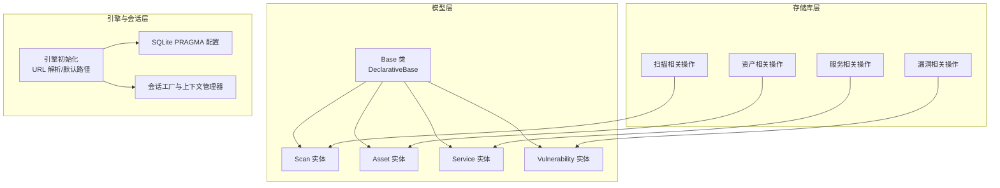
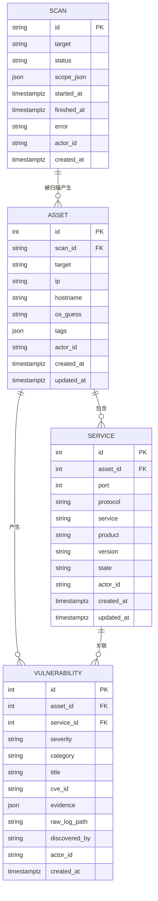
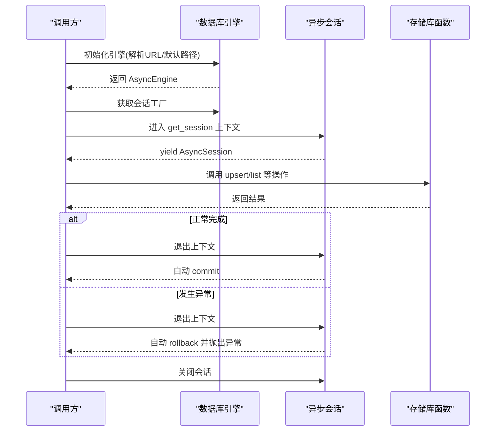
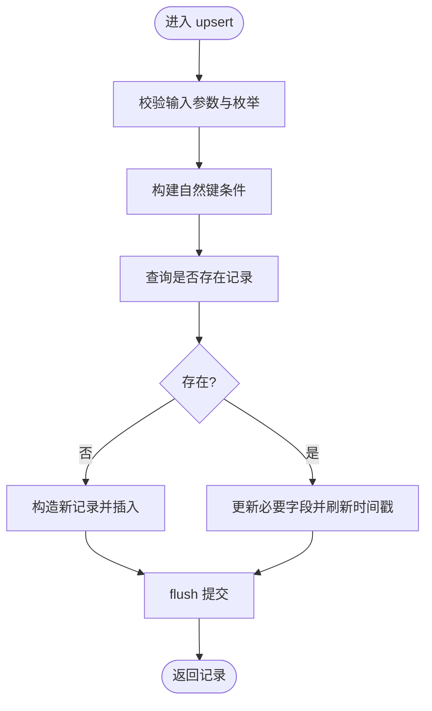
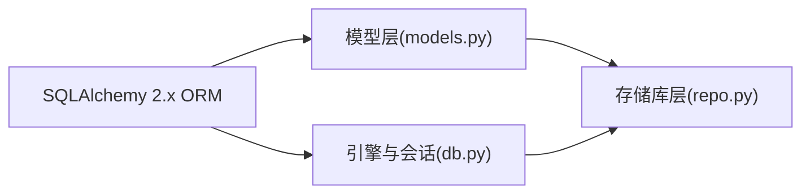

# 数据库架构设计

<cite>
**本文引用的文件**
- [models.py](file://secbot/cmdb/models.py)
- [db.py](file://secbot/cmdb/db.py)
- [repo.py](file://secbot/cmdb/repo.py)
- [20260507_initial.py](file://secbot/cmdb/migrations/versions/20260507_initial.py)
- [test_repo.py](file://tests/cmdb/test_repo.py)
- [conftest.py](file://tests/cmdb/conftest.py)
</cite>

## 目录
1. [简介](#简介)
2. [项目结构](#项目结构)
3. [核心组件](#核心组件)
4. [架构总览](#架构总览)
5. [详细组件分析](#详细组件分析)
6. [依赖分析](#依赖分析)
7. [性能考量](#性能考量)
8. [故障排查指南](#故障排查指南)
9. [结论](#结论)
10. [附录](#附录)

## 简介
本文件系统化阐述 CMDB（配置管理数据库）的数据库架构设计与实现，重点围绕 SQLAlchemy 2.x ORM 模型、多租户 actor_id 设计、核心实体表结构、索引与约束策略、以及连接配置、会话管理与事务处理最佳实践。文档同时给出查询优化建议与常见问题排查方法，帮助读者在不直接阅读源码的情况下快速掌握 CMDB 的数据层设计。

## 项目结构
CMDB 的数据层由三层组成：
- 模型层：定义 SQLAlchemy ORM 实体与基础基类
- 存储库层：封装 CRUD 与业务上的一致性操作（如幂等 upsert）
- 引擎与会话层：负责异步引擎初始化、连接参数、会话生命周期与事务提交/回滚

图表来源
- [models.py:34-178](file://secbot/cmdb/models.py#L34-L178)
- [db.py:64-133](file://secbot/cmdb/db.py#L64-L133)
- [repo.py:68-370](file://secbot/cmdb/repo.py#L68-L370)

章节来源
- [models.py:1-178](file://secbot/cmdb/models.py#L1-L178)
- [db.py:1-133](file://secbot/cmdb/db.py#L1-L133)
- [repo.py:1-370](file://secbot/cmdb/repo.py#L1-L370)

## 核心组件
- Base 抽象基类：统一所有表的声明式基类，确保命名约定与元数据一致
- 四大实体：Scan、Asset、Service、Vulnerability，分别承载扫描任务、发现资产、开放服务、漏洞记录
- 存储库函数：提供幂等 upsert、列表查询、状态更新等业务能力
- 引擎与会话：异步 SQLAlchemy 引擎、连接 PRAGMA 设置、会话上下文管理与事务控制

章节来源
- [models.py:34-178](file://secbot/cmdb/models.py#L34-L178)
- [repo.py:68-370](file://secbot/cmdb/repo.py#L68-L370)
- [db.py:64-133](file://secbot/cmdb/db.py#L64-L133)

## 架构总览
下图展示 CMDB 的核心实体关系与多租户字段 actor_id 的贯穿使用：

图表来源
- [models.py:38-178](file://secbot/cmdb/models.py#L38-L178)
- [20260507_initial.py:23-144](file://secbot/cmdb/migrations/versions/20260507_initial.py#L23-L144)

## 详细组件分析

### Base 抽象基类
- 设计理念：通过统一的 DeclarativeBase 基类，确保所有表共享一致的元数据与命名策略，便于迁移与扩展
- 作用范围：为 Scan、Asset、Service、Vulnerability 提供继承基础

章节来源
- [models.py:34-36](file://secbot/cmdb/models.py#L34-L36)

### Scan 实体
- 表结构要点
  - 主键：字符串类型，采用 ULID（26 字符），保证全局唯一且时间有序
  - 关键字段：目标、状态、范围 JSON、开始/结束时间戳、错误信息
  - 多租户：actor_id，非空，默认值为本地标识
  - 时间戳：created_at 使用服务器默认时间，便于审计
- 索引与约束
  - 复合索引：actor_id + status；actor_id + created_at，用于按租户过滤与排序
- 安全与一致性
  - 状态枚举校验在存储库层进行，避免非法状态写入
  - 通过 actor_id 过滤读写，确保多租户隔离

章节来源
- [models.py:38-60](file://secbot/cmdb/models.py#L38-L60)
- [20260507_initial.py:24-42](file://secbot/cmdb/migrations/versions/20260507_initial.py#L24-L42)
- [repo.py:68-134](file://secbot/cmdb/repo.py#L68-L134)

### Asset 实体
- 表结构要点
  - 主键：自增整数
  - 外键：scan_id 引用 Scan，删除策略为 RESTRICT，防止误删仍在使用的扫描记录
  - 资产属性：目标、IP、主机名、操作系统猜测、标签数组
  - 多租户与时间戳：actor_id、created_at、updated_at（自动更新）
- 关系映射
  - 与 Service：一对多，级联删除孤儿
  - 与 Vulnerability：一对多，级联删除孤儿
- 索引与约束
  - 复合索引：actor_id + ip；actor_id + hostname；scan_id 单列索引，支持按扫描与租户检索

章节来源
- [models.py:62-101](file://secbot/cmdb/models.py#L62-L101)
- [20260507_initial.py:44-74](file://secbot/cmdb/migrations/versions/20260507_initial.py#L44-L74)
- [repo.py:141-204](file://secbot/cmdb/repo.py#L141-L204)

### Service 实体
- 表结构要点
  - 主键：自增整数
  - 外键：asset_id 引用 Asset，删除策略 CASCADE，清理随资产一并移除的服务
  - 服务属性：端口、协议（tcp/udp）、服务名、产品、版本、状态（默认 open）
  - 多租户与时间戳：actor_id、created_at、updated_at
- 约束
  - 唯一约束：asset_id + port + protocol，确保同一资产同一端口协议仅一条记录
- 关系映射
  - 与 Asset：多对一
  - 与 Vulnerability：一对多

章节来源
- [models.py:103-137](file://secbot/cmdb/models.py#L103-L137)
- [20260507_initial.py:76-107](file://secbot/cmdb/migrations/versions/20260507_initial.py#L76-L107)
- [repo.py:211-274](file://secbot/cmdb/repo.py#L211-L274)

### Vulnerability 实体
- 表结构要点
  - 主键：自增整数
  - 外键：asset_id 引用 Asset（CASCADE），service_id 引用 Service（SET NULL），支持服务删除后保留漏洞归属
  - 漏洞属性：严重级别、类别、标题、CVE 编号、证据 JSON、原始日志路径、发现来源
  - 多租户与时间戳：actor_id、created_at
- 关系映射
  - 与 Asset：多对一
  - 与 Service：多对一（可空）
- 索引与约束
  - 复合索引：actor_id + severity + created_at；asset_id 单列索引，支撑按租户与严重级别排序与过滤

章节来源
- [models.py:139-171](file://secbot/cmdb/models.py#L139-L171)
- [20260507_initial.py:109-144](file://secbot/cmdb/migrations/versions/20260507_initial.py#L109-L144)
- [repo.py:281-370](file://secbot/cmdb/repo.py#L281-L370)

### 多租户 actor_id 设计
- 设计原则
  - 所有写入必须显式标注 actor_id
  - 所有读取必须以 actor_id 作为首要过滤条件
  - 默认 actor_id 为本地标识，保证单用户场景可用且未来权限扩展不破坏现有数据
- 实现要点
  - 字段非空且带服务器默认值
  - 存储库函数强制将 actor_id 放在第一个位置，并在查询中显式过滤
- 安全性考虑
  - 通过严格的 actor_id 过滤，避免跨租户数据泄露
  - 测试用例覆盖了跨租户隔离与枚举校验，确保行为正确

章节来源
- [models.py:5,27,49,75,117,157:5-5](file://secbot/cmdb/models.py#L5-L5)
- [repo.py:3-13,68-370:3-13](file://secbot/cmdb/repo.py#L3-L13)
- [test_repo.py:47-58,86-99,235-264:47-58](file://tests/cmdb/test_repo.py#L47-L58)

### 数据类型与字段设计
- 主键
  - Scan：String(ULID)，全局唯一且具备时间序
  - Asset/Service/Vulnerability：Integer(autoincrement)，简洁高效
- 外键
  - 严格参照关系模型，删除策略明确（RESTRICT/CASCADE/SET NULL）
- JSON
  - 用于结构化证据与标签，便于灵活扩展
- 时间戳
  - DateTime(timezone=True) + server_default(func.now())，统一 UTC 时区与时序
- 枚举与校验
  - 严重级别、扫描状态、漏洞类别、协议等在存储库层集中校验，避免脏数据进入

章节来源
- [models.py:15-25,30-31,41,65-68,106-109,142-148:15-25](file://secbot/cmdb/models.py#L15-L25)
- [repo.py:174-176,225,301-306:174-176](file://secbot/cmdb/repo.py#L174-L176)

### 索引策略与查询优化
- Scan
  - ix_scan_actor_status：按租户+状态过滤，适合状态轮询与调度
  - ix_scan_actor_created：按租户+时间倒序，适合分页与审计
- Asset
  - ix_asset_actor_ip / ix_asset_actor_hostname：按租户+网络属性过滤，加速资产检索
  - ix_asset_scan：按扫描过滤，支持按扫描批次导出
- Service
  - uq_service_asset_port_proto：消除重复服务记录，保证幂等 upsert
- Vulnerability
  - ix_vuln_actor_severity_created：按租户+严重级别+时间排序，适合高危优先展示
  - ix_vuln_asset：按资产过滤，支持资产详情页加载
- 查询建议
  - 优先使用复合索引前缀匹配（如 actor_id 开头）
  - 列表查询限制 limit，避免全表扫描
  - 对于高频过滤字段（状态、严重级别、协议）保持索引与枚举约束

章节来源
- [models.py:56-59,96-100,134-136,167-170:56-59](file://secbot/cmdb/models.py#L56-L59)
- [20260507_initial.py:41-42,72-74,104-106,139-143:41-42](file://secbot/cmdb/migrations/versions/20260507_initial.py#L41-L42)

### 数据库连接配置与会话管理
- 引擎初始化
  - 默认 SQLite 文件路径：支持环境变量覆盖，不存在则自动创建目录
  - WAL 模式启用，提升多读少写的并发性能
  - 同步/异步桥接事件监听，确保每个新连接应用 PRAGMA
- 会话管理
  - get_session 上下文管理器：自动提交或回滚，关闭会话，保证事务边界清晰
  - 仅通过该上下文获取会话，避免外部直接操作导致的事务泄漏
- 事务处理
  - 存储库函数不自行开启/提交事务，调用方负责事务生命周期，确保批量操作原子性

图表来源
- [db.py:64-133](file://secbot/cmdb/db.py#L64-L133)
- [repo.py:68-370](file://secbot/cmdb/repo.py#L68-L370)

章节来源
- [db.py:29-48,51-62,64-93,103-122:29-122](file://secbot/cmdb/db.py#L29-L122)
- [repo.py:11-12](file://secbot/cmdb/repo.py#L11-L12)

### 存储库层幂等 upsert 与一致性
- 资产 upsert：以 (actor_id, scan_id, target) 为自然键，重扫不重复
- 服务 upsert：以 (asset_id, port, protocol) 为自然键，支持 banner 更新
- 漏洞 upsert：以 (asset_id, service_id, title, cve_id) 为自然键，重发现仅更新证据与日志路径
- 枚举校验：在写入前统一校验严重级别、类别、状态、协议，失败即抛错

图表来源
- [repo.py:141-189,211-259,281-348:141-348](file://secbot/cmdb/repo.py#L141-L348)

章节来源
- [repo.py:3-13,141-348:3-13](file://secbot/cmdb/repo.py#L3-L13)

## 依赖分析
- 模型层依赖 SQLAlchemy 2.x ORM，使用 mapped_column、relationship、Index、UniqueConstraint 等特性
- 存储库层依赖模型层与 SQLAlchemy 异步会话，集中处理业务规则与幂等逻辑
- 引擎层依赖 SQLAlchemy 异步引擎与事件系统，负责连接池、PRAGMA 与生命周期管理

图表来源
- [models.py:15-25](file://secbot/cmdb/models.py#L15-L25)
- [db.py:17-23](file://secbot/cmdb/db.py#L17-L23)
- [repo.py:22-34](file://secbot/cmdb/repo.py#L22-L34)

章节来源
- [models.py:15-25](file://secbot/cmdb/models.py#L15-L25)
- [db.py:17-23](file://secbot/cmdb/db.py#L17-L23)
- [repo.py:22-34](file://secbot/cmdb/repo.py#L22-L34)

## 性能考量
- 连接与并发
  - WAL 模式减少短写入下的“数据库被锁定”问题，适合单写多读场景
  - 连接池 pre_ping 保障连接有效性，降低超时与重试成本
- 查询与索引
  - 优先使用复合索引前缀（actor_id 开头）进行过滤与排序
  - 控制列表查询的 limit，避免全表扫描
- 写入与幂等
  - upsert 自然键避免重复写入，减少索引冲突与回滚
  - flush 分批提交，平衡吞吐与一致性

章节来源
- [db.py:51-62,82,103-122:51-122](file://secbot/cmdb/db.py#L51-L122)
- [models.py:56-59,96-100,134-136,167-170:56-170](file://secbot/cmdb/models.py#L56-L170)
- [repo.py:141-189,211-259,281-348:141-348](file://secbot/cmdb/repo.py#L141-L348)

## 故障排查指南
- 无法连接数据库
  - 检查 SECBOT_HOME 或默认路径是否可写，确认 SQLite 文件存在
  - 确认引擎已初始化且未被提前 dispose
- 事务未提交或异常未回滚
  - 确保通过 get_session 上下文管理器使用会话
  - 避免在存储库函数内部自行 commit/rollback
- 多租户数据交叉
  - 确认所有读写均以 actor_id 作为首要过滤条件
  - 使用测试用例验证跨租户隔离
- 枚举值错误
  - 严重级别、类别、扫描状态、协议等均在存储库层校验，出现 ValueError 即为输入非法
- 查询性能差
  - 检查是否命中复合索引前缀
  - 适当增加 limit，避免一次性拉取大量数据

章节来源
- [db.py:96-100,103-122,125-133:96-133](file://secbot/cmdb/db.py#L96-L133)
- [repo.py:102-104,117,225,301-306:102-104](file://secbot/cmdb/repo.py#L102-L104)
- [test_repo.py:41-44,132-139,187-211,214-233:41-233](file://tests/cmdb/test_repo.py#L41-L233)

## 结论
本设计以 SQLAlchemy 2.x ORM 为基础，结合多租户 actor_id、幂等 upsert、复合索引与 WAL 并发优化，构建了面向安全扫描与资产管理的轻量级 CMDB。通过严格的枚举校验与会话事务边界，既保证了数据一致性，也为未来扩展（如细粒度权限）预留空间。遵循本文档的连接配置、会话管理与查询优化建议，可在生产环境中获得稳定、可维护且高性能的数据层。

## 附录
- 迁移脚本
  - 初始版本包含四张表与相应索引/约束，后续可通过 Alembic 维护演进
- 测试用例
  - 覆盖多租户隔离、幂等 upsert、枚举校验与列表过滤等关键行为

章节来源
- [20260507_initial.py:23-159](file://secbot/cmdb/migrations/versions/20260507_initial.py#L23-L159)
- [test_repo.py:22-27,47-58,65-84,106-130,147-185,214-233,235-264:22-264](file://tests/cmdb/test_repo.py#L22-L264)
- [conftest.py:23-36](file://tests/cmdb/conftest.py#L23-L36)