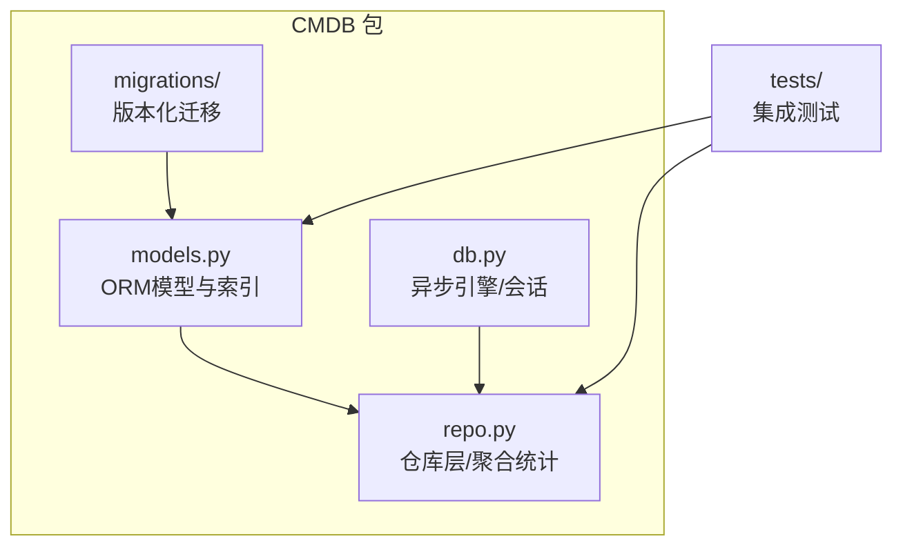
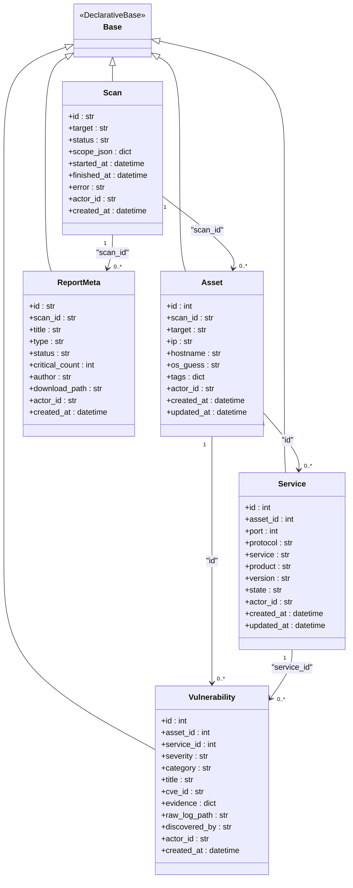
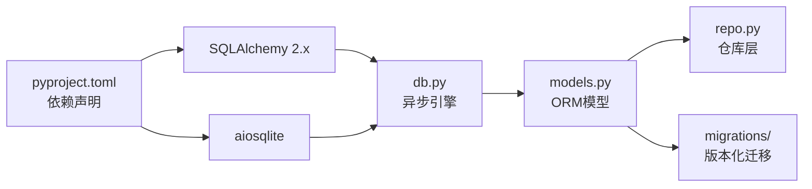

# 数据模型设计

<cite>
**本文引用的文件列表**
- [models.py](file://secbot/cmdb/models.py)
- [db.py](file://secbot/cmdb/db.py)
- [repo.py](file://secbot/cmdb/repo.py)
- [20260507_initial.py](file://secbot/cmdb/migrations/versions/20260507_initial.py)
- [20260510_report_meta.py](file://secbot/cmdb/migrations/versions/20260510_report_meta.py)
- [__init__.py](file://secbot/cmdb/__init__.py)
- [conftest.py](file://tests/cmdb/conftest.py)
- [test_repo.py](file://tests/cmdb/test_repo.py)
- [pyproject.toml](file://pyproject.toml)
</cite>

## 目录
1. [简介](#简介)
2. [项目结构](#项目结构)
3. [核心组件](#核心组件)
4. [架构总览](#架构总览)
5. [详细组件分析](#详细组件分析)
6. [依赖关系分析](#依赖关系分析)
7. [性能考量](#性能考量)
8. [故障排查指南](#故障排查指南)
9. [结论](#结论)
10. [附录](#附录)

## 简介
本文件面向VAPT3的CMDB数据模型设计，系统性阐述基于SQLite与SQLAlchemy ORM的建模理念与实现细节。重点包括：
- DeclarativeBase基类的设计模式与表继承体系
- 核心实体模型：Asset、Service、Vulnerability、Scan、ReportMeta 的字段、索引、外键与关系
- 多租户actor_id隔离机制与安全性考虑
- 模型间的一对多、多对一、级联删除等约束
- 使用示例、最佳实践、数据验证与查询优化建议
- 业务逻辑约束与数据完整性保障机制

## 项目结构
CMDB相关代码集中在 secbot/cmdb 包内，采用“模型-仓库-数据库引擎”分层：
- models.py：定义ORM模型与索引约束
- db.py：异步引擎与会话管理（SQLite WAL + aiosqlite）
- repo.py：仓库层封装增删改查与聚合统计
- migrations：Alembic迁移脚本，确保数据库演进一致性
- tests：端到端测试覆盖多租户隔离、状态机与枚举校验

图表来源
- [models.py:1-263](file://secbot/cmdb/models.py#L1-L263)
- [db.py:1-133](file://secbot/cmdb/db.py#L1-L133)
- [repo.py:1-994](file://secbot/cmdb/repo.py#L1-L994)
- [20260507_initial.py:1-159](file://secbot/cmdb/migrations/versions/20260507_initial.py#L1-L159)
- [20260510_report_meta.py:1-72](file://secbot/cmdb/migrations/versions/20260510_report_meta.py#L1-L72)

章节来源
- [models.py:1-263](file://secbot/cmdb/models.py#L1-L263)
- [db.py:1-133](file://secbot/cmdb/db.py#L1-L133)
- [repo.py:1-994](file://secbot/cmdb/repo.py#L1-L994)
- [20260507_initial.py:1-159](file://secbot/cmdb/migrations/versions/20260507_initial.py#L1-L159)
- [20260510_report_meta.py:1-72](file://secbot/cmdb/migrations/versions/20260510_report_meta.py#L1-L72)

## 核心组件
- DeclarativeBase基类：所有业务表均继承自该基类，统一元数据与方言支持
- Scan：扫描任务，包含状态、时间戳、错误信息与作用域JSON
- Asset：资产，绑定到一次扫描，记录目标、IP、主机名、操作系统猜测与标签JSON
- Service：服务，属于资产，记录端口、协议、产品/版本等，并通过唯一约束防止重复
- Vulnerability：漏洞，可选归属服务，记录严重级别、类别、证据JSON、原始日志路径等
- ReportMeta：报告元数据，记录报告标题、类型、状态、关键数、作者与下载路径
- 多租户actor_id：每张表均包含actor_id列，作为读写过滤的第一条件，确保跨租户隔离
- 枚举与校验：严重级别、扫描状态、漏洞类别、报告类型/状态等在模型与仓库层共同维护

章节来源
- [models.py:34-263](file://secbot/cmdb/models.py#L34-L263)
- [repo.py:26-40](file://secbot/cmdb/repo.py#L26-L40)

## 架构总览
下图展示模型与仓库层的交互关系，以及多租户隔离如何贯穿读写流程。

图表来源
- [models.py:38-218](file://secbot/cmdb/models.py#L38-L218)

章节来源
- [models.py:34-218](file://secbot/cmdb/models.py#L34-L218)

## 详细组件分析

### DeclarativeBase基类与表继承体系
- 设计要点
  - 统一的Base类承载元数据与方言配置，所有业务表继承自Base
  - 通过mapped_column与relationship声明字段与关系，遵循SQLAlchemy 2.x约定式映射
- 实现位置
  - [models.py:34-36](file://secbot/cmdb/models.py#L34-L36)

章节来源
- [models.py:34-36](file://secbot/cmdb/models.py#L34-L36)

### Scan（扫描任务）模型
- 字段与索引
  - 主键：字符串ULID
  - 状态：默认“queued”，仓库层维护合法状态集合
  - 时间戳：started_at/finished_at/error用于生命周期追踪
  - 作用域JSON：scope_json用于存储扫描范围配置
  - 索引：actor_id+status、actor_id+created_at，便于按租户与状态检索
- 关系
  - 一对多：Scan → Asset（RESTRICT删除策略，避免误删未清理的资产）
- 时间戳与状态机
  - 仓库层在状态切换时自动填充started_at/finished_at，并在失败时写入error
- 参考路径
  - [models.py:38-59](file://secbot/cmdb/models.py#L38-L59)
  - [20260507_initial.py:23-42](file://secbot/cmdb/migrations/versions/20260507_initial.py#L23-L42)
  - [repo.py:76-141](file://secbot/cmdb/repo.py#L76-L141)

章节来源
- [models.py:38-59](file://secbot/cmdb/models.py#L38-L59)
- [20260507_initial.py:23-42](file://secbot/cmdb/migrations/versions/20260507_initial.py#L23-L42)
- [repo.py:76-141](file://secbot/cmdb/repo.py#L76-L141)

### Asset（资产）模型
- 字段与索引
  - 外键：scan_id → Scan.id（RESTRICT），确保扫描任务存在
  - 标签JSON：tags，保留system与type键，分别用于系统聚类与资产类型分布
  - 更新时间：updated_at自动更新，便于审计与增量同步
  - 索引：actor_id+ip、actor_id+hostname、scan_id
- 关系
  - 一对多：Asset → Service、Asset → Vulnerability（级联删除或孤儿删除由仓库层upsert保证幂等）
- 参考路径
  - [models.py:62-104](file://secbot/cmdb/models.py#L62-L104)
  - [20260507_initial.py:44-74](file://secbot/cmdb/migrations/versions/20260507_initial.py#L44-L74)
  - [repo.py:149-205](file://secbot/cmdb/repo.py#L149-L205)

章节来源
- [models.py:62-104](file://secbot/cmdb/models.py#L62-L104)
- [20260507_initial.py:44-74](file://secbot/cmdb/migrations/versions/20260507_initial.py#L44-L74)
- [repo.py:149-205](file://secbot/cmdb/repo.py#L149-L205)

### Service（服务）模型
- 字段与唯一约束
  - 唯一约束：(asset_id, port, protocol)，防止同一资产同端口协议重复插入
  - 协议：仅允许tcp/udp
  - 状态：默认open
  - 作用域JSON：product/version/service等
- 外键与级联
  - 资产外键：asset_id → Asset.id（CASCADE），删除资产时级联删除服务
- 参考路径
  - [models.py:107-140](file://secbot/cmdb/models.py#L107-L140)
  - [20260507_initial.py:76-107](file://secbot/cmdb/migrations/versions/20260507_initial.py#L76-L107)
  - [repo.py:227-275](file://secbot/cmdb/repo.py#L227-L275)

章节来源
- [models.py:107-140](file://secbot/cmdb/models.py#L107-L140)
- [20260507_initial.py:76-107](file://secbot/cmdb/migrations/versions/20260507_initial.py#L76-L107)
- [repo.py:227-275](file://secbot/cmdb/repo.py#L227-L275)

### Vulnerability（漏洞）模型
- 字段与JSON设计
  - 严重级别：枚举集合，仓库层校验
  - 类别：枚举集合，仓库层校验
  - 证据JSON：evidence，支持任意结构
  - 原始日志路径：raw_log_path
- 外键与关系
  - 资产外键：asset_id → Asset.id（CASCADE）
  - 服务外键：service_id → Service.id（SET NULL），允许服务被删除后仍保留漏洞记录
- 索引
  - actor_id+severity+created_at、asset_id，支持按严重级别趋势与资产维度查询
- 参考路径
  - [models.py:143-174](file://secbot/cmdb/models.py#L143-L174)
  - [20260507_initial.py:109-144](file://secbot/cmdb/migrations/versions/20260507_initial.py#L109-L144)
  - [repo.py:297-384](file://secbot/cmdb/repo.py#L297-L384)

章节来源
- [models.py:143-174](file://secbot/cmdb/models.py#L143-L174)
- [20260507_initial.py:109-144](file://secbot/cmdb/migrations/versions/20260507_initial.py#L109-L144)
- [repo.py:297-384](file://secbot/cmdb/repo.py#L297-L384)

### ReportMeta（报告元数据）模型
- 字段与索引
  - 报告ID：公共可路由ID，按日期+序号生成，避免跨租户冲突
  - 扫描外键：scan_id → Scan.id（RESTRICT）
  - 状态：枚举集合，受状态机约束
  - 关键数：critical_count
  - 下载路径：download_path
  - 索引：actor_id+status+created_at、scan_id
- 参考路径
  - [models.py:177-218](file://secbot/cmdb/models.py#L177-L218)
  - [20260510_report_meta.py:24-63](file://secbot/cmdb/migrations/versions/20260510_report_meta.py#L24-L63)
  - [repo.py:810-964](file://secbot/cmdb/repo.py#L810-L964)

章节来源
- [models.py:177-218](file://secbot/cmdb/models.py#L177-L218)
- [20260510_report_meta.py:24-63](file://secbot/cmdb/migrations/versions/20260510_report_meta.py#L24-L63)
- [repo.py:810-964](file://secbot/cmdb/repo.py#L810-L964)

### 多租户actor_id设计与安全
- 设计原则
  - 每个业务表均包含actor_id列，默认值为“local”，确保单用户场景可用
  - 读取与写入均强制以actor_id过滤，仓库层所有查询均显式携带actor_id
  - actor_id列为非空，为未来RBAC扩展预留空间且不破坏现有迁移
- 测试验证
  - 测试覆盖跨actor隔离，确保不同租户间数据互不可见
- 参考路径
  - [models.py:5-7](file://secbot/cmdb/models.py#L5-L7)
  - [repo.py:5-13](file://secbot/cmdb/repo.py#L5-L13)
  - [test_repo.py:47-58](file://tests/cmdb/test_repo.py#L47-L58)
  - [test_repo.py:235-264](file://tests/cmdb/test_repo.py#L235-L264)

章节来源
- [models.py:5-7](file://secbot/cmdb/models.py#L5-L7)
- [repo.py:5-13](file://secbot/cmdb/repo.py#L5-L13)
- [test_repo.py:47-58](file://tests/cmdb/test_repo.py#L47-L58)
- [test_repo.py:235-264](file://tests/cmdb/test_repo.py#L235-L264)

### 模型间关联关系与约束
- 一对多
  - Scan → Asset：RESTRICT删除，避免误删未清理的资产
  - Asset → Service：CASCADE删除，删除资产时清理服务
  - Asset → Vulnerability：通过仓库层upsert保证幂等，删除策略由业务决定
- 多对一
  - Asset ← Vulnerability：服务可为空，支持无服务的漏洞
  - Service ← Vulnerability：服务可为空，支持无服务的漏洞
- 级联删除策略
  - Service → Vulnerability：SET NULL，删除服务后保留漏洞记录
- 参考路径
  - [models.py:66-152](file://secbot/cmdb/models.py#L66-L152)
  - [20260507_initial.py:48-123](file://secbot/cmdb/migrations/versions/20260507_initial.py#L48-L123)

章节来源
- [models.py:66-152](file://secbot/cmdb/models.py#L66-L152)
- [20260507_initial.py:48-123](file://secbot/cmdb/migrations/versions/20260507_initial.py#L48-L123)

### 使用示例与最佳实践
- 创建扫描并更新状态
  - 使用仓库层create_scan与update_scan_status，自动填充时间戳与错误信息
  - 参考路径：[repo.py:76-141](file://secbot/cmdb/repo.py#L76-L141)
- 插入/更新资产（幂等）
  - 使用upsert_asset，按actor_id+scan_id+target去重，支持多次扫描合并
  - 参考路径：[repo.py:149-205](file://secbot/cmdb/repo.py#L149-L205)
- 插入/更新服务（幂等）
  - 使用upsert_service，按(资产ID, 端口, 协议)去重，支持banner信息增量更新
  - 参考路径：[repo.py:227-275](file://secbot/cmdb/repo.py#L227-L275)
- 插入/更新漏洞（幂等）
  - 使用upsert_vulnerability，按(资产ID, 服务ID, 标题, CVE)去重，支持证据与日志路径更新
  - 参考路径：[repo.py:297-384](file://secbot/cmdb/repo.py#L297-L384)
- 查询与过滤
  - 列表接口均以actor_id过滤，支持按严重级别、资产ID等条件筛选
  - 参考路径：[repo.py:278-405](file://secbot/cmdb/repo.py#L278-L405)
- 聚合统计
  - 提供摘要计数、趋势、分布与集群等只读聚合函数，返回纯Python结构
  - 参考路径：[repo.py:456-758](file://secbot/cmdb/repo.py#L456-L758)

章节来源
- [repo.py:76-405](file://secbot/cmdb/repo.py#L76-L405)
- [repo.py:456-758](file://secbot/cmdb/repo.py#L456-L758)

### 数据验证与业务约束
- 枚举校验
  - 严重级别、扫描状态、漏洞类别、报告类型/状态均由仓库层校验
  - 参考路径：[models.py:221-253](file://secbot/cmdb/models.py#L221-L253)
- 协议限制
  - 服务协议仅允许tcp/udp
  - 参考路径：[repo.py:241-242](file://secbot/cmdb/repo.py#L241-L242)
- 状态机
  - 报告状态转换严格遵循预定义状态机，非法转换抛出异常
  - 参考路径：[models.py:255-262](file://secbot/cmdb/models.py#L255-L262)
  - [repo.py:931-964](file://secbot/cmdb/repo.py#L931-L964)

章节来源
- [models.py:221-262](file://secbot/cmdb/models.py#L221-L262)
- [repo.py:241-242](file://secbot/cmdb/repo.py#L241-L242)
- [repo.py:931-964](file://secbot/cmdb/repo.py#L931-L964)

## 依赖关系分析
- 引擎与方言
  - 使用SQLAlchemy 2.x异步引擎与aiosqlite驱动，启用WAL模式提升并发读写稳定性
  - 参考路径：[db.py:78-93](file://secbot/cmdb/db.py#L78-L93)
- 迁移与版本控制
  - Alembic版本化迁移，初始版本包含资产/服务/漏洞/扫描表，后续增加报告元数据表
  - 参考路径：[20260507_initial.py:23-158](file://secbot/cmdb/migrations/versions/20260507_initial.py#L23-L158)
  - [20260510_report_meta.py:24-71](file://secbot/cmdb/migrations/versions/20260510_report_meta.py#L24-L71)
- 依赖声明
  - 项目在pyproject.toml中声明sqlalchemy[asyncio]与aiosqlite依赖
  - 参考路径：[pyproject.toml:65-67](file://pyproject.toml#L65-L67)

图表来源
- [pyproject.toml:65-67](file://pyproject.toml#L65-L67)
- [db.py:78-93](file://secbot/cmdb/db.py#L78-L93)
- [models.py:15-25](file://secbot/cmdb/models.py#L15-L25)
- [repo.py:26-40](file://secbot/cmdb/repo.py#L26-L40)

章节来源
- [pyproject.toml:65-67](file://pyproject.toml#L65-L67)
- [db.py:78-93](file://secbot/cmdb/db.py#L78-L93)
- [models.py:15-25](file://secbot/cmdb/models.py#L15-L25)
- [repo.py:26-40](file://secbot/cmdb/repo.py#L26-L40)

## 性能考量
- 索引设计
  - Scan：actor_id+status、actor_id+created_at，支持按租户与状态快速筛选
  - Asset：actor_id+ip、actor_id+hostname、scan_id，支持按目标与扫描维度检索
  - Vulnerability：actor_id+severity+created_at、asset_id，支持趋势与资产维度查询
  - ReportMeta：actor_id+status+created_at、scan_id，支持报告列表与按扫描过滤
- 并发与锁
  - WAL模式与busy_timeout减少短事务下的“database is locked”问题
  - 参考路径：[db.py:51-61](file://secbot/cmdb/db.py#L51-L61)
- 查询优化建议
  - 在高频过滤字段上使用复合索引（如actor_id+status）
  - 使用仓库层提供的聚合函数替代复杂JOIN，降低查询复杂度
  - 对大结果集使用limit与分页参数，避免一次性加载过多数据

章节来源
- [models.py:56-104](file://secbot/cmdb/models.py#L56-L104)
- [models.py:171-174](file://secbot/cmdb/models.py#L171-L174)
- [models.py:210-218](file://secbot/cmdb/models.py#L210-L218)
- [db.py:51-61](file://secbot/cmdb/db.py#L51-L61)
- [repo.py:101-114](file://secbot/cmdb/repo.py#L101-L114)
- [repo.py:278-289](file://secbot/cmdb/repo.py#L278-L289)
- [repo.py:387-405](file://secbot/cmdb/repo.py#L387-L405)

## 故障排查指南
- 多租户隔离问题
  - 症状：跨租户数据可见
  - 排查：确认仓库层查询是否携带actor_id过滤
  - 参考路径：[test_repo.py:47-58](file://tests/cmdb/test_repo.py#L47-L58)
  - [test_repo.py:235-264](file://tests/cmdb/test_repo.py#L235-L264)
- 状态机非法转换
  - 症状：更新报告状态抛出异常
  - 排查：检查新状态是否在状态机允许范围内
  - 参考路径：[repo.py:931-964](file://secbot/cmdb/repo.py#L931-L964)
- 枚举值非法
  - 症状：插入漏洞/服务时报错
  - 排查：核对严重级别、类别、协议、报告类型/状态是否在允许集合内
  - 参考路径：[repo.py:317-322](file://secbot/cmdb/repo.py#L317-L322)
  - [repo.py:241-242](file://secbot/cmdb/repo.py#L241-L242)
  - [repo.py:830-837](file://secbot/cmdb/repo.py#L830-L837)
- 数据库连接问题
  - 症状：并发写入报错或锁等待
  - 排查：确认WAL模式已启用，必要时调整busy_timeout
  - 参考路径：[db.py:51-61](file://secbot/cmdb/db.py#L51-L61)

章节来源
- [test_repo.py:47-58](file://tests/cmdb/test_repo.py#L47-L58)
- [test_repo.py:235-264](file://tests/cmdb/test_repo.py#L235-L264)
- [repo.py:931-964](file://secbot/cmdb/repo.py#L931-L964)
- [repo.py:317-322](file://secbot/cmdb/repo.py#L317-L322)
- [repo.py:241-242](file://secbot/cmdb/repo.py#L241-L242)
- [repo.py:830-837](file://secbot/cmdb/repo.py#L830-L837)
- [db.py:51-61](file://secbot/cmdb/db.py#L51-L61)

## 结论
本设计以SQLite + SQLAlchemy ORM为核心，围绕多租户actor_id隔离与幂等upsert策略构建了完整的CMDB数据模型。通过合理的索引、外键与级联策略，结合仓库层的严格校验与状态机，实现了高一致性与可维护性。迁移脚本确保schema演进可控，测试覆盖验证了关键行为（隔离、幂等、校验）。建议在生产环境中持续关注查询性能与索引命中率，并在多租户扩展时逐步完善鉴权与审计能力。

## 附录
- 初始化与会话管理
  - 使用get_session获取异步会话，确保所有CMDB读写通过该入口进行
  - 参考路径：[db.py:103-122](file://secbot/cmdb/db.py#L103-L122)
- 包导出
  - 仅通过cmdb包导出get_session与模型类，禁止外部直接使用底层驱动
  - 参考路径：[__init__.py:13-25](file://secbot/cmdb/__init__.py#L13-L25)
- 测试环境
  - 每个测试使用独立SQLite文件，确保连接共享与状态隔离
  - 参考路径：[conftest.py:23-36](file://tests/cmdb/conftest.py#L23-L36)

章节来源
- [db.py:103-122](file://secbot/cmdb/db.py#L103-L122)
- [__init__.py:13-25](file://secbot/cmdb/__init__.py#L13-L25)
- [conftest.py:23-36](file://tests/cmdb/conftest.py#L23-L36)