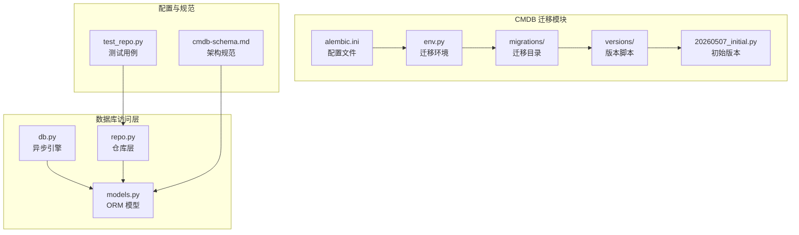
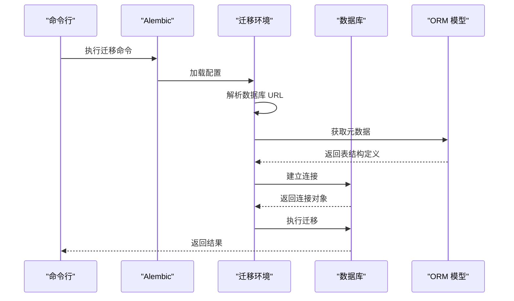
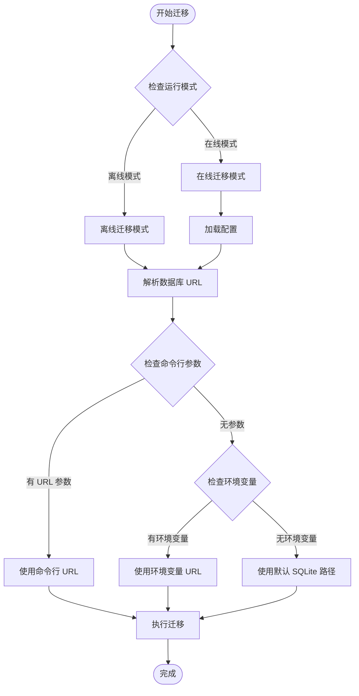
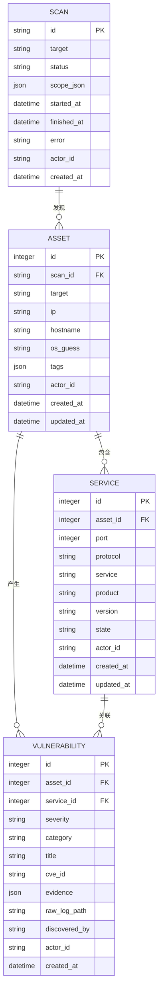
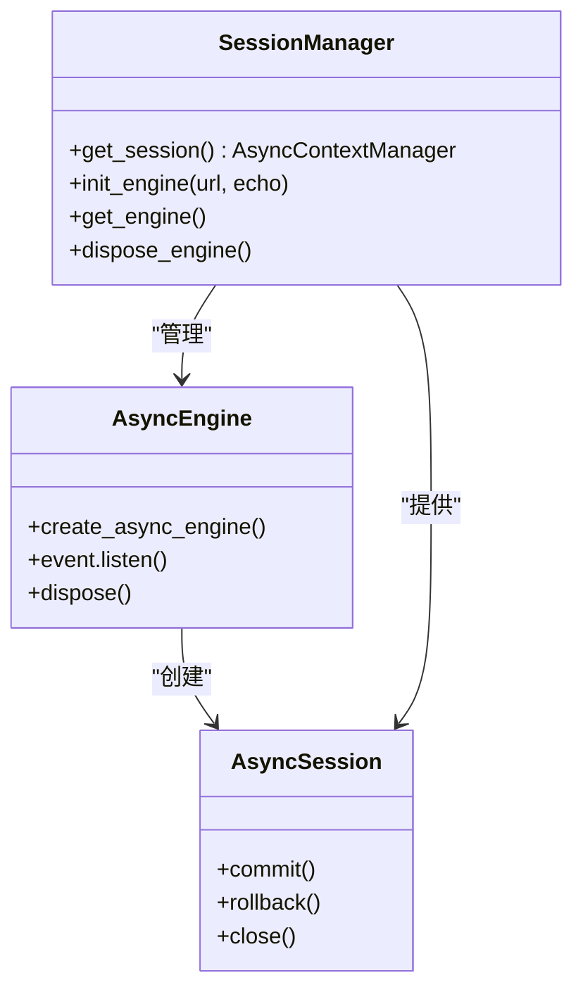
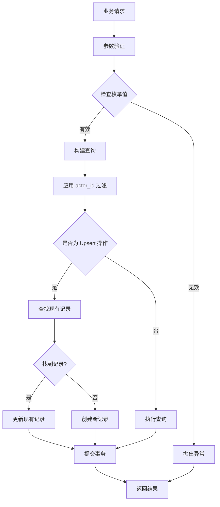
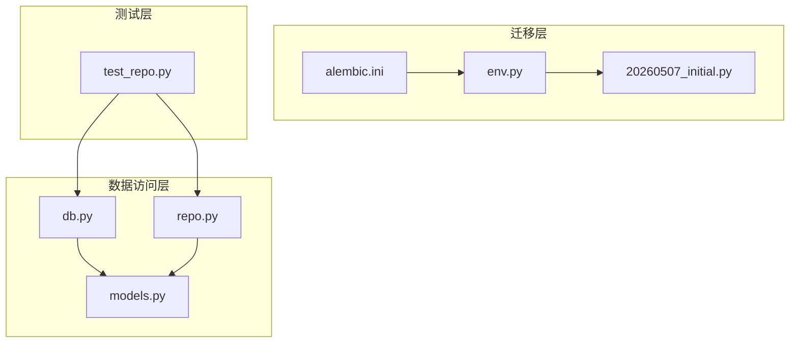
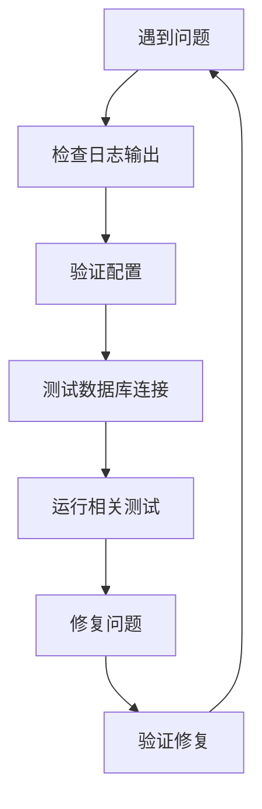

# 数据迁移管理

<cite>
**本文档引用的文件**
- [env.py](file://secbot/cmdb/migrations/env.py)
- [alembic.ini](file://secbot/cmdb/alembic.ini)
- [20260507_initial.py](file://secbot/cmdb/migrations/versions/20260507_initial.py)
- [db.py](file://secbot/cmdb/db.py)
- [models.py](file://secbot/cmdb/models.py)
- [repo.py](file://secbot/cmdb/repo.py)
- [cmdb-schema.md](file://.trellis/spec/backend/cmdb-schema.md)
- [test_repo.py](file://tests/cmdb/test_repo.py)
- [__init__.py](file://secbot/cmdb/__init__.py)
</cite>

## 目录
1. [简介](#简介)
2. [项目结构](#项目结构)
3. [核心组件](#核心组件)
4. [架构概览](#架构概览)
5. [详细组件分析](#详细组件分析)
6. [依赖关系分析](#依赖关系分析)
7. [性能考虑](#性能考虑)
8. [故障排查指南](#故障排查指南)
9. [结论](#结论)
10. [附录](#附录)

## 简介

本文件为数据迁移管理的综合文档，专注于 Alembic 迁移框架在 Nanobot 项目中的配置与使用。文档涵盖迁移环境设置、版本管理策略、初始数据库结构迁移脚本实现、数据库演进过程、迁移脚本编写规范与最佳实践、迁移命令使用方法、多环境部署中的迁移管理方案以及数据一致性保证机制。通过深入分析 secbot/cmdb 模块中的迁移配置、模型定义和仓库层实现，为开发者提供一套完整的数据迁移管理指南。

## 项目结构

Nanobot 项目采用模块化设计，数据迁移管理集中在 secbot/cmdb 目录下，包含以下关键文件：

**图表来源**
- [env.py:1-78](file://secbot/cmdb/migrations/env.py#L1-L78)
- [alembic.ini:1-45](file://secbot/cmdb/alembic.ini#L1-L45)
- [20260507_initial.py:1-159](file://secbot/cmdb/migrations/versions/20260507_initial.py#L1-L159)
- [db.py:1-133](file://secbot/cmdb/db.py#L1-L133)
- [models.py:1-178](file://secbot/cmdb/models.py#L1-L178)
- [repo.py:1-370](file://secbot/cmdb/repo.py#L1-L370)

**章节来源**
- [env.py:1-78](file://secbot/cmdb/migrations/env.py#L1-L78)
- [alembic.ini:1-45](file://secbot/cmdb/alembic.ini#L1-L45)
- [db.py:1-133](file://secbot/cmdb/db.py#L1-L133)
- [models.py:1-178](file://secbot/cmdb/models.py#L1-L178)
- [repo.py:1-370](file://secbot/cmdb/repo.py#L1-L370)

## 核心组件

### Alembic 配置系统

Alembic 是 Python 的数据库迁移工具，支持在线和离线模式执行迁移。在 Nanobot 中，配置系统通过以下组件协同工作：

- **配置文件 (alembic.ini)**：定义迁移脚本位置、日志配置和路径分隔符
- **环境配置 (env.py)**：处理数据库连接 URL 解析和迁移执行逻辑
- **版本脚本**：具体的数据结构变更定义

### 数据库访问层

- **异步引擎 (db.py)**：提供 SQLite 异步连接，启用 WAL 模式以支持并发读写
- **ORM 模型 (models.py)**：定义业务实体及其关系约束
- **仓库层 (repo.py)**：提供高级操作接口，确保数据一致性和多租户隔离

### 架构规范

cmdb-schema.md 定义了严格的写入纪律和多租户保留机制，确保数据迁移的可追溯性和安全性。

**章节来源**
- [alembic.ini:1-45](file://secbot/cmdb/alembic.ini#L1-L45)
- [env.py:1-78](file://secbot/cmdb/migrations/env.py#L1-L78)
- [db.py:1-133](file://secbot/cmdb/db.py#L1-L133)
- [models.py:1-178](file://secbot/cmdb/models.py#L1-L178)
- [repo.py:1-370](file://secbot/cmdb/repo.py#L1-L370)
- [cmdb-schema.md:1-130](file://.trellis/spec/backend/cmdb-schema.md#L1-L130)

## 架构概览

**图表来源**
- [env.py:59-77](file://secbot/cmdb/migrations/env.py#L59-L77)
- [alembic.ini:4-8](file://secbot/cmdb/alembic.ini#L4-L8)

该架构展示了从命令行到数据库的完整迁移流程，包括配置解析、连接建立和迁移执行等关键步骤。

## 详细组件分析

### 迁移环境配置

迁移环境通过 env.py 实现灵活的数据库连接管理：

**图表来源**
- [env.py:33-77](file://secbot/cmdb/migrations/env.py#L33-L77)

迁移环境支持三种 URL 解析优先级：
1. 命令行参数覆盖
2. 环境变量配置
3. 默认 SQLite 文件路径

**章节来源**
- [env.py:1-78](file://secbot/cmdb/migrations/env.py#L1-L78)

### 初始数据库结构

初始版本脚本定义了完整的 CMDB 架构，包含四个核心表：

**图表来源**
- [20260507_initial.py:23-159](file://secbot/cmdb/migrations/versions/20260507_initial.py#L23-L159)
- [models.py:38-170](file://secbot/cmdb/models.py#L38-L170)

每个表都实现了特定的约束和索引策略：
- **Scan 表**：使用 ULID 作为主键，包含状态跟踪和时间戳字段
- **Asset 表**：通过 scan_id 关联到扫描任务，支持 IP 和主机名索引
- **Service 表**：唯一约束确保端口协议组合的唯一性
- **Vulnerability 表**：支持服务关联和多维索引优化查询

**章节来源**
- [20260507_initial.py:1-159](file://secbot/cmdb/migrations/versions/20260507_initial.py#L1-L159)
- [models.py:1-178](file://secbot/cmdb/models.py#L1-L178)

### 异步数据库引擎

数据库引擎通过 db.py 提供高性能的异步连接管理：

**图表来源**
- [db.py:64-133](file://secbot/cmdb/db.py#L64-L133)

关键特性包括：
- **WAL 模式**：启用写前日志以支持并发读写
- **连接池预检测**：通过 pool_pre_ping 确保连接有效性
- **自动 pragma 设置**：在新连接上应用性能优化参数

**章节来源**
- [db.py:1-133](file://secbot/cmdb/db.py#L1-L133)

### 仓库层设计

仓库层提供了业务逻辑封装和数据一致性保证：

**图表来源**
- [repo.py:141-348](file://secbot/cmdb/repo.py#L141-L348)

仓库层实现了严格的数据治理规则：
- **多租户隔离**：所有查询强制包含 actor_id 条件
- **幂等性保证**：基于自然键的 upsert 操作避免重复数据
- **枚举验证**：严格的值域检查防止数据污染

**章节来源**
- [repo.py:1-370](file://secbot/cmdb/repo.py#L1-L370)
- [cmdb-schema.md:100-125](file://.trellis/spec/backend/cmdb-schema.md#L100-L125)

## 依赖关系分析

**图表来源**
- [env.py:23](file://secbot/cmdb/migrations/env.py#L23)
- [models.py:25](file://secbot/cmdb/models.py#L25)
- [repo.py:25](file://secbot/cmdb/repo.py#L25)

主要依赖关系：
- env.py 依赖 models.py 中的 Base 元数据
- 迁移脚本依赖 Alembic API 进行结构变更
- 仓库层依赖 ORM 模型进行数据操作
- 测试用例依赖仓库层和数据库引擎

**章节来源**
- [env.py:23-30](file://secbot/cmdb/migrations/env.py#L23-L30)
- [models.py:25](file://secbot/cmdb/models.py#L25)
- [repo.py:25](file://secbot/cmdb/repo.py#L25)

## 性能考虑

### SQLite 性能优化

数据库引擎通过多种机制优化性能：

1. **WAL 模式**：启用写前日志，支持单写者多读者架构
2. **连接池优化**：使用 pool_pre_ping 确保连接可用性
3. **pragma 参数调优**：
   - synchronous=NORMAL 平衡性能和安全性
   - foreign_keys=ON 启用外键约束检查
   - busy_timeout=5000 减少锁等待超时

### 查询性能优化

迁移脚本中创建的索引策略：
- **Scan 表**：actor_id + status 组合索引优化状态查询
- **Asset 表**：IP 和主机名索引支持快速查找
- **Vulnerability 表**：多维索引支持严重程度和时间过滤

### 并发控制

通过异步引擎和 WAL 模式实现：
- 支持高并发读取操作
- 防止 "database is locked" 错误
- 保持数据一致性和完整性

## 故障排查指南

### 常见迁移问题

1. **数据库连接失败**
   - 检查 SECBOT_CMDB_URL 环境变量
   - 验证 SQLite 文件权限
   - 确认数据库文件路径存在

2. **迁移执行错误**
   - 查看 Alembic 日志输出
   - 检查数据库版本状态
   - 验证迁移脚本语法

3. **数据一致性问题**
   - 使用测试用例验证数据完整性
   - 检查 actor_id 隔离规则
   - 验证 upsert 操作的幂等性

### 调试技巧

**章节来源**
- [test_repo.py:1-265](file://tests/cmdb/test_repo.py#L1-L265)
- [db.py:51-62](file://secbot/cmdb/db.py#L51-L62)

### 数据修复方法

当发现数据不一致时，可以采用以下策略：

1. **使用测试夹具**：通过 tmp_cmdb 创建隔离的测试环境
2. **执行回滚重试**：先 downgrade 再 upgrade 修复结构问题
3. **手动数据修正**：通过仓库层提供的接口进行数据修正
4. **备份恢复**：在生产环境中谨慎使用备份恢复策略

## 结论

Nanobot 项目的数据迁移管理体现了现代数据库治理的最佳实践。通过 Alembic 框架、严格的架构规范和完善的测试体系，实现了安全、可追溯、高性能的数据演进管理。关键优势包括：

- **多层防护**：从配置、模型到仓库层的全方位数据治理
- **并发友好**：基于 WAL 模式的高性能并发支持
- **可追溯性**：完整的迁移历史和版本控制
- **测试驱动**：全面的测试用例确保数据一致性

这套体系为复杂系统的数据库演进提供了可靠的基础设施，适用于需要长期维护和扩展的数据密集型应用。

## 附录

### 迁移命令参考

- **应用到最新版本**：`alembic -c secbot/cmdb/alembic.ini upgrade head`
- **降级到指定版本**：`alembic -c secbot/cmdb/alembic.ini downgrade -1`
- **查看版本状态**：`alembic -c secbot/cmdb/alembic.ini current`
- **创建新迁移**：`alembic -c secbot/cmdb/alembic.ini revision --autogenerate`

### 最佳实践清单

1. **版本命名**：遵循 YYYYMMDD_slug.py 格式
2. **在线变更**：仅使用添加列、索引等非破坏性操作
3. **测试要求**：每个迁移都需要对应的测试用例
4. **多租户**：始终包含 actor_id 过滤条件
5. **幂等性**：确保 upsert 操作的幂等性
6. **枚举验证**：严格限制枚举值范围