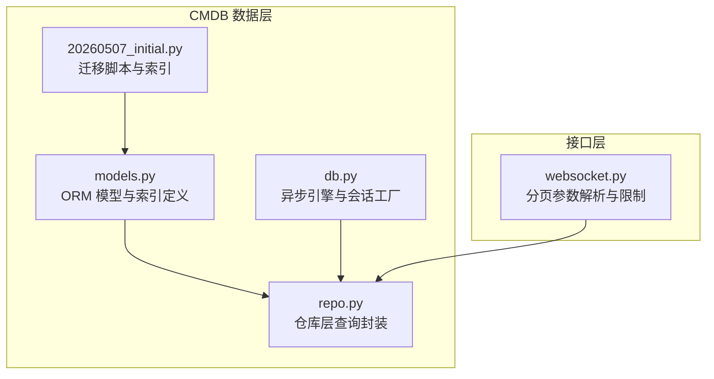
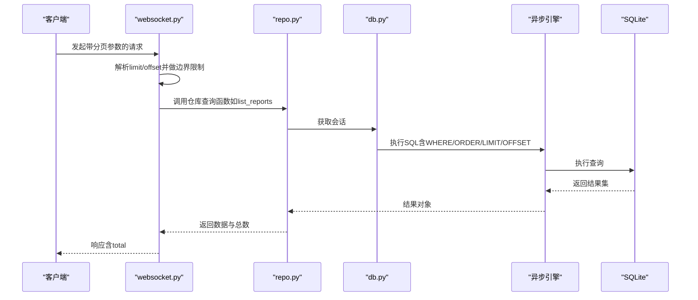
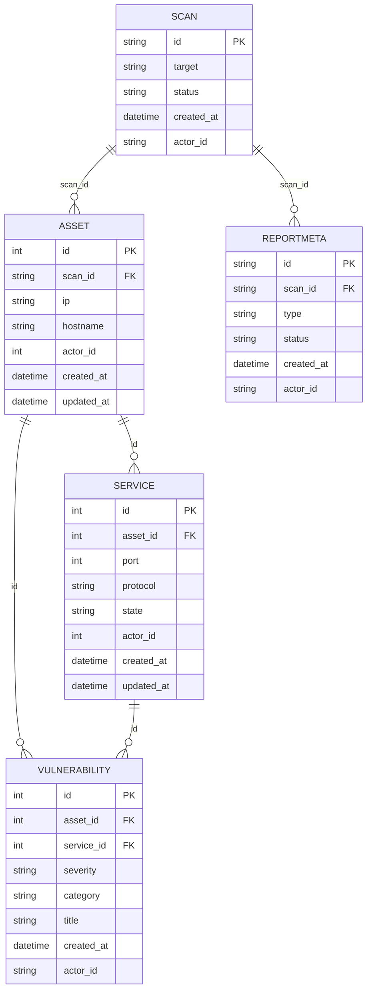
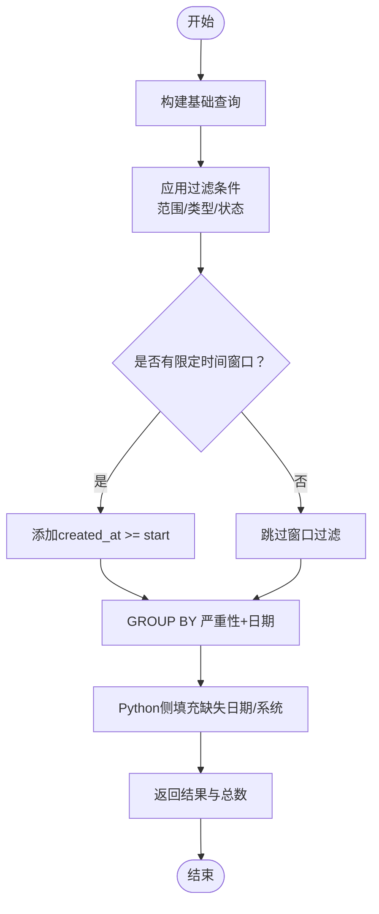
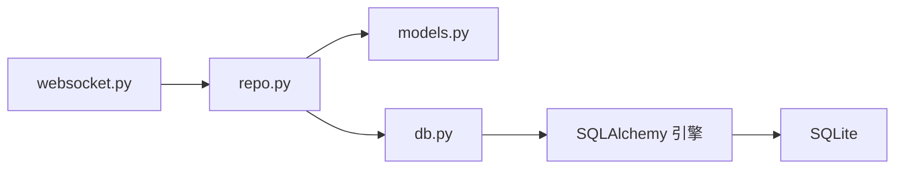

# 查询优化策略

<cite>
**本文引用的文件**
- [models.py](file://secbot/cmdb/models.py)
- [db.py](file://secbot/cmdb/db.py)
- [repo.py](file://secbot/cmdb/repo.py)
- [20260507_initial.py](file://secbot/cmdb/migrations/versions/20260507_initial.py)
- [websocket.py](file://secbot/channels/websocket.py)
- [test_dashboard_aggregations.py](file://tests/cmdb/test_dashboard_aggregations.py)
- [test_report_meta.py](file://tests/cmdb/test_report_meta.py)
</cite>

## 目录
1. [简介](#简介)
2. [项目结构](#项目结构)
3. [核心组件](#核心组件)
4. [架构总览](#架构总览)
5. [详细组件分析](#详细组件分析)
6. [依赖分析](#依赖分析)
7. [性能考量](#性能考量)
8. [故障排查指南](#故障排查指南)
9. [结论](#结论)
10. [附录](#附录)

## 简介
本文件面向VAPT3的数据库查询优化，系统性梳理索引设计策略、SQLAlchemy查询优化技术、关系查询性能（含N+1问题）、分页与分批处理、大数据量场景下的增量更新、查询缓存与LRU策略、以及性能监控与调优工具的使用方法。文档以实际代码为依据，结合Mermaid图示帮助读者快速理解并落地优化实践。

## 项目结构
VAPT3的CMDB模块采用SQLAlchemy 2.x ORM + 异步引擎，数据模型定义在models中，连接与会话管理在db中，业务读写封装在repo中；迁移脚本确保索引与约束的一致性；前端路由在websocket中对分页参数进行解析与限制。

**图表来源**
- [models.py:34-263](file://secbot/cmdb/models.py#L34-L263)
- [db.py:64-133](file://secbot/cmdb/db.py#L64-L133)
- [repo.py:1-994](file://secbot/cmdb/repo.py#L1-L994)
- [20260507_initial.py:23-159](file://secbot/cmdb/migrations/versions/20260507_initial.py#L23-L159)
- [websocket.py:872-895](file://secbot/channels/websocket.py#L872-L895)

**章节来源**
- [models.py:1-263](file://secbot/cmdb/models.py#L1-L263)
- [db.py:1-133](file://secbot/cmdb/db.py#L1-L133)
- [repo.py:1-994](file://secbot/cmdb/repo.py#L1-L994)
- [20260507_initial.py:1-159](file://secbot/cmdb/migrations/versions/20260507_initial.py#L1-L159)
- [websocket.py:872-895](file://secbot/channels/websocket.py#L872-L895)

## 核心组件
- 数据模型与索引
  - Scan/Asset/Service/Vulnerability/ReportMeta均带有actor_id多租户字段，并在关键列上建立复合索引或唯一约束，确保按actor_id过滤与热点查询高效命中。
  - 示例索引位置：[models.py:56-59](file://secbot/cmdb/models.py#L56-L59)、[models.py:100-104](file://secbot/cmdb/models.py#L100-L104)、[models.py:171-174](file://secbot/cmdb/models.py#L171-L174)、[models.py:210-218](file://secbot/cmdb/models.py#L210-L218)。
- 异步引擎与会话
  - 默认使用sqlite+aiosqlite，启用WAL模式、适度同步级别、外键校验与忙等待超时，提升并发读写稳定性。[db.py:51-85](file://secbot/cmdb/db.py#L51-L85)
  - 提供全局异步会话工厂与上下文管理器，统一事务提交/回滚与关闭。[db.py:103-123](file://secbot/cmdb/db.py#L103-L123)
- 仓库层查询封装
  - 针对扫描、资产、服务、漏洞、报告元数据提供高内聚的查询封装，支持范围过滤、排序、分页与聚合统计。[repo.py:76-994](file://secbot/cmdb/repo.py#L76-L994)
- 迁移与索引一致性
  - 初始迁移脚本显式创建索引与唯一约束，保证生产环境与开发环境一致。[20260507_initial.py:23-159](file://secbot/cmdb/migrations/versions/20260507_initial.py#L23-L159)

**章节来源**
- [models.py:34-263](file://secbot/cmdb/models.py#L34-L263)
- [db.py:51-123](file://secbot/cmdb/db.py#L51-L123)
- [repo.py:76-994](file://secbot/cmdb/repo.py#L76-L994)
- [20260507_initial.py:23-159](file://secbot/cmdb/migrations/versions/20260507_initial.py#L23-L159)

## 架构总览
下图展示从接口到仓库再到数据库的调用链路与关键优化点：

**图表来源**
- [websocket.py:872-895](file://secbot/channels/websocket.py#L872-L895)
- [repo.py:862-919](file://secbot/cmdb/repo.py#L862-L919)
- [db.py:103-123](file://secbot/cmdb/db.py#L103-L123)

## 详细组件分析

### 索引设计策略
- 复合索引选择原则
  - 优先覆盖常见过滤条件与排序列，减少全表扫描与临时排序开销。
  - 在多租户场景下，将actor_id置于复合索引首位，确保按租户隔离的查询高效命中。
- 具体索引与约束
  - Scan: actor_id+status、actor_id+created_at，支撑按状态与时间窗口的筛选与排序。[models.py:56-59](file://secbot/cmdb/models.py#L56-L59)
  - Asset: actor_id+ip、actor_id+hostname、scan_id，支撑IP/主机名检索与扫描维度聚合。[models.py:100-104](file://secbot/cmdb/models.py#L100-L104)
  - Vulnerability: actor_id+severity+created_at、asset_id，支撑严重性趋势与按资产聚合。[models.py:171-174](file://secbot/cmdb/models.py#L171-L174)
  - ReportMeta: actor_id+status+created_at、scan_id，支撑报告列表按时间窗口与状态过滤。[models.py:210-218](file://secbot/cmdb/models.py#L210-L218)
  - Service: 唯一约束(asset_id,port,protocol)，避免重复服务记录。[models.py:138-140](file://secbot/cmdb/models.py#L138-L140)
- 索引维护成本
  - 写入路径（INSERT/UPDATE）需权衡索引数量与维护开销；建议仅保留高频查询所需的索引组合。
  - 对于低频或宽范围扫描的列，可考虑延迟建索引或使用部分索引（视数据库能力）。

**图表来源**
- [models.py:38-263](file://secbot/cmdb/models.py#L38-L263)

**章节来源**
- [models.py:56-59](file://secbot/cmdb/models.py#L56-L59)
- [models.py:100-104](file://secbot/cmdb/models.py#L100-L104)
- [models.py:171-174](file://secbot/cmdb/models.py#L171-L174)
- [models.py:210-218](file://secbot/cmdb/models.py#L210-L218)
- [models.py:138-140](file://secbot/cmdb/models.py#L138-L140)

### SQLAlchemy查询优化技术
- 查询语句生成与执行计划
  - 使用ORM的select构造器拼接WHERE、ORDER BY、LIMIT/OFFSET，确保SQL可读且易于分析。
  - 通过func.*函数（如count、date、case）在SQL层面完成聚合与转换，避免Python侧二次处理。
- 慢查询识别与优化
  - 在开发阶段开启echo参数（见引擎初始化），观察SQL与耗时；生产环境谨慎开启。
  - 对大结果集查询，优先使用LIMIT与OFFSET分页，或基于游标的时间戳分页（见“大数据量场景”）。
- 关系查询性能
  - 使用relationship与外键约束，避免隐式笛卡尔积；对一对多/多对一查询，尽量在WHERE中限定主表主键集合，减少JOIN规模。
  - 对复杂聚合（如仪表盘趋势），先在SQL层面group_by，再在Python侧填充空值，降低网络与序列化开销。

**章节来源**
- [db.py:64-93](file://secbot/cmdb/db.py#L64-L93)
- [repo.py:442-631](file://secbot/cmdb/repo.py#L442-L631)
- [repo.py:634-758](file://secbot/cmdb/repo.py#L634-L758)

### 关系查询的性能考虑
- N+1查询问题
  - 现状：仓库层查询多为单表或简单JOIN，未出现明显N+1；若后续扩展涉及遍历访问关联属性，建议：
    - 使用selectinload/joinedload预加载（在ORM层面一次性拉取关联）。
    - 或在SQL层面使用LEFT JOIN一次性获取所需数据。
- 批量加载策略
  - 对list_*系列查询，优先在WHERE中传入主键集合，减少逐条查询。
  - 对聚合统计，使用SQL层面的GROUP BY与CASE WHEN，避免多次往返。
- 预加载优化
  - 对仪表盘聚合（如资产集群、类型分布），先获取系统清单，再基于清单进行聚合，避免遗漏系统。

**章节来源**
- [repo.py:684-758](file://secbot/cmdb/repo.py#L684-L758)

### 大数据量场景下的分页与分批
- 分页查询
  - 接口层对limit/offset进行边界控制，防止过大分页导致内存与响应时间膨胀。[websocket.py:872-895](file://secbot/channels/websocket.py#L872-L895)
  - 仓库层list_reports同时返回rows与total，便于前端渲染分页控件。[repo.py:862-919](file://secbot/cmdb/repo.py#L862-L919)
- 分批处理
  - 对长时间运行的聚合任务，建议按时间窗口（如每日/每周）分批计算，避免一次性扫描全量数据。
- 增量更新
  - 利用created_at列进行增量扫描，仅处理新增或变更的数据，降低全量扫描成本。

**章节来源**
- [websocket.py:872-895](file://secbot/channels/websocket.py#L872-L895)
- [repo.py:862-919](file://secbot/cmdb/repo.py#L862-L919)

### 查询优化案例
- 复杂关联查询（资产集群）
  - 先查询系统清单，再基于清单与聚合条件进行计数，确保零发现系统仍出现在结果中。[repo.py:684-758](file://secbot/cmdb/repo.py#L684-L758)
- 聚合统计查询（漏洞趋势）
  - 使用func.date对created_at按本地日期分组，CASE WHEN将严重性映射到聚合桶，最后在Python侧填充缺失日期。[repo.py:568-631](file://secbot/cmdb/repo.py#L568-L631)
- 条件过滤查询（报告列表）
  - 支持按范围、类型、状态过滤，并返回total用于分页；对时间窗口使用created_at >= start。[repo.py:862-919](file://secbot/cmdb/repo.py#L862-L919)

**图表来源**
- [repo.py:568-631](file://secbot/cmdb/repo.py#L568-L631)
- [repo.py:684-758](file://secbot/cmdb/repo.py#L684-L758)
- [repo.py:862-919](file://secbot/cmdb/repo.py#L862-L919)

**章节来源**
- [repo.py:568-631](file://secbot/cmdb/repo.py#L568-L631)
- [repo.py:684-758](file://secbot/cmdb/repo.py#L684-L758)
- [repo.py:862-919](file://secbot/cmdb/repo.py#L862-L919)

### 查询缓存机制与LRU策略
- 当前实现
  - 项目未内置数据库查询缓存；提示：可在应用层引入轻量LRU缓存（如functools.lru_cache或aiocache），对热点只读查询（如仪表盘聚合）进行短期缓存。
- LRU策略建议
  - 缓存键：查询参数（actor_id、时间窗口、过滤条件）哈希。
  - 失效策略：基于TTL或基于数据变更事件（如created_at窗口推进）。
  - 注意：多租户场景下需将actor_id纳入缓存键，避免数据泄露。

[本节为通用建议，不直接分析具体文件，故无“章节来源”]

### 数据库性能监控与调优工具
- 开发期诊断
  - 启用引擎echo参数，观察SQL与执行耗时，定位慢查询与异常索引使用。[db.py:64-93](file://secbot/cmdb/db.py#L64-L93)
- 生产期观测
  - 使用SQLite PRAGMA查看当前journal_mode、synchronous等设置，确认WAL与同步级别符合预期。[db.py:51-62](file://secbot/cmdb/db.py#L51-L62)
- 测试验证
  - 通过单元测试验证聚合函数行为与边界条件，确保SQL逻辑正确性。[test_dashboard_aggregations.py:67-248](file://tests/cmdb/test_dashboard_aggregations.py#L67-L248)、[test_report_meta.py:106-220](file://tests/cmdb/test_report_meta.py#L106-L220)

**章节来源**
- [db.py:51-93](file://secbot/cmdb/db.py#L51-L93)
- [test_dashboard_aggregations.py:67-248](file://tests/cmdb/test_dashboard_aggregations.py#L67-L248)
- [test_report_meta.py:106-220](file://tests/cmdb/test_report_meta.py#L106-L220)

## 依赖分析
- 组件耦合
  - repo依赖models的ORM类与索引定义，依赖db提供的异步会话工厂。
  - websocket对repo的查询结果进行二次加工（分页参数与过滤），并对limit/offset做边界控制。
- 外部依赖
  - SQLAlchemy 2.x（ORM/异步引擎）、Alembic（迁移）。
- 可能的循环依赖
  - 当前结构清晰，未见循环导入；若后续在repo中引入通知通道发布逻辑，需注意避免反向依赖。

**图表来源**
- [websocket.py:872-895](file://secbot/channels/websocket.py#L872-L895)
- [repo.py:1-994](file://secbot/cmdb/repo.py#L1-L994)
- [models.py:1-263](file://secbot/cmdb/models.py#L1-L263)
- [db.py:1-133](file://secbot/cmdb/db.py#L1-L133)

**章节来源**
- [websocket.py:872-895](file://secbot/channels/websocket.py#L872-L895)
- [repo.py:1-994](file://secbot/cmdb/repo.py#L1-L994)
- [models.py:1-263](file://secbot/cmdb/models.py#L1-L263)
- [db.py:1-133](file://secbot/cmdb/db.py#L1-L133)

## 性能考量
- 索引命中
  - 将actor_id置于复合索引首位，确保多租户查询高效；对高频过滤列（status、severity、scan_id）建立相应索引。
- 排序与分页
  - ORDER BY + LIMIT/OFFSET需配合合适索引；对时间序列查询，优先使用created_at索引。
- 聚合与转换
  - 在SQL层面完成GROUP BY与CASE WHEN，减少Python侧处理；对日期聚合使用func.date并考虑本地时区。
- 并发与锁
  - WAL模式与适度同步级别降低“database is locked”风险；短事务与批量提交降低锁竞争。

[本节为通用指导，不直接分析具体文件，故无“章节来源”]

## 故障排查指南
- 常见问题
  - 查询慢：检查WHERE条件是否命中索引；确认ORDER BY列是否在索引中；必要时增加复合索引。
  - 分页错乱：确认排序列与LIMIT/OFFSET顺序；避免在无稳定排序列上做分页。
  - 聚合不完整：检查GROUP BY是否覆盖所有维度；对空值/缺失值进行显式填充。
- 定位手段
  - 开启echo观察SQL；使用测试用例覆盖边界条件；对聚合函数进行单元测试验证。
- 修复建议
  - 针对热点查询增加索引；对复杂聚合拆分为多步查询并在SQL层面完成；对时间窗口查询使用索引列过滤。

**章节来源**
- [db.py:64-93](file://secbot/cmdb/db.py#L64-L93)
- [test_dashboard_aggregations.py:67-248](file://tests/cmdb/test_dashboard_aggregations.py#L67-L248)
- [test_report_meta.py:106-220](file://tests/cmdb/test_report_meta.py#L106-L220)

## 结论
VAPT3的CMDB模块在索引设计、异步引擎配置与仓库层查询封装方面已具备良好基础。建议在现有基础上进一步完善：
- 针对热点只读查询引入应用层LRU缓存；
- 对复杂聚合与分页查询持续进行索引优化与SQL重写；
- 在生产环境引入更完善的慢查询日志与指标采集，持续迭代查询性能。

[本节为总结性内容，不直接分析具体文件，故无“章节来源”]

## 附录
- 快速参考
  - 多租户过滤：始终以actor_id作为WHERE条件首列。[models.py:49-51](file://secbot/cmdb/models.py#L49-L51)
  - 时间序列聚合：使用func.date与本地时区字符串对齐。[repo.py:586-590](file://secbot/cmdb/repo.py#L586-L590)
  - 分页边界：接口层对limit/offset进行上限与下限控制。[websocket.py:872-895](file://secbot/channels/websocket.py#L872-L895)

**章节来源**
- [models.py:49-51](file://secbot/cmdb/models.py#L49-L51)
- [repo.py:586-590](file://secbot/cmdb/repo.py#L586-L590)
- [websocket.py:872-895](file://secbot/channels/websocket.py#L872-L895)