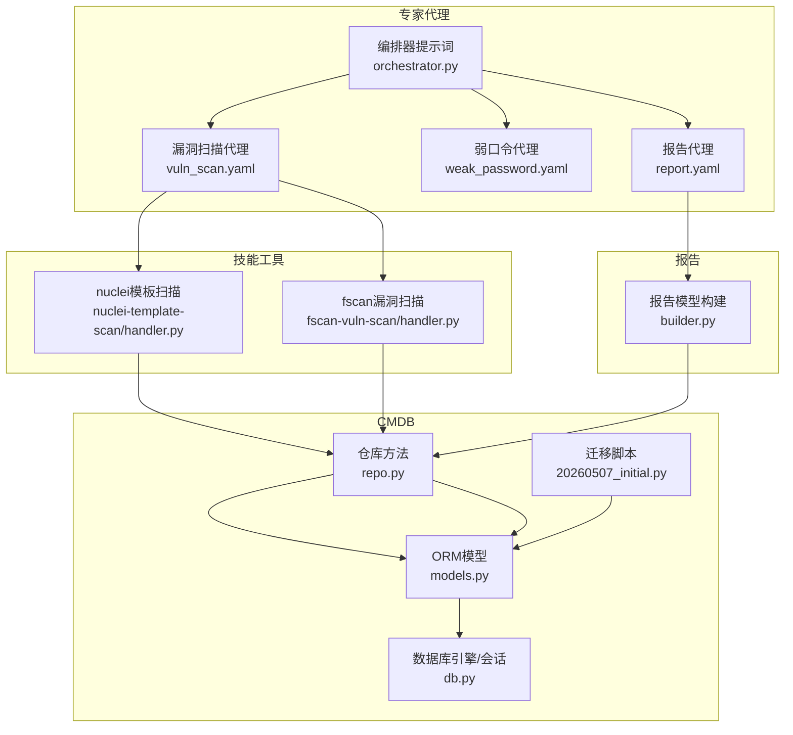
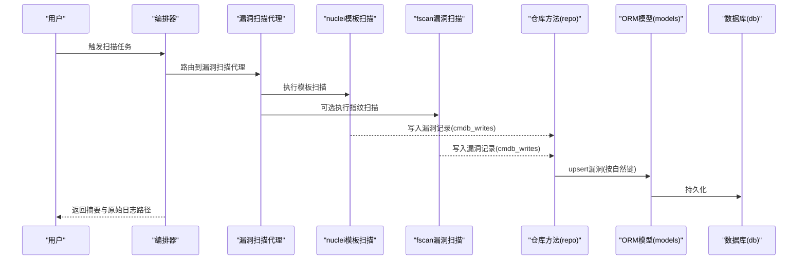
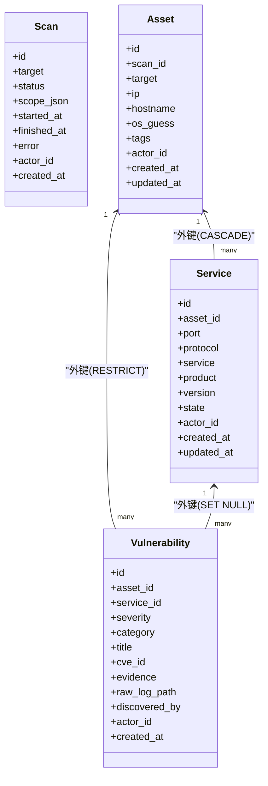
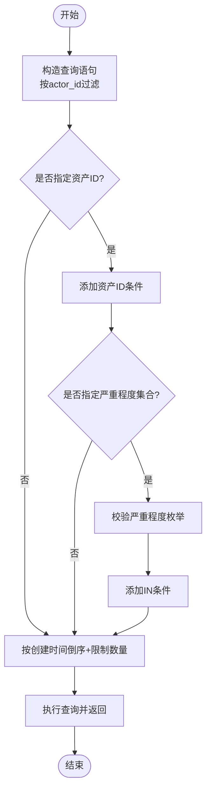
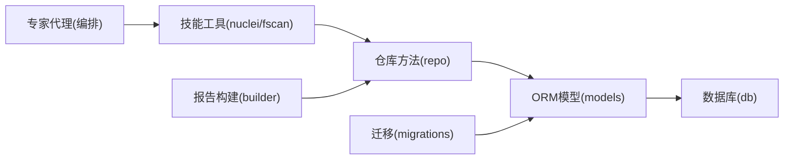

# 漏洞跟踪系统

<cite>
**本文引用的文件**
- [models.py](file://secbot/cmdb/models.py)
- [repo.py](file://secbot/cmdb/repo.py)
- [20260507_initial.py](file://secbot/cmdb/migrations/versions/20260507_initial.py)
- [db.py](file://secbot/cmdb/db.py)
- [vuln_scan.yaml](file://secbot/agents/vuln_scan.yaml)
- [weak_password.yaml](file://secbot/agents/weak_password.yaml)
- [report.yaml](file://secbot/agents/report.yaml)
- [vuln_scan.md](file://secbot/agents/prompts/vuln_scan.md)
- [weak_password.md](file://secbot/agents/prompts/weak_password.md)
- [builder.py](file://secbot/report/builder.py)
- [orchestrator.py](file://secbot/agents/orchestrator.py)
- [fscan-vuln-scan/handler.py](file://secbot/skills/fscan-vuln-scan/handler.py)
- [nuclei-template-scan/handler.py](file://secbot/skills/nuclei-template-scan/handler.py)
- [test_handlers.py](file://tests/skills/test_handlers.py)
- [test_repo.py](file://tests/cmdb/test_repo.py)
- [test_report.py](file://tests/report/test_report.py)
</cite>

## 目录
1. [简介](#简介)
2. [项目结构](#项目结构)
3. [核心组件](#核心组件)
4. [架构总览](#架构总览)
5. [详细组件分析](#详细组件分析)
6. [依赖关系分析](#依赖关系分析)
7. [性能考量](#性能考量)
8. [故障排查指南](#故障排查指南)
9. [结论](#结论)
10. [附录](#附录)

## 简介
本文件为漏洞跟踪系统的权威技术文档，围绕CMDB（本地配置管理数据库）中的漏洞实体设计、漏洞分类体系、严重程度等级与状态管理、与资产/服务的关联关系及级联删除策略进行深入解析；同时覆盖漏洞查询、筛选与统计分析、数据导入/更新/同步机制、报告生成与导出、以及工作流程与管理最佳实践。

## 项目结构
本系统以“专家代理 + 技能工具 + CMDB”的分层架构组织：
- 专家代理：负责编排与路由具体任务（如漏洞扫描、弱口令检测、报告生成）。
- 技能工具：执行具体的扫描与取证动作，将结果写入CMDB。
- CMDB：持久化存储扫描、资产、服务与漏洞数据，提供统一的数据访问与事务控制。
- 报告模块：从CMDB构建报告模型，再渲染为多种格式输出。

图表来源
- [orchestrator.py:17-69](file://secbot/agents/orchestrator.py#L17-L69)
- [vuln_scan.yaml:1-53](file://secbot/agents/vuln_scan.yaml#L1-L53)
- [weak_password.yaml:1-53](file://secbot/agents/weak_password.yaml#L1-L53)
- [report.yaml:1-39](file://secbot/agents/report.yaml#L1-L39)
- [nuclei-template-scan/handler.py:98-153](file://secbot/skills/nuclei-template-scan/handler.py#L98-L153)
- [fscan-vuln-scan/handler.py:75-115](file://secbot/skills/fscan-vuln-scan/handler.py#L75-L115)
- [db.py:64-122](file://secbot/cmdb/db.py#L64-L122)
- [models.py:38-177](file://secbot/cmdb/models.py#L38-L177)
- [repo.py:68-370](file://secbot/cmdb/repo.py#L68-L370)
- [20260507_initial.py:109-150](file://secbot/cmdb/migrations/versions/20260507_initial.py#L109-L150)
- [builder.py:87-177](file://secbot/report/builder.py#L87-L177)

章节来源
- [db.py:1-133](file://secbot/cmdb/db.py#L1-L133)
- [models.py:1-178](file://secbot/cmdb/models.py#L1-L178)
- [repo.py:1-370](file://secbot/cmdb/repo.py#L1-L370)
- [20260507_initial.py:109-150](file://secbot/cmdb/migrations/versions/20260507_initial.py#L109-L150)
- [vuln_scan.yaml:1-53](file://secbot/agents/vuln_scan.yaml#L1-L53)
- [weak_password.yaml:1-53](file://secbot/agents/weak_password.yaml#L1-L53)
- [report.yaml:1-39](file://secbot/agents/report.yaml#L1-L39)
- [vuln_scan.md:1-24](file://secbot/agents/prompts/vuln_scan.md#L1-L24)
- [weak_password.md:1-28](file://secbot/agents/prompts/weak_password.md#L1-L28)
- [builder.py:1-178](file://secbot/report/builder.py#L1-L178)
- [orchestrator.py:1-70](file://secbot/agents/orchestrator.py#L1-L70)

## 核心组件
- 数据模型与索引
  - 扫描（Scan）、资产（Asset）、服务（Service）、漏洞（Vulnerability）四表构成核心数据模型。
  - 漏洞实体的关键字段：严重程度、类别、标题、可选CVE编号、证据、原始日志路径、发现来源等。
  - 关系与约束：资产与服务一对多；服务与漏洞一对多；漏洞与资产/服务多对一；外键删除策略明确。
- 仓库方法（Repo）
  - 提供统一的增删改查与upsert接口，严格遵循自然键与事务边界。
  - 漏洞upsert基于“资产+服务+标题+CVE”组合键，确保重跑扫描时幂等更新。
- 报告构建
  - 从CMDB一次性读取扫描、资产、服务、漏洞数据，构建报告模型并汇总统计。
- 代理与技能
  - 专家代理定义输入/输出模式与安全规则；技能工具负责执行扫描并将结果写入CMDB。

章节来源
- [models.py:38-177](file://secbot/cmdb/models.py#L38-L177)
- [repo.py:281-370](file://secbot/cmdb/repo.py#L281-L370)
- [builder.py:87-177](file://secbot/report/builder.py#L87-L177)
- [vuln_scan.yaml:17-53](file://secbot/agents/vuln_scan.yaml#L17-L53)
- [weak_password.yaml:17-53](file://secbot/agents/weak_password.yaml#L17-L53)
- [report.yaml:18-39](file://secbot/agents/report.yaml#L18-L39)

## 架构总览
系统采用“编排器 → 专家代理 → 技能工具 → CMDB”的链路，所有数据写入均通过仓库方法完成，保证一致性与可审计性。

图表来源
- [orchestrator.py:22-32](file://secbot/agents/orchestrator.py#L22-L32)
- [vuln_scan.yaml:10-16](file://secbot/agents/vuln_scan.yaml#L10-L16)
- [nuclei-template-scan/handler.py:98-153](file://secbot/skills/nuclei-template-scan/handler.py#L98-L153)
- [fscan-vuln-scan/handler.py:75-115](file://secbot/skills/fscan-vuln-scan/handler.py#L75-L115)
- [repo.py:281-348](file://secbot/cmdb/repo.py#L281-L348)
- [models.py:139-170](file://secbot/cmdb/models.py#L139-L170)
- [db.py:103-122](file://secbot/cmdb/db.py#L103-L122)

## 详细组件分析

### 漏洞实体设计与分类体系
- 实体字段与关系
  - 漏洞实体包含严重程度、类别、标题、可选CVE编号、证据、原始日志路径、发现来源等。
  - 与资产/服务的关系：多条漏洞可归属同一资产；若定位到具体服务，可建立服务级关联。
- 分类体系
  - 支持的漏洞类别：CVE、弱口令、配置错误、信息泄露。
- 自然键与幂等更新
  - upsert键：(asset_id, service_id, title, cve_id)，确保重复发现仅更新而非重复插入。
- 删除策略
  - 资产删除：RESTRICT，防止误删仍存在的资产。
  - 服务删除：CASCADE，服务被删除时其关联漏洞随之外部键约束清理。
  - 漏洞删除：未在模型中显式设置级联，遵循默认行为，避免意外级联删除。

图表来源
- [models.py:38-177](file://secbot/cmdb/models.py#L38-L177)
- [20260507_initial.py:109-150](file://secbot/cmdb/migrations/versions/20260507_initial.py#L109-L150)

章节来源
- [models.py:139-177](file://secbot/cmdb/models.py#L139-L177)
- [repo.py:281-348](file://secbot/cmdb/repo.py#L281-L348)

### 严重程度等级与状态管理
- 严重程度
  - 允许值集合：critical、high、medium、low、info。
- 扫描状态
  - 允许值集合：queued、running、awaiting_user、completed、failed、cancelled。
- 状态流转
  - 创建扫描时默认“排队”；进入执行阶段置为“运行中”，并在完成/失败/取消时记录结束时间与错误信息。

章节来源
- [models.py:173-177](file://secbot/cmdb/models.py#L173-L177)
- [repo.py:68-134](file://secbot/cmdb/repo.py#L68-L134)

### 漏洞与资产、服务的关联关系与级联删除
- 关联关系
  - 资产 → 服务：一对多，服务删除时级联删除其漏洞（外键约束）。
  - 资产 → 漏洞：一对多，删除资产受RESTRICT约束。
  - 服务 → 漏洞：一对多，删除服务时，漏洞的service_id被置空（SET NULL）。
- 级联策略
  - 服务删除 CASCADE，确保服务级漏洞不遗留孤儿。
  - 资产删除 RESTRICT，避免误删仍存在的资产。
  - 漏洞删除未显式指定级联，遵循默认行为。

章节来源
- [models.py:62-170](file://secbot/cmdb/models.py#L62-L170)
- [20260507_initial.py:109-150](file://secbot/cmdb/migrations/versions/20260507_initial.py#L109-L150)

### 查询、筛选与统计分析
- 查询接口
  - 列出漏洞：支持按actor_id过滤、按资产ID过滤、按严重程度集合过滤、限制返回数量。
  - 过滤校验：对严重程度枚举进行严格校验，非法值抛出异常。
- 统计分析
  - 报告构建器按严重程度聚合计数，汇总资产/服务/漏洞总数，并收集原始日志路径用于溯源。

图表来源
- [repo.py:351-369](file://secbot/cmdb/repo.py#L351-L369)
- [builder.py:108-146](file://secbot/report/builder.py#L108-L146)

章节来源
- [repo.py:351-369](file://secbot/cmdb/repo.py#L351-L369)
- [builder.py:87-177](file://secbot/report/builder.py#L87-L177)

### 数据导入、更新与同步机制
- 导入路径
  - 技能工具执行扫描后，将结构化结果写入CMDB（cmdb_writes），由仓库方法统一upsert。
- 幂等更新
  - 基于自然键（资产+服务+标题+CVE）的upsert，确保重复发现仅更新证据与日志路径，不产生重复记录。
- 同步策略
  - 通过“先扫描、后写入”的流水线，结合upsert键实现跨多次扫描的稳定同步。

章节来源
- [nuclei-template-scan/handler.py:50-95](file://secbot/skills/nuclei-template-scan/handler.py#L50-L95)
- [fscan-vuln-scan/handler.py:35-72](file://secbot/skills/fscan-vuln-scan/handler.py#L35-L72)
- [repo.py:281-348](file://secbot/cmdb/repo.py#L281-L348)

### 报告生成与导出
- 报告模型
  - 从CMDB一次性读取扫描、资产、服务、漏洞数据，构建报告模型，包含摘要、资产列表、附录等。
- 渲染与导出
  - 报告代理支持Markdown、PDF、DOCX三种格式；Markdown为中间标准，其他格式由此派生。
- 原始日志与溯源
  - 报告模型收集原始日志路径，便于问题复盘与审计。

章节来源
- [report.yaml:18-39](file://secbot/agents/report.yaml#L18-L39)
- [builder.py:87-177](file://secbot/report/builder.py#L87-L177)

### 工作流程与管理最佳实践
- 编排顺序
  - 固定顺序：资产发现 → 端口扫描 → 漏洞扫描 → 弱口令检测/渗透测试 → 报告生成。
- 安全与确认
  - 高风险技能需用户确认；弱口令代理对每次调用进行拦截确认。
- 输出规范
  - 漏洞扫描代理默认使用模板扫描为主，必要时辅以指纹扫描；严格遵守严重程度阈值。
- 最佳实践
  - 使用“自然键upsert”确保重复扫描幂等；合理设置严重程度阈值减少噪声；利用原始日志路径进行溯源与复核。

章节来源
- [orchestrator.py:22-32](file://secbot/agents/orchestrator.py#L22-L32)
- [vuln_scan.md:15-18](file://secbot/agents/prompts/vuln_scan.md#L15-L18)
- [weak_password.md:8-15](file://secbot/agents/prompts/weak_password.md#L8-L15)
- [vuln_scan.yaml:32-35](file://secbot/agents/vuln_scan.yaml#L32-L35)
- [weak_password.yaml:10-15](file://secbot/agents/weak_password.yaml#L10-L15)

## 依赖关系分析

图表来源
- [nuclei-template-scan/handler.py:98-153](file://secbot/skills/nuclei-template-scan/handler.py#L98-L153)
- [fscan-vuln-scan/handler.py:75-115](file://secbot/skills/fscan-vuln-scan/handler.py#L75-L115)
- [repo.py:281-348](file://secbot/cmdb/repo.py#L281-L348)
- [models.py:38-177](file://secbot/cmdb/models.py#L38-L177)
- [db.py:64-122](file://secbot/cmdb/db.py#L64-L122)
- [builder.py:87-177](file://secbot/report/builder.py#L87-L177)
- [20260507_initial.py:109-150](file://secbot/cmdb/migrations/versions/20260507_initial.py#L109-L150)

章节来源
- [repo.py:1-370](file://secbot/cmdb/repo.py#L1-L370)
- [models.py:1-178](file://secbot/cmdb/models.py#L1-L178)
- [db.py:1-133](file://secbot/cmdb/db.py#L1-L133)
- [builder.py:1-178](file://secbot/report/builder.py#L1-L178)
- [20260507_initial.py:109-150](file://secbot/cmdb/migrations/versions/20260507_initial.py#L109-L150)

## 性能考量
- 数据库并发
  - SQLite启用WAL模式与连接级PRAGMA，支持单写多读，降低锁竞争。
- 查询优化
  - 漏洞表针对(actor_id, severity, created_at)与(asset_id)建立索引，提升筛选与排序效率。
- 限流与截断
  - 报告与技能工具对结果数量与字符串长度进行限制，避免超大输出影响性能与稳定性。

章节来源
- [db.py:51-61](file://secbot/cmdb/db.py#L51-L61)
- [models.py:167-170](file://secbot/cmdb/models.py#L167-L170)
- [builder.py:165-168](file://secbot/report/builder.py#L165-L168)
- [nuclei-template-scan/handler.py:31-33](file://secbot/skills/nuclei-template-scan/handler.py#L31-L33)

## 故障排查指南
- 常见错误与定位
  - 严重程度/类别枚举非法：仓库方法在过滤或upsert时进行严格校验，非法值会抛出异常。
  - 扫描状态非法：更新扫描状态时若传入未知状态将报错。
  - 技能工具执行失败：检查二进制是否存在、网络策略、超时与取消信号。
- 测试验证
  - 漏洞upsert幂等与重发现升级：测试覆盖了相同CVE重复发现时的严重度提升与证据更新。
  - 报告构建与渲染：测试包含典型扫描场景，验证摘要与统计数据正确性。
  - 技能工具输入校验：测试涵盖目标格式、端口规格、严重度阈值等非法输入。

章节来源
- [repo.py:301-306](file://secbot/cmdb/repo.py#L301-L306)
- [repo.py:117-118](file://secbot/cmdb/repo.py#L117-L118)
- [test_repo.py:154-189](file://tests/cmdb/test_repo.py#L154-L189)
- [test_report.py:59-90](file://tests/report/test_report.py#L59-L90)
- [test_handlers.py:198-234](file://tests/skills/test_handlers.py#L198-L234)

## 结论
本系统通过清晰的实体设计、严格的枚举校验、幂等upsert与稳健的报告构建，实现了从扫描到报告的完整闭环。固定编排顺序与高风险确认机制保障了操作的安全性与可控性；索引与并发优化提升了整体性能。建议在实际部署中结合业务需求调整严重程度阈值与报告模板，并持续完善原始日志管理与溯源能力。

## 附录
- 术语
  - CMDB：本地配置管理数据库
  - ULID：26字符唯一标识符
  - NATS：消息总线（用于事件与队列）
- 参考文件
  - [models.py:1-178](file://secbot/cmdb/models.py#L1-L178)
  - [repo.py:1-370](file://secbot/cmdb/repo.py#L1-L370)
  - [db.py:1-133](file://secbot/cmdb/db.py#L1-L133)
  - [builder.py:1-178](file://secbot/report/builder.py#L1-L178)
  - [vuln_scan.yaml:1-53](file://secbot/agents/vuln_scan.yaml#L1-L53)
  - [weak_password.yaml:1-53](file://secbot/agents/weak_password.yaml#L1-L53)
  - [report.yaml:1-39](file://secbot/agents/report.yaml#L1-L39)
  - [vuln_scan.md:1-24](file://secbot/agents/prompts/vuln_scan.md#L1-L24)
  - [weak_password.md:1-28](file://secbot/agents/prompts/weak_password.md#L1-L28)
  - [nuclei-template-scan/handler.py:1-154](file://secbot/skills/nuclei-template-scan/handler.py#L1-L154)
  - [fscan-vuln-scan/handler.py:1-116](file://secbot/skills/fscan-vuln-scan/handler.py#L1-L116)
  - [20260507_initial.py:109-150](file://secbot/cmdb/migrations/versions/20260507_initial.py#L109-L150)
  - [test_handlers.py:198-234](file://tests/skills/test_handlers.py#L198-L234)
  - [test_repo.py:154-189](file://tests/cmdb/test_repo.py#L154-L189)
  - [test_report.py:59-90](file://tests/report/test_report.py#L59-L90)