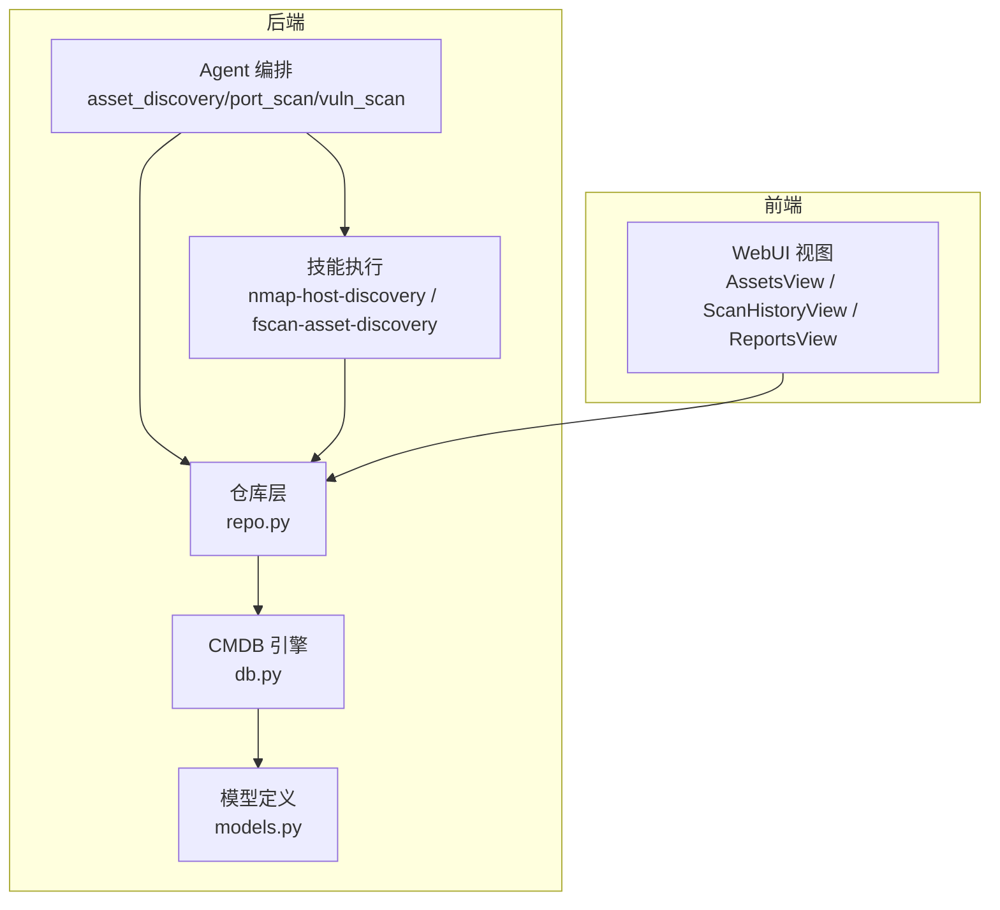
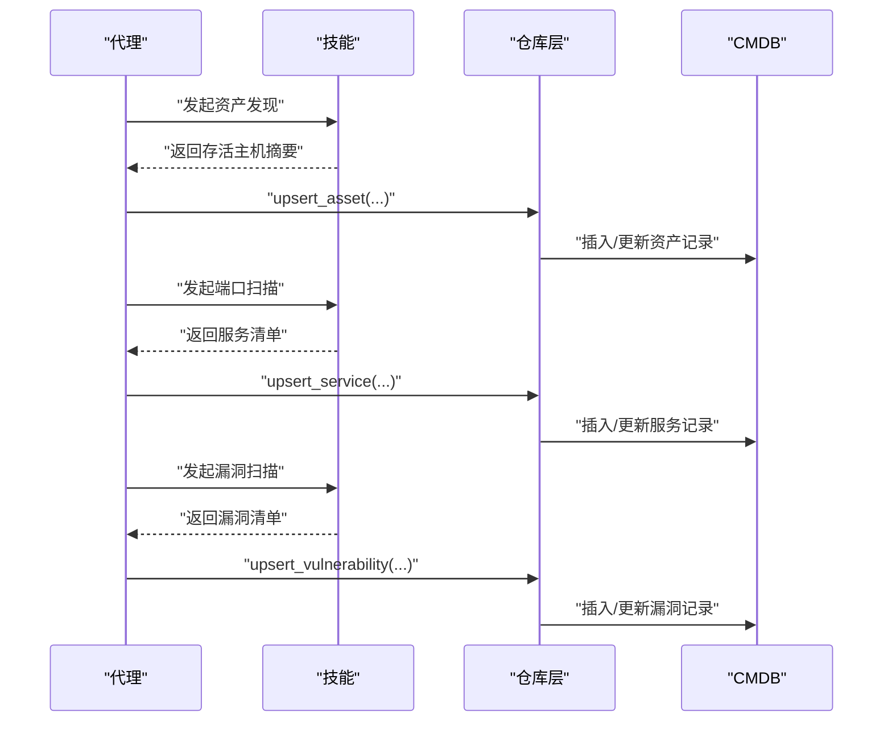
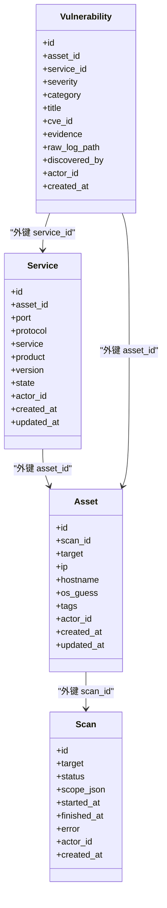
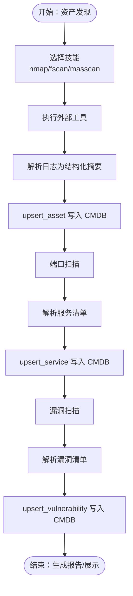
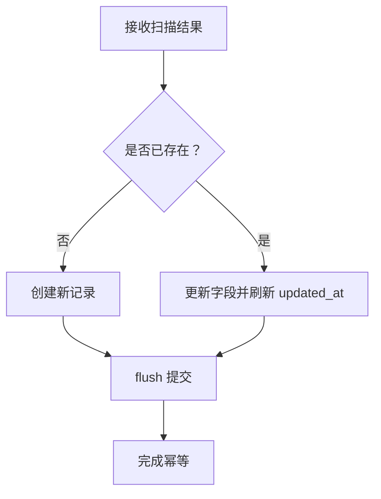
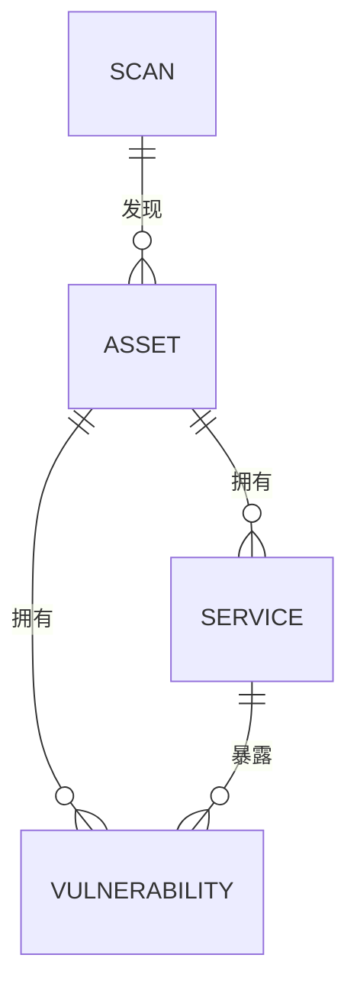
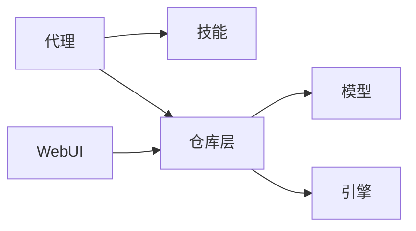

# 资产管理功能

<cite>
**本文引用的文件**   
- [cmdb-schema.md](file://.trellis/spec/backend/cmdb-schema.md)
- [models.py](file://secbot/cmdb/models.py)
- [repo.py](file://secbot/cmdb/repo.py)
- [db.py](file://secbot/cmdb/db.py)
- [asset_discovery.yaml](file://secbot/agents/asset_discovery.yaml)
- [port_scan.yaml](file://secbot/agents/port_scan.yaml)
- [vuln_scan.yaml](file://secbot/agents/vuln_scan.yaml)
- [nmap-host-discovery/handler.py](file://secbot/skills/nmap-host-discovery/handler.py)
- [fscan-asset-discovery/handler.py](file://secbot/skills/fscan-asset-discovery/handler.py)
- [runner.py](file://secbot/skills/_shared/runner.py)
- [server.py](file://secbot/api/server.py)
- [builder.py](file://secbot/report/builder.py)
- [webui设计.md](file://.trellis/spec/frontend/webui-design.md)
- [test_repo.py](file://tests/cmdb/test_repo.py)
</cite>

## 目录
1. [简介](#简介)
2. [项目结构](#项目结构)
3. [核心组件](#核心组件)
4. [架构总览](#架构总览)
5. [详细组件分析](#详细组件分析)
6. [依赖分析](#依赖分析)
7. [性能考虑](#性能考虑)
8. [故障排查指南](#故障排查指南)
9. [结论](#结论)
10. [附录](#附录)

## 简介
本文件系统化阐述资产管理功能，覆盖资产发现、资产信息维护与查询、资产生命周期管理、资产与扫描任务/服务/漏洞的关联关系、资产查询API使用方法与参数说明，以及资产数据的导入导出思路与最佳实践。目标是帮助安全运营人员与开发者快速理解并高效使用资产管理体系。

## 项目结构
资产管理能力由“本地CMDB（SQLite）+ 扫描代理（Agent）+ 技能（Skill）+ WebUI”构成：
- 后端数据层：基于 SQLAlchemy 2.x 的异步 ORM，统一通过会话工厂访问数据库，确保单写多读一致性与事务边界。
- 扫描代理：以 YAML 驱动的任务编排器，按阶段串联资产发现、端口扫描、漏洞扫描，并将结果写入 CMDB。
- 技能：封装外部工具（如 nmap、fscan）执行与解析，输出标准化摘要供代理消费。
- WebUI：提供资产浏览、扫描历史与报告视图，支撑资产查询与可视化。

图表来源
- [asset_discovery.yaml:1-46](file://secbot/agents/asset_discovery.yaml#L1-L46)
- [port_scan.yaml:1-50](file://secbot/agents/port_scan.yaml#L1-L50)
- [vuln_scan.yaml:1-53](file://secbot/agents/vuln_scan.yaml#L1-L53)
- [nmap-host-discovery/handler.py:1-81](file://secbot/skills/nmap-host-discovery/handler.py#L1-L81)
- [fscan-asset-discovery/handler.py:1-36](file://secbot/skills/fscan-asset-discovery/handler.py#L1-L36)
- [db.py:1-133](file://secbot/cmdb/db.py#L1-L133)
- [models.py:1-178](file://secbot/cmdb/models.py#L1-L178)
- [repo.py:1-370](file://secbot/cmdb/repo.py#L1-L370)
- [webui设计.md:1-86](file://.trellis/spec/frontend/webui-design.md#L1-L86)

章节来源
- [asset_discovery.yaml:1-46](file://secbot/agents/asset_discovery.yaml#L1-L46)
- [port_scan.yaml:1-50](file://secbot/agents/port_scan.yaml#L1-L50)
- [vuln_scan.yaml:1-53](file://secbot/agents/vuln_scan.yaml#L1-L53)
- [db.py:1-133](file://secbot/cmdb/db.py#L1-L133)
- [models.py:1-178](file://secbot/cmdb/models.py#L1-L178)
- [repo.py:1-370](file://secbot/cmdb/repo.py#L1-L370)
- [webui设计.md:1-86](file://.trellis/spec/frontend/webui-design.md#L1-L86)

## 核心组件
- CMDB 数据模型：定义资产（Asset）、服务（Service）、漏洞（Vulnerability）、扫描（Scan）四张表及其索引、外键与约束。
- 仓库层（Repo）：提供 upsert/list 查询等高阶 API，保证幂等性与事务边界。
- 引擎与会话：统一的异步引擎初始化、连接参数配置与会话上下文管理。
- 扫描代理：按阶段驱动资产发现、端口扫描、漏洞扫描，产出标准化输出并写入 CMDB。
- 技能执行：封装外部工具调用、日志捕获与结果解析。
- WebUI：资产树形浏览、详情面板与报告视图。

章节来源
- [models.py:62-178](file://secbot/cmdb/models.py#L62-L178)
- [repo.py:141-370](file://secbot/cmdb/repo.py#L141-L370)
- [db.py:64-133](file://secbot/cmdb/db.py#L64-L133)
- [asset_discovery.yaml:1-46](file://secbot/agents/asset_discovery.yaml#L1-L46)
- [port_scan.yaml:1-50](file://secbot/agents/port_scan.yaml#L1-L50)
- [vuln_scan.yaml:1-53](file://secbot/agents/vuln_scan.yaml#L1-L53)
- [nmap-host-discovery/handler.py:1-81](file://secbot/skills/nmap-host-discovery/handler.py#L1-L81)
- [fscan-asset-discovery/handler.py:1-36](file://secbot/skills/fscan-asset-discovery/handler.py#L1-L36)
- [webui设计.md:82-86](file://.trellis/spec/frontend/webui-design.md#L82-L86)

## 架构总览
资产管理遵循“阶段化扫描 + 结果入库 + 可视化查询”的闭环：
- 资产发现阶段：代理选择技能（nmap/fscan），执行主机存活探测，产出存活主机列表。
- 端口扫描阶段：对资产发现结果进行端口枚举与服务指纹识别，写入服务表。
- 漏洞扫描阶段：对服务执行模板化或弱口令检测，写入漏洞表。
- 查询与报告：通过仓库层查询资产、服务、漏洞，生成报告。

图表来源
- [asset_discovery.yaml:1-46](file://secbot/agents/asset_discovery.yaml#L1-L46)
- [port_scan.yaml:1-50](file://secbot/agents/port_scan.yaml#L1-L50)
- [vuln_scan.yaml:1-53](file://secbot/agents/vuln_scan.yaml#L1-L53)
- [nmap-host-discovery/handler.py:1-81](file://secbot/skills/nmap-host-discovery/handler.py#L1-L81)
- [fscan-asset-discovery/handler.py:1-36](file://secbot/skills/fscan-asset-discovery/handler.py#L1-L36)
- [repo.py:141-349](file://secbot/cmdb/repo.py#L141-L349)

## 详细组件分析

### 资产实体与字段语义
- 资产（Asset）
  - 主键自增 id
  - 外键 scan_id 关联扫描任务
  - target：用户输入的目标（IP/CIDR/域名）
  - ip：解析后的 IPv4/IPv6（可为空）
  - hostname：反向解析或用户提供的主机名
  - os_guess：来自 nmap banner 或启发式识别的操作系统
  - tags：JSON 列表，自由标签（如 web、internal）
  - actor_id：租户隔离标识，默认 local
  - created_at/updated_at：UTC 时间戳，自动维护
- 服务（Service）
  - 唯一约束：(asset_id, port, protocol)
  - 字段：port、protocol、service、product、version、state（默认 open）
- 漏洞（Vulnerability）
  - 唯一键：(asset_id, service_id, title, cve_id)，用于重扫幂等
  - 字段：severity、category、title、cve_id、evidence、raw_log_path、discovered_by
- 扫描（Scan）
  - 字段：id（ULID）、target、status、scope_json、started_at/finished_at/error

图表来源
- [models.py:38-178](file://secbot/cmdb/models.py#L38-L178)
- [cmdb-schema.md:20-104](file://.trellis/spec/backend/cmdb-schema.md#L20-L104)

章节来源
- [models.py:62-178](file://secbot/cmdb/models.py#L62-L178)
- [cmdb-schema.md:20-104](file://.trellis/spec/backend/cmdb-schema.md#L20-L104)

### 资产发现与扫描代理
- 资产发现代理（asset_discovery）
  - 使用技能：nmap-host-discovery、fscan-asset-discovery、masscan-discovery
  - 输出：资产数组（target、kind、label）
- 端口扫描代理（port_scan）
  - 输入：资产发现输出的主机列表
  - 输出：服务数组（host、port、protocol、service、version）
- 漏洞扫描代理（vuln_scan）
  - 输入：端口扫描输出的服务集合
  - 输出：漏洞数组（host、severity、title、cve_id、template）

图表来源
- [asset_discovery.yaml:1-46](file://secbot/agents/asset_discovery.yaml#L1-L46)
- [port_scan.yaml:1-50](file://secbot/agents/port_scan.yaml#L1-L50)
- [vuln_scan.yaml:1-53](file://secbot/agents/vuln_scan.yaml#L1-L53)
- [nmap-host-discovery/handler.py:1-81](file://secbot/skills/nmap-host-discovery/handler.py#L1-L81)
- [fscan-asset-discovery/handler.py:1-36](file://secbot/skills/fscan-asset-discovery/handler.py#L1-L36)
- [repo.py:141-349](file://secbot/cmdb/repo.py#L141-L349)

章节来源
- [asset_discovery.yaml:1-46](file://secbot/agents/asset_discovery.yaml#L1-L46)
- [port_scan.yaml:1-50](file://secbot/agents/port_scan.yaml#L1-L50)
- [vuln_scan.yaml:1-53](file://secbot/agents/vuln_scan.yaml#L1-L53)
- [nmap-host-discovery/handler.py:1-81](file://secbot/skills/nmap-host-discovery/handler.py#L1-L81)
- [fscan-asset-discovery/handler.py:1-36](file://secbot/skills/fscan-asset-discovery/handler.py#L1-L36)

### 资产生命周期管理
- 创建/更新（幂等）
  - 资产：upsert_asset，按 (actor_id, scan_id, target) 幂等；支持更新 ip/hostname/os_guess/tags。
  - 服务：upsert_service，按 (asset_id, port, protocol) 幂等；支持更新 state/service/product/version。
  - 漏洞：upsert_vulnerability，按 (asset_id, service_id, title, cve_id) 幂等；支持刷新 evidence/raw_log_path。
- 删除
  - 服务与漏洞删除采用级联策略：删除资产时，其服务与漏洞随之外键级联删除。
- 批量操作
  - 通过批量 upsert 实现：在单次扫描中多次调用 upsert_*，最终形成批量入库。
  - 通过 list_* 限制数量与过滤条件，控制批量规模。

图表来源
- [repo.py:141-349](file://secbot/cmdb/repo.py#L141-L349)
- [models.py:62-178](file://secbot/cmdb/models.py#L62-L178)

章节来源
- [repo.py:141-349](file://secbot/cmdb/repo.py#L141-L349)
- [models.py:62-178](file://secbot/cmdb/models.py#L62-L178)

### 资产与扫描任务、服务、漏洞的关联
- 资产与扫描：资产记录包含 scan_id，表示该资产由哪次扫描首次发现。
- 资产与服务：一对多关系，服务通过 asset_id 关联资产。
- 服务与漏洞：一对多关系，漏洞通过 asset_id 与 service_id 关联。
- 漏洞唯一性：以 (asset_id, service_id, title, cve_id) 唯一键约束，避免重复。

图表来源
- [models.py:62-178](file://secbot/cmdb/models.py#L62-L178)

章节来源
- [models.py:62-178](file://secbot/cmdb/models.py#L62-L178)

### 资产查询 API 使用指南
- 访问路径与认证
  - WebUI 通过 Bearer Token 认证访问后端 API。
  - WebUI 设计文档明确了“AssetsView”应通过 REST 接口访问 CMDB。
- 典型查询场景
  - 列出资产：按 actor_id 过滤，支持 scan_id、limit 参数。
  - 列出服务：按 actor_id 与 asset_id 过滤，支持 limit。
  - 列出漏洞：按 actor_id、asset_id、severity_in 过滤，支持 limit。
- 返回结构
  - 资产：包含 target/ip/hostname/os_guess/tags 等字段。
  - 服务：包含 port/protocol/service/product/version/state。
  - 漏洞：包含 severity/category/title/cve_id/evidence/discovered_by。

章节来源
- [webui设计.md:45-47](file://.trellis/spec/frontend/webui-design.md#L45-L47)
- [repo.py:192-369](file://secbot/cmdb/repo.py#L192-L369)

### 资产数据导入导出
- 导入
  - 通过代理与技能组合，将外部扫描结果（主机、服务、漏洞）写入 CMDB。
  - 也可通过直接调用 upsert_* 接口批量导入。
- 导出
  - 通过 list_* 接口获取资产、服务、漏洞全量或分页数据，再进行格式转换（CSV/JSON）。
  - 报告构建器（builder.py）可将资产、服务、漏洞聚合为报告模型，便于导出。

章节来源
- [repo.py:192-369](file://secbot/cmdb/repo.py#L192-L369)
- [builder.py:50-64](file://secbot/report/builder.py#L50-L64)

## 依赖分析
- 组件耦合
  - 代理依赖技能执行器与仓库层；仓库层依赖 ORM 模型与数据库引擎。
  - WebUI 依赖仓库层查询结果，不直接访问底层数据库。
- 外部依赖
  - nmap、fscan 等外部工具由技能封装调用。
- 循环依赖
  - 未见循环依赖；模型、仓库、引擎分层清晰。

图表来源
- [asset_discovery.yaml:1-46](file://secbot/agents/asset_discovery.yaml#L1-L46)
- [port_scan.yaml:1-50](file://secbot/agents/port_scan.yaml#L1-L50)
- [vuln_scan.yaml:1-53](file://secbot/agents/vuln_scan.yaml#L1-L53)
- [repo.py:1-370](file://secbot/cmdb/repo.py#L1-L370)
- [models.py:1-178](file://secbot/cmdb/models.py#L1-L178)
- [db.py:1-133](file://secbot/cmdb/db.py#L1-L133)

章节来源
- [repo.py:1-370](file://secbot/cmdb/repo.py#L1-L370)
- [models.py:1-178](file://secbot/cmdb/models.py#L1-L178)
- [db.py:1-133](file://secbot/cmdb/db.py#L1-L133)
- [asset_discovery.yaml:1-46](file://secbot/agents/asset_discovery.yaml#L1-L46)
- [port_scan.yaml:1-50](file://secbot/agents/port_scan.yaml#L1-L50)
- [vuln_scan.yaml:1-53](file://secbot/agents/vuln_scan.yaml#L1-L53)

## 性能考虑
- 单写多读：SQLite 采用 WAL 模式与连接级 PRAGMA 设置，减少锁竞争。
- 索引优化：资产表对 (actor_id, ip)、(actor_id, hostname)、(scan_id) 建有索引，加速查询。
- 事务边界：所有写操作通过仓库层统一提交，避免脏写。
- 批量入库：通过 upsert_* 幂等写入，减少重复写入成本。
- 查询限制：list_* 默认限制数量，防止大结果集拖垮前端。

章节来源
- [db.py:51-93](file://secbot/cmdb/db.py#L51-L93)
- [models.py:96-100](file://secbot/cmdb/models.py#L96-L100)
- [repo.py:192-369](file://secbot/cmdb/repo.py#L192-L369)

## 故障排查指南
- 常见错误与定位
  - 无效状态/类别：仓库层对 scan 状态与漏洞类别进行校验，非法值会抛出异常。
  - 未找到记录：更新扫描状态时若 scan 不存在，会抛出查找异常。
  - 协议非法：服务 upsert 要求协议为 tcp/udp，否则报错。
- 测试验证
  - 资产幂等性测试：同一扫描内重复 upsert 应保持唯一记录并更新时间戳。
  - 多租户隔离：不同 actor_id 的资产互不影响。
  - 列表过滤：按 scan_id、severity_in 等过滤应返回预期结果集。

章节来源
- [repo.py:109-133](file://secbot/cmdb/repo.py#L109-L133)
- [repo.py:211-259](file://secbot/cmdb/repo.py#L211-L259)
- [test_repo.py:41-108](file://tests/cmdb/test_repo.py#L41-L108)

## 结论
资产管理以 CMDB 为核心，结合阶段化扫描代理与技能执行器，实现了从资产发现到漏洞入库的完整闭环。通过幂等 upsert、严格的类型校验与索引优化，系统在易用性与性能之间取得平衡。配合 WebUI 的资产浏览与报告导出，满足日常安全运营与审计需求。

## 附录

### 资产查询 API 参数说明（示例）
- 列出资产
  - 方法：GET
  - 路径：/api/assets
  - 查询参数：actor_id（必填）、scan_id（可选）、limit（可选，默认 200）
- 列出服务
  - 方法：GET
  - 路径：/api/services
  - 查询参数：actor_id（必填）、asset_id（可选）、limit（可选，默认 500）
- 列出漏洞
  - 方法：GET
  - 路径：/api/vulnerabilities
  - 查询参数：actor_id（必填）、asset_id（可选）、severity_in（可选，逗号分隔）、limit（可选，默认 500）

章节来源
- [webui设计.md:45-47](file://.trellis/spec/frontend/webui-design.md#L45-L47)
- [repo.py:192-369](file://secbot/cmdb/repo.py#L192-L369)