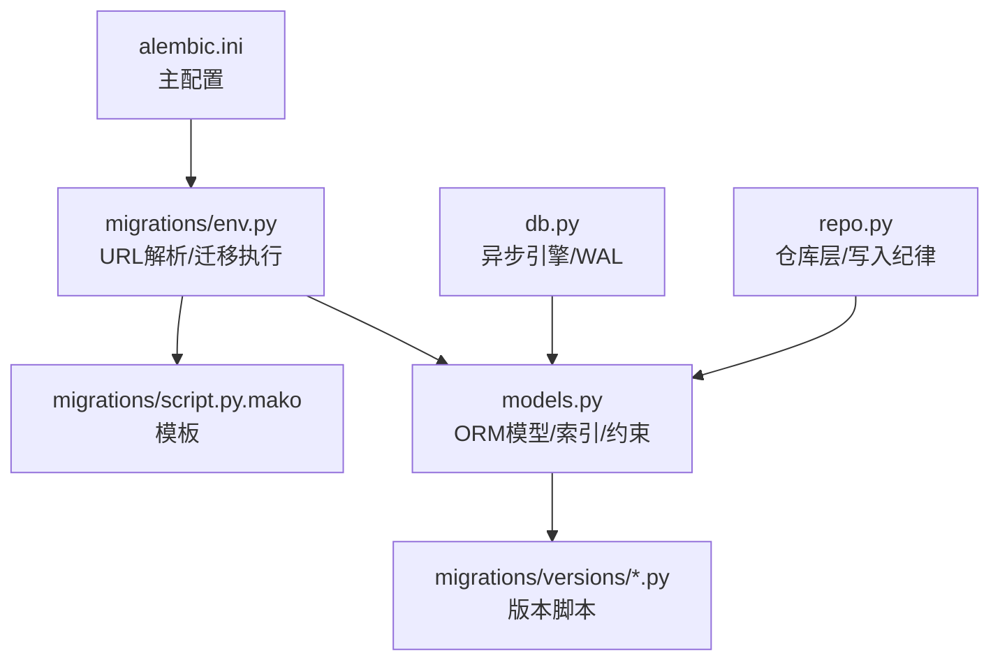
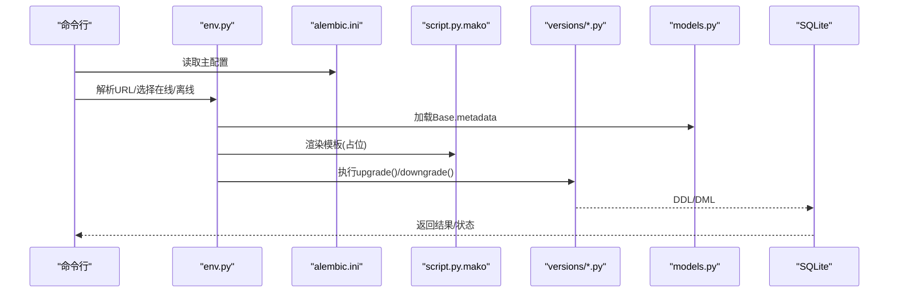
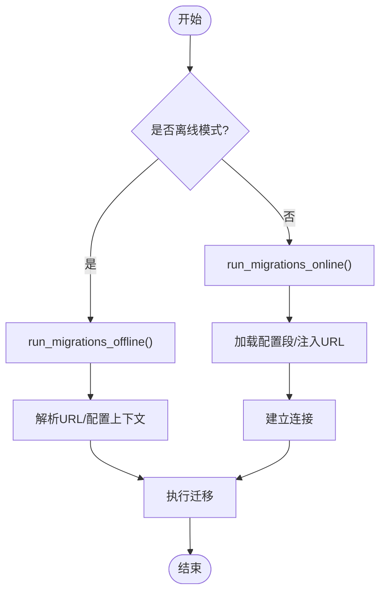
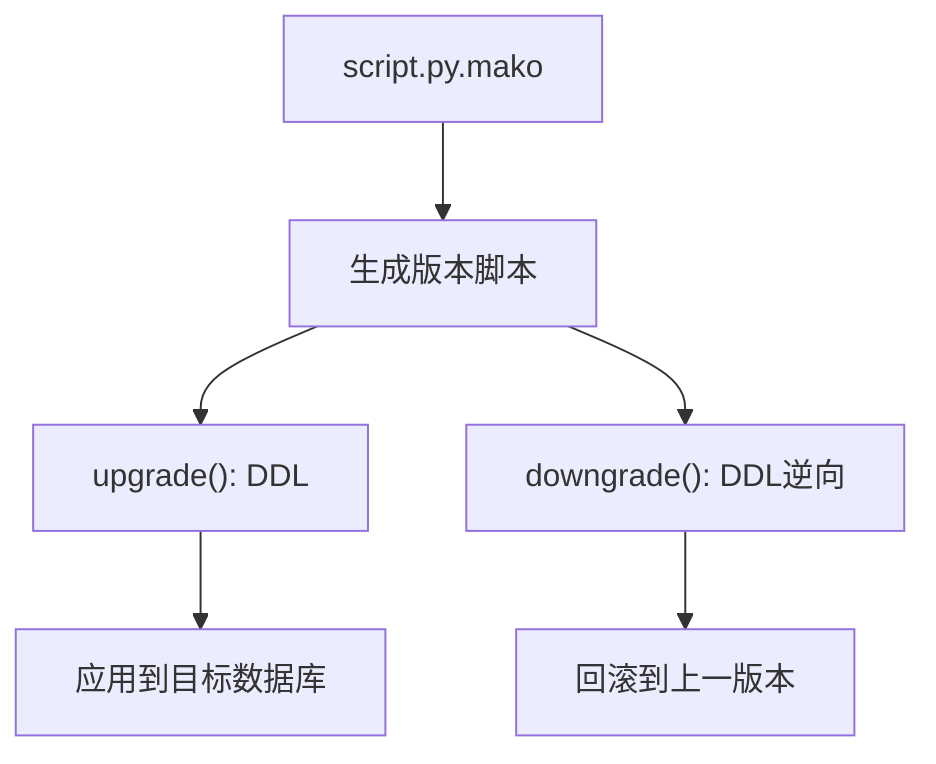
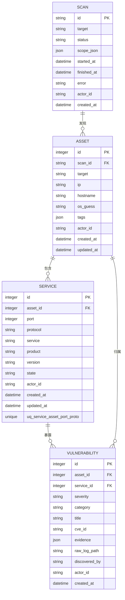
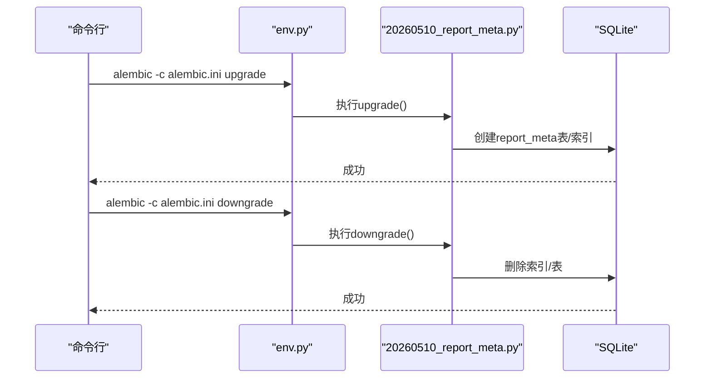
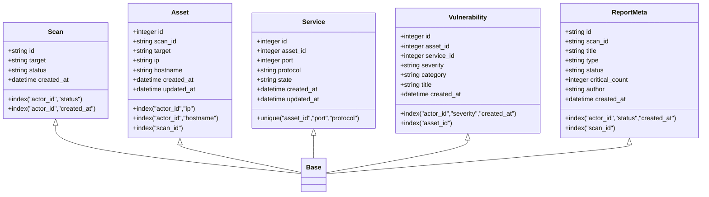
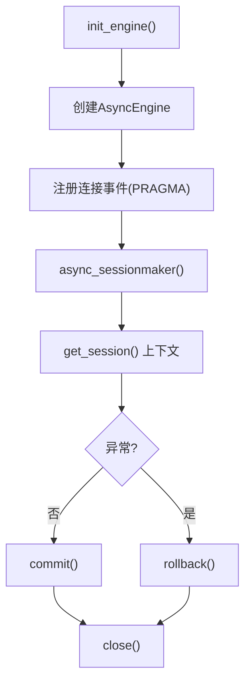
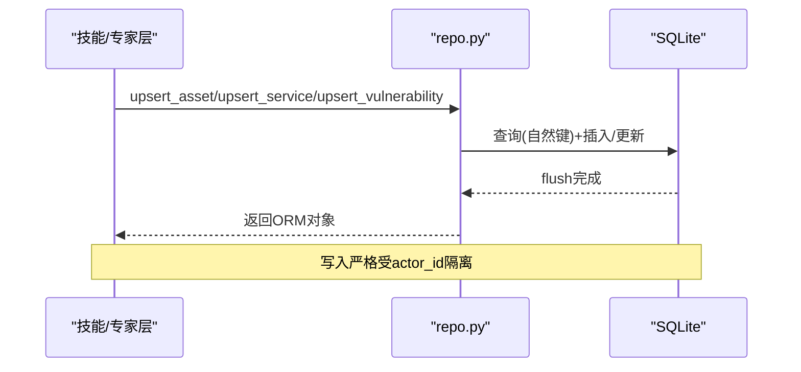
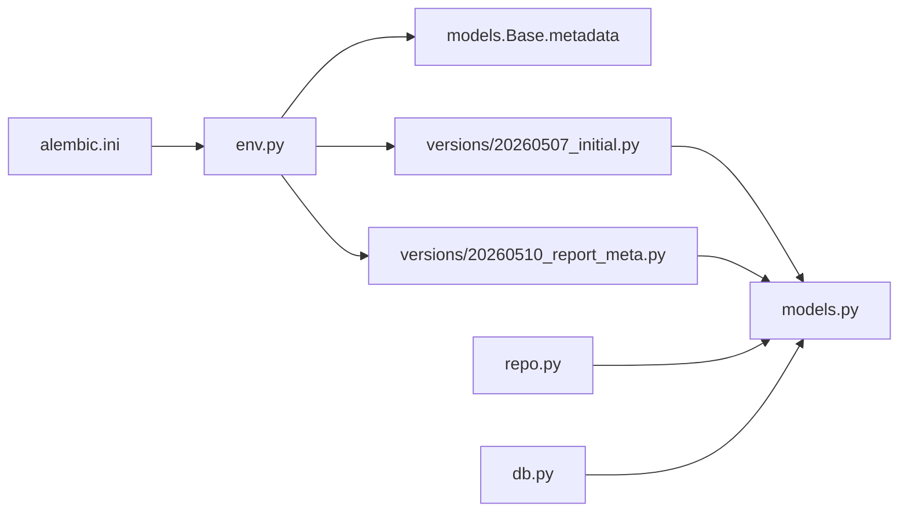

# 迁移管理

<cite>
**本文引用的文件**
- [secbot/cmdb/migrations/env.py](file://secbot/cmdb/migrations/env.py)
- [secbot/cmdb/migrations/script.py.mako](file://secbot/cmdb/migrations/script.py.mako)
- [secbot/cmdb/alembic.ini](file://secbot/cmdb/alembic.ini)
- [secbot/cmdb/migrations/versions/20260507_initial.py](file://secbot/cmdb/migrations/versions/20260507_initial.py)
- [secbot/cmdb/migrations/versions/20260510_report_meta.py](file://secbot/cmdb/migrations/versions/20260510_report_meta.py)
- [secbot/cmdb/models.py](file://secbot/cmdb/models.py)
- [secbot/cmdb/db.py](file://secbot/cmdb/db.py)
- [secbot/cmdb/repo.py](file://secbot/cmdb/repo.py)
- [.trellis/spec/backend/cmdb-schema.md](file://.trellis/spec/backend/cmdb-schema.md)
- [.trellis/spec/backend/report-meta.md](file://.trellis/spec/backend/report-meta.md)
- [tests/cmdb/test_repo.py](file://tests/cmdb/test_repo.py)
</cite>

## 目录
1. [简介](#简介)
2. [项目结构](#项目结构)
3. [核心组件](#核心组件)
4. [架构总览](#架构总览)
5. [详细组件分析](#详细组件分析)
6. [依赖关系分析](#依赖关系分析)
7. [性能考量](#性能考量)
8. [故障排查指南](#故障排查指南)
9. [结论](#结论)
10. [附录](#附录)

## 简介
本文件面向 VAPT3 的数据库迁移管理，系统化梳理 Alembic 迁移框架在本地 CMDB（资产/服务/漏洞/扫描）子系统的配置与使用，覆盖迁移脚本生成、版本控制、数据库状态跟踪、回滚机制与版本升级策略、数据安全与完整性保障、测试与生产部署最佳实践、调试与故障排除方法，以及针对大表变更的性能优化建议。内容以 secbot/cmdb 子模块为核心，结合模型定义、迁移脚本与配置文件，辅以规范文档与测试用例，帮助读者在不直接阅读代码的前提下理解并正确使用迁移体系。

## 项目结构
CMDB 迁移相关的核心位置如下：
- 迁移配置与入口
  - alembic.ini：Alembic 主配置，指定脚本目录、日志级别等
  - migrations/env.py：运行时 URL 解析、离线/在线迁移执行逻辑
  - migrations/script.py.mako：迁移模板，生成 upgrade()/downgrade() 占位
- 版本脚本
  - migrations/versions/*.py：具体迁移版本，如初始架构与新增 report_meta 表
- 数据层
  - models.py：SQLAlchemy 2.x ORM 模型与索引/约束定义
  - db.py：异步引擎与会话工厂（SQLite，WAL 模式）
  - repo.py：业务仓库层（upsert、查询、聚合），确保 actor_id 隔离与写入纪律

**图表来源**
- [secbot/cmdb/alembic.ini:1-45](file://secbot/cmdb/alembic.ini#L1-L45)
- [secbot/cmdb/migrations/env.py:1-78](file://secbot/cmdb/migrations/env.py#L1-L78)
- [secbot/cmdb/migrations/script.py.mako:1-29](file://secbot/cmdb/migrations/script.py.mako#L1-L29)
- [secbot/cmdb/models.py:1-263](file://secbot/cmdb/models.py#L1-L263)
- [secbot/cmdb/db.py:1-133](file://secbot/cmdb/db.py#L1-L133)
- [secbot/cmdb/repo.py:1-994](file://secbot/cmdb/repo.py#L1-L994)

**章节来源**
- [secbot/cmdb/alembic.ini:1-45](file://secbot/cmdb/alembic.ini#L1-L45)
- [secbot/cmdb/migrations/env.py:1-78](file://secbot/cmdb/migrations/env.py#L1-L78)
- [secbot/cmdb/migrations/script.py.mako:1-29](file://secbot/cmdb/migrations/script.py.mako#L1-L29)
- [secbot/cmdb/models.py:1-263](file://secbot/cmdb/models.py#L1-L263)
- [secbot/cmdb/db.py:1-133](file://secbot/cmdb/db.py#L1-L133)
- [secbot/cmdb/repo.py:1-994](file://secbot/cmdb/repo.py#L1-L994)

## 核心组件
- Alembic 环境与 URL 解析
  - 在线/离线模式分别通过 env.py 中的 run_migrations_online/offline 执行
  - URL 解析优先级：命令行 -x url > 环境变量 > 默认 SQLite 路径（支持同步驱动剥离）
- 迁移模板与版本脚本
  - script.py.mako 提供标准模板，版本脚本按需实现 upgrade()/downgrade()
  - 版本文件命名遵循规范，记录修订关系与创建时间
- ORM 模型与索引/约束
  - models.py 定义表结构、索引、唯一约束与默认值，确保一致性
- 异步引擎与会话
  - db.py 使用 aiosqlite，默认启用 WAL、外键与超时设置，提升并发稳定性
- 仓库层与写入纪律
  - repo.py 实现 upsert、列表查询与聚合统计，强制 actor_id 隔离与自然键幂等

**章节来源**
- [secbot/cmdb/migrations/env.py:33-77](file://secbot/cmdb/migrations/env.py#L33-L77)
- [secbot/cmdb/migrations/script.py.mako:1-29](file://secbot/cmdb/migrations/script.py.mako#L1-L29)
- [secbot/cmdb/migrations/versions/20260507_initial.py:1-159](file://secbot/cmdb/migrations/versions/20260507_initial.py#L1-L159)
- [secbot/cmdb/migrations/versions/20260510_report_meta.py:1-72](file://secbot/cmdb/migrations/versions/20260510_report_meta.py#L1-L72)
- [secbot/cmdb/models.py:34-263](file://secbot/cmdb/models.py#L34-L263)
- [secbot/cmdb/db.py:42-93](file://secbot/cmdb/db.py#L42-L93)
- [secbot/cmdb/repo.py:1-142](file://secbot/cmdb/repo.py#L1-L142)

## 架构总览
下图展示从 Alembic 到数据库的迁移执行链路，以及与 ORM 模型的关系：

**图表来源**
- [secbot/cmdb/alembic.ini:4-8](file://secbot/cmdb/alembic.ini#L4-L8)
- [secbot/cmdb/migrations/env.py:25-77](file://secbot/cmdb/migrations/env.py#L25-L77)
- [secbot/cmdb/migrations/script.py.mako:16-28](file://secbot/cmdb/migrations/script.py.mako#L16-L28)
- [secbot/cmdb/migrations/versions/20260507_initial.py:23-159](file://secbot/cmdb/migrations/versions/20260507_initial.py#L23-L159)
- [secbot/cmdb/migrations/versions/20260510_report_meta.py:24-72](file://secbot/cmdb/migrations/versions/20260510_report_meta.py#L24-L72)
- [secbot/cmdb/models.py:34-263](file://secbot/cmdb/models.py#L34-L263)

## 详细组件分析

### Alembic 环境与 URL 解析
- 在线迁移：从 alembic.ini 读取配置段，注入解析后的 sqlalchemy.url，建立连接后执行迁移
- 离线迁移：直接配置上下文 URL，使用批处理渲染以兼容 SQLite
- URL 解析顺序：命令行 -x url > 环境变量 > 默认用户目录下的 SQLite 文件路径

**图表来源**
- [secbot/cmdb/migrations/env.py:47-77](file://secbot/cmdb/migrations/env.py#L47-L77)

**章节来源**
- [secbot/cmdb/migrations/env.py:33-77](file://secbot/cmdb/migrations/env.py#L33-L77)

### 迁移模板与版本脚本
- 模板 script.py.mako 提供标准字段与函数占位，版本脚本仅填充实际 DDL
- 版本文件包含 revision、down_revision、branch_labels、depends_on，并实现 upgrade()/downgrade()

**图表来源**
- [secbot/cmdb/migrations/script.py.mako:16-28](file://secbot/cmdb/migrations/script.py.mako#L16-L28)

**章节来源**
- [secbot/cmdb/migrations/script.py.mako:1-29](file://secbot/cmdb/migrations/script.py.mako#L1-L29)

### 初始迁移与表结构
- 初始版本创建 scan、asset、service、vulnerability 四张表，定义外键、索引与唯一约束
- 重点约束与索引：
  - scan：actor_id+status、actor_id+created_at 复合索引
  - asset：actor_id+ip、actor_id+hostname、scan_id 索引
  - service：(asset_id,port,protocol) 唯一约束
  - vulnerability：actor_id+severity+created_at、asset_id 索引

**图表来源**
- [secbot/cmdb/migrations/versions/20260507_initial.py:23-159](file://secbot/cmdb/migrations/versions/20260507_initial.py#L23-L159)
- [secbot/cmdb/models.py:38-174](file://secbot/cmdb/models.py#L38-L174)

**章节来源**
- [secbot/cmdb/migrations/versions/20260507_initial.py:1-159](file://secbot/cmdb/migrations/versions/20260507_initial.py#L1-L159)
- [secbot/cmdb/models.py:38-174](file://secbot/cmdb/models.py#L38-L174)

### 新增 report_meta 表迁移
- 新增 report_meta 表用于持久化报告元信息，包含类型、状态、作者、下载路径等
- 关键索引：actor_id+status+created_at、scan_id
- downgrade 删除索引与表，保持幂等与可回滚

**图表来源**
- [secbot/cmdb/migrations/versions/20260510_report_meta.py:24-72](file://secbot/cmdb/migrations/versions/20260510_report_meta.py#L24-L72)
- [secbot/cmdb/migrations/env.py:74-77](file://secbot/cmdb/migrations/env.py#L74-L77)

**章节来源**
- [secbot/cmdb/migrations/versions/20260510_report_meta.py:1-72](file://secbot/cmdb/migrations/versions/20260510_report_meta.py#L1-L72)

### ORM 模型与约束
- models.py 定义了 Base 与各实体类，统一声明索引与约束
- 通过 server_default 与默认函数确保列默认值一致
- actor_id 统一存在且非空，为未来多租户保留空间

**图表来源**
- [secbot/cmdb/models.py:34-263](file://secbot/cmdb/models.py#L34-L263)

**章节来源**
- [secbot/cmdb/models.py:1-263](file://secbot/cmdb/models.py#L1-L263)

### 异步引擎与会话（SQLite）
- db.py 使用 aiosqlite，默认 WAL 模式、外键开启、busy_timeout 设置
- 通过事件钩子在每个新连接上应用 PRAGMA，减少“数据库被锁定”问题
- 提供 get_session() 上下文管理器，确保事务提交/回滚与关闭

**图表来源**
- [secbot/cmdb/db.py:64-122](file://secbot/cmdb/db.py#L64-L122)

**章节来源**
- [secbot/cmdb/db.py:1-133](file://secbot/cmdb/db.py#L1-L133)

### 仓库层与写入纪律
- repo.py 实现 upsert、列表查询与聚合统计，所有读写均受 actor_id 限制
- 写入纪律：自然键幂等、单次专家回合内一次性事务、禁止绕过 actor_id
- 报告元数据：insert_report_meta 后续由调用方负责渲染文件，再写入持久化记录

**图表来源**
- [secbot/cmdb/repo.py:149-384](file://secbot/cmdb/repo.py#L149-L384)
- [.trellis/spec/backend/cmdb-schema.md:155-179](file://.trellis/spec/backend/cmdb-schema.md#L155-L179)

**章节来源**
- [secbot/cmdb/repo.py:1-994](file://secbot/cmdb/repo.py#L1-L994)
- [.trellis/spec/backend/cmdb-schema.md:155-179](file://.trellis/spec/backend/cmdb-schema.md#L155-L179)

## 依赖关系分析
- 运行时依赖
  - env.py 依赖 models.Base.metadata 作为 target_metadata
  - 版本脚本依赖 Alembic op 与 SQLAlchemy 类型进行 DDL
- 数据层依赖
  - ORM 模型定义约束与索引，影响迁移脚本的创建/删除顺序
  - repo 层依赖 ORM 模型与 db.get_session() 事务边界
- 配置依赖
  - alembic.ini 指定脚本位置与日志级别；env.py 动态解析 sqlalchemy.url

**图表来源**
- [secbot/cmdb/migrations/env.py:23-30](file://secbot/cmdb/migrations/env.py#L23-L30)
- [secbot/cmdb/migrations/versions/20260507_initial.py:14-15](file://secbot/cmdb/migrations/versions/20260507_initial.py#L14-L15)
- [secbot/cmdb/migrations/versions/20260510_report_meta.py:15-16](file://secbot/cmdb/migrations/versions/20260510_report_meta.py#L15-L16)
- [secbot/cmdb/models.py:25-35](file://secbot/cmdb/models.py#L25-L35)
- [secbot/cmdb/repo.py:26-40](file://secbot/cmdb/repo.py#L26-L40)
- [secbot/cmdb/db.py:18-23](file://secbot/cmdb/db.py#L18-L23)
- [secbot/cmdb/alembic.ini:4-8](file://secbot/cmdb/alembic.ini#L4-L8)

**章节来源**
- [secbot/cmdb/migrations/env.py:23-30](file://secbot/cmdb/migrations/env.py#L23-L30)
- [secbot/cmdb/migrations/versions/20260507_initial.py:14-16](file://secbot/cmdb/migrations/versions/20260507_initial.py#L14-L16)
- [secbot/cmdb/migrations/versions/20260510_report_meta.py:15-16](file://secbot/cmdb/migrations/versions/20260510_report_meta.py#L15-L16)
- [secbot/cmdb/models.py:25-35](file://secbot/cmdb/models.py#L25-L35)
- [secbot/cmdb/repo.py:26-40](file://secbot/cmdb/repo.py#L26-L40)
- [secbot/cmdb/db.py:18-23](file://secbot/cmdb/db.py#L18-L23)
- [secbot/cmdb/alembic.ini:4-8](file://secbot/cmdb/alembic.ini#L4-L8)

## 性能考量
- SQLite WAL 模式
  - db.py 在新连接上启用 PRAGMA journal_mode=WAL、foreign_keys=ON、busy_timeout，降低短写入场景的“数据库被锁定”概率
- 批处理渲染
  - env.py 在上下文配置中启用 render_as_batch=True，兼容 SQLite 的批处理 DDL
- 索引设计
  - 初始迁移脚本为高频过滤列建立复合索引，配合查询过滤条件（如 actor_id、状态、时间）提升查询效率
- 大表变更建议
  - 优先采用在线变更（新增列/索引），避免 DROP/RENAME
  - 对于破坏性变更，遵循“弃用-清理”两步走策略，分版本逐步推进
  - 变更前评估锁竞争与备份窗口，必要时在维护窗口执行

**章节来源**
- [secbot/cmdb/db.py:51-61](file://secbot/cmdb/db.py#L51-L61)
- [secbot/cmdb/migrations/env.py:47-71](file://secbot/cmdb/migrations/env.py#L47-L71)
- [secbot/cmdb/migrations/versions/20260507_initial.py:41-144](file://secbot/cmdb/migrations/versions/20260507_initial.py#L41-L144)
- [.trellis/spec/backend/cmdb-schema.md:174-179](file://.trellis/spec/backend/cmdb-schema.md#L174-L179)

## 故障排查指南
- 迁移 URL 问题
  - 确认环境变量 SECBOT_CMDB_URL 或通过 -x url 显式传入
  - 若未设置，将回退到用户目录下的 SQLite 文件路径
- 离线/在线模式误用
  - 在线模式要求数据库可连接；离线模式适合生成迁移脚本或无数据库环境
- 权限与路径
  - 确保目标路径存在且具备写权限；首次运行会自动创建目录
- 回滚失败
  - 检查 downgrade 顺序与依赖关系；确保依赖表/索引按逆序删除
- 测试验证
  - 使用 tests/cmdb/test_repo.py 中的多租户隔离与幂等性测试，验证 actor_id 与 upsert 行为
- 日志与诊断
  - alembic.ini 已配置日志级别，可通过输出定位迁移阶段与错误点

**章节来源**
- [secbot/cmdb/migrations/env.py:33-44](file://secbot/cmdb/migrations/env.py#L33-L44)
- [secbot/cmdb/alembic.ini:21-44](file://secbot/cmdb/alembic.ini#L21-L44)
- [tests/cmdb/test_repo.py:47-99](file://tests/cmdb/test_repo.py#L47-L99)

## 结论
VAPT3 的 CMDB 迁移体系以 Alembic 为核心，结合严格的 ORM 模型定义、在线/离线迁移执行、批处理渲染与 SQLite WAL 优化，形成了可演进、可回滚、可测试的数据库治理方案。通过 actor_id 隔离与写入纪律，确保多租户能力的平滑扩展。遵循“在线变更优先、破坏性变更两步走”的策略，配合完善的测试与日志，可在生产环境中安全地推进架构演进。

## 附录

### 迁移脚本编写规范
- 命名与版本
  - 每个改动对应一个 Alembic 版本；文件名遵循日期+语义化命名
- DDL 规范
  - 新增列/索引优先；删除列/表需两步：先弃用（标记为废弃），再清理
  - 保持 down_revision 正确指向，确保可回滚
- 约束与索引
  - 与 models.py 保持一致；DDL 与 ORM 约束一一对应
- 幂等性
  - upgrade()/downgrade() 必须幂等，避免重复执行导致异常

**章节来源**
- [.trellis/spec/backend/cmdb-schema.md:174-179](file://.trellis/spec/backend/cmdb-schema.md#L174-L179)
- [secbot/cmdb/migrations/versions/20260507_initial.py:1-159](file://secbot/cmdb/migrations/versions/20260507_initial.py#L1-L159)
- [secbot/cmdb/migrations/versions/20260510_report_meta.py:1-72](file://secbot/cmdb/migrations/versions/20260510_report_meta.py#L1-L72)

### 回滚机制与版本升级策略
- 回滚
  - 通过 downgrade() 逆向执行，按依赖顺序删除索引/表
- 版本升级
  - 采用在线变更为主；破坏性变更采用“弃用-清理”两步走
  - 严格控制每 PR 的迁移粒度，确保可追踪与可审计

**章节来源**
- [secbot/cmdb/migrations/versions/20260507_initial.py:147-159](file://secbot/cmdb/migrations/versions/20260507_initial.py#L147-L159)
- [secbot/cmdb/migrations/versions/20260510_report_meta.py:66-72](file://secbot/cmdb/migrations/versions/20260510_report_meta.py#L66-L72)
- [.trellis/spec/backend/cmdb-schema.md:174-179](file://.trellis/spec/backend/cmdb-schema.md#L174-L179)

### 数据安全与完整性保护
- actor_id 隔离
  - 所有读写必须带 actor_id 过滤；仓库层强制首参为 actor_id
- 自然键幂等
  - upsert 基于自然键，避免重复与竞态
- 事务边界
  - 单次专家回合内一次性事务，避免跨轮次状态不一致

**章节来源**
- [secbot/cmdb/repo.py:149-384](file://secbot/cmdb/repo.py#L149-L384)
- [.trellis/spec/backend/cmdb-schema.md:155-179](file://.trellis/spec/backend/cmdb-schema.md#L155-L179)

### 测试策略与生产部署
- 测试策略
  - 使用 tests/cmdb/conftest.py 的内存 SQLite 测试夹具，确保每次测试均应用全部迁移
  - 验证多租户隔离、upsert 幂等、枚举校验等关键行为
- 生产部署
  - 预发布演练：在预生产环境执行 upgrade head，确认无阻塞性变更
  - 回滚预案：保留上一版本快照，确保 downgrade 可用
  - 分批发布：小步快跑，每 PR 仅引入一个迁移版本

**章节来源**
- [tests/cmdb/test_repo.py:1-265](file://tests/cmdb/test_repo.py#L1-L265)
- [.trellis/spec/backend/cmdb-schema.md:174-179](file://.trellis/spec/backend/cmdb-schema.md#L174-L179)

### 调试与故障排除
- 常见问题
  - URL 解析失败：检查环境变量与 -x url 参数
  - 离线/在线模式混淆：根据目标环境选择对应模式
  - 锁竞争：评估 WAL 与 busy_timeout 设置，必要时缩短事务
- 排障步骤
  - 查看 alembic.ini 日志输出
  - 使用 downgrade 回退到上一个稳定版本
  - 通过测试用例复现并定位问题

**章节来源**
- [secbot/cmdb/migrations/env.py:33-44](file://secbot/cmdb/migrations/env.py#L33-L44)
- [secbot/cmdb/alembic.ini:21-44](file://secbot/cmdb/alembic.ini#L21-L44)
- [secbot/cmdb/db.py:51-61](file://secbot/cmdb/db.py#L51-L61)