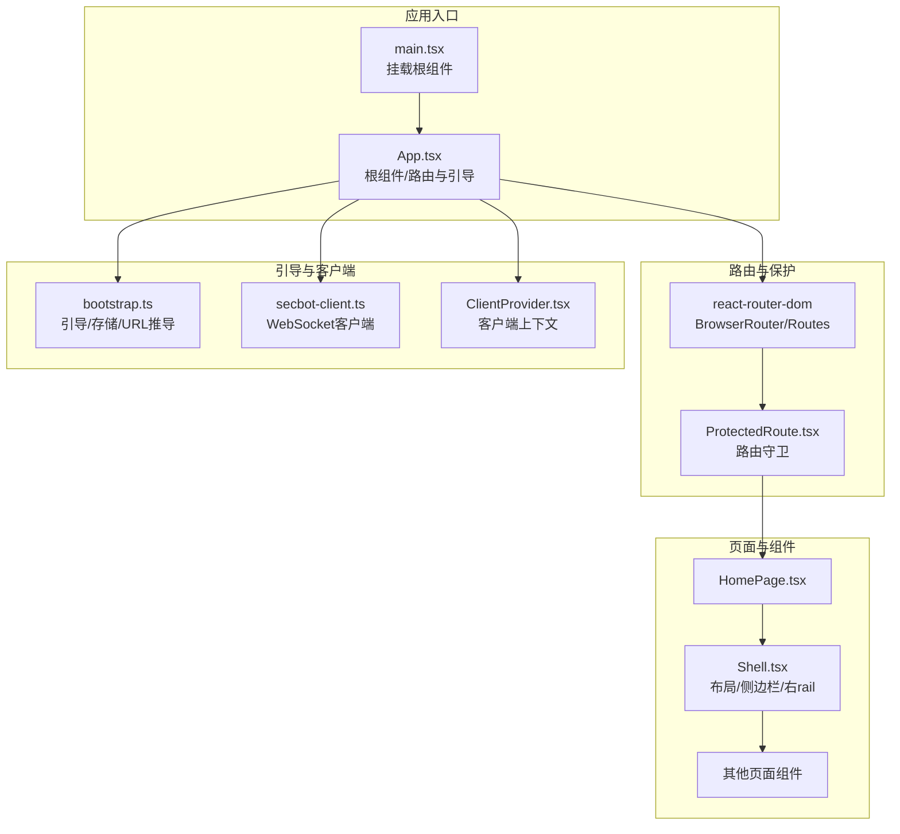
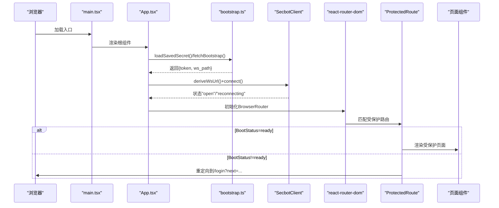
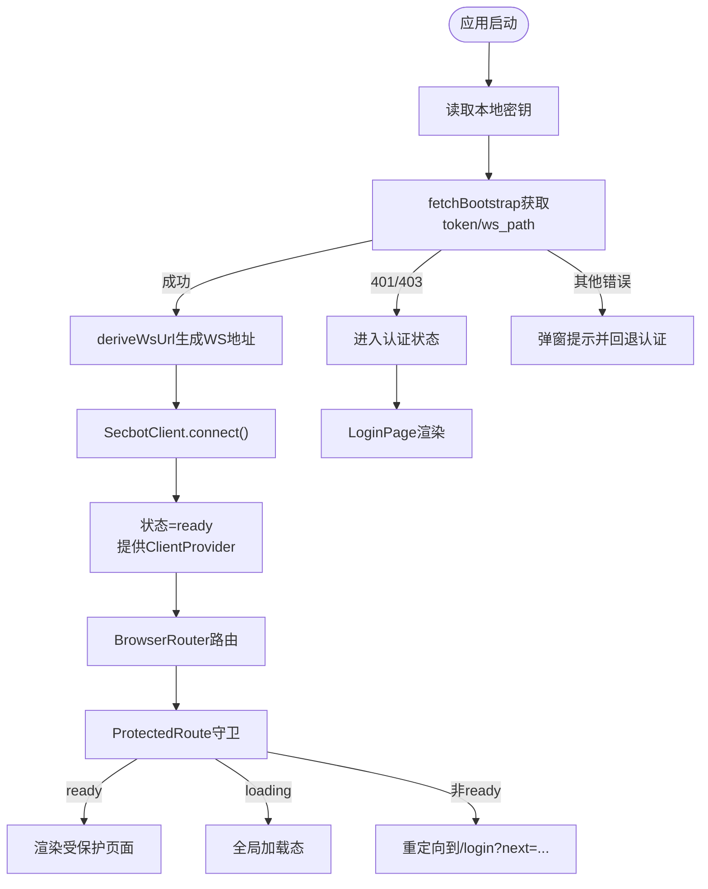
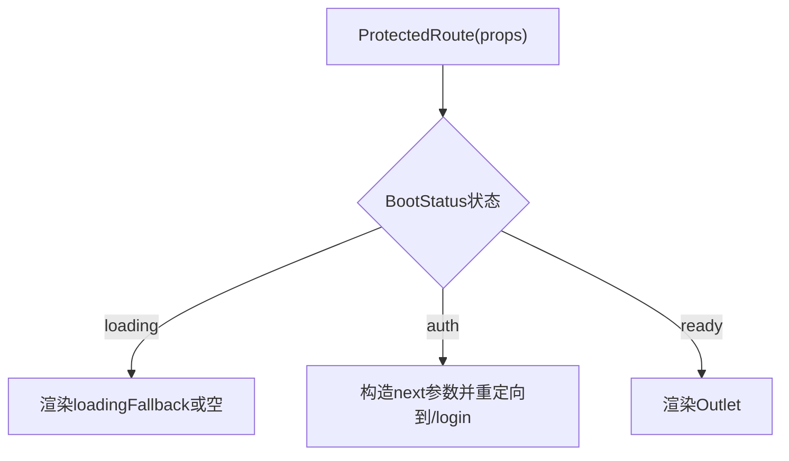
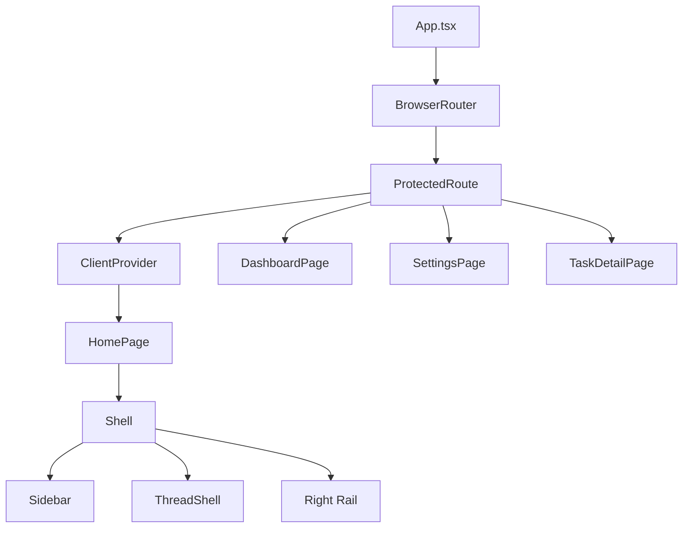
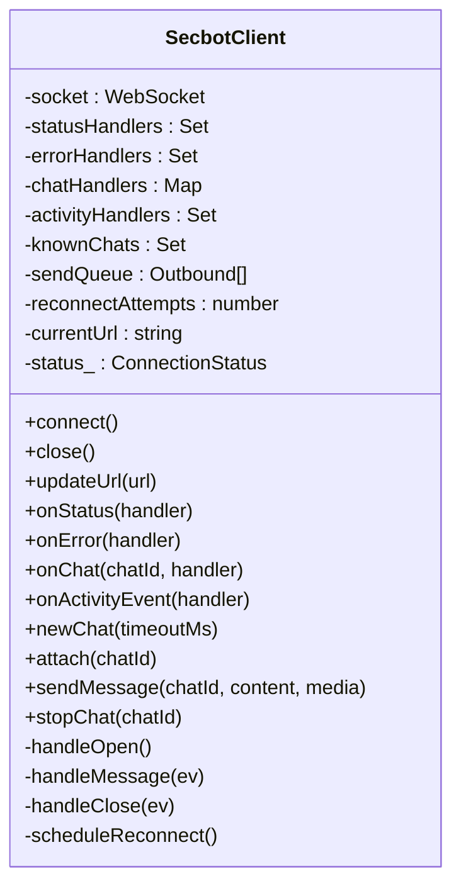
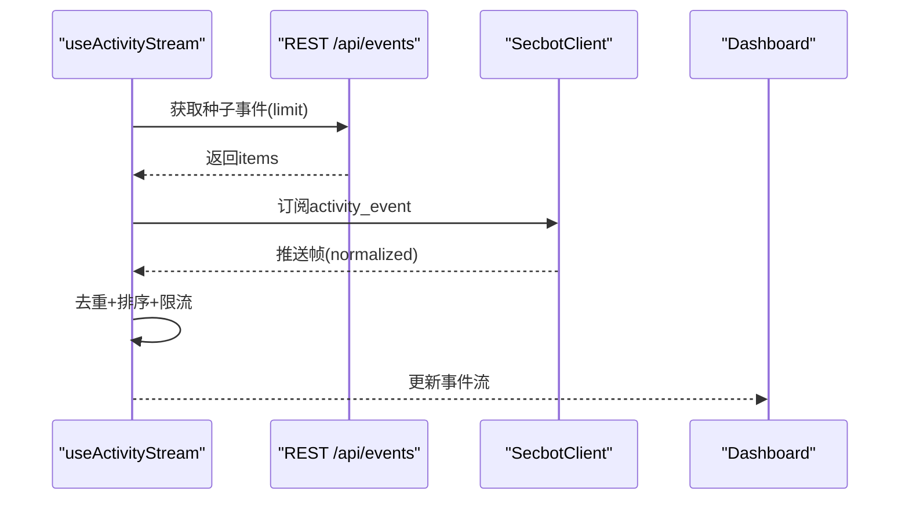
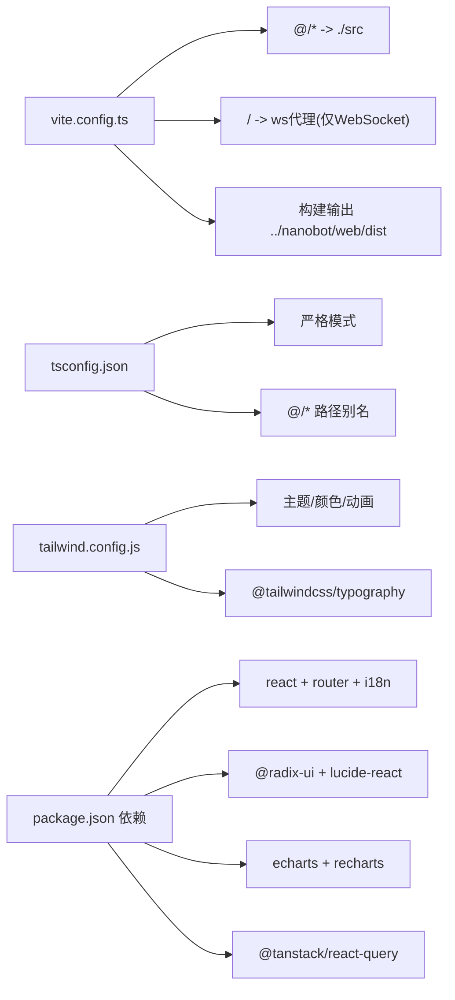

# React架构设计

<cite>
**本文档引用的文件**
- [App.tsx](file://webui/src/App.tsx)
- [main.tsx](file://webui/src/main.tsx)
- [bootstrap.ts](file://webui/src/lib/bootstrap.ts)
- [ProtectedRoute.tsx](file://webui/src/components/ProtectedRoute.tsx)
- [ClientProvider.tsx](file://webui/src/providers/ClientProvider.tsx)
- [secbot-client.ts](file://webui/src/lib/secbot-client.ts)
- [Shell.tsx](file://webui/src/components/Shell.tsx)
- [HomePage.tsx](file://webui/src/pages/HomePage.tsx)
- [vite.config.ts](file://webui/vite.config.ts)
- [tsconfig.json](file://webui/tsconfig.json)
- [package.json](file://webui/package.json)
- [tailwind.config.js](file://webui/tailwind.config.js)
- [postcss.config.js](file://webui/postcss.config.js)
- [useActivityStream.ts](file://webui/src/hooks/useActivityStream.ts)
- [useSessions.ts](file://webui/src/hooks/useSessions.ts)
</cite>

## 目录
1. [引言](#引言)
2. [项目结构](#项目结构)
3. [核心组件](#核心组件)
4. [架构总览](#架构总览)
5. [详细组件分析](#详细组件分析)
6. [依赖分析](#依赖分析)
7. [性能考虑](#性能考虑)
8. [故障排除指南](#故障排除指南)
9. [结论](#结论)
10. [附录](#附录)

## 引言
本文件针对VAPT3 WebUI（React部分）进行系统化技术文档梳理，重点围绕以下目标展开：  
- 深入解析App.tsx作为根组件的设计模式与控制流，包括引导程序(bootstrap)机制、客户端初始化流程、WebSocket连接管理等  
- 全面阐述路由系统设计，包括ProtectedRoute保护机制、模板模式切换(VITE_UIUX_TEMPLATE)、路由守卫等  
- 分析组件树结构，从App根组件到各页面组件的层次关系  
- 解析构建配置与开发环境设置，包括Vite配置、TypeScript配置、TailwindCSS集成等  
- 提供架构决策的技术考量与性能优化策略

## 项目结构
WebUI采用基于功能域的模块化组织方式，核心目录与职责如下：
- src：应用源代码
  - components：可复用UI组件（如Shell、ProtectedRoute、各种对话与通知组件）
  - pages：页面级组件（如HomePage、DashboardPage、LoginPage、SettingsPage、TaskDetailPage）
  - providers：上下文提供者（如ClientProvider）
  - hooks：自定义Hook（如useActivityStream、useSessions）
  - lib：底层能力封装（如bootstrap、secbot-client、api、types等）
  - i18n：国际化资源与配置
  - workers：Web Worker（如图像编码）
  - tests：测试工具与用例
- 构建与样式
  - vite.config.ts：Vite开发与构建配置
  - tsconfig.json：TypeScript编译选项
  - tailwind.config.js：TailwindCSS主题与插件配置
  - postcss.config.js：PostCSS处理管线
  - package.json：依赖与脚本

**图表来源**
- [main.tsx:1-16](file://webui/src/main.tsx#L1-L16)
- [App.tsx:54-232](file://webui/src/App.tsx#L54-L232)
- [bootstrap.ts:37-77](file://webui/src/lib/bootstrap.ts#L37-L77)
- [secbot-client.ts:59-377](file://webui/src/lib/secbot-client.ts#L59-L377)
- [ClientProvider.tsx:24-58](file://webui/src/providers/ClientProvider.tsx#L24-L58)
- [ProtectedRoute.tsx:42-59](file://webui/src/components/ProtectedRoute.tsx#L42-L59)
- [HomePage.tsx:25-45](file://webui/src/pages/HomePage.tsx#L25-L45)
- [Shell.tsx:70-371](file://webui/src/components/Shell.tsx#L70-L371)

**章节来源**
- [main.tsx:1-16](file://webui/src/main.tsx#L1-L16)
- [App.tsx:54-232](file://webui/src/App.tsx#L54-L232)

## 核心组件
本节聚焦于App.tsx根组件及其关键协作组件，阐明其职责边界与交互关系。

- App.tsx
  - 职责：应用启动、引导状态管理、路由分发、模板模式切换、WebSocket客户端生命周期管理
  - 关键点：
    - 引导状态类型BootStatus统一管理"loading/auth/ready"
    - 通过fetchBootstrap获取短期令牌与WS路径，deriveWsUrl生成WS地址
    - SecbotClient负责连接、重连、订阅与消息发送
    - 支持模板模式(VITE_UIUX_TEMPLATE)与传统内联视图双路径
    - 提供全局加载态与错误提示

- ProtectedRoute.tsx
  - 职责：基于BootStatus进行路由守卫，未认证时重定向至登录页并保留next参数
  - 关键点：与App共享BootStatus，避免重复读取密钥；loading状态下渲染父级全局spinner

- ClientProvider.tsx
  - 职责：在受保护路由内注入SecbotClient实例、令牌与模型名，并提供全局未读计数
  - 关键点：单例REST轮询避免重复流量；useClient/useUnread简化消费端接入

- bootstrap.ts
  - 职责：引导数据获取、本地存储、WS URL推导
  - 关键点：localStorage持久化共享密钥；严格校验响应字段；WS路径保持原始格式

- secbot-client.ts
  - 职责：WebSocket单例客户端，多聊天ID多路复用，透明重连与事件分发
  - 关键点：连接状态机、队列发送、活动事件全局广播、结构化错误上报

**章节来源**
- [App.tsx:54-232](file://webui/src/App.tsx#L54-L232)
- [ProtectedRoute.tsx:11-59](file://webui/src/components/ProtectedRoute.tsx#L11-L59)
- [ClientProvider.tsx:9-58](file://webui/src/providers/ClientProvider.tsx#L9-L58)
- [bootstrap.ts:3-77](file://webui/src/lib/bootstrap.ts#L3-L77)
- [secbot-client.ts:59-377](file://webui/src/lib/secbot-client.ts#L59-L377)

## 架构总览
下图展示从应用启动到路由分发、客户端连接与页面渲染的全链路：

**图表来源**
- [main.tsx:11-15](file://webui/src/main.tsx#L11-L15)
- [App.tsx:57-102](file://webui/src/App.tsx#L57-L102)
- [bootstrap.ts:37-58](file://webui/src/lib/bootstrap.ts#L37-L58)
- [secbot-client.ts:155-165](file://webui/src/lib/secbot-client.ts#L155-L165)
- [ProtectedRoute.tsx:42-59](file://webui/src/components/ProtectedRoute.tsx#L42-L59)

## 详细组件分析

### App.tsx：根组件与引导流程
- 引导程序(bootstrap)机制
  - 读取本地保存的共享密钥，调用fetchBootstrap获取短期令牌与WS路径
  - deriveWsUrl根据当前页面协议与服务器返回路径生成WS URL
  - 创建SecbotClient实例，注册onReauth以支持令牌刷新
- 客户端初始化流程
  - 连接成功后，状态切换为"ready"，向子树提供ClientProvider
  - 处理401/403错误：显示认证表单而非错误页
  - 其他异常：弹窗提示并回退到认证状态
- WebSocket连接管理
  - onReauth回调中重新fetchBootstrap并更新WS URL
  - handleLogout关闭连接、清理密钥并回到认证状态
- 模板模式切换
  - 通过VITE_UIUX_TEMPLATE控制是否启用新路由模式
  - 新模式下App仅负责全局加载态，路由与守卫由BrowserRouter/ProtectedRoute承担
- 组件树与页面渲染
  - 在模板模式下，受保护路由内使用ClientProvider包裹Shell/HomePage等页面
  - 传统模式下直接渲染Shell并传入client/token/modelName

**图表来源**
- [App.tsx:57-102](file://webui/src/App.tsx#L57-L102)
- [bootstrap.ts:37-58](file://webui/src/lib/bootstrap.ts#L37-L58)
- [secbot-client.ts:155-165](file://webui/src/lib/secbot-client.ts#L155-L165)
- [ProtectedRoute.tsx:42-59](file://webui/src/components/ProtectedRoute.tsx#L42-L59)

**章节来源**
- [App.tsx:54-232](file://webui/src/App.tsx#L54-L232)
- [bootstrap.ts:37-77](file://webui/src/lib/bootstrap.ts#L37-L77)
- [secbot-client.ts:59-377](file://webui/src/lib/secbot-client.ts#L59-L377)

### 路由系统与ProtectedRoute保护机制
- 路由守卫策略
  - BootStatus="loading"：渲染父级全局加载态，避免闪烁
  - BootStatus="auth"：重定向到/login，携带next参数以便登录后跳转
  - BootStatus="ready"：渲染Outlet，允许访问受保护内容
- 模板模式与传统模式
  - 模板模式：BrowserRouter集中管理路由，ProtectedRoute作为嵌套守卫
  - 传统模式：App内部直接渲染Shell，不使用BrowserRouter
- 路由层级
  - /login：登录页
  - /：首页（受保护）
  - /dashboard：仪表盘（受保护）
  - /tasks/:id：任务详情（受保护）
  - /settings：设置页（受保护）

**图表来源**
- [ProtectedRoute.tsx:42-59](file://webui/src/components/ProtectedRoute.tsx#L42-L59)

**章节来源**
- [ProtectedRoute.tsx:11-59](file://webui/src/components/ProtectedRoute.tsx#L11-L59)
- [App.tsx:179-231](file://webui/src/App.tsx#L179-L231)

### 组件树结构：从App到页面
- 根组件App
  - 模板模式：BrowserRouter -> ProtectedRoute -> 受保护页面
  - 传统模式：直接渲染Shell
- 受保护页面
  - HomePage：承载Shell与右侧rail
  - DashboardPage/SettingsPage/TaskDetailPage：各自独立页面
- Shell布局
  - 左侧Sidebar（会话列表）
  - 中央ThreadShell（消息流）
  - 右侧rail（可选，如PromptSuggestions）
  - 设置视图（可内嵌或外部路由）

**图表来源**
- [App.tsx:179-231](file://webui/src/App.tsx#L179-L231)
- [HomePage.tsx:25-45](file://webui/src/pages/HomePage.tsx#L25-L45)
- [Shell.tsx:70-371](file://webui/src/components/Shell.tsx#L70-L371)

**章节来源**
- [App.tsx:179-231](file://webui/src/App.tsx#L179-L231)
- [HomePage.tsx:25-45](file://webui/src/pages/HomePage.tsx#L25-L45)
- [Shell.tsx:70-371](file://webui/src/components/Shell.tsx#L70-L371)

### WebSocket客户端：SecbotClient
- 设计要点
  - 单例模式：一个WebSocket承载多个chat_id
  - 透明重连：断线自动指数退避重连，必要时触发onReauth刷新URL
  - 事件分发：按chat_id分发，同时支持全局活动事件广播
  - 队列发送：连接未就绪时缓存帧，OPEN后批量发送
- 错误处理
  - 结构化错误：如消息过大（1009）上报给UI
  - 订阅者隔离：单个订阅者异常不影响其他订阅者
- 生命周期
  - connect/close/updateUrl/newChat/attach/sendMessage/stopChat等

**图表来源**
- [secbot-client.ts:59-377](file://webui/src/lib/secbot-client.ts#L59-L377)

**章节来源**
- [secbot-client.ts:59-377](file://webui/src/lib/secbot-client.ts#L59-L377)

### 数据流与Hook：活动流与会话管理
- useActivityStream
  - 首次加载通过REST种子获取最近事件，随后订阅WS活动帧
  - 合并去重并按时间倒序，限制内存占用
  - 对WS帧进行归一化，确保与REST结果一致
- useSessions
  - 列出会话、创建/删除会话、懒加载历史消息
  - 乐观插入新会话，等待服务端确认后替换
  - 历史消息重建工具调用轨迹，保证回放一致性

**图表来源**
- [useActivityStream.ts:139-197](file://webui/src/hooks/useActivityStream.ts#L139-L197)
- [secbot-client.ts:141-153](file://webui/src/lib/secbot-client.ts#L141-L153)

**章节来源**
- [useActivityStream.ts:139-197](file://webui/src/hooks/useActivityStream.ts#L139-L197)
- [useSessions.ts:124-203](file://webui/src/hooks/useSessions.ts#L124-L203)

## 依赖分析
- 构建与打包
  - Vite：开发服务器、HMR、代理、构建输出目录映射到后端静态资源
  - TypeScript：严格模式、路径别名、JSX编译
  - TailwindCSS：原子类、暗色模式、插件扩展
- 运行时依赖
  - React生态：react、react-router-dom、react-i18next
  - UI库：Radix UI、Lucide React
  - 状态与可视化：TanStack React Query、ECharts、Recharts
  - 国际化：i18next
- 开发依赖
  - 测试：Vitest + happy-dom
  - 样式：TailwindCSS、Autoprefixer、Typography插件

**图表来源**
- [vite.config.ts:5-65](file://webui/vite.config.ts#L5-L65)
- [tsconfig.json:24-30](file://webui/tsconfig.json#L24-L30)
- [tailwind.config.js:5-165](file://webui/tailwind.config.js#L5-L165)
- [package.json:14-66](file://webui/package.json#L14-L66)

**章节来源**
- [vite.config.ts:5-65](file://webui/vite.config.ts#L5-L65)
- [tsconfig.json:24-30](file://webui/tsconfig.json#L24-L30)
- [tailwind.config.js:5-165](file://webui/tailwind.config.js#L5-L165)
- [package.json:14-66](file://webui/package.json#L14-L66)

## 性能考虑
- 启动与首屏
  - App在引导阶段统一管理加载态，避免受保护内容闪烁
  - 使用requestIdleCallback预热Markdown文本，减少首次渲染抖动
- 网络与连接
  - SecbotClient透明重连与指数退避，最大退避可配置
  - 队列发送避免丢帧，连接恢复后批量重放
  - onReauth回调刷新令牌，避免频繁中断
- 内存与渲染
  - useActivityStream限制环形缓冲区大小，防止长会话内存膨胀
  - useSessions乐观插入与服务端确认替换，减少闪烁与重复请求
- 构建与开发
  - Vite HMR与WebSocket升级分离端口，避免写入冲突
  - 代理规则仅转发WebSocket升级，静态SPA仍由Vite提供
  - 构建禁用source map以减小体积

[本节为通用性能建议，无需特定文件引用]

## 故障排除指南
- 引导失败
  - 现象：弹窗提示连接失败或反复要求输入密钥
  - 排查：检查NANOBOT_API_URL与代理配置；确认共享密钥正确；查看浏览器网络面板
- WebSocket连接问题
  - 现象：连接断开、重连风暴或消息过大错误
  - 排查：关注结构化错误"message_too_big"；检查媒体附件大小；确认onReauth回调可用
- 路由与认证
  - 现象：受保护页面无法访问或循环重定向
  - 排查：确认BootStatus状态；检查next参数；验证ClientProvider已注入
- 样式与主题
  - 现象：暗色模式不生效或样式缺失
  - 排查：确认Tailwind扫描路径；检查postcss处理链；验证主题变量

**章节来源**
- [App.tsx:84-97](file://webui/src/App.tsx#L84-L97)
- [secbot-client.ts:314-357](file://webui/src/lib/secbot-client.ts#L314-L357)
- [ProtectedRoute.tsx:49-56](file://webui/src/components/ProtectedRoute.tsx#L49-L56)
- [tailwind.config.js:5-165](file://webui/tailwind.config.js#L5-L165)

## 结论
VAPT3 WebUI的React架构以App.tsx为核心，结合引导程序、路由守卫与WebSocket客户端，实现了安全、稳定且可扩展的前端体验。通过模板模式与传统模式的双轨设计，既保障了平滑迁移，又维持了现有功能的稳定性。TailwindCSS与Vite的组合提供了高效的开发与构建体验。建议在后续迭代中持续关注长连接稳定性、内存占用与国际化覆盖度，以进一步提升用户体验与可维护性。

[本节为总结性内容，无需特定文件引用]

## 附录
- 关键环境变量
  - VITE_UIUX_TEMPLATE：控制模板模式开关（默认开启）
  - NANOBOT_API_URL：后端网关地址，默认http://127.0.0.1:8765
- 重要路径别名
  - @/* -> ./src（TypeScript与Vite均配置）

**章节来源**
- [App.tsx:34-35](file://webui/src/App.tsx#L34-L35)
- [vite.config.ts:7-8](file://webui/vite.config.ts#L7-L8)
- [tsconfig.json:27-29](file://webui/tsconfig.json#L27-L29)