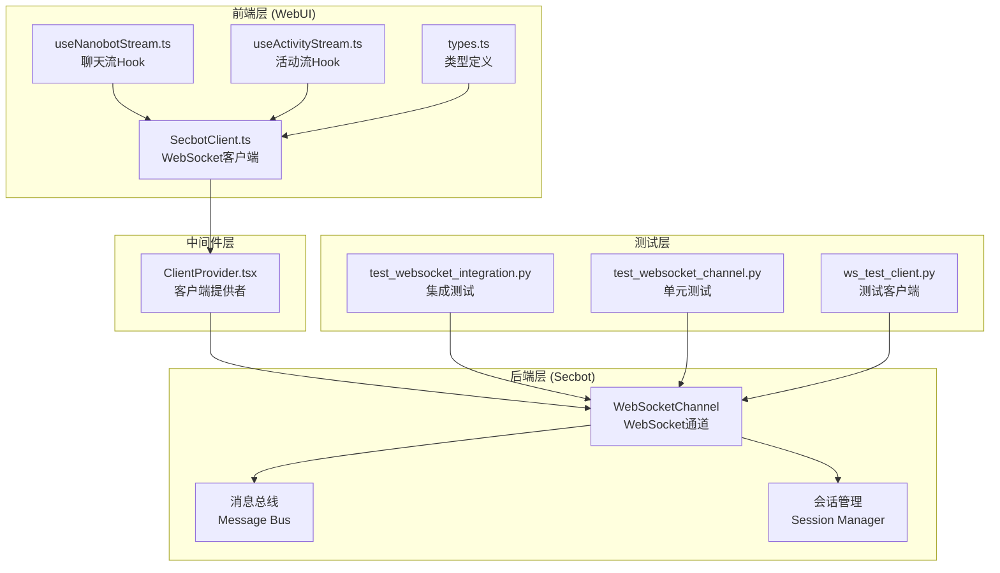
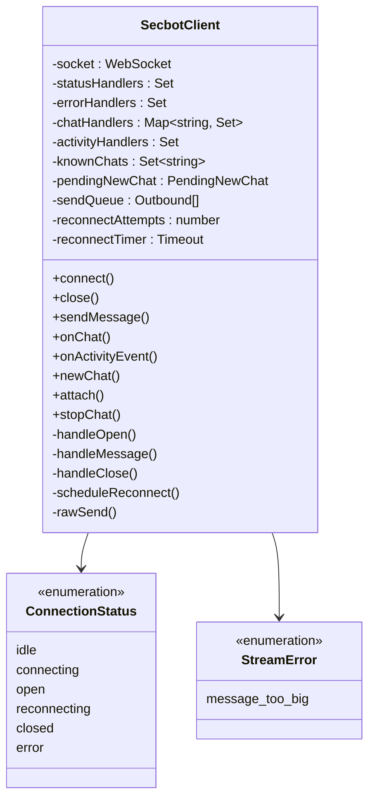
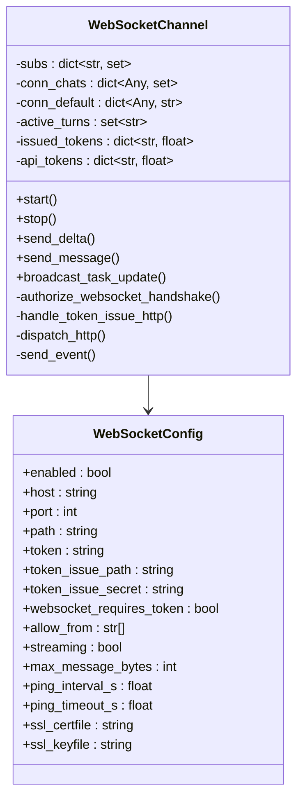
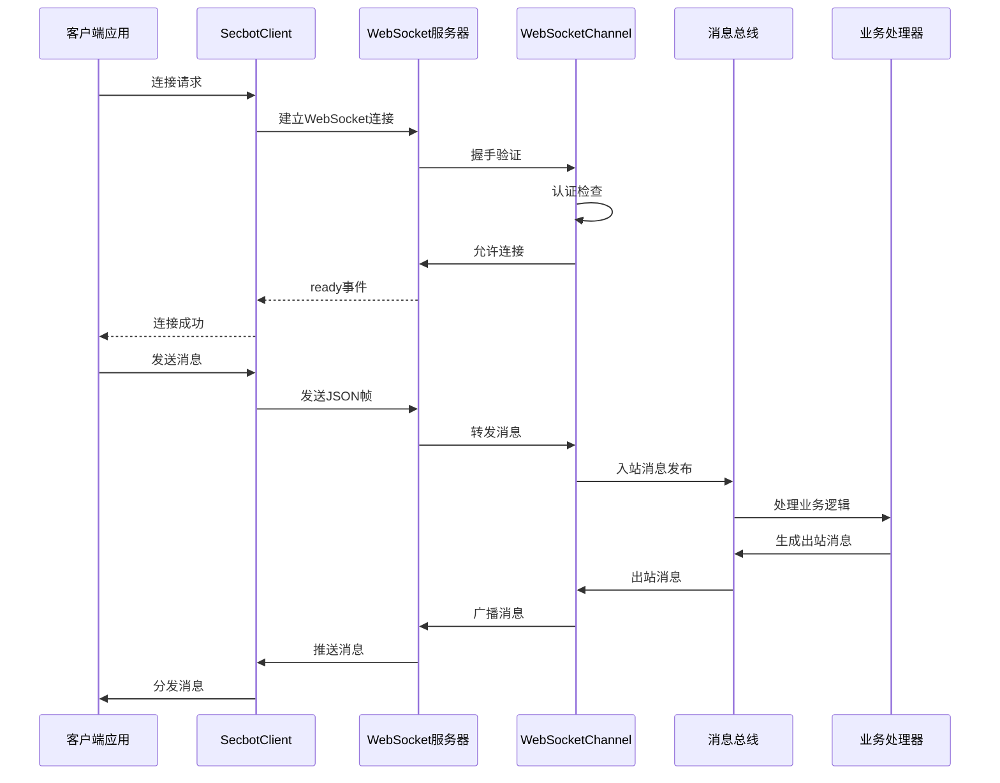
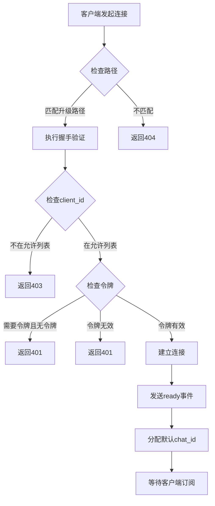
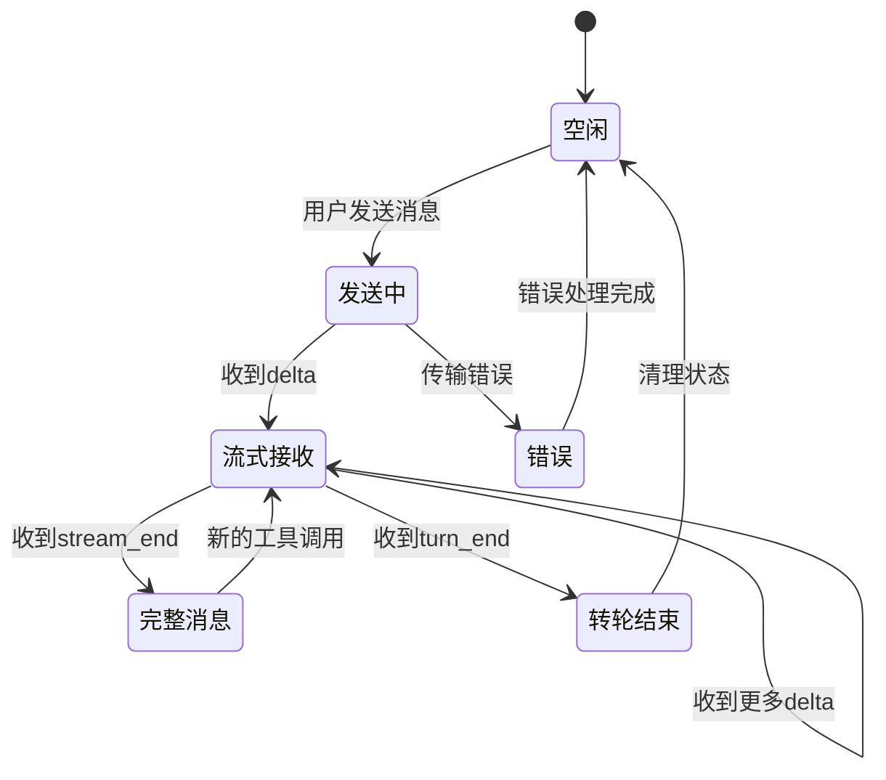
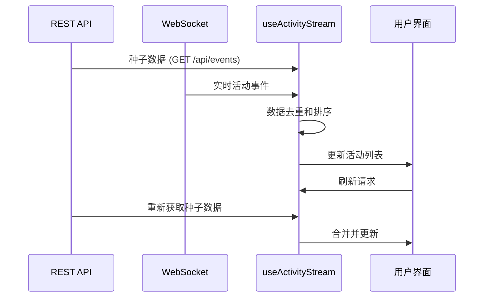
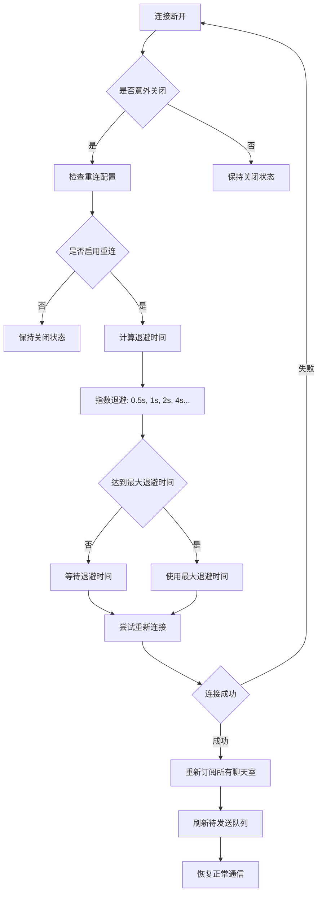
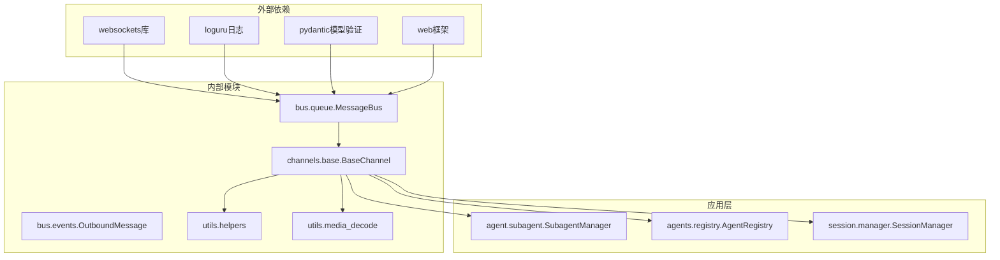

# WebSocket通信实现

<cite>
**本文档引用的文件**
- [websocket.md](file://docs/websocket.md)
- [websocket.py](file://secbot/channels/websocket.py)
- [secbot-client.ts](file://webui/src/lib/secbot-client.ts)
- [useNanobotStream.ts](file://webui/src/hooks/useNanobotStream.ts)
- [useActivityStream.ts](file://webui/src/hooks/useActivityStream.ts)
- [types.ts](file://webui/src/lib/types.ts)
- [ClientProvider.tsx](file://webui/src/providers/ClientProvider.tsx)
- [test_websocket_integration.py](file://tests/channels/test_websocket_integration.py)
- [test_websocket_channel.py](file://tests/channels/test_websocket_channel.py)
- [ws_test_client.py](file://tests/channels/ws_test_client.py)
</cite>

## 目录
1. [简介](#简介)
2. [项目结构](#项目结构)
3. [核心组件](#核心组件)
4. [架构概览](#架构概览)
5. [详细组件分析](#详细组件分析)
6. [依赖关系分析](#依赖关系分析)
7. [性能考虑](#性能考虑)
8. [故障排除指南](#故障排除指南)
9. [结论](#结论)

## 简介

VAPT3的WebSocket通信实现是一个完整的实时通信系统，基于Python的websockets库构建后端服务，使用TypeScript实现前端客户端。该系统支持多聊天室复用、实时流式传输、认证授权、断线重连等高级功能。

系统的核心价值在于为安全运营平台提供了低延迟的实时通信能力，支持资产发现、端口扫描、漏洞扫描等安全任务的实时状态更新和结果展示。

## 项目结构

WebSocket通信实现分布在三个主要层次：

**图表来源**
- [websocket.py:474-548](file://secbot/channels/websocket.py#L474-L548)
- [secbot-client.ts:59-93](file://webui/src/lib/secbot-client.ts#L59-L93)
- [useNanobotStream.ts:38-53](file://webui/src/hooks/useNanobotStream.ts#L38-L53)

**章节来源**
- [websocket.md:1-397](file://docs/websocket.md#L1-L397)
- [websocket.py:474-548](file://secbot/channels/websocket.py#L474-L548)

## 核心组件

### SecbotClient - 前端WebSocket客户端

SecbotClient是整个WebSocket通信系统的核心客户端，实现了以下关键功能：

- **连接管理**: 支持自动重连、连接状态跟踪、URL动态更新
- **多聊天室支持**: 单个WebSocket连接可承载多个chat_id
- **消息路由**: 基于chat_id的智能消息分发
- **错误处理**: 结构化的传输层错误报告
- **媒体支持**: 图片、视频等多媒体文件的处理

**图表来源**
- [secbot-client.ts:59-377](file://webui/src/lib/secbot-client.ts#L59-L377)

**章节来源**
- [secbot-client.ts:59-377](file://webui/src/lib/secbot-client.ts#L59-L377)

### WebSocketChannel - 后端WebSocket通道

后端WebSocketChannel实现了完整的WebSocket服务器功能：

- **协议处理**: 解析和验证入站消息
- **认证系统**: 支持静态令牌和颁发令牌
- **消息路由**: 将消息分发到相应的聊天室订阅者
- **会话管理**: 维护聊天室状态和用户会话
- **广播机制**: 支持全局活动事件广播

**图表来源**
- [websocket.py:474-606](file://secbot/channels/websocket.py#L474-L606)
- [websocket.py:119-195](file://secbot/channels/websocket.py#L119-L195)

**章节来源**
- [websocket.py:474-606](file://secbot/channels/websocket.py#L474-L606)
- [websocket.py:119-195](file://secbot/channels/websocket.py#L119-L195)

### Hook系统 - React集成

前端提供了两个关键的React Hooks来简化WebSocket集成：

- **useNanobotStream**: 处理单个聊天室的流式消息
- **useActivityStream**: 管理全局活动事件流

**章节来源**
- [useNanobotStream.ts:38-319](file://webui/src/hooks/useNanobotStream.ts#L38-L319)
- [useActivityStream.ts:139-198](file://webui/src/hooks/useActivityStream.ts#L139-L198)

## 架构概览

WebSocket通信系统的整体架构采用分层设计，确保了良好的可维护性和扩展性：

**图表来源**
- [websocket.py:775-795](file://secbot/channels/websocket.py#L775-L795)
- [secbot-client.ts:155-181](file://webui/src/lib/secbot-client.ts#L155-L181)

**章节来源**
- [websocket.md:80-166](file://docs/websocket.md#L80-L166)

## 详细组件分析

### 连接建立与认证流程

WebSocket连接建立涉及复杂的认证和授权流程：

**图表来源**
- [websocket.py:775-795](file://secbot/channels/websocket.py#L775-L795)
- [websocket.py:780-786](file://secbot/channels/websocket.py#L780-L786)

**章节来源**
- [websocket.py:775-795](file://secbot/channels/websocket.py#L775-L795)
- [websocket.md:69-80](file://docs/websocket.md#L69-L80)

### 消息序列化与协议

WebSocket通信协议定义了标准的消息格式和事件类型：

#### 服务器到客户端事件

| 事件类型 | 描述 | 必需字段 | 可选字段 |
|---------|------|---------|---------|
| ready | 连接建立确认 | event, chat_id, client_id | - |
| message | 完整消息响应 | event, chat_id, text | media, reply_to, buttons |
| delta | 流式文本片段 | event, chat_id, text | stream_id |
| stream_end | 流结束信号 | event, chat_id | stream_id |
| attached | 订阅确认 | event, chat_id | active_turn |
| error | 错误通知 | event | detail, chat_id |

#### 客户端到服务器事件

| 事件类型 | 描述 | 必需字段 | 可选字段 |
|---------|------|---------|---------|
| new_chat | 创建新聊天室 | type | - |
| attach | 订阅现有聊天室 | type, chat_id | - |
| message | 发送消息 | type, chat_id, content | media, webui |
| stop | 停止当前操作 | type, chat_id | - |

**章节来源**
- [websocket.md:84-166](file://docs/websocket.md#L84-L166)
- [types.ts:141-208](file://webui/src/lib/types.ts#L141-L208)

### 实时通信Hook实现

#### useNanobotStream - 聊天流处理

useNanobotStream Hook实现了复杂的流式消息处理逻辑：

**图表来源**
- [useNanobotStream.ts:119-280](file://webui/src/hooks/useNanobotStream.ts#L119-L280)

#### useActivityStream - 活动流管理

useActivityStream Hook负责全局活动事件的聚合和展示：

**图表来源**
- [useActivityStream.ts:139-198](file://webui/src/hooks/useActivityStream.ts#L139-L198)

**章节来源**
- [useNanobotStream.ts:38-319](file://webui/src/hooks/useNanobotStream.ts#L38-L319)
- [useActivityStream.ts:139-198](file://webui/src/hooks/useActivityStream.ts#L139-L198)

### 断线重连策略

SecbotClient实现了智能的断线重连机制：

**图表来源**
- [secbot-client.ts:340-357](file://webui/src/lib/secbot-client.ts#L340-L357)

**章节来源**
- [secbot-client.ts:340-357](file://webui/src/lib/secbot-client.ts#L340-L357)

## 依赖关系分析

WebSocket通信系统的依赖关系体现了清晰的分层架构：

**图表来源**
- [websocket.py:33-48](file://secbot/channels/websocket.py#L33-L48)

**章节来源**
- [websocket.py:33-48](file://secbot/channels/websocket.py#L33-L48)

## 性能考虑

### 消息大小限制

系统实现了严格的消息大小控制以防止资源耗尽：

- **默认限制**: 36 MB (支持最多4张8MB的图片)
- **可配置范围**: 1 KB - 40 MB
- **超限处理**: 自动断开连接并返回1009错误代码

### 连接池管理

- **最大并发连接**: 无硬性限制，但受系统资源约束
- **内存使用**: 每个连接约占用1-2KB内存
- **CPU开销**: 流式传输比完整消息传输更高效

### 网络优化

- **心跳机制**: 默认20秒ping间隔，20秒超时
- **压缩支持**: 可配置的消息压缩
- **批量处理**: 支持多聊天室消息合并

## 故障排除指南

### 常见连接问题

| 问题症状 | 可能原因 | 解决方案 |
|---------|---------|---------|
| 连接被拒绝403 | client_id不在允许列表 | 检查allowFrom配置 |
| 认证失败401 | 令牌无效或过期 | 验证令牌或重新颁发 |
| 连接超时 | 网络延迟过高 | 检查防火墙设置 |
| 消息过大1009 | 超过max_message_bytes限制 | 减少附件大小或调整配置 |

### 调试技巧

1. **启用详细日志**: 在WebSocketChannel中增加日志级别
2. **监控连接状态**: 使用SecbotClient的onStatus回调
3. **测试消息格式**: 使用ws_test_client.py进行协议测试
4. **检查令牌有效期**: 验证issued tokens的时间戳

**章节来源**
- [test_websocket_integration.py:356-393](file://tests/channels/test_websocket_integration.py#L356-L393)
- [test_websocket_channel.py:858-899](file://tests/channels/test_websocket_channel.py#L858-L899)

## 结论

VAPT3的WebSocket通信实现展现了现代实时通信系统的最佳实践。通过前后端分离的架构设计、完善的错误处理机制、智能的重连策略，以及丰富的Hook系统，该实现为安全运营平台提供了稳定可靠的实时通信基础。

系统的关键优势包括：
- **高可用性**: 自动重连和优雅降级
- **安全性**: 多层认证和访问控制
- **可扩展性**: 模块化设计支持功能扩展
- **易用性**: 简洁的API和完善的文档

未来可以考虑的改进方向：
- 添加消息加密支持
- 实现更精细的流量控制
- 增加连接池管理和负载均衡
- 扩展移动端适配