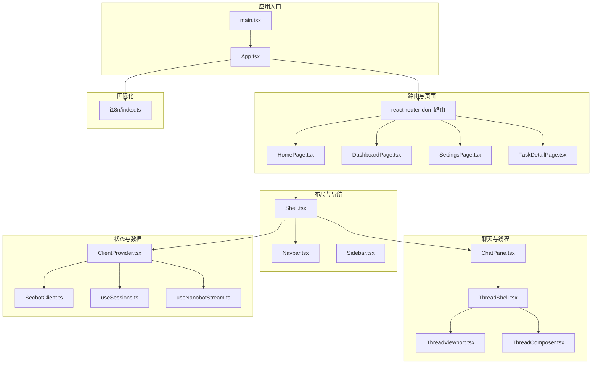
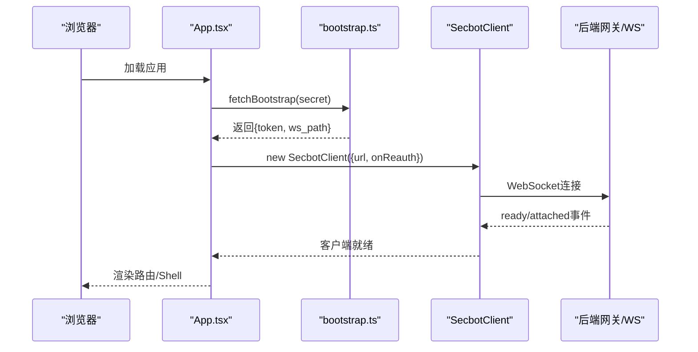
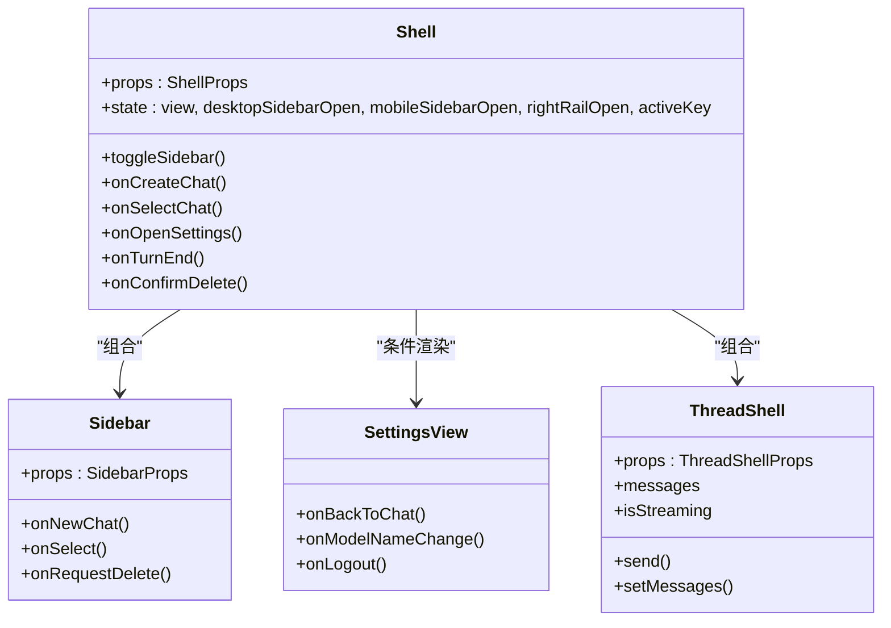
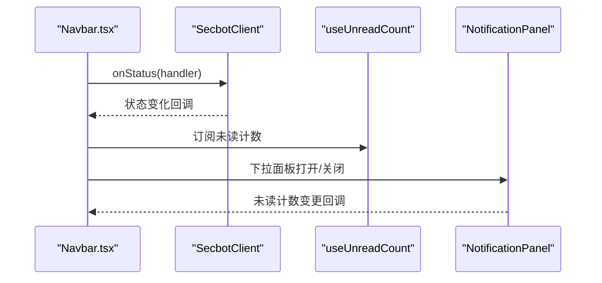
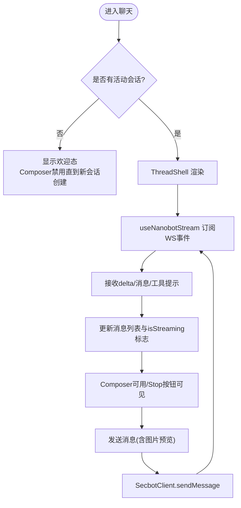
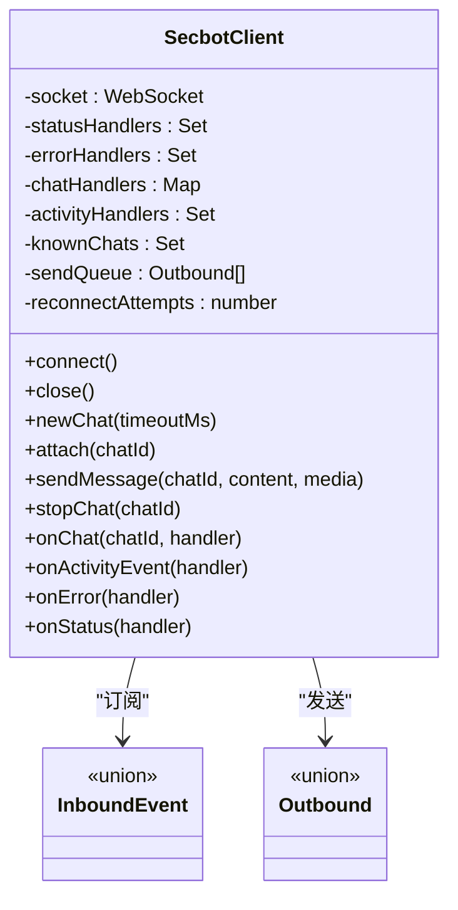
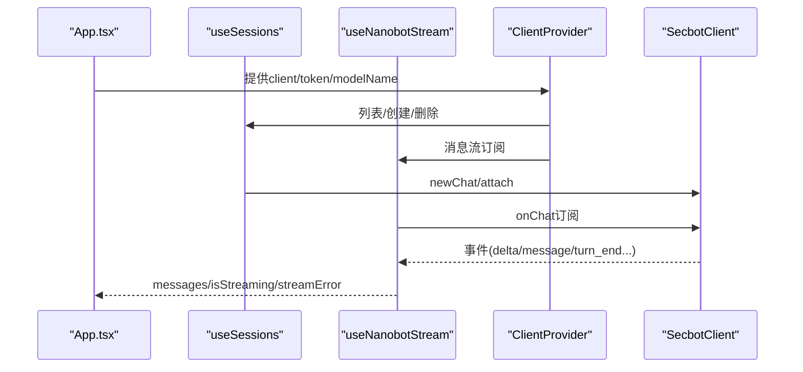
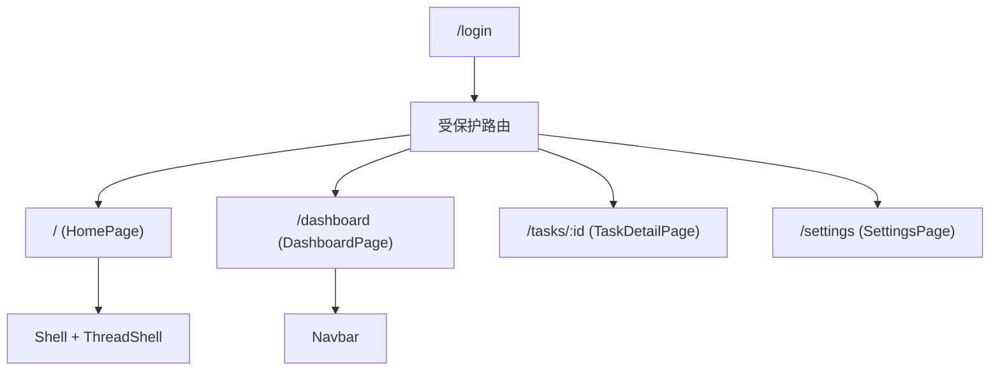
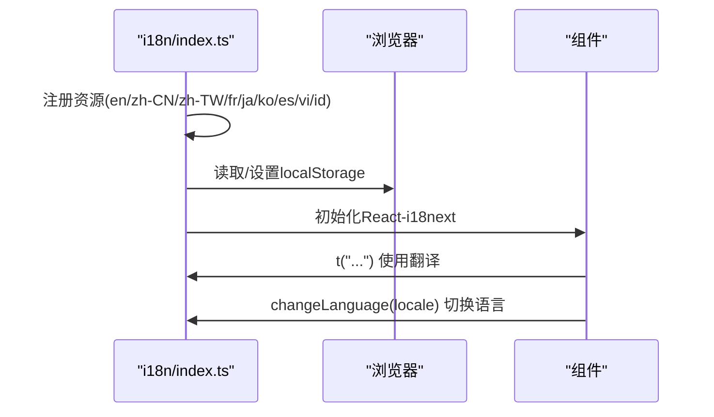
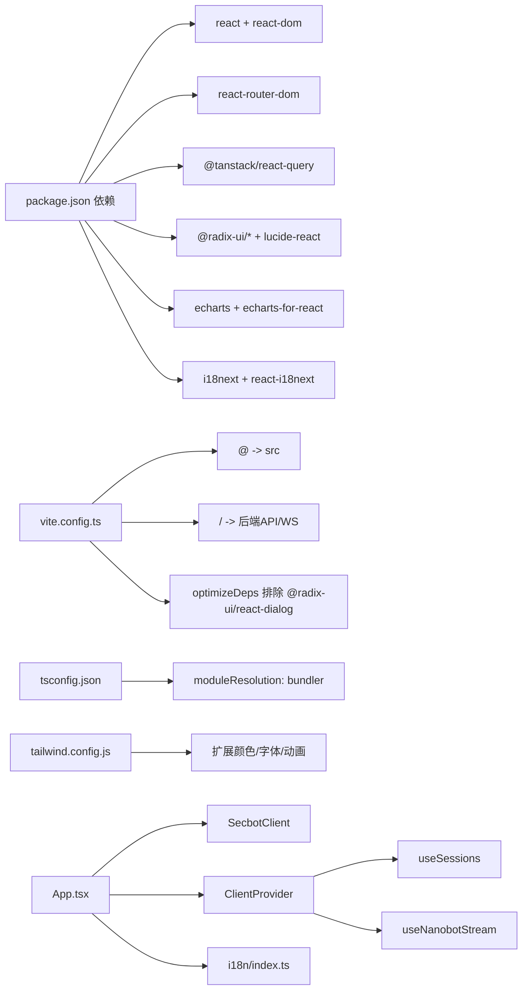

# WebUI前端系统

<cite>
**本文档引用的文件**
- [package.json](file://webui/package.json)
- [vite.config.ts](file://webui/vite.config.ts)
- [tsconfig.json](file://webui/tsconfig.json)
- [tailwind.config.js](file://webui/tailwind.config.js)
- [App.tsx](file://webui/src/App.tsx)
- [main.tsx](file://webui/src/main.tsx)
- [Shell.tsx](file://webui/src/components/Shell.tsx)
- [Navbar.tsx](file://webui/src/components/Navbar.tsx)
- [ChatPane.tsx](file://webui/src/components/ChatPane.tsx)
- [ThreadShell.tsx](file://webui/src/components/thread/ThreadShell.tsx)
- [secbot-client.ts](file://webui/src/lib/secbot-client.ts)
- [bootstrap.ts](file://webui/src/lib/bootstrap.ts)
- [types.ts](file://webui/src/lib/types.ts)
- [i18n/index.ts](file://webui/src/i18n/index.ts)
- [useSessions.ts](file://webui/src/hooks/useSessions.ts)
- [useNanobotStream.ts](file://webui/src/hooks/useNanobotStream.ts)
- [ClientProvider.tsx](file://webui/src/providers/ClientProvider.tsx)
- [DashboardPage.tsx](file://webui/src/pages/DashboardPage.tsx)
</cite>

## 目录
1. [简介](#简介)
2. [项目结构](#项目结构)
3. [核心组件](#核心组件)
4. [架构总览](#架构总览)
5. [详细组件分析](#详细组件分析)
6. [依赖关系分析](#依赖关系分析)
7. [性能考虑](#性能考虑)
8. [故障排除指南](#故障排除指南)
9. [结论](#结论)
10. [附录](#附录)

## 简介
本文件为VAPT3/secbot的WebUI前端系统技术文档，面向React + TypeScript + TailwindCSS技术栈，围绕Shell、Navbar、ChatPane、ThreadShell等核心组件，系统阐述状态管理、路由与导航、WebSocket通信、国际化（i18n）、性能优化与开发调试等主题。文档旨在帮助开发者快速理解系统架构、掌握组件开发规范，并高效进行二次开发与维护。

## 项目结构
WebUI位于webui目录，采用基于功能域的组织方式：components（UI组件与页面级容器）、hooks（自定义Hook）、lib（客户端、类型与工具）、pages（路由页面）、providers（上下文提供者）、workers（Web Worker）等。构建工具采用Vite，样式通过TailwindCSS配置，国际化使用i18next。

**图表来源**
- [main.tsx:1-16](file://webui/src/main.tsx#L1-L16)
- [App.tsx:1-233](file://webui/src/App.tsx#L1-L233)
- [Shell.tsx:1-374](file://webui/src/components/Shell.tsx#L1-L374)
- [Navbar.tsx:1-177](file://webui/src/components/Navbar.tsx#L1-L177)
- [ChatPane.tsx:1-116](file://webui/src/components/ChatPane.tsx#L1-L116)
- [ThreadShell.tsx:1-267](file://webui/src/components/thread/ThreadShell.tsx#L1-L267)
- [ClientProvider.tsx:1-58](file://webui/src/providers/ClientProvider.tsx#L1-L58)
- [secbot-client.ts:1-377](file://webui/src/lib/secbot-client.ts#L1-L377)
- [useSessions.ts:1-314](file://webui/src/hooks/useSessions.ts#L1-L314)
- [useNanobotStream.ts:1-319](file://webui/src/hooks/useNanobotStream.ts#L1-L319)
- [i18n/index.ts:1-73](file://webui/src/i18n/index.ts#L1-L73)

**章节来源**
- [package.json:1-67](file://webui/package.json#L1-L67)
- [vite.config.ts:1-66](file://webui/vite.config.ts#L1-L66)
- [tsconfig.json:1-33](file://webui/tsconfig.json#L1-L33)
- [tailwind.config.js:1-166](file://webui/tailwind.config.js#L1-L166)

## 核心组件
- Shell：应用主布局容器，负责侧边栏、右侧工作台、聊天视图切换、设置视图、会话管理等。
- Navbar：全局导航条，包含路由链接、连接状态指示、通知面板触发器等。
- ChatPane：聊天表面，结合历史消息与实时流，提供欢迎态与Composer。
- ThreadShell：线程视图容器，承载消息展示、Composer、快捷动作、错误提示等。
- SecbotClient：WebSocket客户端，统一管理连接、重连、订阅、事件分发与错误上报。
- ClientProvider：上下文提供者，集中注入客户端实例、令牌、模型名与未读计数。
- useSessions/useNanobotStream：会话列表与消息流的Hook，封装REST与WS交互细节。
- i18n：国际化初始化与语言切换，支持多语言资源与本地化存储。

**章节来源**
- [Shell.tsx:1-374](file://webui/src/components/Shell.tsx#L1-L374)
- [Navbar.tsx:1-177](file://webui/src/components/Navbar.tsx#L1-L177)
- [ChatPane.tsx:1-116](file://webui/src/components/ChatPane.tsx#L1-L116)
- [ThreadShell.tsx:1-267](file://webui/src/components/thread/ThreadShell.tsx#L1-L267)
- [secbot-client.ts:1-377](file://webui/src/lib/secbot-client.ts#L1-L377)
- [ClientProvider.tsx:1-58](file://webui/src/providers/ClientProvider.tsx#L1-L58)
- [useSessions.ts:1-314](file://webui/src/hooks/useSessions.ts#L1-L314)
- [useNanobotStream.ts:1-319](file://webui/src/hooks/useNanobotStream.ts#L1-L319)
- [i18n/index.ts:1-73](file://webui/src/i18n/index.ts#L1-L73)

## 架构总览
WebUI采用“路由模式”与“模板模式”双路径并行：默认启用模板模式（BrowserRouter + 路由守卫），在App层完成引导、认证与客户端初始化；同时保留旧版模板开关以便回退。状态通过Context与Hook解耦，WebSocket通过SecbotClient统一管理，国际化通过i18n模块集中处理。

**图表来源**
- [App.tsx:54-107](file://webui/src/App.tsx#L54-L107)
- [bootstrap.ts:37-76](file://webui/src/lib/bootstrap.ts#L37-L76)
- [secbot-client.ts:155-165](file://webui/src/lib/secbot-client.ts#L155-L165)

**章节来源**
- [App.tsx:146-232](file://webui/src/App.tsx#L146-L232)
- [vite.config.ts:5-64](file://webui/vite.config.ts#L5-L64)

## 详细组件分析

### Shell组件分析
Shell是应用主布局，负责：
- 侧边栏与移动端抽屉的开合与持久化
- 右侧工作台的可选渲染与折叠
- 视图在“聊天”和“设置”之间的切换
- 会话列表的加载、创建、删除与标题生成
- 文档标题与活动会话的联动

**图表来源**
- [Shell.tsx:70-371](file://webui/src/components/Shell.tsx#L70-L371)

**章节来源**
- [Shell.tsx:1-374](file://webui/src/components/Shell.tsx#L1-L374)

### Navbar组件分析
Navbar提供全局导航与连接状态指示，包含：
- 导航项（首页、仪表盘、任务、设置）
- WebSocket连接状态徽章
- 通知下拉面板与未读计数

**图表来源**
- [Navbar.tsx:39-176](file://webui/src/components/Navbar.tsx#L39-L176)
- [ClientProvider.tsx:35-57](file://webui/src/providers/ClientProvider.tsx#L35-L57)

**章节来源**
- [Navbar.tsx:1-177](file://webui/src/components/Navbar.tsx#L1-L177)
- [ClientProvider.tsx:1-58](file://webui/src/providers/ClientProvider.tsx#L1-L58)

### ChatPane与ThreadShell组件分析
ChatPane负责欢迎态与聊天态的消息展示与Composer；ThreadShell负责线程视图的消息流、快捷动作、用户确认提示与Composer变体。

**图表来源**
- [ChatPane.tsx:23-115](file://webui/src/components/ChatPane.tsx#L23-L115)
- [ThreadShell.tsx:54-266](file://webui/src/components/thread/ThreadShell.tsx#L54-L266)
- [useNanobotStream.ts:38-318](file://webui/src/hooks/useNanobotStream.ts#L38-L318)
- [secbot-client.ts:205-224](file://webui/src/lib/secbot-client.ts#L205-L224)

**章节来源**
- [ChatPane.tsx:1-116](file://webui/src/components/ChatPane.tsx#L1-L116)
- [ThreadShell.tsx:1-267](file://webui/src/components/thread/ThreadShell.tsx#L1-L267)
- [useNanobotStream.ts:1-319](file://webui/src/hooks/useNanobotStream.ts#L1-L319)

### SecbotClient与WebSocket通信
SecbotClient以单例形式管理WebSocket连接，提供：
- 连接生命周期管理（connect/close）
- 自动重连与指数退避
- 事件订阅（onChat/onActivityEvent）与错误上报（onError）
- 新建会话（newChat）、附加会话（attach）、发送消息（sendMessage）、停止会话（stopChat）

**图表来源**
- [secbot-client.ts:59-376](file://webui/src/lib/secbot-client.ts#L59-L376)
- [types.ts:141-208](file://webui/src/lib/types.ts#L141-L208)

**章节来源**
- [secbot-client.ts:1-377](file://webui/src/lib/secbot-client.ts#L1-L377)
- [types.ts:1-306](file://webui/src/lib/types.ts#L1-L306)

### 状态管理机制
- 会话状态：useSessions管理会话列表、创建/删除、历史消息懒加载与乐观插入。
- 活动流状态：useNanobotStream管理消息流、isStreaming标志、错误与转场事件。
- 通知状态：ClientProvider聚合未读计数，Navbar消费未读状态。
- 应用级状态：App.tsx管理引导状态（loading/auth/ready）、模型名变更与登出流程。

**图表来源**
- [App.tsx:54-107](file://webui/src/App.tsx#L54-L107)
- [useSessions.ts:124-203](file://webui/src/hooks/useSessions.ts#L124-L203)
- [useNanobotStream.ts:38-114](file://webui/src/hooks/useNanobotStream.ts#L38-L114)
- [ClientProvider.tsx:24-57](file://webui/src/providers/ClientProvider.tsx#L24-L57)

**章节来源**
- [useSessions.ts:1-314](file://webui/src/hooks/useSessions.ts#L1-L314)
- [useNanobotStream.ts:1-319](file://webui/src/hooks/useNanobotStream.ts#L1-L319)
- [ClientProvider.tsx:1-58](file://webui/src/providers/ClientProvider.tsx#L1-L58)
- [App.tsx:1-233](file://webui/src/App.tsx#L1-L233)

### 路由配置与页面导航
- 路由模式：BrowserRouter + ProtectedRoute，登录页与受保护页面分离。
- 页面组件：HomePage、DashboardPage、SettingsPage、TaskDetailPage。
- 导航：Navbar提供全局导航链接，Shell内部设置视图切换（兼容旧模板）。

**图表来源**
- [App.tsx:179-231](file://webui/src/App.tsx#L179-L231)
- [Navbar.tsx:23-28](file://webui/src/components/Navbar.tsx#L23-L28)

**章节来源**
- [App.tsx:174-232](file://webui/src/App.tsx#L174-L232)
- [Navbar.tsx:1-177](file://webui/src/components/Navbar.tsx#L1-L177)

### 国际化（i18n）系统
- 初始化：i18n/index.ts集中注册多语言资源、默认语言与回退语言。
- 语言切换：支持运行时切换语言并持久化到localStorage。
- 文档语言：同步HTML lang属性与dir，确保无障碍与SEO友好。

**图表来源**
- [i18n/index.ts:45-72](file://webui/src/i18n/index.ts#L45-L72)

**章节来源**
- [i18n/index.ts:1-73](file://webui/src/i18n/index.ts#L1-L73)

### 组件开发指南
- UI组件使用：优先复用Radix UI组件（Dialog、DropdownMenu、ScrollArea等）与自定义UI组件库，保持一致的视觉与交互体验。
- 样式定制：基于TailwindCSS变量与插件（tailwindcss-animate、@tailwindcss/typography），通过cn组合工具类实现条件样式。
- 响应式设计：利用容器、断点与动画类，确保桌面端与移动端一致体验。
- 图片与媒体：使用UIMediaAttachment与toMediaAttachment处理本地预览与服务端签名URL。
- 错误处理：通过SecbotClient.onError与StreamErrorNotice展示传输层错误，避免静默失败。

**章节来源**
- [package.json:14-44](file://webui/package.json#L14-L44)
- [tailwind.config.js:1-166](file://webui/tailwind.config.js#L1-L166)
- [types.ts:27-49](file://webui/src/lib/types.ts#L27-L49)

### 性能优化策略
- 代码分割与懒加载：Vite按需打包，路由页面与组件按需加载。
- 依赖优化：Vite optimizeDeps排除特定包以稳定开发时的chunk路径。
- 构建输出：构建产物输出至后端静态目录，便于部署。
- 图表渲染：ECharts使用SVG渲染器提升矢量清晰度与可访问性。
- Hook优化：useMemo/useCallback减少重渲染，useRef持有稳定引用。

**章节来源**
- [vite.config.ts:17-28](file://webui/vite.config.ts#L17-L28)
- [DashboardPage.tsx:67-133](file://webui/src/pages/DashboardPage.tsx#L67-L133)

### 开发环境搭建与调试技巧
- 启动命令：dev/build/preview/test/lint脚本已配置。
- 代理与WebSocket：Vite代理将/webui、/api、/auth转发至后端，根路径WebSocket升级独立处理，避免HMR与WS冲突。
- 环境变量：NANOBOT_API_URL控制后端地址，默认127.0.0.1:8765。
- 调试建议：使用React DevTools检查Context与Hook状态；在SecbotClient中监听onStatus与onError定位连接问题；在useNanobotStream中观察isStreaming与streamError判断流状态。

**章节来源**
- [package.json:6-12](file://webui/package.json#L6-L12)
- [vite.config.ts:29-57](file://webui/vite.config.ts#L29-L57)

## 依赖关系分析

**图表来源**
- [package.json:14-64](file://webui/package.json#L14-L64)
- [vite.config.ts:1-66](file://webui/vite.config.ts#L1-L66)
- [tsconfig.json:1-33](file://webui/tsconfig.json#L1-L33)
- [tailwind.config.js:1-166](file://webui/tailwind.config.js#L1-L166)
- [App.tsx:1-233](file://webui/src/App.tsx#L1-L233)
- [i18n/index.ts:1-73](file://webui/src/i18n/index.ts#L1-L73)

**章节来源**
- [package.json:1-67](file://webui/package.json#L1-L67)
- [vite.config.ts:1-66](file://webui/vite.config.ts#L1-L66)
- [tsconfig.json:1-33](file://webui/tsconfig.json#L1-L33)
- [tailwind.config.js:1-166](file://webui/tailwind.config.js#L1-L166)

## 性能考虑
- 懒加载与代码分割：路由与页面组件按需加载，减少首屏体积。
- 事件驱动的流处理：useNanobotStream仅在必要时更新消息，避免全量重渲染。
- 本地状态与缓存：ThreadShell对消息进行内存缓存，避免频繁历史请求。
- 图表渲染优化：ECharts配置SVG渲染器，适合大屏场景的清晰度与缩放。
- Tailwind原子化样式：减少CSS复杂度，提升编译与运行效率。

[本节为通用指导，无需具体文件分析]

## 故障排除指南
- WebSocket连接失败：检查NANOBOT_API_URL与代理配置；查看Navbar连接状态徽章；在SecbotClient.onError中捕获结构化错误（如消息过大）。
- 401/403认证错误：App.tsx会自动切换到登录态；确认共享密钥保存与刷新逻辑。
- 会话无法创建/删除：useSessions中的乐观插入与服务端返回一致性；关注ApiError与404（新会话尚未持久化）。
- 流中断或按钮不显示：确保useNanobotStream正确订阅onChat事件；检查attached事件中的active_turn标志。
- 国际化异常：确认i18n初始化与localStorage持久化；检查资源文件完整性。

**章节来源**
- [App.tsx:84-97](file://webui/src/App.tsx#L84-L97)
- [secbot-client.ts:314-324](file://webui/src/lib/secbot-client.ts#L314-L324)
- [useSessions.ts:143-200](file://webui/src/hooks/useSessions.ts#L143-L200)
- [useNanobotStream.ts:116-131](file://webui/src/hooks/useNanobotStream.ts#L116-L131)
- [i18n/index.ts:45-72](file://webui/src/i18n/index.ts#L45-L72)

## 结论
WebUI前端系统以React + TypeScript + TailwindCSS为基础，结合自研SecbotClient与完善的Hook体系，实现了高性能、可维护的聊天与仪表盘界面。通过路由模式、国际化与状态管理的协同，系统在复杂交互与实时通信场景下仍保持良好的用户体验与可扩展性。

## 附录
- 项目根README与文档位于仓库根目录，可进一步了解部署与CLI参考。
- WebSocket协议与事件定义详见types.ts中的InboundEvent/Outbound类型。

[本节为概览性内容，无需具体文件分析]