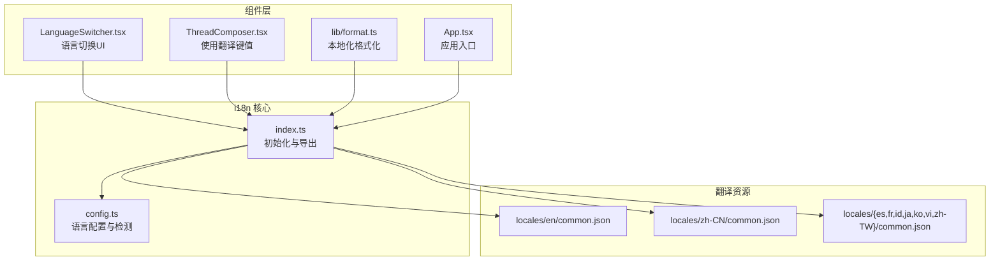
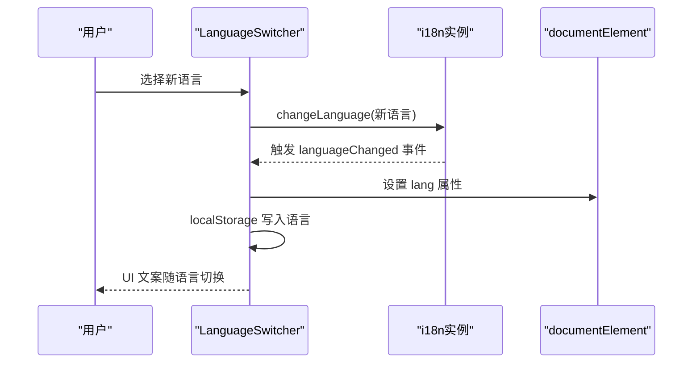
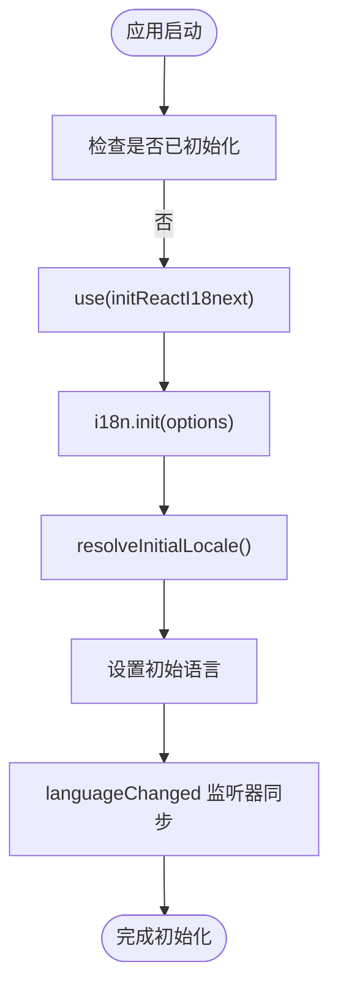
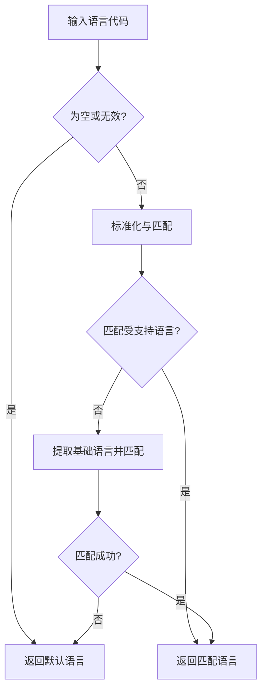
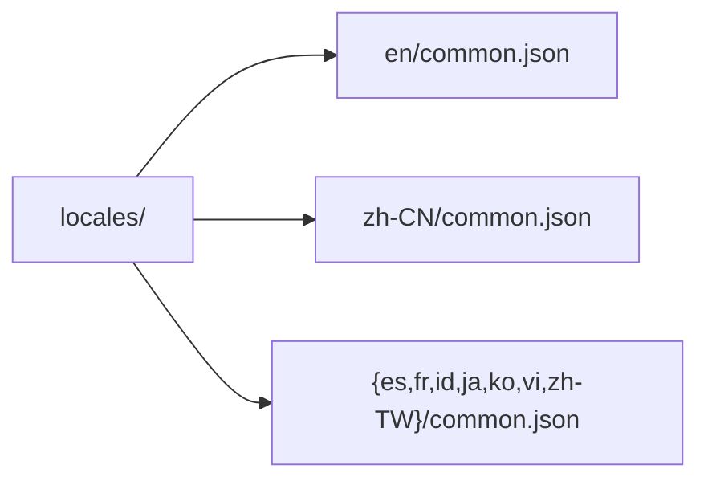
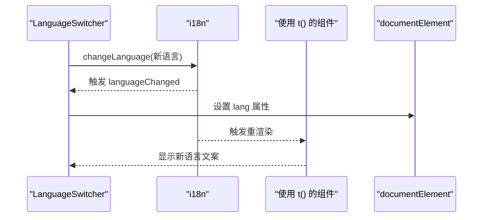
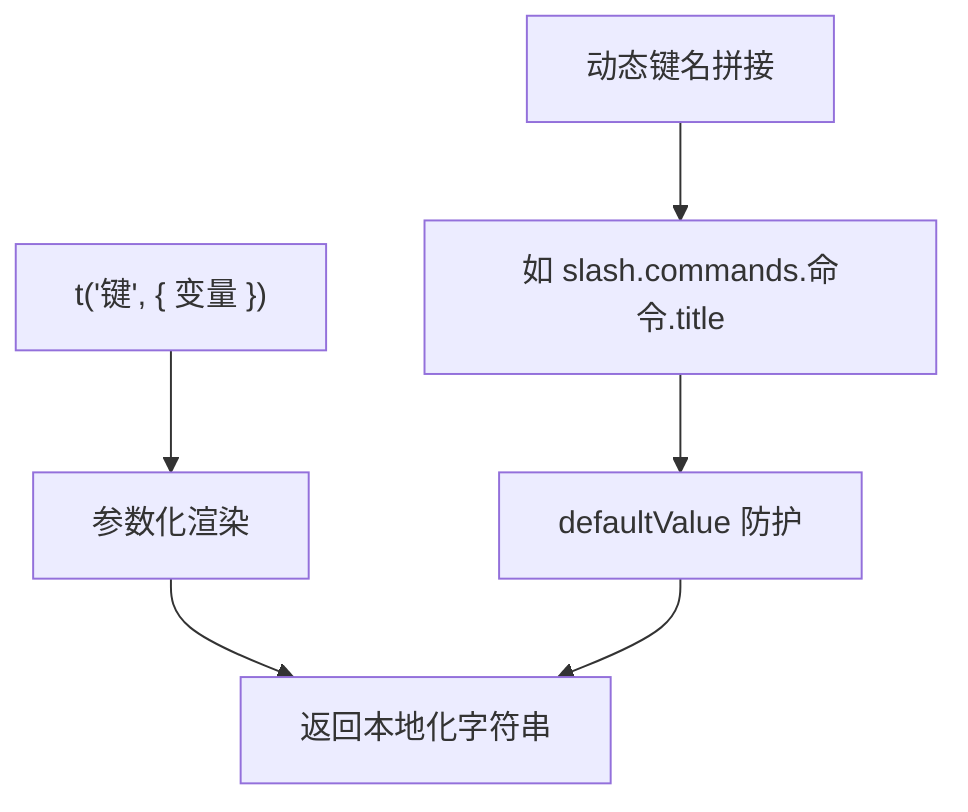
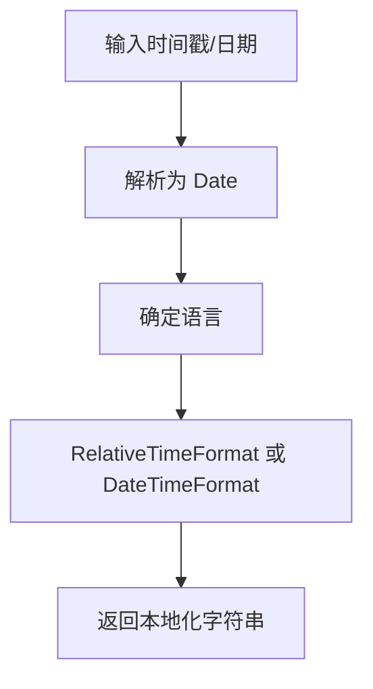
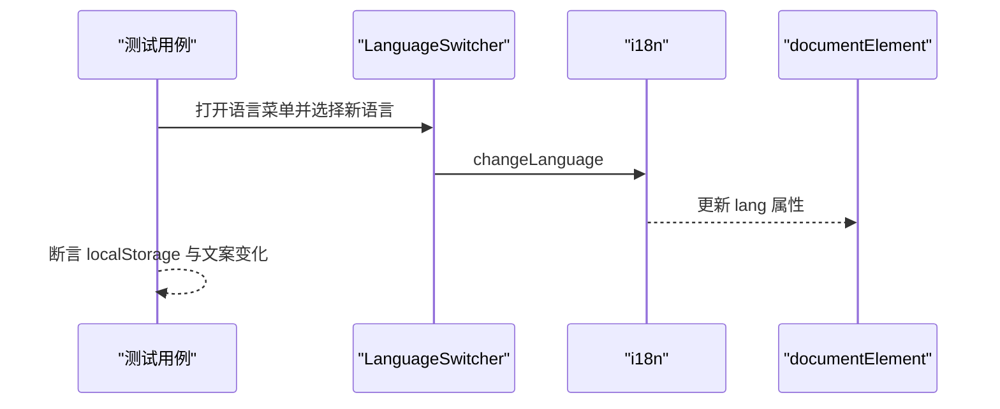
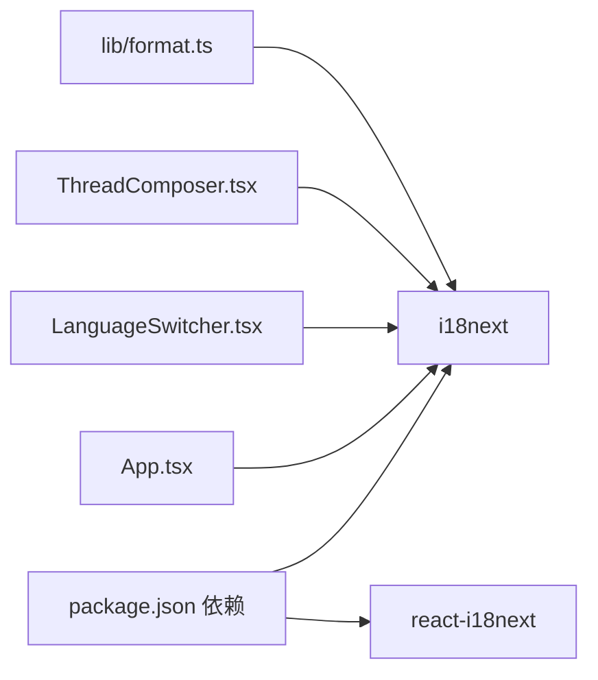

# 国际化(i18n)系统

<cite>
**本文档引用的文件**
- [webui/src/i18n/index.ts](file://webui/src/i18n/index.ts)
- [webui/src/i18n/config.ts](file://webui/src/i18n/config.ts)
- [webui/src/i18n/locales/en/common.json](file://webui/src/i18n/locales/en/common.json)
- [webui/src/i18n/locales/zh-CN/common.json](file://webui/src/i18n/locales/zh-CN/common.json)
- [webui/src/components/LanguageSwitcher.tsx](file://webui/src/components/LanguageSwitcher.tsx)
- [webui/src/components/thread/ThreadComposer.tsx](file://webui/src/components/thread/ThreadComposer.tsx)
- [webui/src/lib/format.ts](file://webui/src/lib/format.ts)
- [webui/src/App.tsx](file://webui/src/App.tsx)
- [webui/src/tests/i18n.test.tsx](file://webui/src/tests/i18n.test.tsx)
- [webui/src/tests/format.i18n.test.ts](file://webui/src/tests/format.i18n.test.ts)
- [webui/package.json](file://webui/package.json)
</cite>

## 目录
1. [简介](#简介)
2. [项目结构](#项目结构)
3. [核心组件](#核心组件)
4. [架构总览](#架构总览)
5. [详细组件分析](#详细组件分析)
6. [依赖关系分析](#依赖关系分析)
7. [性能考虑](#性能考虑)
8. [故障排除指南](#故障排除指南)
9. [结论](#结论)
10. [附录](#附录)

## 简介
本文件面向VAPT3的国际化(i18n)系统，基于react-i18next实现，覆盖语言包加载、翻译资源管理、动态语言切换、多语言文件组织、配置初始化、语言检测与持久化、翻译函数使用与最佳实践、本地化格式化工具、测试与质量保障等方面。目标是帮助开发者快速理解并维护多语言能力，确保新增语言与翻译键值的一致性与正确性。

## 项目结构
VAPT3的i18n系统位于Web前端工程webui中，采用按语言分目录的资源组织方式，主入口负责初始化与语言切换，组件通过react-i18next消费翻译键值，格式化工具基于Intl API结合当前语言环境进行本地化展示。

**图表来源**
- [webui/src/i18n/index.ts:1-73](file://webui/src/i18n/index.ts#L1-L73)
- [webui/src/i18n/config.ts:1-94](file://webui/src/i18n/config.ts#L1-L94)
- [webui/src/i18n/locales/en/common.json:1-277](file://webui/src/i18n/locales/en/common.json#L1-L277)
- [webui/src/i18n/locales/zh-CN/common.json:1-265](file://webui/src/i18n/locales/zh-CN/common.json#L1-L265)
- [webui/src/components/LanguageSwitcher.tsx:1-68](file://webui/src/components/LanguageSwitcher.tsx#L1-L68)
- [webui/src/components/thread/ThreadComposer.tsx:1-200](file://webui/src/components/thread/ThreadComposer.tsx#L1-L200)
- [webui/src/lib/format.ts:1-78](file://webui/src/lib/format.ts#L1-L78)
- [webui/src/App.tsx:1-233](file://webui/src/App.tsx#L1-L233)

**章节来源**
- [webui/src/i18n/index.ts:1-73](file://webui/src/i18n/index.ts#L1-L73)
- [webui/src/i18n/config.ts:1-94](file://webui/src/i18n/config.ts#L1-L94)
- [webui/src/i18n/locales/en/common.json:1-277](file://webui/src/i18n/locales/en/common.json#L1-L277)
- [webui/src/i18n/locales/zh-CN/common.json:1-265](file://webui/src/i18n/locales/zh-CN/common.json#L1-L265)
- [webui/src/components/LanguageSwitcher.tsx:1-68](file://webui/src/components/LanguageSwitcher.tsx#L1-L68)
- [webui/src/components/thread/ThreadComposer.tsx:1-200](file://webui/src/components/thread/ThreadComposer.tsx#L1-L200)
- [webui/src/lib/format.ts:1-78](file://webui/src/lib/format.ts#L1-L78)
- [webui/src/App.tsx:1-233](file://webui/src/App.tsx#L1-L233)

## 核心组件
- 初始化与资源注册：在入口文件中一次性导入所有语言资源，配置默认命名空间、回退语言、支持的语言列表等。
- 语言配置与检测：提供语言正则化、存储读取、浏览器语言检测、初始语言解析、DOM语言属性同步与持久化。
- 动态语言切换：通过i18n.changeLanguage触发切换，监听languageChanged事件同步DOM语言属性与本地存储。
- 组件使用：组件通过useTranslation消费翻译键值；语言切换UI通过setAppLanguage更新语言。
- 本地化格式化：基于Intl.RelativeTimeFormat与Intl.DateTimeFormat，按当前语言生成相对时间与日期时间字符串。

**章节来源**
- [webui/src/i18n/index.ts:1-73](file://webui/src/i18n/index.ts#L1-L73)
- [webui/src/i18n/config.ts:1-94](file://webui/src/i18n/config.ts#L1-L94)
- [webui/src/components/LanguageSwitcher.tsx:1-68](file://webui/src/components/LanguageSwitcher.tsx#L1-L68)
- [webui/src/lib/format.ts:1-78](file://webui/src/lib/format.ts#L1-L78)

## 架构总览
i18n系统采用集中式初始化与事件驱动的动态切换机制。初始化阶段构建资源映射与配置，运行期通过事件监听保持UI与文档语言一致，并持久化用户选择。

**图表来源**
- [webui/src/i18n/index.ts:45-69](file://webui/src/i18n/index.ts#L45-L69)
- [webui/src/components/LanguageSwitcher.tsx:47-48](file://webui/src/components/LanguageSwitcher.tsx#L47-L48)

**章节来源**
- [webui/src/i18n/index.ts:45-69](file://webui/src/i18n/index.ts#L45-L69)
- [webui/src/components/LanguageSwitcher.tsx:47-48](file://webui/src/components/LanguageSwitcher.tsx#L47-L48)

## 详细组件分析

### 初始化与资源管理
- 资源加载：在入口文件中显式导入各语言common.json，形成resources映射，供i18n.init使用。
- 初始化选项：设置默认命名空间、命名空间数组、回退语言、支持语言列表、插件链等。
- 事件监听：监听languageChanged事件，同步documentElement.lang与localStorage，确保HTML语言属性与用户偏好一致。

**图表来源**
- [webui/src/i18n/index.ts:45-69](file://webui/src/i18n/index.ts#L45-L69)

**章节来源**
- [webui/src/i18n/index.ts:1-73](file://webui/src/i18n/index.ts#L1-L73)

### 语言配置与检测
- 支持语言列表：定义受支持语言及其标签，提供类型约束。
- 语言正则化：处理空值、空白、zh变体、基础语言代码等，统一到受支持语言集合。
- 存储与检测：优先读取localStorage，其次读取navigator.languages与navigator.language，最终回退到默认语言。
- DOM与持久化：切换语言时设置documentElement.lang并写入localStorage。

**图表来源**
- [webui/src/i18n/config.ts:20-48](file://webui/src/i18n/config.ts#L20-L48)

**章节来源**
- [webui/src/i18n/config.ts:1-94](file://webui/src/i18n/config.ts#L1-L94)

### 多语言文件组织与命名规范
- 目录结构：locales/<语言>/common.json，其中common为默认命名空间。
- 键值设计：采用层级命名，如thread.composer.placeholderStreaming，便于模块化与复用。
- 示例对比：英文与简体中文common.json均包含app、sidebar、thread、message、notifications、activity、errors等键域，确保覆盖UI主要区域。

**图表来源**
- [webui/src/i18n/locales/en/common.json:1-277](file://webui/src/i18n/locales/en/common.json#L1-L277)
- [webui/src/i18n/locales/zh-CN/common.json:1-265](file://webui/src/i18n/locales/zh-CN/common.json#L1-L265)

**章节来源**
- [webui/src/i18n/locales/en/common.json:1-277](file://webui/src/i18n/locales/en/common.json#L1-L277)
- [webui/src/i18n/locales/zh-CN/common.json:1-265](file://webui/src/i18n/locales/zh-CN/common.json#L1-L265)

### 动态语言切换与UI集成
- 切换流程：LanguageSwitcher读取当前语言与支持列表，用户选择后调用setAppLanguage，内部通过i18n.changeLanguage触发切换。
- UI联动：切换后组件重新渲染，useTranslation返回对应语言的翻译值；测试验证了占位符文案与document.lang的变化。
- 事件同步：languageChanged事件确保DOM语言属性与localStorage同步。

**图表来源**
- [webui/src/components/LanguageSwitcher.tsx:47-48](file://webui/src/components/LanguageSwitcher.tsx#L47-L48)
- [webui/src/i18n/index.ts:62-69](file://webui/src/i18n/index.ts#L62-L69)

**章节来源**
- [webui/src/components/LanguageSwitcher.tsx:1-68](file://webui/src/components/LanguageSwitcher.tsx#L1-L68)
- [webui/src/i18n/index.ts:41-69](file://webui/src/i18n/index.ts#L41-L69)

### 翻译函数使用与最佳实践
- 基本翻译：组件通过useTranslation获取t函数，传入点语法键值，如thread.composer.placeholderStreaming。
- 参数化翻译：在formatRejection中使用t(key, { max })传递上下文变量，确保复数与数值替换正确。
- 条件与动态键：在ThreadComposer中根据命令动态拼接键名，如thread.composer.slash.commands.{key}.title，使用defaultValue避免缺失键导致的错误。
- 默认命名空间：默认ns为common，无需额外声明即可直接使用键值。

**图表来源**
- [webui/src/components/thread/ThreadComposer.tsx:109-111](file://webui/src/components/thread/ThreadComposer.tsx#L109-L111)
- [webui/src/components/thread/ThreadComposer.tsx:175-181](file://webui/src/components/thread/ThreadComposer.tsx#L175-L181)

**章节来源**
- [webui/src/components/thread/ThreadComposer.tsx:91-185](file://webui/src/components/thread/ThreadComposer.tsx#L91-L185)

### 本地化格式化工具
- 相对时间：relativeTime基于Intl.RelativeTimeFormat，按当前语言生成“X秒/分钟/小时前”等文案。
- 日期时间：fmtDateTime基于Intl.DateTimeFormat，按当前语言格式化日期与时间。
- 缓存策略：为每种语言缓存formatter，避免重复创建带来的性能损耗。
- 语言选择：优先使用i18n的resolvedLanguage或language，否则回退到currentLocale。

**图表来源**
- [webui/src/lib/format.ts:35-52](file://webui/src/lib/format.ts#L35-L52)
- [webui/src/lib/format.ts:54-77](file://webui/src/lib/format.ts#L54-L77)

**章节来源**
- [webui/src/lib/format.ts:1-78](file://webui/src/lib/format.ts#L1-L78)

### 测试与质量保证
- 语言切换测试：验证切换语言后document.lang变更、localStorage写入、UI文案变化。
- 键值完整性测试：遍历所有语言资源，确保thread.empty.greeting与quickActions各键存在。
- 格式化本地化测试：分别在不同语言下验证相对时间与日期时间格式化结果符合预期。

**图表来源**
- [webui/src/tests/i18n.test.tsx:12-35](file://webui/src/tests/i18n.test.tsx#L12-L35)

**章节来源**
- [webui/src/tests/i18n.test.tsx:1-60](file://webui/src/tests/i18n.test.tsx#L1-L60)
- [webui/src/tests/format.i18n.test.ts:1-65](file://webui/src/tests/format.i18n.test.ts#L1-L65)

## 依赖关系分析
- react-i18next与i18next：作为核心库提供初始化、命名空间、回退语言、事件监听等功能。
- 组件依赖：LanguageSwitcher与ThreadComposer等组件通过useTranslation消费翻译键值。
- 工具依赖：format模块依赖i18n以获取当前语言，再委托Intl API进行本地化格式化。

**图表来源**
- [webui/package.json:31-35](file://webui/package.json#L31-L35)
- [webui/src/App.tsx:2-2](file://webui/src/App.tsx#L2-L2)
- [webui/src/components/LanguageSwitcher.tsx:1-2](file://webui/src/components/LanguageSwitcher.tsx#L1-L2)
- [webui/src/components/thread/ThreadComposer.tsx:26-1](file://webui/src/components/thread/ThreadComposer.tsx#L26-L1)
- [webui/src/lib/format.ts:1-1](file://webui/src/lib/format.ts#L1-L1)

**章节来源**
- [webui/package.json:1-67](file://webui/package.json#L1-L67)
- [webui/src/App.tsx:1-233](file://webui/src/App.tsx#L1-L233)
- [webui/src/components/LanguageSwitcher.tsx:1-68](file://webui/src/components/LanguageSwitcher.tsx#L1-L68)
- [webui/src/components/thread/ThreadComposer.tsx:1-200](file://webui/src/components/thread/ThreadComposer.tsx#L1-L200)
- [webui/src/lib/format.ts:1-78](file://webui/src/lib/format.ts#L1-L78)

## 性能考虑
- 资源打包：当前实现为显式导入所有语言资源，适合中小规模语言集；若语言数量增长，可考虑按需加载或动态import以减少首屏体积。
- formatter缓存：format模块对Intl formatter进行缓存，避免重复创建，降低频繁格式化时的开销。
- 事件监听：仅在初始化时绑定languageChanged事件，避免多次绑定造成内存泄漏。
- 渲染优化：组件内对t函数调用进行必要的memo化（如filteredSlashCommands），减少不必要的重渲染。

[本节为通用指导，无需特定文件来源]

## 故障排除指南
- 语言未生效：检查localStorage中是否存在语言键值，确认documentElement.lang是否被更新；验证setAppLanguage调用路径。
- 键值缺失：在ThreadComposer中使用defaultValue防护，同时在测试中校验quickActions键的完整性。
- 格式化异常：确认传入时间戳有效，检查activeLocale回退逻辑；必要时在format模块增加日志或断言。
- 浏览器语言检测失败：检查navigator对象可用性与权限，确保resolveInitialLocale按顺序尝试多种来源。

**章节来源**
- [webui/src/tests/i18n.test.tsx:48-58](file://webui/src/tests/i18n.test.tsx#L48-L58)
- [webui/src/components/thread/ThreadComposer.tsx:175-181](file://webui/src/components/thread/ThreadComposer.tsx#L175-L181)
- [webui/src/lib/format.ts:31-33](file://webui/src/lib/format.ts#L31-L33)

## 结论
VAPT3的i18n系统以react-i18next为核心，通过集中初始化、事件驱动切换与本地存储持久化，实现了稳定可靠的多语言体验。翻译资源采用common命名空间与层级键名，配合组件级的t函数使用与格式化工具，满足UI文案与数据展示的本地化需求。建议在扩展新语言时遵循现有目录与键名规范，并补充相应测试以保障质量。

[本节为总结性内容，无需特定文件来源]

## 附录

### 多语言开发工作流程与维护策略
- 新增语言步骤
  - 在locales下创建对应语言目录与common.json。
  - 在config.ts中加入支持语言条目，确保类型安全。
  - 在index.ts中导入新语言资源并加入resources映射。
  - 补充单元测试，验证UI文案与格式化结果。
- 键值管理
  - 使用层级命名，避免重复键冲突。
  - 对动态键名使用defaultValue，提升健壮性。
  - 定期运行测试，确保所有语言的键值完整。
- 翻译质量保证
  - 使用测试断言验证document.lang与localStorage一致性。
  - 对关键文案（如占位符、提示语、错误信息）进行跨语言对比。
  - 对格式化工具进行本地化回归测试。

[本节为概念性内容，无需特定文件来源]