# 工作流WebUI组件

<cite>
**本文档引用的文件**
- [package.json](file://webui/package.json)
- [main.tsx](file://webui/src/main.tsx)
- [App.tsx](file://webui/src/App.tsx)
- [workflow-client.ts](file://webui/src/lib/workflow-client.ts)
- [WorkflowListPage.tsx](file://webui/src/pages/WorkflowListPage.tsx)
- [WorkflowDetailPage.tsx](file://webui/src/pages/WorkflowDetailPage.tsx)
- [StepEditor.tsx](file://webui/src/components/workflow/StepEditor.tsx)
- [InputsEditor.tsx](file://webui/src/components/workflow/InputsEditor.tsx)
- [ScheduleTab.tsx](file://webui/src/components/workflow/ScheduleTab.tsx)
- [RunHistoryTab.tsx](file://webui/src/components/workflow/RunHistoryTab.tsx)
- [kind-forms.tsx](file://webui/src/components/workflow/kind-forms.tsx)
- [RunDialog.tsx](file://webui/src/components/workflow/RunDialog.tsx)
- [ClientProvider.tsx](file://webui/src/providers/ClientProvider.tsx)
- [bootstrap.ts](file://webui/src/lib/bootstrap.ts)
- [secbot-client.ts](file://webui/src/lib/secbot-client.ts)
- [vite.config.ts](file://webui/vite.config.ts)
- [tailwind.config.js](file://webui/tailwind.config.js)
</cite>

## 目录
1. [简介](#简介)
2. [项目结构](#项目结构)
3. [核心组件](#核心组件)
4. [架构概览](#架构概览)
5. [详细组件分析](#详细组件分析)
6. [依赖关系分析](#依赖关系分析)
7. [性能考虑](#性能考虑)
8. [故障排除指南](#故障排除指南)
9. [结论](#结论)

## 简介

工作流WebUI组件是SecBot安全自动化平台中的核心前端模块，负责提供可视化的工作流设计、执行和管理界面。该组件基于React 18和TypeScript构建，采用现代化的前端技术栈，为用户提供直观的工作流编辑器、运行监控和调度管理功能。

该系统支持多种工作流步骤类型（工具、脚本、代理、LLM），提供完整的CRUD操作、定时调度、运行历史跟踪等功能。通过REST API与后端服务通信，同时利用WebSocket实现实时状态更新。

## 项目结构

工作流WebUI组件位于`webui/`目录下，采用模块化的组织方式：

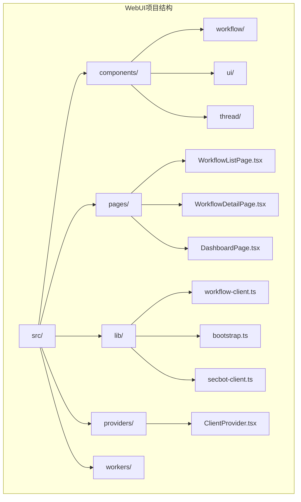

**图表来源**
- [main.tsx:1-16](file://webui/src/main.tsx#L1-L16)
- [App.tsx:1-254](file://webui/src/App.tsx#L1-L254)

**章节来源**
- [package.json:1-67](file://webui/package.json#L1-L67)
- [vite.config.ts:1-66](file://webui/vite.config.ts#L1-L66)

## 核心组件

### 工作流客户端 (WorkflowClient)

工作流客户端是整个系统的核心数据访问层，提供了完整的REST API封装：

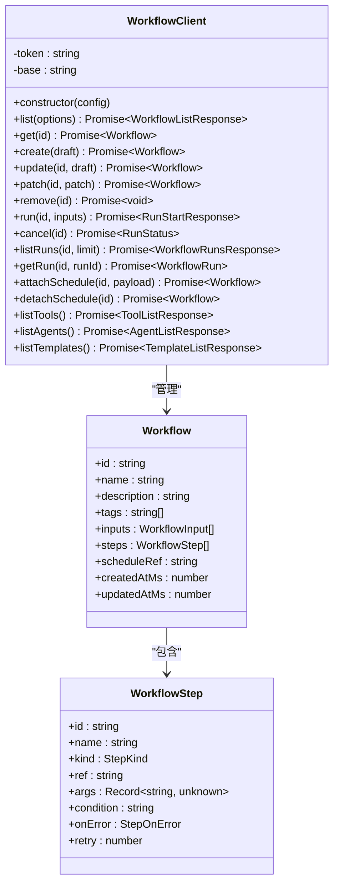

**图表来源**
- [workflow-client.ts:271-411](file://webui/src/lib/workflow-client.ts#L271-L411)
- [workflow-client.ts:66-76](file://webui/src/lib/workflow-client.ts#L66-L76)
- [workflow-client.ts:44-53](file://webui/src/lib/workflow-client.ts#L44-L53)

### 应用入口和路由系统

应用采用React Router进行页面路由管理，支持条件渲染和权限控制：

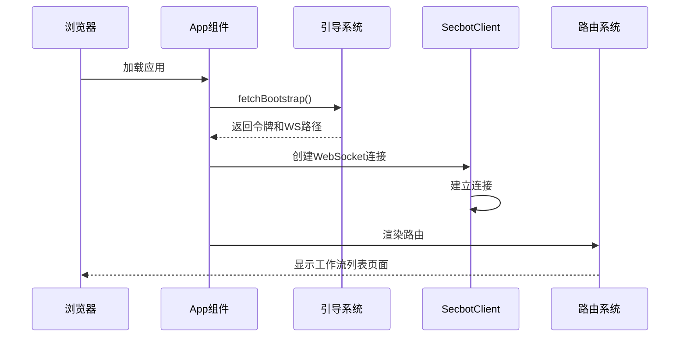

**图表来源**
- [App.tsx:59-108](file://webui/src/App.tsx#L59-L108)
- [bootstrap.ts:37-58](file://webui/src/lib/bootstrap.ts#L37-L58)
- [secbot-client.ts:155-165](file://webui/src/lib/secbot-client.ts#L155-L165)

**章节来源**
- [App.tsx:59-253](file://webui/src/App.tsx#L59-L253)
- [bootstrap.ts:1-100](file://webui/src/lib/bootstrap.ts#L1-L100)
- [secbot-client.ts:59-377](file://webui/src/lib/secbot-client.ts#L59-L377)

## 架构概览

工作流WebUI采用分层架构设计，各层职责清晰分离：

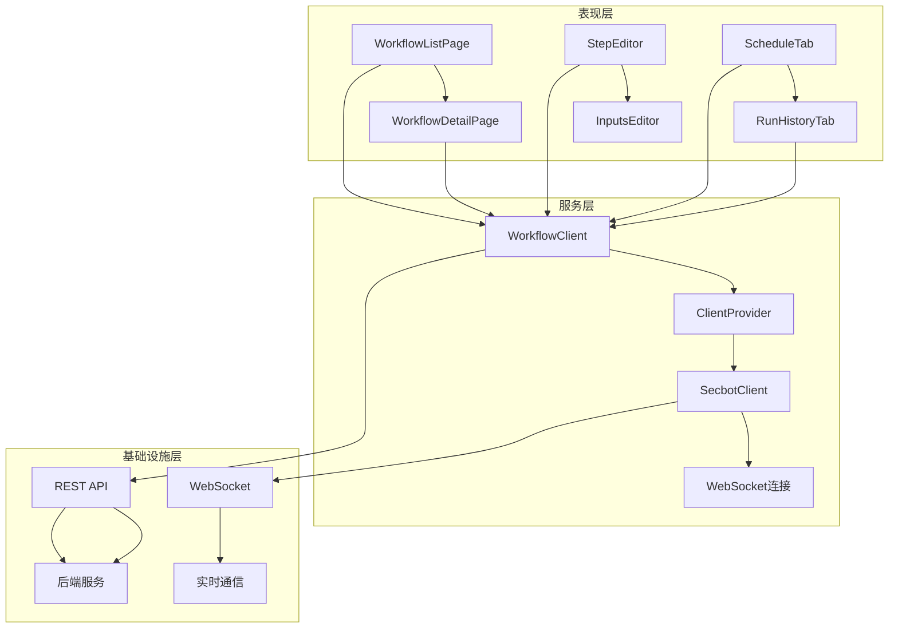

**图表来源**
- [WorkflowListPage.tsx:61-95](file://webui/src/pages/WorkflowListPage.tsx#L61-L95)
- [WorkflowDetailPage.tsx:63-72](file://webui/src/pages/WorkflowDetailPage.tsx#L63-L72)
- [ClientProvider.tsx:31-52](file://webui/src/providers/ClientProvider.tsx#L31-L52)

系统支持两种部署模式：
1. **模板模式**：现代路由架构，支持条件渲染和权限控制
2. **传统模式**：兼容旧版界面切换逻辑

## 详细组件分析

### 工作流列表页面 (WorkflowListPage)

工作流列表页面提供完整的工作流管理界面：

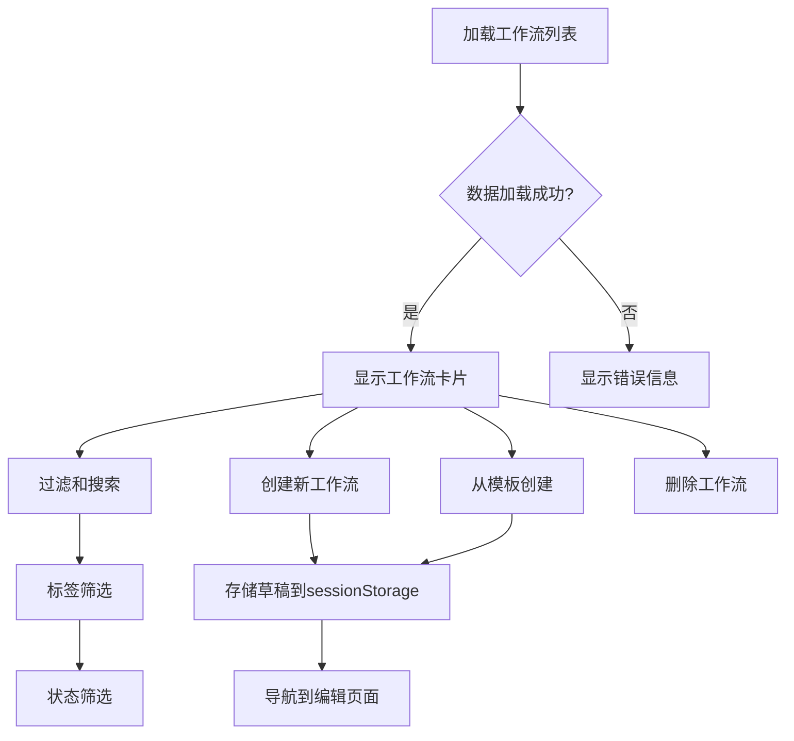

**图表来源**
- [WorkflowListPage.tsx:81-95](file://webui/src/pages/WorkflowListPage.tsx#L81-L95)
- [WorkflowListPage.tsx:156-173](file://webui/src/pages/WorkflowListPage.tsx#L156-L173)

主要功能特性：
- **多维过滤**：支持按状态、标签、搜索关键词过滤
- **模板系统**：内置模板库，支持快速创建工作流
- **草稿管理**：使用sessionStorage持久化编辑状态
- **批量操作**：支持删除确认对话框

**章节来源**
- [WorkflowListPage.tsx:61-288](file://webui/src/pages/WorkflowListPage.tsx#L61-L288)

### 工作流详情页面 (WorkflowDetailPage)

工作流详情页面提供完整的编辑和管理功能：

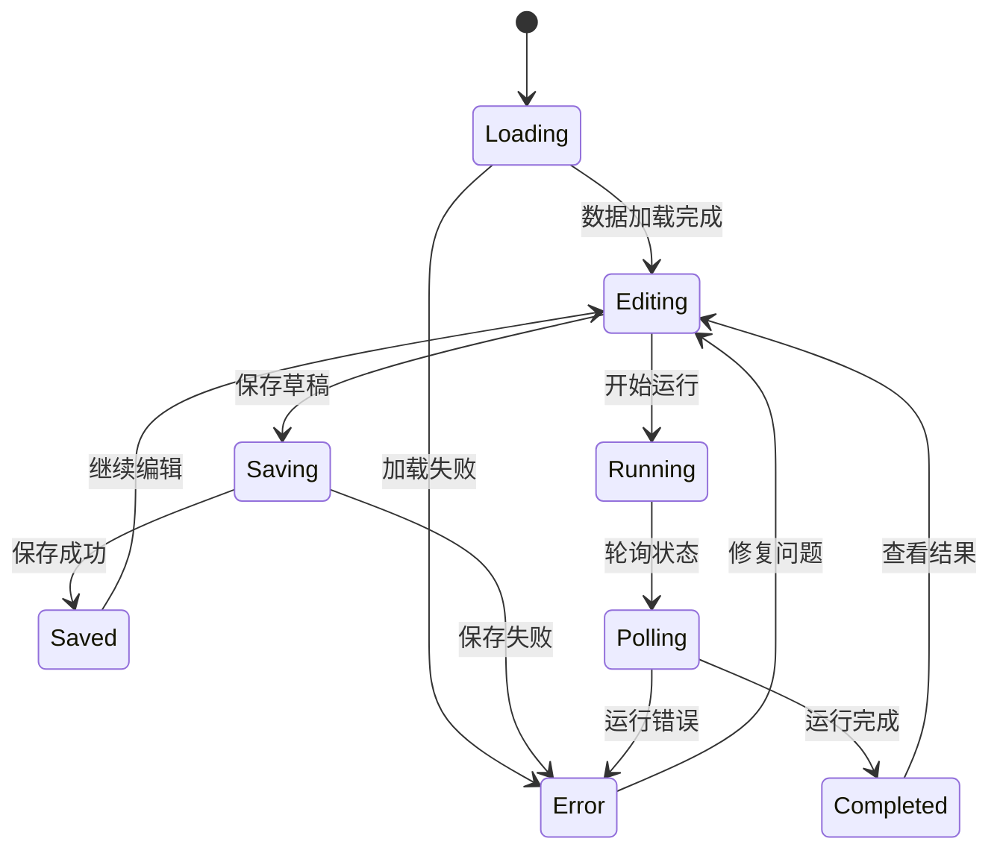

**图表来源**
- [WorkflowDetailPage.tsx:104-129](file://webui/src/pages/WorkflowDetailPage.tsx#L104-L129)
- [WorkflowDetailPage.tsx:194-216](file://webui/src/pages/WorkflowDetailPage.tsx#L194-L216)

页面包含四个主要标签页：

#### 基础设置标签 (Basic Tab)
- 工作流基本信息配置
- 输入参数定义
- 标签管理

#### 步骤编辑标签 (Steps Tab)
- 步骤卡片式编辑界面
- 支持四种步骤类型
- 步骤间条件表达式

#### 调度标签 (Schedule Tab)
- 定时任务配置
- 支持cron表达式、固定间隔、指定时间
- 输入参数绑定

#### 运行历史标签 (Runs Tab)
- 运行历史记录查看
- 实时状态轮询
- 详细结果展示

**章节来源**
- [WorkflowDetailPage.tsx:63-429](file://webui/src/pages/WorkflowDetailPage.tsx#L63-L429)

### 步骤编辑器 (StepEditor)

步骤编辑器提供可视化的步骤管理界面：

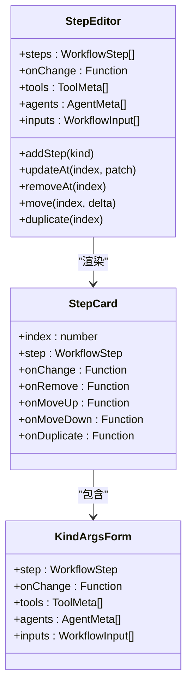

**图表来源**
- [StepEditor.tsx:45-139](file://webui/src/components/workflow/StepEditor.tsx#L45-L139)
- [StepEditor.tsx:158-303](file://webui/src/components/workflow/StepEditor.tsx#L158-L303)

支持的步骤类型及特性：

| 步骤类型 | 特性 | 参数配置 |
|---------|------|----------|
| Tool | 外部工具调用 | 下拉选择工具，动态表单 |
| Script | 自定义脚本 | 代码编辑器，超时设置 |
| Agent | AI代理 | JSON Schema表单 |
| LLM | 大语言模型 | 提示词，温度，格式 |

**章节来源**
- [StepEditor.tsx:1-336](file://webui/src/components/workflow/StepEditor.tsx#L1-L336)

### 输入参数编辑器 (InputsEditor)

输入参数编辑器提供灵活的参数定义界面：

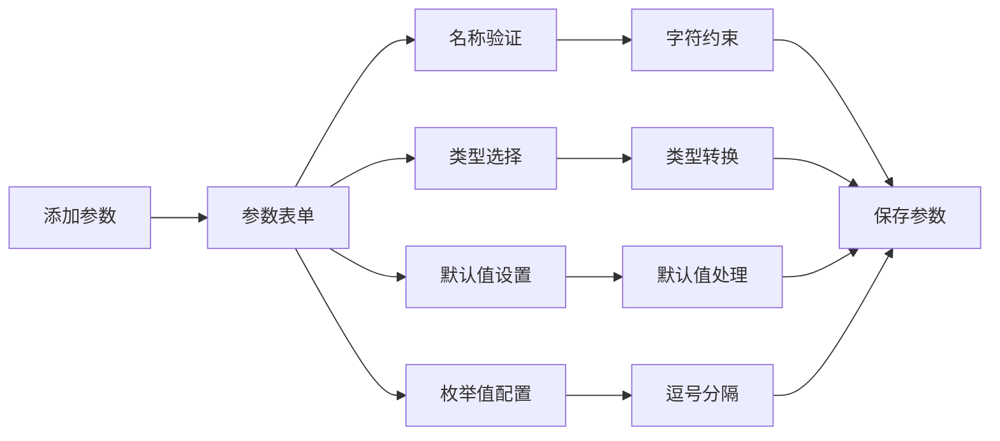

**图表来源**
- [InputsEditor.tsx:44-70](file://webui/src/components/workflow/InputsEditor.tsx#L44-L70)
- [InputsEditor.tsx:257-271](file://webui/src/components/workflow/InputsEditor.tsx#L257-L271)

支持的参数类型：
- 字符串 (string)
- CIDR网络 (cidr)
- 整数 (int)
- 布尔值 (bool)
- 枚举 (enum)

**章节来源**
- [InputsEditor.tsx:1-271](file://webui/src/components/workflow/InputsEditor.tsx#L1-L271)

### 调度管理 (ScheduleTab)

调度管理系统支持多种定时策略：

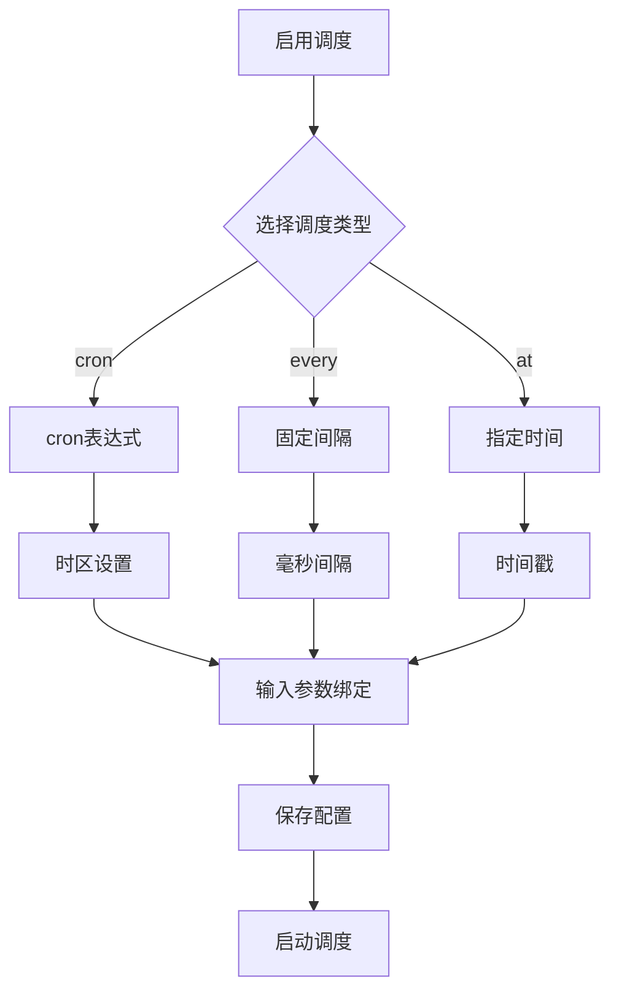

**图表来源**
- [ScheduleTab.tsx:59-95](file://webui/src/components/workflow/ScheduleTab.tsx#L59-L95)
- [ScheduleTab.tsx:298-322](file://webui/src/components/workflow/ScheduleTab.tsx#L298-L322)

**章节来源**
- [ScheduleTab.tsx:1-323](file://webui/src/components/workflow/ScheduleTab.tsx#L1-L323)

### 运行历史 (RunHistoryTab)

运行历史页面提供完整的执行监控：

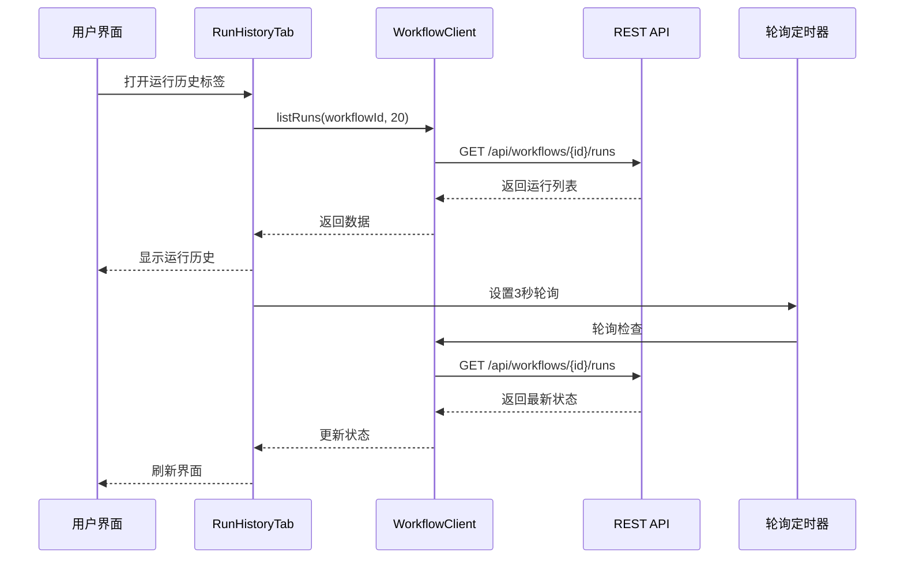

**图表来源**
- [RunHistoryTab.tsx:50-64](file://webui/src/components/workflow/RunHistoryTab.tsx#L50-L64)
- [RunHistoryTab.tsx:72-80](file://webui/src/components/workflow/RunHistoryTab.tsx#L72-L80)

**章节来源**
- [RunHistoryTab.tsx:1-325](file://webui/src/components/workflow/RunHistoryTab.tsx#L1-L325)

## 依赖关系分析

### 技术栈依赖

工作流WebUI组件采用现代化的前端技术栈：

```mermaid
graph TB
subgraph "核心框架"
A[React 18.3.1] --> B[TypeScript 5.7.2]
C[React Router 7] --> D[Vite 5.4.11]
end
subgraph "UI组件库"
E[@radix-ui/*] --> F[Lucide React]
G[Tailwind CSS] --> H[PostCSS]
end
subgraph "状态管理"
I[React Query 5.66.0] --> J[Context API]
end
subgraph "图表库"
K[ECharts 6.0.0] --> L[Recharts 2.15.0]
end
subgraph "国际化"
M[i18next 26.0.6] --> N[react-i18next 17.0.4]
end
```

**图表来源**
- [package.json:14-44](file://webui/package.json#L14-L44)

### 构建配置

Vite配置支持开发和生产环境的不同需求：

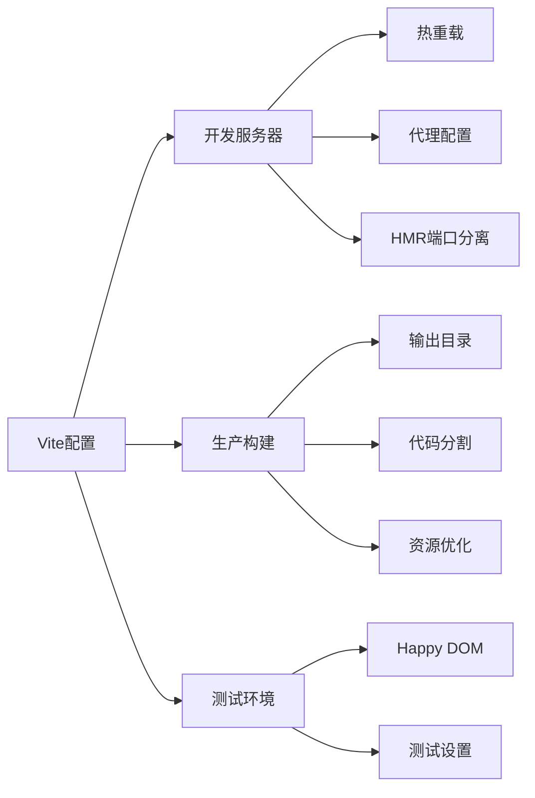

**图表来源**
- [vite.config.ts:5-65](file://webui/vite.config.ts#L5-L65)

**章节来源**
- [package.json:1-67](file://webui/package.json#L1-L67)
- [vite.config.ts:1-66](file://webui/vite.config.ts#L1-L66)
- [tailwind.config.js:1-166](file://webui/tailwind.config.js#L1-L166)

## 性能考虑

### 优化策略

1. **懒加载和代码分割**
   - 使用React.lazy实现组件懒加载
   - 动态导入减少初始包大小
   - 路由级别的代码分割

2. **状态缓存**
   - React Query提供智能缓存机制
   - 本地状态持久化避免重复请求
   - 缓存失效策略优化

3. **渲染优化**
   - useMemo和useCallback减少不必要的重渲染
   - 虚拟滚动处理大量数据
   - 图表组件按需渲染

4. **网络优化**
   - 请求去重和合并
   - 节流和防抖处理高频操作
   - 连接池管理和重连策略

### 内存管理

系统采用以下内存管理策略：
- 组件卸载时自动清理事件监听器
- WebSocket连接的生命周期管理
- 大对象的及时释放和垃圾回收

## 故障排除指南

### 常见问题及解决方案

#### 连接问题
- **症状**：无法连接到WebSocket服务
- **原因**：网络配置错误或认证失败
- **解决**：检查代理配置和令牌有效性

#### 数据加载失败
- **症状**：工作流列表显示错误
- **原因**：API响应异常或网络中断
- **解决**：检查后端服务状态和网络连接

#### 编辑器异常
- **症状**：步骤编辑器无响应
- **原因**：状态管理冲突或内存泄漏
- **解决**：刷新页面或清理浏览器缓存

#### 性能问题
- **症状**：页面卡顿或响应缓慢
- **原因**：大数据量渲染或过度重渲染
- **解决**：启用虚拟滚动和优化渲染逻辑

**章节来源**
- [secbot-client.ts:326-338](file://webui/src/lib/secbot-client.ts#L326-L338)
- [bootstrap.ts:37-58](file://webui/src/lib/bootstrap.ts#L37-L58)

## 结论

工作流WebUI组件是一个功能完整、架构清晰的现代化前端应用。它成功地将复杂的工作流管理功能抽象为直观的用户界面，提供了：

1. **完整的功能覆盖**：从工作流设计到执行监控的全流程支持
2. **优秀的用户体验**：响应式设计和流畅的交互体验
3. **强大的扩展性**：模块化架构便于功能扩展和维护
4. **可靠的稳定性**：完善的错误处理和性能优化机制

该组件为SecBot平台提供了坚实的基础，支持各种安全自动化场景的需求。通过持续的优化和功能增强，它将继续为用户提供更好的工作流管理体验。