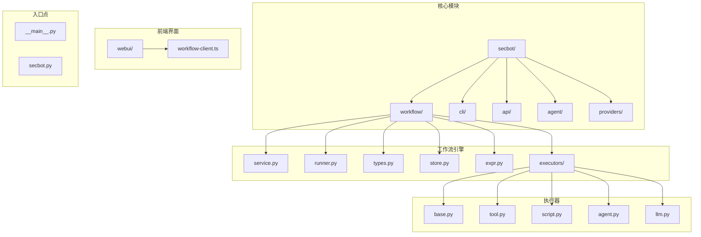
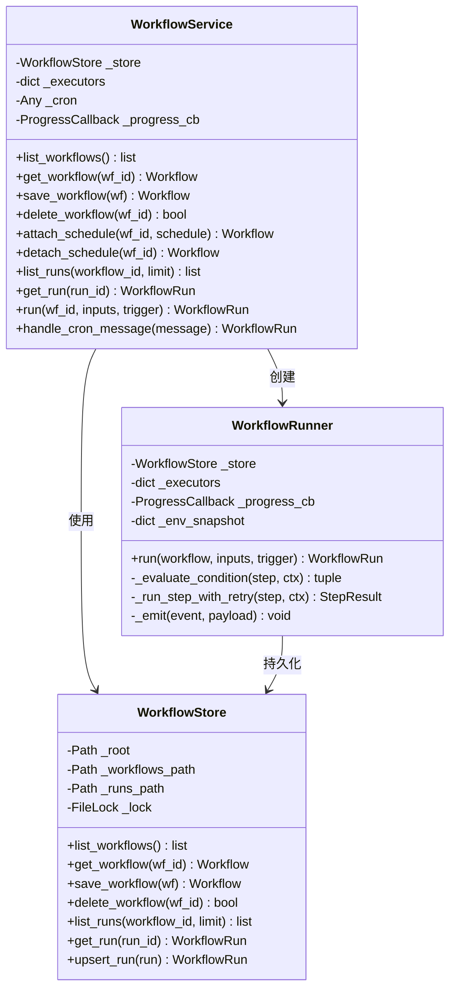
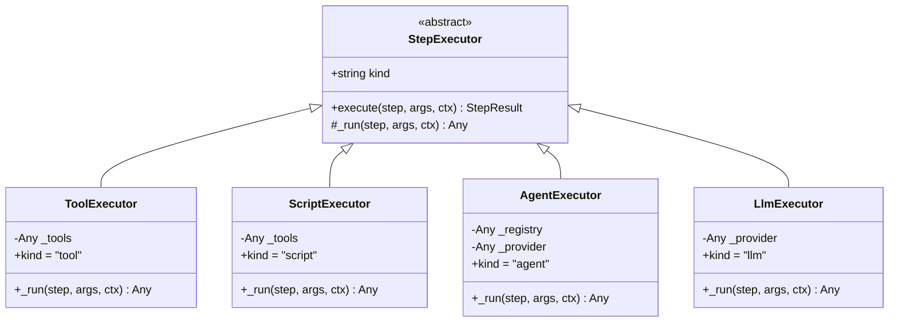
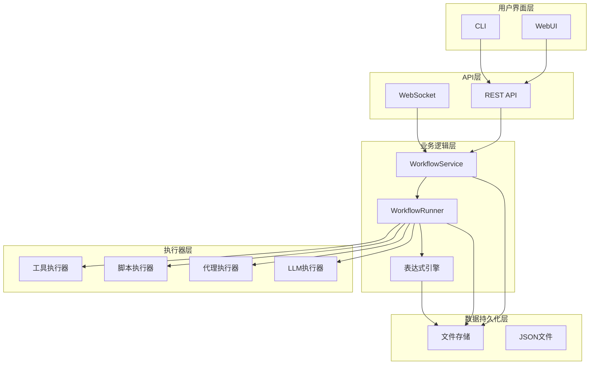
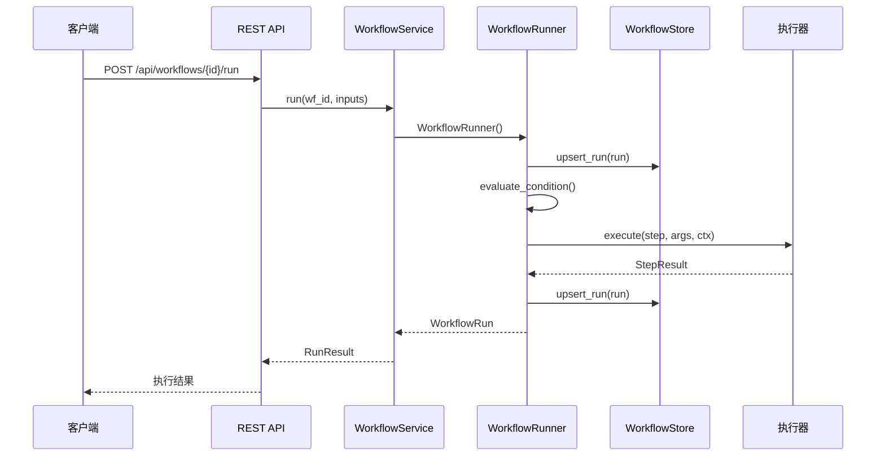
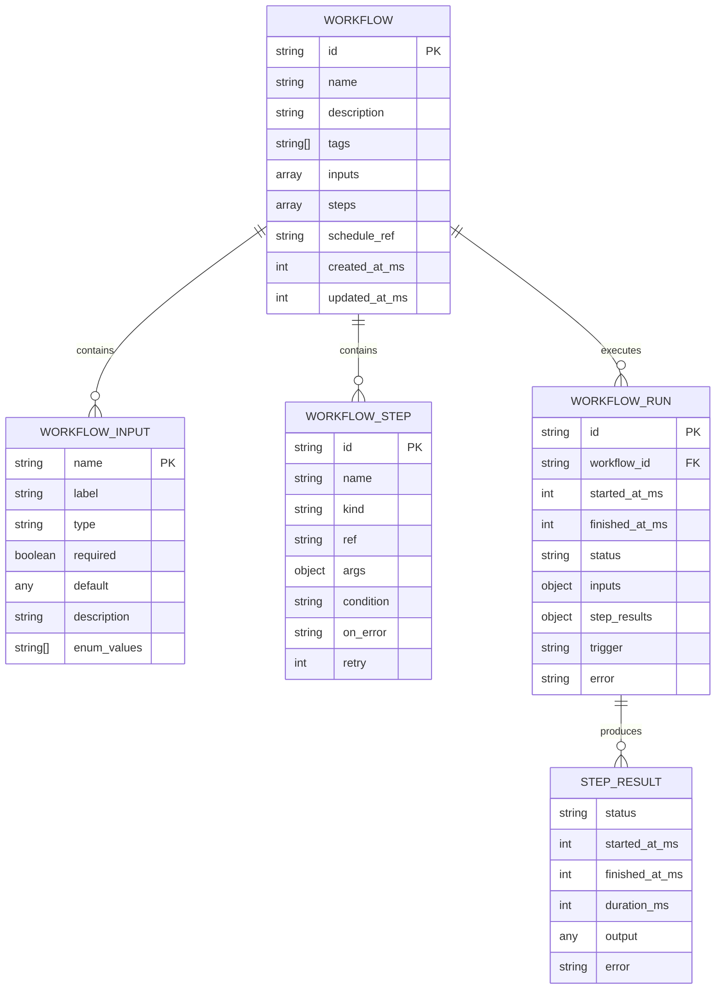
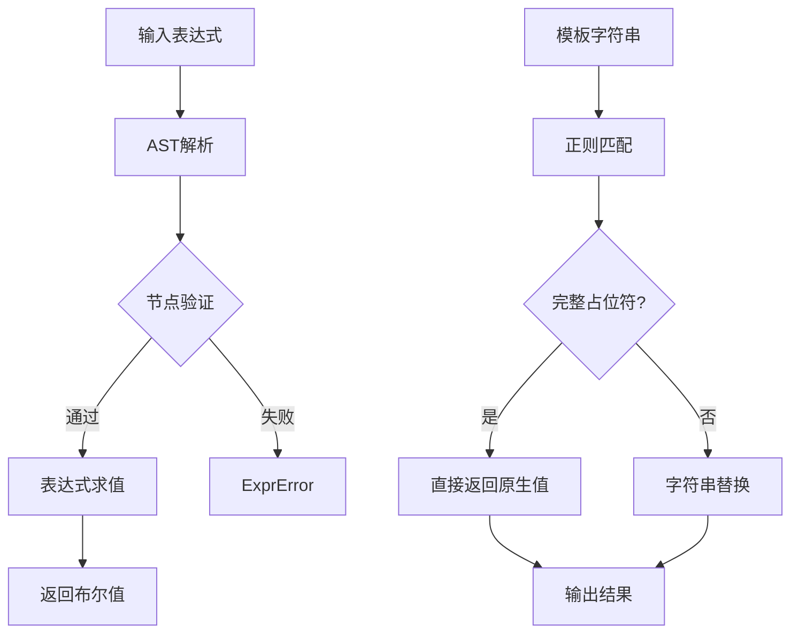
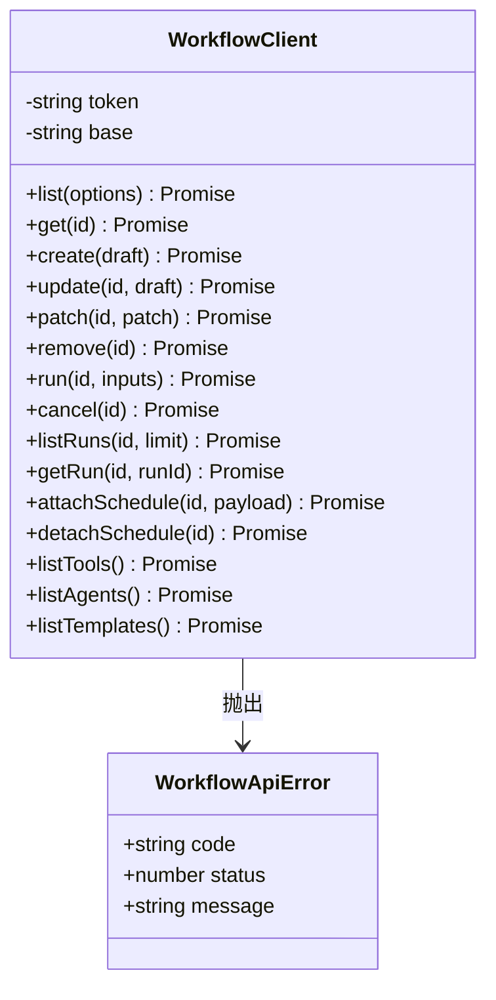
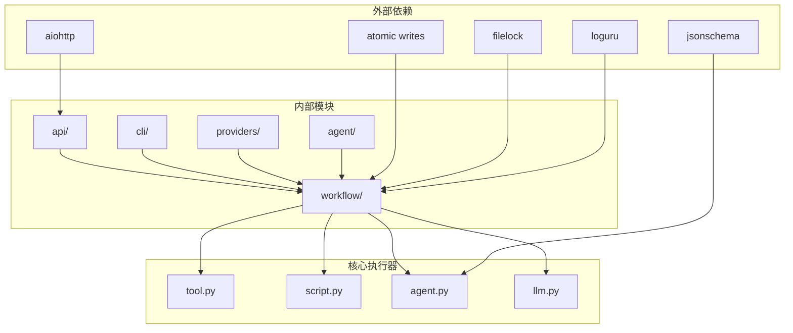

# 工作流客户端系统

<cite>
**本文档引用的文件**
- [secbot/__main__.py](file://secbot/__main__.py)
- [secbot/secbot.py](file://secbot/secbot.py)
- [secbot/workflow/__init__.py](file://secbot/workflow/__init__.py)
- [secbot/workflow/service.py](file://secbot/workflow/service.py)
- [secbot/workflow/runner.py](file://secbot/workflow/runner.py)
- [secbot/workflow/types.py](file://secbot/workflow/types.py)
- [secbot/workflow/executors/base.py](file://secbot/workflow/executors/base.py)
- [secbot/workflow/executors/tool.py](file://secbot/workflow/executors/tool.py)
- [secbot/workflow/executors/script.py](file://secbot/workflow/executors/script.py)
- [secbot/workflow/executors/agent.py](file://secbot/workflow/executors/agent.py)
- [secbot/workflow/executors/llm.py](file://secbot/workflow/executors/llm.py)
- [secbot/workflow/store.py](file://secbot/workflow/store.py)
- [secbot/workflow/expr.py](file://secbot/workflow/expr.py)
- [webui/src/lib/workflow-client.ts](file://webui/src/lib/workflow-client.ts)
</cite>

## 目录
1. [简介](#简介)
2. [项目结构](#项目结构)
3. [核心组件](#核心组件)
4. [架构概览](#架构概览)
5. [详细组件分析](#详细组件分析)
6. [依赖关系分析](#依赖关系分析)
7. [性能考虑](#性能考虑)
8. [故障排除指南](#故障排除指南)
9. [结论](#结论)

## 简介

工作流客户端系统是一个基于Python开发的智能工作流引擎，提供了完整的流程编排、执行和监控能力。该系统支持多种执行器类型（工具、脚本、代理、LLM），具备条件表达式求值、模板插值、重试机制和进度回调等功能。

系统采用模块化设计，包含命令行界面、Web API服务、工作流执行引擎和前端客户端等多个组件。通过统一的API接口，用户可以创建、管理和执行复杂的工作流任务。

## 项目结构

**图表来源**
- [secbot/__main__.py:1-9](file://secbot/__main__.py#L1-L9)
- [secbot/secbot.py:1-132](file://secbot/secbot.py#L1-L132)
- [secbot/workflow/__init__.py:1-55](file://secbot/workflow/__init__.py#L1-L55)

**章节来源**
- [secbot/__main__.py:1-9](file://secbot/__main__.py#L1-L9)
- [secbot/secbot.py:1-132](file://secbot/secbot.py#L1-L132)
- [secbot/workflow/__init__.py:1-55](file://secbot/workflow/__init__.py#L1-L55)

## 核心组件

### 工作流服务层

工作流服务层是整个系统的核心协调器，负责管理工作流的生命周期和执行调度。

**图表来源**
- [secbot/workflow/service.py:57-290](file://secbot/workflow/service.py#L57-L290)
- [secbot/workflow/store.py:33-159](file://secbot/workflow/store.py#L33-L159)
- [secbot/workflow/runner.py:71-313](file://secbot/workflow/runner.py#L71-L313)

### 执行器系统

执行器系统提供了四种不同类型的执行器，每种执行器都有特定的功能和用途：

**图表来源**
- [secbot/workflow/executors/base.py:59-116](file://secbot/workflow/executors/base.py#L59-L116)
- [secbot/workflow/executors/tool.py:23-56](file://secbot/workflow/executors/tool.py#L23-L56)
- [secbot/workflow/executors/script.py:46-152](file://secbot/workflow/executors/script.py#L46-L152)
- [secbot/workflow/executors/agent.py:44-161](file://secbot/workflow/executors/agent.py#L44-L161)
- [secbot/workflow/executors/llm.py:41-161](file://secbot/workflow/executors/llm.py#L41-L161)

**章节来源**
- [secbot/workflow/service.py:57-290](file://secbot/workflow/service.py#L57-L290)
- [secbot/workflow/runner.py:71-313](file://secbot/workflow/runner.py#L71-L313)
- [secbot/workflow/executors/base.py:59-116](file://secbot/workflow/executors/base.py#L59-L116)

## 架构概览

工作流客户端系统采用分层架构设计，从底层的数据存储到上层的用户界面，每一层都有明确的职责分工。

**图表来源**
- [webui/src/lib/workflow-client.ts:1-499](file://webui/src/lib/workflow-client.ts#L1-L499)
- [secbot/workflow/service.py:1-290](file://secbot/workflow/service.py#L1-L290)
- [secbot/workflow/runner.py:1-313](file://secbot/workflow/runner.py#L1-L313)

系统的核心执行流程如下：

**图表来源**
- [secbot/workflow/service.py:171-184](file://secbot/workflow/service.py#L171-L184)
- [secbot/workflow/runner.py:96-159](file://secbot/workflow/runner.py#L96-L159)

## 详细组件分析

### 数据模型系统

系统使用强类型的数据模型来确保数据的一致性和完整性：

**图表来源**
- [secbot/workflow/types.py:78-275](file://secbot/workflow/types.py#L78-L275)

### 表达式和模板系统

表达式系统提供了安全的条件判断和模板插值功能：

**图表来源**
- [secbot/workflow/expr.py:258-275](file://secbot/workflow/expr.py#L258-L275)
- [secbot/workflow/expr.py:69-98](file://secbot/workflow/expr.py#L69-L98)

**章节来源**
- [secbot/workflow/types.py:78-275](file://secbot/workflow/types.py#L78-L275)
- [secbot/workflow/expr.py:1-275](file://secbot/workflow/expr.py#L1-L275)

### 前端客户端

前端提供了完整的REST客户端实现，支持工作流的CRUD操作和实时状态监控：

**图表来源**
- [webui/src/lib/workflow-client.ts:271-411](file://webui/src/lib/workflow-client.ts#L271-L411)

**章节来源**
- [webui/src/lib/workflow-client.ts:1-499](file://webui/src/lib/workflow-client.ts#L1-L499)

## 依赖关系分析

系统采用了清晰的依赖层次结构，确保各模块之间的松耦合：

**图表来源**
- [secbot/workflow/service.py:30-44](file://secbot/workflow/service.py#L30-L44)
- [secbot/workflow/executors/agent.py:37-41](file://secbot/workflow/executors/agent.py#L37-L41)

**章节来源**
- [secbot/workflow/service.py:30-44](file://secbot/workflow/service.py#L30-L44)
- [secbot/workflow/executors/agent.py:37-41](file://secbot/workflow/executors/agent.py#L37-L41)

## 性能考虑

系统在设计时充分考虑了性能优化：

1. **异步执行**: 所有主要操作都采用异步模式，提高并发处理能力
2. **内存管理**: 使用生成器和流式处理减少内存占用
3. **缓存策略**: 环境变量快照避免重复读取
4. **文件锁**: 使用进程间文件锁确保数据一致性
5. **原子写入**: 所有文件写入都采用原子操作避免数据损坏

## 故障排除指南

### 常见问题及解决方案

1. **工作流执行失败**
   - 检查工作流定义的语法正确性
   - 验证所有必需的输入参数是否提供
   - 查看错误日志中的具体错误信息

2. **执行器配置问题**
   - 确认工具注册表中存在所需的工具
   - 检查脚本执行器的权限设置
   - 验证代理执行器的配置参数

3. **存储访问异常**
   - 检查工作目录的读写权限
   - 确认磁盘空间充足
   - 验证文件锁机制正常工作

**章节来源**
- [secbot/workflow/service.py:53-55](file://secbot/workflow/service.py#L53-L55)
- [secbot/workflow/runner.py:67-69](file://secbot/workflow/runner.py#L67-L69)

## 结论

工作流客户端系统是一个功能完整、设计合理的智能工作流引擎。系统采用模块化架构，提供了灵活的扩展能力和强大的执行功能。通过统一的API接口和丰富的执行器类型，用户可以构建复杂的自动化工作流程。

系统的安全性设计体现在多个层面：表达式引擎的安全限制、执行器的输入验证、文件存储的原子操作等。同时，系统的异步架构和性能优化确保了良好的用户体验。

未来的发展方向包括增强的Web界面、更丰富的执行器类型、以及更完善的监控和调试功能。