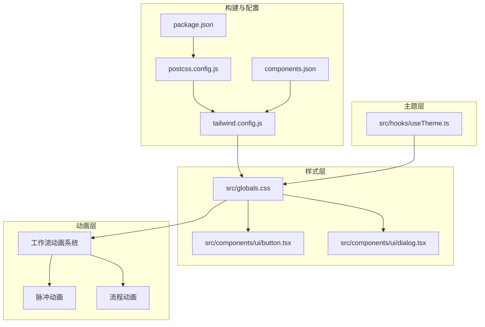
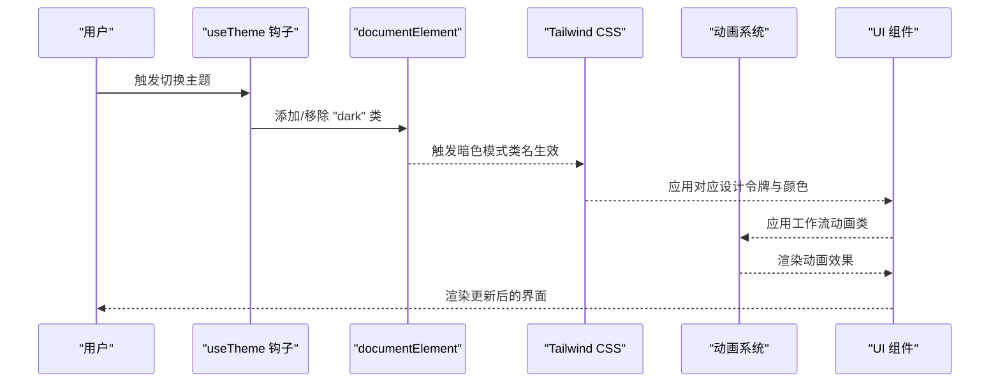
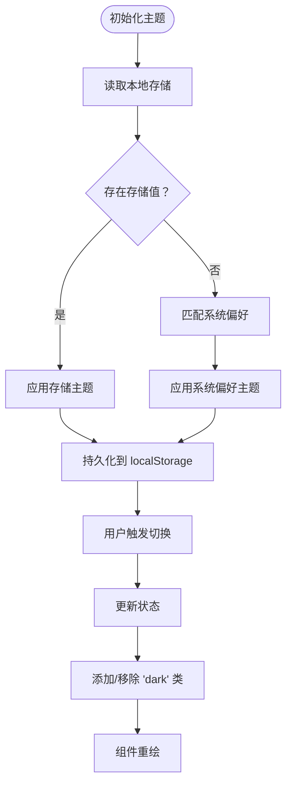
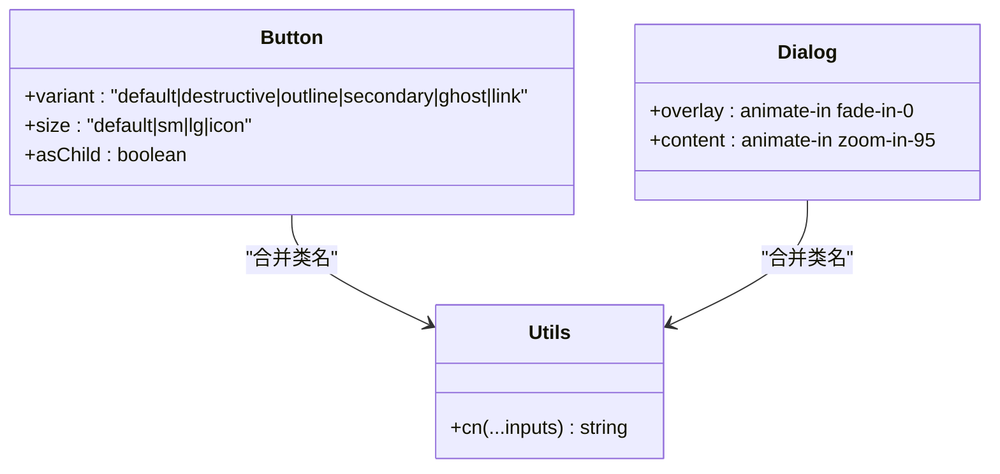
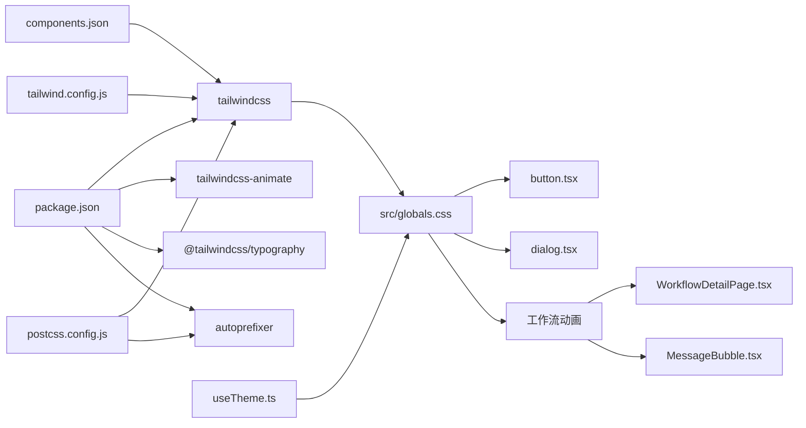

# 样式与主题系统

<cite>
**本文档引用的文件**
- [tailwind.config.js](file://webui/tailwind.config.js)
- [postcss.config.js](file://webui/postcss.config.js)
- [package.json](file://webui/package.json)
- [globals.css](file://webui/src/globals.css)
- [useTheme.ts](file://webui/src/hooks/useTheme.ts)
- [components.json](file://webui/components.json)
- [button.tsx](file://webui/src/components/ui/button.tsx)
- [dialog.tsx](file://webui/src/components/ui/dialog.tsx)
- [utils.ts](file://webui/src/lib/utils.ts)
- [WorkflowDetailPage.tsx](file://webui/src/pages/WorkflowDetailPage.tsx)
- [MessageBubble.tsx](file://webui/src/components/MessageBubble.tsx)
</cite>

## 更新摘要
**所做更改**
- 新增工作流相关动画系统章节，详细说明工作流进度条动画和节点运行状态动画
- 更新全局样式部分，增加工作流专用动画类的详细说明
- 新增动画系统最佳实践章节，涵盖工作流动画的实现模式
- 更新故障排查指南，增加工作流动画相关的调试建议

## 目录
1. [简介](#简介)
2. [项目结构](#项目结构)
3. [核心组件](#核心组件)
4. [架构总览](#架构总览)
5. [详细组件分析](#详细组件分析)
6. [动画系统详解](#动画系统详解)
7. [依赖关系分析](#依赖关系分析)
8. [性能考量](#性能考量)
9. [故障排查指南](#故障排查指南)
10. [结论](#结论)
11. [附录](#附录)

## 简介
本文件系统性梳理 VAPT3 WebUI 的样式与主题体系，覆盖 TailwindCSS 配置与使用、全局样式组织、主题系统实现、组件样式最佳实践、工作流动画系统以及维护策略，以及浏览器兼容性与可访问性建议。目标是帮助开发者在不直接阅读源码的情况下，也能高效理解并扩展样式系统。

## 项目结构
WebUI 的样式与主题相关文件主要集中在 webui 目录中，采用"配置 + 全局样式 + 组件样式 + 主题钩子 + 动画系统"的分层组织方式：
- 配置层：tailwind.config.js、postcss.config.js、components.json
- 全局样式层：src/globals.css（含设计令牌、品牌主题、工具类、工作流动画）
- 组件层：src/components/ui/*.tsx（基于原子化与变体模式）
- 主题层：src/hooks/useTheme.ts（主题状态管理与持久化）
- 动画层：工作流专用动画类和通用动画系统



**图表来源**
- [tailwind.config.js:1-166](file://webui/tailwind.config.js#L1-L166)
- [postcss.config.js:1-7](file://webui/postcss.config.js#L1-L7)
- [package.json:1-67](file://webui/package.json#L1-L67)
- [components.json:1-21](file://webui/components.json#L1-L21)
- [globals.css:1-272](file://webui/src/globals.css#L1-L272)
- [button.tsx:1-57](file://webui/src/components/ui/button.tsx#L1-L57)
- [dialog.tsx:1-117](file://webui/src/components/ui/dialog.tsx#L1-L117)
- [useTheme.ts:1-49](file://webui/src/hooks/useTheme.ts#L1-L49)

**章节来源**
- [tailwind.config.js:1-166](file://webui/tailwind.config.js#L1-L166)
- [postcss.config.js:1-7](file://webui/postcss.config.js#L1-L7)
- [package.json:1-67](file://webui/package.json#L1-L67)
- [components.json:1-21](file://webui/components.json#L1-L21)

## 核心组件
本节聚焦样式系统的关键构件及其职责与交互。

- Tailwind 配置与插件
  - 启用暗色模式类名驱动（darkMode: ["class"]），通过根元素 class 切换明/暗主题。
  - 内容扫描范围限定在 index.html 与 src 下 TS/TSX 文件，确保按需生成样式。
  - 扩展主题：容器居中与内边距、字体族（无衬线与等宽）、圆角变量、HSL 设计令牌映射、渐变背景、阴影、过渡曲线、关键帧与动画。
  - 插件：tailwindcss-animate、@tailwindcss/typography。

- 全局样式与设计令牌
  - 在 :root 与 .dark 中定义 HSL 设计令牌，统一映射到 Tailwind 颜色系统。
  - 品牌主题 secbot：通过 [data-theme="secbot"] 覆盖关键令牌，形成定制化的深色风格与品牌配色（主色、严重等级、渐变、发光阴影）。
  - 基础层：重置边框、强制全高、应用背景与前景色；覆盖暗色模式下的 body 色值以确保主题权威性。
  - 工具层：提供文本渐变、毛玻璃、边框发光、悬停提升、卡片渐变、滚动条美化、Markdown 排版、CJK 行高优化等实用类。
  - 动画：脉冲打点、淡入上移、从右滑入、工作流进度条动画、节点运行动画等。

- 主题钩子 useTheme
  - 状态：light/dark。
  - 行为：读取本地存储与系统偏好，应用根元素 class，持久化选择；提供切换与设置方法。
  - 与 Tailwind 暗色模式协同，实现明/暗主题无缝切换。

- 组件样式与复用
  - 使用 class-variance-authority 定义变体（variant/size），结合 tailwind-merge 与 clsx 进行类名合并，避免冲突。
  - 输入与按钮等基础组件遵循设计令牌命名，保证一致的视觉与交互体验。

- 动画系统
  - 工作流专用动画：进度条流动动画、节点运行发光效果、脉冲扩散效果。
  - 通用动画：脉冲光晕、淡入上移、滑入右入等，支持 Radix UI 组件的开启动画。

**章节来源**
- [tailwind.config.js:5-166](file://webui/tailwind.config.js#L5-L166)
- [globals.css:5-272](file://webui/src/globals.css#L5-L272)
- [useTheme.ts:1-49](file://webui/src/hooks/useTheme.ts#L1-L49)
- [button.tsx:7-34](file://webui/src/components/ui/button.tsx#L7-L34)
- [dialog.tsx:12-48](file://webui/src/components/ui/dialog.tsx#L12-L48)
- [utils.ts:4-6](file://webui/src/lib/utils.ts#L4-L6)

## 架构总览
下图展示样式系统从配置到运行时的主题切换与组件渲染路径，包括新增的工作流动画系统。



**图表来源**
- [useTheme.ts:15-40](file://webui/src/hooks/useTheme.ts#L15-L40)
- [tailwind.config.js:6-6](file://webui/tailwind.config.js#L6-L6)
- [globals.css:35-60](file://webui/src/globals.css#L35-L60)
- [WorkflowDetailPage.tsx:973-998](file://webui/src/pages/WorkflowDetailPage.tsx#L973-L998)

## 详细组件分析

### Tailwind 配置详解
- 内容扫描与按需生成
  - content 指定扫描范围，确保仅生成实际使用的样式，减少体积。
- 主题扩展
  - 字体族：无衬线与等宽字体栈，兼顾国际化与代码场景。
  - 圆角：基于 CSS 变量，支持全局半径控制。
  - 颜色系统：将设计令牌映射为 HSL 变量，统一暴露至 Tailwind。
  - 背景与阴影：品牌渐变与优雅阴影，强化视觉层次。
  - 动画与关键帧：提供常用动效，便于组件级复用，包括工作流专用动画。
- 插件集成
  - tailwindcss-animate：增强动画能力。
  - @tailwindcss/typography：Markdown 文本排版一致性。

**章节来源**
- [tailwind.config.js:6-166](file://webui/tailwind.config.js#L6-L166)

### 全局样式与设计令牌
- 设计令牌
  - :root 与 .dark 定义明/暗两套 HSL 令牌，确保主题切换时颜色一致。
  - [data-theme="secbot"] 提供品牌主题覆盖，包含严重等级、渐变、阴影与过渡。
- 基础层与工具层
  - 基础层：统一边框、高度、背景与前景色。
  - 工具层：提供品牌相关的实用类，如文本渐变、毛玻璃、边框发光、悬停提升、滚动条美化等。
- Markdown 排版
  - 覆盖 Tailwind Typography 的颜色变量，确保消息内容与整体主题一致。
- CJK 友好排版
  - 根据语言环境调整行高，提升中文/日文/韩文可读性。
- 工作流动画类
  - 流程进度条动画：flow-progress-bar 实现水平进度条的流动效果。
  - 节点运行状态：flow-node-running 提供运行中节点的发光阴影效果。
  - 脉冲光晕：animate-pulse-glow 实现节点的脉冲扩散动画。

**章节来源**
- [globals.css:5-272](file://webui/src/globals.css#L5-L272)

### 主题系统实现
- useTheme 钩子
  - 优先读取本地存储，其次匹配系统偏好，最后回退为 light。
  - 通过向 documentElement 添加/移除 "dark" 类，驱动 Tailwind 暗色模式。
  - 将当前主题持久化到 localStorage，实现跨会话记忆。
- 切换流程
  - 用户操作 -> 更新状态 -> 应用类名 -> 触发 Tailwind 重新计算 -> 组件重绘。



**图表来源**
- [useTheme.ts:6-40](file://webui/src/hooks/useTheme.ts#L6-L40)

**章节来源**
- [useTheme.ts:1-49](file://webui/src/hooks/useTheme.ts#L1-L49)

### 组件样式最佳实践
- 原子化与变体
  - 使用 class-variance-authority 定义按钮等组件的变体与尺寸，集中管理样式组合。
  - 通过 cn 函数合并类名，避免重复与冲突。
- 复用与一致性
  - 组件内部直接引用设计令牌（如 bg-primary、text-primary-foreground），确保与全局主题一致。
- 性能优化
  - Tailwind 按需生成，配合组件内联样式，减少全局样式体积。
  - 使用 CSS 变量与 HSL 令牌，降低主题切换成本。



**图表来源**
- [button.tsx:7-34](file://webui/src/components/ui/button.tsx#L7-L34)
- [dialog.tsx:12-48](file://webui/src/components/ui/dialog.tsx#L12-L48)
- [utils.ts:4-6](file://webui/src/lib/utils.ts#L4-L6)

**章节来源**
- [button.tsx:1-57](file://webui/src/components/ui/button.tsx#L1-L57)
- [dialog.tsx:1-117](file://webui/src/components/ui/dialog.tsx#L1-L117)
- [utils.ts:1-34](file://webui/src/lib/utils.ts#L1-L34)

## 动画系统详解

### 工作流动画架构
VAPT3 的工作流动画系统专为工作流执行过程中的状态可视化而设计，包含以下核心组件：

- **进度条动画**
  - flow-progress-bar：实现水平进度条的流动效果，模拟工作流执行进度。
  - 使用线性渐变背景和无限循环动画，创造流畅的进度指示效果。

- **节点状态动画**
  - flow-node-running：为运行中的工作流节点添加发光阴影效果。
  - animate-pulse-glow：实现节点的脉冲扩散动画，突出当前执行状态。

- **输入提示动画**
  - typing-dot：三个点状元素的脉冲动画，模拟AI输入时的打字效果。
  - 支持不同的延迟时间，创造错落有致的动画序列。

```mermaid
graph TB
subgraph "工作流动画系统"
PROG["进度条动画<br/>flow-progress-bar"]
NODE["节点动画<br/>flow-node-running + animate-pulse-glow"]
TYPE["输入动画<br/>typing-dot"]
END
subgraph "动画实现"
KEY["关键帧动画<br/>flow-x + pulse"]
TRANS["过渡效果<br/>cubic-bezier"]
COLOR["色彩系统<br/>--primary + --ocean-500"]
END
PROG --> KEY
NODE --> KEY
TYPE --> KEY
KEY --> TRANS
TRANS --> COLOR
```

**图表来源**
- [globals.css:242-271](file://webui/src/globals.css#L242-L271)
- [tailwind.config.js:129-161](file://webui/tailwind.config.js#L129-L161)
- [WorkflowDetailPage.tsx:973-1024](file://webui/src/pages/WorkflowDetailPage.tsx#L973-L1024)

### 动画实现细节

#### 进度条动画实现
工作流进度条动画通过以下步骤实现：

1. **关键帧定义**：flow-x 关键帧实现从左侧到右侧的平移动画
2. **渐变背景**：使用透明到主色调再到透明的渐变效果
3. **无限循环**：linear timing function 确保匀速动画
4. **定位控制**：绝对定位和宽度控制实现进度指示

#### 节点运行状态动画
节点运行状态通过双重效果实现：

1. **内发光效果**：多层阴影实现柔和的发光边界
2. **脉冲光晕**：animate-ping 实现扩散的脉冲效果
3. **状态切换**：根据工作流状态动态应用不同动画类

#### 输入提示动画
AI输入提示动画采用经典的三点脉冲效果：

1. **独立动画**：每个点状元素独立的延迟动画
2. **同步播放**：通过不同的 animation-delay 创建序列效果
3. **颜色适配**：使用主色调确保在不同主题下的一致性

**章节来源**
- [globals.css:218-271](file://webui/src/globals.css#L218-L271)
- [WorkflowDetailPage.tsx:973-1024](file://webui/src/pages/WorkflowDetailPage.tsx#L973-L1024)
- [MessageBubble.tsx:374-378](file://webui/src/components/MessageBubble.tsx#L374-L378)

### 动画系统最佳实践

#### 动画性能优化
- **硬件加速**：使用 transform 和 opacity 属性确保GPU加速
- **关键属性动画**：避免动画过程中改变布局属性
- **动画时长控制**：合理设置动画时长，避免过长影响用户体验
- **性能监控**：使用浏览器性能面板监控动画帧率

#### 动画可访问性
- **减少动画**：提供减少动画的偏好设置
- **颜色对比**：确保动画效果在不同主题下都有足够的对比度
- **动画暂停**：支持用户的动画暂停需求
- **运动敏感**：为运动敏感用户提供替代方案

#### 动画一致性
- **统一时序函数**：使用相同的缓动函数确保动画节奏一致
- **尺寸规范**：动画元素的尺寸和间距保持一致
- **颜色规范**：动画颜色遵循品牌色彩系统
- **状态映射**：动画效果与业务状态建立清晰的映射关系

**章节来源**
- [tailwind.config.js:126-161](file://webui/tailwind.config.js#L126-L161)
- [globals.css:116-117](file://webui/src/globals.css#L116-L117)

## 依赖关系分析
- 构建链路
  - package.json 声明 tailwindcss、tailwindcss-animate、@tailwindcss/typography、autoprefixer 等依赖。
  - postcss.config.js 指定 tailwindcss 与 autoprefixer 插件顺序。
  - components.json 与 tailwind.config.js 协同，确保组件别名与 CSS 变量启用。
- 运行时依赖
  - useTheme 依赖 DOM API 与 localStorage，实现主题持久化与系统偏好检测。
  - 组件依赖设计令牌与 Tailwind 类名，保证主题一致性。
  - 动画系统依赖 CSS 变量和关键帧定义，确保跨组件的一致性。



**图表来源**
- [package.json:14-65](file://webui/package.json#L14-L65)
- [postcss.config.js:1-7](file://webui/postcss.config.js#L1-L7)
- [components.json:6-12](file://webui/components.json#L6-L12)
- [tailwind.config.js:1-166](file://webui/tailwind.config.js#L1-L166)
- [globals.css:1-3](file://webui/src/globals.css#L1-L3)
- [button.tsx:1-57](file://webui/src/components/ui/button.tsx#L1-L57)
- [dialog.tsx:1-117](file://webui/src/components/ui/dialog.tsx#L1-L117)
- [useTheme.ts:1-49](file://webui/src/hooks/useTheme.ts#L1-L49)
- [WorkflowDetailPage.tsx:973-1024](file://webui/src/pages/WorkflowDetailPage.tsx#L973-L1024)
- [MessageBubble.tsx:374-378](file://webui/src/components/MessageBubble.tsx#L374-L378)

**章节来源**
- [package.json:1-67](file://webui/package.json#L1-L67)
- [postcss.config.js:1-7](file://webui/postcss.config.js#L1-L7)
- [components.json:1-21](file://webui/components.json#L1-L21)
- [tailwind.config.js:1-166](file://webui/tailwind.config.js#L1-L166)
- [globals.css:1-272](file://webui/src/globals.css#L1-L272)
- [useTheme.ts:1-49](file://webui/src/hooks/useTheme.ts#L1-L49)

## 性能考量
- 按需生成与体积控制
  - content 扫描范围明确，避免生成未使用样式。
  - 使用 CSS 变量与 HSL 令牌，减少重复颜色定义。
- 运行时开销
  - useTheme 仅在切换时更新根元素类名，成本极低。
  - 组件样式通过原子化与变体组合，避免额外 CSS 文件。
  - 工作流动画使用 GPU 加速的 transform 和 opacity 属性。
- 构建与缓存
  - PostCSS 与 Tailwind 在构建阶段完成处理，运行时不产生额外解析成本。
  - 动画关键帧在编译时确定，运行时只需应用类名。

## 故障排查指南
- 主题切换无效
  - 检查根元素是否正确添加/移除 "dark" 类。
  - 确认 localStorage 中是否存在主题记录，必要时清理后重试。
- 颜色不一致
  - 确保组件使用设计令牌类名（如 bg-primary），而非硬编码颜色。
  - 检查 [data-theme="secbot"] 是否被意外覆盖。
- 动画或阴影异常
  - 确认 tailwind.config.js 中动画与阴影定义未被覆盖。
  - 检查工具层类名是否正确拼写（如 text-gradient、bg-glass）。
  - 验证工作流动画类是否正确应用到目标元素。
- 工作流动画问题
  - 检查 flow-progress-bar 是否正确应用到进度容器。
  - 确认 flow-node-running 类是否与 animate-pulse-glow 类同时应用。
  - 验证 typing-dot 动画是否在正确的上下文中使用。
- 构建失败或样式缺失
  - 确认 postcss.config.js 中 tailwindcss 与 autoprefixer 顺序正确。
  - 检查 tailwind.config.js 的 content 路径是否包含新增组件文件。

**章节来源**
- [useTheme.ts:15-40](file://webui/src/hooks/useTheme.ts#L15-L40)
- [globals.css:120-272](file://webui/src/globals.css#L120-L272)
- [tailwind.config.js:155-161](file://webui/tailwind.config.js#L155-L161)
- [postcss.config.js:1-7](file://webui/postcss.config.js#L1-L7)
- [WorkflowDetailPage.tsx:973-1024](file://webui/src/pages/WorkflowDetailPage.tsx#L973-L1024)
- [MessageBubble.tsx:374-378](file://webui/src/components/MessageBubble.tsx#L374-L378)

## 结论
VAPT3 的样式与主题系统以 TailwindCSS 为核心，结合设计令牌、品牌主题与组件变体，实现了高一致性、可扩展且性能友好的前端样式方案。通过 useTheme 钩子与暗色模式类名机制，主题切换自然流畅；通过原子化与工具类，组件样式复用与维护成本显著降低。

新增的工作流动画系统进一步增强了用户体验，通过精确的状态可视化帮助用户理解工作流执行过程。动画系统采用硬件加速和性能优化技术，确保在各种设备上的流畅运行。

建议在后续迭代中持续遵循现有约定，保持设计令牌与变体的一致性，并关注浏览器兼容性与可访问性细节。同时，工作流动画系统应继续优化性能，提供更好的可访问性支持。

## 附录
- 开发工作流建议
  - 新增组件样式：优先使用变体与工具类，避免新增独立 CSS 文件。
  - 主题扩展：通过设计令牌与 [data-theme] 属性进行增量覆盖。
  - 动画开发：遵循硬件加速原则，使用 transform 和 opacity 属性。
  - 工作流动画：确保动画效果与业务状态保持一致映射。
  - 构建检查：在本地预览后确认主题、动画与工作流效果表现。
- 维护策略
  - 统一使用 cn 合并类名，避免冲突。
  - 严格遵循组件别名与 tailwind 配置，确保按需生成。
  - 对外链样式与第三方库进行最小化引入，减少副作用。
  - 定期审查动画性能，优化 GPU 加速效果。
  - 提供动画可访问性选项，满足不同用户需求。