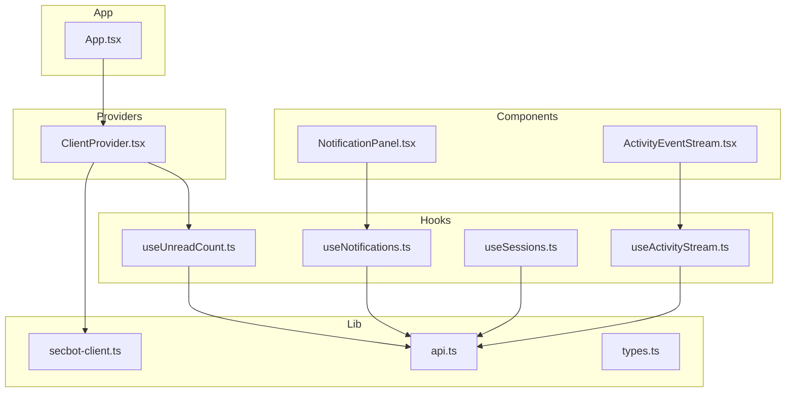
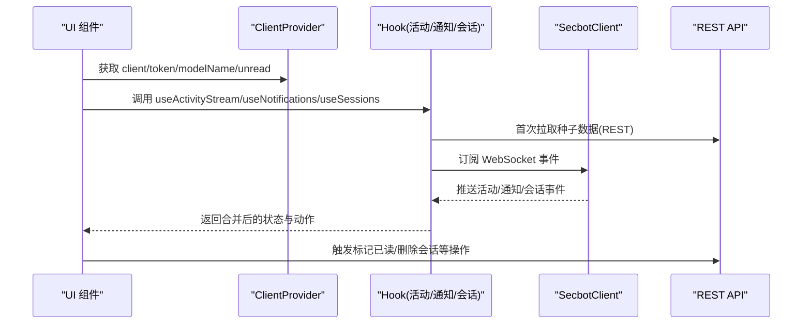
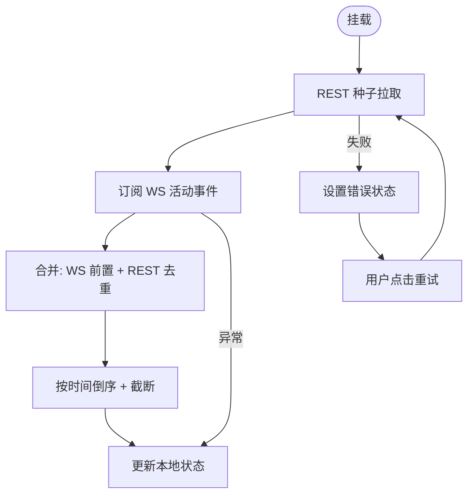
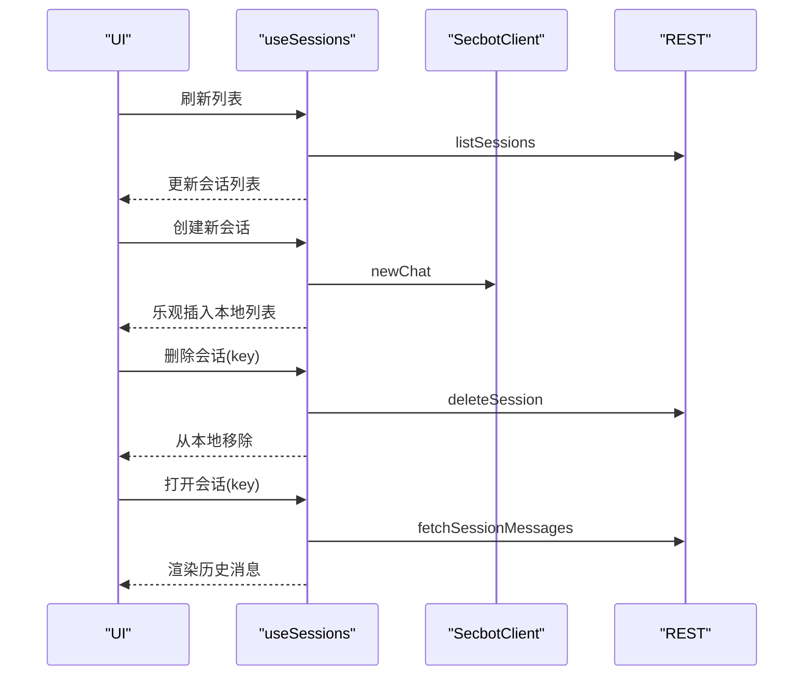
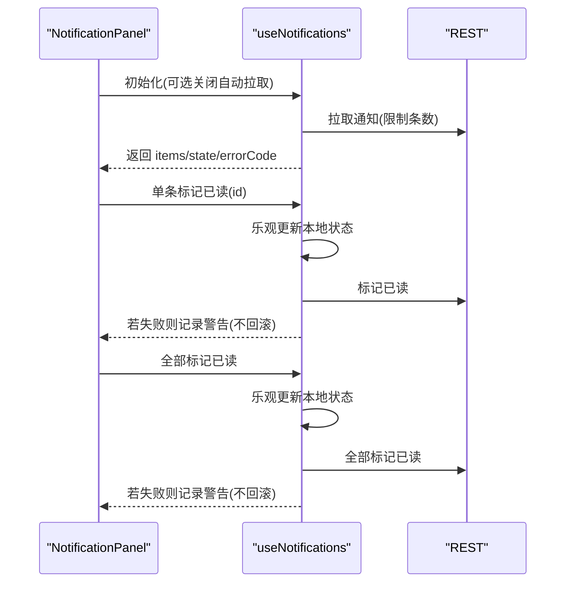
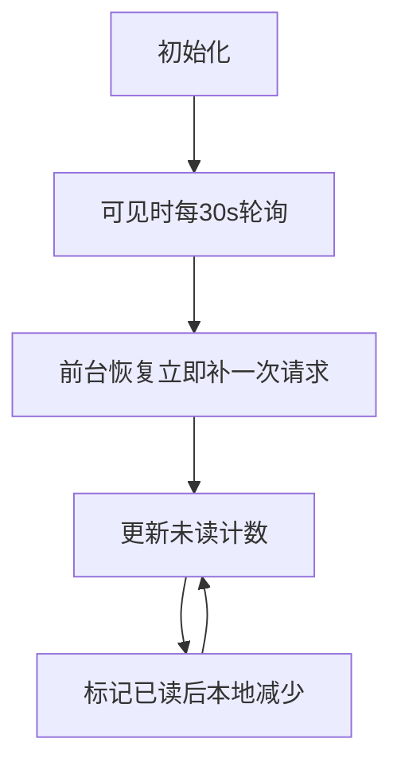
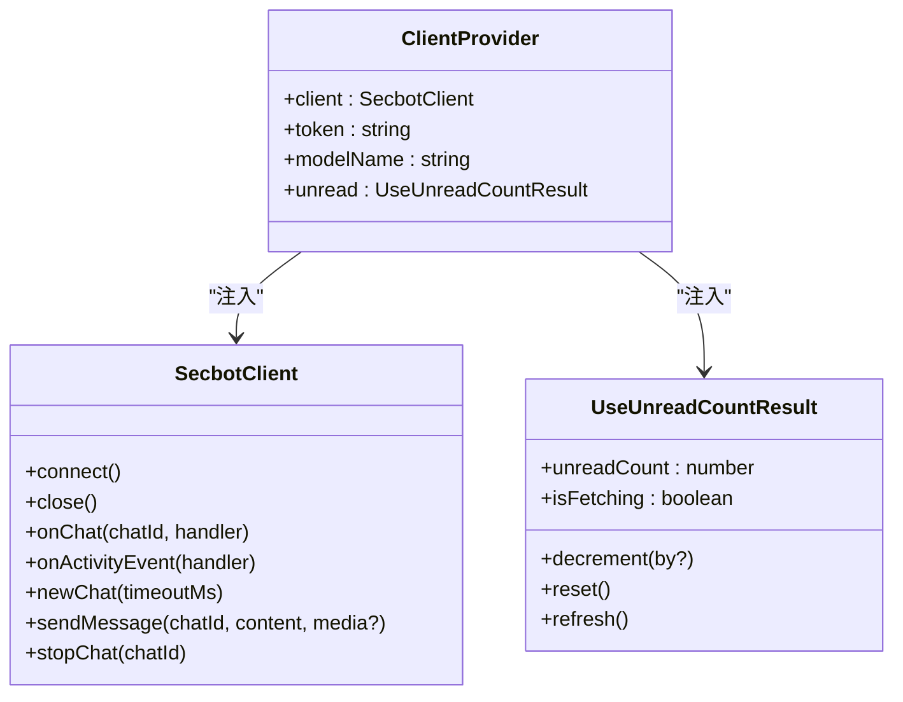
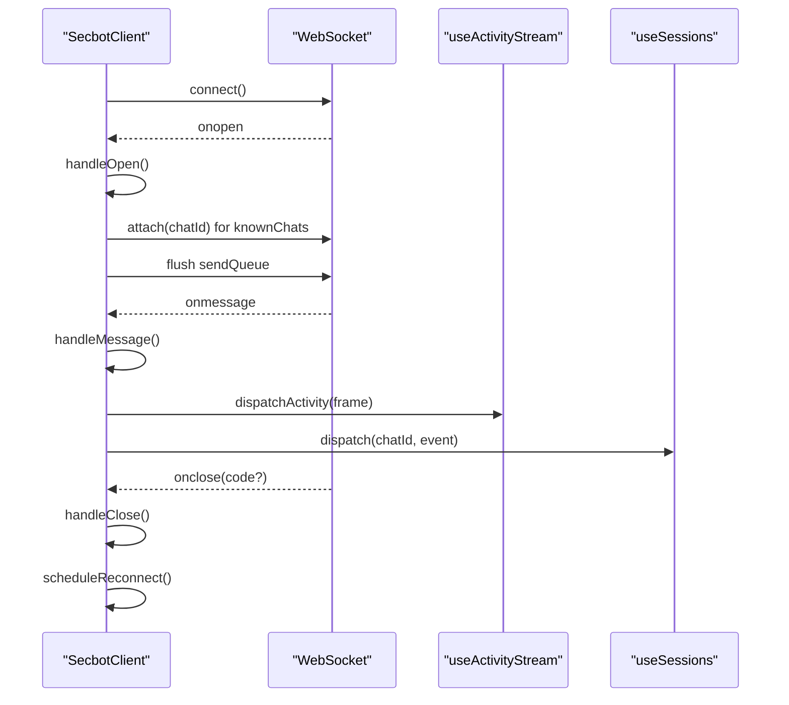
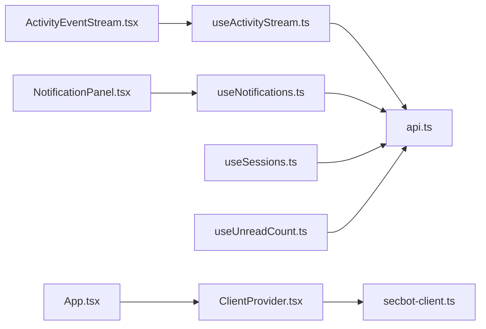

# 状态管理系统

<cite>
**本文档引用的文件**
- [useActivityStream.ts](file://webui/src/hooks/useActivityStream.ts)
- [useSessions.ts](file://webui/src/hooks/useSessions.ts)
- [useNotifications.ts](file://webui/src/hooks/useNotifications.ts)
- [useUnreadCount.ts](file://webui/src/hooks/useUnreadCount.ts)
- [ClientProvider.tsx](file://webui/src/providers/ClientProvider.tsx)
- [secbot-client.ts](file://webui/src/lib/secbot-client.ts)
- [api.ts](file://webui/src/lib/api.ts)
- [types.ts](file://webui/src/lib/types.ts)
- [App.tsx](file://webui/src/App.tsx)
- [ActivityEventStream.tsx](file://webui/src/components/ActivityEventStream.tsx)
- [NotificationPanel.tsx](file://webui/src/components/NotificationPanel.tsx)
- [useActivityStream.test.tsx](file://webui/src/tests/useActivityStream.test.tsx)
- [useNotifications.test.ts](file://webui/src/tests/useNotifications.test.ts)
- [useSessions.test.tsx](file://webui/src/tests/useSessions.test.tsx)
</cite>

## 目录
1. [简介](#简介)
2. [项目结构](#项目结构)
3. [核心组件](#核心组件)
4. [架构总览](#架构总览)
5. [详细组件分析](#详细组件分析)
6. [依赖关系分析](#依赖关系分析)
7. [性能考量](#性能考量)
8. [故障排查指南](#故障排查指南)
9. [结论](#结论)
10. [附录](#附录)

## 简介
本文件系统性梳理 VAPT3 的前端状态管理系统，重点覆盖以下方面：
- 自定义 Hook 设计与实现：useActivityStream 活动流钩子、useSessions 会话管理钩子、useNotifications 通知管理钩子、useUnreadCount 未读计数钩子
- 状态管理模式：本地状态管理、全局状态共享、WebSocket 状态同步
- ClientProvider 的作用与实现机制：客户端实例管理、状态提供者模式
- 状态持久化策略：本地存储、会话存储
- 最佳实践与性能优化建议
- 错误处理与状态恢复机制

## 项目结构
状态管理相关代码主要集中在 webui/src 下：
- hooks：自定义 Hook（useActivityStream、useSessions、useNotifications、useUnreadCount）
- providers：状态提供者（ClientProvider）
- lib：底层客户端与类型定义（SecbotClient、API 封装、类型声明）
- components：基于 Hook 的 UI 组件（ActivityEventStream、NotificationPanel）
- tests：对应 Hook 的单元测试

图表来源
- [useActivityStream.ts:1-198](file://webui/src/hooks/useActivityStream.ts#L1-L198)
- [useSessions.ts:1-314](file://webui/src/hooks/useSessions.ts#L1-L314)
- [useNotifications.ts:1-180](file://webui/src/hooks/useNotifications.ts#L1-L180)
- [useUnreadCount.ts:1-186](file://webui/src/hooks/useUnreadCount.ts#L1-L186)
- [ClientProvider.tsx:1-58](file://webui/src/providers/ClientProvider.tsx#L1-L58)
- [secbot-client.ts:1-377](file://webui/src/lib/secbot-client.ts#L1-L377)
- [api.ts:1-272](file://webui/src/lib/api.ts#L1-L272)
- [types.ts:1-306](file://webui/src/lib/types.ts#L1-L306)
- [ActivityEventStream.tsx:1-281](file://webui/src/components/ActivityEventStream.tsx#L1-L281)
- [NotificationPanel.tsx:1-215](file://webui/src/components/NotificationPanel.tsx#L1-L215)
- [App.tsx:1-233](file://webui/src/App.tsx#L1-L233)

章节来源
- [App.tsx:54-233](file://webui/src/App.tsx#L54-L233)
- [ClientProvider.tsx:24-58](file://webui/src/providers/ClientProvider.tsx#L24-L58)

## 核心组件
- useActivityStream：活动流 Hook，负责从 REST 和 WebSocket 同步活动事件，维护环形缓冲区并去重排序
- useSessions：会话列表与历史消息 Hook，支持会话创建、删除、懒加载历史消息
- useNotifications：通知面板 Hook，支持分页拉取、单条/批量标记已读、乐观更新
- useUnreadCount：未读计数 Hook，定时轮询后台未读数量，支持前台可见性恢复
- ClientProvider：状态提供者，注入 SecbotClient、令牌、模型名以及全局未读计数
- SecbotClient：WebSocket 客户端，多路复用聊天流，自动重连与重新订阅
- API 封装：统一的 REST 请求封装与错误类型
- 类型系统：统一的数据结构定义，确保 REST 与 WebSocket 数据形态一致

章节来源
- [useActivityStream.ts:139-198](file://webui/src/hooks/useActivityStream.ts#L139-L198)
- [useSessions.ts:124-203](file://webui/src/hooks/useSessions.ts#L124-L203)
- [useNotifications.ts:70-180](file://webui/src/hooks/useNotifications.ts#L70-L180)
- [useUnreadCount.ts:56-186](file://webui/src/hooks/useUnreadCount.ts#L56-L186)
- [ClientProvider.tsx:9-20](file://webui/src/providers/ClientProvider.tsx#L9-L20)
- [secbot-client.ts:59-377](file://webui/src/lib/secbot-client.ts#L59-L377)
- [api.ts:1-272](file://webui/src/lib/api.ts#L1-L272)
- [types.ts:1-306](file://webui/src/lib/types.ts#L1-L306)

## 架构总览
系统采用“Hook + Provider + WebSocket + REST”的组合架构：
- Provider 层：ClientProvider 注入 SecbotClient、令牌、模型名与全局未读计数
- Hook 层：各业务 Hook 负责具体状态的获取、缓存、去重与乐观更新
- 传输层：SecbotClient 通过 WebSocket 推送实时事件；REST 提供种子数据与变更操作
- UI 层：组件直接消费 Hook 返回的状态与动作，无需关心底层实现细节

图表来源
- [ClientProvider.tsx:24-58](file://webui/src/providers/ClientProvider.tsx#L24-L58)
- [useActivityStream.ts:139-198](file://webui/src/hooks/useActivityStream.ts#L139-L198)
- [useNotifications.ts:70-180](file://webui/src/hooks/useNotifications.ts#L70-L180)
- [useSessions.ts:124-203](file://webui/src/hooks/useSessions.ts#L124-L203)
- [secbot-client.ts:155-377](file://webui/src/lib/secbot-client.ts#L155-L377)
- [api.ts:19-272](file://webui/src/lib/api.ts#L19-L272)

## 详细组件分析

### useActivityStream 活动流钩子
- 功能要点
  - 首次加载通过 REST 拉取种子数据，默认限制条数与时间窗口
  - 订阅 WebSocket 的 activity_event 广播，转换为 UI 事件并前置插入
  - 去重与排序：按 id 去重（REST 覆盖 WS），按时间倒序，限制环形缓冲大小
  - WS 事件到 UI 事件映射：推断级别、归一化来源、生成稳定 id
  - 错误处理：网络错误与服务端错误区分，支持重试刷新
- 关键常量与配置
  - 环形缓冲上限、默认种子限制、已知来源集合
- 并发与竞态控制
  - 请求 id 递增、提交门禁，避免旧请求覆盖新结果
- 与 UI 的协作
  - ActivityEventStream 组件直接消费 Hook 返回的 events/state/errorCode/refresh

图表来源
- [useActivityStream.ts:139-198](file://webui/src/hooks/useActivityStream.ts#L139-L198)

章节来源
- [useActivityStream.ts:13-198](file://webui/src/hooks/useActivityStream.ts#L13-L198)
- [ActivityEventStream.tsx:236-281](file://webui/src/components/ActivityEventStream.tsx#L236-L281)

### useSessions 会话管理钩子
- 功能要点
  - 会话列表：拉取后保留尚未被服务器确认的乐观插入项
  - 会话创建：通过 SecbotClient 新建聊天，立即乐观插入本地列表
  - 会话删除：调用 REST 删除接口，成功后移除本地项
  - 历史消息懒加载：首次打开会话时按 key 拉取历史消息，重建 UI 消息结构
  - 工具调用与结果预览：从原始消息中重建 trace 行，支持图片/媒体附件
- 错误处理
  - 404 视为正常未持久化状态，不视为错误
  - 其他错误记录并返回给调用方
- 与 UI 的协作
  - 侧边栏与聊天界面消费 sessions/messages/loading/error

图表来源
- [useSessions.ts:124-314](file://webui/src/hooks/useSessions.ts#L124-L314)
- [api.ts:44-115](file://webui/src/lib/api.ts#L44-L115)

章节来源
- [useSessions.ts:124-314](file://webui/src/hooks/useSessions.ts#L124-L314)
- [useSessions.test.tsx:1-201](file://webui/src/tests/useSessions.test.tsx#L1-L201)

### useNotifications 通知管理钩子
- 功能要点
  - 面板加载：冷启动时拉取最新若干条通知，按服务端顺序（新到旧）
  - 乐观更新：单条/批量标记已读先本地更新，再异步同步服务端
  - 未读计数联动：通过回调通知全局未读计数减少或清零
  - 错误处理：区分网络错误与 HTTP 错误，支持重试刷新
- 竞态控制
  - 请求 id 递增与提交门禁，防止旧响应覆盖新状态
- 与 UI 的协作
  - NotificationPanel 组件消费 items/state/errorCode/refresh/markRead/markAllRead

图表来源
- [useNotifications.ts:70-180](file://webui/src/hooks/useNotifications.ts#L70-L180)
- [NotificationPanel.tsx:52-215](file://webui/src/components/NotificationPanel.tsx#L52-L215)

章节来源
- [useNotifications.ts:70-180](file://webui/src/hooks/useNotifications.ts#L70-L180)
- [useNotifications.test.ts:1-252](file://webui/src/tests/useNotifications.test.ts#L1-L252)

### useUnreadCount 未读计数钩子
- 功能要点
  - 可见标签轮询：可见时每 30 秒轮询一次，隐藏时停止轮询
  - 前台恢复：标签恢复可见时立即补一次请求
  - 乐观更新：标记已读后本地减少，避免闪烁
  - 多处复用：ClientProvider 内部仅挂载一次，避免重复流量
- 错误处理
  - 非 HTTP 错误静默，保持上次值，避免闪烁
- 与 Provider 的协作
  - ClientProvider 将未读计数作为上下文值，供导航栏等组件读取

图表来源
- [useUnreadCount.ts:56-186](file://webui/src/hooks/useUnreadCount.ts#L56-L186)
- [ClientProvider.tsx:35-42](file://webui/src/providers/ClientProvider.tsx#L35-L42)

章节来源
- [useUnreadCount.ts:56-186](file://webui/src/hooks/useUnreadCount.ts#L56-L186)
- [ClientProvider.tsx:35-42](file://webui/src/providers/ClientProvider.tsx#L35-L42)

### ClientProvider 作用与实现机制
- 作用
  - 在应用根部注入 SecbotClient、令牌、模型名与全局未读计数
  - 将未读计数作为单一实例提供，避免多个副本造成重复轮询
- 实现机制
  - 使用 React Context 传递值
  - 通过 useMemo 缓存上下文值，降低渲染抖动
  - 提供 useClient/useUnread 辅助访问器

图表来源
- [ClientProvider.tsx:9-20](file://webui/src/providers/ClientProvider.tsx#L9-L20)
- [secbot-client.ts:59-377](file://webui/src/lib/secbot-client.ts#L59-L377)
- [useUnreadCount.ts:18-32](file://webui/src/hooks/useUnreadCount.ts#L18-L32)

章节来源
- [ClientProvider.tsx:24-58](file://webui/src/providers/ClientProvider.tsx#L24-L58)
- [App.tsx:161-171](file://webui/src/App.tsx#L161-L171)

### SecbotClient WebSocket 客户端
- 设计目标
  - 单例 WebSocket，多聊天流复用
  - 自动重连、URL 切换、重新订阅
  - 事件分发：按 chat_id 分发到对应处理器，同时向全局活动处理器广播
- 关键能力
  - 连接生命周期管理：connect/close
  - 事件订阅：onChat/onActivityEvent/onStatus/onError
  - 发送队列：连接未就绪时缓存帧，就绪后批量发送
  - 传输错误：结构化错误（如消息过大）上报 UI
- 与 Hook 的协作
  - useActivityStream 通过 onActivityEvent 订阅全局活动事件
  - useSessions 通过 onChat 订阅特定会话事件

图表来源
- [secbot-client.ts:155-377](file://webui/src/lib/secbot-client.ts#L155-L377)
- [useActivityStream.ts:186-191](file://webui/src/hooks/useActivityStream.ts#L186-L191)
- [useSessions.ts:124-132](file://webui/src/hooks/useSessions.ts#L124-L132)

章节来源
- [secbot-client.ts:59-377](file://webui/src/lib/secbot-client.ts#L59-L377)

### API 封装与类型系统
- API 封装
  - 统一的 fetch 包装，自动附加 Bearer Token
  - 明确的 ApiError 类型，便于上层区分错误
  - REST 端点：会话列表/消息、通知列表/标记已读、活动事件等
- 类型系统
  - UIMessage/UIMediaAttachment/ChatSummary 等 UI 专用类型
  - InboundEvent/Outbound/ActivityEvent 等协议类型
  - Notification/ActivityEvent 等业务实体类型

章节来源
- [api.ts:1-272](file://webui/src/lib/api.ts#L1-L272)
- [types.ts:1-306](file://webui/src/lib/types.ts#L1-L306)

## 依赖关系分析
- 组件依赖
  - ActivityEventStream 依赖 useActivityStream
  - NotificationPanel 依赖 useNotifications
  - App 依赖 ClientProvider
- Hook 依赖
  - useActivityStream/useNotifications/useSessions 依赖 ClientProvider 提供的 client/token
  - useUnreadCount 由 ClientProvider 注入，供导航栏等组件读取
- 底层依赖
  - SecbotClient 依赖 WebSocket，API 封装依赖 fetch

图表来源
- [ActivityEventStream.tsx:13-238](file://webui/src/components/ActivityEventStream.tsx#L13-L238)
- [NotificationPanel.tsx:10-71](file://webui/src/components/NotificationPanel.tsx#L10-L71)
- [App.tsx:14-171](file://webui/src/App.tsx#L14-L171)
- [ClientProvider.tsx:1-58](file://webui/src/providers/ClientProvider.tsx#L1-L58)
- [secbot-client.ts:1-377](file://webui/src/lib/secbot-client.ts#L1-L377)
- [api.ts:1-272](file://webui/src/lib/api.ts#L1-L272)
- [useActivityStream.ts:1-198](file://webui/src/hooks/useActivityStream.ts#L1-L198)
- [useNotifications.ts:1-180](file://webui/src/hooks/useNotifications.ts#L1-L180)
- [useSessions.ts:1-314](file://webui/src/hooks/useSessions.ts#L1-L314)
- [useUnreadCount.ts:1-186](file://webui/src/hooks/useUnreadCount.ts#L1-L186)

章节来源
- [App.tsx:161-171](file://webui/src/App.tsx#L161-L171)
- [ClientProvider.tsx:24-58](file://webui/src/providers/ClientProvider.tsx#L24-L58)

## 性能考量
- 竞态与幂等
  - 请求 id 递增与提交门禁，避免旧响应覆盖新状态
  - WS 事件去重与排序，避免内存无限增长
- 轮询与可见性
  - 未读计数轮询仅在标签可见时进行，隐藏时停止，减少资源消耗
- 乐观更新
  - 通知标记已读/全部标记已读先本地更新，再异步同步，提升交互流畅度
- 数据截断
  - 活动流环形缓冲上限与通知面板显示上限，控制内存占用
- 重连与退避
  - WebSocket 自动重连，指数退避上限，避免风暴式重试

章节来源
- [useActivityStream.ts:13-198](file://webui/src/hooks/useActivityStream.ts#L13-L198)
- [useNotifications.ts:98-180](file://webui/src/hooks/useNotifications.ts#L98-L180)
- [useUnreadCount.ts:13-186](file://webui/src/hooks/useUnreadCount.ts#L13-L186)
- [secbot-client.ts:340-357](file://webui/src/lib/secbot-client.ts#L340-L357)

## 故障排查指南
- WebSocket 相关
  - 消息过大：浏览器关闭码 1009，SecbotClient 会抛出结构化错误，UI 可提示用户调整附件大小
  - 连接中断：自动重连，必要时触发 onReauth 刷新 URL 与令牌
- REST 相关
  - 401/403：通常表示未登录或令牌失效，App 层引导进入认证流程
  - 404：会话未持久化属于正常状态，不视为错误
  - 其他错误：统一包装为 ApiError，Hook 设置错误状态与错误码
- UI 交互
  - 重试按钮：活动流与通知面板均提供重试入口
  - 乐观更新失败：控制台警告，下次刷新会纠正

章节来源
- [secbot-client.ts:314-338](file://webui/src/lib/secbot-client.ts#L314-L338)
- [App.tsx:87-97](file://webui/src/App.tsx#L87-L97)
- [useActivityStream.ts:172-178](file://webui/src/hooks/useActivityStream.ts#L172-L178)
- [useNotifications.ts:143-164](file://webui/src/hooks/useNotifications.ts#L143-L164)

## 结论
VAPT3 的状态管理系统通过“Hook + Provider + WebSocket + REST”的组合实现了：
- 清晰的职责分离：Hook 负责状态与副作用，Provider 负责注入与共享，客户端负责传输
- 强健的容错与恢复：竞态控制、乐观更新、自动重连、错误分类
- 良好的性能与体验：轮询可见性控制、环形缓冲、指数退避、即时反馈
- 可测试性：完整的单元测试覆盖关键路径与边界条件

## 附录
- 状态持久化策略
  - 本地存储：保存共享密钥（用于自动登录），在 App 启动时加载
  - 会话存储：当前会话的 UI 状态（如展开/折叠）可在组件内自行持久化
  - REST 持久化：会话列表与历史消息、通知状态由后端持久化
- 最佳实践
  - 优先使用乐观更新，配合重试与回滚
  - 控制并发请求，使用请求 id 与提交门禁
  - 仅在必要时进行轮询，避免不必要的网络开销
  - 对未知来源与未知字段进行前向兼容处理，保证 F5 可用

章节来源
- [App.tsx:57-107](file://webui/src/App.tsx#L57-L107)
- [api.ts:1-272](file://webui/src/lib/api.ts#L1-L272)