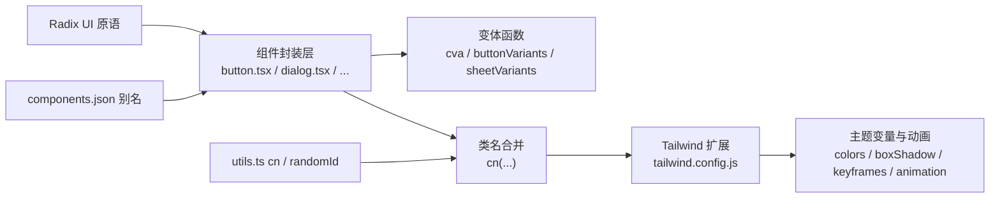
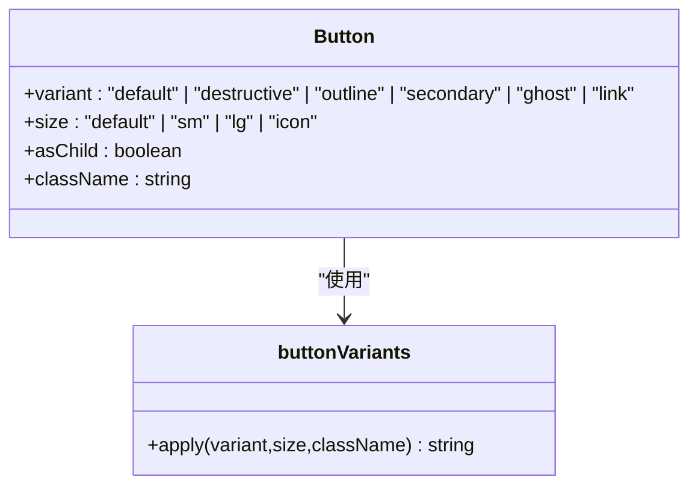
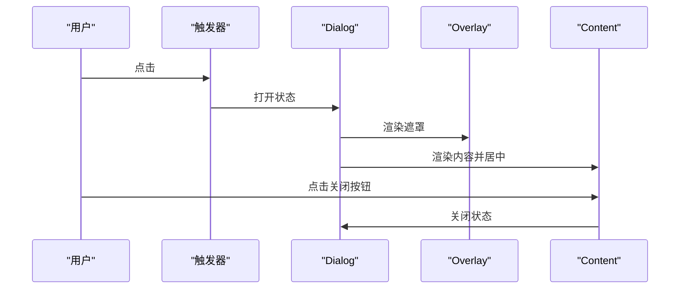
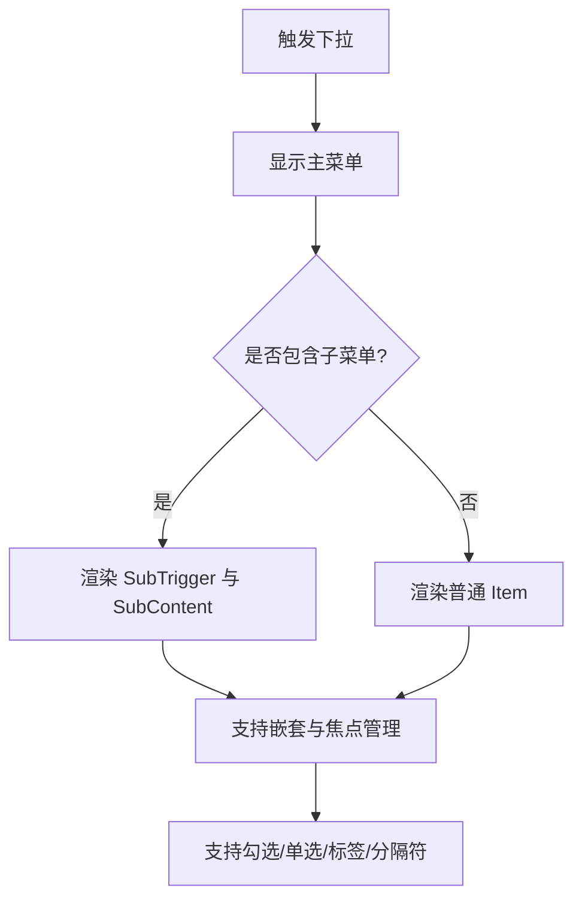
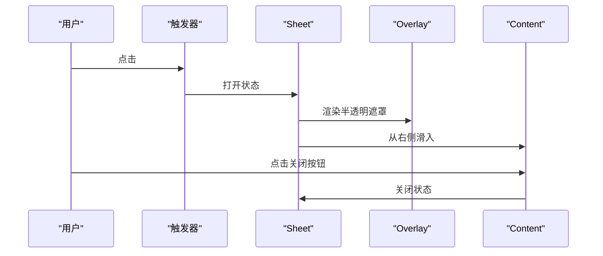
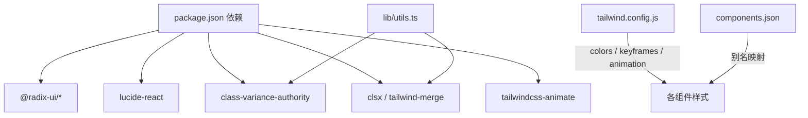

# UI基础组件库

<cite>
**本文引用的文件**
- [webui/src/components/ui/button.tsx](file://webui/src/components/ui/button.tsx)
- [webui/src/components/ui/dialog.tsx](file://webui/src/components/ui/dialog.tsx)
- [webui/src/components/ui/input.tsx](file://webui/src/components/ui/input.tsx)
- [webui/src/components/ui/textarea.tsx](file://webui/src/components/ui/textarea.tsx)
- [webui/src/components/ui/dropdown-menu.tsx](file://webui/src/components/ui/dropdown-menu.tsx)
- [webui/src/components/ui/alert-dialog.tsx](file://webui/src/components/ui/alert-dialog.tsx)
- [webui/src/components/ui/avatar.tsx](file://webui/src/components/ui/avatar.tsx)
- [webui/src/components/ui/scroll-area.tsx](file://webui/src/components/ui/scroll-area.tsx)
- [webui/src/components/ui/separator.tsx](file://webui/src/components/ui/separator.tsx)
- [webui/src/components/ui/sheet.tsx](file://webui/src/components/ui/sheet.tsx)
- [webui/src/components/ui/tooltip.tsx](file://webui/src/components/ui/tooltip.tsx)
- [webui/tailwind.config.js](file://webui/tailwind.config.js)
- [webui/components.json](file://webui/components.json)
- [webui/package.json](file://webui/package.json)
- [webui/src/lib/utils.ts](file://webui/src/lib/utils.ts)
</cite>

## 目录
1. [简介](#简介)
2. [项目结构](#项目结构)
3. [核心组件](#核心组件)
4. [架构总览](#架构总览)
5. [组件详解](#组件详解)
6. [依赖关系分析](#依赖关系分析)
7. [性能与可复用性](#性能与可复用性)
8. [可访问性与响应式设计](#可访问性与响应式设计)
9. [使用示例与最佳实践](#使用示例与最佳实践)
10. [故障排查指南](#故障排查指南)
11. [结论](#结论)

## 简介
本文件系统化梳理 VAPT3 WebUI 的基础组件库，基于 TailwindCSS 与 Shadcn/ui 风格实现，覆盖 button、dialog、input、textarea、dropdown-menu、alert-dialog、avatar、scroll-area、separator、sheet、tooltip 等常用 UI 组件。内容涵盖设计理念、Props 接口、样式定制、主题变体、交互行为、可访问性、响应式与动画、性能优化与可复用性原则，并提供表单验证、错误处理与用户反馈的最佳实践。

## 项目结构
组件位于 webui/src/components/ui 下，采用“按需引入 Radix UI 原语 + Tailwind 样式 + 变体函数”的统一风格；样式与主题变量由 Tailwind 配置集中管理；组件别名与路径在 components.json 中声明；工具函数 cn 用于合并类名。

```mermaid
graph TB
subgraph "WebUI 组件层"
BTN["button.tsx"]
DIALOG["dialog.tsx"]
INPUT["input.tsx"]
TEXTAREA["textarea.tsx"]
DROPDOWN["dropdown-menu.tsx"]
ALERT["alert-dialog.tsx"]
AVATAR["avatar.tsx"]
SCROLL["scroll-area.tsx"]
SEPARATOR["separator.tsx"]
SHEET["sheet.tsx"]
TOOLTIP["tooltip.tsx"]
end
subgraph "样式与主题"
TWCFG["tailwind.config.js"]
CMJSON["components.json"]
end
subgraph "运行时依赖"
PKG["package.json"]
UTILS["lib/utils.ts"]
end
BTN --> UTILS
DIALOG --> UTILS
INPUT --> UTILS
TEXTAREA --> UTILS
DROPDOWN --> UTILS
ALERT --> UTILS
AVATAR --> UTILS
SCROLL --> UTILS
SEPARATOR --> UTILS
SHEET --> UTILS
TOOLTIP --> UTILS
BTN --> TWCFG
DIALOG --> TWCFG
INPUT --> TWCFG
TEXTAREA --> TWCFG
DROPDOWN --> TWCFG
ALERT --> TWCFG
AVATAR --> TWCFG
SCROLL --> TWCFG
SEPARATOR --> TWCFG
SHEET --> TWCFG
TOOLTIP --> TWCFG
PKG --> |"Radix UI / Lucide / clsx / tailwind-merge"| UTILS
CMJSON --> |"组件别名与路径"| BTN
CMJSON --> |"组件别名与路径"| DIALOG
CMJSON --> |"组件别名与路径"| INPUT
CMJSON --> |"组件别名与路径"| TEXTAREA
CMJSON --> |"组件别名与路径"| DROPDOWN
CMJSON --> |"组件别名与路径"| ALERT
CMJSON --> |"组件别名与路径"| AVATAR
CMJSON --> |"组件别名与路径"| SCROLL
CMJSON --> |"组件别名与路径"| SEPARATOR
CMJSON --> |"组件别名与路径"| SHEET
CMJSON --> |"组件别名与路径"| TOOLTIP
```

图示来源
- [webui/src/components/ui/button.tsx](file://webui/src/components/ui/button.tsx)
- [webui/src/components/ui/dialog.tsx](file://webui/src/components/ui/dialog.tsx)
- [webui/src/components/ui/input.tsx](file://webui/src/components/ui/input.tsx)
- [webui/src/components/ui/textarea.tsx](file://webui/src/components/ui/textarea.tsx)
- [webui/src/components/ui/dropdown-menu.tsx](file://webui/src/components/ui/dropdown-menu.tsx)
- [webui/src/components/ui/alert-dialog.tsx](file://webui/src/components/ui/alert-dialog.tsx)
- [webui/src/components/ui/avatar.tsx](file://webui/src/components/ui/avatar.tsx)
- [webui/src/components/ui/scroll-area.tsx](file://webui/src/components/ui/scroll-area.tsx)
- [webui/src/components/ui/separator.tsx](file://webui/src/components/ui/separator.tsx)
- [webui/src/components/ui/sheet.tsx](file://webui/src/components/ui/sheet.tsx)
- [webui/src/components/ui/tooltip.tsx](file://webui/src/components/ui/tooltip.tsx)
- [webui/tailwind.config.js](file://webui/tailwind.config.js)
- [webui/components.json](file://webui/components.json)
- [webui/package.json](file://webui/package.json)
- [webui/src/lib/utils.ts](file://webui/src/lib/utils.ts)

章节来源
- [webui/src/components/ui/button.tsx](file://webui/src/components/ui/button.tsx)
- [webui/src/components/ui/dialog.tsx](file://webui/src/components/ui/dialog.tsx)
- [webui/src/components/ui/input.tsx](file://webui/src/components/ui/input.tsx)
- [webui/src/components/ui/textarea.tsx](file://webui/src/components/ui/textarea.tsx)
- [webui/src/components/ui/dropdown-menu.tsx](file://webui/src/components/ui/dropdown-menu.tsx)
- [webui/src/components/ui/alert-dialog.tsx](file://webui/src/components/ui/alert-dialog.tsx)
- [webui/src/components/ui/avatar.tsx](file://webui/src/components/ui/avatar.tsx)
- [webui/src/components/ui/scroll-area.tsx](file://webui/src/components/ui/scroll-area.tsx)
- [webui/src/components/ui/separator.tsx](file://webui/src/components/ui/separator.tsx)
- [webui/src/components/ui/sheet.tsx](file://webui/src/components/ui/sheet.tsx)
- [webui/src/components/ui/tooltip.tsx](file://webui/src/components/ui/tooltip.tsx)
- [webui/tailwind.config.js](file://webui/tailwind.config.js)
- [webui/components.json](file://webui/components.json)
- [webui/package.json](file://webui/package.json)
- [webui/src/lib/utils.ts](file://webui/src/lib/utils.ts)

## 核心组件
- 按钮 Button：支持多种变体与尺寸，可透传原生按钮属性，支持作为子节点容器渲染。
- 对话框 Dialog：根组件、触发器、遮罩、内容区、标题、描述、页脚等组合使用。
- 输入 Input：基础输入框，支持类型与受控/非受控模式。
- 文本域 Textarea：多行文本输入，支持聚焦态与禁用态。
- 下拉菜单 DropdownMenu：支持分组、子菜单、勾选项、单选项、标签与分隔符。
- 警告对话框 AlertDialog：强调危险操作，内置动作与取消按钮。
- 头像 Avatar：头像容器、图片与占位回退。
- 滚动区域 ScrollArea：自定义滚动条，支持水平/垂直方向。
- 分隔线 Separator：支持水平/垂直方向。
- 幻灯窗 Sheet：从侧边滑入的面板，支持关闭按钮开关。
- 工具提示 Tooltip：提供轻量提示，支持 Provider 包裹。

章节来源
- [webui/src/components/ui/button.tsx](file://webui/src/components/ui/button.tsx)
- [webui/src/components/ui/dialog.tsx](file://webui/src/components/ui/dialog.tsx)
- [webui/src/components/ui/input.tsx](file://webui/src/components/ui/input.tsx)
- [webui/src/components/ui/textarea.tsx](file://webui/src/components/ui/textarea.tsx)
- [webui/src/components/ui/dropdown-menu.tsx](file://webui/src/components/ui/dropdown-menu.tsx)
- [webui/src/components/ui/alert-dialog.tsx](file://webui/src/components/ui/alert-dialog.tsx)
- [webui/src/components/ui/avatar.tsx](file://webui/src/components/ui/avatar.tsx)
- [webui/src/components/ui/scroll-area.tsx](file://webui/src/components/ui/scroll-area.tsx)
- [webui/src/components/ui/separator.tsx](file://webui/src/components/ui/separator.tsx)
- [webui/src/components/ui/sheet.tsx](file://webui/src/components/ui/sheet.tsx)
- [webui/src/components/ui/tooltip.tsx](file://webui/src/components/ui/tooltip.tsx)

## 架构总览
组件遵循“原语封装 + 变体函数 + 类名合并”的统一模式：
- 使用 Radix UI 原语保证可访问性与状态驱动；
- 使用 class-variance-authority 定义变体（如 Button 的 variant/size）；
- 使用 cn 合并与去重 Tailwind 类，避免冲突；
- 主题色板、圆角、阴影、动画等通过 Tailwind 配置集中扩展；
- 组件别名与路径在 components.json 中统一声明，便于后续脚手架生成与维护。

图示来源
- [webui/src/components/ui/button.tsx](file://webui/src/components/ui/button.tsx)
- [webui/src/components/ui/dialog.tsx](file://webui/src/components/ui/dialog.tsx)
- [webui/src/components/ui/sheet.tsx](file://webui/src/components/ui/sheet.tsx)
- [webui/tailwind.config.js](file://webui/tailwind.config.js)
- [webui/components.json](file://webui/components.json)
- [webui/src/lib/utils.ts](file://webui/src/lib/utils.ts)

## 组件详解

### Button（按钮）
- 设计理念
  - 以变体函数定义多种视觉与尺寸形态，支持 asChild 透传为任意元素，提升组合灵活性。
- Props 接口
  - 继承原生按钮属性，新增 variant、size、asChild。
- 样式与主题
  - 通过变体函数生成不同前景/背景/悬停/禁用态，结合焦点环与过渡动画。
- 交互行为
  - 支持聚焦可见轮廓、禁用态不可交互、点击事件透传。
- 最佳实践
  - 优先使用变体表达语义（如 destructive 表达危险操作），避免直接写死样式。

图示来源
- [webui/src/components/ui/button.tsx](file://webui/src/components/ui/button.tsx)

章节来源
- [webui/src/components/ui/button.tsx](file://webui/src/components/ui/button.tsx)

### Dialog（对话框）
- 设计理念
  - 以 Portal 渲染遮罩与内容，居中展示，支持关闭按钮与无障碍标签。
- 组成部分
  - Root、Trigger、Portal、Overlay、Content、Header、Footer、Title、Description、Close。
- 交互行为
  - 打开/关闭状态驱动动画（淡入/淡出、缩放），支持 ESC 关闭。
- 最佳实践
  - 内容区建议包含 Header/Title/Description/Footer 的清晰结构，确保键盘可达。

图示来源
- [webui/src/components/ui/dialog.tsx](file://webui/src/components/ui/dialog.tsx)

章节来源
- [webui/src/components/ui/dialog.tsx](file://webui/src/components/ui/dialog.tsx)

### Input（输入框）
- 设计理念
  - 简洁一致的边框、内边距与聚焦态，支持 placeholder 与禁用态。
- Props 接口
  - 继承原生 input 属性，新增类型与 className。
- 最佳实践
  - 与 Form/Field 组件配合，提供错误提示与校验反馈。

章节来源
- [webui/src/components/ui/input.tsx](file://webui/src/components/ui/input.tsx)

### Textarea（文本域）
- 设计理念
  - 自适应高度场景下的最小高度约束，保持一致的边框与聚焦态。
- Props 接口
  - 继承原生 textarea 属性，新增 className。
- 最佳实践
  - 与自动增长库或受控值配合，实现动态高度与字符计数。

章节来源
- [webui/src/components/ui/textarea.tsx](file://webui/src/components/ui/textarea.tsx)

### DropdownMenu（下拉菜单）
- 设计理念
  - 支持主菜单、子菜单、分组、勾选/单选项、标签与分隔符，统一的动画与焦点管理。
- 组成部分
  - Root、Trigger、Group、Portal、Sub、RadioGroup、SubTrigger、SubContent、Item、CheckboxItem、RadioItem、Label、Separator。
- 交互行为
  - 子菜单展开/收起，支持键盘导航与焦点返回。
- 最佳实践
  - 使用 inset 参数控制层级缩进，合理组织分组与分隔符。

图示来源
- [webui/src/components/ui/dropdown-menu.tsx](file://webui/src/components/ui/dropdown-menu.tsx)

章节来源
- [webui/src/components/ui/dropdown-menu.tsx](file://webui/src/components/ui/dropdown-menu.tsx)

### AlertDialog（警告对话框）
- 设计理念
  - 强调危险操作，内置 Action 与 Cancel 按钮，继承 Button 的变体能力。
- 组成部分
  - Root、Trigger、Portal、Overlay、Content、Header、Footer、Title、Description、Action、Cancel。
- 交互行为
  - 动画进入/退出，ESC 关闭，Action 与 Cancel 语义明确。
- 最佳实践
  - 在执行删除、清空、注销等高风险操作前使用，提供二次确认文案与撤销入口。

章节来源
- [webui/src/components/ui/alert-dialog.tsx](file://webui/src/components/ui/alert-dialog.tsx)

### Avatar（头像）
- 设计理念
  - 容器、图片与回退文本三段式，确保无图时仍可显示占位信息。
- 组成部分
  - Root、Image、Fallback。
- 最佳实践
  - 为图片设置合适的尺寸与裁剪策略，回退文本使用首字母或占位图标。

章节来源
- [webui/src/components/ui/avatar.tsx](file://webui/src/components/ui/avatar.tsx)

### ScrollArea（滚动区域）
- 设计理念
  - 将原生滚动替换为可控的滚动条，支持水平/垂直方向，隐藏角落。
- 组成部分
  - Root、Viewport、ScrollAreaScrollbar、ScrollAreaThumb、Corner。
- 最佳实践
  - 在需要统一滚动体验的面板中使用，避免浏览器默认滚动条样式差异。

章节来源
- [webui/src/components/ui/scroll-area.tsx](file://webui/src/components/ui/scroll-area.tsx)

### Separator（分隔线）
- 设计理念
  - 以原语为基础，支持水平/垂直方向与装饰性标记。
- 最佳实践
  - 用于列表、卡片、布局分区的视觉分隔，避免过度使用造成信息噪音。

章节来源
- [webui/src/components/ui/separator.tsx](file://webui/src/components/ui/separator.tsx)

### Sheet（幻灯窗）
- 设计理念
  - 从侧边滑入的抽屉式面板，支持 top/bottom/left/right 四个方向，可选择是否显示关闭按钮。
- 组成部分
  - Root、Trigger、Close、Portal、Overlay、Content、Header、Title。
- 交互行为
  - 基于侧向滑入动画，Overlay 点击与 ESC 可关闭。
- 最佳实践
  - 适合移动端或窄屏场景下的设置面板、筛选器、侧栏导航。

图示来源
- [webui/src/components/ui/sheet.tsx](file://webui/src/components/ui/sheet.tsx)

章节来源
- [webui/src/components/ui/sheet.tsx](file://webui/src/components/ui/sheet.tsx)

### Tooltip（工具提示）
- 设计理念
  - 提供轻量提示，支持 Provider 包裹与内容定位偏移。
- 组成部分
  - Provider、Root、Trigger、Content。
- 最佳实践
  - 仅用于简短说明，避免长篇文字；对可点击元素使用悬浮提示时注意与点击事件的协调。

章节来源
- [webui/src/components/ui/tooltip.tsx](file://webui/src/components/ui/tooltip.tsx)

## 依赖关系分析
- 运行时依赖
  - @radix-ui/*：可访问性与状态驱动的核心原语；
  - lucide-react：图标库；
  - class-variance-authority：变体函数；
  - clsx / tailwind-merge：类名合并与冲突消除；
  - tailwindcss-animate：动画辅助插件。
- 组件别名
  - components.json 中定义了 components、ui、lib、hooks 等别名，统一导入路径。

图示来源
- [webui/package.json](file://webui/package.json)
- [webui/src/lib/utils.ts](file://webui/src/lib/utils.ts)
- [webui/tailwind.config.js](file://webui/tailwind.config.js)
- [webui/components.json](file://webui/components.json)

章节来源
- [webui/package.json](file://webui/package.json)
- [webui/src/lib/utils.ts](file://webui/src/lib/utils.ts)
- [webui/tailwind.config.js](file://webui/tailwind.config.js)
- [webui/components.json](file://webui/components.json)

## 性能与可复用性
- 性能优化
  - 使用 Portal 将 Overlay/Content 渲染到根节点，减少 DOM 层级与重排；
  - 通过变体函数与 cn 合并类名，避免重复样式与冲突；
  - 动画使用 CSS 过渡与预设 keyframes，降低 JS 计算负担；
  - 滚动区域自定义滚动条，避免浏览器默认滚动条样式差异带来的重绘。
- 可复用性设计
  - 统一的 Props 接口与 className 扩展点，便于在业务组件中复用；
  - 组件别名与路径集中配置，利于团队协作与脚手架生成；
  - 以原语为基础，保持可访问性与键盘导航一致性。

[本节为通用指导，不直接分析具体文件，故无章节来源]

## 可访问性与响应式设计
- 可访问性
  - 所有交互组件均基于 Radix UI 原语，具备焦点管理、键盘导航与屏幕阅读器友好标签；
  - 对话框与幻灯窗提供关闭按钮的可读性文本（sr-only）；
  - 下拉菜单支持子菜单与焦点返回，避免焦点丢失。
- 响应式设计
  - Tailwind 配置提供 sm: 及以上断点的适配，组件内部使用 sm: 前缀类实现移动端优化；
  - 幻灯窗 Content 在小屏限制宽度，确保内容可读性；
  - 滚动区域在窄屏下仍保持一致的滚动体验。

章节来源
- [webui/src/components/ui/dialog.tsx](file://webui/src/components/ui/dialog.tsx)
- [webui/src/components/ui/sheet.tsx](file://webui/src/components/ui/sheet.tsx)
- [webui/src/components/ui/dropdown-menu.tsx](file://webui/src/components/ui/dropdown-menu.tsx)
- [webui/tailwind.config.js](file://webui/tailwind.config.js)

## 使用示例与最佳实践
- 表单验证与错误处理
  - Input/Textarea 与 Form 字段组合，使用状态类名（如错误态）与 aria-* 属性；
  - 在提交前进行必填/格式校验，失败时聚焦到首个错误字段并显示提示。
- 用户反馈
  - 使用 Button 的 destructive 变体标识危险操作，配合 AlertDialog 进行二次确认；
  - Tooltip 用于简短说明，避免长文本；Avatar 回退文本用于无头像场景。
- 动画与过渡
  - 对话框与幻灯窗使用内置动画类，避免自定义复杂动画导致性能问题；
  - 滚动区域滚动条采用过渡与颜色变量，提升交互质感。

[本节为通用指导，不直接分析具体文件，故无章节来源]

## 故障排查指南
- 类名冲突或样式异常
  - 检查 cn 合并顺序与 Tailwind 配置中的颜色/圆角/阴影变量；
  - 确认 components.json 别名与实际导入路径一致。
- 动画不生效
  - 确认 tailwind.config.js 中已启用 tailwindcss-animate 插件；
  - 检查数据状态类（如 data-state）是否正确传递给动画钩子。
- 可访问性问题
  - 确保对话框/幻灯窗内容区包含标题与描述；
  - 下拉菜单子项使用正确的 role 与状态属性。

章节来源
- [webui/src/lib/utils.ts](file://webui/src/lib/utils.ts)
- [webui/tailwind.config.js](file://webui/tailwind.config.js)
- [webui/components.json](file://webui/components.json)

## 结论
该组件库以 Radix UI 为核心，结合 TailwindCSS 与变体函数，实现了高可访问性、强一致性与良好性能的基础 UI 能力。通过统一的别名与配置，组件易于扩展与复用；在表单、对话框、菜单、滚动与提示等常见场景下提供了清晰的使用范式与最佳实践。建议在新功能开发中优先复用现有组件，必要时在保持一致性的前提下进行局部定制。