# 专用功能组件

<cite>
**本文引用的文件**
- [MessageBubble.tsx](file://webui/src/components/MessageBubble.tsx)
- [MessageList.tsx](file://webui/src/components/MessageList.tsx)
- [Composer.tsx](file://webui/src/components/Composer.tsx)
- [CodeBlock.tsx](file://webui/src/components/CodeBlock.tsx)
- [MarkdownText.tsx](file://webui/src/components/MarkdownText.tsx)
- [MarkdownTextRenderer.tsx](file://webui/src/components/MarkdownTextRenderer.tsx)
- [ImageLightbox.tsx](file://webui/src/components/ImageLightbox.tsx)
- [NotificationPanel.tsx](file://webui/src/components/NotificationPanel.tsx)
- [TaskStatusBadge.tsx](file://webui/src/components/TaskStatusBadge.tsx)
- [ConnectionBadge.tsx](file://webui/src/components/ConnectionBadge.tsx)
- [DeleteConfirm.tsx](file://webui/src/components/DeleteConfirm.tsx)
- [EmptyState.tsx](file://webui/src/components/EmptyState.tsx)
- [ErrorBoundary.tsx](file://webui/src/components/ErrorBoundary.tsx)
- [LanguageSwitcher.tsx](file://webui/src/components/LanguageSwitcher.tsx)
- [PromptSuggestions.tsx](file://webui/src/components/PromptSuggestions.tsx)
- [ProtectedRoute.tsx](file://webui/src/components/ProtectedRoute.tsx)
- [AuthForm.tsx](file://webui/src/components/AuthForm.tsx)
- [ActivityEventStream.tsx](file://webui/src/components/ActivityEventStream.tsx)
- [SettingsView.tsx](file://webui/src/components/settings/SettingsView.tsx)
</cite>

## 目录
1. [简介](#简介)
2. [项目结构](#项目结构)
3. [核心组件](#核心组件)
4. [架构总览](#架构总览)
5. [详细组件分析](#详细组件分析)
6. [依赖关系分析](#依赖关系分析)
7. [性能考量](#性能考量)
8. [故障排查指南](#故障排查指南)
9. [结论](#结论)
10. [附录](#附录)

## 简介
本文件面向 VAPT3 的专用功能组件，围绕消息渲染、富文本与代码高亮、媒体预览、通知与状态展示、认证与受保护路由、实时事件流以及设置管理等关键 UI 组件进行系统化技术说明。内容涵盖渲染逻辑、样式定制、交互流程、性能优化策略与可维护性设计，并提供可视化图示帮助理解组件间协作。

## 项目结构
这些组件主要位于 webui/src/components 及其子目录下，采用按功能域分层组织：消息类（MessageBubble、MessageList）、编辑与输入（Composer）、富文本与代码（MarkdownText、MarkdownTextRenderer、CodeBlock）、媒体与灯箱（ImageLightbox）、通知与状态（NotificationPanel、TaskStatusBadge、ConnectionBadge）、确认与空态（DeleteConfirm、EmptyState）、安全与路由（ProtectedRoute、AuthForm）、实时事件（ActivityEventStream）、设置视图（SettingsView）以及国际化语言切换（LanguageSwitcher）。组件之间通过 props、自定义事件与共享状态钩子（如 useNotifications、useActivityStream、ClientProvider）协同工作。

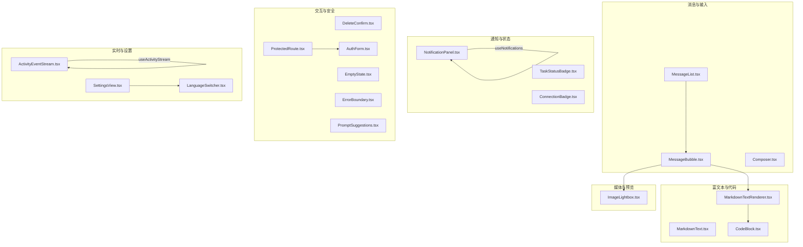
```mermaid
graph TB
subgraph "消息与输入"
MB["MessageBubble.tsx"]
ML["MessageList.tsx"]
C["Composer.tsx"]
end
subgraph "富文本与代码"
MT["MarkdownText.tsx"]
MTR["MarkdownTextRenderer.tsx"]
CB["CodeBlock.tsx"]
end
subgraph "媒体与预览"
ILB["ImageLightbox.tsx"]
end
subgraph "通知与状态"
NP["NotificationPanel.tsx"]
TSB["TaskStatusBadge.tsx"]
CBg["ConnectionBadge.tsx"]
end
subgraph "交互与安全"
DC["DeleteConfirm.tsx"]
ES["EmptyState.tsx"]
EB["ErrorBoundary.tsx"]
PS["PromptSuggestions.tsx"]
PR["ProtectedRoute.tsx"]
AF["AuthForm.tsx"]
end
subgraph "实时与设置"
AES["ActivityEventStream.tsx"]
SV["SettingsView.tsx"]
LS["LanguageSwitcher.tsx"]
end
ML --> MB
MB --> MTR
MTR --> CB
MB --> ILB
NP --> |"useNotifications"| NP
AES --> |"useActivityStream"| AES
PR --> AF
SV --> LS
```

图表来源
- [MessageBubble.tsx:1-444](file://webui/src/components/MessageBubble.tsx#L1-L444)
- [MessageList.tsx:1-110](file://webui/src/components/MessageList.tsx#L1-L110)
- [Composer.tsx:1-125](file://webui/src/components/Composer.tsx#L1-L125)
- [MarkdownText.tsx:1-24](file://webui/src/components/MarkdownText.tsx#L1-L24)
- [MarkdownTextRenderer.tsx:1-88](file://webui/src/components/MarkdownTextRenderer.tsx#L1-L88)
- [CodeBlock.tsx:1-106](file://webui/src/components/CodeBlock.tsx#L1-L106)
- [ImageLightbox.tsx:1-200](file://webui/src/components/ImageLightbox.tsx#L1-L200)
- [NotificationPanel.tsx:1-215](file://webui/src/components/NotificationPanel.tsx#L1-L215)
- [TaskStatusBadge.tsx:1-62](file://webui/src/components/TaskStatusBadge.tsx#L1-L62)
- [ConnectionBadge.tsx:1-57](file://webui/src/components/ConnectionBadge.tsx#L1-L57)
- [DeleteConfirm.tsx:1-53](file://webui/src/components/DeleteConfirm.tsx#L1-L53)
- [EmptyState.tsx:1-27](file://webui/src/components/EmptyState.tsx#L1-L27)
- [ErrorBoundary.tsx:1-73](file://webui/src/components/ErrorBoundary.tsx#L1-L73)
- [PromptSuggestions.tsx:1-309](file://webui/src/components/PromptSuggestions.tsx#L1-L309)
- [ProtectedRoute.tsx:1-62](file://webui/src/components/ProtectedRoute.tsx#L1-L62)
- [AuthForm.tsx:1-81](file://webui/src/components/AuthForm.tsx#L1-L81)
- [ActivityEventStream.tsx:1-281](file://webui/src/components/ActivityEventStream.tsx#L1-L281)
- [SettingsView.tsx:1-606](file://webui/src/components/settings/SettingsView.tsx#L1-L606)
- [LanguageSwitcher.tsx:1-68](file://webui/src/components/LanguageSwitcher.tsx#L1-L68)

章节来源
- [MessageBubble.tsx:1-444](file://webui/src/components/MessageBubble.tsx#L1-L444)
- [MessageList.tsx:1-110](file://webui/src/components/MessageList.tsx#L1-L110)
- [Composer.tsx:1-125](file://webui/src/components/Composer.tsx#L1-L125)
- [MarkdownText.tsx:1-24](file://webui/src/components/MarkdownText.tsx#L1-L24)
- [MarkdownTextRenderer.tsx:1-88](file://webui/src/components/MarkdownTextRenderer.tsx#L1-L88)
- [CodeBlock.tsx:1-106](file://webui/src/components/CodeBlock.tsx#L1-L106)
- [ImageLightbox.tsx:1-200](file://webui/src/components/ImageLightbox.tsx#L1-L200)
- [NotificationPanel.tsx:1-215](file://webui/src/components/NotificationPanel.tsx#L1-L215)
- [TaskStatusBadge.tsx:1-62](file://webui/src/components/TaskStatusBadge.tsx#L1-L62)
- [ConnectionBadge.tsx:1-57](file://webui/src/components/ConnectionBadge.tsx#L1-L57)
- [DeleteConfirm.tsx:1-53](file://webui/src/components/DeleteConfirm.tsx#L1-L53)
- [EmptyState.tsx:1-27](file://webui/src/components/EmptyState.tsx#L1-L27)
- [ErrorBoundary.tsx:1-73](file://webui/src/components/ErrorBoundary.tsx#L1-L73)
- [PromptSuggestions.tsx:1-309](file://webui/src/components/PromptSuggestions.tsx#L1-L309)
- [ProtectedRoute.tsx:1-62](file://webui/src/components/ProtectedRoute.tsx#L1-L62)
- [AuthForm.tsx:1-81](file://webui/src/components/AuthForm.tsx#L1-L81)
- [ActivityEventStream.tsx:1-281](file://webui/src/components/ActivityEventStream.tsx#L1-L281)
- [SettingsView.tsx:1-606](file://webui/src/components/settings/SettingsView.tsx#L1-L606)
- [LanguageSwitcher.tsx:1-68](file://webui/src/components/LanguageSwitcher.tsx#L1-L68)

## 核心组件
- 消息渲染与交互：MessageBubble 负责单条消息的渲染、复制、工具调用轨迹展开、媒体与图片附件展示；MessageList 提供自动贴底滚动、近底部检测与“回到底部”按钮。
- 富文本与代码高亮：MarkdownText 作为入口，MarkdownTextRenderer 使用 react-markdown、remark-gfm、remark-math、rehype-katex 渲染，CodeBlock 集成 react-syntax-highlighter 并支持复制与深色/浅色主题切换。
- 媒体与预览：ImageLightbox 提供全屏图片浏览、键盘导航、相邻图片预解码、GPU 合成层与无障碍支持。
- 通知与状态：NotificationPanel 管理通知列表、未读计数、标记已读、错误与加载态；TaskStatusBadge/ConnectionBadge 分别用于任务状态与连接状态的语义化展示。
- 安全与路由：ProtectedRoute 与 AuthForm 实现基于引导状态的受保护路由与认证表单；ErrorBoundary 提供顶层错误捕获与恢复。
- 实时与设置：ActivityEventStream 展示实时事件流并支持刷新；SettingsView 管理模型、提供商、Base URL、API Key 与语言设置，包含保存、模型拉取与错误提示。

章节来源
- [MessageBubble.tsx:1-135](file://webui/src/components/MessageBubble.tsx#L1-L135)
- [MessageList.tsx:1-110](file://webui/src/components/MessageList.tsx#L1-L110)
- [MarkdownText.tsx:1-24](file://webui/src/components/MarkdownText.tsx#L1-L24)
- [MarkdownTextRenderer.tsx:1-88](file://webui/src/components/MarkdownTextRenderer.tsx#L1-L88)
- [CodeBlock.tsx:1-106](file://webui/src/components/CodeBlock.tsx#L1-L106)
- [ImageLightbox.tsx:1-200](file://webui/src/components/ImageLightbox.tsx#L1-L200)
- [NotificationPanel.tsx:1-215](file://webui/src/components/NotificationPanel.tsx#L1-L215)
- [TaskStatusBadge.tsx:1-62](file://webui/src/components/TaskStatusBadge.tsx#L1-L62)
- [ConnectionBadge.tsx:1-57](file://webui/src/components/ConnectionBadge.tsx#L1-L57)
- [ProtectedRoute.tsx:1-62](file://webui/src/components/ProtectedRoute.tsx#L1-L62)
- [AuthForm.tsx:1-81](file://webui/src/components/AuthForm.tsx#L1-L81)
- [ActivityEventStream.tsx:1-281](file://webui/src/components/ActivityEventStream.tsx#L1-L281)
- [SettingsView.tsx:1-606](file://webui/src/components/settings/SettingsView.tsx#L1-L606)

## 架构总览
以下序列图展示了从 Composer 输入到 MessageList 渲染、Markdown 解析与 CodeBlock 高亮的整体流程，以及 ImageLightbox 的触发路径。

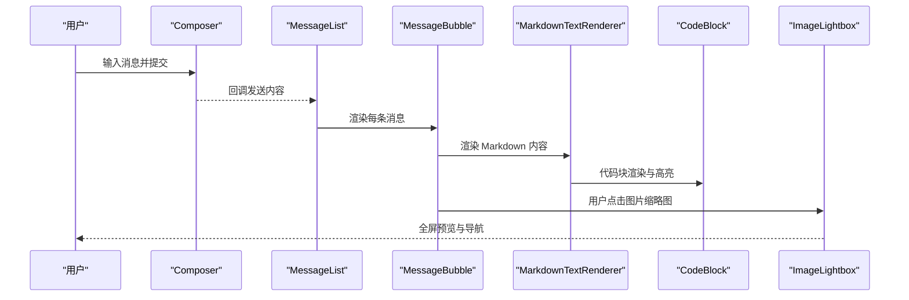
```mermaid
sequenceDiagram
participant U as "用户"
participant Com as "Composer"
participant Msg as "MessageList"
participant Bubble as "MessageBubble"
participant MD as "MarkdownTextRenderer"
participant CB as "CodeBlock"
participant LB as "ImageLightbox"
U->>Com : 输入消息并提交
Com-->>Msg : 回调发送内容
Msg->>Bubble : 渲染每条消息
Bubble->>MD : 渲染 Markdown 内容
MD->>CB : 代码块渲染与高亮
Bubble->>LB : 用户点击图片缩略图
LB-->>U : 全屏预览与导航
```

图表来源
- [Composer.tsx:1-125](file://webui/src/components/Composer.tsx#L1-L125)
- [MessageList.tsx:1-110](file://webui/src/components/MessageList.tsx#L1-L110)
- [MessageBubble.tsx:1-135](file://webui/src/components/MessageBubble.tsx#L1-L135)
- [MarkdownTextRenderer.tsx:1-88](file://webui/src/components/MarkdownTextRenderer.tsx#L1-L88)
- [CodeBlock.tsx:1-106](file://webui/src/components/CodeBlock.tsx#L1-L106)
- [ImageLightbox.tsx:1-200](file://webui/src/components/ImageLightbox.tsx#L1-L200)

## 详细组件分析

### MessageBubble 消息气泡
- 渲染策略
  - 用户消息：右对齐胶囊样式，支持文本、图片与非图片媒体附件；图片使用 UserImages 预览，支持 Lightbox 查看。
  - 助手消息：左对齐卡片，Markdown 文本渲染；流式输出显示打点光标；非流式时显示复制按钮。
  - 追踪行（trace）：默认折叠，点击展开工具调用/进度轨迹。
- 媒体与附件
  - 视频附件直出 video 标签；文件附件直链下载或仅展示占位；图片缩略图懒加载与焦点态。
- 无障碍与动画
  - 复制反馈（复制/已复制）；键鼠交互与标签；进入动画与无障碍描述。

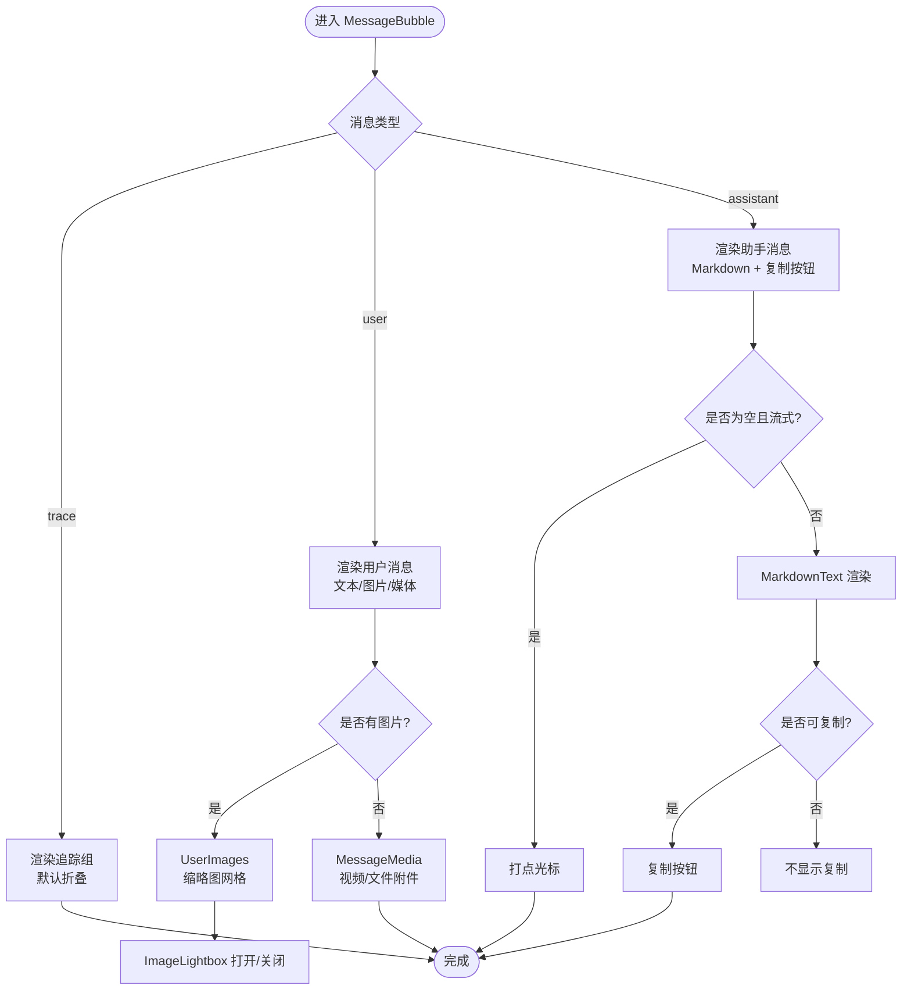
```mermaid
flowchart TD
Start(["进入 MessageBubble"]) --> Kind{"消息类型"}
Kind --> |trace| Trace["渲染追踪组<br/>默认折叠"]
Kind --> |user| User["渲染用户消息<br/>文本/图片/媒体"]
Kind --> |assistant| Assist["渲染助手消息<br/>Markdown + 复制按钮"]
User --> Images{"是否有图片?"}
Images --> |是| UImg["UserImages<br/>缩略图网格"]
Images --> |否| Media["MessageMedia<br/>视频/文件附件"]
Assist --> Empty{"是否为空且流式?"}
Empty --> |是| Dots["打点光标"]
Empty --> |否| MD["MarkdownText 渲染"]
MD --> CopyBtn{"是否可复制?"}
CopyBtn --> |是| Copy["复制按钮"]
CopyBtn --> |否| Skip["不显示复制"]
UImg --> LB["ImageLightbox 打开/关闭"]
Media --> End(["完成"])
Trace --> End
Dots --> End
Copy --> End
```

图表来源
- [MessageBubble.tsx:1-135](file://webui/src/components/MessageBubble.tsx#L1-L135)

章节来源
- [MessageBubble.tsx:1-444](file://webui/src/components/MessageBubble.tsx#L1-L444)

### MessageList 消息列表
- 自动贴底滚动：在用户位于底部时，新消息即时滚动到底部；流式期间禁用平滑滚动避免动画冲突；稳定后启用平滑滚动。
- 滚动位置保持：检测距离底部阈值，若用户已上滑则保留位置；当脱离底部显示“回到底部”按钮。
- 视觉增强：顶部与底部渐隐遮罩，提升滚动体验。

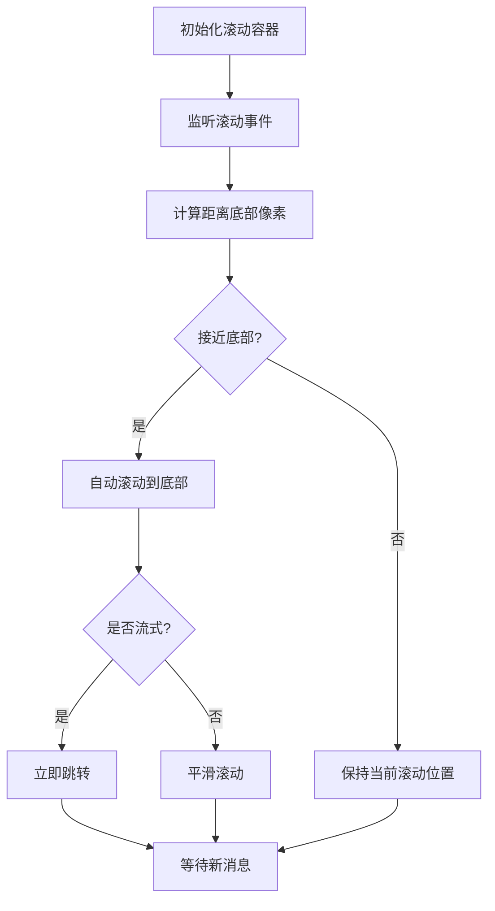
```mermaid
flowchart TD
Init["初始化滚动容器"] --> Watch["监听滚动事件"]
Watch --> Dist["计算距离底部像素"]
Dist --> Near{"接近底部?"}
Near --> |是| Auto["自动滚动到底部"]
Near --> |否| Hold["保持当前滚动位置"]
Auto --> Smooth{"是否流式?"}
Smooth --> |是| Jump["立即跳转"]
Smooth --> |否| Animate["平滑滚动"]
Jump --> Wait["等待新消息"]
Animate --> Wait
Hold --> Wait
```

图表来源
- [MessageList.tsx:1-110](file://webui/src/components/MessageList.tsx#L1-L110)

章节来源
- [MessageList.tsx:1-110](file://webui/src/components/MessageList.tsx#L1-L110)

### Composer 消息 Composer
- 行为特性
  - 自动聚焦；多行自适应高度；Enter 发送、Shift+Enter 插入换行；禁用态透明度与不可交互。
  - 提交后清空输入并重置高度，保持输入体验一致。
- 无障碍与可用性
  - 占位符提示、按钮标签、禁用态反馈。

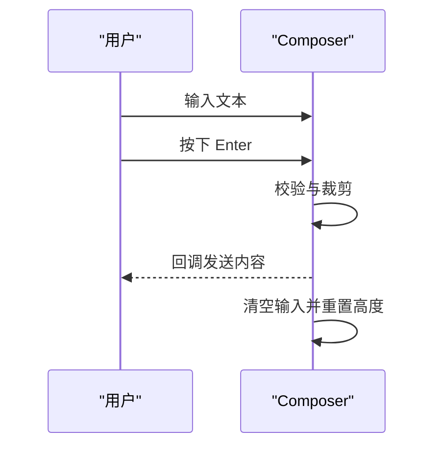
```mermaid
sequenceDiagram
participant U as "用户"
participant C as "Composer"
U->>C : 输入文本
U->>C : 按下 Enter
C->>C : 校验与裁剪
C-->>U : 回调发送内容
C->>C : 清空输入并重置高度
```

图表来源
- [Composer.tsx:1-125](file://webui/src/components/Composer.tsx#L1-L125)

章节来源
- [Composer.tsx:1-125](file://webui/src/components/Composer.tsx#L1-L125)

### CodeBlock 代码块
- 主题适配：监听根节点 class 切换深/浅色，动态选择 oneDark/oneLight。
- 复制功能：写入剪贴板并短暂反馈；复原定时器清理。
- 排版与可读性：固定字体大小、行高、边框与圆角，长行自动换行。

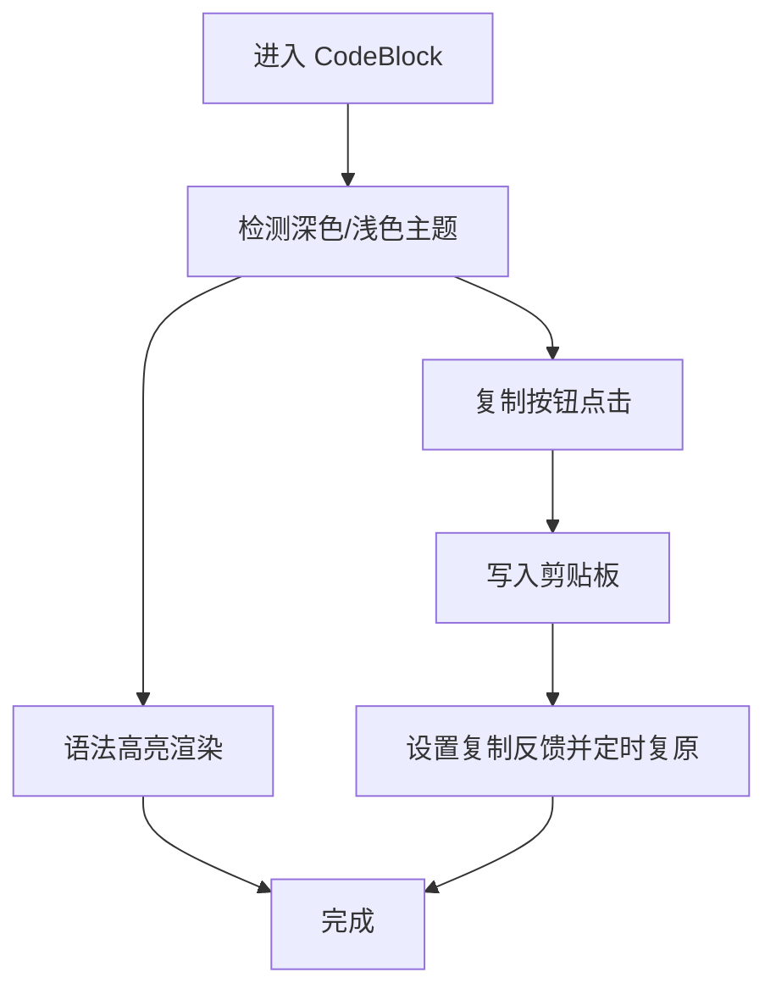
```mermaid
flowchart TD
Enter["进入 CodeBlock"] --> Theme["检测深色/浅色主题"]
Theme --> Copy["复制按钮点击"]
Copy --> Write["写入剪贴板"]
Write --> Feedback["设置复制反馈并定时复原"]
Theme --> Render["语法高亮渲染"]
Render --> Exit["完成"]
Feedback --> Exit
```

图表来源
- [CodeBlock.tsx:1-106](file://webui/src/components/CodeBlock.tsx#L1-L106)

章节来源
- [CodeBlock.tsx:1-106](file://webui/src/components/CodeBlock.tsx#L1-L106)

### MarkdownText 与 MarkdownTextRenderer
- 设计取舍
  - MarkdownText 作为静态导入入口，避免首次绘制闪烁；MarkdownTextRenderer 作为重型渲染器，负责 GFM、数学公式、KaTeX 与代码高亮。
- 组件映射
  - code 标签匹配 language-* 时交由 CodeBlock 渲染；a 标签外链打开；pre 标签透传。
- 样式体系
  - prose/prose-dark 类系统一段落、标题、列表、表格、代码块与链接风格。

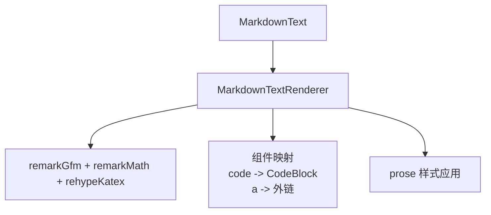
```mermaid
flowchart TD
MT["MarkdownText"] --> MTR["MarkdownTextRenderer"]
MTR --> Plugins["remarkGfm + remarkMath + rehypeKatex"]
MTR --> Map["组件映射<br/>code -> CodeBlock<br/>a -> 外链"]
MTR --> Prose["prose 样式应用"]
```

图表来源
- [MarkdownText.tsx:1-24](file://webui/src/components/MarkdownText.tsx#L1-L24)
- [MarkdownTextRenderer.tsx:1-88](file://webui/src/components/MarkdownTextRenderer.tsx#L1-L88)

章节来源
- [MarkdownText.tsx:1-24](file://webui/src/components/MarkdownText.tsx#L1-L24)
- [MarkdownTextRenderer.tsx:1-88](file://webui/src/components/MarkdownTextRenderer.tsx#L1-L88)

### ImageLightbox 图片灯箱
- 性能优化
  - translate3d + will-change 促进合成层；相邻图片预解码以保证左右切换无延迟。
  - 支持键盘导航（左右箭头、Home/End）与 Radix Dialog 原生焦点陷阱。
- 交互细节
  - 计数器、关闭按钮、隐藏预加载图；根据是否多图决定导航按钮显示。

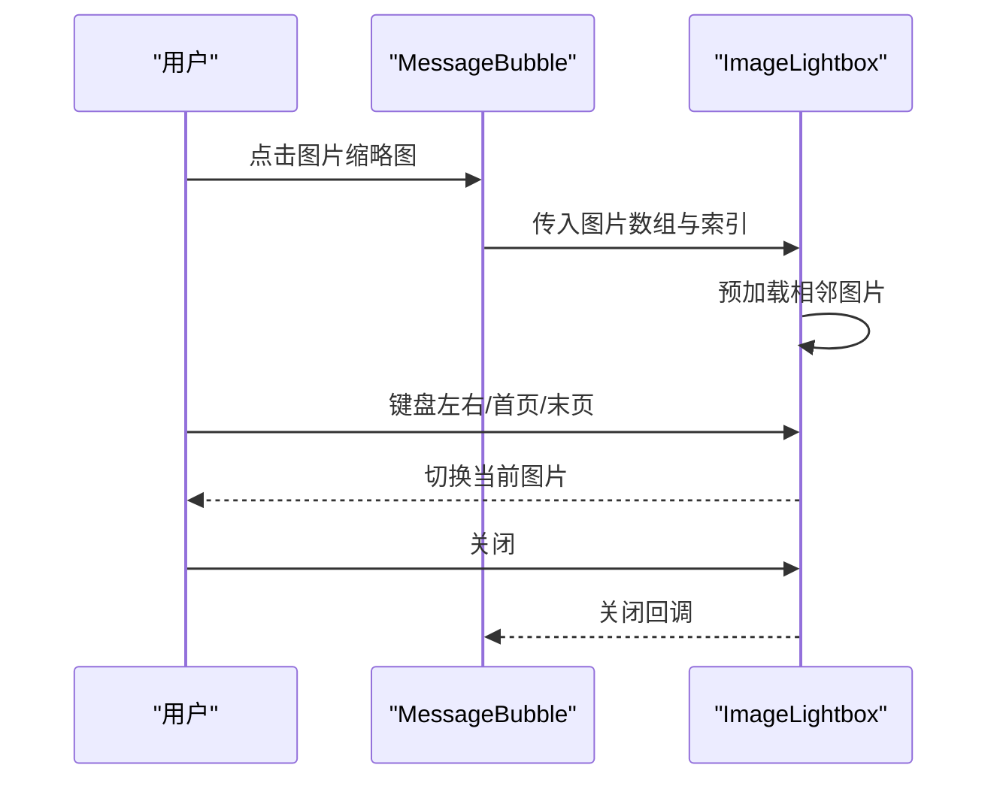
```mermaid
sequenceDiagram
participant U as "用户"
participant MB as "MessageBubble"
participant ILB as "ImageLightbox"
U->>MB : 点击图片缩略图
MB->>ILB : 传入图片数组与索引
ILB->>ILB : 预加载相邻图片
U->>ILB : 键盘左右/首页/末页
ILB-->>U : 切换当前图片
U->>ILB : 关闭
ILB-->>MB : 关闭回调
```

图表来源
- [MessageBubble.tsx:282-291](file://webui/src/components/MessageBubble.tsx#L282-L291)
- [ImageLightbox.tsx:1-200](file://webui/src/components/ImageLightbox.tsx#L1-L200)

章节来源
- [ImageLightbox.tsx:1-200](file://webui/src/components/ImageLightbox.tsx#L1-L200)
- [MessageBubble.tsx:240-291](file://webui/src/components/MessageBubble.tsx#L240-L291)

### NotificationPanel 通知面板
- 状态管理
  - 通过 useNotifications 获取 items、状态、错误码；面板打开时主动刷新；支持标记已读与一键已读。
- 视图状态
  - loading/error/empty/列表四种状态；未读计数统计；点击项触发导航与标记已读。
- 可测试性
  - 支持注入控制器以禁用自动抓取，便于测试。

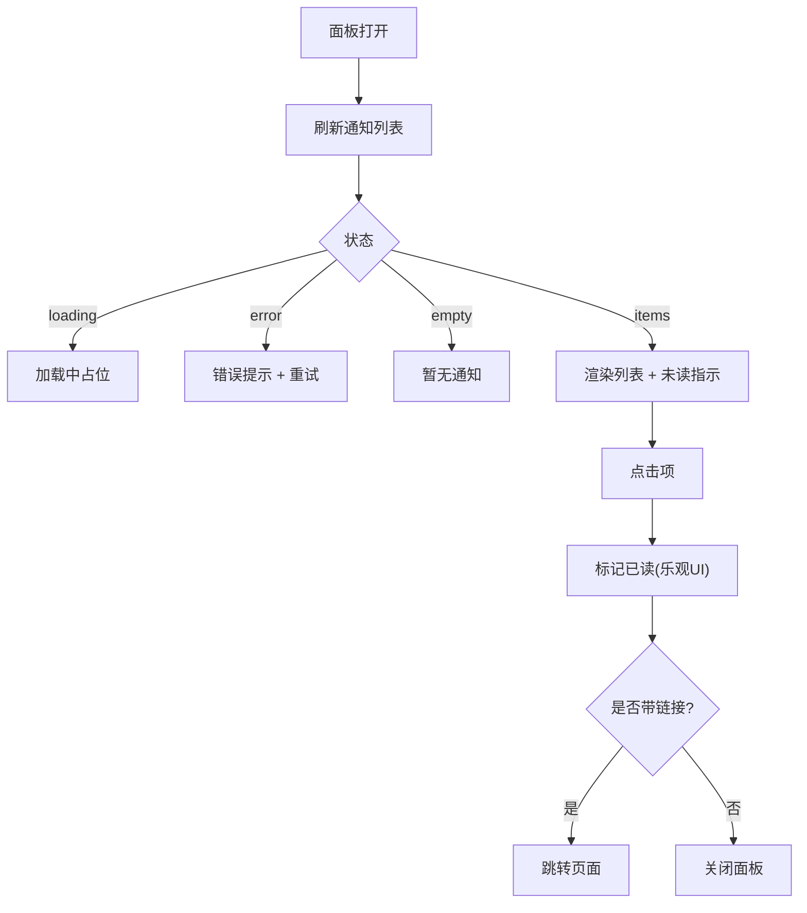
```mermaid
flowchart TD
Open["面板打开"] --> Refresh["刷新通知列表"]
Refresh --> State{"状态"}
State --> |loading| Loading["加载中占位"]
State --> |error| Error["错误提示 + 重试"]
State --> |empty| Empty["暂无通知"]
State --> |items| List["渲染列表 + 未读指示"]
List --> Click["点击项"]
Click --> Mark["标记已读(乐观UI)"]
Mark --> Nav{"是否带链接?"}
Nav --> |是| Go["跳转页面"]
Nav --> |否| Close["关闭面板"]
```

图表来源
- [NotificationPanel.tsx:1-215](file://webui/src/components/NotificationPanel.tsx#L1-L215)

章节来源
- [NotificationPanel.tsx:1-215](file://webui/src/components/NotificationPanel.tsx#L1-L215)

### TaskStatusBadge 任务状态徽章
- 语义化展示
  - 七种状态（排队、运行、等待确认、完成、失败、取消、暂停）对应背景、文字与可选脉冲点。
- 可访问性
  - 无障碍标签与颜色对比度满足要求。

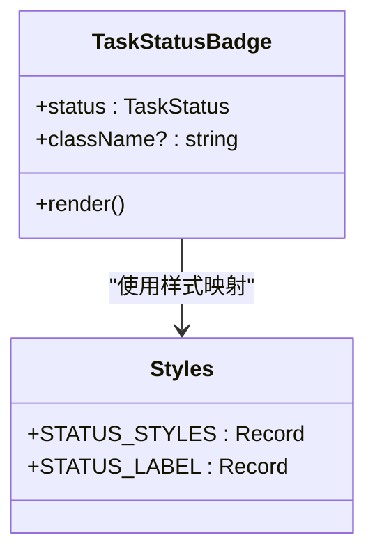
```mermaid
classDiagram
class TaskStatusBadge {
+status : TaskStatus
+className? : string
+render()
}
class Styles {
+STATUS_STYLES : Record
+STATUS_LABEL : Record
}
TaskStatusBadge --> Styles : "使用样式映射"
```

图表来源
- [TaskStatusBadge.tsx:1-62](file://webui/src/components/TaskStatusBadge.tsx#L1-L62)

章节来源
- [TaskStatusBadge.tsx:1-62](file://webui/src/components/TaskStatusBadge.tsx#L1-L62)

### ConnectionBadge 连接状态徽章
- 实时状态
  - 从 ClientProvider 获取连接状态；监听状态变化；对连接中/重连中/错误状态添加脉冲动画。
- 可访问性
  - aria-live 声明状态变更。

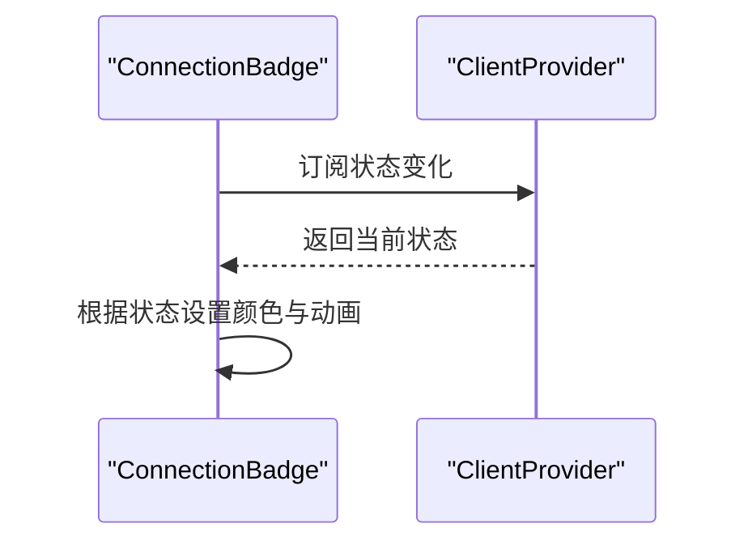
```mermaid
sequenceDiagram
participant UI as "ConnectionBadge"
participant CP as "ClientProvider"
UI->>CP : 订阅状态变化
CP-->>UI : 返回当前状态
UI->>UI : 根据状态设置颜色与动画
```

图表来源
- [ConnectionBadge.tsx:1-57](file://webui/src/components/ConnectionBadge.tsx#L1-L57)

章节来源
- [ConnectionBadge.tsx:1-57](file://webui/src/components/ConnectionBadge.tsx#L1-L57)

### DeleteConfirm 删除确认
- 对话框
  - 使用 AlertDialog 组件；标题、描述、取消/确认按钮；确认按钮强调色。
- 交互
  - 取消时回调；确认时执行删除动作。

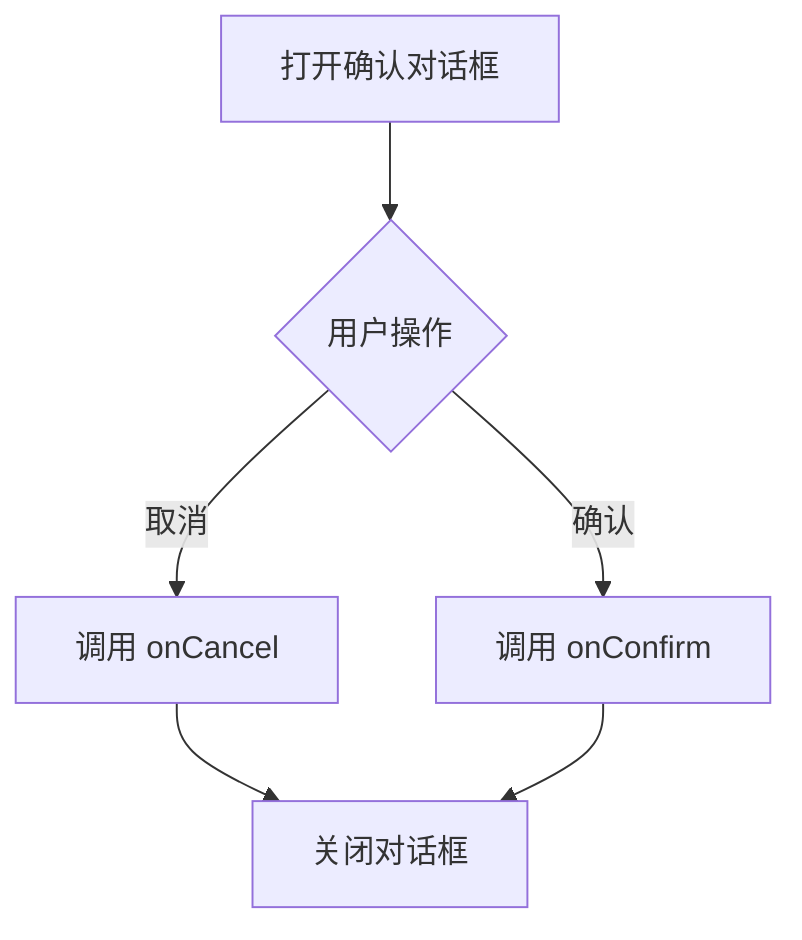
```mermaid
flowchart TD
Open["打开确认对话框"] --> Action{"用户操作"}
Action --> |取消| Cancel["调用 onCancel"]
Action --> |确认| Confirm["调用 onConfirm"]
Cancel --> Close["关闭对话框"]
Confirm --> Close
```

图表来源
- [DeleteConfirm.tsx:1-53](file://webui/src/components/DeleteConfirm.tsx#L1-L53)

章节来源
- [DeleteConfirm.tsx:1-53](file://webui/src/components/DeleteConfirm.tsx#L1-L53)

### EmptyState 空状态
- 场景
  - 会话为空时的引导；提供新建聊天按钮。
- 无障碍
  - 图标与文案具备可访问性标签。

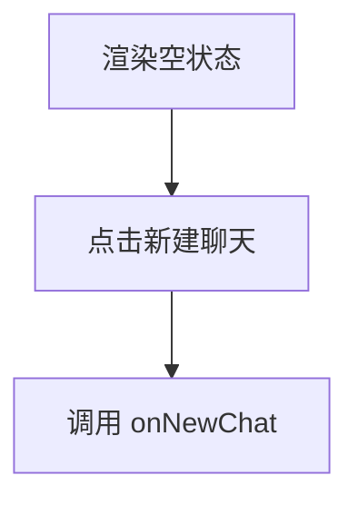
```mermaid
flowchart TD
Show["渲染空状态"] --> NewChat["点击新建聊天"]
NewChat --> Callback["调用 onNewChat"]
```

图表来源
- [EmptyState.tsx:1-27](file://webui/src/components/EmptyState.tsx#L1-L27)

章节来源
- [EmptyState.tsx:1-27](file://webui/src/components/EmptyState.tsx#L1-L27)

### ErrorBoundary 错误边界
- 安全兜底
  - 捕获子树渲染错误；记录日志；提供重试按钮；可注入自定义回退 UI。
- 体验
  - 保持外壳可用，避免整页白屏。

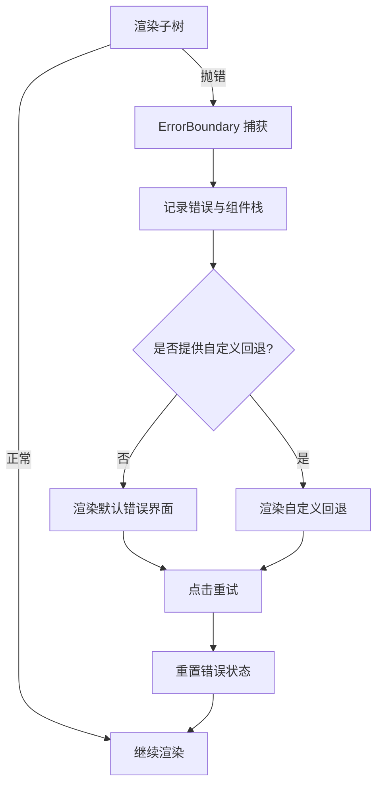
```mermaid
flowchart TD
Try["渲染子树"] --> |正常| Render["继续渲染"]
Try --> |抛错| Catch["ErrorBoundary 捕获"]
Catch --> Log["记录错误与组件栈"]
Log --> Fallback{"是否提供自定义回退?"}
Fallback --> |是| Custom["渲染自定义回退"]
Fallback --> |否| Default["渲染默认错误界面"]
Default --> Retry["点击重试"]
Custom --> Retry
Retry --> Reset["重置错误状态"]
Reset --> Render
```

图表来源
- [ErrorBoundary.tsx:1-73](file://webui/src/components/ErrorBoundary.tsx#L1-L73)

章节来源
- [ErrorBoundary.tsx:1-73](file://webui/src/components/ErrorBoundary.tsx#L1-L73)

### LanguageSwitcher 语言切换
- 下拉菜单
  - 当前语言标签；支持切换；同步到 i18n 配置。
- 无障碍
  - 触发按钮具备 aria-label。

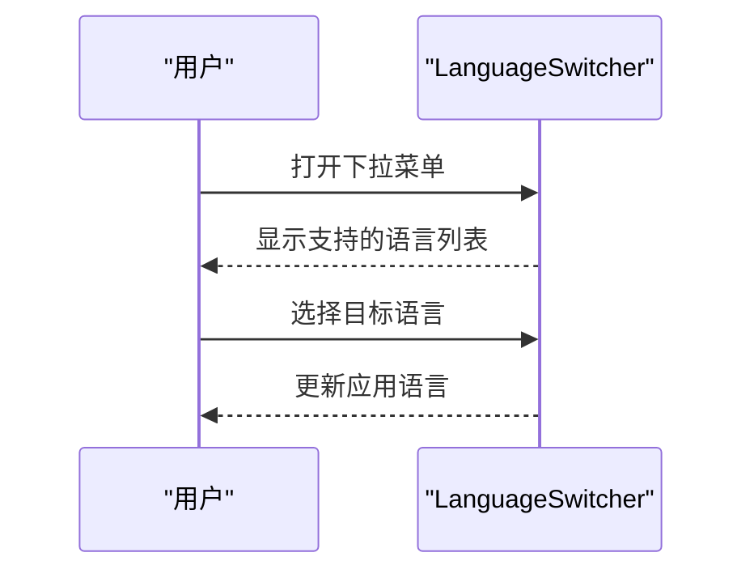
```mermaid
sequenceDiagram
participant U as "用户"
participant LS as "LanguageSwitcher"
U->>LS : 打开下拉菜单
LS-->>U : 显示支持的语言列表
U->>LS : 选择目标语言
LS-->>U : 更新应用语言
```

图表来源
- [LanguageSwitcher.tsx:1-68](file://webui/src/components/LanguageSwitcher.tsx#L1-L68)

章节来源
- [LanguageSwitcher.tsx:1-68](file://webui/src/components/LanguageSwitcher.tsx#L1-L68)

### PromptSuggestions 提示建议
- 结构
  - 快速统计卡片、快捷指令卡片、在线智能体卡片；右侧栏布局。
- 交互
  - 点击指令通过自定义事件向 Composer 预填文本并聚焦；支持折叠侧栏。
- 数据
  - 静态预设提示与代理状态，纯展示组件，无数据抓取。

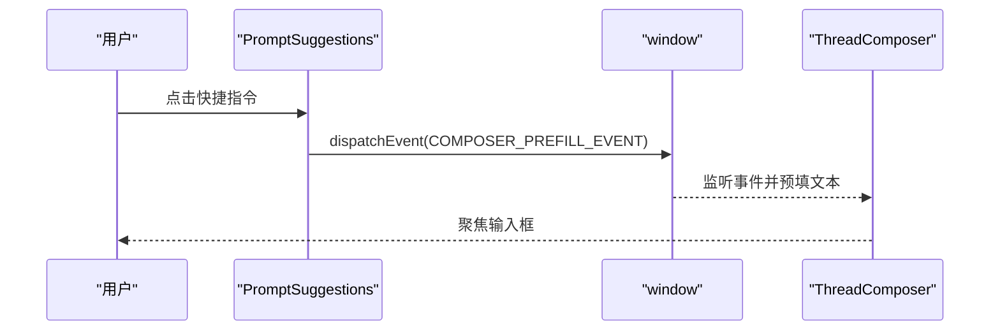
```mermaid
sequenceDiagram
participant U as "用户"
participant PS as "PromptSuggestions"
participant Win as "window"
participant TC as "ThreadComposer"
U->>PS : 点击快捷指令
PS->>Win : dispatchEvent(COMPOSER_PREFILL_EVENT)
Win-->>TC : 监听事件并预填文本
TC-->>U : 聚焦输入框
```

图表来源
- [PromptSuggestions.tsx:1-309](file://webui/src/components/PromptSuggestions.tsx#L1-L309)

章节来源
- [PromptSuggestions.tsx:1-309](file://webui/src/components/PromptSuggestions.tsx#L1-L309)

### ProtectedRoute 受保护路由与 AuthForm 认证表单
- 受保护路由
  - 基于全局引导状态（loading/auth/ready）进行路由守卫；未就绪时重定向至登录并携带 next 参数。
- 认证表单
  - 共享密码输入表单；支持失败提示、禁用态与提交控制；可隐藏头部与失败提示。

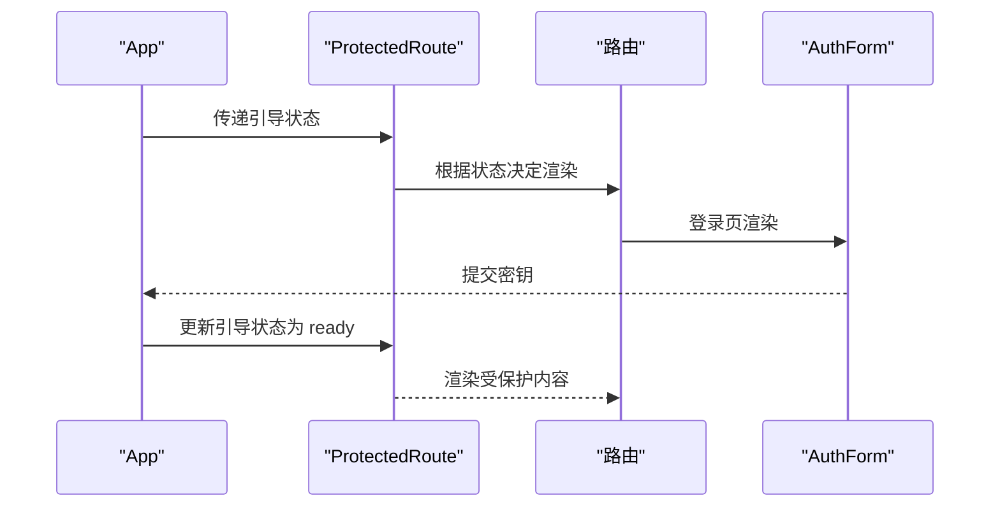
```mermaid
sequenceDiagram
participant App as "App"
participant PR as "ProtectedRoute"
participant RL as "路由"
participant AF as "AuthForm"
App->>PR : 传递引导状态
PR->>RL : 根据状态决定渲染
RL->>AF : 登录页渲染
AF-->>App : 提交密钥
App->>PR : 更新引导状态为 ready
PR-->>RL : 渲染受保护内容
```

图表来源
- [ProtectedRoute.tsx:1-62](file://webui/src/components/ProtectedRoute.tsx#L1-L62)
- [AuthForm.tsx:1-81](file://webui/src/components/AuthForm.tsx#L1-L81)

章节来源
- [ProtectedRoute.tsx:1-62](file://webui/src/components/ProtectedRoute.tsx#L1-L62)
- [AuthForm.tsx:1-81](file://webui/src/components/AuthForm.tsx#L1-L81)

### ActivityEventStream 活动事件流
- 模式
  - 生产环境托管 useActivityStream；测试模式可直接注入 events/state/errorCode。
- 视图
  - 加载/错误/空/列表四种状态；实时指示器；支持刷新。
- 语义化
  - 不同级别（critical/warning/info/ok）对应图标与颜色；来源与类别本地化。

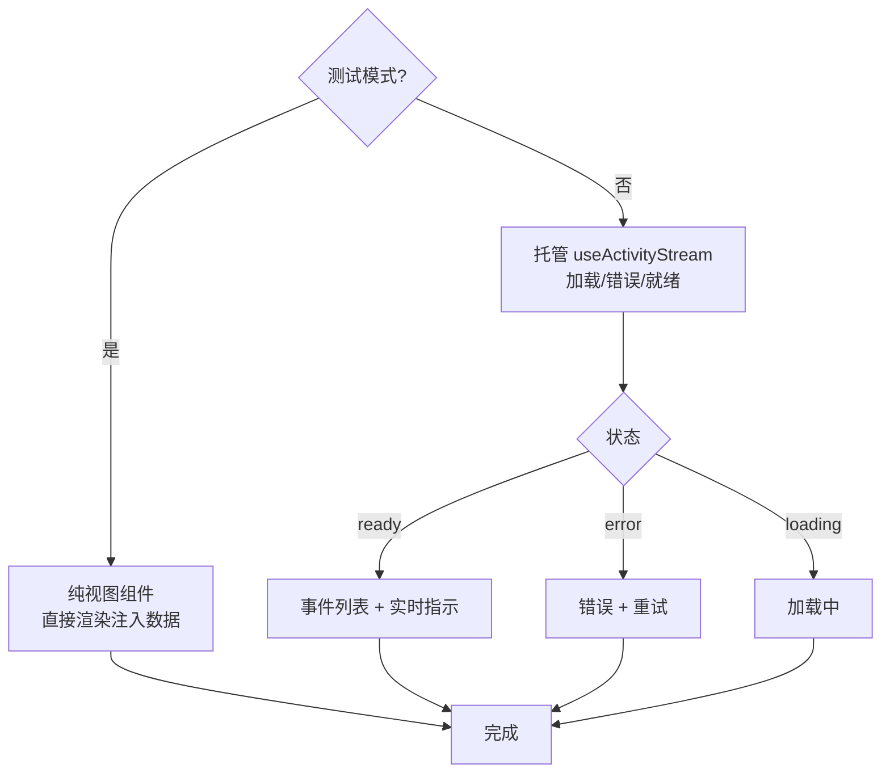
```mermaid
flowchart TD
Mode{"测试模式?"}
Mode --> |是| View["纯视图组件<br/>直接渲染注入数据"]
Mode --> |否| Hook["托管 useActivityStream<br/>加载/错误/就绪"]
Hook --> State{"状态"}
State --> |loading| L["加载中"]
State --> |error| E["错误 + 重试"]
State --> |ready| List["事件列表 + 实时指示"]
View --> Done["完成"]
List --> Done
E --> Done
L --> Done
```

图表来源
- [ActivityEventStream.tsx:1-281](file://webui/src/components/ActivityEventStream.tsx#L1-L281)

章节来源
- [ActivityEventStream.tsx:1-281](file://webui/src/components/ActivityEventStream.tsx#L1-L281)

### SettingsView 设置视图
- 数据流
  - 通过 ClientProvider 获取 token；加载设置、应用变更、保存更新；模型列表拉取。
- 表单控制
  - Provider 切换联动 Base URL；API Key 三态（不清空/清空/替换）；显隐切换。
- 错误与恢复
  - 加载失败弹窗提示并提供重试与登出选项；空白面板友好提示。

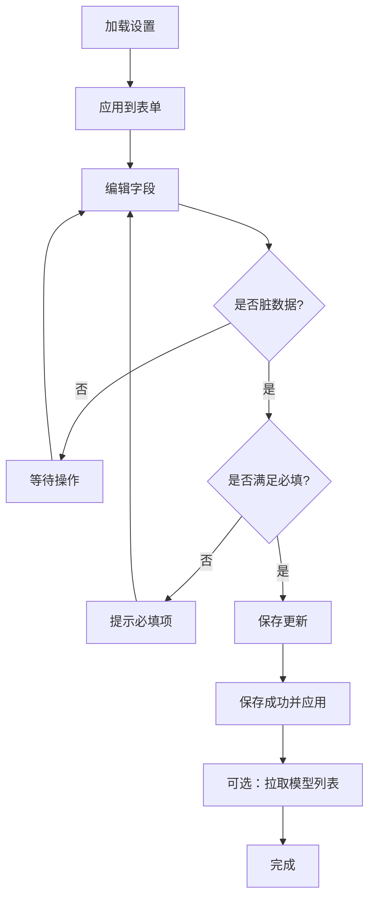
```mermaid
flowchart TD
Load["加载设置"] --> Apply["应用到表单"]
Apply --> Edit["编辑字段"]
Edit --> Dirty{"是否脏数据?"}
Dirty --> |否| Idle["等待操作"]
Dirty --> |是| CanSave{"是否满足必填?"}
CanSave --> |否| Warn["提示必填项"]
CanSave --> |是| Save["保存更新"]
Save --> Ok["保存成功并应用"]
Ok --> ModelFetch["可选：拉取模型列表"]
ModelFetch --> Done["完成"]
Warn --> Edit
Idle --> Edit
```

图表来源
- [SettingsView.tsx:1-606](file://webui/src/components/settings/SettingsView.tsx#L1-L606)

章节来源
- [SettingsView.tsx:1-606](file://webui/src/components/settings/SettingsView.tsx#L1-L606)

## 依赖关系分析
- 组件耦合
  - MessageBubble 依赖 MarkdownTextRenderer 与 CodeBlock；MessageList 依赖 MessageBubble。
  - NotificationPanel 依赖 useNotifications；ActivityEventStream 依赖 useActivityStream。
  - SettingsView 依赖 ClientProvider 与 i18n；LanguageSwitcher 依赖 i18n 配置。
- 外部库
  - react-markdown、remark-gfm、remark-math、rehype-katex、react-syntax-highlighter、Radix UI Dialog、lucide-react、react-i18next、@radix-ui/react-dialog 等。
- 潜在循环
  - 未见直接循环依赖；通过 hooks 与 Provider 松耦合。

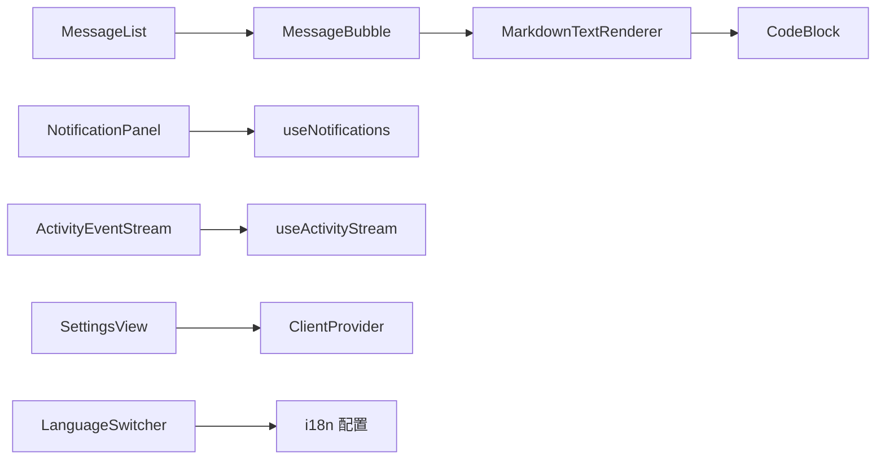
```mermaid
graph LR
MB["MessageBubble"] --> MTR["MarkdownTextRenderer"]
MTR --> CB["CodeBlock"]
ML["MessageList"] --> MB
NP["NotificationPanel"] --> UN["useNotifications"]
AES["ActivityEventStream"] --> UA["useActivityStream"]
SV["SettingsView"] --> CP["ClientProvider"]
LS["LanguageSwitcher"] --> I18N["i18n 配置"]
```

图表来源
- [MessageBubble.tsx:1-444](file://webui/src/components/MessageBubble.tsx#L1-L444)
- [MessageList.tsx:1-110](file://webui/src/components/MessageList.tsx#L1-L110)
- [MarkdownTextRenderer.tsx:1-88](file://webui/src/components/MarkdownTextRenderer.tsx#L1-L88)
- [CodeBlock.tsx:1-106](file://webui/src/components/CodeBlock.tsx#L1-L106)
- [NotificationPanel.tsx:1-215](file://webui/src/components/NotificationPanel.tsx#L1-L215)
- [ActivityEventStream.tsx:1-281](file://webui/src/components/ActivityEventStream.tsx#L1-L281)
- [SettingsView.tsx:1-606](file://webui/src/components/settings/SettingsView.tsx#L1-L606)
- [LanguageSwitcher.tsx:1-68](file://webui/src/components/LanguageSwitcher.tsx#L1-L68)

章节来源
- [MessageBubble.tsx:1-444](file://webui/src/components/MessageBubble.tsx#L1-L444)
- [MessageList.tsx:1-110](file://webui/src/components/MessageList.tsx#L1-L110)
- [MarkdownTextRenderer.tsx:1-88](file://webui/src/components/MarkdownTextRenderer.tsx#L1-L88)
- [CodeBlock.tsx:1-106](file://webui/src/components/CodeBlock.tsx#L1-L106)
- [NotificationPanel.tsx:1-215](file://webui/src/components/NotificationPanel.tsx#L1-L215)
- [ActivityEventStream.tsx:1-281](file://webui/src/components/ActivityEventStream.tsx#L1-L281)
- [SettingsView.tsx:1-606](file://webui/src/components/settings/SettingsView.tsx#L1-L606)
- [LanguageSwitcher.tsx:1-68](file://webui/src/components/LanguageSwitcher.tsx#L1-L68)

## 性能考量
- 消息列表滚动
  - 仅在 near-bottom 时自动滚动，避免频繁重排；流式期间禁用平滑滚动减少动画抖动。
- 代码高亮
  - 仅在需要时渲染 CodeBlock；主题切换通过 DOM class 观察，避免不必要的重渲染。
- 媒体预览
  - ImageLightbox 预加载相邻图片；translate3d 启用硬件加速；滚动区域使用 GPU 合成层。
- Markdown 渲染
  - 将重型渲染器拆分为独立 chunk，但为避免首帧闪烁，MarkdownText 直接静态导入渲染器。
- 通知与事件流
  - 面板打开时主动刷新；事件流支持错误态与重试，避免长时间挂起。

[本节为通用性能讨论，无需特定文件分析]

## 故障排查指南
- 错误边界
  - 出现渲染错误时，ErrorBoundary 会显示错误信息与重试按钮；开发者可在 onError 中接入遥测。
- 通知面板
  - 网络错误时显示错误提示与重试按钮；检查 token 是否有效与网络连通性。
- 设置视图
  - 加载失败弹窗提示；可重试或登出重新认证；确保 Base URL 与 API Key 正确。
- 事件流
  - 错误态显示暂停与重试；检查客户端连接状态与订阅权限。
- 代码复制
  - 若复制无效，检查浏览器剪贴板权限与 HTTPS 环境。

章节来源
- [ErrorBoundary.tsx:1-73](file://webui/src/components/ErrorBoundary.tsx#L1-L73)
- [NotificationPanel.tsx:132-150](file://webui/src/components/NotificationPanel.tsx#L132-L150)
- [SettingsView.tsx:256-275](file://webui/src/components/settings/SettingsView.tsx#L256-L275)
- [ActivityEventStream.tsx:137-155](file://webui/src/components/ActivityEventStream.tsx#L137-L155)
- [CodeBlock.tsx:43-49](file://webui/src/components/CodeBlock.tsx#L43-L49)

## 结论
上述组件围绕消息渲染、富文本与代码高亮、媒体预览、通知与状态展示、认证与受保护路由、实时事件流以及设置管理构建了完整且可扩展的前端 UI 能力集。通过 hooks、Provider 与自定义事件实现松耦合协作，配合性能优化策略与完善的错误处理，确保在复杂场景下的稳定性与用户体验。

[本节为总结性内容，无需特定文件分析]

## 附录
- 国际化键值与本地化资源位于 webui/src/i18n/locales 下，组件通过 react-i18next 使用翻译。
- UI 原子组件来自 webui/src/components/ui，如 Button、Input、Dialog、DropdownMenu 等，组件内部统一使用。

[本节为概览性内容，无需特定文件分析]