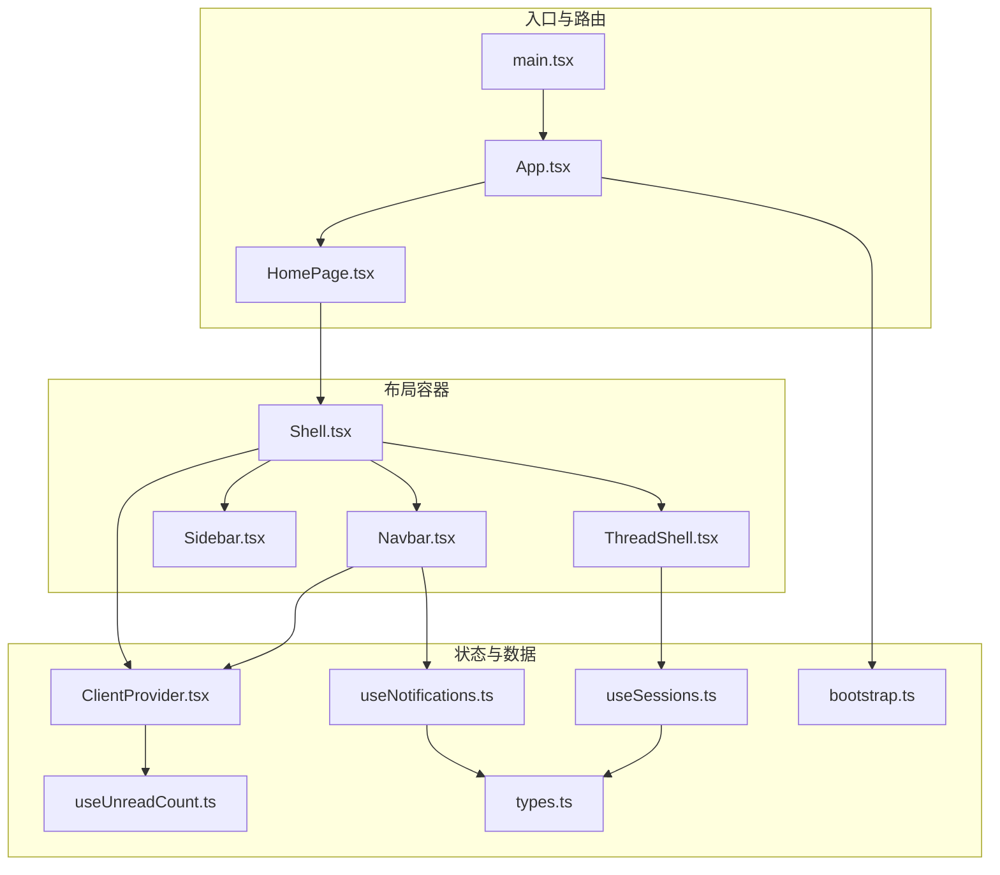
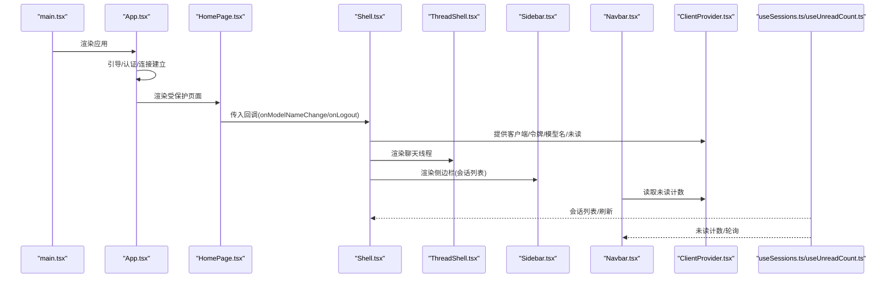
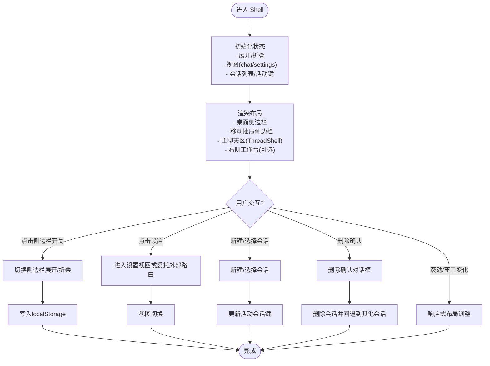
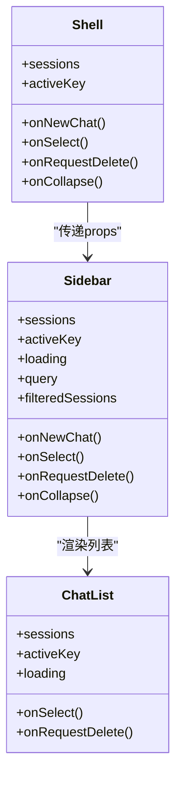
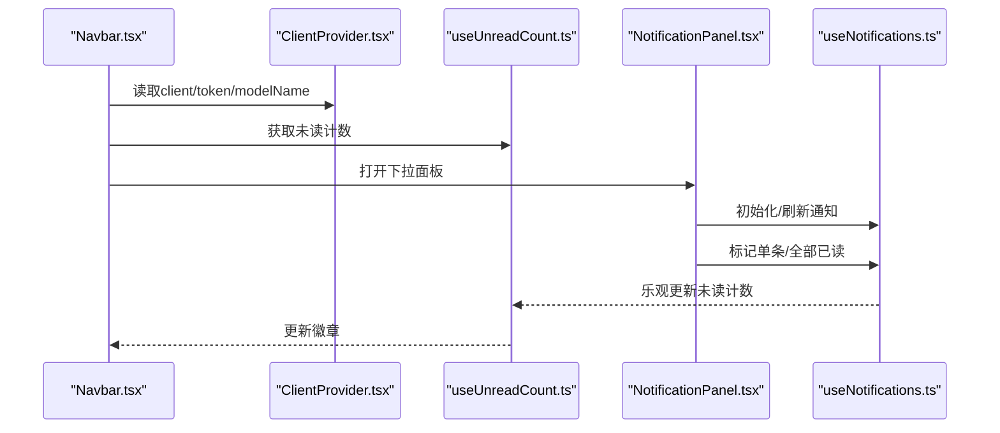
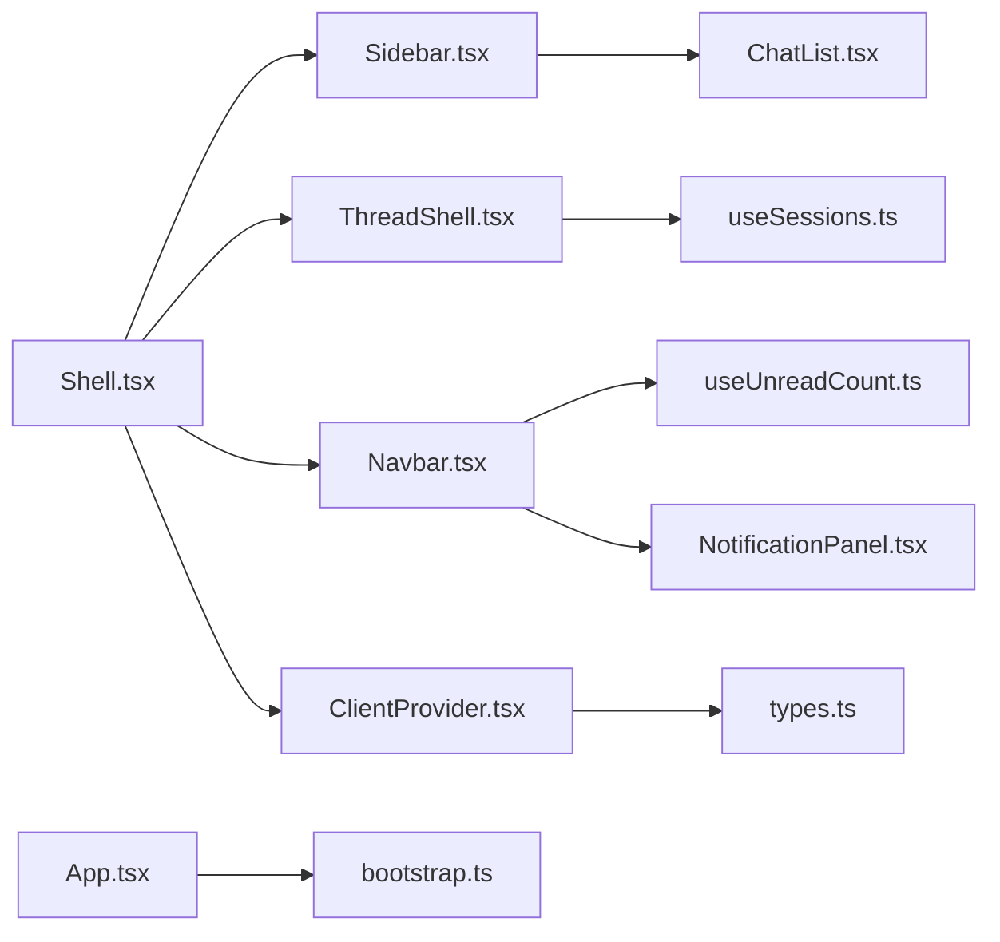
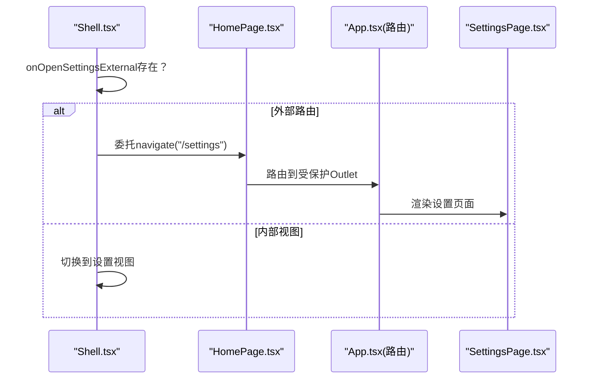

# 布局组件系统

<cite>
**本文引用的文件**
- [webui/src/components/Shell.tsx](file://webui/src/components/Shell.tsx)
- [webui/src/components/Sidebar.tsx](file://webui/src/components/Sidebar.tsx)
- [webui/src/components/Navbar.tsx](file://webui/src/components/Navbar.tsx)
- [webui/src/components/ChatList.tsx](file://webui/src/components/ChatList.tsx)
- [webui/src/components/thread/ThreadShell.tsx](file://webui/src/components/thread/ThreadShell.tsx)
- [webui/src/components/NotificationPanel.tsx](file://webui/src/components/NotificationPanel.tsx)
- [webui/src/hooks/useSessions.ts](file://webui/src/hooks/useSessions.ts)
- [webui/src/hooks/useNotifications.ts](file://webui/src/hooks/useNotifications.ts)
- [webui/src/hooks/useUnreadCount.ts](file://webui/src/hooks/useUnreadCount.ts)
- [webui/src/providers/ClientProvider.tsx](file://webui/src/providers/ClientProvider.tsx)
- [webui/src/pages/HomePage.tsx](file://webui/src/pages/HomePage.tsx)
- [webui/src/App.tsx](file://webui/src/App.tsx)
- [webui/src/lib/types.ts](file://webui/src/lib/types.ts)
- [webui/src/lib/bootstrap.ts](file://webui/src/lib/bootstrap.ts)
- [webui/src/i18n/config.ts](file://webui/src/i18n/config.ts)
- [webui/src/main.tsx](file://webui/src/main.tsx)
</cite>

## 目录
1. [简介](#简介)
2. [项目结构](#项目结构)
3. [核心组件](#核心组件)
4. [架构总览](#架构总览)
5. [详细组件分析](#详细组件分析)
6. [依赖关系分析](#依赖关系分析)
7. [性能考量](#性能考量)
8. [故障排查指南](#故障排查指南)
9. [结论](#结论)
10. [附录](#附录)

## 简介
本文件面向VAPT3前端WebUI的布局组件系统，围绕Shell外壳容器、Sidebar侧边栏、Navbar导航栏三大核心模块进行技术文档化梳理。内容涵盖：
- Shell作为应用根容器的布局结构、路由集成与状态管理
- Sidebar菜单项配置、折叠展开逻辑、路由导航与响应式适配
- Navbar导航栏的认证状态、通知中心、语言切换与搜索功能
- 组件间通信机制与数据流
- 布局定制指南（主题切换、菜单扩展、移动端适配）
- 性能优化与SEO友好性建议

## 项目结构
WebUI采用React + TypeScript构建，布局相关代码集中在webui/src/components与webui/src/pages目录下，配合hooks、providers与lib层实现状态与数据流管理。

图表来源
- [webui/src/main.tsx:1-16](file://webui/src/main.tsx#L1-L16)
- [webui/src/App.tsx:1-233](file://webui/src/App.tsx#L1-L233)
- [webui/src/pages/HomePage.tsx:1-48](file://webui/src/pages/HomePage.tsx#L1-L48)
- [webui/src/components/Shell.tsx:1-374](file://webui/src/components/Shell.tsx#L1-L374)
- [webui/src/components/thread/ThreadShell.tsx:1-267](file://webui/src/components/thread/ThreadShell.tsx#L1-L267)
- [webui/src/components/Sidebar.tsx:1-122](file://webui/src/components/Sidebar.tsx#L1-L122)
- [webui/src/components/Navbar.tsx:1-177](file://webui/src/components/Navbar.tsx#L1-L177)
- [webui/src/providers/ClientProvider.tsx:1-58](file://webui/src/providers/ClientProvider.tsx#L1-L58)
- [webui/src/hooks/useSessions.ts:1-314](file://webui/src/hooks/useSessions.ts#L1-L314)
- [webui/src/hooks/useUnreadCount.ts:1-186](file://webui/src/hooks/useUnreadCount.ts#L1-L186)
- [webui/src/hooks/useNotifications.ts:1-180](file://webui/src/hooks/useNotifications.ts#L1-L180)
- [webui/src/lib/types.ts:1-306](file://webui/src/lib/types.ts#L1-L306)
- [webui/src/lib/bootstrap.ts:1-77](file://webui/src/lib/bootstrap.ts#L1-L77)

章节来源
- [webui/src/main.tsx:1-16](file://webui/src/main.tsx#L1-L16)
- [webui/src/App.tsx:1-233](file://webui/src/App.tsx#L1-L233)

## 核心组件
- Shell：应用根容器，负责桌面端/移动端侧边栏、主聊天区、右侧工作台（可选）的布局与状态协调；维护本地存储的展开状态、视图切换（聊天/设置）、会话生命周期等。
- Sidebar：会话列表侧边栏，支持新建会话、搜索过滤、删除归档、折叠控制。
- Navbar：全局导航栏，包含路由链接、连接状态指示、通知面板触发器与未读计数、语言切换等。
- ThreadShell：聊天线程容器，承载消息视口、欢迎态、快速动作、Composer输入、流式状态与错误提示。
- ClientProvider：上下文提供者，集中注入SecbotClient、令牌、模型名与全局未读计数，供Navbar等组件消费。
- useSessions：会话状态钩子，封装会话列表拉取、新建、删除、历史消息重建与乐观插入。
- useUnreadCount/useNotifications：未读计数与通知面板的数据流钩子，支持轮询、可见性恢复、乐观更新与防竞态。

章节来源
- [webui/src/components/Shell.tsx:1-374](file://webui/src/components/Shell.tsx#L1-L374)
- [webui/src/components/Sidebar.tsx:1-122](file://webui/src/components/Sidebar.tsx#L1-L122)
- [webui/src/components/Navbar.tsx:1-177](file://webui/src/components/Navbar.tsx#L1-L177)
- [webui/src/components/thread/ThreadShell.tsx:1-267](file://webui/src/components/thread/ThreadShell.tsx#L1-L267)
- [webui/src/providers/ClientProvider.tsx:1-58](file://webui/src/providers/ClientProvider.tsx#L1-L58)
- [webui/src/hooks/useSessions.ts:1-314](file://webui/src/hooks/useSessions.ts#L1-L314)
- [webui/src/hooks/useUnreadCount.ts:1-186](file://webui/src/hooks/useUnreadCount.ts#L1-L186)
- [webui/src/hooks/useNotifications.ts:1-180](file://webui/src/hooks/useNotifications.ts#L1-L180)

## 架构总览
整体采用“容器-视图”分层：
- 容器层：Shell、ThreadShell、ClientProvider
- 视图层：Sidebar、Navbar、ChatList、NotificationPanel等
- 数据层：useSessions、useUnreadCount、useNotifications
- 路由层：App + HomePage，支持模板模式路由与保护路由

图表来源
- [webui/src/main.tsx:1-16](file://webui/src/main.tsx#L1-L16)
- [webui/src/App.tsx:1-233](file://webui/src/App.tsx#L1-L233)
- [webui/src/pages/HomePage.tsx:1-48](file://webui/src/pages/HomePage.tsx#L1-L48)
- [webui/src/components/Shell.tsx:1-374](file://webui/src/components/Shell.tsx#L1-L374)
- [webui/src/components/thread/ThreadShell.tsx:1-267](file://webui/src/components/thread/ThreadShell.tsx#L1-L267)
- [webui/src/components/Sidebar.tsx:1-122](file://webui/src/components/Sidebar.tsx#L1-L122)
- [webui/src/components/Navbar.tsx:1-177](file://webui/src/components/Navbar.tsx#L1-L177)
- [webui/src/providers/ClientProvider.tsx:1-58](file://webui/src/providers/ClientProvider.tsx#L1-L58)
- [webui/src/hooks/useSessions.ts:1-314](file://webui/src/hooks/useSessions.ts#L1-L314)
- [webui/src/hooks/useUnreadCount.ts:1-186](file://webui/src/hooks/useUnreadCount.ts#L1-L186)

## 详细组件分析

### Shell外壳容器
- 设计职责
  - 根容器，统一管理桌面/移动侧边栏、主聊天区、可选右侧工作台
  - 维护本地存储的展开状态（侧边栏、右侧工作台），并根据窗口宽度动态切换交互
  - 协调视图切换（聊天/设置），处理新建会话、选择会话、删除确认、标题与SEO标题更新
- 关键状态与行为
  - 展开状态：desktopSidebarOpen、mobileSidebarOpen、rightRailOpen
  - 会话状态：sessions、activeKey、loading、error
  - 视图状态：view（chat/settings）
  - 通过useSessions提供会话列表与操作
- 与ThreadShell、Sidebar、Navbar的协作
  - 将会话列表与事件回调传递给Sidebar
  - 将当前会话与事件回调传递给ThreadShell
  - 在设置视图时，可委托外部路由打开设置页（onOpenSettingsExternal）

图表来源
- [webui/src/components/Shell.tsx:1-374](file://webui/src/components/Shell.tsx#L1-L374)
- [webui/src/hooks/useSessions.ts:1-314](file://webui/src/hooks/useSessions.ts#L1-L314)

章节来源
- [webui/src/components/Shell.tsx:1-374](file://webui/src/components/Shell.tsx#L1-L374)

### Sidebar侧边栏
- 功能要点
  - 顶部标题与折叠按钮
  - 新建会话按钮
  - 会话搜索（按preview/chatId/channel/key模糊匹配）
  - 会话列表（按今日/昨日/更早分组显示）
  - 归档当前会话（禁用条件：无活动会话）
- 与Shell的交互
  - 接收sessions、activeKey、loading
  - 回调：onNewChat、onSelect、onRequestDelete、onCollapse
  - 通过ChatList展示过滤后的会话列表

图表来源
- [webui/src/components/Shell.tsx:1-374](file://webui/src/components/Shell.tsx#L1-L374)
- [webui/src/components/Sidebar.tsx:1-122](file://webui/src/components/Sidebar.tsx#L1-L122)
- [webui/src/components/ChatList.tsx:1-197](file://webui/src/components/ChatList.tsx#L1-L197)

章节来源
- [webui/src/components/Sidebar.tsx:1-122](file://webui/src/components/Sidebar.tsx#L1-L122)
- [webui/src/components/ChatList.tsx:1-197](file://webui/src/components/ChatList.tsx#L1-L197)

### Navbar导航栏
- 功能要点
  - Logo与品牌标识
  - 导航链接（智能助手/大屏分析/任务详情/设置）
  - 连接状态指示（WebSocket状态）
  - 通知中心（未读计数、下拉面板、标记已读/全部已读）
  - 语言切换（基于i18n配置）
- 与状态系统的集成
  - 通过ClientProvider获取client/token/modelName
  - 使用useUnreadCount提供未读计数
  - NotificationPanel使用useNotifications加载与标记通知

图表来源
- [webui/src/components/Navbar.tsx:1-177](file://webui/src/components/Navbar.tsx#L1-L177)
- [webui/src/providers/ClientProvider.tsx:1-58](file://webui/src/providers/ClientProvider.tsx#L1-L58)
- [webui/src/hooks/useUnreadCount.ts:1-186](file://webui/src/hooks/useUnreadCount.ts#L1-L186)
- [webui/src/components/NotificationPanel.tsx:1-215](file://webui/src/components/NotificationPanel.tsx#L1-L215)
- [webui/src/hooks/useNotifications.ts:1-180](file://webui/src/hooks/useNotifications.ts#L1-L180)

章节来源
- [webui/src/components/Navbar.tsx:1-177](file://webui/src/components/Navbar.tsx#L1-L177)
- [webui/src/components/NotificationPanel.tsx:1-215](file://webui/src/components/NotificationPanel.tsx#L1-L215)
- [webui/src/hooks/useUnreadCount.ts:1-186](file://webui/src/hooks/useUnreadCount.ts#L1-L186)
- [webui/src/hooks/useNotifications.ts:1-180](file://webui/src/hooks/useNotifications.ts#L1-L180)

### ThreadShell聊天线程
- 功能要点
  - 消息历史加载与缓存（useSessionHistory）
  - 流式消息接收与停止（useNanobotStream）
  - 欢迎态Composer、快速动作、AskUserPrompt
  - 与Shell联动：切换侧边栏、打开设置、右侧工作台开关
- 与Shell的协作
  - 从Shell接收当前会话、标题、回调
  - 通过onCreateChat/onNewChat/onTurnEnd等回调与Shell同步

章节来源
- [webui/src/components/thread/ThreadShell.tsx:1-267](file://webui/src/components/thread/ThreadShell.tsx#L1-L267)

### 会话状态与数据流
- useSessions
  - 列表：listSessions + 乐观插入（optimisticKeysRef）
  - 新建：client.newChat + 本地预插入
  - 删除：apiDeleteSession + 本地移除
  - 历史重建：buildHistoryMessages将tool_calls与tool结果重组为UI消息
- useSessionHistory
  - 首次访问懒加载历史消息，避免重复请求
  - 对404（新会话未持久化）做容错处理

章节来源
- [webui/src/hooks/useSessions.ts:1-314](file://webui/src/hooks/useSessions.ts#L1-L314)
- [webui/src/lib/types.ts:1-306](file://webui/src/lib/types.ts#L1-L306)

## 依赖关系分析
- 组件耦合
  - Shell对Sidebar、ThreadShell、Navbar存在直接依赖
  - Sidebar依赖ChatList与会话数据
  - Navbar依赖ClientProvider与通知钩子
  - ThreadShell依赖会话历史钩子与流式钩子
- 外部依赖
  - 路由：react-router-dom（App与HomePage）
  - 国际化：react-i18next（多语言）
  - 本地存储：localStorage（侧边栏/工作台展开状态、引导密钥）
  - WebSocket：SecbotClient（连接与事件）

图表来源
- [webui/src/components/Shell.tsx:1-374](file://webui/src/components/Shell.tsx#L1-L374)
- [webui/src/components/Sidebar.tsx:1-122](file://webui/src/components/Sidebar.tsx#L1-L122)
- [webui/src/components/Navbar.tsx:1-177](file://webui/src/components/Navbar.tsx#L1-L177)
- [webui/src/components/thread/ThreadShell.tsx:1-267](file://webui/src/components/thread/ThreadShell.tsx#L1-L267)
- [webui/src/components/ChatList.tsx:1-197](file://webui/src/components/ChatList.tsx#L1-L197)
- [webui/src/components/NotificationPanel.tsx:1-215](file://webui/src/components/NotificationPanel.tsx#L1-L215)
- [webui/src/hooks/useSessions.ts:1-314](file://webui/src/hooks/useSessions.ts#L1-L314)
- [webui/src/hooks/useUnreadCount.ts:1-186](file://webui/src/hooks/useUnreadCount.ts#L1-L186)
- [webui/src/providers/ClientProvider.tsx:1-58](file://webui/src/providers/ClientProvider.tsx#L1-L58)
- [webui/src/lib/types.ts:1-306](file://webui/src/lib/types.ts#L1-L306)
- [webui/src/lib/bootstrap.ts:1-77](file://webui/src/lib/bootstrap.ts#L1-L77)
- [webui/src/App.tsx:1-233](file://webui/src/App.tsx#L1-L233)

## 性能考量
- 会话列表与历史消息
  - useSessions采用乐观插入与服务端合并，减少闪烁与重复请求
  - useSessionHistory在首次访问时懒加载，避免不必要的网络开销
- 未读计数与通知
  - useUnreadCount以30秒轮询+前台恢复立即刷新策略平衡实时性与资源消耗
  - useNotifications仅在下拉面板打开时刷新，降低后台流量
- 响应式与渲染
  - Shell根据断点切换侧边栏/工作台展开状态，移动端使用Sheet抽屉，减少桌面端复杂DOM
  - Sidebar的搜索过滤使用memo化计算，避免每次渲染都全量过滤
- SEO与可访问性
  - Shell在有活动会话时动态更新document.title，提升SEO与用户体验
  - 各组件使用aria-label与语义化标签，提升可访问性

章节来源
- [webui/src/hooks/useSessions.ts:1-314](file://webui/src/hooks/useSessions.ts#L1-L314)
- [webui/src/hooks/useUnreadCount.ts:1-186](file://webui/src/hooks/useUnreadCount.ts#L1-L186)
- [webui/src/hooks/useNotifications.ts:1-180](file://webui/src/hooks/useNotifications.ts#L1-L180)
- [webui/src/components/Shell.tsx:1-374](file://webui/src/components/Shell.tsx#L1-L374)

## 故障排查指南
- 会话列表不刷新
  - 检查useSessions.refresh是否被调用；确认tokenRef与optimisticKeysRef状态
  - 确认服务端listSessions返回值与key一致性
- 新建会话后未出现在列表
  - 核验乐观插入逻辑与后续refresh合并流程
- 通知未读计数异常
  - 检查useUnreadCount轮询与可见性事件绑定
  - 确认useNotifications的乐观更新与服务端同步
- WebSocket连接状态异常
  - 检查ClientProvider提供的client.status与Navbar的状态映射
  - 确认deriveWsUrl生成的URL与后端握手路径一致
- 语言切换无效
  - 检查i18n配置与persistLocale/readStoredLocale的localStorage读写

章节来源
- [webui/src/hooks/useSessions.ts:1-314](file://webui/src/hooks/useSessions.ts#L1-L314)
- [webui/src/hooks/useUnreadCount.ts:1-186](file://webui/src/hooks/useUnreadCount.ts#L1-L186)
- [webui/src/hooks/useNotifications.ts:1-180](file://webui/src/hooks/useNotifications.ts#L1-L180)
- [webui/src/lib/bootstrap.ts:1-77](file://webui/src/lib/bootstrap.ts#L1-L77)
- [webui/src/i18n/config.ts:1-94](file://webui/src/i18n/config.ts#L1-L94)

## 结论
VAPT3的布局组件系统以Shell为核心容器，结合Sidebar、Navbar与ThreadShell形成清晰的分层架构。通过useSessions、useUnreadCount、useNotifications等钩子实现稳定的数据流与状态管理，并在响应式设计、性能优化与可访问性方面做了充分考虑。该体系为后续的主题切换、菜单扩展与移动端适配提供了良好的扩展基础。

## 附录

### 布局定制指南
- 主题切换
  - 基于Tailwind类名与CSS变量，可在全局样式中定义深浅主题变量，通过切换类名实现主题切换
  - 建议在Shell或App层统一管理主题状态，并持久化到localStorage
- 菜单扩展
  - 在Sidebar中新增菜单项时，保持与ChatList的交互一致，确保选择与删除回调正常工作
  - 如需更多筛选维度，可在Sidebar的过滤逻辑中扩展字段匹配
- 移动端适配
  - 优先使用Sheet抽屉承载侧边栏，保证小屏体验
  - 控制右侧工作台在小屏下的隐藏策略，确保聊天主区域不被挤压
- SEO友好性
  - 通过Shell动态设置document.title，结合页面描述与Open Graph标签进一步完善SEO元信息
  - 为关键页面提供静态描述与结构化数据（如需要）

### 关键流程图：设置视图与外部路由

图表来源
- [webui/src/components/Shell.tsx:1-374](file://webui/src/components/Shell.tsx#L1-L374)
- [webui/src/pages/HomePage.tsx:1-48](file://webui/src/pages/HomePage.tsx#L1-L48)
- [webui/src/App.tsx:1-233](file://webui/src/App.tsx#L1-L233)