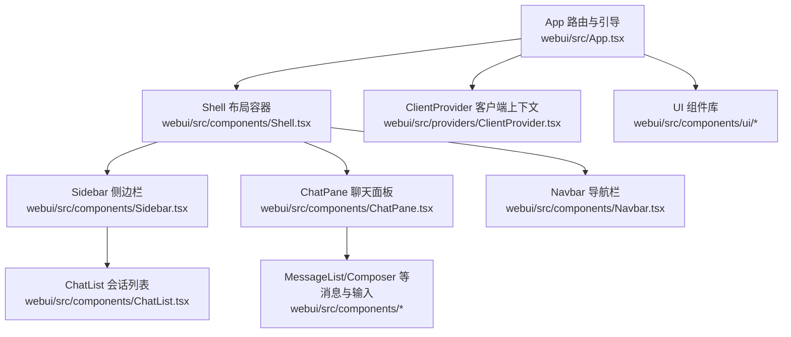
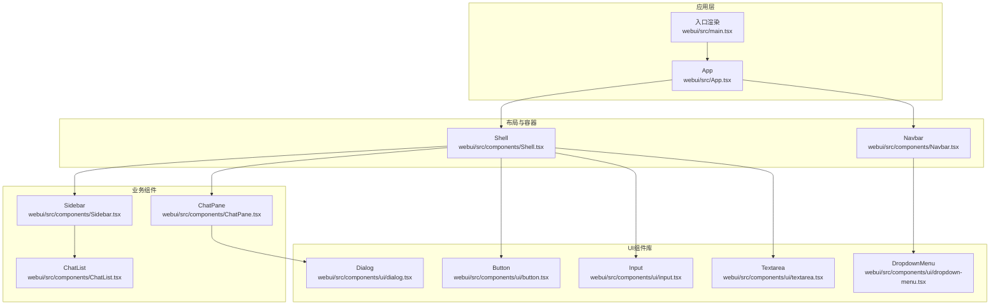
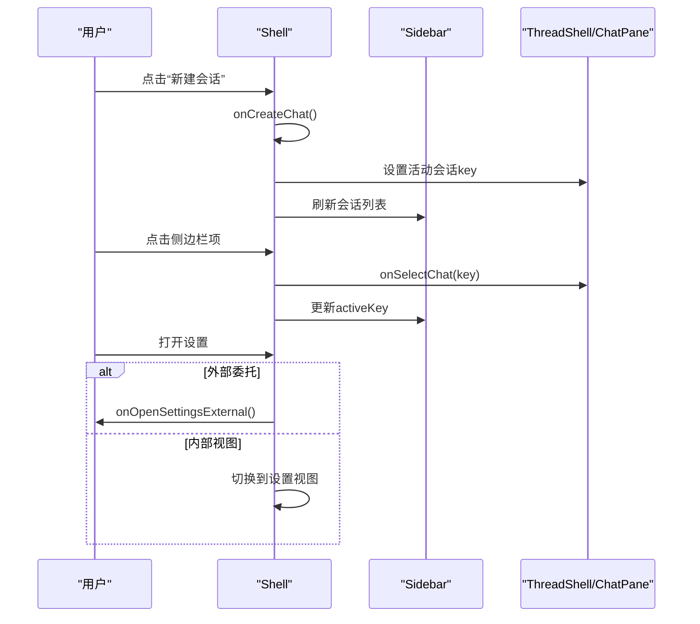
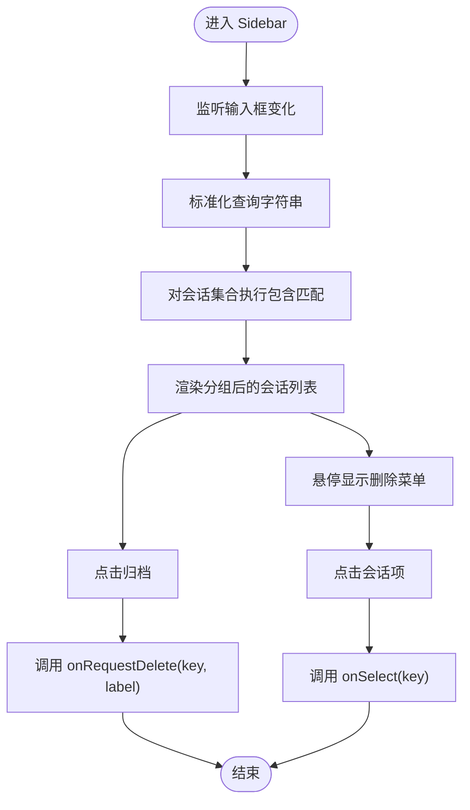
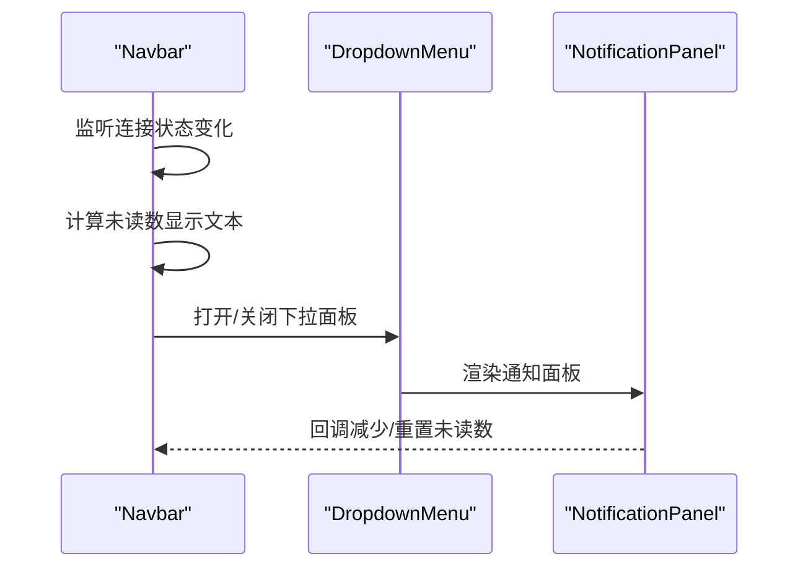
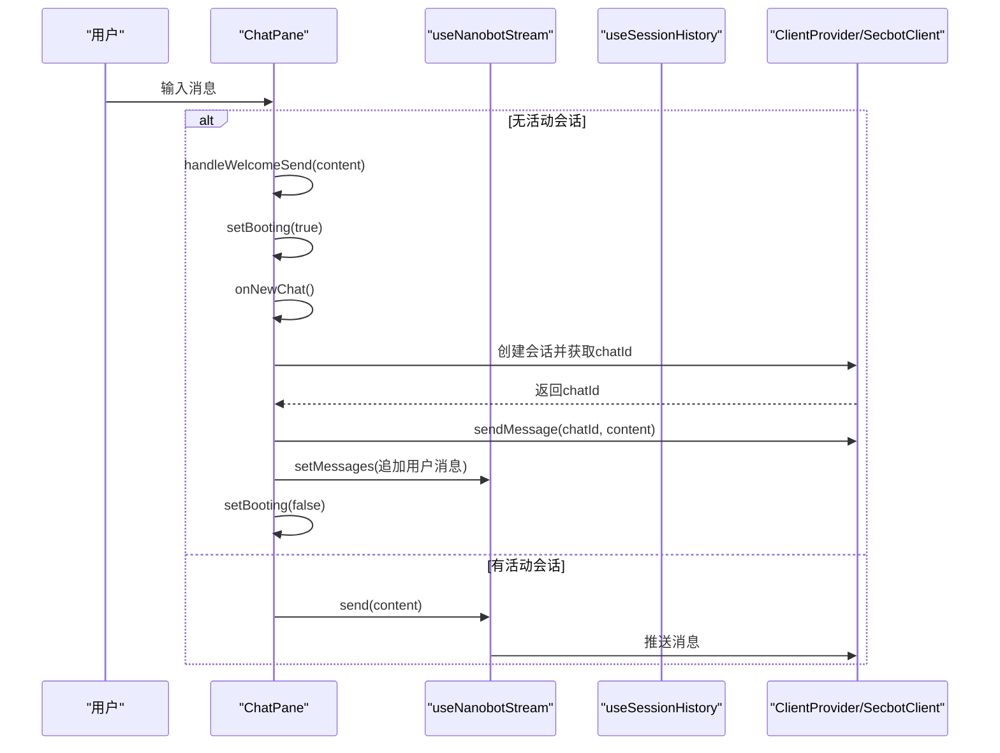
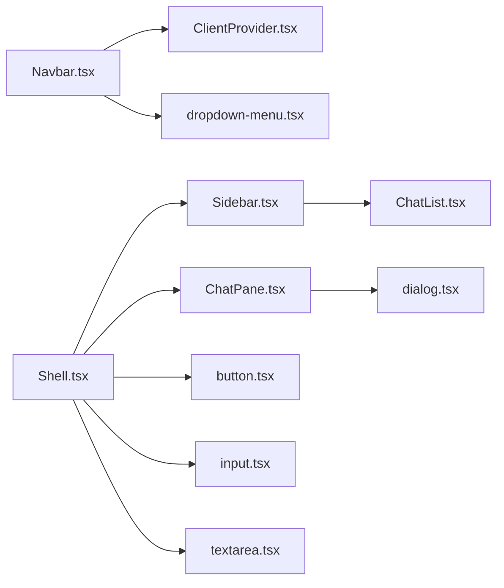

# 组件系统设计

<cite>
**本文引用的文件**
- [webui/src/App.tsx](file://webui/src/App.tsx)
- [webui/src/main.tsx](file://webui/src/main.tsx)
- [webui/src/components/Shell.tsx](file://webui/src/components/Shell.tsx)
- [webui/src/components/Sidebar.tsx](file://webui/src/components/Sidebar.tsx)
- [webui/src/components/Navbar.tsx](file://webui/src/components/Navbar.tsx)
- [webui/src/components/ChatPane.tsx](file://webui/src/components/ChatPane.tsx)
- [webui/src/components/ChatList.tsx](file://webui/src/components/ChatList.tsx)
- [webui/src/components/ui/button.tsx](file://webui/src/components/ui/button.tsx)
- [webui/src/components/ui/dialog.tsx](file://webui/src/components/ui/dialog.tsx)
- [webui/src/components/ui/input.tsx](file://webui/src/components/ui/input.tsx)
- [webui/src/components/ui/dropdown-menu.tsx](file://webui/src/components/ui/dropdown-menu.tsx)
- [webui/src/components/ui/textarea.tsx](file://webui/src/components/ui/textarea.tsx)
</cite>

## 目录
1. [引言](#引言)
2. [项目结构](#项目结构)
3. [核心组件](#核心组件)
4. [架构总览](#架构总览)
5. [详细组件分析](#详细组件分析)
6. [依赖关系分析](#依赖关系分析)
7. [性能考量](#性能考量)
8. [故障排查指南](#故障排查指南)
9. [结论](#结论)
10. [附录](#附录)

## 引言
本文件面向VAPT3前端WebUI的组件系统，围绕Shell外壳组件、Sidebar侧边栏、Navbar导航栏、ChatPane聊天面板等核心模块，系统梳理组件层次结构、数据与控制流、UI组件库（button、dialog、dropdown-menu、input、textarea）的设计与使用规范，并总结组件间通信机制（props传递、上下文共享、事件冒泡）、复用策略与组合模式应用、类型定义与样式定制、响应式设计、性能优化与调试方法。目标是帮助开发者快速理解并高效扩展组件系统。

## 项目结构
WebUI采用以功能域划分的组件组织方式：页面级容器（如Shell、Navbar）负责布局与状态协调；业务组件（如Sidebar、ChatPane）封装具体交互；UI库组件（button、dialog、dropdown-menu、input、textarea）提供可复用的基础能力。路由在App层统一管理，通过ClientProvider注入WebSocket客户端与全局状态。

图表来源
- [webui/src/App.tsx:1-233](file://webui/src/App.tsx#L1-L233)
- [webui/src/components/Shell.tsx:1-374](file://webui/src/components/Shell.tsx#L1-L374)
- [webui/src/components/Sidebar.tsx:1-122](file://webui/src/components/Sidebar.tsx#L1-L122)
- [webui/src/components/Navbar.tsx:1-177](file://webui/src/components/Navbar.tsx#L1-L177)
- [webui/src/components/ChatPane.tsx:1-116](file://webui/src/components/ChatPane.tsx#L1-L116)
- [webui/src/components/ChatList.tsx:1-197](file://webui/src/components/ChatList.tsx#L1-L197)

章节来源
- [webui/src/App.tsx:1-233](file://webui/src/App.tsx#L1-L233)
- [webui/src/main.tsx:1-16](file://webui/src/main.tsx#L1-L16)

## 核心组件
- Shell外壳组件：负责桌面/移动端侧边栏、主内容区、右侧工作台（可选）的布局与状态管理，支持视图切换（聊天/设置）、侧边栏折叠、右rail开关、会话删除确认等。
- Sidebar侧边栏：提供新建会话、搜索过滤、会话列表分组展示、归档入口等。
- Navbar导航栏：提供全局导航链接、连接状态指示、通知下拉面板等。
- ChatPane聊天面板：承载历史消息、实时流式输出与用户输入Composer，支持首次消息自动创建会话并发送。

章节来源
- [webui/src/components/Shell.tsx:1-374](file://webui/src/components/Shell.tsx#L1-L374)
- [webui/src/components/Sidebar.tsx:1-122](file://webui/src/components/Sidebar.tsx#L1-L122)
- [webui/src/components/Navbar.tsx:1-177](file://webui/src/components/Navbar.tsx#L1-L177)
- [webui/src/components/ChatPane.tsx:1-116](file://webui/src/components/ChatPane.tsx#L1-L116)

## 架构总览
组件系统以App为根，通过路由与Provider注入形成“容器-业务-基础UI”三层结构。Shell作为主要布局容器，内部组合Sidebar、ChatPane与Navbar；ChatPane内部通过Hook与Provider消费WebSocket客户端，实现消息历史加载与实时流式推送；Sidebar通过ChatList渲染会话并支持删除操作；Navbar通过DropdownMenu集成通知面板。

图表来源
- [webui/src/App.tsx:1-233](file://webui/src/App.tsx#L1-L233)
- [webui/src/main.tsx:1-16](file://webui/src/main.tsx#L1-L16)
- [webui/src/components/Shell.tsx:1-374](file://webui/src/components/Shell.tsx#L1-L374)
- [webui/src/components/Sidebar.tsx:1-122](file://webui/src/components/Sidebar.tsx#L1-L122)
- [webui/src/components/Navbar.tsx:1-177](file://webui/src/components/Navbar.tsx#L1-L177)
- [webui/src/components/ChatPane.tsx:1-116](file://webui/src/components/ChatPane.tsx#L1-L116)
- [webui/src/components/ChatList.tsx:1-197](file://webui/src/components/ChatList.tsx#L1-L197)
- [webui/src/components/ui/button.tsx:1-57](file://webui/src/components/ui/button.tsx#L1-L57)
- [webui/src/components/ui/dialog.tsx:1-117](file://webui/src/components/ui/dialog.tsx#L1-L117)
- [webui/src/components/ui/dropdown-menu.tsx:1-178](file://webui/src/components/ui/dropdown-menu.tsx#L1-L178)
- [webui/src/components/ui/input.tsx:1-25](file://webui/src/components/ui/input.tsx#L1-L25)
- [webui/src/components/ui/textarea.tsx:1-24](file://webui/src/components/ui/textarea.tsx#L1-L24)

## 详细组件分析

### Shell 外壳组件
- 职责：统一管理桌面/移动端侧边栏、主内容区、可选右侧工作台；维护视图（聊天/设置）切换、侧边栏与右rail的展开/折叠状态；处理会话创建、选择与删除确认。
- 关键特性：
  - 本地存储记忆侧边栏与右rail开合状态；
  - 移动端使用Sheet实现左侧面板抽屉；
  - 支持外部设置打开委托（router模式下将设置路由到独立页面）；
  - 错误边界包裹主内容，避免异常影响整体布局。
- 交互流程：toggleSidebar根据设备宽度切换桌面或移动端状态；onOpenSettings委托或内部切换到设置视图；onCreateChat创建新会话并激活；onConfirmDelete删除会话并回退到相邻会话或空状态。

图表来源
- [webui/src/components/Shell.tsx:144-177](file://webui/src/components/Shell.tsx#L144-L177)
- [webui/src/components/Shell.tsx:215-223](file://webui/src/components/Shell.tsx#L215-L223)
- [webui/src/components/Shell.tsx:273-297](file://webui/src/components/Shell.tsx#L273-L297)

章节来源
- [webui/src/components/Shell.tsx:1-374](file://webui/src/components/Shell.tsx#L1-L374)

### Sidebar 侧边栏
- 职责：提供新建会话按钮、搜索输入框、会话列表（按今日/昨日/更早分组）、底部统计与归档入口。
- 关键特性：
  - 输入框受控，查询字符串标准化后对preview、chatId、channel、key进行包含匹配；
  - 使用ScrollArea提升长列表滚动体验；
  - 会话项支持键盘激活（Enter/Space），点击触发选择；
  - 右键菜单提供删除操作，阻止事件冒泡避免误触。
- 交互流程：输入变化更新过滤结果；点击会话项触发onSelect；点击归档调用onRequestDelete并传入标签；Collapse按钮关闭侧边栏。

图表来源
- [webui/src/components/Sidebar.tsx:21-37](file://webui/src/components/Sidebar.tsx#L21-L37)
- [webui/src/components/Sidebar.tsx:84-93](file://webui/src/components/Sidebar.tsx#L84-L93)
- [webui/src/components/ChatList.tsx:48-169](file://webui/src/components/ChatList.tsx#L48-L169)

章节来源
- [webui/src/components/Sidebar.tsx:1-122](file://webui/src/components/Sidebar.tsx#L1-L122)
- [webui/src/components/ChatList.tsx:1-197](file://webui/src/components/ChatList.tsx#L1-L197)

### Navbar 导航栏
- 职责：提供全局导航链接（首页、仪表盘、任务、设置）、连接状态指示、通知下拉面板。
- 关键特性：
  - 使用NavLink高亮当前路由；
  - 连接状态通过WebSocket客户端状态驱动；
  - 通知徽标支持“99+”上限，避免布局被撑破；
  - 下拉菜单内容通过DropdownMenuContent注入。
- 交互流程：点击通知按钮打开下拉面板；根据未读数显示徽标；点击不同导航项跳转对应路由。

图表来源
- [webui/src/components/Navbar.tsx:39-177](file://webui/src/components/Navbar.tsx#L39-L177)

章节来源
- [webui/src/components/Navbar.tsx:1-177](file://webui/src/components/Navbar.tsx#L1-L177)

### ChatPane 聊天面板
- 职责：承载历史消息与实时流式输出，底部固定Composer；当无活动会话时渲染欢迎卡片并支持首次消息自动创建会话。
- 关键特性：
  - 历史消息通过useSessionHistory加载；实时流通过useNanobotStream订阅；
  - 首次消息发送前异步创建会话，成功后再将消息推送到服务端；
  - 支持禁用状态（等待创建完成）与占位提示。
- 交互流程：无会话时，用户输入内容触发handleWelcomeSend，内部调用onNewChat创建会话并缓存首条消息；会话激活后释放锁并发送缓存消息；有会话时直接通过send发送消息。

图表来源
- [webui/src/components/ChatPane.tsx:23-75](file://webui/src/components/ChatPane.tsx#L23-L75)
- [webui/src/components/ChatPane.tsx:77-115](file://webui/src/components/ChatPane.tsx#L77-L115)

章节来源
- [webui/src/components/ChatPane.tsx:1-116](file://webui/src/components/ChatPane.tsx#L1-L116)

### UI组件库设计与使用规范
- Button（按钮）
  - 设计要点：基于cva提供变体与尺寸变体，支持asChild插槽模式；统一圆角、高度、内边距与焦点/禁用态；
  - 使用建议：优先使用语义化变体（默认、次要、危险、幽灵、链接），图标按钮使用icon尺寸；在复合组件中通过asChild透传事件。
- Dialog（对话框）
  - 设计要点：基于Radix Dialog实现模态遮罩与内容区域，Portal挂载至Portal；提供标题、描述、页脚布局辅助组件；
  - 使用建议：用于重要确认（如删除会话）时，确保有明确的关闭按钮与Esc/遮罩点击关闭行为。
- DropdownMenu（下拉菜单）
  - 设计要点：支持子菜单、复选/单选项、分隔符与插入缩进；内容区域动画入场/出场；
  - 使用建议：在侧边栏会话项中用于删除操作，注意阻止事件冒泡避免误触。
- Input（输入框）
  - 设计要点：统一边框、背景、占位符与聚焦环样式；支持受控属性；
  - 使用建议：配合表单校验与错误提示，避免直接暴露敏感信息。
- Textarea（多行文本）
  - 设计要点：最小高度约束、统一圆角与边框；支持受控属性；
  - 使用建议：用于长文本输入场景，结合字数限制与自动高度调整策略。

章节来源
- [webui/src/components/ui/button.tsx:1-57](file://webui/src/components/ui/button.tsx#L1-L57)
- [webui/src/components/ui/dialog.tsx:1-117](file://webui/src/components/ui/dialog.tsx#L1-L117)
- [webui/src/components/ui/dropdown-menu.tsx:1-178](file://webui/src/components/ui/dropdown-menu.tsx#L1-L178)
- [webui/src/components/ui/input.tsx:1-25](file://webui/src/components/ui/input.tsx#L1-L25)
- [webui/src/components/ui/textarea.tsx:1-24](file://webui/src/components/ui/textarea.tsx#L1-L24)

## 依赖关系分析
- 组件耦合与内聚：
  - Shell与Sidebar强关联（会话列表、选择与删除），但通过props解耦交互回调；
  - ChatPane与Hook/Provider耦合度较高，但职责清晰（仅负责消息流与Composer）；
  - Navbar与ClientProvider存在状态依赖（连接状态、未读数），通过Context共享。
- 外部依赖：
  - Radix UI用于可访问性与动画控制（Dialog、DropdownMenu）；
  - lucide-react提供图标；
  - react-i18next提供国际化文案；
  - localStorage用于持久化UI状态（侧边栏与右rail开关）。
- 潜在循环依赖：
  - 当前文件间未见直接循环导入；若未来在UI组件中引入复杂嵌套，需避免相互依赖。

图表来源
- [webui/src/components/Shell.tsx:1-374](file://webui/src/components/Shell.tsx#L1-L374)
- [webui/src/components/Sidebar.tsx:1-122](file://webui/src/components/Sidebar.tsx#L1-L122)
- [webui/src/components/ChatPane.tsx:1-116](file://webui/src/components/ChatPane.tsx#L1-L116)
- [webui/src/components/ChatList.tsx:1-197](file://webui/src/components/ChatList.tsx#L1-L197)
- [webui/src/components/Navbar.tsx:1-177](file://webui/src/components/Navbar.tsx#L1-L177)
- [webui/src/components/ui/button.tsx:1-57](file://webui/src/components/ui/button.tsx#L1-L57)
- [webui/src/components/ui/dialog.tsx:1-117](file://webui/src/components/ui/dialog.tsx#L1-L117)
- [webui/src/components/ui/dropdown-menu.tsx:1-178](file://webui/src/components/ui/dropdown-menu.tsx#L1-L178)
- [webui/src/components/ui/input.tsx:1-25](file://webui/src/components/ui/input.tsx#L1-L25)
- [webui/src/components/ui/textarea.tsx:1-24](file://webui/src/components/ui/textarea.tsx#L1-L24)

## 性能考量
- 渲染优化
  - 使用useMemo缓存过滤后的会话列表与活动会话对象，降低ChatList重渲染频率。
  - Shell中对localStorage写入进行try/catch保护，避免异常阻塞主线程。
- 数据流优化
  - ChatPane在会话激活后一次性同步历史消息，避免重复渲染。
  - useNanobotStream按需订阅，首次消息创建完成后才开始推送流。
- 交互体验
  - 移动端侧边栏使用Sheet抽屉，避免全屏覆盖导致的重排；
  - 右rail在小屏隐藏，保持核心聊天区域不被压缩。
- 可访问性
  - 所有交互元素提供aria-label与键盘激活支持（Enter/Space）。

章节来源
- [webui/src/components/Shell.tsx:120-123](file://webui/src/components/Shell.tsx#L120-L123)
- [webui/src/components/Shell.tsx:90-110](file://webui/src/components/Shell.tsx#L90-L110)
- [webui/src/components/ChatPane.tsx:31-40](file://webui/src/components/ChatPane.tsx#L31-L40)
- [webui/src/components/ChatPane.tsx:44-60](file://webui/src/components/ChatPane.tsx#L44-L60)
- [webui/src/components/Sidebar.tsx:100-117](file://webui/src/components/Sidebar.tsx#L100-L117)

## 故障排查指南
- 连接失败与认证
  - App在启动阶段尝试fetchBootstrap并建立WebSocket连接；若返回401/403，显示认证表单；其他错误弹窗提示并回退到认证状态。
  - 登出时关闭客户端连接并清除保存的密钥。
- 会话创建/删除异常
  - onCreateChat与onConfirmDelete均包含try/catch与回退逻辑；删除失败时恢复活动会话key。
- UI状态异常
  - Shell对localStorage读写异常进行兜底；Navbar徽标上限避免布局溢出。
- 调试建议
  - 在ChatPane中观察首次消息创建流程，确认onNewChat返回值与sendMessage调用顺序；
  - 在Sidebar中检查过滤逻辑与事件冒泡是否被正确阻止；
  - 在Navbar中验证连接状态监听与未读数回调链路。

章节来源
- [webui/src/App.tsx:57-102](file://webui/src/App.tsx#L57-L102)
- [webui/src/App.tsx:137-144](file://webui/src/App.tsx#L137-L144)
- [webui/src/components/Shell.tsx:183-201](file://webui/src/components/Shell.tsx#L183-L201)
- [webui/src/components/Navbar.tsx:47-57](file://webui/src/components/Navbar.tsx#L47-L57)

## 结论
VAPT3的组件系统以Shell为核心容器，通过清晰的props传递与Context共享实现布局、业务与基础UI的解耦；UI组件库遵循一致的样式与可访问性规范；在交互上强调组合模式与复用策略，既满足桌面/移动端适配，又保证了良好的用户体验与可维护性。建议后续在复杂嵌套场景中进一步强化类型约束与单元测试覆盖，持续优化首屏与流式渲染性能。

## 附录
- 组件开发最佳实践
  - 类型定义：为所有props接口提供明确字段与可选性标注，避免any泛滥；
  - 样式定制：统一使用Tailwind类名与cn工具函数，避免内联样式的滥用；
  - 响应式设计：在Shell中利用断点控制侧边栏与右rail显隐，确保小屏可用性；
  - 事件冒泡：在DropdownMenu等复合组件中显式阻止事件冒泡，防止意外触发父级交互；
  - 组合模式：将通用行为抽象为Hook（如useSessions、useNanobotStream），组件仅负责渲染与调度。
- 性能优化技巧
  - 使用useMemo/useCallback稳定子组件依赖；
  - 将昂贵计算与副作用隔离在Hook中，减少渲染成本；
  - 对长列表使用虚拟化或分页策略（当前已使用ScrollArea，可考虑进一步优化）；
  - 流式渲染中采用增量更新与节流策略，避免频繁重排。
- 调试方法
  - 利用React DevTools查看组件树与状态变化；
  - 在关键路径添加日志与错误边界，定位异常来源；
  - 使用浏览器网络面板监控WebSocket连接与消息往返。