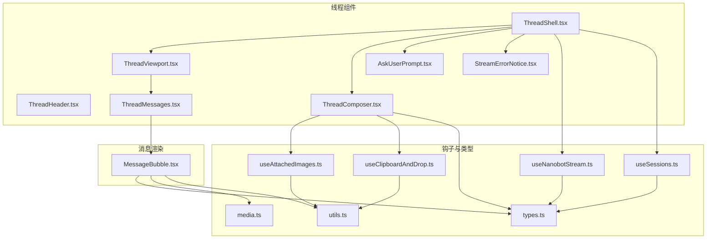
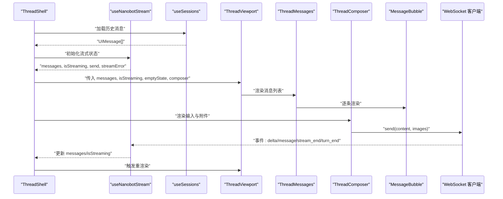
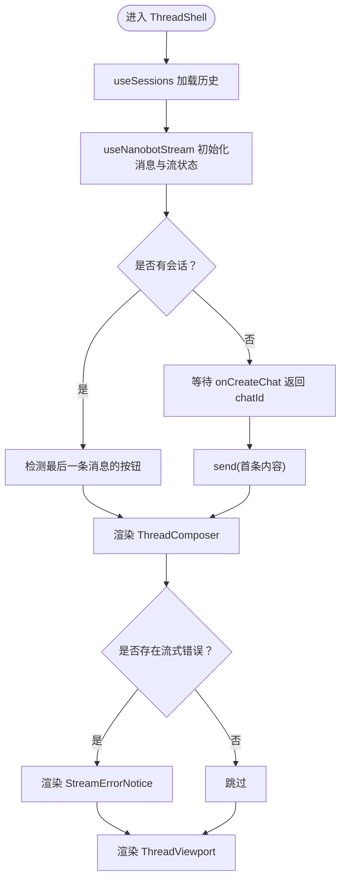
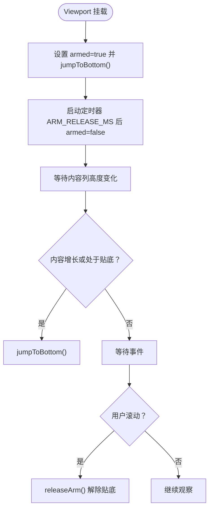
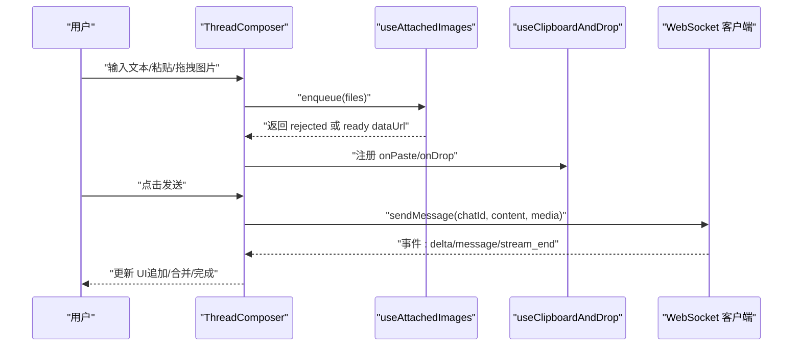
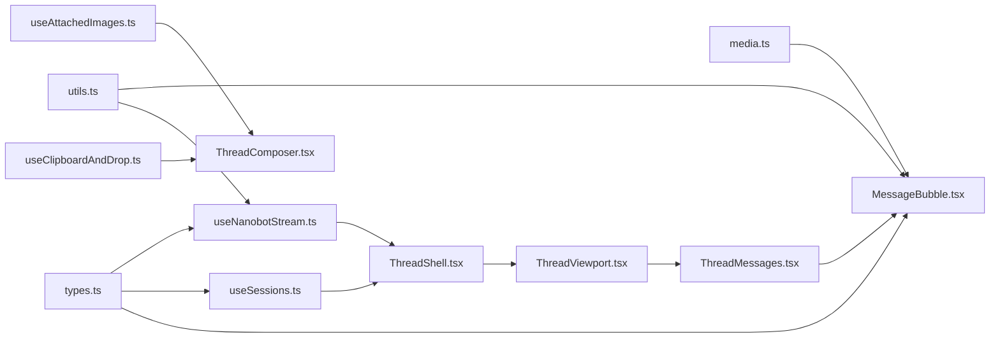

# 聊天线程组件

<cite>
**本文引用的文件**
- [ThreadShell.tsx](file://webui/src/components/thread/ThreadShell.tsx)
- [ThreadViewport.tsx](file://webui/src/components/thread/ThreadViewport.tsx)
- [ThreadHeader.tsx](file://webui/src/components/thread/ThreadHeader.tsx)
- [ThreadMessages.tsx](file://webui/src/components/thread/ThreadMessages.tsx)
- [ThreadComposer.tsx](file://webui/src/components/thread/ThreadComposer.tsx)
- [AskUserPrompt.tsx](file://webui/src/components/thread/AskUserPrompt.tsx)
- [StreamErrorNotice.tsx](file://webui/src/components/thread/StreamErrorNotice.tsx)
- [types.ts](file://webui/src/lib/types.ts)
- [useNanobotStream.ts](file://webui/src/hooks/useNanobotStream.ts)
- [useSessions.ts](file://webui/src/hooks/useSessions.ts)
- [useAttachedImages.ts](file://webui/src/hooks/useAttachedImages.ts)
- [useClipboardAndDrop.ts](file://webui/src/hooks/useClipboardAndDrop.ts)
- [MessageBubble.tsx](file://webui/src/components/MessageBubble.tsx)
- [media.ts](file://webui/src/lib/media.ts)
- [utils.ts](file://webui/src/lib/utils.ts)
</cite>

## 目录
1. [简介](#简介)
2. [项目结构](#项目结构)
3. [核心组件](#核心组件)
4. [架构总览](#架构总览)
5. [详细组件分析](#详细组件分析)
6. [依赖关系分析](#依赖关系分析)
7. [性能考量](#性能考量)
8. [故障排查指南](#故障排查指南)
9. [结论](#结论)
10. [附录：扩展与自定义指南](#附录扩展与自定义指南)

## 简介
本文件面向 VAPT3 的聊天线程组件系统，围绕 ThreadShell 外壳容器、ThreadViewport 视口滚动与虚拟化、ThreadHeader 头部、ThreadMessages 消息列表、ThreadComposer 消息 Composer（富文本、附件、发送）、AskUserPrompt 用户提示、StreamErrorNotice 流式错误通知等模块进行深入技术说明，并提供扩展与自定义开发指南。目标是帮助开发者快速理解并高效迭代聊天交互体验。

## 项目结构
聊天线程相关代码集中在 webui/src/components/thread 与 webui/src/hooks 下，配合 lib/types 定义消息与媒体数据结构，以及若干 UI 组件与工具函数。

图表来源
- [ThreadShell.tsx:54-266](file://webui/src/components/thread/ThreadShell.tsx#L54-L266)
- [ThreadViewport.tsx:35-203](file://webui/src/components/thread/ThreadViewport.tsx#L35-L203)
- [ThreadHeader.tsx:25-107](file://webui/src/components/thread/ThreadHeader.tsx#L25-L107)
- [ThreadMessages.tsx:8-16](file://webui/src/components/thread/ThreadMessages.tsx#L8-L16)
- [ThreadComposer.tsx:82-700](file://webui/src/components/thread/ThreadComposer.tsx#L82-L700)
- [AskUserPrompt.tsx:13-108](file://webui/src/components/thread/AskUserPrompt.tsx#L13-L108)
- [StreamErrorNotice.tsx:19-72](file://webui/src/components/thread/StreamErrorNotice.tsx#L19-L72)
- [useNanobotStream.ts:38-318](file://webui/src/hooks/useNanobotStream.ts#L38-L318)
- [useSessions.ts:213-302](file://webui/src/hooks/useSessions.ts#L213-L302)
- [useAttachedImages.ts:101-233](file://webui/src/hooks/useAttachedImages.ts#L101-L233)
- [useClipboardAndDrop.ts:60-111](file://webui/src/hooks/useClipboardAndDrop.ts#L60-L111)
- [types.ts:33-49](file://webui/src/lib/types.ts#L33-L49)
- [MessageBubble.tsx:23-134](file://webui/src/components/MessageBubble.tsx#L23-L134)
- [media.ts:37-58](file://webui/src/lib/media.ts#L37-L58)
- [utils.ts:4-33](file://webui/src/lib/utils.ts#L4-L33)

章节来源
- [ThreadShell.tsx:54-266](file://webui/src/components/thread/ThreadShell.tsx#L54-L266)
- [ThreadViewport.tsx:35-203](file://webui/src/components/thread/ThreadViewport.tsx#L35-L203)
- [ThreadHeader.tsx:25-107](file://webui/src/components/thread/ThreadHeader.tsx#L25-L107)
- [ThreadMessages.tsx:8-16](file://webui/src/components/thread/ThreadMessages.tsx#L8-L16)
- [ThreadComposer.tsx:82-700](file://webui/src/components/thread/ThreadComposer.tsx#L82-L700)
- [AskUserPrompt.tsx:13-108](file://webui/src/components/thread/AskUserPrompt.tsx#L13-L108)
- [StreamErrorNotice.tsx:19-72](file://webui/src/components/thread/StreamErrorNotice.tsx#L19-L72)
- [useNanobotStream.ts:38-318](file://webui/src/hooks/useNanobotStream.ts#L38-L318)
- [useSessions.ts:213-302](file://webui/src/hooks/useSessions.ts#L213-L302)
- [useAttachedImages.ts:101-233](file://webui/src/hooks/useAttachedImages.ts#L101-L233)
- [useClipboardAndDrop.ts:60-111](file://webui/src/hooks/useClipboardAndDrop.ts#L60-L111)
- [types.ts:33-49](file://webui/src/lib/types.ts#L33-L49)
- [MessageBubble.tsx:23-134](file://webui/src/components/MessageBubble.tsx#L23-L134)
- [media.ts:37-58](file://webui/src/lib/media.ts#L37-L58)
- [utils.ts:4-33](file://webui/src/lib/utils.ts#L4-L33)

## 核心组件
- ThreadShell：聊天线程外壳容器，负责消息状态、欢迎态、快捷动作、AskUserPrompt、StreamErrorNotice 与 ThreadComposer 的组合编排；通过 useNanobotStream 管理流式状态与消息列表；通过 useSessions 获取历史消息。
- ThreadViewport：滚动与自动定位管理，支持“武装”自动贴底、ResizeObserver 延迟贴底、手动滚动释放、底部回到按钮。
- ThreadHeader：会话标题、在线状态指示、右侧面板开关、仪表盘入口等。
- ThreadMessages：消息列表容器，遍历渲染 MessageBubble。
- ThreadComposer：富文本输入、斜杠命令、拖拽/粘贴/选择图片、发送与停止、乐观预览与回滚。
- AskUserPrompt：展示待回答问题与按钮，支持自定义输入。
- StreamErrorNotice：流式传输错误横幅，可被用户关闭。

章节来源
- [ThreadShell.tsx:54-266](file://webui/src/components/thread/ThreadShell.tsx#L54-L266)
- [ThreadViewport.tsx:35-203](file://webui/src/components/thread/ThreadViewport.tsx#L35-L203)
- [ThreadHeader.tsx:25-107](file://webui/src/components/thread/ThreadHeader.tsx#L25-L107)
- [ThreadMessages.tsx:8-16](file://webui/src/components/thread/ThreadMessages.tsx#L8-L16)
- [ThreadComposer.tsx:82-700](file://webui/src/components/thread/ThreadComposer.tsx#L82-L700)
- [AskUserPrompt.tsx:13-108](file://webui/src/components/thread/AskUserPrompt.tsx#L13-L108)
- [StreamErrorNotice.tsx:19-72](file://webui/src/components/thread/StreamErrorNotice.tsx#L19-L72)

## 架构总览
整体采用“容器-视口-输入-消息”的分层设计，状态由 useNanobotStream 驱动，历史消息通过 useSessions 加载，Composer 通过 Worker 进行图片编码与预览，最终通过 WebSocket 客户端发送消息并接收增量流。

图表来源
- [ThreadShell.tsx:68-87](file://webui/src/components/thread/ThreadShell.tsx#L68-L87)
- [useNanobotStream.ts:116-280](file://webui/src/hooks/useNanobotStream.ts#L116-L280)
- [useSessions.ts:213-302](file://webui/src/hooks/useSessions.ts#L213-L302)
- [ThreadViewport.tsx:139-202](file://webui/src/components/thread/ThreadViewport.tsx#L139-L202)
- [ThreadMessages.tsx:8-16](file://webui/src/components/thread/ThreadMessages.tsx#L8-L16)
- [MessageBubble.tsx:23-134](file://webui/src/components/MessageBubble.tsx#L23-L134)

## 详细组件分析

### ThreadShell 外壳容器
- 职责
  - 合成消息初始集：优先使用当前会话缓存，否则回退到历史接口。
  - 管理欢迎态与首次消息：在无会话时，先创建会话再发送首条消息，避免“空聊天”状态。
  - 渲染 AskUserPrompt：当最后一条非 trace 且非 user 的消息包含按钮时，弹出选择。
  - 渲染 StreamErrorNotice：在 Composer 上方展示传输级错误。
  - 编排 ThreadComposer：根据是否已有会话、是否正在流式、占位符与模型标签动态切换。
  - 快捷动作：提供计划、分析、创意、代码、总结、更多等快捷键。
- 状态与缓存
  - 使用内存 Map 缓存每个 chatId 的消息，避免切回时丢失未持久化的本地消息。
  - 在 chat 切换后延迟写入，防止“旧消息覆盖新消息”的竞态。
- 事件与副作用
  - 加载斜杠命令列表，供 Composer 使用。
  - 监听流式错误并提供 dismiss。
  - 通过 onTurnEnd 回调通知上层。

图表来源
- [ThreadShell.tsx:68-166](file://webui/src/components/thread/ThreadShell.tsx#L68-L166)
- [useNanobotStream.ts:38-114](file://webui/src/hooks/useNanobotStream.ts#L38-L114)
- [useSessions.ts:213-302](file://webui/src/hooks/useSessions.ts#L213-L302)

章节来源
- [ThreadShell.tsx:54-266](file://webui/src/components/thread/ThreadShell.tsx#L54-L266)
- [useNanobotStream.ts:38-114](file://webui/src/hooks/useNanobotStream.ts#L38-L114)
- [useSessions.ts:213-302](file://webui/src/hooks/useSessions.ts#L213-L302)

### ThreadViewport 视口滚动与自动定位
- 自动贴底策略
  - “武装”窗口：首次打开或切换会话时，短时间（约 1.5 秒）内对内容增长（如图片解码、字体渲染）持续贴底，避免首开“落顶”。
  - 手动滚动释放：用户滚动即释放自动贴底，恢复自由滚动。
  - 内容增长监听：ResizeObserver 监听内容列高度变化，若处于贴底或武装状态则立即贴底。
  - 流式中贴底：在非武装期且已贴底时，新消息到达也保持贴底。
- 底部回到按钮
  - 当未贴底时显示“回到底部”按钮，点击立即贴底并释放武装。
- 关键参数
  - 距离底部阈值、武装释放时间、滚动容器与内容列引用。

图表来源
- [ThreadViewport.tsx:76-137](file://webui/src/components/thread/ThreadViewport.tsx#L76-L137)

章节来源
- [ThreadViewport.tsx:35-203](file://webui/src/components/thread/ThreadViewport.tsx#L35-L203)

### ThreadHeader 头部组件
- 展示标题与机器人头像、在线状态徽章。
- 提供侧边栏开关、右侧面板开关、仪表盘入口等操作按钮。
- 支持最小模式，用于极简场景。

章节来源
- [ThreadHeader.tsx:25-107](file://webui/src/components/thread/ThreadHeader.tsx#L25-L107)

### ThreadMessages 消息列表
- 将 UIMessage 数组映射为 MessageBubble 列表。
- 不渲染 kind=trace 的消息（由 MessageBubble 内部处理）。

章节来源
- [ThreadMessages.tsx:8-16](file://webui/src/components/thread/ThreadMessages.tsx#L8-L16)
- [MessageBubble.tsx:23-134](file://webui/src/components/MessageBubble.tsx#L23-L134)

### ThreadComposer 消息 Composer
- 富文本输入
  - 可调整高度，最大高度限制。
  - 占位符随流式状态与变体切换。
- 斜杠命令
  - 输入“/”时过滤可用命令，支持上下导航与 Tab/Enter 选择。
  - 命令标题与描述支持国际化。
- 图片附件
  - 支持拖拽、粘贴、文件选择。
  - 通过 Worker 编码为 data URL，生成预览图，支持移除与键盘删除。
  - 限制每条消息最多 4 张图，拒绝类型与大小超限。
- 发送与停止
  - 发送时乐观插入用户消息，立即标记流式中；随后通过 WebSocket 发送。
  - 停止按钮调用客户端停止接口。
- 乐观预览
  - 用户消息携带 images 预览，服务端确认后再替换为真实资源。

图表来源
- [ThreadComposer.tsx:104-276](file://webui/src/components/thread/ThreadComposer.tsx#L104-L276)
- [useAttachedImages.ts:117-177](file://webui/src/hooks/useAttachedImages.ts#L117-L177)
- [useClipboardAndDrop.ts:60-111](file://webui/src/hooks/useClipboardAndDrop.ts#L60-L111)
- [useNanobotStream.ts:282-308](file://webui/src/hooks/useNanobotStream.ts#L282-L308)

章节来源
- [ThreadComposer.tsx:82-700](file://webui/src/components/thread/ThreadComposer.tsx#L82-L700)
- [useAttachedImages.ts:101-233](file://webui/src/hooks/useAttachedImages.ts#L101-L233)
- [useClipboardAndDrop.ts:60-111](file://webui/src/hooks/useClipboardAndDrop.ts#L60-L111)
- [useNanobotStream.ts:282-308](file://webui/src/hooks/useNanobotStream.ts#L282-L308)

### AskUserPrompt 用户提示
- 展示问题与按钮组，支持展开“其他”自定义输入。
- 提交后回调 onAnswer，继续对话流程。

章节来源
- [AskUserPrompt.tsx:13-108](file://webui/src/components/thread/AskUserPrompt.tsx#L13-L108)

### StreamErrorNotice 流式错误通知
- 展示传输级错误标题与正文，支持关闭。
- 语义化角色与无障碍属性确保读屏可达。

章节来源
- [StreamErrorNotice.tsx:19-72](file://webui/src/components/thread/StreamErrorNotice.tsx#L19-L72)

## 依赖关系分析
- 数据模型
  - UIMessage、ChatSummary、SlashCommand 等类型定义于 types.ts。
  - 媒体类型推断与转换位于 media.ts。
- 状态与流
  - useNanobotStream 负责 WebSocket 事件订阅、增量合并、turn 结束与流结束处理。
  - useSessions 负责会话列表与历史消息加载，重建 trace 分组。
- 附件与剪贴板
  - useAttachedImages 负责校验、编码、预览、焦点管理。
  - useClipboardAndDrop 负责粘贴/拖拽提取图片文件。
- 渲染与工具
  - MessageBubble 负责消息气泡、媒体卡片、复制、打字动画与 trace 折叠。
  - utils 提供类名合并与随机 ID。

图表来源
- [types.ts:33-49](file://webui/src/lib/types.ts#L33-L49)
- [media.ts:37-58](file://webui/src/lib/media.ts#L37-L58)
- [utils.ts:4-33](file://webui/src/lib/utils.ts#L4-L33)
- [useNanobotStream.ts:38-318](file://webui/src/hooks/useNanobotStream.ts#L38-L318)
- [useSessions.ts:213-302](file://webui/src/hooks/useSessions.ts#L213-L302)
- [useAttachedImages.ts:101-233](file://webui/src/hooks/useAttachedImages.ts#L101-L233)
- [useClipboardAndDrop.ts:60-111](file://webui/src/hooks/useClipboardAndDrop.ts#L60-L111)
- [MessageBubble.tsx:23-134](file://webui/src/components/MessageBubble.tsx#L23-L134)
- [ThreadShell.tsx:54-266](file://webui/src/components/thread/ThreadShell.tsx#L54-L266)
- [ThreadViewport.tsx:35-203](file://webui/src/components/thread/ThreadViewport.tsx#L35-L203)
- [ThreadMessages.tsx:8-16](file://webui/src/components/thread/ThreadMessages.tsx#L8-L16)

章节来源
- [types.ts:33-49](file://webui/src/lib/types.ts#L33-L49)
- [media.ts:37-58](file://webui/src/lib/media.ts#L37-L58)
- [utils.ts:4-33](file://webui/src/lib/utils.ts#L4-L33)
- [useNanobotStream.ts:38-318](file://webui/src/hooks/useNanobotStream.ts#L38-L318)
- [useSessions.ts:213-302](file://webui/src/hooks/useSessions.ts#L213-L302)
- [useAttachedImages.ts:101-233](file://webui/src/hooks/useAttachedImages.ts#L101-L233)
- [useClipboardAndDrop.ts:60-111](file://webui/src/hooks/useClipboardAndDrop.ts#L60-L111)
- [MessageBubble.tsx:23-134](file://webui/src/components/MessageBubble.tsx#L23-L134)
- [ThreadShell.tsx:54-266](file://webui/src/components/thread/ThreadShell.tsx#L54-L266)
- [ThreadViewport.tsx:35-203](file://webui/src/components/thread/ThreadViewport.tsx#L35-L203)
- [ThreadMessages.tsx:8-16](file://webui/src/components/thread/ThreadMessages.tsx#L8-L16)

## 性能考量
- 滚动与渲染
  - ThreadViewport 使用 ResizeObserver 与 armed 机制避免首开“落顶”，减少不必要的滚动计算。
  - MessageBubble 对图片懒加载与缩略图尺寸控制，降低布局抖动。
- 附件处理
  - 图片通过 Worker 编码，避免主线程阻塞；预览 URL 在提交后安全撤销，避免内存泄漏。
- 状态更新
  - useNanobotStream 仅在权威事件（attached/delta/message/stream_end/turn_end）更新 isStreaming，避免误判导致的 UI 闪烁。
- 防抖与去抖
  - 流结束后的短暂延时才清除 isStreaming，保证跨工具调用边界时的连续性。

[本节为通用性能建议，不直接分析具体文件]

## 故障排查指南
- 无法看到最新消息
  - 检查 ThreadViewport 是否处于 armed 状态或贴底；尝试点击“回到底部”按钮。
  - 确认 useNanobotStream 的 isStreaming 是否正确由 attached 事件驱动。
- 发送失败或报错
  - 查看 StreamErrorNotice 的错误类型与文案；点击“关闭”清除。
  - 确认网络连接与 WebSocket 客户端状态。
- 附件无法上传
  - 检查文件类型是否在白名单内（PNG/JPEG/WEBP/GIF），数量是否超过上限。
  - 查看附件芯片中的错误提示，确认是否为解码失败或过大。
- 历史消息缺失
  - useSessions 在 404 场景下视为正常，不会报错；确认会话是否已持久化。

章节来源
- [ThreadViewport.tsx:76-137](file://webui/src/components/thread/ThreadViewport.tsx#L76-L137)
- [useNanobotStream.ts:79-114](file://webui/src/hooks/useNanobotStream.ts#L79-L114)
- [StreamErrorNotice.tsx:19-72](file://webui/src/components/thread/StreamErrorNotice.tsx#L19-L72)
- [useAttachedImages.ts:117-177](file://webui/src/hooks/useAttachedImages.ts#L117-L177)
- [useSessions.ts:250-285](file://webui/src/hooks/useSessions.ts#L250-L285)

## 结论
该聊天线程组件体系以 ThreadShell 为核心容器，结合 useNanobotStream 的流式状态管理、ThreadViewport 的智能滚动、ThreadComposer 的富文本与附件能力，以及 AskUserPrompt 与 StreamErrorNotice 的交互与错误处理，形成了稳定、可扩展的聊天界面。通过清晰的数据模型与钩子职责划分，既保证了用户体验，也为后续功能扩展提供了良好基础。

[本节为总结性内容，不直接分析具体文件]

## 附录：扩展与自定义指南
- 新增斜杠命令
  - 在后端提供命令清单后，前端通过 listSlashCommands 获取并在 Composer 中启用过滤与选择。
  - 参考路径：[ThreadShell.tsx:153-166](file://webui/src/components/thread/ThreadShell.tsx#L153-L166)、[ThreadComposer.tsx:166-185](file://webui/src/components/thread/ThreadComposer.tsx#L166-L185)
- 自定义占位符与模型标签
  - 通过 props 动态传入 placeholder 与 modelLabel，影响 Composer 的占位与徽标显示。
  - 参考路径：[ThreadShell.tsx:208-235](file://webui/src/components/thread/ThreadShell.tsx#L208-L235)、[ThreadComposer.tsx:82-90](file://webui/src/components/thread/ThreadComposer.tsx#L82-L90)
- 自定义快捷动作
  - 在 ThreadShell 中扩展 QUICK_ACTION_KEYS，添加图标与回调。
  - 参考路径：[ThreadShell.tsx:45-52](file://webui/src/components/thread/ThreadShell.tsx#L45-L52)、[ThreadShell.tsx:182-191](file://webui/src/components/thread/ThreadShell.tsx#L182-L191)
- 自定义 AskUserPrompt 行为
  - 在 ThreadShell 中根据消息按钮动态渲染 AskUserPrompt，并将答案通过 send 回调继续对话。
  - 参考路径：[ThreadShell.tsx:89-103](file://webui/src/components/thread/ThreadShell.tsx#L89-L103)、[AskUserPrompt.tsx:13-108](file://webui/src/components/thread/AskUserPrompt.tsx#L13-L108)
- 自定义错误提示
  - 在 StreamErrorNotice 中新增错误类型分支与 i18n 文案，保持无障碍属性与动画一致性。
  - 参考路径：[StreamErrorNotice.tsx:55-72](file://webui/src/components/thread/StreamErrorNotice.tsx#L55-L72)
- 自定义消息渲染
  - 在 MessageBubble 中扩展媒体类型、复制行为、trace 折叠逻辑，或引入新的消息角色。
  - 参考路径：[MessageBubble.tsx:23-134](file://webui/src/components/MessageBubble.tsx#L23-L134)、[media.ts:37-58](file://webui/src/lib/media.ts#L37-L58)
- 自定义滚动行为
  - 调整 ThreadViewport 的 armed 时间、阈值与贴底策略，适配长文/大图场景。
  - 参考路径：[ThreadViewport.tsx:29-98](file://webui/src/components/thread/ThreadViewport.tsx#L29-L98)