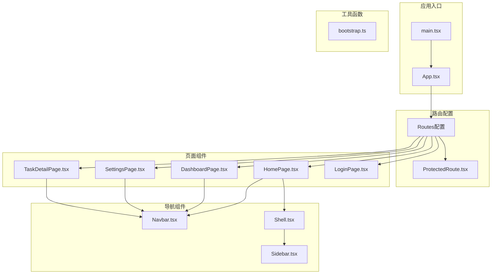
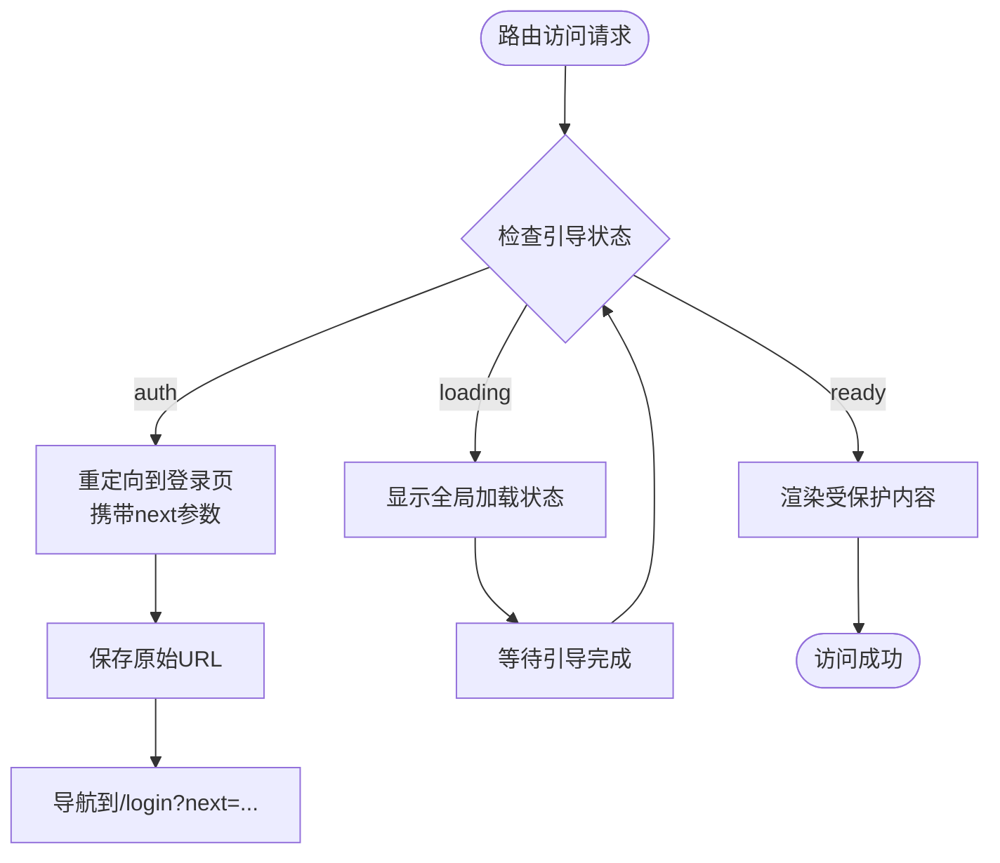
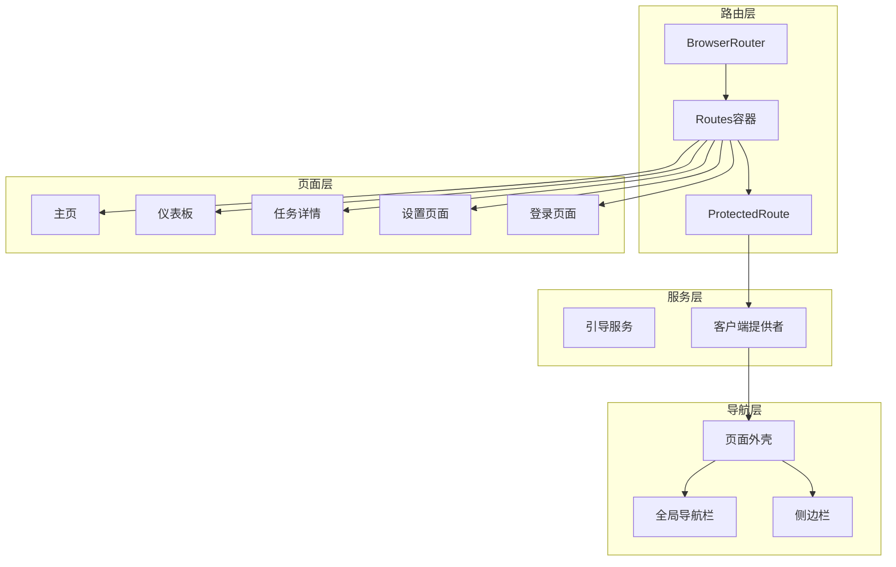
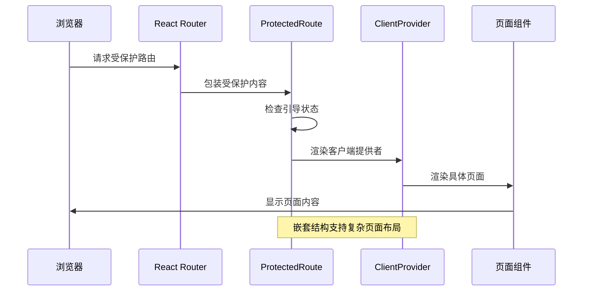
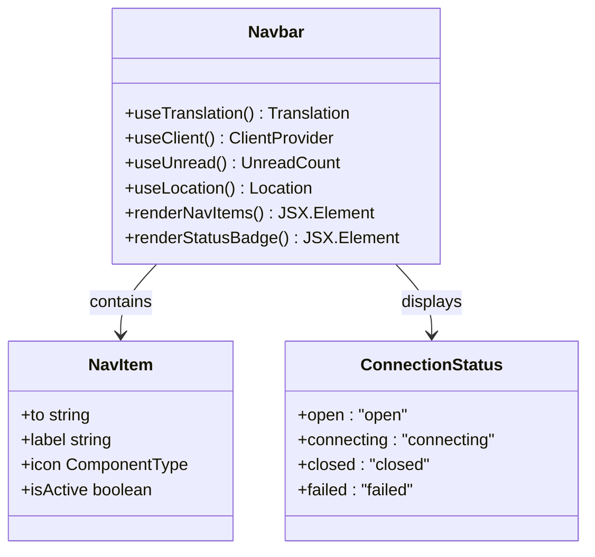
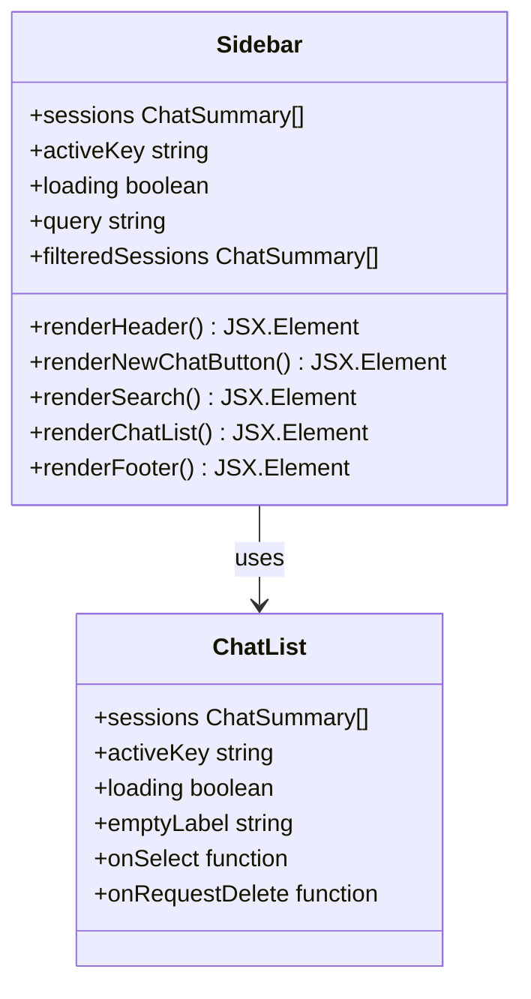
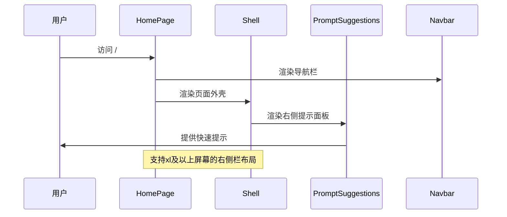
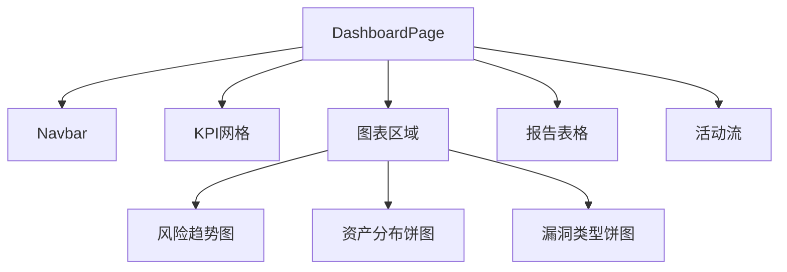
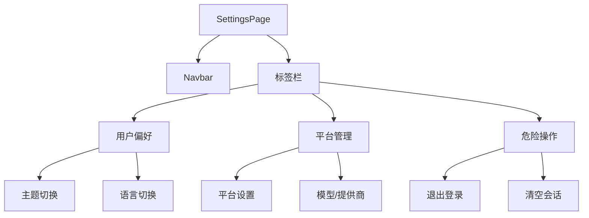
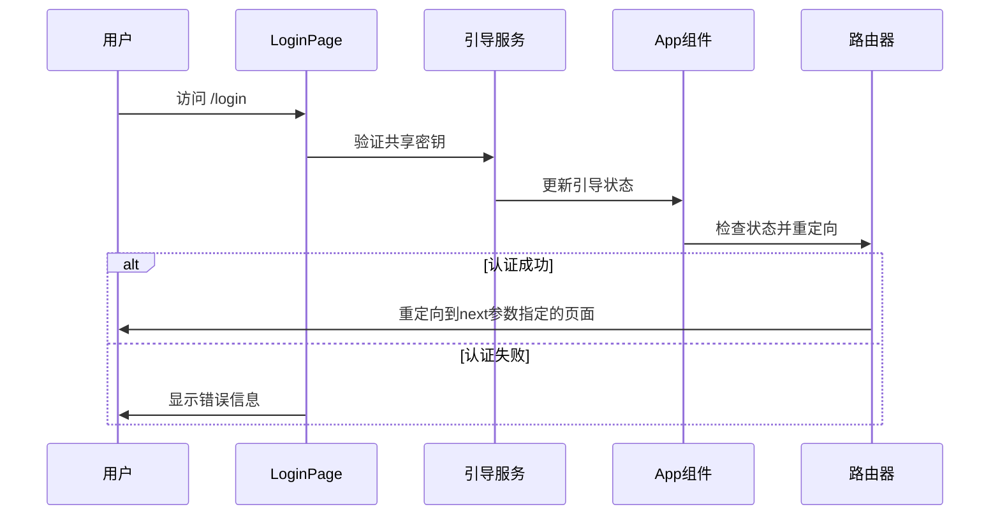

# 路由与导航系统

<cite>
**本文档引用的文件**
- [App.tsx](file://webui/src/App.tsx)
- [main.tsx](file://webui/src/main.tsx)
- [ProtectedRoute.tsx](file://webui/src/components/ProtectedRoute.tsx)
- [Shell.tsx](file://webui/src/components/Shell.tsx)
- [Navbar.tsx](file://webui/src/components/Navbar.tsx)
- [Sidebar.tsx](file://webui/src/components/Sidebar.tsx)
- [DashboardPage.tsx](file://webui/src/pages/DashboardPage.tsx)
- [HomePage.tsx](file://webui/src/pages/HomePage.tsx)
- [TaskDetailPage.tsx](file://webui/src/pages/TaskDetailPage.tsx)
- [SettingsPage.tsx](file://webui/src/pages/SettingsPage.tsx)
- [LoginPage.tsx](file://webui/src/pages/LoginPage.tsx)
- [bootstrap.ts](file://webui/src/lib/bootstrap.ts)
- [package.json](file://webui/package.json)
</cite>

## 目录
1. [简介](#简介)
2. [项目结构](#项目结构)
3. [核心组件](#核心组件)
4. [架构概览](#架构概览)
5. [详细组件分析](#详细组件分析)
6. [依赖关系分析](#依赖关系分析)
7. [性能考虑](#性能考虑)
8. [故障排除指南](#故障排除指南)
9. [结论](#结论)

## 简介

VAPT3的路由与导航系统基于React Router v7构建，采用现代化的路由配置模式，实现了完整的认证保护机制、嵌套路由结构和动态路由功能。该系统支持多种导航模式，包括全局导航栏、侧边栏导航和面包屑导航，并提供了丰富的用户体验优化功能。

系统的核心特点包括：
- 基于状态的路由保护机制
- 响应式导航设计
- 动态路由参数处理
- 嵌套路由结构
- 导航状态持久化
- 性能优化的懒加载策略

## 项目结构

WebUI项目的路由与导航系统主要分布在以下目录结构中：



**图表来源**
- [main.tsx:1-16](file://webui/src/main.tsx#L1-L16)
- [App.tsx:174-232](file://webui/src/App.tsx#L174-L232)

**章节来源**
- [main.tsx:1-16](file://webui/src/main.tsx#L1-L16)
- [package.json:1-67](file://webui/package.json#L1-L67)

## 核心组件

### 路由保护机制

系统采用基于状态的路由保护机制，通过`ProtectedRoute`组件实现认证检查和权限验证：



**图表来源**
- [ProtectedRoute.tsx:42-59](file://webui/src/components/ProtectedRoute.tsx#L42-L59)

### 引导状态管理

应用使用统一的状态管理系统来协调路由保护和客户端连接：

| 状态 | 描述 | 行为 |
|------|------|------|
| loading | 应用启动阶段 | 显示全局加载指示器 |
| auth | 未认证状态 | 显示登录表单，支持错误提示 |
| ready | 认证完成 | 允许访问受保护内容 |

**章节来源**
- [ProtectedRoute.tsx:11-19](file://webui/src/components/ProtectedRoute.tsx#L11-L19)
- [App.tsx:54-102](file://webui/src/App.tsx#L54-L102)

## 架构概览

系统采用分层架构设计，将路由配置、导航组件和页面组件分离：



**图表来源**
- [App.tsx:180-232](file://webui/src/App.tsx#L180-L232)
- [Shell.tsx:70-75](file://webui/src/components/Shell.tsx#L70-L75)

## 详细组件分析

### 路由配置与嵌套路由

系统采用嵌套路由结构，通过`Outlet`组件实现内容区域的动态渲染：



**图表来源**
- [App.tsx:187-226](file://webui/src/App.tsx#L187-L226)
- [ProtectedRoute.tsx:42-59](file://webui/src/components/ProtectedRoute.tsx#L42-L59)

**章节来源**
- [App.tsx:187-226](file://webui/src/App.tsx#L187-L226)

### 动态路由与参数处理

系统支持动态路由参数，特别是任务详情页面的ID参数处理：

```mermaid
flowchart LR
TasksRoute[/tasks/:id] --> Params[解析路由参数]
Params --> CheckID{检查ID是否为demo}
CheckID --> |是| LoadDemo[加载演示数据]
CheckID --> |否| NotFound[显示未找到提示]
LoadDemo --> RenderPage[渲染任务详情页面]
NotFound --> RenderPage
```

**图表来源**
- [TaskDetailPage.tsx:103-108](file://webui/src/pages/TaskDetailPage.tsx#L103-L108)

**章节来源**
- [TaskDetailPage.tsx:103-108](file://webui/src/pages/TaskDetailPage.tsx#L103-L108)

### 导航组件设计

#### 全局导航栏

导航栏组件提供统一的导航入口和状态显示：



**图表来源**
- [Navbar.tsx:23-28](file://webui/src/components/Navbar.tsx#L23-L28)
- [Navbar.tsx:40-47](file://webui/src/components/Navbar.tsx#L40-L47)

**章节来源**
- [Navbar.tsx:23-28](file://webui/src/components/Navbar.tsx#L23-L28)

#### 侧边栏导航

侧边栏组件提供会话管理和快速导航功能：



**图表来源**
- [Sidebar.tsx:9-17](file://webui/src/components/Sidebar.tsx#L9-L17)
- [Sidebar.tsx:19-37](file://webui/src/components/Sidebar.tsx#L19-L37)

**章节来源**
- [Sidebar.tsx:9-17](file://webui/src/components/Sidebar.tsx#L9-L17)

### 页面组件实现

#### 主页组件

主页组件采用响应式设计，支持右侧栏的快速提示面板：



**图表来源**
- [HomePage.tsx:25-44](file://webui/src/pages/HomePage.tsx#L25-L44)

**章节来源**
- [HomePage.tsx:25-44](file://webui/src/pages/HomePage.tsx#L25-L44)

#### 仪表板页面

仪表板页面集成多种图表组件，提供全面的安全态势展示：



**图表来源**
- [DashboardPage.tsx:294-302](file://webui/src/pages/DashboardPage.tsx#L294-L302)

**章节来源**
- [DashboardPage.tsx:294-302](file://webui/src/pages/DashboardPage.tsx#L294-L302)

#### 设置页面

设置页面采用标签页布局，提供用户偏好、平台管理和危险操作三个区域：



**图表来源**
- [SettingsPage.tsx:45-76](file://webui/src/pages/SettingsPage.tsx#L45-L76)

**章节来源**
- [SettingsPage.tsx:45-76](file://webui/src/pages/SettingsPage.tsx#L45-L76)

### 登录页面与认证流程

登录页面实现了完整的认证流程，包括密钥验证和重定向逻辑：



**图表来源**
- [LoginPage.tsx:46-72](file://webui/src/pages/LoginPage.tsx#L46-L72)
- [bootstrap.ts:37-58](file://webui/src/lib/bootstrap.ts#L37-L58)

**章节来源**
- [LoginPage.tsx:46-72](file://webui/src/pages/LoginPage.tsx#L46-L72)
- [bootstrap.ts:37-58](file://webui/src/lib/bootstrap.ts#L37-L58)

## 依赖关系分析

系统的主要依赖关系如下：

```mermaid
graph TB
subgraph "核心依赖"
react_router[react-router-dom v7]
react[react ^18.3.1]
lucide_react[lucide-react ^0.469.0]
end
subgraph "UI组件库"
radix_ui[@radix-ui/*]
tailwind[tailwindcss]
end
subgraph "图表库"
echarts[echarts ^6.0.0]
recharts[recharts ^2.15.0]
end
subgraph "国际化"
i18next[i18next ^26.0.6]
react_i18next[react-i18next ^17.0.4]
end
subgraph "状态管理"
react_query[@tanstack/react-query ^5.66.0]
end
react_router --> react
lucide_react --> react
echarts --> react
recharts --> react
i18next --> react
react_i18next --> react
react_query --> react
```

**图表来源**
- [package.json:14-44](file://webui/package.json#L14-L44)

**章节来源**
- [package.json:14-44](file://webui/package.json#L14-L44)

## 性能考虑

### 路由性能优化策略

1. **懒加载与代码分割**
   - 使用React.lazy实现组件懒加载
   - 通过动态导入减少初始包大小
   - 实现按需加载策略

2. **状态缓存与持久化**
   - 导航状态存储在localStorage中
   - 会话状态持久化避免重复加载
   - 响应式布局状态记忆

3. **渲染优化**
   - 使用useMemo和useCallback优化重渲染
   - 条件渲染减少不必要的DOM更新
   - 图表组件的渲染优化

### SEO友好实现

1. **动态标题管理**
   ```javascript
   useEffect(() => {
     document.title = activeSession
       ? t("app.documentTitle.chat", { title: headerTitle })
       : t("app.documentTitle.base");
   }, [activeSession, headerTitle, i18n.resolvedLanguage, t]);
   ```

2. **语义化HTML结构**
   - 使用语义化标签如<nav>、<main>、<section>
   - 正确的aria-label属性设置
   - 无障碍访问支持

3. **预渲染支持**
   - 静态资源预加载
   - 关键CSS提取
   - 图片懒加载优化

## 故障排除指南

### 常见问题诊断

1. **认证相关问题**
   - 检查localStorage中的密钥存储
   - 验证网络连接和WebSocket状态
   - 确认服务器端点可用性

2. **路由跳转问题**
   - 检查`?next`参数的相对路径限制
   - 验证ProtectedRoute的状态检查
   - 确认路由配置的正确性

3. **导航状态异常**
   - 检查localStorage访问权限
   - 验证响应式断点设置
   - 确认会话状态同步

**章节来源**
- [bootstrap.ts:6-31](file://webui/src/lib/bootstrap.ts#L6-L31)
- [ProtectedRoute.tsx:49-55](file://webui/src/components/ProtectedRoute.tsx#L49-L55)

### 调试技巧

1. **开发工具使用**
   - React DevTools检查组件树
   - Redux DevTools调试状态变化
   - Network面板监控API调用

2. **日志记录**
   - 在关键路由节点添加console.log
   - 监控状态变化和组件渲染
   - 跟踪异步操作的执行流程

3. **性能监控**
   - 使用Performance面板分析渲染时间
   - 监控内存使用情况
   - 检查重渲染频率

## 结论

VAPT3的路由与导航系统展现了现代前端应用的最佳实践，通过合理的架构设计和组件分离，实现了高度可维护和可扩展的导航解决方案。系统的关键优势包括：

1. **清晰的架构层次**：路由层、导航层、页面层的明确分离
2. **强大的路由保护机制**：基于状态的认证检查和权限验证
3. **优秀的用户体验**：响应式设计、状态持久化和性能优化
4. **完善的错误处理**：全面的故障排除和调试支持

该系统为后续的功能扩展和维护奠定了坚实的基础，同时保持了良好的性能表现和用户体验。