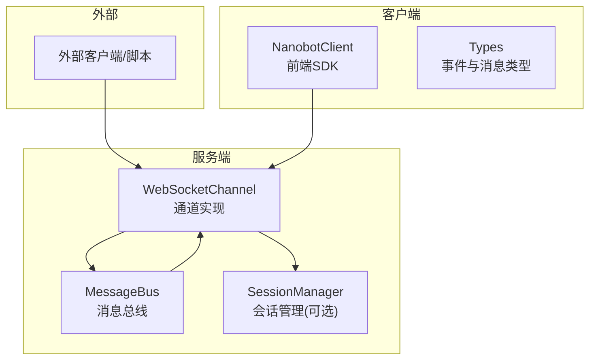
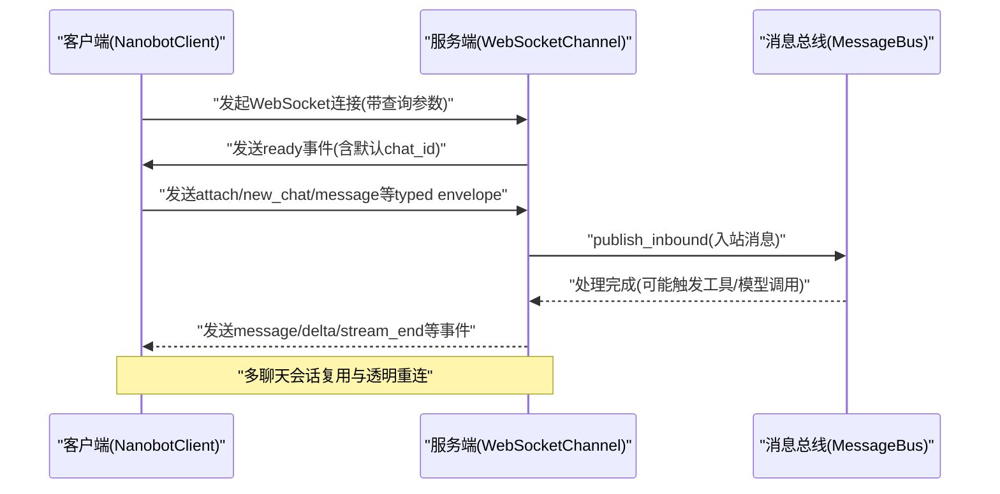
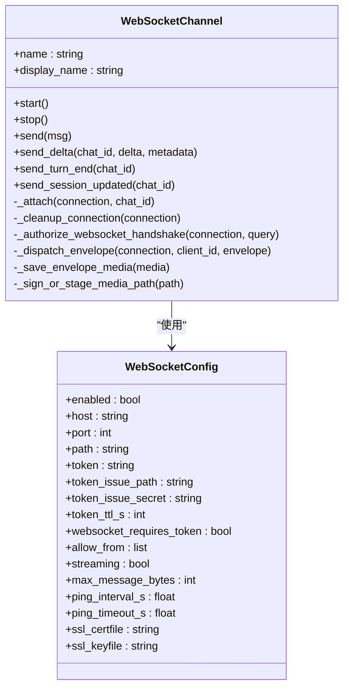
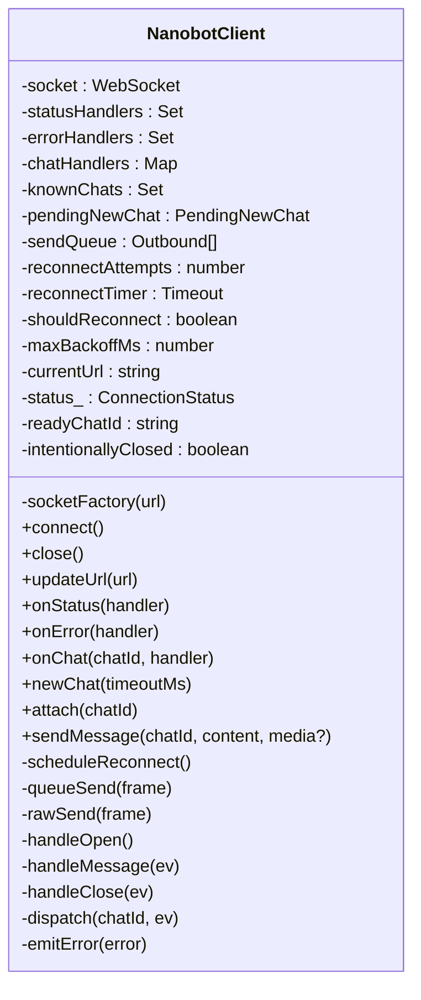
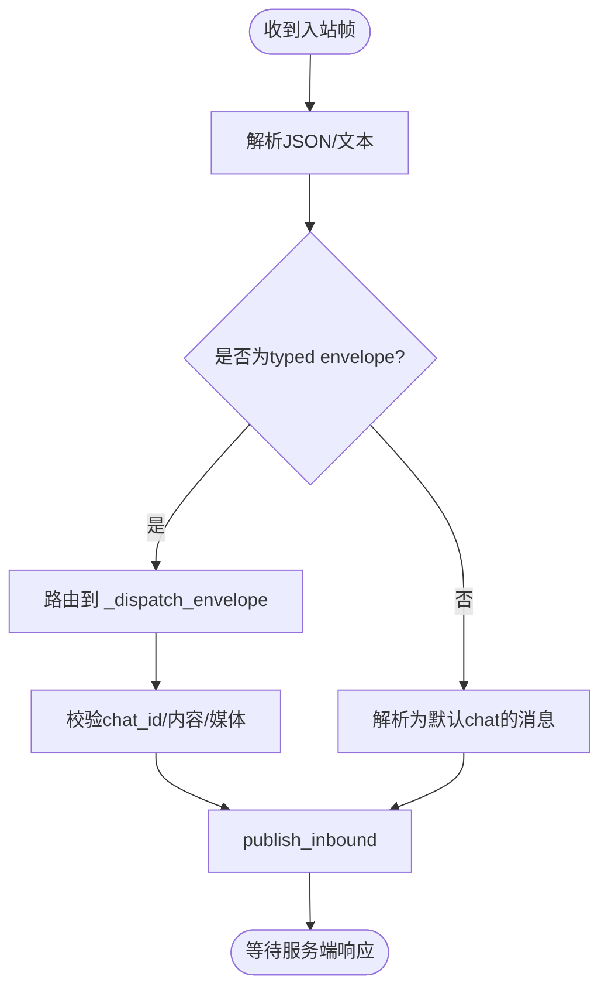
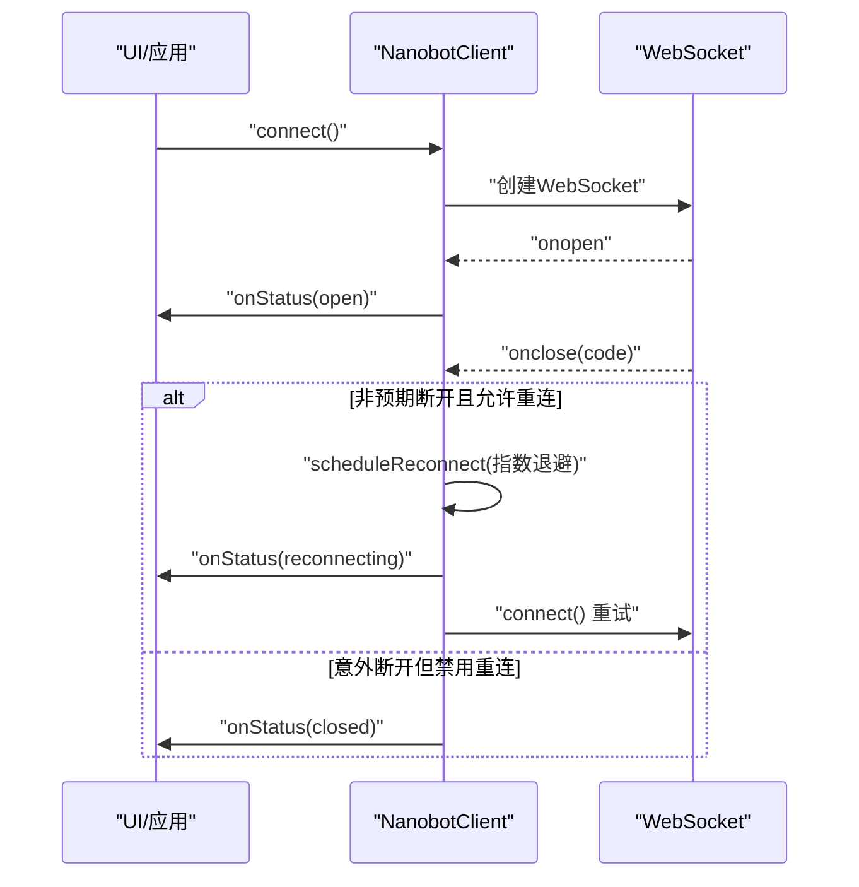
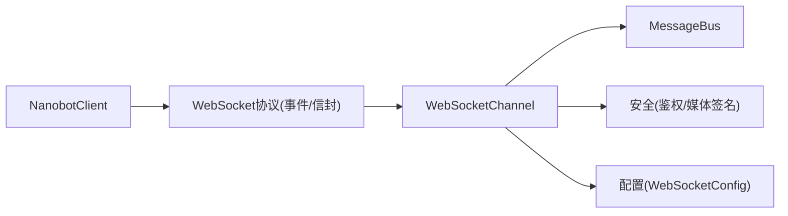

# WebSocket集成

<cite>
**本文档引用的文件**
- [websocket.py](file://secbot/channels/websocket.py)
- [nanobot-client.ts](file://webui/src/lib/nanobot-client.ts)
- [websocket.md](file://docs/websocket.md)
- [types.ts](file://webui/src/lib/types.ts)
- [base.py](file://secbot/channels/base.py)
- [test_websocket_integration.py](file://tests/channels/test_websocket_integration.py)
- [test_websocket_channel.py](file://tests/channels/test_websocket_channel.py)
- [bootstrap.ts](file://webui/src/lib/bootstrap.ts)
</cite>

## 目录
1. [简介](#简介)
2. [项目结构](#项目结构)
3. [核心组件](#核心组件)
4. [架构总览](#架构总览)
5. [详细组件分析](#详细组件分析)
6. [依赖关系分析](#依赖关系分析)
7. [性能考量](#性能考量)
8. [故障排查指南](#故障排查指南)
9. [结论](#结论)
10. [附录](#附录)

## 简介
本文件系统性阐述 Nanobot 的 WebSocket 集成方案，覆盖服务端通道实现、客户端 SDK、消息协议与实时通信处理、连接管理（自动重连、心跳与状态监控）、安全机制（认证、消息校验、连接保护）、调试与性能监控方法，以及常见问题排查与故障恢复策略。目标读者既包括需要快速上手的开发者，也包括希望深入理解实现细节的技术人员。

## 项目结构
WebSocket 集成由三部分组成：
- 服务端通道：基于异步 WebSocket 服务器，负责握手、鉴权、订阅管理、消息分发与媒体签名。
- 客户端 SDK：Web 前端单例客户端，负责连接生命周期、多聊天会话复用、透明重连与事件分发。
- 文档与测试：官方文档定义协议与配置，配套测试覆盖协议行为、安全边界与流式传输。

图表来源
- [websocket.py:414-505](file://secbot/channels/websocket.py#L414-L505)
- [nanobot-client.ts:57-86](file://webui/src/lib/nanobot-client.ts#L57-L86)
- [types.ts:163-224](file://webui/src/lib/types.ts#L163-L224)

章节来源
- [websocket.py:1-120](file://secbot/channels/websocket.py#L1-L120)
- [websocket.md:1-50](file://docs/websocket.md#L1-L50)

## 核心组件
- WebSocketChannel：作为 WebSocket 服务器，提供升级路径、鉴权、订阅管理、消息分发、媒体签名与静态资源服务。
- NanobotClient：前端单例客户端，支持多聊天会话复用、透明重连、事件分发与错误上报。
- 类型系统：统一的入站/出站事件与消息结构，确保协议一致性。
- 基类接口：抽象通道基类，定义通用能力与权限控制。

章节来源
- [websocket.py:414-505](file://secbot/channels/websocket.py#L414-L505)
- [nanobot-client.ts:57-132](file://webui/src/lib/nanobot-client.ts#L57-L132)
- [types.ts:163-224](file://webui/src/lib/types.ts#L163-L224)
- [base.py:15-44](file://secbot/channels/base.py#L15-L44)

## 架构总览
WebSocket 通道在启动时绑定主机与端口，注册 HTTP 路由（含令牌签发、WebUI 引导、REST 接口）与 WebSocket 升级处理器。连接建立后，服务端发送 ready 事件并为每个连接分配默认 chat_id；客户端通过 typed envelope 订阅多个 chat_id 并发送消息。服务端将入站消息转交消息总线，出站消息按 chat_id 扇出到订阅者，并对媒体进行签名或暂存以供安全访问。

图表来源
- [websocket.py:1157-1212](file://secbot/channels/websocket.py#L1157-L1212)
- [nanobot-client.ts:134-211](file://webui/src/lib/nanobot-client.ts#L134-L211)
- [types.ts:163-197](file://webui/src/lib/types.ts#L163-L197)

## 详细组件分析

### 服务端通道：WebSocketChannel
- 连接与握手
  - 支持 HTTP 路由：令牌签发、WebUI 引导、REST 设置与会话接口、媒体签名下载。
  - WebSocket 升级：校验 token（静态或签发）、client_id 白名单、路径规范化。
  - 发送 ready 事件，分配默认 chat_id 并登记订阅。
- 订阅与路由
  - 维护 chat_id -> 连接集合与连接 -> 已订阅 chat_id 集合，实现 fan-out。
  - 支持 typed envelope：new_chat、attach、message；兼容旧版纯文本/JSON 字段。
- 消息分发
  - send/send_delta/send_turn_end/send_session_updated：按 chat_id 分发，自动清理断开连接。
  - 媒体处理：保存/签名/暂存，生成安全可访问的媒体链接。
- 配置与安全
  - 令牌签发（单次使用）、TLS 强制、ping/ping_timeout、最大消息大小、允许来源列表。

图表来源
- [websocket.py:66-146](file://secbot/channels/websocket.py#L66-L146)
- [websocket.py:414-505](file://secbot/channels/websocket.py#L414-L505)
- [websocket.py:1108-1156](file://secbot/channels/websocket.py#L1108-L1156)

章节来源
- [websocket.py:414-505](file://secbot/channels/websocket.py#L414-L505)
- [websocket.py:1088-1156](file://secbot/channels/websocket.py#L1088-L1156)
- [websocket.py:1281-1347](file://secbot/channels/websocket.py#L1281-L1347)
- [websocket.py:1378-1473](file://secbot/channels/websocket.py#L1378-L1473)

### 客户端 SDK：NanobotClient
- 多聊天会话复用
  - 维护 chat_id -> 处理函数集合；连接建立后自动 attach 已知 chat_id。
- 连接管理
  - 状态机：idle/connecting/open/reconnecting/closed/error。
  - 透明重连：指数退避，最大回退时间可配；支持 onReauth 刷新 token 后重连。
- 事件分发
  - onChat(chatId, handler) 订阅特定 chat_id 的事件；dispatch 按 chat_id 转发。
- 错误处理
  - 结构化传输层错误（如消息过大），UI 可见提示；异常 handler 不影响重连流程。

图表来源
- [nanobot-client.ts:39-86](file://webui/src/lib/nanobot-client.ts#L39-L86)
- [nanobot-client.ts:134-319](file://webui/src/lib/nanobot-client.ts#L134-L319)

章节来源
- [nanobot-client.ts:57-132](file://webui/src/lib/nanobot-client.ts#L57-L132)
- [nanobot-client.ts:283-319](file://webui/src/lib/nanobot-client.ts#L283-L319)

### 消息协议与数据模型
- 入站事件（服务端 → 客户端）
  - ready：连接建立后立即返回，包含默认 chat_id 与 client_id。
  - message：完整回复，可携带按钮、媒体路径与回复引用。
  - delta：流式片段，配合 stream_id。
  - stream_end：流结束信号。
  - attached：订阅确认（new_chat/attach）。
  - error：软错误（例如无效 chat_id），连接保持开放。
  - turn_end：整轮处理结束。
  - session_updated：会话元数据变更通知。
- 出站消息（客户端 → 服务端）
  - typed envelope：new_chat、attach、message（含 content、chat_id、可选 media）。
  - 兼容旧版：纯文本或包含 content/text/message 字段的 JSON 对象，路由至默认 chat_id。
- 类型定义
  - InboundEvent：统一的入站事件联合类型。
  - Outbound：统一的出站消息联合类型。
  - UIMessage/UIMediaAttachment 等：用于 UI 渲染的媒体与消息结构。

图表来源
- [websocket.py:1186-1207](file://secbot/channels/websocket.py#L1186-L1207)
- [websocket.py:1281-1347](file://secbot/channels/websocket.py#L1281-L1347)
- [types.ts:163-224](file://webui/src/lib/types.ts#L163-L224)

章节来源
- [websocket.md:80-166](file://docs/websocket.md#L80-L166)
- [types.ts:163-224](file://webui/src/lib/types.ts#L163-L224)

### 实时通信处理
- 流式传输
  - send_delta 发送 delta 与 stream_end；客户端按 stream_id 拼接。
  - 支持多路并发流（interleaved streams）。
- 状态更新
  - send_turn_end 与 send_session_updated 提示前端渲染状态变化。
- 按 chat_id 分发
  - _subs 与 _conn_chats 维护订阅关系，确保 fan-out 正确性。

章节来源
- [websocket.py:1430-1473](file://secbot/channels/websocket.py#L1430-L1473)
- [test_websocket_integration.py:254-296](file://tests/channels/test_websocket_integration.py#L254-L296)

### 连接管理指南
- 自动重连
  - 指数退避（上限可配），支持 onReauth 刷新 token 后无缝重连。
  - 仅在非预期断开时进入“reconnecting”状态。
- 心跳检测
  - 通过 ping_interval_s 与 ping_timeout_s 控制心跳周期与超时。
- 连接状态监控
  - 状态机暴露 onStatus 回调，便于 UI 展示与日志记录。
- URL 动态更新
  - updateUrl 支持在运行中切换 token 或路径。

图表来源
- [nanobot-client.ts:134-160](file://webui/src/lib/nanobot-client.ts#L134-L160)
- [nanobot-client.ts:283-300](file://webui/src/lib/nanobot-client.ts#L283-L300)

章节来源
- [nanobot-client.ts:283-319](file://webui/src/lib/nanobot-client.ts#L283-L319)
- [websocket.md:203-208](file://docs/websocket.md#L203-L208)

### 安全考虑
- 认证机制
  - 静态 token（timing-safe 比较）与签发 token（单次使用、TTL）。
  - allowFrom 在握手与消息层双重校验。
- 消息验证
  - chat_id 格式校验；无效 envelope 返回 error 事件。
  - 媒体上传白名单与大小限制。
- 连接保护
  - WSS 强制 TLSv1.2+。
  - 媒体签名（HMAC 签名 + 相对路径）防止直接文件系统暴露。
- 令牌签发
  - token_issue_secret 保护签发端点；超出容量返回 429。

章节来源
- [websocket.py:1088-1106](file://secbot/channels/websocket.py#L1088-L1106)
- [websocket.py:232-238](file://secbot/channels/websocket.py#L232-L238)
- [websocket.py:267-287](file://secbot/channels/websocket.py#L267-L287)
- [websocket.py:399-412](file://secbot/channels/websocket.py#L399-L412)
- [websocket.md:311-318](file://docs/websocket.md#L311-L318)

### WebSocket 调试工具与性能监控
- 官方文档示例
  - 使用 websocat/Python 客户端验证连接、消息与流式输出。
- 单元与集成测试
  - 覆盖 ready 事件字段、匿名 client_id、独立会话、认证、路径路由、令牌签发、流式传输、多客户端、断连清理等场景。
- 前端引导
  - deriveWsUrl 根据当前页面协议与路径动态拼接 WS/WSS URL，便于本地开发与生产部署。

章节来源
- [websocket.md:15-68](file://docs/websocket.md#L15-L68)
- [test_websocket_integration.py:42-152](file://tests/channels/test_websocket_integration.py#L42-L152)
- [bootstrap.ts:60-76](file://webui/src/lib/bootstrap.ts#L60-L76)

## 依赖关系分析
- 组件耦合
  - WebSocketChannel 依赖 MessageBus 与 SessionManager（可选），并通过 _safe_send_to 处理连接关闭清理。
  - NanobotClient 与 WebSocketChannel 通过统一的 typed envelope 与事件协议解耦。
- 外部依赖
  - websockets 库、loguru 日志、pydantic 配置校验。
- 可能的循环依赖
  - 未发现直接循环；通道与总线通过异步回调解耦。

图表来源
- [websocket.py:414-505](file://secbot/channels/websocket.py#L414-L505)
- [nanobot-client.ts:57-132](file://webui/src/lib/nanobot-client.ts#L57-L132)
- [types.ts:163-224](file://webui/src/lib/types.ts#L163-L224)

章节来源
- [websocket.py:1367-1377](file://secbot/channels/websocket.py#L1367-L1377)
- [base.py:130-144](file://secbot/channels/base.py#L130-L144)

## 性能考量
- 流式传输
  - 开启 streaming 时，服务端按增量发送 delta，降低首字节延迟。
- 媒体处理
  - 限制每消息图片/视频数量与大小，避免内存与磁盘压力。
- 心跳与超时
  - 合理设置 ping_interval_s 与 ping_timeout_s，平衡保活与资源消耗。
- 并发与扇出
  - 多 chat_id 并行时，注意 fan-out 的广播成本，建议按需订阅。

## 故障排查指南
- 常见错误与定位
  - 401 Unauthorized：检查 token 是否正确、是否已过期或被消费；确认 token_issue_secret 配置。
  - 404 Not Found：确认路径与 token_issue_path 不同且规范化正确。
  - 1009 Message Too Big：调整 max_message_bytes 或减少媒体附件大小。
  - 连接频繁断开：检查 ping/ping_timeout、网络稳定性与防火墙策略。
- 单元测试参考
  - 认证失败、路径错误、令牌签发容量限制、流式传输顺序与交错流等用例可作为自测模板。
- 建议流程
  - 从最小配置开始（本地回环 + 无 token），逐步启用 WSS 与鉴权。
  - 使用官方示例客户端验证基本连通性与流式输出。
  - 在生产环境开启 allowFrom 与 token_issue_secret，并定期轮换令牌。

章节来源
- [test_websocket_integration.py:344-430](file://tests/channels/test_websocket_integration.py#L344-L430)
- [test_websocket_channel.py:775-799](file://tests/channels/test_websocket_channel.py#L775-L799)
- [websocket.md:217-268](file://docs/websocket.md#L217-L268)

## 结论
Nanobot 的 WebSocket 集成以清晰的协议设计、完善的客户端 SDK 与严格的安全策略为基础，提供了可靠的实时通信能力。通过多聊天会话复用、透明重连与流式传输，既能满足 WebUI 的交互需求，也能适配外部脚本与自动化场景。建议在生产环境中启用 WSS、令牌签发与严格的 allowFrom 策略，并结合测试用例与文档示例进行持续验证。

## 附录
- 快速开始
  - 配置 channels.websocket，启动网关，使用 websocat/Python 客户端连接验证。
- 配置要点
  - host/port/path/token/token_issue_* 等字段的取值与约束详见文档配置参考。
- 协议参考
  - 事件与信封类型、字段语义与兼容性说明参见文档与类型定义。

章节来源
- [websocket.md:15-48](file://docs/websocket.md#L15-L48)
- [websocket.md:167-216](file://docs/websocket.md#L167-L216)