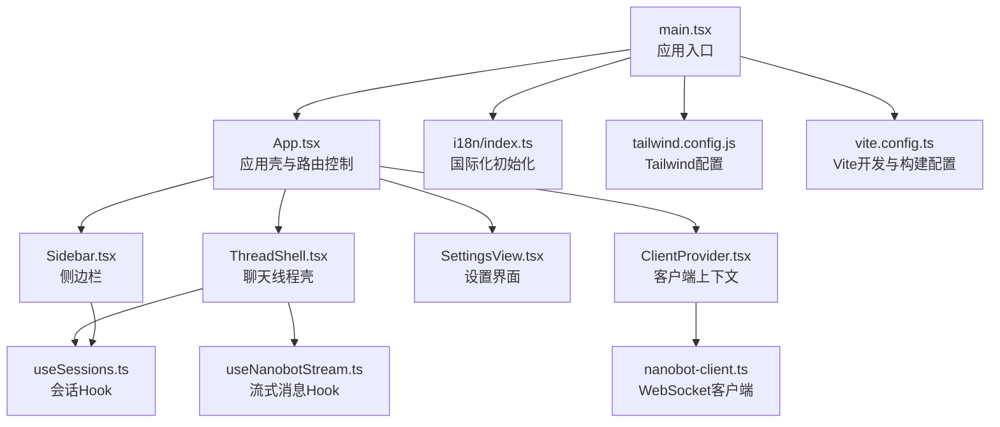
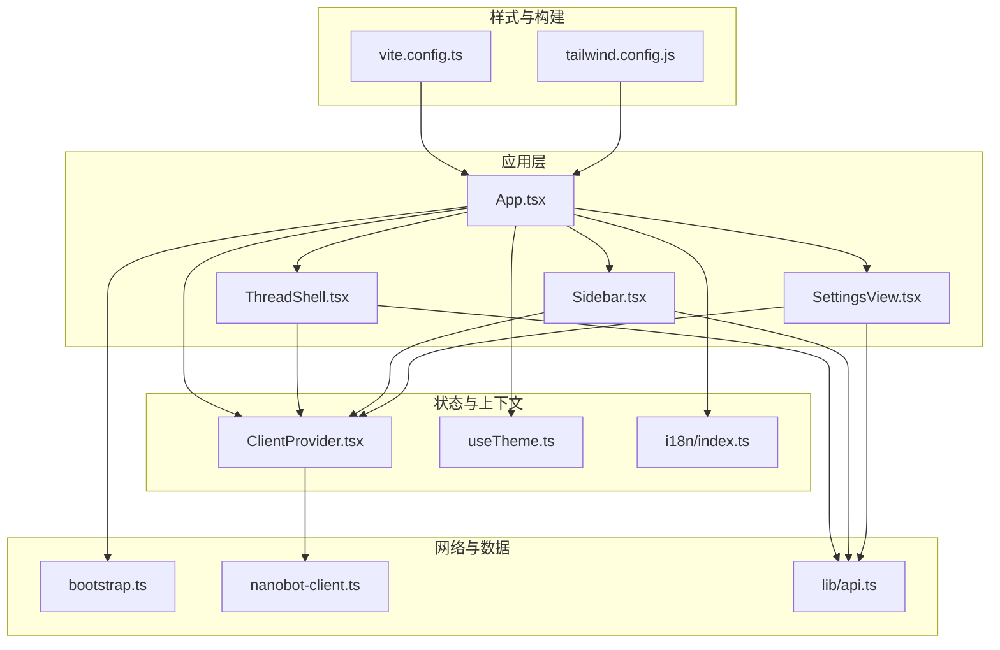
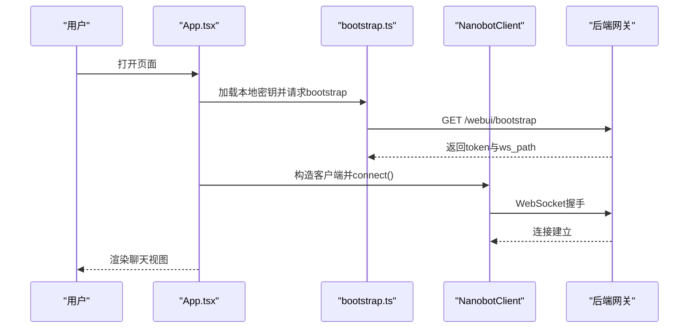
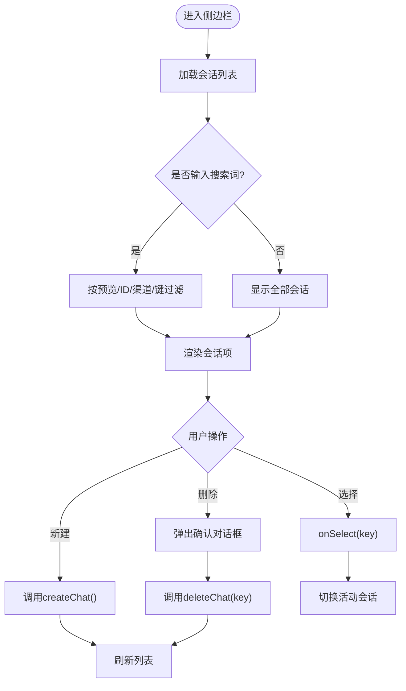
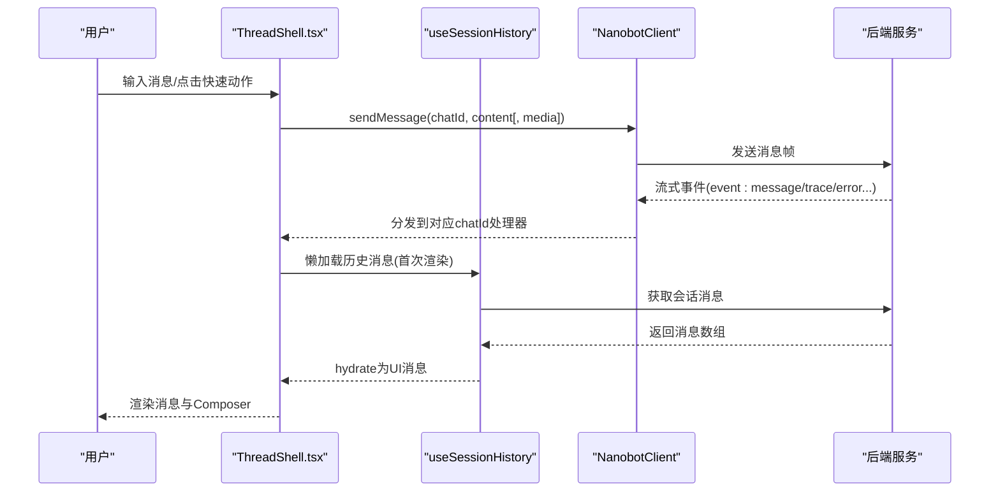
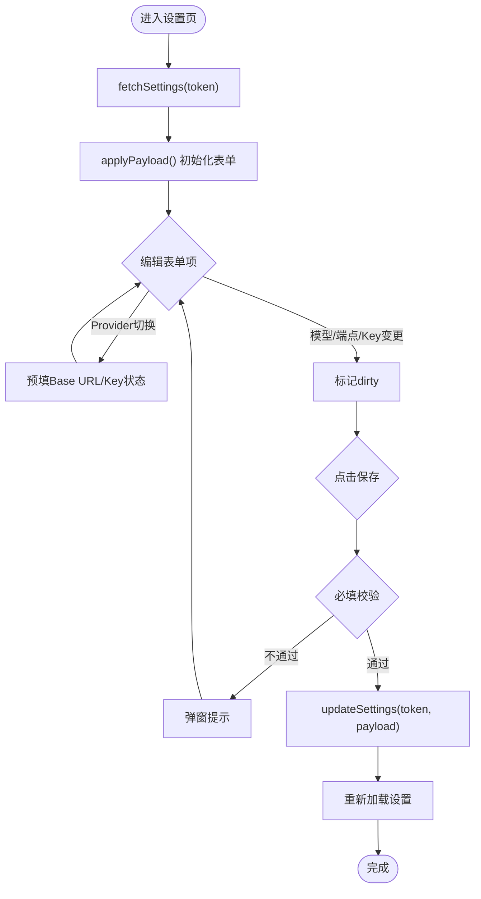
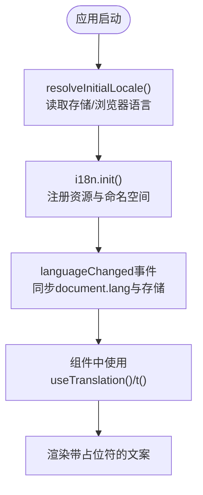
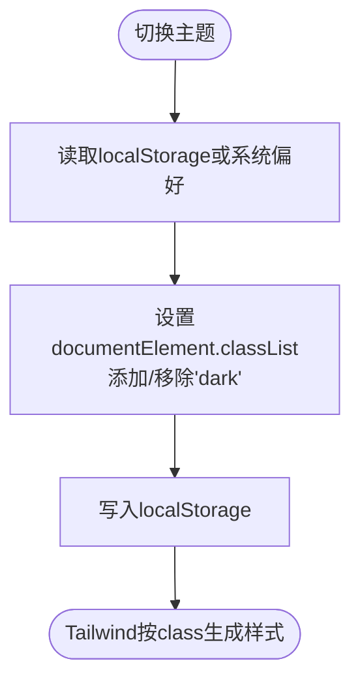
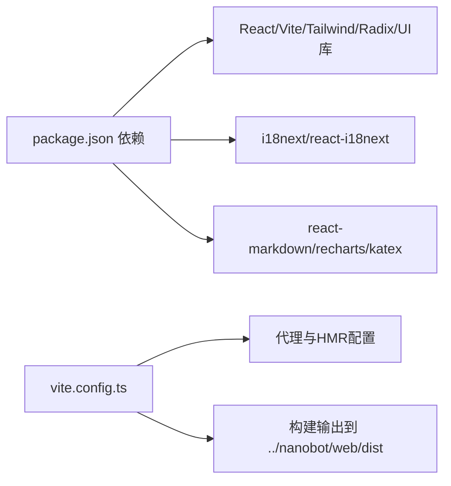

# WebUI用户界面

<cite>
**本文档引用的文件**
- [package.json](file://webui/package.json)
- [vite.config.ts](file://webui/vite.config.ts)
- [tailwind.config.js](file://webui/tailwind.config.js)
- [main.tsx](file://webui/src/main.tsx)
- [App.tsx](file://webui/src/App.tsx)
- [config.ts](file://webui/src/i18n/config.ts)
- [index.ts](file://webui/src/i18n/index.ts)
- [useTheme.ts](file://webui/src/hooks/useTheme.ts)
- [bootstrap.ts](file://webui/src/lib/bootstrap.ts)
- [nanobot-client.ts](file://webui/src/lib/nanobot-client.ts)
- [Sidebar.tsx](file://webui/src/components/Sidebar.tsx)
- [ThreadShell.tsx](file://webui/src/components/thread/ThreadShell.tsx)
- [SettingsView.tsx](file://webui/src/components/settings/SettingsView.tsx)
- [useSessions.ts](file://webui/src/hooks/useSessions.ts)
- [ClientProvider.tsx](file://webui/src/providers/ClientProvider.tsx)
</cite>

## 目录
1. [简介](#简介)
2. [项目结构](#项目结构)
3. [核心组件](#核心组件)
4. [架构总览](#架构总览)
5. [详细组件分析](#详细组件分析)
6. [依赖关系分析](#依赖关系分析)
7. [性能考虑](#性能考虑)
8. [故障排除指南](#故障排除指南)
9. [结论](#结论)
10. [附录](#附录)

## 简介
本文件面向WebUI用户界面，系统性阐述基于React + Vite + Tailwind的技术栈选型与架构设计，详解界面组件结构（聊天面板、消息列表、侧边栏、设置界面），多语言国际化机制，主题定制方案，状态管理与数据流（React Hooks与WebSocket连接），以及界面开发指南、响应式设计与无障碍支持、浏览器兼容性与性能优化建议。

## 项目结构
WebUI位于仓库的webui目录，采用前端单页应用（SPA）结构，核心入口为main.tsx，根组件App.tsx负责应用初始化、认证流程、主题与国际化注入，并协调侧边栏、聊天线程与设置视图的渲染。组件按功能域分层：components（通用UI与业务组件）、hooks（自定义Hook）、i18n（国际化资源与配置）、lib（客户端、类型、工具函数）、providers（上下文提供者）、workers（Web Worker）等。

图表来源
- [main.tsx:1-16](file://webui/src/main.tsx#L1-L16)
- [App.tsx:105-241](file://webui/src/App.tsx#L105-L241)
- [Sidebar.tsx:26-122](file://webui/src/components/Sidebar.tsx#L26-L122)
- [ThreadShell.tsx:56-302](file://webui/src/components/thread/ThreadShell.tsx#L56-L302)
- [SettingsView.tsx:21-608](file://webui/src/components/settings/SettingsView.tsx#L21-L608)
- [ClientProvider.tsx:13-38](file://webui/src/providers/ClientProvider.tsx#L13-L38)
- [nanobot-client.ts:57-320](file://webui/src/lib/nanobot-client.ts#L57-L320)
- [i18n/index.ts:45-73](file://webui/src/i18n/index.ts#L45-L73)
- [tailwind.config.js:5-120](file://webui/tailwind.config.js#L5-L120)
- [vite.config.ts:5-66](file://webui/vite.config.ts#L5-L66)

章节来源
- [main.tsx:1-16](file://webui/src/main.tsx#L1-L16)
- [vite.config.ts:1-66](file://webui/vite.config.ts#L1-L66)
- [tailwind.config.js:1-120](file://webui/tailwind.config.js#L1-L120)

## 核心组件
- 应用壳与路由控制：App.tsx负责启动引导（加载本地密钥、拉取网关bootstrap、建立WebSocket连接）、认证表单、主题切换、国际化注入、桌面/移动端侧边栏与聊天/设置视图切换。
- 侧边栏：Sidebar.tsx展示会话列表、搜索过滤、新建会话、删除确认、连接状态徽章；支持桌面与移动端抽屉交互。
- 聊天线程壳：ThreadShell.tsx承载消息视口、快速动作、欢迎态、Composer输入、流式错误提示、用户确认按钮等。
- 设置界面：SettingsView.tsx提供模型/提供商配置、OpenAI兼容端点、API Key管理、语言切换、登出等。
- 客户端上下文：ClientProvider.tsx向子树注入NanobotClient实例、令牌与模型名。
- WebSocket客户端：nanobot-client.ts封装连接、重连、订阅、事件分发、错误上报与URL更新。
- 国际化：i18n/index.ts与config.ts分别负责资源注册、初始语言解析、持久化与document.lang同步。
- 主题Hook：useTheme.ts提供明暗主题读取、切换与持久化。
- 会话Hook：useSessions.ts负责会话列表、创建、删除与历史消息懒加载。

章节来源
- [App.tsx:105-241](file://webui/src/App.tsx#L105-L241)
- [Sidebar.tsx:26-122](file://webui/src/components/Sidebar.tsx#L26-L122)
- [ThreadShell.tsx:56-302](file://webui/src/components/thread/ThreadShell.tsx#L56-L302)
- [SettingsView.tsx:21-608](file://webui/src/components/settings/SettingsView.tsx#L21-L608)
- [ClientProvider.tsx:13-38](file://webui/src/providers/ClientProvider.tsx#L13-L38)
- [nanobot-client.ts:57-320](file://webui/src/lib/nanobot-client.ts#L57-L320)
- [i18n/index.ts:45-73](file://webui/src/i18n/index.ts#L45-L73)
- [useTheme.ts:21-49](file://webui/src/hooks/useTheme.ts#L21-L49)
- [useSessions.ts:17-229](file://webui/src/hooks/useSessions.ts#L17-L229)

## 架构总览
WebUI采用“应用壳 + 多视图 + 客户端上下文 + WebSocket流”的架构。App.tsx作为顶层协调者，通过ClientProvider注入NanobotClient，实现与后端的实时通信。国际化与主题通过独立模块初始化与Hook管理，确保全局一致性。Vite提供开发服务器与代理，Tailwind提供原子化样式与暗色模式支持。

图表来源
- [App.tsx:105-241](file://webui/src/App.tsx#L105-L241)
- [ThreadShell.tsx:56-302](file://webui/src/components/thread/ThreadShell.tsx#L56-L302)
- [Sidebar.tsx:26-122](file://webui/src/components/Sidebar.tsx#L26-L122)
- [SettingsView.tsx:21-608](file://webui/src/components/settings/SettingsView.tsx#L21-L608)
- [ClientProvider.tsx:13-38](file://webui/src/providers/ClientProvider.tsx#L13-L38)
- [nanobot-client.ts:57-320](file://webui/src/lib/nanobot-client.ts#L57-L320)
- [bootstrap.ts:37-77](file://webui/src/lib/bootstrap.ts#L37-L77)
- [i18n/index.ts:45-73](file://webui/src/i18n/index.ts#L45-L73)
- [useTheme.ts:21-49](file://webui/src/hooks/useTheme.ts#L21-L49)
- [tailwind.config.js:5-120](file://webui/tailwind.config.js#L5-L120)
- [vite.config.ts:5-66](file://webui/vite.config.ts#L5-L66)

## 详细组件分析

### 应用壳与认证流程
App.tsx负责应用启动、认证与主视图切换。其核心流程包括：
- 启动时读取本地保存的密钥，调用bootstrap接口获取短期令牌与WebSocket路径，构造NanobotClient并连接。
- 首次连接失败且返回401/403时，进入认证表单；成功则进入聊天视图。
- 提供注销逻辑，清理本地密钥并关闭WebSocket。
- 通过ClientProvider注入客户端上下文，供子组件使用。
- 维护桌面/移动端侧边栏开关、当前会话、标题与文档标题国际化。

图表来源
- [App.tsx:109-157](file://webui/src/App.tsx#L109-L157)
- [bootstrap.ts:37-77](file://webui/src/lib/bootstrap.ts#L37-L77)
- [nanobot-client.ts:134-144](file://webui/src/lib/nanobot-client.ts#L134-L144)

章节来源
- [App.tsx:105-241](file://webui/src/App.tsx#L105-L241)
- [bootstrap.ts:37-77](file://webui/src/lib/bootstrap.ts#L37-L77)
- [nanobot-client.ts:57-320](file://webui/src/lib/nanobot-client.ts#L57-L320)

### 侧边栏与会话管理
Sidebar.tsx负责会话列表展示、搜索过滤、新建/删除会话与连接状态显示。结合useSessions.ts提供的会话列表、创建与删除能力，实现完整的侧边栏交互。

图表来源
- [Sidebar.tsx:26-122](file://webui/src/components/Sidebar.tsx#L26-L122)
- [useSessions.ts:17-81](file://webui/src/hooks/useSessions.ts#L17-L81)

章节来源
- [Sidebar.tsx:26-122](file://webui/src/components/Sidebar.tsx#L26-L122)
- [useSessions.ts:17-229](file://webui/src/hooks/useSessions.ts#L17-L229)

### 聊天线程与消息流
ThreadShell.tsx承载消息视口、Composer输入、快速动作与流式错误提示。其内部通过useNanobotStream管理消息状态、发送与流式接收；通过useSessionHistory实现会话历史的懒加载与缓存。

图表来源
- [ThreadShell.tsx:56-302](file://webui/src/components/thread/ThreadShell.tsx#L56-L302)
- [useSessions.ts:84-217](file://webui/src/hooks/useSessions.ts#L84-L217)
- [nanobot-client.ts:117-132](file://webui/src/lib/nanobot-client.ts#L117-L132)

章节来源
- [ThreadShell.tsx:56-302](file://webui/src/components/thread/ThreadShell.tsx#L56-L302)
- [useSessions.ts:84-217](file://webui/src/hooks/useSessionHistory.ts#L84-L217)
- [nanobot-client.ts:57-320](file://webui/src/lib/nanobot-client.ts#L57-L320)

### 设置界面与模型配置
SettingsView.tsx提供模型/提供商配置、OpenAI兼容端点、API Key管理、语言切换与登出。其核心逻辑包括：
- 加载设置：调用后端接口获取当前配置，应用到表单。
- 保存设置：校验必填字段，构造更新负载并提交。
- 拉取可用模型：在提供Base URL与API Key后，探测可用模型列表。
- Provider切换：根据所选提供商预填Base URL与API Key状态。

图表来源
- [SettingsView.tsx:21-608](file://webui/src/components/settings/SettingsView.tsx#L21-L608)

章节来源
- [SettingsView.tsx:21-608](file://webui/src/components/settings/SettingsView.tsx#L21-L608)

### 国际化与多语言支持
国际化通过i18next与react-i18next实现，配置文件定义支持的语言列表、默认语言与回退语言，index.ts负责初始化、监听语言变化并同步document.lang与localStorage。

图表来源
- [i18n/config.ts:73-94](file://webui/src/i18n/config.ts#L73-L94)
- [i18n/index.ts:45-73](file://webui/src/i18n/index.ts#L45-L73)

章节来源
- [i18n/config.ts:1-94](file://webui/src/i18n/config.ts#L1-L94)
- [i18n/index.ts:1-73](file://webui/src/i18n/index.ts#L1-L73)

### 主题定制与样式系统
主题通过useTheme.ts管理明/暗两种模式，持久化到localStorage并在documentElement上切换“dark”类。Tailwind配置启用暗色模式“class”，并定义了丰富的CSS变量颜色体系（背景、前景、卡片、弹出层、主要/次要、静音、破坏性、边框、输入、环、侧边栏、严重级别等），支持动画与排版插件。

图表来源
- [useTheme.ts:21-49](file://webui/src/hooks/useTheme.ts#L21-L49)
- [tailwind.config.js:5-120](file://webui/tailwind.config.js#L5-L120)

章节来源
- [useTheme.ts:1-49](file://webui/src/hooks/useTheme.ts#L1-L49)
- [tailwind.config.js:1-120](file://webui/tailwind.config.js#L1-L120)

### 状态管理与数据流
- React Hooks：useSessions、useTheme、useNanobotStream等提供局部状态与副作用管理。
- 上下文：ClientProvider统一注入NanobotClient、token与modelName，避免跨层级传递。
- WebSocket：NanobotClient集中处理连接、重连、订阅与事件分发，UI仅关注渲染与交互。
- 国际化：i18n初始化与事件监听保证语言切换即时生效。

章节来源
- [useSessions.ts:17-229](file://webui/src/hooks/useSessions.ts#L17-L229)
- [ClientProvider.tsx:13-38](file://webui/src/providers/ClientProvider.tsx#L13-L38)
- [nanobot-client.ts:57-320](file://webui/src/lib/nanobot-client.ts#L57-L320)
- [i18n/index.ts:45-73](file://webui/src/i18n/index.ts#L45-L73)

## 依赖关系分析
- 技术栈依赖：React 18、Vite、Tailwind CSS、Radix UI、Assistant UI、i18next、react-i18next、react-markdown、recharts、katex等。
- 开发与测试：Vitest、happy-dom、Testing Library、ESLint、TypeScript。
- 构建与代理：Vite配置将静态资源输出至后端dist目录，开发服务器通过代理转发/api、/auth、/webui至后端，WebSocket升级在根路径区分处理，避免HMR与WS冲突。

图表来源
- [package.json:14-41](file://webui/package.json#L14-L41)
- [vite.config.ts:5-66](file://webui/vite.config.ts#L5-L66)

章节来源
- [package.json:1-63](file://webui/package.json#L1-L63)
- [vite.config.ts:1-66](file://webui/vite.config.ts#L1-L66)

## 性能考虑
- 依赖预优化：Vite配置exclude特定包以稳定开发时的依赖重写。
- 源码映射：生产构建禁用sourcemap以减小体积。
- 惰性预热：应用启动后利用requestIdleCallback或setTimeout预热Markdown文本渲染。
- 会话缓存：ThreadShell对消息进行内存缓存，避免切换会话时重复拉取。
- 事件去抖：WebSocket客户端在连接恢复时批量重附着已知chatId，减少冗余帧。
- 图片编码：Web Worker异步处理图片编码，避免阻塞主线程。

章节来源
- [vite.config.ts:17-23](file://webui/vite.config.ts#L17-L23)
- [vite.config.ts:24-28](file://webui/vite.config.ts#L24-L28)
- [App.tsx:159-179](file://webui/src/App.tsx#L159-L179)
- [ThreadShell.tsx:117-139](file://webui/src/components/thread/ThreadShell.tsx#L117-L139)
- [nanobot-client.ts:201-211](file://webui/src/lib/nanobot-client.ts#L201-L211)

## 故障排除指南
- 认证失败（401/403）：App.tsx捕获并切换到认证表单；可检查本地密钥与网关权限。
- 连接异常：NanobotClient提供onError回调与结构化错误（如消息过大），UI可显示错误通知并自动重连。
- 设置加载失败：SettingsView记录loadError并在页面内提供重试与登出选项。
- 语言切换无效：确认i18n.languageChanged事件已触发并持久化到localStorage。
- 主题不生效：检查documentElement上的“dark”类与localStorage存储值。

章节来源
- [App.tsx:137-150](file://webui/src/App.tsx#L137-L150)
- [nanobot-client.ts:257-281](file://webui/src/lib/nanobot-client.ts#L257-L281)
- [SettingsView.tsx:81-105](file://webui/src/components/settings/SettingsView.tsx#L81-L105)
- [i18n/index.ts:62-69](file://webui/src/i18n/index.ts#L62-L69)
- [useTheme.ts:33-40](file://webui/src/hooks/useTheme.ts#L33-L40)

## 结论
该WebUI以React + Vite + Tailwind为核心技术栈，结合i18n与主题Hook实现国际化与主题定制，通过NanobotClient与ClientProvider构建稳定的WebSocket数据流与上下文共享。组件结构清晰、职责分离，具备良好的可维护性与扩展性。建议在新增功能时遵循现有Hook与Provider模式，保持状态与网络层的解耦。

## 附录

### 界面开发指南
- 新增组件
  - 在components目录下按功能域创建新组件，优先复用UI组件库（Button、Dialog、Sheet等）。
  - 使用useTranslation与Tailwind类名，确保国际化与主题一致。
- 样式修改
  - 修改tailwind.config.js中的extend部分以扩展颜色、圆角、动画等；避免直接在组件内写死样式。
  - 使用CSS变量与暗色模式类名，确保深浅主题一致体验。
- 功能扩展
  - 如需网络请求，优先封装到lib/api.ts；如需状态管理，优先使用现有Hooks或新增自定义Hook。
  - WebSocket相关逻辑集中在NanobotClient，UI仅负责事件分发与渲染。

章节来源
- [tailwind.config.js:16-116](file://webui/tailwind.config.js#L16-L116)
- [nanobot-client.ts:57-320](file://webui/src/lib/nanobot-client.ts#L57-L320)

### 响应式设计与无障碍支持
- 响应式：Tailwind断点与组件布局适配桌面/移动端；侧边栏在小屏使用Sheet抽屉。
- 无障碍：为交互元素提供aria-label与sr-only描述；表单控件具备语义化标签；键盘可聚焦。

章节来源
- [Sidebar.tsx:48-122](file://webui/src/components/Sidebar.tsx#L48-L122)
- [ThreadShell.tsx:282-302](file://webui/src/components/thread/ThreadShell.tsx#L282-L302)

### 浏览器兼容性与性能优化建议
- 兼容性：现代浏览器即可满足需求；如需旧版IE支持，需额外polyfill与构建调整。
- 性能：启用依赖预优化、禁用生产源码映射、惰性预热、消息缓存与批量重附着；合理拆分组件以降低重渲染范围。

章节来源
- [vite.config.ts:17-23](file://webui/vite.config.ts#L17-L23)
- [vite.config.ts:24-28](file://webui/vite.config.ts#L24-L28)
- [App.tsx:159-179](file://webui/src/App.tsx#L159-L179)
- [nanobot-client.ts:201-211](file://webui/src/lib/nanobot-client.ts#L201-L211)