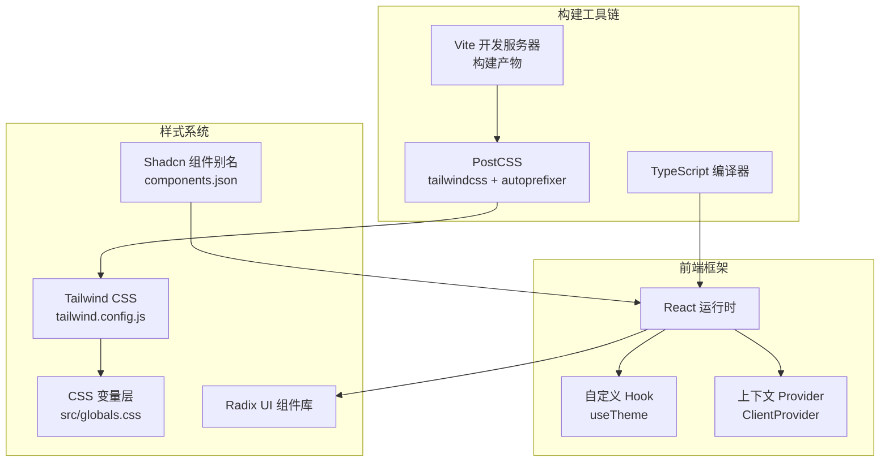
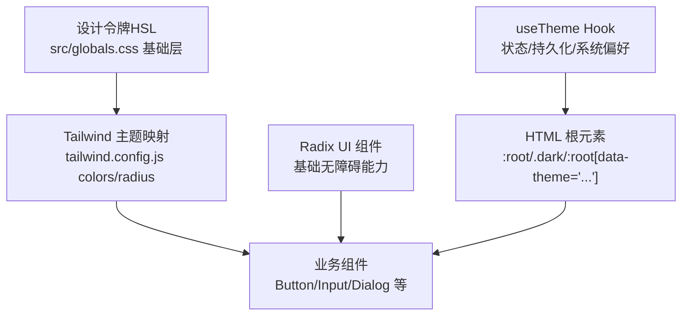
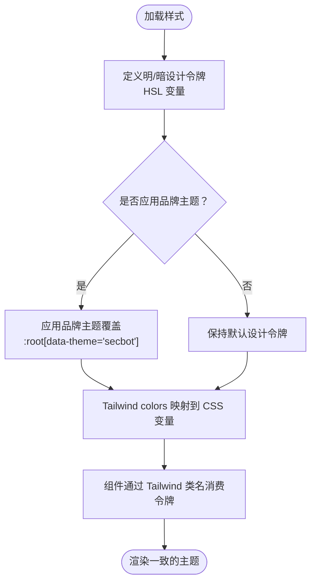
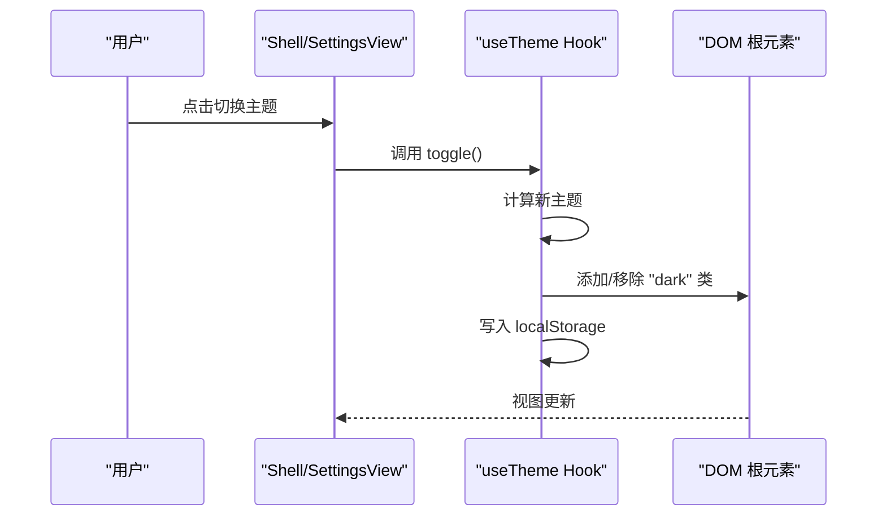
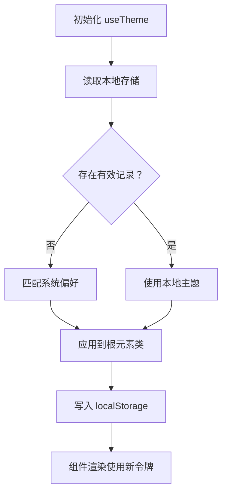
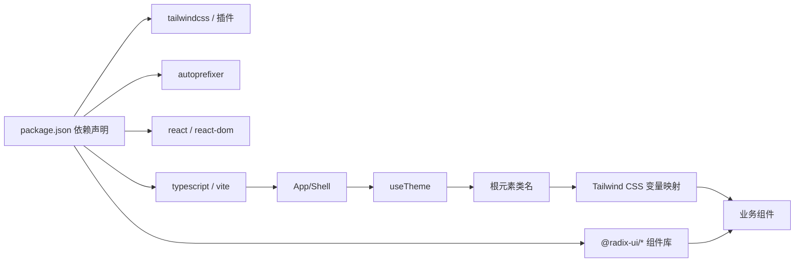

# 主题定制

<cite>
**本文引用的文件**
- [tailwind.config.js](file://webui/tailwind.config.js)
- [postcss.config.js](file://webui/postcss.config.js)
- [globals.css](file://webui/src/globals.css)
- [package.json](file://webui/package.json)
- [components.json](file://webui/components.json)
- [useTheme.ts](file://webui/src/hooks/useTheme.ts)
- [SettingsView.tsx](file://webui/src/components/settings/SettingsView.tsx)
- [App.tsx](file://webui/src/App.tsx)
- [main.tsx](file://webui/src/main.tsx)
</cite>

## 目录
1. [简介](#简介)
2. [项目结构](#项目结构)
3. [核心组件](#核心组件)
4. [架构总览](#架构总览)
5. [详细组件分析](#详细组件分析)
6. [依赖关系分析](#依赖关系分析)
7. [性能考量](#性能考量)
8. [故障排查指南](#故障排查指南)
9. [结论](#结论)
10. [附录](#附录)

## 简介
本文件面向主题定制与扩展，系统阐述本项目中 Tailwind CSS 与 Radix UI 主题系统的集成方式与配置策略，涵盖颜色系统设计（主色调、辅助色、语义色与暗色模式）、主题切换机制（状态管理、持久化存储、系统偏好检测）、样式定制方法（CSS 变量、组件覆盖与品牌色彩应用），并提供主题开发工作流（设计令牌管理、样式测试与跨浏览器兼容）及扩展最佳实践。

## 项目结构
WebUI 使用 Vite + React + TypeScript 构建，Tailwind CSS 负责原子化样式生成，PostCSS 负责编译与自动前缀，Radix UI 提供无障碍基础组件，Shadcn UI 风格的组件库通过 shadcn 自定义别名与 CSS 变量启用。

图表来源
- [tailwind.config.js:1-120](file://webui/tailwind.config.js#L1-L120)
- [postcss.config.js:1-7](file://webui/postcss.config.js#L1-L7)
- [components.json:1-21](file://webui/components.json#L1-L21)
- [globals.css:1-160](file://webui/src/globals.css#L1-L160)
- [package.json:1-63](file://webui/package.json#L1-L63)

章节来源
- [tailwind.config.js:1-120](file://webui/tailwind.config.js#L1-L120)
- [postcss.config.js:1-7](file://webui/postcss.config.js#L1-L7)
- [components.json:1-21](file://webui/components.json#L1-L21)
- [globals.css:1-160](file://webui/src/globals.css#L1-L160)
- [package.json:1-63](file://webui/package.json#L1-L63)

## 核心组件
- Tailwind 配置：启用类名驱动的暗色模式、字体族、圆角半径、颜色映射与动画；颜色来自 CSS 变量，确保与 Radix UI 一致。
- CSS 变量层：在基础层定义明/暗两套设计令牌，并支持品牌主题覆盖（如 secbot）。
- 自定义 Hook：useTheme 提供主题状态、切换与本地持久化，同时检测系统偏好。
- 设置页：SettingsView 展示与编辑设置，但不直接控制主题切换（主题切换由 App/Shell 传递的 toggle 处理）。
- 应用壳层：App/Shell 将主题状态注入到界面布局与组件树，确保全局一致性。

章节来源
- [tailwind.config.js:6-119](file://webui/tailwind.config.js#L6-L119)
- [globals.css:5-107](file://webui/src/globals.css#L5-L107)
- [useTheme.ts:1-49](file://webui/src/hooks/useTheme.ts#L1-L49)
- [SettingsView.tsx:1-608](file://webui/src/components/settings/SettingsView.tsx#L1-L608)
- [App.tsx:243-449](file://webui/src/App.tsx#L243-L449)

## 架构总览
Tailwind 通过 CSS 变量桥接 Radix UI 的设计令牌，useTheme 控制根元素的暗色类，组件通过 Tailwind 类名消费这些令牌，形成“设计令牌 → CSS 变量 → Tailwind → 组件”的闭环。

图表来源
- [globals.css:5-107](file://webui/src/globals.css#L5-L107)
- [tailwind.config.js:50-116](file://webui/tailwind.config.js#L50-L116)
- [useTheme.ts:15-40](file://webui/src/hooks/useTheme.ts#L15-L40)

## 详细组件分析

### 颜色系统与设计令牌
- 设计令牌采用 HSL 表达，分别在明/暗两套主题下定义背景、前景、卡片、弹出层、主要/次要、静默、强调、破坏性、边框、输入、环形高亮、侧边栏等。
- 品牌主题 secbot 通过根元素属性选择器覆盖部分令牌，形成安全主题配色与严重级别语义色。
- Tailwind colors 映射到 CSS 变量，确保组件类名可直接消费设计令牌。

图表来源
- [globals.css:5-87](file://webui/src/globals.css#L5-L87)
- [tailwind.config.js:50-101](file://webui/tailwind.config.js#L50-L101)

章节来源
- [globals.css:5-107](file://webui/src/globals.css#L5-L107)
- [tailwind.config.js:50-101](file://webui/tailwind.config.js#L50-L101)

### 暗色模式与系统偏好检测
- Tailwind 启用基于类名的暗色模式，根元素添加或移除 dark 类。
- useTheme 优先读取本地存储，其次匹配系统偏好，写入时同步持久化。
- 切换时仅操作根元素类，避免全局重绘。

图表来源
- [useTheme.ts:21-48](file://webui/src/hooks/useTheme.ts#L21-L48)
- [App.tsx:416-436](file://webui/src/App.tsx#L416-L436)

章节来源
- [useTheme.ts:1-49](file://webui/src/hooks/useTheme.ts#L1-L49)
- [App.tsx:243-449](file://webui/src/App.tsx#L243-L449)

### 主题切换机制与状态管理
- 状态来源：本地存储（优先）、系统偏好（次之）。
- 状态写入：每次切换后写回 localStorage。
- 视图联动：根元素类变化触发 Tailwind 重新解析颜色变量，组件即时响应。

图表来源
- [useTheme.ts:22-40](file://webui/src/hooks/useTheme.ts#L22-L40)

章节来源
- [useTheme.ts:1-49](file://webui/src/hooks/useTheme.ts#L1-L49)

### 样式定制指南
- 使用 CSS 变量：在基础层扩展或覆盖设计令牌，确保与 Tailwind 映射一致。
- 组件样式覆盖：通过 Tailwind 类名组合与组件 props 覆盖，避免内联样式破坏一致性。
- 品牌色彩应用：通过根元素属性选择器叠加品牌主题覆盖，避免污染默认配色。
- 字体与圆角：在 Tailwind 配置中统一管理，保证全局一致性。

章节来源
- [globals.css:5-107](file://webui/src/globals.css#L5-L107)
- [tailwind.config.js:16-49](file://webui/tailwind.config.js#L16-L49)
- [components.json:6-12](file://webui/components.json#L6-L12)

### 主题开发工作流
- 设计令牌管理：集中维护 HSL 令牌，按明/暗/品牌主题分层组织。
- 样式测试：在多浏览器与暗色模式下验证渲染一致性。
- 跨浏览器兼容：依赖 PostCSS 自动前缀，Tailwind 默认已处理大部分兼容问题。
- 扩展与自定义：新增组件遵循现有类名体系与令牌命名，避免硬编码颜色。

章节来源
- [postcss.config.js:1-7](file://webui/postcss.config.js#L1-L7)
- [package.json:42-61](file://webui/package.json#L42-L61)

### 主题扩展与自定义组件最佳实践
- 新增品牌主题：通过根元素属性选择器叠加覆盖，避免修改默认令牌。
- 组件样式：优先使用 Tailwind 工具类，必要时在基础层追加变量，确保与 Radix UI 一致。
- 动画与过渡：复用 Tailwind 动画与 Radix UI 动画钩子，保持交互一致性。

章节来源
- [globals.css:62-87](file://webui/src/globals.css#L62-L87)
- [tailwind.config.js:102-116](file://webui/tailwind.config.js#L102-L116)

## 依赖关系分析
- 构建链路：Vite → PostCSS（tailwindcss + autoprefixer）→ Tailwind → React 组件。
- 组件生态：Radix UI 提供基础无障碍组件，Shadcn 组件通过别名与 CSS 变量启用，Tailwind 提供原子化样式。
- 主题依赖：useTheme 依赖 DOM 类名切换，Tailwind 依赖 CSS 变量，两者共同驱动主题渲染。

图表来源
- [package.json:14-41](file://webui/package.json#L14-L41)
- [tailwind.config.js:1-120](file://webui/tailwind.config.js#L1-L120)
- [postcss.config.js:1-7](file://webui/postcss.config.js#L1-L7)

章节来源
- [package.json:1-63](file://webui/package.json#L1-L63)
- [tailwind.config.js:1-120](file://webui/tailwind.config.js#L1-L120)
- [postcss.config.js:1-7](file://webui/postcss.config.js#L1-L7)

## 性能考量
- 渲染路径短：主题切换只影响根元素类，Tailwind 通过 CSS 变量即时生效，避免全量重排。
- 构建优化：PostCSS 与 Tailwind 在构建阶段完成转换，运行时开销低。
- 组件体积：Radix UI 为轻量无障碍库，配合 Tailwind 原子类减少自定义样式体积。

## 故障排查指南
- 主题未生效
  - 检查根元素是否正确添加/移除 dark 类。
  - 确认 CSS 变量已在基础层定义且 Tailwind 映射存在。
- 切换后刷新失效
  - 确认 localStorage 可用且未被隐私模式禁用。
- 品牌主题覆盖不生效
  - 检查根元素是否设置了对应 data-theme 属性。
- 暗色模式与系统偏好冲突
  - 确认 useTheme 初始化逻辑优先读取本地存储，其次匹配系统偏好。

章节来源
- [useTheme.ts:6-40](file://webui/src/hooks/useTheme.ts#L6-L40)
- [globals.css:5-107](file://webui/src/globals.css#L5-L107)
- [App.tsx:416-436](file://webui/src/App.tsx#L416-L436)

## 结论
本项目通过“设计令牌（HSL）→ CSS 变量 → Tailwind 映射 → 组件消费”的路径，将 Radix UI 与 Tailwind CSS 有机融合。useTheme 提供简洁的主题切换与持久化，结合品牌主题覆盖与统一的字体/圆角配置，形成可扩展、可维护的主题体系。建议在扩展时严格遵循现有令牌与类名约定，确保跨浏览器与暗色模式的一致体验。

## 附录
- 入口与样式挂载：应用入口引入全局样式，确保设计令牌在首屏即生效。
- Shadcn 集成：通过 components.json 配置别名与 CSS 变量开关，使组件风格与设计令牌对齐。

章节来源
- [main.tsx:1-16](file://webui/src/main.tsx#L1-L16)
- [components.json:1-21](file://webui/components.json#L1-L21)