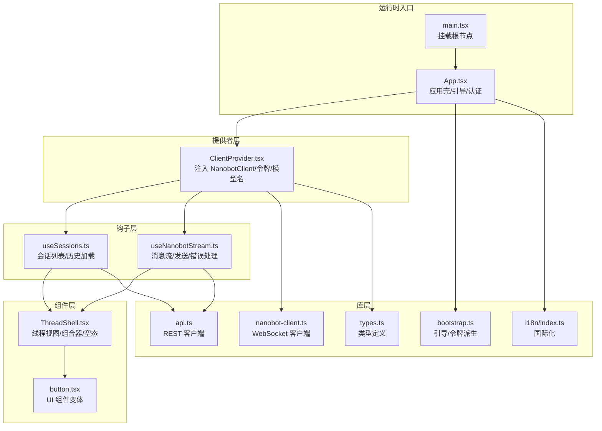
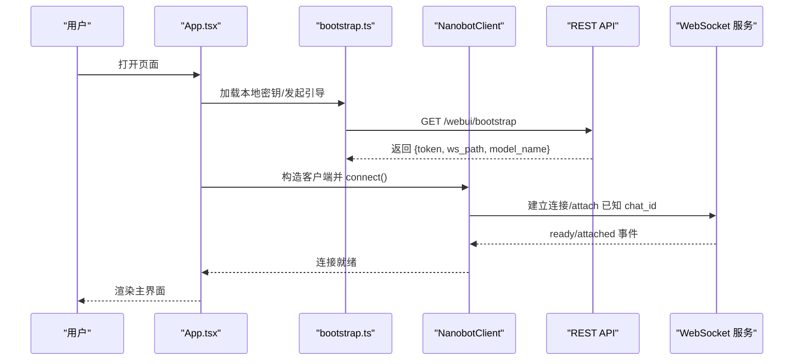
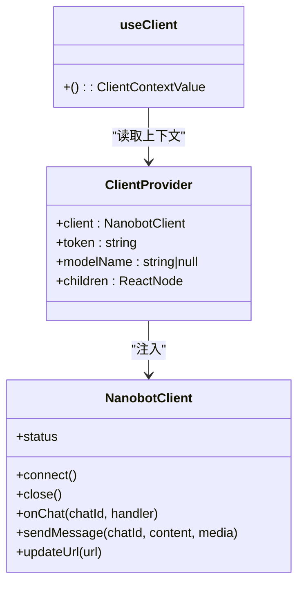
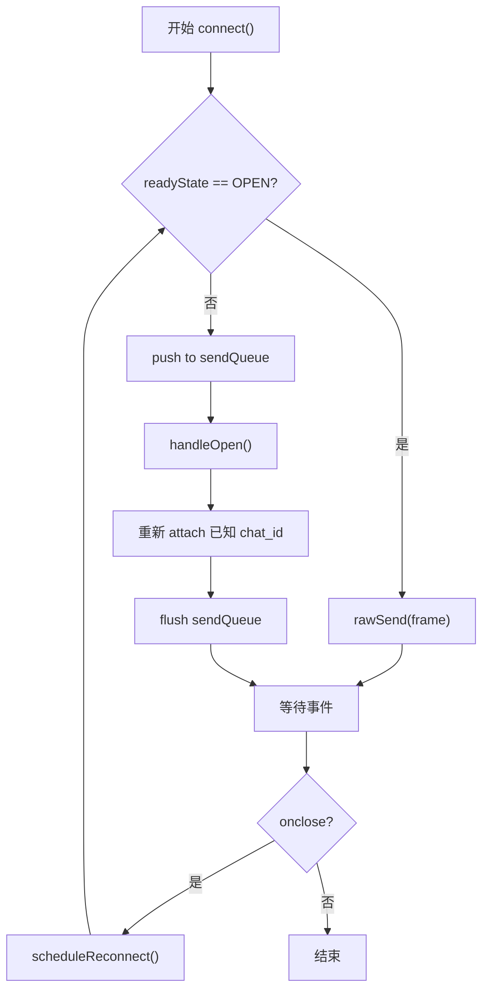
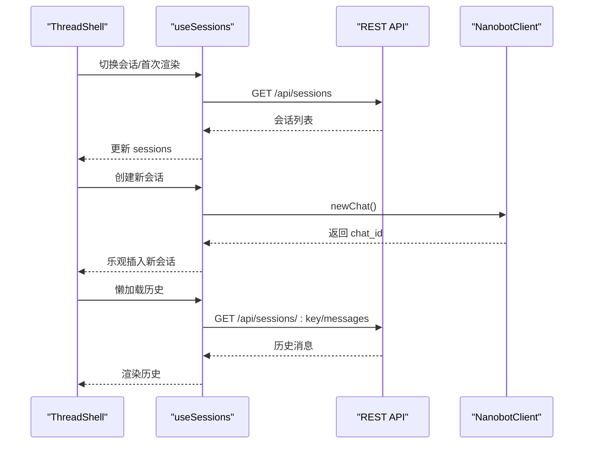
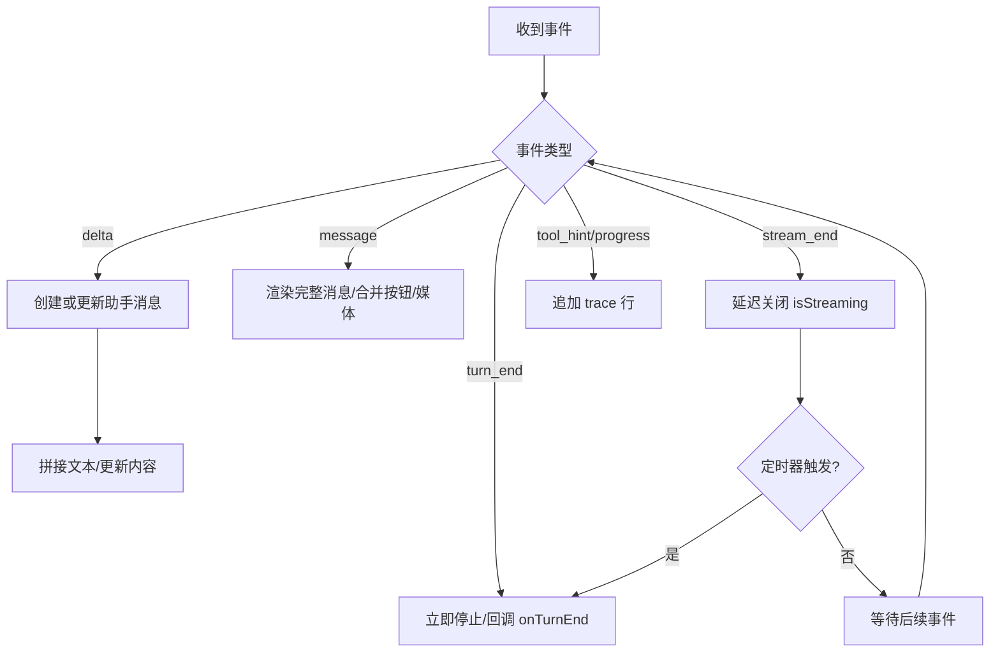
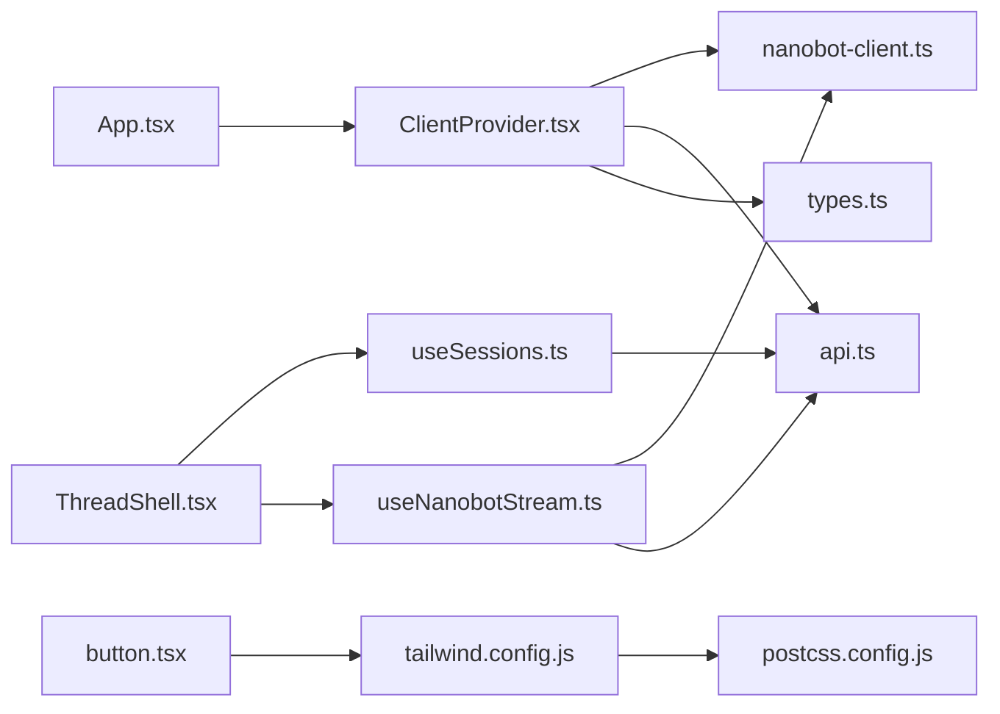

# 前端架构设计

<cite>
**本文档引用的文件**
- [package.json](file://webui/package.json)
- [vite.config.ts](file://webui/vite.config.ts)
- [tsconfig.json](file://webui/tsconfig.json)
- [tsconfig.build.json](file://webui/tsconfig.build.json)
- [tailwind.config.js](file://webui/tailwind.config.js)
- [postcss.config.js](file://webui/postcss.config.js)
- [main.tsx](file://webui/src/main.tsx)
- [App.tsx](file://webui/src/App.tsx)
- [ClientProvider.tsx](file://webui/src/providers/ClientProvider.tsx)
- [bootstrap.ts](file://webui/src/lib/bootstrap.ts)
- [nanobot-client.ts](file://webui/src/lib/nanobot-client.ts)
- [types.ts](file://webui/src/lib/types.ts)
- [useSessions.ts](file://webui/src/hooks/useSessions.ts)
- [useNanobotStream.ts](file://webui/src/hooks/useNanobotStream.ts)
- [ThreadShell.tsx](file://webui/src/components/thread/ThreadShell.tsx)
- [api.ts](file://webui/src/lib/api.ts)
- [i18n/index.ts](file://webui/src/i18n/index.ts)
- [button.tsx](file://webui/src/components/ui/button.tsx)
</cite>

## 目录
1. [引言](#引言)
2. [项目结构](#项目结构)
3. [核心组件](#核心组件)
4. [架构总览](#架构总览)
5. [详细组件分析](#详细组件分析)
6. [依赖关系分析](#依赖关系分析)
7. [性能考虑](#性能考虑)
8. [故障排查指南](#故障排查指南)
9. [结论](#结论)
10. [附录](#附录)

## 引言
本文件系统性阐述基于 React + Vite + TypeScript + Tailwind CSS 的前端架构设计与实现。重点覆盖技术栈选型、应用架构模式（组件层次、状态管理、数据流）、客户端提供者（ClientProvider）的作用与实现机制、项目结构组织原则、构建与开发工具链配置，以及性能优化策略与最佳实践。

## 项目结构
WebUI 采用以功能域为中心的分层组织方式：
- 根入口与应用壳：main.tsx 负责挂载根节点；App.tsx 作为顶层应用壳，负责引导态、认证态与主界面切换，并注入 ClientProvider。
- 提供者层：ClientProvider 将 NanobotClient、令牌与模型名注入到子树，统一为业务 Hook 与组件提供依赖。
- 钩子层：useSessions、useNanobotStream 等 Hook 抽象网络与状态逻辑，屏蔽 WebSocket 与 REST 细节。
- 组件层：按功能拆分（thread、ui、settings、components），复用 UI 组件库（Radix UI + Assistant UI）与自研 UI 变体。
- 库层：lib 下封装 API、类型、工具与国际化等横切能力。
- 构建与样式：Vite + TypeScript + Tailwind CSS，PostCSS 自动前缀与插件管线。

图表来源
- [main.tsx:1-16](file://webui/src/main.tsx#L1-L16)
- [App.tsx:105-241](file://webui/src/App.tsx#L105-L241)
- [ClientProvider.tsx:11-37](file://webui/src/providers/ClientProvider.tsx#L11-L37)
- [useSessions.ts:17-81](file://webui/src/hooks/useSessions.ts#L17-L81)
- [useNanobotStream.ts:39-290](file://webui/src/hooks/useNanobotStream.ts#L39-L290)
- [ThreadShell.tsx:56-301](file://webui/src/components/thread/ThreadShell.tsx#L56-L301)
- [button.tsx:1-57](file://webui/src/components/ui/button.tsx#L1-L57)
- [api.ts:12-29](file://webui/src/lib/api.ts#L12-L29)
- [bootstrap.ts:37-77](file://webui/src/lib/bootstrap.ts#L37-L77)
- [nanobot-client.ts:57-320](file://webui/src/lib/nanobot-client.ts#L57-L320)
- [types.ts:155-224](file://webui/src/lib/types.ts#L155-L224)
- [i18n/index.ts:45-73](file://webui/src/i18n/index.ts#L45-L73)

章节来源
- [main.tsx:1-16](file://webui/src/main.tsx#L1-L16)
- [App.tsx:105-241](file://webui/src/App.tsx#L105-L241)

## 核心组件
- 应用壳与引导流程：App.tsx 负责加载本地保存的共享密钥、调用引导接口获取短期令牌与 WebSocket 路径、构造 NanobotClient 并连接，同时在认证失败时展示输入表单。
- 客户端提供者：ClientProvider 将 NanobotClient、令牌与模型名以上下文形式注入，使下层 Hook 与组件无需感知底层传输细节。
- 会话与历史：useSessions 负责会话列表拉取、创建新会话（通过 WebSocket 新建 chat_id）、删除会话；useSessionHistory 按需懒加载历史消息。
- 流式消息：useNanobotStream 订阅指定 chat_id 的事件流，聚合增量文本、处理工具提示与进度提示、管理“正在生成”状态与错误提示。
- 线程视图：ThreadShell 聚合历史、流式消息、快速动作、用户输入与设置入口，协调首次欢迎语、工具调用与按钮式交互。
- 国际化：i18n/index.ts 初始化多语言资源与语言切换副作用，确保文档语言同步与持久化。

章节来源
- [App.tsx:105-241](file://webui/src/App.tsx#L105-L241)
- [ClientProvider.tsx:11-37](file://webui/src/providers/ClientProvider.tsx#L11-L37)
- [useSessions.ts:17-81](file://webui/src/hooks/useSessions.ts#L17-L81)
- [useNanobotStream.ts:39-290](file://webui/src/hooks/useNanobotStream.ts#L39-L290)
- [ThreadShell.tsx:56-301](file://webui/src/components/thread/ThreadShell.tsx#L56-L301)
- [i18n/index.ts:45-73](file://webui/src/i18n/index.ts#L45-L73)

## 架构总览
该前端采用“引导态 → 认证态 → 主界面”的三段式状态机，主界面由侧边栏与线程视图构成，通过 ClientProvider 注入的 NanobotClient 实现 WebSocket 多路复用与透明重连。Hook 层抽象 REST 与 WebSocket，组件层专注渲染与交互，库层提供类型与工具。

图表来源
- [App.tsx:109-157](file://webui/src/App.tsx#L109-L157)
- [bootstrap.ts:37-77](file://webui/src/lib/bootstrap.ts#L37-L77)
- [nanobot-client.ts:134-144](file://webui/src/lib/nanobot-client.ts#L134-L144)

## 详细组件分析

### 客户端提供者（ClientProvider）
- 作用：以 React Context 形式向子树注入 NanobotClient、访问令牌与模型名称，避免逐层传参。
- 实现要点：提供 useClient Hook 读取上下文，未包裹时报错，保证使用契约。
- 使用场景：所有需要与后端通信的 Hook 与组件均通过 useClient 获取 client/token/modelName。

图表来源
- [ClientProvider.tsx:11-37](file://webui/src/providers/ClientProvider.tsx#L11-L37)
- [nanobot-client.ts:57-320](file://webui/src/lib/nanobot-client.ts#L57-L320)

章节来源
- [ClientProvider.tsx:11-37](file://webui/src/providers/ClientProvider.tsx#L11-L37)

### WebSocket 客户端（NanobotClient）
- 单例多路复用：一个 WebSocket 连接承载多个 chat_id，自动重连并重新 attach。
- 事件模型：订阅 chat_id 级别的事件，支持 ready/attached/delta/message/stream_end/turn_end/session_updated/error 等。
- 错误与回退：对帧过大等传输级错误进行结构化上报；可注入 onReauth 刷新 URL 后自动重连。
- 发送队列：连接未就绪时缓存待发帧，OPEN 后批量发送。

图表来源
- [nanobot-client.ts:134-300](file://webui/src/lib/nanobot-client.ts#L134-L300)

章节来源
- [nanobot-client.ts:57-320](file://webui/src/lib/nanobot-client.ts#L57-L320)

### 会话与历史（useSessions）
- 会话列表：通过 REST 接口列出会话，创建新会话时先乐观插入，随后刷新权威数据。
- 历史加载：按需懒加载指定会话的历史消息，将签名媒体 URL 转换为 UI 附件，识别仍在执行工具调用的“挂起”状态。
- 删除：调用删除接口并从本地列表剔除。

图表来源
- [useSessions.ts:33-81](file://webui/src/hooks/useSessions.ts#L33-L81)
- [api.ts:37-96](file://webui/src/lib/api.ts#L37-L96)
- [nanobot-client.ts:162-175](file://webui/src/lib/nanobot-client.ts#L162-L175)

章节来源
- [useSessions.ts:17-229](file://webui/src/hooks/useSessions.ts#L17-L229)

### 流式消息（useNanobotStream）
- 订阅：对指定 chat_id 订阅事件，聚合 delta 文本，处理“工具提示/进度”trace 行，最终渲染完整消息。
- 状态：维护 isStreaming、streamError、消息缓冲区；在 turn_end 时停止“正在生成”状态。
- 发送：将用户输入与图片预览乐观写入 UI，再通过 client.sendMessage 发送到服务器。

图表来源
- [useNanobotStream.ts:111-252](file://webui/src/hooks/useNanobotStream.ts#L111-L252)
- [types.ts:163-197](file://webui/src/lib/types.ts#L163-L197)

章节来源
- [useNanobotStream.ts:39-290](file://webui/src/hooks/useNanobotStream.ts#L39-L290)

### 线程视图（ThreadShell）
- 组合器：根据是否有会话决定显示“英雄区”快速动作或常规输入框；支持斜杠命令与模型标签。
- 空态：无历史时显示欢迎语与动作卡片；加载中显示占位文案。
- 交互：处理“询问用户”按钮、欢迎语首条消息、滚动视口与主题切换。

章节来源
- [ThreadShell.tsx:56-301](file://webui/src/components/thread/ThreadShell.tsx#L56-L301)

### 类型与数据模型
- 角色与消息：Role、MessageKind、UIMessage、TraceEntry、ToolEvent 等，统一前后端消息结构。
- 连接状态：ConnectionStatus 定义 idle/connecting/open/reconnecting/closed/error。
- 事件与帧：InboundEvent、Outbound、OutboundMedia，描述 WebSocket 协议帧。

章节来源
- [types.ts:1-224](file://webui/src/lib/types.ts#L1-L224)

## 依赖关系分析
- 组件依赖：App.tsx 依赖 ClientProvider、bootstrap.ts、nanobot-client.ts；ThreadShell 依赖 useSessions、useNanobotStream、useClient；UI 组件依赖 Radix UI 与自定义变体。
- 数据流：useSessions 与 useNanobotStream 通过 useClient 间接依赖 NanobotClient；二者均依赖 api.ts 与 types.ts。
- 样式与主题：Tailwind CSS 通过 tailwind.config.js 配置，PostCSS 自动前缀；button.tsx 使用 class-variance-authority 与 clsx 组合类名。

图表来源
- [App.tsx:105-241](file://webui/src/App.tsx#L105-L241)
- [ClientProvider.tsx:11-37](file://webui/src/providers/ClientProvider.tsx#L11-L37)
- [nanobot-client.ts:57-320](file://webui/src/lib/nanobot-client.ts#L57-L320)
- [api.ts:12-29](file://webui/src/lib/api.ts#L12-L29)
- [types.ts:155-224](file://webui/src/lib/types.ts#L155-L224)
- [ThreadShell.tsx:56-301](file://webui/src/components/thread/ThreadShell.tsx#L56-L301)
- [useSessions.ts:17-81](file://webui/src/hooks/useSessions.ts#L17-L81)
- [useNanobotStream.ts:39-290](file://webui/src/hooks/useNanobotStream.ts#L39-L290)
- [button.tsx:1-57](file://webui/src/components/ui/button.tsx#L1-L57)
- [tailwind.config.js:1-120](file://webui/tailwind.config.js#L1-L120)
- [postcss.config.js:1-7](file://webui/postcss.config.js#L1-L7)

章节来源
- [package.json:14-61](file://webui/package.json#L14-L61)

## 性能考虑
- 构建与打包
  - Vite 默认启用依赖预优化与按需加载；通过 optimizeDeps.exclude 排除特定包以稳定开发时的模块路径。
  - 生产构建关闭 sourcemap 以减小体积；输出目录指向后端静态资源目录，便于统一部署。
- 运行时性能
  - WebSocket 多路复用与透明重连，减少重复握手成本；发送队列与 attach 重连策略降低丢帧风险。
  - Hook 层使用 useRef 缓存 token 与消息缓存，避免不必要的重渲染。
  - 懒加载历史与请求空闲预热 Markdown 渲染，缩短首屏等待时间。
- 样式与资源
  - Tailwind 仅扫描 src 与 index.html，按需生成类名；PostCSS 自动前缀提升兼容性。
  - 图片预览使用本地 Blob URL，签名媒体 URL 用于历史回放，减少跨域与鉴权问题。
- 开发体验
  - Vitest + happy-dom 提供 DOM 环境测试；ESLint 与严格 TypeScript 配置保障代码质量。

章节来源
- [vite.config.ts:17-28](file://webui/vite.config.ts#L17-L28)
- [vite.config.ts:59-64](file://webui/vite.config.ts#L59-L64)
- [tsconfig.json:17-24](file://webui/tsconfig.json#L17-L24)
- [tsconfig.build.json:3-7](file://webui/tsconfig.build.json#L3-L7)
- [tailwind.config.js:7-8](file://webui/tailwind.config.js#L7-L8)
- [postcss.config.js:1-7](file://webui/postcss.config.js#L1-L7)
- [App.tsx:164-179](file://webui/src/App.tsx#L164-L179)

## 故障排查指南
- 认证失败
  - 现象：出现 401/403，跳转至认证表单。
  - 处理：检查本地存储的共享密钥是否正确；确认引导接口返回的 token/ws_path 是否存在。
- 连接异常
  - 现象：状态停留在 connecting/reconnecting 或报“消息过大”。
  - 处理：查看 onReauth 是否成功刷新 URL；检查客户端错误回调与传输级错误码；确认媒体大小未超过服务端限制。
- 会话历史为空
  - 现象：新建会话首次加载 404。
  - 处理：属正常状态，等待服务端持久化后重试；或手动刷新。
- UI 语言不同步
  - 现象：切换语言后文档语言未更新。
  - 处理：确认 i18n 事件监听与本地持久化逻辑生效。

章节来源
- [App.tsx:137-150](file://webui/src/App.tsx#L137-L150)
- [nanobot-client.ts:258-281](file://webui/src/lib/nanobot-client.ts#L258-L281)
- [useSessions.ts:174-194](file://webui/src/hooks/useSessions.ts#L174-L194)
- [i18n/index.ts:62-73](file://webui/src/i18n/index.ts#L62-L73)

## 结论
该前端架构以 React Hooks 与 Context 为核心，结合 Vite 的高效开发体验与 Tailwind CSS 的可维护样式体系，实现了高内聚、低耦合的组件化与数据流管理。ClientProvider 将传输细节抽象为统一依赖，useSessions 与 useNanobotStream 分别承担会话与流式消息的业务逻辑，整体具备良好的扩展性与可测试性。通过严格的 TypeScript 与 ESLint 配置、Tailwind 的按需生成与 PostCSS 前缀处理，兼顾了开发效率与运行性能。

## 附录
- 构建脚本与依赖
  - package.json 中定义了 dev/build/preview/test/lint 等脚本，依赖 React、Radix UI、Assistant UI、TanStack React Query、i18n、Tailwind CSS 等生态库。
- TypeScript 严格模式
  - tsconfig.json 启用严格模式、未使用变量/参数检测、ESM 解析与 JSX 支持；tsconfig.build.json 限定生产构建排除测试目录。
- Tailwind 配置
  - tailwind.config.js 启用暗色模式、容器与字体族扩展、动画插件与排版插件；postcss.config.js 集成 tailwindcss 与 autoprefixer。

章节来源
- [package.json:14-61](file://webui/package.json#L14-L61)
- [tsconfig.json:1-33](file://webui/tsconfig.json#L1-L33)
- [tsconfig.build.json:1-8](file://webui/tsconfig.build.json#L1-L8)
- [tailwind.config.js:1-120](file://webui/tailwind.config.js#L1-L120)
- [postcss.config.js:1-7](file://webui/postcss.config.js#L1-L7)