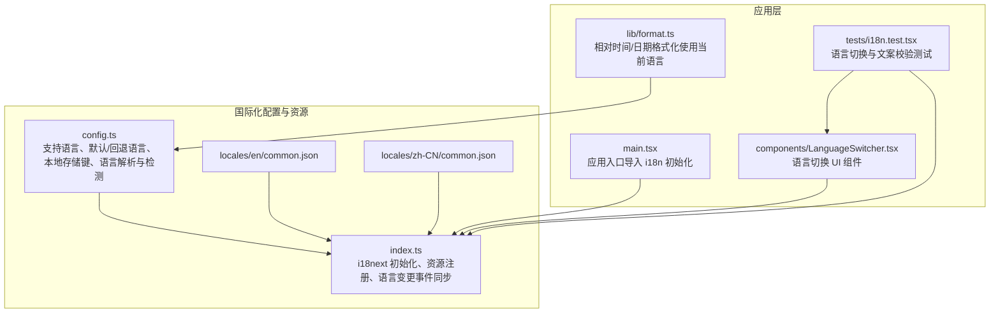
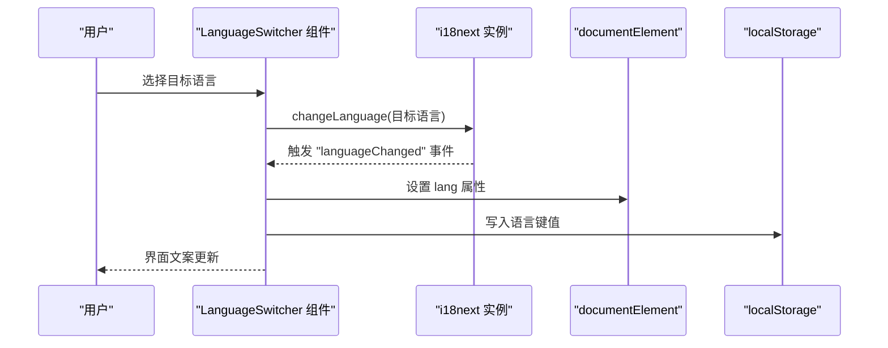
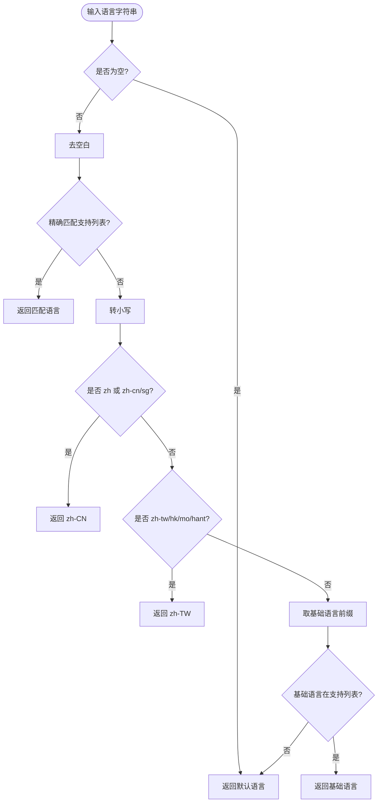
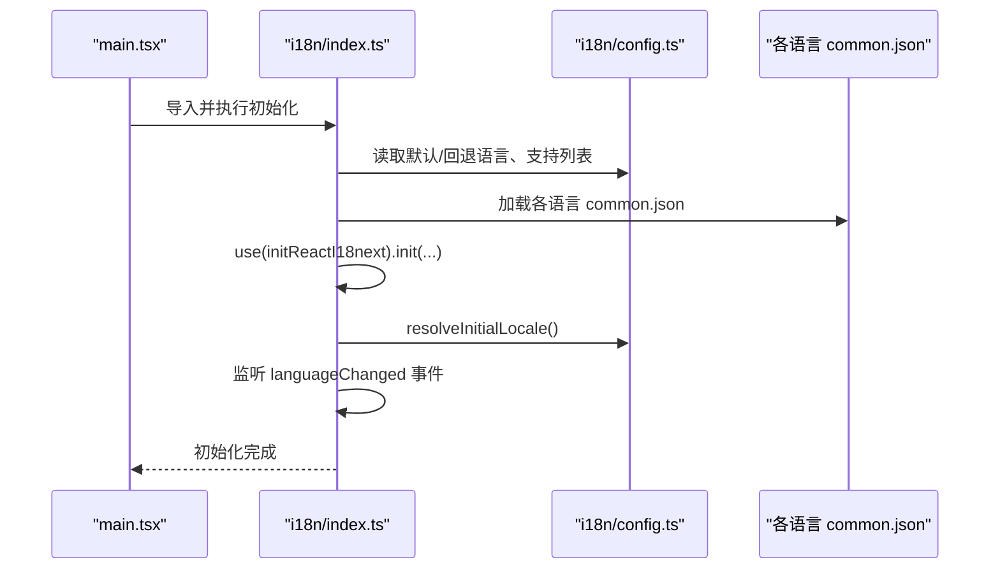
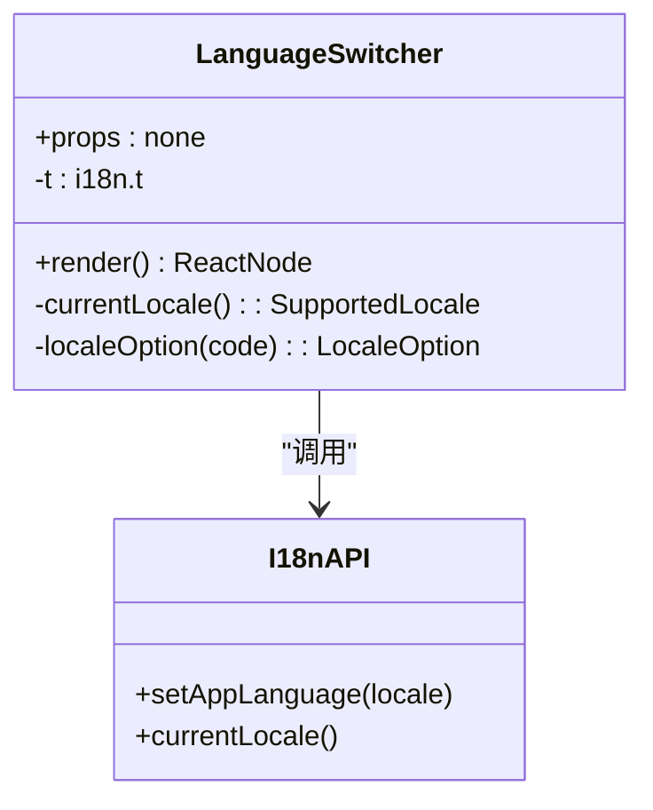
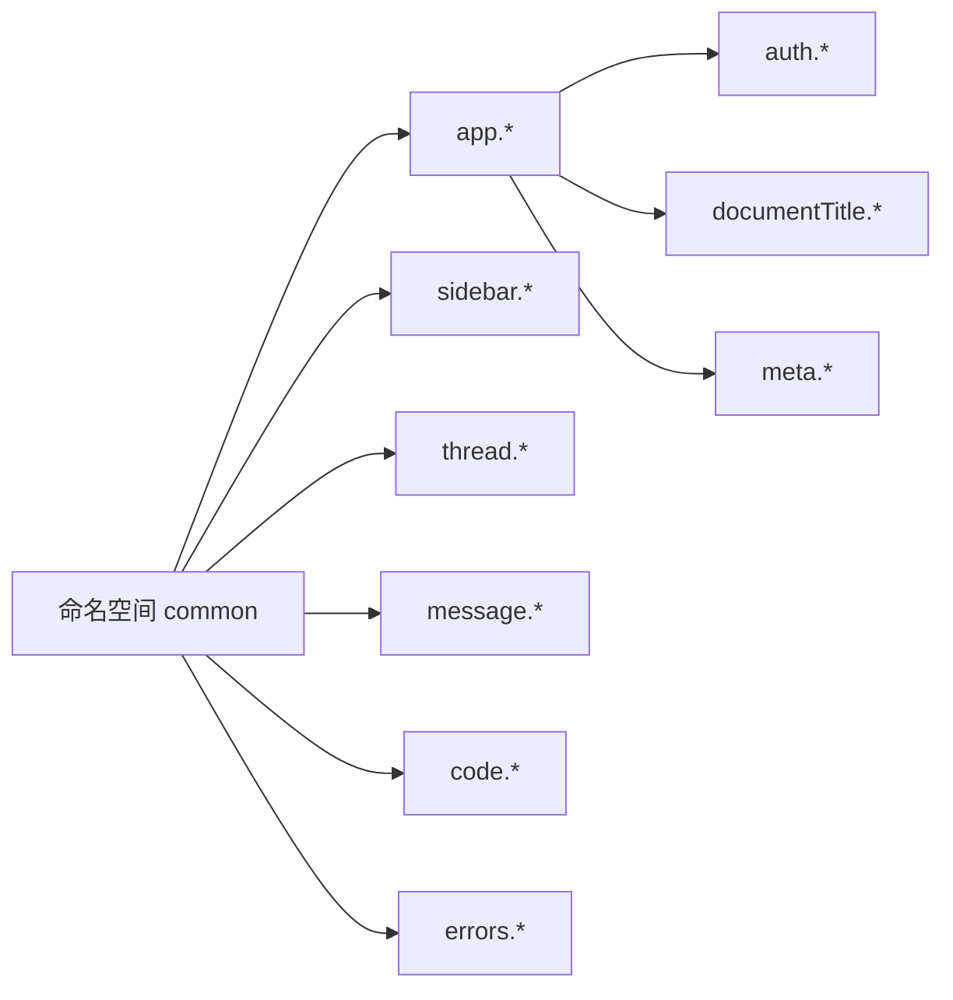
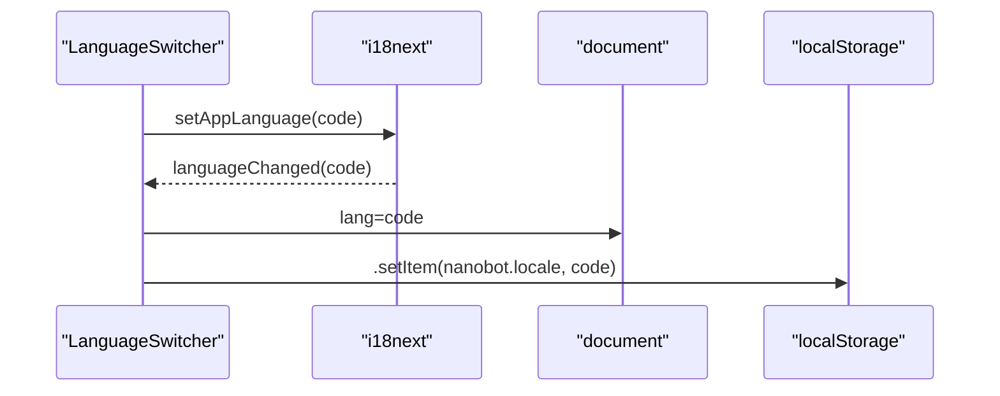
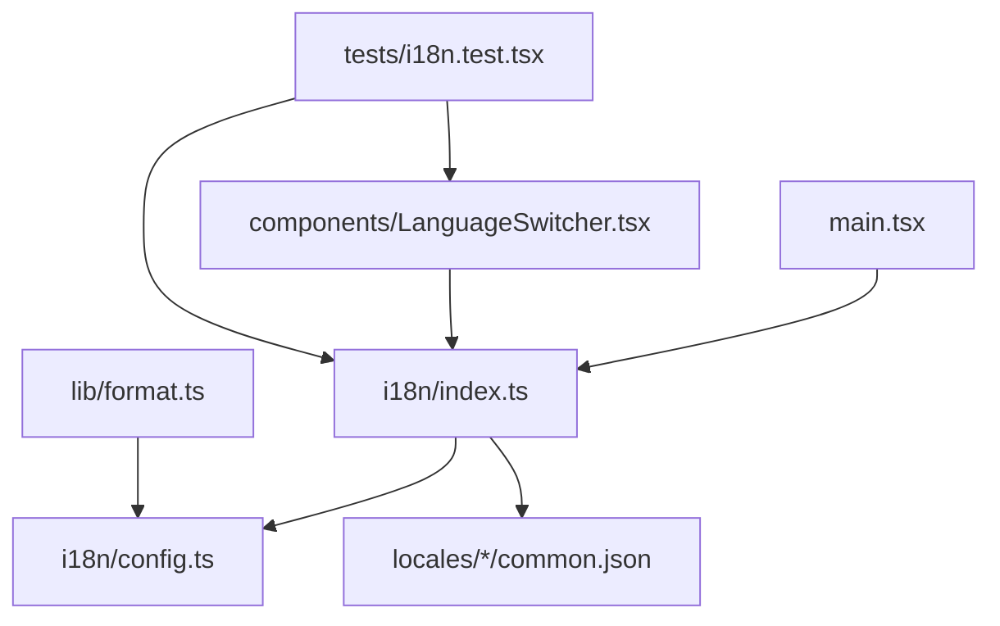
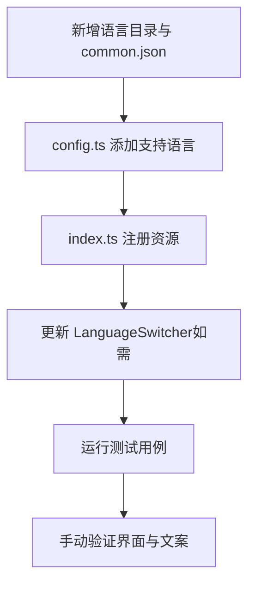

# 多语言支持

<cite>
**本文引用的文件**
- [webui/src/i18n/config.ts](file://webui/src/i18n/config.ts)
- [webui/src/i18n/index.ts](file://webui/src/i18n/index.ts)
- [webui/src/i18n/locales/en/common.json](file://webui/src/i18n/locales/en/common.json)
- [webui/src/i18n/locales/zh-CN/common.json](file://webui/src/i18n/locales/zh-CN/common.json)
- [webui/src/components/LanguageSwitcher.tsx](file://webui/src/components/LanguageSwitcher.tsx)
- [webui/src/tests/i18n.test.tsx](file://webui/src/tests/i18n.test.tsx)
- [webui/src/main.tsx](file://webui/src/main.tsx)
- [webui/src/lib/format.ts](file://webui/src/lib/format.ts)
- [webui/package.json](file://webui/package.json)
</cite>

## 目录
1. [简介](#简介)
2. [项目结构](#项目结构)
3. [核心组件](#核心组件)
4. [架构总览](#架构总览)
5. [详细组件分析](#详细组件分析)
6. [依赖关系分析](#依赖关系分析)
7. [性能考量](#性能考量)
8. [故障排查指南](#故障排查指南)
9. [结论](#结论)
10. [附录：翻译管理与新增语言流程](#附录翻译管理与新增语言流程)

## 简介
本文件系统性阐述 nanobot WebUI 的多语言支持实现，基于 i18next 国际化框架，覆盖以下方面：
- 配置与初始化：默认语言、回退语言、支持语言集合与规范化逻辑
- 翻译资源结构：语言包组织、命名空间管理、嵌套键值结构
- 动态语言切换：运行时切换、本地存储同步、浏览器语言检测
- 使用实践：翻译键命名规范、占位符使用、复数形式处理建议
- 新语言添加流程：文件创建、配置更新、测试验证
- 质量保证与维护策略：测试用例、格式化工具对语言环境的适配

## 项目结构
WebUI 的国际化相关代码集中在 webui/src/i18n 目录，配合组件层的语言切换入口与测试用例，形成完整的 i18n 实现闭环。

**图表来源**
- [webui/src/i18n/config.ts:1-94](file://webui/src/i18n/config.ts#L1-L94)
- [webui/src/i18n/index.ts:1-73](file://webui/src/i18n/index.ts#L1-L73)
- [webui/src/i18n/locales/en/common.json:1-221](file://webui/src/i18n/locales/en/common.json#L1-L221)
- [webui/src/i18n/locales/zh-CN/common.json:1-209](file://webui/src/i18n/locales/zh-CN/common.json#L1-L209)
- [webui/src/main.tsx:1-15](file://webui/src/main.tsx#L1-L15)
- [webui/src/components/LanguageSwitcher.tsx:1-68](file://webui/src/components/LanguageSwitcher.tsx#L1-L68)
- [webui/src/lib/format.ts:1-78](file://webui/src/lib/format.ts#L1-L78)
- [webui/src/tests/i18n.test.tsx:1-60](file://webui/src/tests/i18n.test.tsx#L1-L60)

**章节来源**
- [webui/src/i18n/config.ts:1-94](file://webui/src/i18n/config.ts#L1-L94)
- [webui/src/i18n/index.ts:1-73](file://webui/src/i18n/index.ts#L1-L73)
- [webui/src/i18n/locales/en/common.json:1-221](file://webui/src/i18n/locales/en/common.json#L1-L221)
- [webui/src/i18n/locales/zh-CN/common.json:1-209](file://webui/src/i18n/locales/zh-CN/common.json#L1-L209)
- [webui/src/main.tsx:1-15](file://webui/src/main.tsx#L1-L15)
- [webui/src/components/LanguageSwitcher.tsx:1-68](file://webui/src/components/LanguageSwitcher.tsx#L1-L68)
- [webui/src/lib/format.ts:1-78](file://webui/src/lib/format.ts#L1-L78)
- [webui/src/tests/i18n.test.tsx:1-60](file://webui/src/tests/i18n.test.tsx#L1-L60)

## 核心组件
- 支持语言与解析
  - 支持语言列表、默认语言、回退语言定义
  - 语言规范化：精确匹配、简繁中文归一、基础语言匹配
  - 浏览器语言检测与首次语言解析
- i18next 初始化与资源注册
  - 资源按语言与命名空间组织
  - 默认命名空间、支持语言白名单、插件接入
- 语言切换与副作用同步
  - 运行时切换、文档语言属性设置、本地存储持久化
- 语言切换 UI
  - 下拉菜单组件，绑定当前语言与切换动作
- 测试与质量保障
  - 切换 UI 行为、文档语言属性、可访问性标签、快速动作文案一致性

**章节来源**
- [webui/src/i18n/config.ts:1-94](file://webui/src/i18n/config.ts#L1-L94)
- [webui/src/i18n/index.ts:1-73](file://webui/src/i18n/index.ts#L1-L73)
- [webui/src/components/LanguageSwitcher.tsx:1-68](file://webui/src/components/LanguageSwitcher.tsx#L1-L68)
- [webui/src/tests/i18n.test.tsx:1-60](file://webui/src/tests/i18n.test.tsx#L1-L60)

## 架构总览
i18next 在应用启动时完成初始化，注册所有语言资源；组件通过 react-i18next 获取翻译函数并渲染对应语言文案；用户在 UI 中切换语言后，通过事件回调同步文档语言与本地存储。

**图表来源**
- [webui/src/i18n/index.ts:41-69](file://webui/src/i18n/index.ts#L41-L69)
- [webui/src/i18n/config.ts:77-89](file://webui/src/i18n/config.ts#L77-L89)
- [webui/src/components/LanguageSwitcher.tsx:47-48](file://webui/src/components/LanguageSwitcher.tsx#L47-L48)

**章节来源**
- [webui/src/i18n/index.ts:45-69](file://webui/src/i18n/index.ts#L45-L69)
- [webui/src/i18n/config.ts:73-89](file://webui/src/i18n/config.ts#L73-L89)
- [webui/src/components/LanguageSwitcher.tsx:24-67](file://webui/src/components/LanguageSwitcher.tsx#L24-L67)

## 详细组件分析

### 配置与语言解析（config.ts）
- 支持语言集合与类型约束
- 默认/回退语言常量
- 语言规范化算法：去除空白、精确匹配、简繁中文映射、基础语言匹配
- 本地存储键名、读取与持久化
- 文档语言属性设置
- 首次语言解析：优先本地存储，其次浏览器语言

**图表来源**
- [webui/src/i18n/config.ts:20-48](file://webui/src/i18n/config.ts#L20-L48)

**章节来源**
- [webui/src/i18n/config.ts:1-94](file://webui/src/i18n/config.ts#L1-L94)

### i18next 初始化与资源注册（index.ts）
- 资源对象：以语言为键，命名空间为子键
- 初始化参数：资源、初始语言、回退语言、默认命名空间、支持语言白名单、插件等
- 语言变更事件监听：同步文档语言与本地存储
- 导出当前语言查询与语言切换函数

**图表来源**
- [webui/src/main.tsx](file://webui/src/main.tsx#L6)
- [webui/src/i18n/index.ts:1-73](file://webui/src/i18n/index.ts#L1-L73)
- [webui/src/i18n/config.ts](file://webui/src/i18n/config.ts#L73)

**章节来源**
- [webui/src/i18n/index.ts:1-73](file://webui/src/i18n/index.ts#L1-L73)
- [webui/src/main.tsx:1-15](file://webui/src/main.tsx#L1-L15)

### 语言切换 UI（LanguageSwitcher.tsx）
- 使用 react-i18next 获取翻译函数
- 读取当前语言与支持列表选项
- 下拉菜单触发语言切换，调用 i18next changeLanguage
- 显示本族语言名称与非本族语言的英文名称

**图表来源**
- [webui/src/components/LanguageSwitcher.tsx:1-68](file://webui/src/components/LanguageSwitcher.tsx#L1-L68)
- [webui/src/i18n/index.ts:37-43](file://webui/src/i18n/index.ts#L37-L43)

**章节来源**
- [webui/src/components/LanguageSwitcher.tsx:1-68](file://webui/src/components/LanguageSwitcher.tsx#L1-L68)
- [webui/src/i18n/index.ts:37-43](file://webui/src/i18n/index.ts#L37-L43)

### 翻译资源结构与命名空间（locales/*）
- 语言包组织：每个语言一个目录，common.json 作为默认命名空间
- 嵌套键值结构：按功能域分层（如 app、sidebar、thread 等），便于查找与维护
- 占位符使用：示例中广泛采用双花括号占位符进行参数注入
- 复数形式：示例中通过占位符 count 实现复数语义表达（如工具使用数量）

**图表来源**
- [webui/src/i18n/locales/en/common.json:1-221](file://webui/src/i18n/locales/en/common.json#L1-L221)
- [webui/src/i18n/locales/zh-CN/common.json:1-209](file://webui/src/i18n/locales/zh-CN/common.json#L1-L209)

**章节来源**
- [webui/src/i18n/locales/en/common.json:1-221](file://webui/src/i18n/locales/en/common.json#L1-L221)
- [webui/src/i18n/locales/zh-CN/common.json:1-209](file://webui/src/i18n/locales/zh-CN/common.json#L1-L209)

### 动态语言切换机制
- 运行时切换：组件调用 setAppLanguage，i18next 触发语言变更事件
- 文档语言同步：设置 document.documentElement.lang，便于辅助技术识别
- 本地存储持久化：写入本地存储键，下次启动优先使用
- 浏览器语言检测：未找到本地存储时，读取 navigator.languages/language

**图表来源**
- [webui/src/i18n/index.ts:62-69](file://webui/src/i18n/index.ts#L62-L69)
- [webui/src/i18n/config.ts:77-89](file://webui/src/i18n/config.ts#L77-L89)

**章节来源**
- [webui/src/i18n/index.ts:41-69](file://webui/src/i18n/index.ts#L41-L69)
- [webui/src/i18n/config.ts:50-89](file://webui/src/i18n/config.ts#L50-L89)

### 复数形式与占位符使用
- 占位符：常见于 thread/composer、message 等模块，用于注入变量（如标题、计数、大小等）
- 复数语义：通过传入 count 参数实现不同语言的复数变化（具体规则由各语言资源决定）
- 可访问性：组件中大量使用 aria-* 属性，随语言切换动态更新

**章节来源**
- [webui/src/i18n/locales/en/common.json:104-185](file://webui/src/i18n/locales/en/common.json#L104-L185)
- [webui/src/i18n/locales/zh-CN/common.json:103-174](file://webui/src/i18n/locales/zh-CN/common.json#L103-L174)

### 依赖与集成点
- 依赖：i18next 与 react-i18next
- 入口：main.tsx 导入 i18n 初始化
- 格式化：lib/format.ts 使用当前语言进行相对时间与日期格式化

**章节来源**
- [webui/package.json:29-33](file://webui/package.json#L29-L33)
- [webui/src/main.tsx](file://webui/src/main.tsx#L6)
- [webui/src/lib/format.ts:31-52](file://webui/src/lib/format.ts#L31-L52)

## 依赖关系分析
- 组件依赖：LanguageSwitcher 依赖 i18n API 与配置
- 初始化依赖：index.ts 依赖 config.ts 与各语言资源
- 应用依赖：main.tsx 仅负责导入初始化
- 工具依赖：format.ts 依赖 i18n 当前语言

**图表来源**
- [webui/src/main.tsx](file://webui/src/main.tsx#L6)
- [webui/src/i18n/index.ts:1-73](file://webui/src/i18n/index.ts#L1-L73)
- [webui/src/i18n/config.ts:1-94](file://webui/src/i18n/config.ts#L1-L94)
- [webui/src/components/LanguageSwitcher.tsx:1-68](file://webui/src/components/LanguageSwitcher.tsx#L1-L68)
- [webui/src/lib/format.ts:1-78](file://webui/src/lib/format.ts#L1-L78)
- [webui/src/tests/i18n.test.tsx:1-60](file://webui/src/tests/i18n.test.tsx#L1-L60)

**章节来源**
- [webui/src/main.tsx:1-15](file://webui/src/main.tsx#L1-L15)
- [webui/src/i18n/index.ts:1-73](file://webui/src/i18n/index.ts#L1-L73)
- [webui/src/i18n/config.ts:1-94](file://webui/src/i18n/config.ts#L1-L94)
- [webui/src/components/LanguageSwitcher.tsx:1-68](file://webui/src/components/LanguageSwitcher.tsx#L1-L68)
- [webui/src/lib/format.ts:1-78](file://webui/src/lib/format.ts#L1-L78)
- [webui/src/tests/i18n.test.tsx:1-60](file://webui/src/tests/i18n.test.tsx#L1-L60)

## 性能考量
- 资源加载：按需引入各语言 common.json，避免一次性加载全部资源
- 事件同步：语言变更事件仅做轻量级副作用（设置 lang、写 localStorage），无阻塞操作
- 格式化缓存：相对时间与日期格式化器按语言缓存，减少重复构造成本
- 初始化时机：在应用根节点导入 i18n 初始化，确保组件渲染时语言已就绪

[本节为通用指导，无需特定文件引用]

## 故障排查指南
- 语言未生效
  - 检查 i18next 是否初始化完成
  - 确认 setAppLanguage 调用链路与 languageChanged 事件是否触发
- 文档语言属性未更新
  - 确认 applyDocumentLocale 是否被调用
  - 检查浏览器环境是否存在 document
- 本地存储未持久化
  - 检查 localStorage 访问权限与异常捕获
- 浏览器语言检测失败
  - 确认 navigator 对象存在且 languages/language 非空
- 测试失败
  - 参考测试用例断言：文档语言、本地存储键值、可访问性标签、快速动作文案完整性

**章节来源**
- [webui/src/tests/i18n.test.tsx:11-59](file://webui/src/tests/i18n.test.tsx#L11-L59)
- [webui/src/i18n/index.ts:62-69](file://webui/src/i18n/index.ts#L62-L69)
- [webui/src/i18n/config.ts:50-89](file://webui/src/i18n/config.ts#L50-L89)

## 结论
本项目采用 i18next + react-i18next 的成熟方案，结合本地存储与浏览器语言检测，实现了稳定、可扩展的多语言能力。通过清晰的资源组织、完善的测试与可访问性设计，为后续新增语言与维护提供了良好基础。

[本节为总结性内容，无需特定文件引用]

## 附录：翻译管理与新增语言流程

### 翻译键命名规范
- 使用点号分隔的层级结构，按功能域组织（如 app、sidebar、thread）
- 命名采用小驼峰或全小写加下划线，保持一致风格
- 语义明确，避免缩写与歧义

### 占位符使用
- 统一使用双花括号包裹变量名
- 在不同语言中保持变量名一致，避免硬编码文本

### 复数形式处理
- 通过传入 count 等参数实现复数语义
- 各语言资源中根据语法规则提供相应变位

### 新语言添加流程
- 创建语言目录与 common.json
  - 在 locales 下新增语言目录（如 xx）
  - 复制 common.json 模板并逐项翻译
- 更新支持语言与资源注册
  - 在 config.ts 中添加支持语言条目
  - 在 index.ts 的 resources 中注册该语言的 common.json
- 更新语言切换 UI
  - 如需在 UI 中显式展示该语言，可在 LanguageSwitcher 的支持列表中体现
- 测试验证
  - 运行测试用例，验证语言切换、文档语言属性、可访问性标签与文案完整性
  - 手动验证界面文案与占位符渲染

**图表来源**
- [webui/src/i18n/config.ts:3-13](file://webui/src/i18n/config.ts#L3-L13)
- [webui/src/i18n/index.ts:15-35](file://webui/src/i18n/index.ts#L15-L35)
- [webui/src/components/LanguageSwitcher.tsx:51-62](file://webui/src/components/LanguageSwitcher.tsx#L51-L62)
- [webui/src/tests/i18n.test.tsx:11-35](file://webui/src/tests/i18n.test.tsx#L11-L35)

**章节来源**
- [webui/src/i18n/config.ts:3-13](file://webui/src/i18n/config.ts#L3-L13)
- [webui/src/i18n/index.ts:15-35](file://webui/src/i18n/index.ts#L15-L35)
- [webui/src/components/LanguageSwitcher.tsx:51-62](file://webui/src/components/LanguageSwitcher.tsx#L51-L62)
- [webui/src/tests/i18n.test.tsx:11-35](file://webui/src/tests/i18n.test.tsx#L11-L35)

### 翻译质量保证与维护策略
- 覆盖测试：确保每个支持语言的 common.json 包含关键文案（如欢迎快捷动作）
- 可访问性：保持 aria-* 标签随语言切换更新
- 一致性：统一占位符命名与使用方式
- 版本控制：提交翻译文件时附带简要说明与变更原因

**章节来源**
- [webui/src/tests/i18n.test.tsx:48-58](file://webui/src/tests/i18n.test.tsx#L48-L58)
- [webui/src/i18n/locales/en/common.json:104-185](file://webui/src/i18n/locales/en/common.json#L104-L185)
- [webui/src/i18n/locales/zh-CN/common.json:103-174](file://webui/src/i18n/locales/zh-CN/common.json#L103-L174)