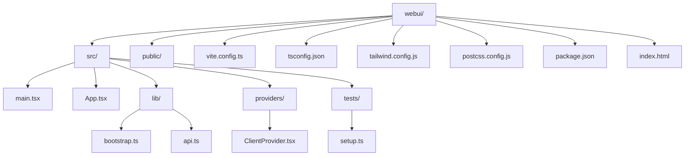
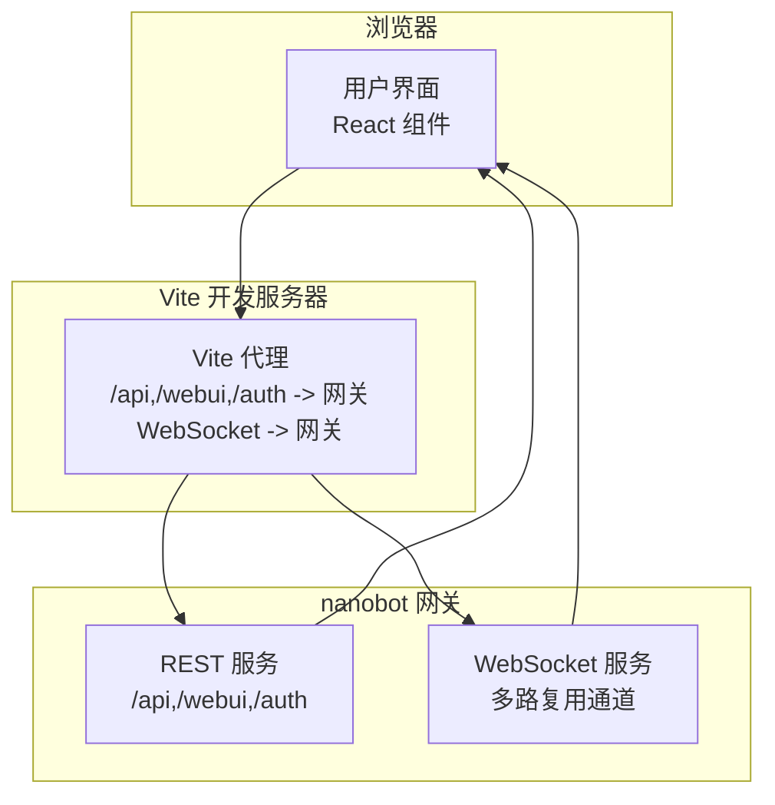
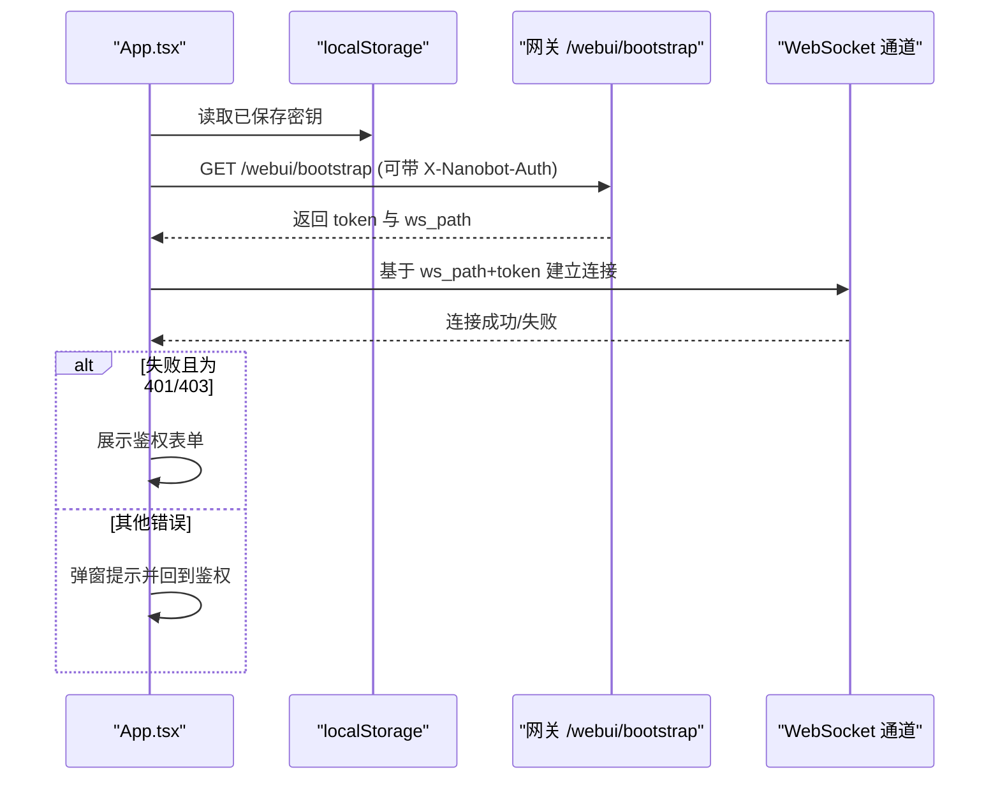
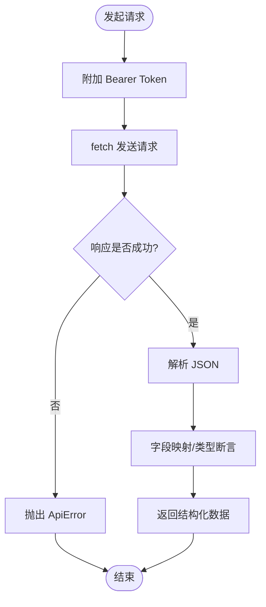
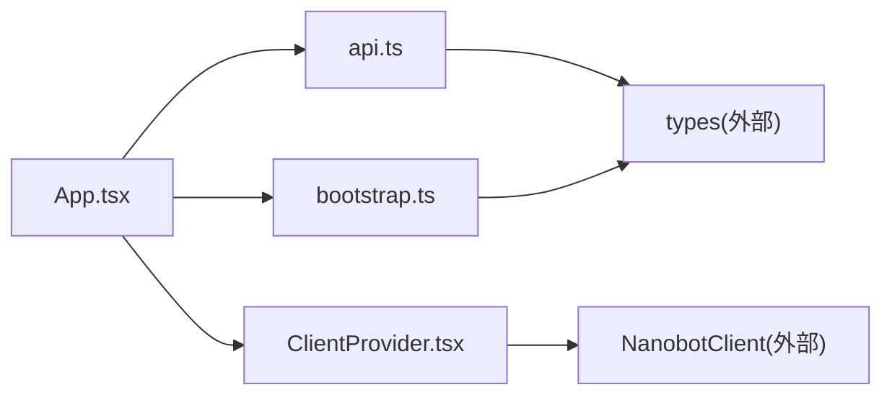

# 开发指南

<cite>
**本文引用的文件**
- [webui/package.json](file://webui/package.json)
- [webui/vite.config.ts](file://webui/vite.config.ts)
- [webui/tsconfig.json](file://webui/tsconfig.json)
- [webui/tsconfig.build.json](file://webui/tsconfig.build.json)
- [webui/tailwind.config.js](file://webui/tailwind.config.js)
- [webui/postcss.config.js](file://webui/postcss.config.js)
- [webui/README.md](file://webui/README.md)
- [webui/index.html](file://webui/index.html)
- [webui/src/main.tsx](file://webui/src/main.tsx)
- [webui/src/App.tsx](file://webui/src/App.tsx)
- [webui/src/lib/bootstrap.ts](file://webui/src/lib/bootstrap.ts)
- [webui/src/lib/api.ts](file://webui/src/lib/api.ts)
- [webui/src/providers/ClientProvider.tsx](file://webui/src/providers/ClientProvider.tsx)
- [webui/src/tests/setup.ts](file://webui/src/tests/setup.ts)
</cite>

## 目录
1. [简介](#简介)
2. [项目结构](#项目结构)
3. [核心组件](#核心组件)
4. [架构总览](#架构总览)
5. [详细组件分析](#详细组件分析)
6. [依赖关系分析](#依赖关系分析)
7. [性能考虑](#性能考虑)
8. [故障排查指南](#故障排查指南)
9. [结论](#结论)
10. [附录](#附录)

## 简介
本指南面向 WebUI 前端开发，覆盖从环境搭建、开发流程、测试策略到构建与部署的完整链路。WebUI 使用 Vite + React 18 + TypeScript + Tailwind 3 + shadcn/ui 技术栈，通过 WebSocket 多路复用协议与后端网关通信，并在同端口上提供嵌入式 REST 接口用于会话元数据读取。

## 项目结构
- 源码位于 webui 目录，构建产物输出至 ../nanobot/web/dist，由后端网关提供服务并与 Python 打包集成。
- 关键目录与文件：
  - 配置：vite.config.ts、tsconfig.json、tsconfig.build.json、tailwind.config.js、postcss.config.js
  - 启动入口：index.html、src/main.tsx、src/App.tsx
  - 核心逻辑：src/lib/bootstrap.ts（引导与鉴权）、src/lib/api.ts（REST 封装）、src/providers/ClientProvider.tsx（上下文）
  - 测试：src/tests/setup.ts、package.json 中的测试脚本

图表来源
- [webui/vite.config.ts:1-66](file://webui/vite.config.ts#L1-L66)
- [webui/tsconfig.json:1-33](file://webui/tsconfig.json#L1-L33)
- [webui/tailwind.config.js:1-120](file://webui/tailwind.config.js#L1-L120)
- [webui/postcss.config.js:1-7](file://webui/postcss.config.js#L1-L7)
- [webui/package.json:1-63](file://webui/package.json#L1-L63)
- [webui/index.html:1-187](file://webui/index.html#L1-L187)
- [webui/src/main.tsx:1-16](file://webui/src/main.tsx#L1-L16)
- [webui/src/App.tsx:1-450](file://webui/src/App.tsx#L1-L450)
- [webui/src/lib/bootstrap.ts:1-77](file://webui/src/lib/bootstrap.ts#L1-L77)
- [webui/src/lib/api.ts:1-187](file://webui/src/lib/api.ts#L1-L187)
- [webui/src/providers/ClientProvider.tsx:1-38](file://webui/src/providers/ClientProvider.tsx#L1-L38)
- [webui/src/tests/setup.ts:1-83](file://webui/src/tests/setup.ts#L1-L83)

章节来源
- [webui/README.md:21-26](file://webui/README.md#L21-L26)
- [webui/README.md:112-124](file://webui/README.md#L112-L124)

## 核心组件
- 应用入口与渲染
  - main.tsx：挂载 React 根节点，渲染 App 并引入全局样式与国际化初始化。
  - index.html：提供根容器、主题色、语言与启动动画等基础页面骨架。
- 应用主组件
  - App.tsx：负责引导流程（加载本地密钥、拉取网关引导信息、建立 WebSocket 连接）、状态管理（加载/鉴权/就绪）、视图切换（聊天/设置）与错误边界包裹。
- 引导与鉴权
  - bootstrap.ts：封装 /webui/bootstrap 获取短期令牌与 WS 路径；保存/清除本地密钥；根据当前页面推导 WS 地址。
- REST 客户端
  - api.ts：统一请求封装（带 Bearer 认证），提供会话列表、消息、删除、设置读取与更新、斜杠命令查询、模型探测等接口。
- 上下文提供者
  - ClientProvider.tsx：向子树注入 NanobotClient 实例、访问令牌与模型名，供各组件消费。

章节来源
- [webui/src/main.tsx:1-16](file://webui/src/main.tsx#L1-L16)
- [webui/index.html:1-187](file://webui/index.html#L1-L187)
- [webui/src/App.tsx:1-450](file://webui/src/App.tsx#L1-L450)
- [webui/src/lib/bootstrap.ts:1-77](file://webui/src/lib/bootstrap.ts#L1-L77)
- [webui/src/lib/api.ts:1-187](file://webui/src/lib/api.ts#L1-L187)
- [webui/src/providers/ClientProvider.tsx:1-38](file://webui/src/providers/ClientProvider.tsx#L1-L38)

## 架构总览
WebUI 采用“前端 SPA + 后端网关”的双层架构：
- 前端：Vite 提供开发服务器与构建打包，React 负责 UI 渲染，Tailwind 提供样式体系。
- 后端：nanobot 网关提供 REST 与 WebSocket 服务，WebUI 通过代理将 /api、/webui、/auth 与 WebSocket 请求转发到网关。

图表来源
- [webui/vite.config.ts:41-57](file://webui/vite.config.ts#L41-L57)
- [webui/src/lib/bootstrap.ts:33-58](file://webui/src/lib/bootstrap.ts#L33-L58)
- [webui/src/lib/api.ts:12-29](file://webui/src/lib/api.ts#L12-L29)

## 详细组件分析

### 引导与鉴权流程（App.tsx）
- 流程要点
  - 启动时尝试读取本地保存的密钥，调用 /webui/bootstrap 获取短期 token 与 ws_path。
  - 若返回 401/403，则进入鉴权表单；否则基于 ws_path 与 token 建立 WebSocket 连接。
  - 支持重新鉴权回调，刷新 token 并重建连接。
- 错误处理
  - 非鉴权类错误以弹窗提示，避免阻塞整体 UI。

图表来源
- [webui/src/App.tsx:109-157](file://webui/src/App.tsx#L109-L157)
- [webui/src/lib/bootstrap.ts:33-77](file://webui/src/lib/bootstrap.ts#L33-L77)

章节来源
- [webui/src/App.tsx:105-241](file://webui/src/App.tsx#L105-L241)
- [webui/src/lib/bootstrap.ts:1-77](file://webui/src/lib/bootstrap.ts#L1-L77)

### REST 客户端封装（api.ts）
- 设计原则
  - 统一添加 Authorization: Bearer token。
  - 敏感参数（如 API Key）通过请求头传递，避免出现在 URL 或历史记录中。
  - 对响应进行类型断言与字段映射，确保调用方获得结构化数据。
- 主要接口
  - 会话：列出、拉取消息、删除。
  - 设置：读取、更新（支持按字段增量更新）、探测第三方模型列表。
  - 命令：列出可用斜杠命令。

图表来源
- [webui/src/lib/api.ts:12-29](file://webui/src/lib/api.ts#L12-L29)
- [webui/src/lib/api.ts:37-60](file://webui/src/lib/api.ts#L37-L60)
- [webui/src/lib/api.ts:110-159](file://webui/src/lib/api.ts#L110-L159)

章节来源
- [webui/src/lib/api.ts:1-187](file://webui/src/lib/api.ts#L1-L187)

### Vite 开发与构建配置
- 开发服务器
  - 默认监听 127.0.0.1:5173，HMR 独占 5174，避免与网关 WebSocket 升级冲突。
  - 代理规则：/api、/webui、/auth 转发到网关；根路径仅对 WebSocket 升级放行，其他 GET 由 Vite 提供 SPA。
  - 可通过 NANOBOT_API_URL 环境变量自定义网关地址。
- 构建
  - 输出目录 ../nanobot/web/dist，清空旧产物；关闭 SourceMap。
- 测试
  - 使用 happy-dom 环境，全局注入 localStorage、crypto.randomUUID、window.alert 等垫片，统一语言环境。

章节来源
- [webui/vite.config.ts:5-66](file://webui/vite.config.ts#L5-L66)
- [webui/README.md:71-89](file://webui/README.md#L71-L89)
- [webui/README.md:112-124](file://webui/README.md#L112-L124)
- [webui/src/tests/setup.ts:1-83](file://webui/src/tests/setup.ts#L1-L83)

### TypeScript 与 Tailwind 配置
- TypeScript
  - 目标 ES2022，严格模式，启用 JSX react-jsx，路径别名 @/* 映射 src。
  - 构建配置 tsconfig.build.json 排除测试目录，仅保留 node 类型。
- Tailwind
  - 深色模式 class，内容扫描 index.html 与 src 下 TS/TSX 文件。
  - 自定义主题变量（颜色、圆角、动画）与插件（animate、typography）。

章节来源
- [webui/tsconfig.json:1-33](file://webui/tsconfig.json#L1-L33)
- [webui/tsconfig.build.json:1-8](file://webui/tsconfig.build.json#L1-L8)
- [webui/tailwind.config.js:1-120](file://webui/tailwind.config.js#L1-L120)
- [webui/postcss.config.js:1-7](file://webui/postcss.config.js#L1-L7)

## 依赖关系分析
- 组件耦合
  - App.tsx 作为顶层容器，依赖 bootstrap.ts 与 api.ts，向下通过 ClientProvider 注入 NanobotClient。
  - 组件间通过上下文共享客户端实例与令牌，降低跨层级传参复杂度。
- 外部依赖
  - React 18、Radix UI、Assistant UI、Tailwind、Recharts、i18n 等。
- 构建与测试
  - Vite + React 插件；TypeScript 编译与 Vite 打包；Vitest + happy-dom。

图表来源
- [webui/src/App.tsx:1-450](file://webui/src/App.tsx#L1-L450)
- [webui/src/lib/bootstrap.ts:1-77](file://webui/src/lib/bootstrap.ts#L1-L77)
- [webui/src/lib/api.ts:1-187](file://webui/src/lib/api.ts#L1-L187)
- [webui/src/providers/ClientProvider.tsx:1-38](file://webui/src/providers/ClientProvider.tsx#L1-L38)

章节来源
- [webui/package.json:14-61](file://webui/package.json#L14-L61)

## 性能考虑
- 构建优化
  - 生产构建关闭 SourceMap，减少体积与泄露风险。
  - 输出目录固定在 ../nanobot/web/dist，便于网关打包与缓存控制。
- 运行时优化
  - 在空闲时间预热 Markdown 渲染资源，提升首次渲染体验。
  - 使用 CSS 变量与 Tailwind 工具类，避免运行时样式计算开销。
- 网络与连接
  - WebSocket 连接按需建立，鉴权失败时及时回退到鉴权页，避免无意义重试。
  - 代理层区分 WebSocket 升级与普通 HTTP 请求，减少握手冲突与错误写入。

章节来源
- [webui/vite.config.ts:24-28](file://webui/vite.config.ts#L24-L28)
- [webui/src/App.tsx:159-179](file://webui/src/App.tsx#L159-L179)
- [webui/vite.config.ts:41-57](file://webui/vite.config.ts#L41-L57)

## 故障排查指南
- 开发环境无法启动或端口占用
  - 确认 Vite 端口 5173/5174 未被占用；必要时调整 strictPort 或更换端口。
- 代理转发异常
  - 检查 NANOBOT_API_URL 是否指向正确网关地址；确认 /api、/webui、/auth 与 WebSocket 升级路径可达。
- 鉴权失败
  - 确保 ~/.nanobot/config.json 中已启用 websocket 通道；若网关监听 0.0.0.0，需配置 token 或 tokenIssueSecret。
- 测试环境报错
  - 确认已安装依赖；happy-dom 需要垫片（localStorage、crypto.randomUUID、window.alert）已在 setup.ts 中注入。
- 国际化与主题
  - 页面语言与主题存储在 localStorage 中，清理后会回退默认值；检查 index.html 的语言与主题初始化逻辑。

章节来源
- [webui/README.md:85-111](file://webui/README.md#L85-L111)
- [webui/src/tests/setup.ts:1-83](file://webui/src/tests/setup.ts#L1-L83)
- [webui/index.html:80-172](file://webui/index.html#L80-L172)

## 结论
本指南提供了从环境搭建到构建部署的全链路实践建议。遵循本文档的开发与测试流程，结合 TypeScript 严格校验与 Tailwind 主题体系，可高效迭代 WebUI 功能，同时保持良好的可维护性与性能表现。

## 附录

### 开发环境搭建
- 安装与启动
  - 安装依赖：在 webui 目录执行安装命令。
  - 启动网关：在终端运行网关命令。
  - 启动前端：在 webui 目录执行开发命令。
  - 访问地址：默认 http://127.0.0.1:5173；可通过环境变量指定网关地址。
- 代理与端口
  - Vite 默认端口 5173，HMR 独占 5174；代理规则将 /api、/webui、/auth 与 WebSocket 转发到网关。

章节来源
- [webui/README.md:38-89](file://webui/README.md#L38-L89)
- [webui/vite.config.ts:29-57](file://webui/vite.config.ts#L29-L57)

### 开发工作流程
- 代码编写规范
  - 使用 TypeScript 严格模式；路径别名 @/* 指向 src；组件命名语义化。
  - 使用 Tailwind 工具类与主题变量，避免内联样式。
- 组件开发流程
  - 在 src/components 下新增功能组件；通过 ClientProvider 获取客户端实例与令牌。
  - 对外暴露清晰的 props 与最小依赖，必要时通过 hooks 封装业务逻辑。
- 测试策略
  - 使用 Vitest 与 happy-dom；在 setup.ts 中注入全局垫片。
  - 针对异步流程（如引导、设置更新）编写单元测试，覆盖成功与失败分支。

章节来源
- [webui/tsconfig.json:24-29](file://webui/tsconfig.json#L24-L29)
- [webui/tailwind.config.js:6-119](file://webui/tailwind.config.js#L6-L119)
- [webui/src/providers/ClientProvider.tsx:31-37](file://webui/src/providers/ClientProvider.tsx#L31-L37)
- [webui/src/tests/setup.ts:1-83](file://webui/src/tests/setup.ts#L1-L83)

### 构建与部署
- 生产构建
  - 在 webui 目录执行构建命令，产物写入 ../nanobot/web/dist。
  - 构建关闭 SourceMap，确保安全与体积。
- 部署准备
  - 确保网关已启用 websocket 通道；若监听 0.0.0.0，必须配置 token 或 tokenIssueSecret。
  - 将 dist 目录交由网关提供服务，随 Python 打包分发。

章节来源
- [webui/README.md:112-124](file://webui/README.md#L112-L124)
- [webui/vite.config.ts:24-28](file://webui/vite.config.ts#L24-L28)
- [webui/README.md:91-111](file://webui/README.md#L91-L111)

### 调试工具使用
- 浏览器开发者工具
  - 网络面板：观察 /api、/webui、/auth 与 WebSocket 升级请求；关注认证头与响应状态。
  - 控制台：查看引导与连接日志；定位鉴权失败原因。
- React DevTools
  - 分析组件树与状态变化；定位渲染热点与重复渲染问题。
- 网络调试
  - 利用代理规则验证请求是否正确转发；确认 WebSocket 路径与查询参数。

章节来源
- [webui/vite.config.ts:41-57](file://webui/vite.config.ts#L41-L57)
- [webui/src/lib/bootstrap.ts:60-77](file://webui/src/lib/bootstrap.ts#L60-L77)

### 代码质量保证
- ESLint
  - 通过脚本执行 lint，最大警告数限制为 0，确保持续集成质量门槛。
- Prettier
  - 与 ESLint 协同，统一代码风格；建议在编辑器中启用保存时格式化。
- TypeScript
  - 严格模式开启，禁用隐式 any；路径别名与模块解析配置确保导入一致性。

章节来源
- [webui/package.json:12](file://webui/package.json#L12)
- [webui/tsconfig.json:17-24](file://webui/tsconfig.json#L17-L24)
- [webui/tsconfig.json:24-29](file://webui/tsconfig.json#L24-L29)